# 二进制 Blaster 装配指南

> 原文：<https://learn.sparkfun.com/tutorials/binary-blaster-assembly-guide>

## 介绍

[Binary Blaster](https://www.sparkfun.com/products/12037) 是一款游戏，帮助教玩家如何用[二进制](https://learn.sparkfun.com/tutorials/binary)计数，以及在十进制(和十六进制)和二进制之间快速转换。它在 7 段显示屏上显示一个值，要求玩家以一种表示二进制等价的方式按下按钮。按下按钮来“设置”该位。留下一个按钮单独“清除”该位。有四个按钮，每个代表一个位。这意味着有 15 种可能性。如果玩家全部答对 15 题，他们就赢了！它还会显示一个时间分数，这样你就可以记录你的最快速度，并通过练习获得更快的速度！

该产品作为 PTH 焊接套件提供，由您将它们焊接在一起！你可以在这里购买完整的套件[。](https://www.sparkfun.com/products/12037)

[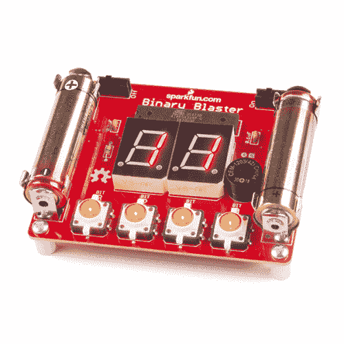](https://www.sparkfun.com/products/12037) 

将**添加到您的[购物车](https://www.sparkfun.com/cart)中！**

### [SparkFun 二进制爆能套装](https://www.sparkfun.com/products/12037)

[21 available](https://learn.sparkfun.com/static/bubbles/ "21 available") KIT-12037

二进制冲击波是一个游戏，旨在帮助教学什么是二进制数字，以及如何从十进制(和十六进制)转换成…

$29.505[Favorited Favorite](# "Add to favorites") 10[Wish List](# "Add to wish list")** **[https://www.youtube.com/embed/CQi_wD4I9ig/?autohide=1&border=0&wmode=opaque&enablejsapi=1](https://www.youtube.com/embed/CQi_wD4I9ig/?autohide=1&border=0&wmode=opaque&enablejsapi=1)

如果你是焊接新手，Binary Blaster PTH 套件是一个很好的起点。本组装指南将带您浏览套件中的每个组件，并向您展示如何将其焊接到位。

[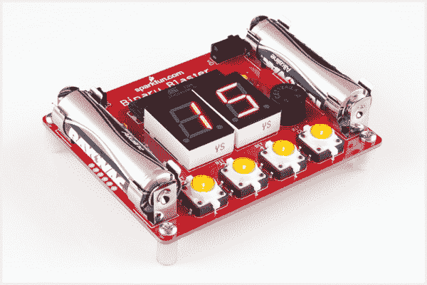](https://cdn.sparkfun.com/assets/7/9/3/1/4/Binary_Blaster_Hookup_Guide-33_1.jpg)*The assembled Binary Blaster PTH Kit*

### 必要的工具和用品

*   [烙铁](https://www.sparkfun.com/products/9507)
*   [焊接](https://www.sparkfun.com/products/10241)
*   [切刀](https://www.sparkfun.com/products/8794)

### 建议的额外工具和用品

*   [安全眼镜](https://www.sparkfun.com/products/11046)
*   [助焊剂笔](https://www.sparkfun.com/products/8967)
*   [焊芯](https://www.sparkfun.com/products/9327)
*   刷子(旧牙刷也可以)
*   去离子水清洗(或者你可以用自来水)

### 推荐阅读

如果您想了解更多关于 PTH 焊接的一般知识，我们建议您查看以下其他教程:

*   [如何进行通孔焊接](https://learn.sparkfun.com/tutorials/how-to-solder---through-hole-soldering)
*   [解码电阻标记](https://learn.sparkfun.com/tutorials/resistors/decoding-resistor-markings)
*   [二极管和 LED 极性](https://learn.sparkfun.com/tutorials/polarity/diode-and-led-polarity)
*   [电子组件-清洗](https://learn.sparkfun.com/tutorials/electronics-assembly/washing)
*   视频- [SparkFun 红外传感器概述](http://youtu.be/5_I5eIQsHq8)

## 快速入门-您的第一个组件

找到 10K &ohm;电阻器。它上面有特定的条纹图案:棕色、黑色、橙色、金色。

看起来是这样的:

注意，图案可以是相反的顺序；这仍然是正确的电阻。

要进一步了解电阻标记，请查看以下教程:[解码电阻标记](https://learn.sparkfun.com/tutorials/resistors/decoding-resistor-markings)

向下弯曲双腿。

找到电路板上 10K &ohm;电阻的位置。

[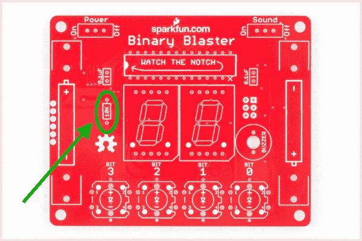](https://cdn.sparkfun.com/assets/c/7/6/4/f/Binary_Blaster_Hookup_Guide-01.jpg)

将电阻插入 PCB。请注意，这个组件没有极化，因此哪条腿进入每个孔并不重要。该套件上的一些组件是[极化的](https://learn.sparkfun.com/tutorials/polarity)，我们在接触它们时会格外小心，以确保它们正确插入。

[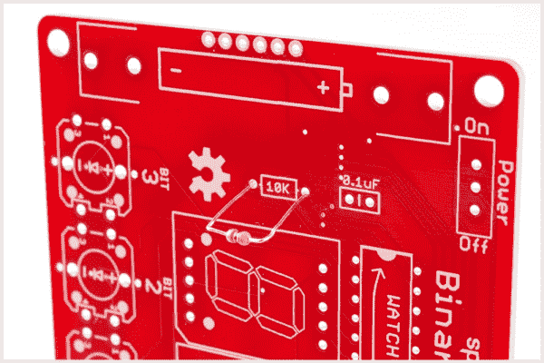](https://cdn.sparkfun.com/assets/c/d/7/0/9/Binary_Blaster_Hookup_Guide-02.jpg)

将电阻器推入，使其几乎与电路板齐平。

[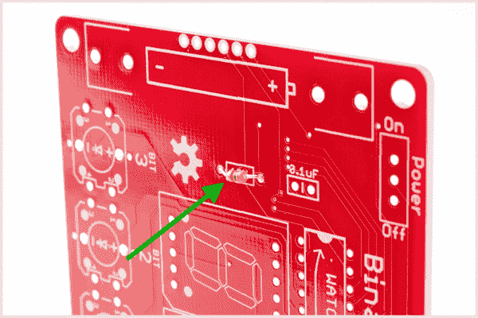](https://cdn.sparkfun.com/assets/d/0/d/1/f/Binary_Blaster_Hookup_Guide-03.jpg)

稍微向外弯曲双腿以保持其位置。

[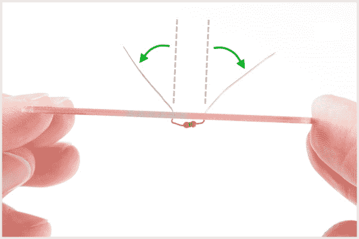](https://cdn.sparkfun.com/assets/7/a/8/1/e/Binary_Blaster_Hookup_Guide-04.jpg)

把板子翻过来。握住烙铁的“最佳位置”,使其接触到烙铁腿和金属环。保持 2 秒钟。

[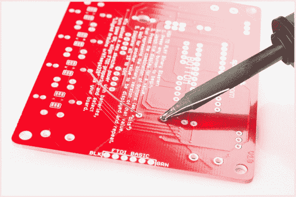](https://cdn.sparkfun.com/assets/c/3/0/d/9/Binary_Blaster_Hookup_Guide-05.jpg)

将焊料注入接缝处。

[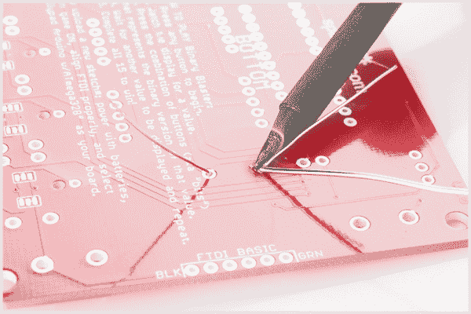](https://cdn.sparkfun.com/assets/1/9/7/0/f/Binary_Blaster_Hookup_Guide-06.jpg)

首先，拉开焊料。

[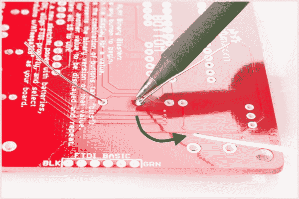](https://cdn.sparkfun.com/assets/f/5/3/f/a/Binary_Blaster_Hookup_Guide-07.jpg)

第二，拉开铁棍。

[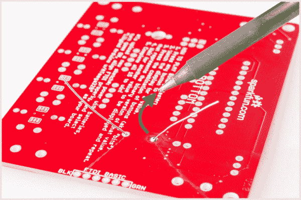](https://cdn.sparkfun.com/assets/4/4/1/9/b/Binary_Blaster_Hookup_Guide-08.jpg)

你的焊点应该是这样的:

[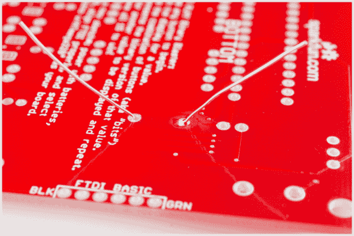](https://cdn.sparkfun.com/assets/3/c/d/d/c/Binary_Blaster_Hookup_Guide-09.jpg)

剪掉多余的腿。

[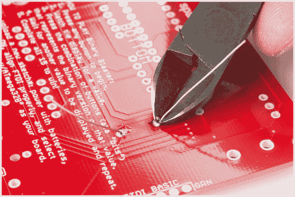](https://cdn.sparkfun.com/assets/f/4/8/5/6/Binary_Blaster_Hookup_Guide-10.jpg)

## 电容器

找到两个 0.1uF 电容。这些看起来和电阻有点不同。它们有两条引线，从元件底部引出，上面有标记“104”。还要注意，底部可能有一些其他的字母，如“K5M”

它们看起来像这样:

找到它们在 PCB 上的位置:

[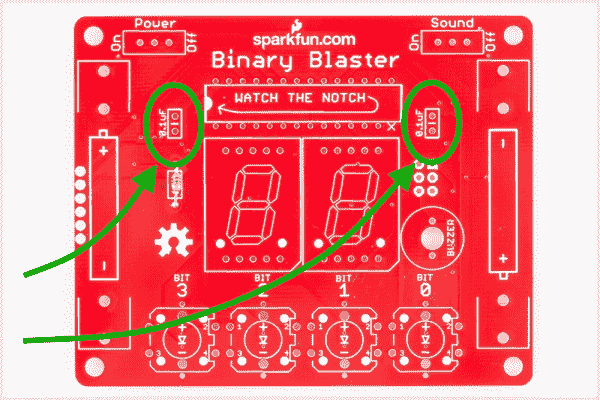](https://cdn.sparkfun.com/assets/2/d/0/d/d/Binary_Blaster_Hookup_Guide-11.jpg)

确保它们与 PCB 表面齐平并直立。将它们焊接到位，并修剪接入导线长度。当你把这些焊接到位后，你的电路板应该是这样的:

[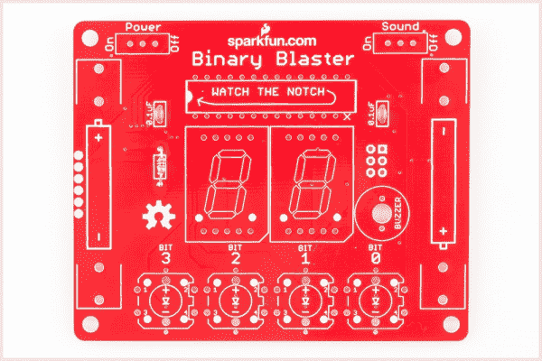](https://cdn.sparkfun.com/assets/f/6/a/a/7/Binary_Blaster_Hookup_Guide-12_1.jpg)

## 微控制器

找到微控制器。这个特殊的微控制器是一个 ATmega328。这个元件是极化的，这意味着我们需要格外小心地将其正确放置在电路板上。注意缺口:

现在，找到 PCB 上的位置。同样，请注意 PCB 白色油墨中的类似凹口符号:

[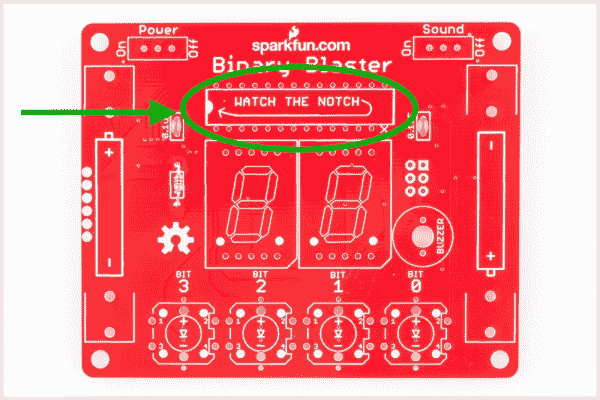](https://cdn.sparkfun.com/assets/b/0/d/3/8/Binary_Blaster_Hookup_Guide-12-1.jpg)

小心对齐槽口，将 ATmega328 放入 PCB。焊接第一个引脚(可以是你选择的任何引脚)时，确保元件与 PCB 齐平。

当你焊接完这个组件后，电路板的底部应该是这样的——一排整齐的火山:

[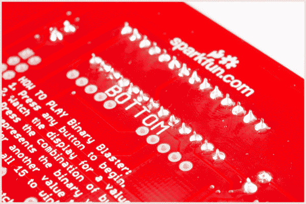](https://cdn.sparkfun.com/assets/3/b/7/d/6/Binary_Blaster_Hookup_Guide-14.jpg)

## 蜂鸣器和开关

找到[蜂鸣器](https://www.sparkfun.com/products/7950)和[滑动开关](https://www.sparkfun.com/products/102):

[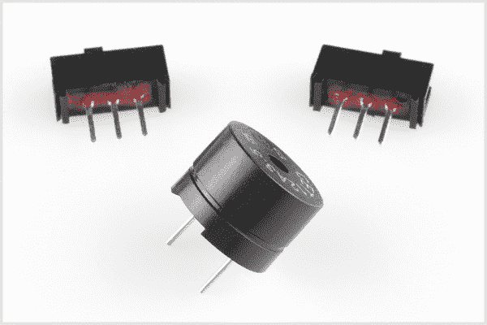](https://cdn.sparkfun.com/assets/1/9/3/d/5/52b064d1757b7f8a788b456a.jpg)

找到 PCB 上的位置:

[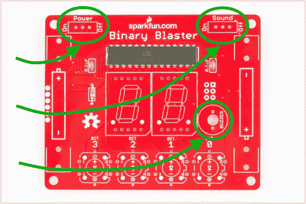](https://cdn.sparkfun.com/assets/8/0/8/8/d/Binary_Blaster_Hookup_Guide-15.jpg)

将您的元件放置在 PCB 中。翻转过来，焊接到位。完成后，您的 PCB 看起来应该是这样的:

[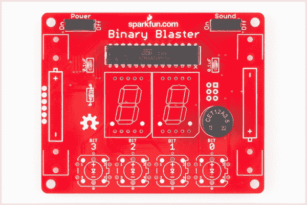](https://cdn.sparkfun.com/assets/4/c/f/c/9/Binary_Blaster_Hookup_Guide-16_1.jpg)**Note:** The buzzer has a polarity marker but it should not matter when soldered on the board. The buzzer will still function regardless of the orientation. If you would like to follow along with the guide feel free to insert the buzzer into the PCB by having the "+" close to the "BIT 0" silkscreen as indicated in the image.

If you happen to solder the buzzer differently but wanted to follow the guide, you can rework the board by heating both through holes with your soldering iron and carefully remove the component from the through hole. Using a solder sucker or the [slap method](https://www.sparkfun.com/tutorials/339), remove any remaining solder on the PTH pads. After removing any excess solder from the pins, insert buzzer back into through holes with the orientation based on the guide before soldering the pins again. When reworking PTH components, there is a risk of pulling pads so make sure to fully heat the solder joints!

## 点亮按钮

找到 4 个 [LED 触摸按钮](https://www.sparkfun.com/products/10442):

[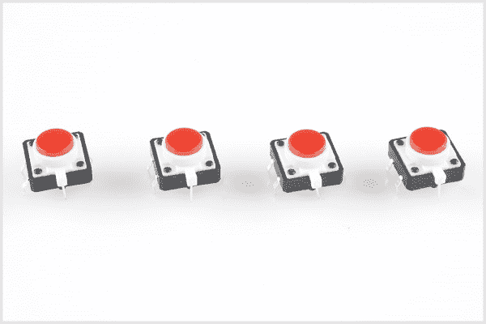](https://cdn.sparkfun.com/assets/6/3/3/f/0/Binary_Blaster_Hookup_Guide-17.jpg)

这些按钮是极化的。请注意白色塑料支腿顶部的小“+”号:

[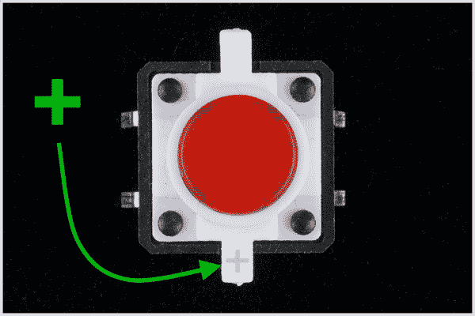](https://cdn.sparkfun.com/assets/f/9/4/4/4/Binary_Blaster_Hookup_Guide-18.jpg)

找到 PCB 上的 4 个位置:

[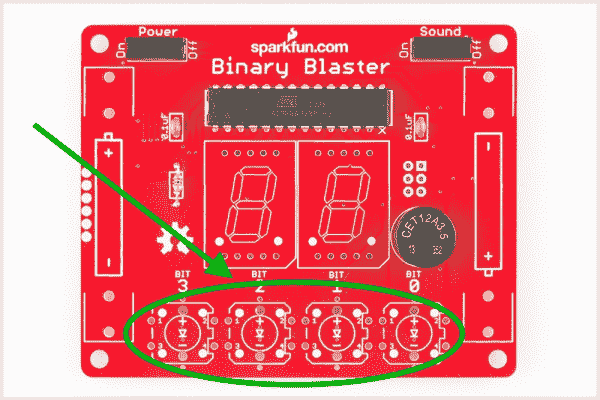](https://cdn.sparkfun.com/assets/0/f/1/c/b/Binary_Blaster_Hookup_Guide-16-1.jpg)

注意 PCB 上的极性标记。确保按钮上的“+”侧与 PCB 上的“+”标记对齐:

[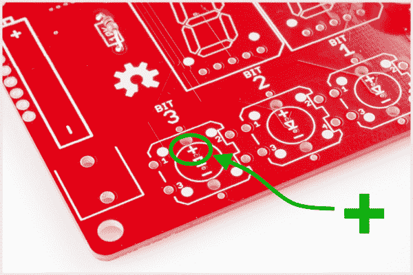](https://cdn.sparkfun.com/assets/e/1/8/f/9/Binary_Blaster_Hookup_Guide-19.jpg)

焊接到位。完成后，您的板应该看起来像这样:

[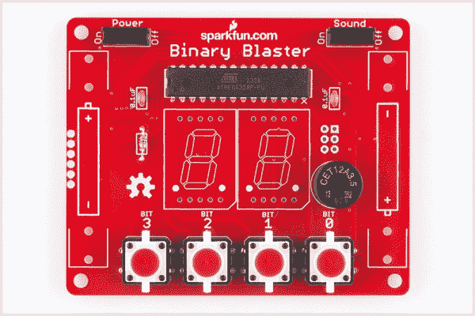](https://cdn.sparkfun.com/assets/e/f/1/2/d/Binary_Blaster_Hookup_Guide-20.jpg)

## 7 段显示器

找到 2 个 [7 段显示器](https://www.sparkfun.com/products/8546):

[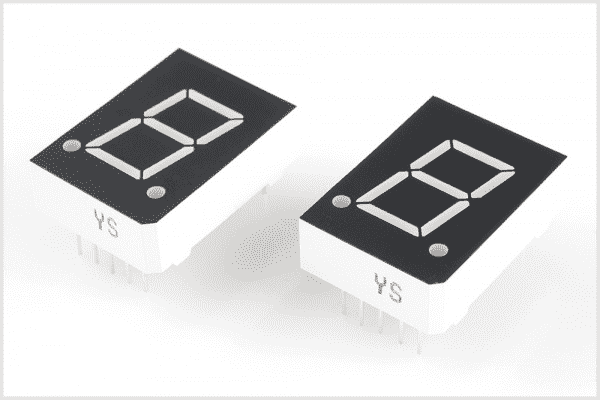](https://cdn.sparkfun.com/assets/0/3/6/4/d/Binary_Blaster_Hookup_Guide-21.jpg)

这些显示器是偏振的。注意数字下面的小数点:

[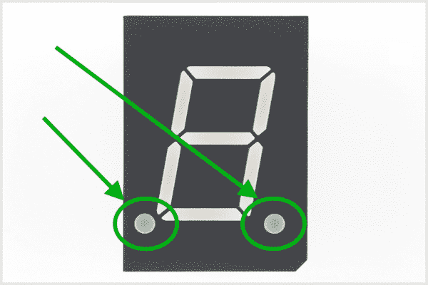](https://cdn.sparkfun.com/assets/c/f/1/d/e/Binary_Blaster_Hookup_Guide-22.jpg)

找到 PCB 上的两个位置:

[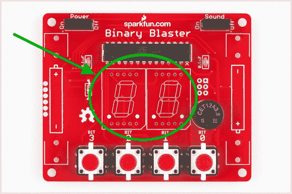](https://cdn.sparkfun.com/assets/b/e/6/f/2/Binary_Blaster_Hookup_Guide-23.jpg)

注意 PCB 上的极性标记。确保显示器上的小数点与 PCB 上的十进制标记对齐。焊接到位。完成后，您的板应该看起来像这样:

[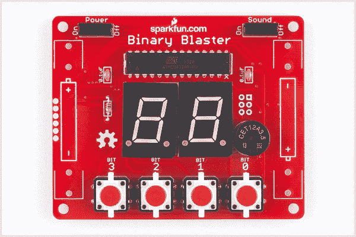](https://cdn.sparkfun.com/assets/5/a/9/6/0/Binary_Blaster_Hookup_Guide-24_1.jpg)

## 电池夹

找到 4 个[电池夹](https://www.sparkfun.com/products/7949):

找到 PCB 上的 4 个位置:

[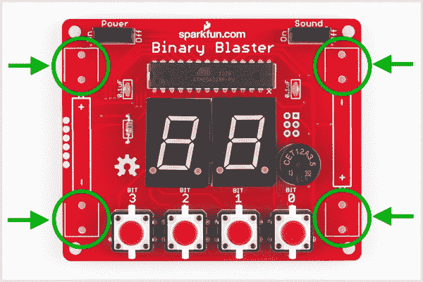](https://cdn.sparkfun.com/assets/9/5/c/1/4/Binary_Blaster_Hookup_Guide-24-1.jpg)

注意，这些部件是极化的，必须焊接进去，使背面朝外。如果放置不当，电池就不合适。确保它们齐平，并且背面朝外:

[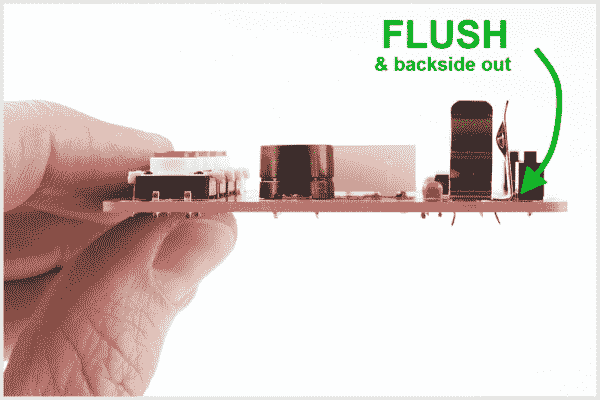](https://cdn.sparkfun.com/assets/1/2/e/d/a/Binary_Blaster_Hookup_Guide-25.jpg)

焊接到位。完成后，您的板应该看起来像这样:

[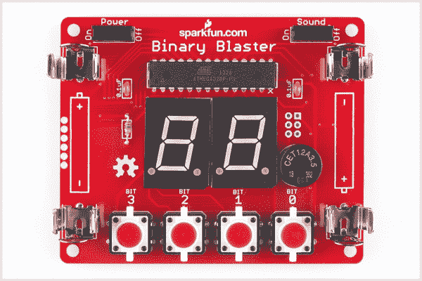](https://cdn.sparkfun.com/assets/9/3/a/b/3/Binary_Blaster_Hookup_Guide-26_1.jpg)

## 僵局

找到 4 个[塑料支座](https://www.sparkfun.com/products/10461)和 4 个[金属螺钉](https://www.sparkfun.com/products/10453):

注:你不需要螺丝刀将这些放入印刷电路板。用手拧紧就足够了。

安装好支架后，您的二进制 Blaster 应该平放在桌子上:

[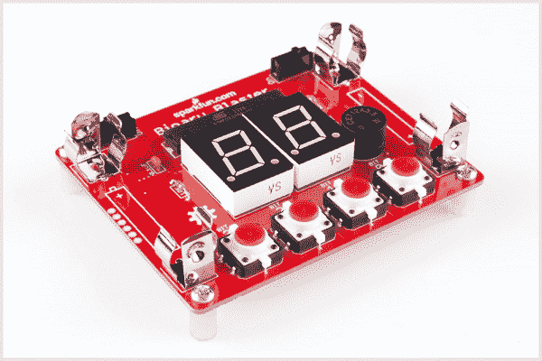](https://cdn.sparkfun.com/assets/a/8/8/e/3/Binary_Blaster_Hookup_Guide-28.jpg)

## 电池

找到两节 [AA 电池](https://www.sparkfun.com/products/9100):

这些是极化的，所以确保正确对齐“+”和“-”侧:

[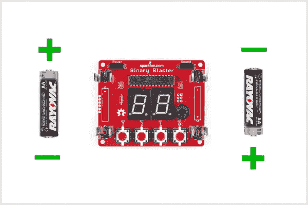](https://cdn.sparkfun.com/assets/6/c/8/b/a/Binary_Blaster_Hookup_Guide-26-batteries.jpg)

将电池放入夹子中，打开电源检查电池是否正确插入。您应该看到 LED 触摸按钮亮起，表明电池已正确插入，您的二进制 Blaster 正在通电。

## 游戏怎么玩

首先，打开你的二进制 Blaster。电源滑动开关位于 PCB 的左上方。向左滑动到“开”的位置。

你可能还想检查一下声音开关。你可以向左或向右滑动，这取决于你是否想播放声音。

如果什么都没发生，可能是你的电池放置不正确。请确保再次检查极性。

当您第一次打开二进制 Blaster 电源时，您应该注意到按钮从右到左快速亮起，然后显示器开始闪烁圆形图案。这些闪烁是“启动”的一部分，以确保 led 和显示器正常工作。

当显示器闪烁圆形图案时，您的二进制爆能器准备开始新游戏。

要开始新游戏，只需按下其中一个按钮。

显示屏现在将显示您的第一个值。注意，这可能每次都不一样。

现在，您必须按下四个按钮上的二进制等价物。这里有一个图表可以帮助你开始:

"1" = 0001

"2" = 0010

"3" = 0011

"4" = 0100

"5" = 0101

"6" = 0110

"7" = 0111

"8" = 1000

"9" = 1001

"10" = 1010

"11" = 1011

"12" = 1100

"13" = 1101

"14" = 1110

"15" = 1111

这里有几个例子来说明按钮是如何工作的。

#### 示例 1:

如果您在显示屏上看到数字“1”，那么您必须按下相应的二进制数，即“0001”。这意味着您必须按下“位 0”按钮(这是最右边的按钮)。另外三个按钮也一定不要动(不要按！)这样，您只设置了“位 0”(也就是使其为“1”而不是保留为“0”)。

#### 示例 2:

如果您在显示屏上看到数字“2”，那么您必须按下相应的二进制数，即“0010”。这意味着您必须按下“位 1”按钮(这是中间右侧的按钮)。这样，你就设置了这个位(也就是让它成为“1”而不是“0”)。

#### 示例 3:

如果您在显示屏上看到数字“5”，那么您必须按下相应的二进制数，即“0101”。这意味着**您必须同时按下“位 0”和“位 2”按钮**。

如果你没有在几秒钟内按下正确的值，二进制爆能器将超时，这实际上意味着你已经输了这一轮。要启动另一个，只需按下任何按钮。

当您按下正确的二进制等效值时，您将移动到下一个随机值。总共有 15 个。一旦你转换所有 15(没有超时)你就赢了！

每次你开始一个新游戏，顺序都会不同。这样做是为了帮助鼓励学习转化，而不是模式的肌肉记忆。此外，当您完成所有 15 种可能性时，显示屏会显示您的“分数”。这是你完成游戏所用的秒数。随着你练习你的转换，你应该能够得到这个数字越来越低。祝你好运！！

当你掌握了默认的播放模式(十进制转换)，你可能想挑战自己从十六进制记数法转换成二进制。在十六进制模式下，您的二进制增强器将以十六进制显示值 10-15。请注意，较低的值(1-9)仍将显示为十进制值，因为它们在两种值表示法中是相同的。

### 十六进制模式

**要以十六进制模式播放，请遵循以下三个步骤:**

(1)关闭二进制 Blaster。

(2)按住“BIT 0”按钮。

(3)继续按住“BIT 0”按钮，再次打开二进制 Blaster。你应该看到显示屏上显示“A b C d E F”。您现在处于十六进制模式。要返回默认十进制模式，只需重启电源，无需按下任何按钮。

下面是一个十六进制图表，可以帮助您开始:

"1" = 0001

"2" = 0010

"3" = 0011

"4" = 0100

"5" = 0101

"6" = 0110

"7" = 0111

"8" = 1000

"9" = 1001

“A”= 1010

“b”= 1011

“C”= 1100

“d”= 1101

“E”= 1110

“F”= 1111

我们希望你喜欢你的二进制冲击波。经过一点练习后，请随意在本教程的讨论区张贴您的最佳得分。感谢你对 SparkFun 的支持，祝你爆破二进制值玩得开心！

## 故障排除按钮

你的一个按钮没有亮吗？不要烦恼，有一个简单的方法来解决它！LED 故障最常见的原因是极性不正确。我们在二进制 Blaster PCB 中设计了一个特殊的技巧来解决这个问题。您可以简单地切断两条走线，并闭合两条跳线。这将交换极性，而不必移除按钮。

首先，找到正在排除故障的按钮旁边的焊接跳线。每个按钮有两个跳线。它们位于 PCB 的底部，靠近每个按钮。

[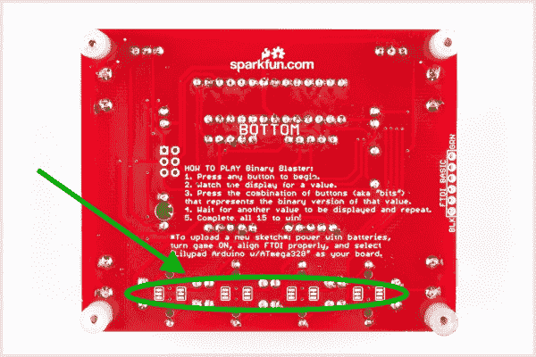](https://cdn.sparkfun.com/assets/8/d/8/9/c/Binary_Blaster_Hookup_Guide-32.jpg)

每个跳线都有一条小走线将中间焊盘连接到默认极性设置。微小的痕迹有时很难看到，但它是一条细金属带，应该显示为较浅的红色。使用[业余爱好刀](https://www.sparkfun.com/products/9200)(又名 x-acto 刀)，切割默认痕迹:

[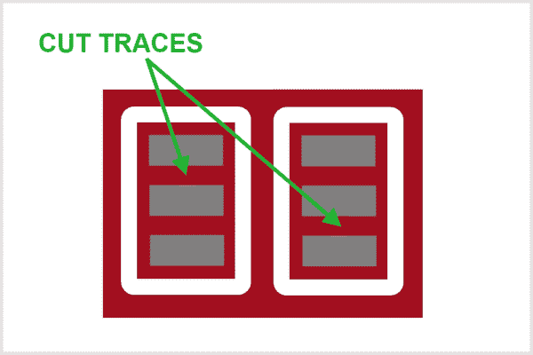](https://cdn.sparkfun.com/assets/7/9/6/3/e/52c1e52ece395faf088b4567.jpg)

使用烙铁，在中间焊盘和另一个外部焊盘之间连接一根跳线:

[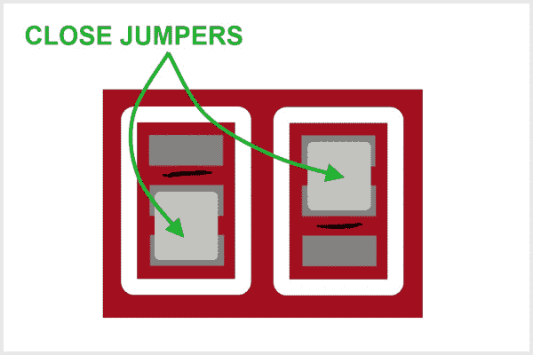](https://cdn.sparkfun.com/assets/1/6/b/6/3/52c1e51ace395f080c8b4568.jpg)

现在，连接到该 LED 的走线极性应该交换，您的 LED 应该亮起。

## 资源和更进一步

如果您想进一步了解二进制 Blaster 设计的工作原理，查看设计文件是一个不错的起点。您可以从 GitHub 仓库获得完整的硬件和固件文件，网址是:

*   [Binary Blaster GitHub Repo](https://github.com/sparkfun/Binary_Blaster)

你的二进制爆能游戏可以用 Arduino 重新编程。这意味着你可以改变游戏规则，增加更多的功能，或者把它变成一个完全不同的项目。有关如何使用 Arduino 重新编程的更多信息，请查看以下教程:

*   什么是 Arduino？

如果你想要更多的焊接，这里有一些其他有趣的 PTH 焊接套件的建议:

*   [西蒙倾斜通孔焊接套件](https://www.sparkfun.com/products/12634)

[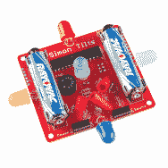](https://www.sparkfun.com/products/12634)

*   [时钟](https://www.sparkfun.com/products/10930)

[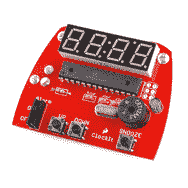](https://www.sparkfun.com/products/10930)

*   [西蒙说-通孔焊接套件](https://www.sparkfun.com/products/10547)

要查看我们网站上提供的所有套件，请在 SparkFun 网站上查看我们的[套件类别](https://www.sparkfun.com/categories/157)。

如果你有兴趣了解更多关于编写代码的知识，一个好的起点是完成 [SparkFun Inventors Kit](https://www.sparkfun.com/products/12001) 中的示例电路。

[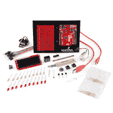](https://www.sparkfun.com/products/11576)

二进制增强器附带的微控制器实际上可以用 Arduino 重新编程。这是相同的微控制器是用在红板 SIK。这意味着，如果你愿意，你可以使用在 SIK 中学到的技能来修改你的二进制爆能器。例如，你可以改变游戏的玩法，或者将它用于一个完全不同的项目！**