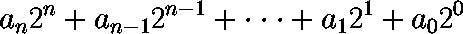
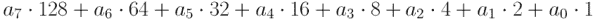
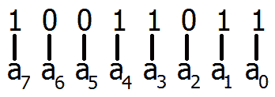
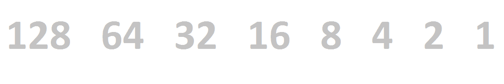
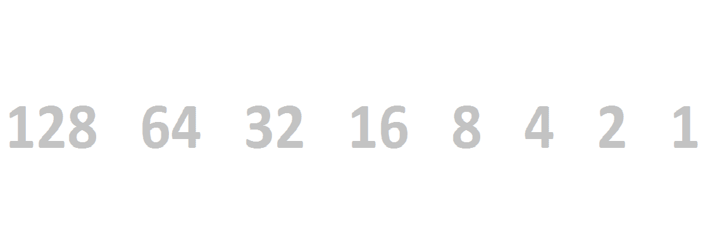

# 二进制的

> 原文：<https://learn.sparkfun.com/tutorials/binary>

## 1 和 0 的 ABC

准备好粉碎你对现实的感知吧。你曾经认为你知道的像数字这样简单的事情都将改变。你一直认为拥有 100 多岁就意味着拥有这么多:

[](//cdn.sparkfun.com/assets/d/8/4/4/0/51140518ce395f507e000009.png)

实际上，它只意味着有这么多:

[](//cdn.sparkfun.com/assets/a/8/9/c/6/51140518ce395f4e7e000002.png)

不，[罗德·瑟林的](http://www.youtube.com/watch?v=cxf_Dvy0VLs)不打算进入画面，你也没有吞下任何[红丸](http://en.wikipedia.org/wiki/Red_pill)。你已经进入了二进制区域，并且刚刚遇到了基数系统。

### 数系和基数

数系是我们用来表示数字的方法。从小学开始，我们就一直生活在一个以 10 为基数的数字系统的舒适范围内，但是还有很多其他的系统。基数 2，基数 8，基数 16，基数 20，基数...你明白了。有无数种基数系统，但只有少数对电气工程特别重要。

真正流行的数字系统甚至有自己的名字。例如，十进制通常被称为十进制数系统。我们今天要讨论的基数为 2 的二进制，也被称为**二进制**。另一种流行的数字系统，以 16 为基数，被称为十六进制的**。**

 **一个数的底数通常由一个带下标的整数表示。所以在上面的介绍中，第一个图像实际上是 100 个 [10] 的人，而第二个图像是 100 个 [2] 的人。当有任何可能的歧义时，这是指定一个数的基数的简便方法。

### 为什么是二进制？

你问为什么是二进制？为什么是十进制？我们一直以来都在使用十进制，并且认为我们选择十进制来满足日常数字需求是理所当然的。也许是因为我们有 10 个手指，或者也许只是因为罗马人把它强加给他们古老的臣民。不管是什么导致了它，我们一路上学到的技巧已经在我们心中巩固了十进制的地位；每个人都能以 10 为单位计数。我们甚至把大数字四舍五入到最接近 10 的倍数。我们痴迷于 10！

计算机和电子产品在手指和脚趾部门相当有限。在最底层，它们实际上只有两种方式来表示任何事物的状态:开或关，高或低，1 或 0。因此，几乎所有的电子设备都依赖以 2 为基数的数字系统来存储、操作和计算数字。

电子学对二进制数的高度依赖意味着了解以 2 为基数的数字系统的工作原理是很重要的。你通常会在计算机程序中遇到二进制或它的表亲，比如十六进制。分析[数字逻辑](https://learn.sparkfun.com/tutorials/digital-logic)电路和其他非常低级的电子设备也需要大量使用二进制。

在本教程中，你会发现你可以对十进制数做的任何事情也可以对二进制数做。对二进制数进行一些运算可能更容易(尽管其他运算可能更痛苦)。我们将在本教程中涵盖所有这些以及更多内容。

### 推荐阅读

我们已经深入到概念仓了。本教程的很多内容都建立在数学概念上，如加、乘、除(包括余数)和指数。

不需要以前的电子学知识(除了知道十进制系统如何工作，大多数人都知道)，但是我们确实观察了二进制是如何在 [Arduino](https://learn.sparkfun.com/tutorials/what-is-an-arduino) 编程中使用的，并且知道一些关于[数据类型](https://learn.sparkfun.com/tutorials/data-types-in-arduino)的知识可能会派上用场。此外，[数字逻辑](https://learn.sparkfun.com/tutorials/digital-logic)的知识将有助于补充所有这些二进制业务。

## 计数和转换

每个数字系统的基数也叫做**基数**。十进制数的基数是十，二进制数的基数是二。基数决定了需要多少不同的符号来充实一个数字系统。在我们的十进制数字系统中，我们有 10 个数字表示从零到十几的数值:0、1、2、3、4、5、6、7、8 和 9。这些符号中的每一个都代表了一个非常具体的标准值。

在二进制中，我们只允许两个符号:0 和 1。但是使用这两个符号，我们可以创建十进制系统可以创建的任何数字。

### 二进制计数

你可以不停地用十进制数，甚至在睡觉的时候也可以，但是你怎么用二进制数呢？二进制中的 0 和 1 应该看起来很熟悉:0 和 1。从那里开始，事情变得明显的二进制。

请记住，我们只有这两位数字，因此，正如我们在十进制中所做的那样，当我们用完符号时，我们必须向左移动一列，添加一个 *1* ，并将所有数字向右转换为 0。所以 1 之后我们得到 10，然后 11，然后 100。让我们开始数数...

| **Decimal** | **二进制** | ... | **Decimal** | **二进制** |
| Zero | Zero |  | Sixteen | ten thousand |
| one | one |  | Seventeen | Ten thousand and one |
| Two | Ten |  | Eighteen | Ten thousand and ten |
| three | Eleven |  | Nineteen | Ten thousand and eleven |
| four | One hundred |  | Twenty | Ten thousand one hundred |
| five | One hundred and one |  | Twenty-one | Ten thousand one hundred and one |
| six | One hundred and ten |  | Twenty-two | Ten thousand one hundred and ten |
| seven | One hundred and eleven |  | Twenty-three | Ten thousand one hundred and eleven |
| eight | One thousand |  | Twenty-four | Eleven thousand |
| nine | One thousand and one |  | Twenty-five | Eleven thousand and one |
| Ten | One thousand and ten |  | Twenty-six | Eleven thousand and ten |
| Eleven | One thousand and eleven |  | Twenty-seven | Eleven thousand and eleven |
| Twelve | One thousand one hundred |  | Twenty-eight | Eleven thousand one hundred |
| Thirteen | One thousand one hundred and one |  | Twenty-nine | Eleven thousand one hundred and one |
| Fourteen | One thousand one hundred and ten |  | Thirty | Eleven thousand one hundred and ten |
| Fifteen | One thousand one hundred and eleven |  | Thirty-one | Eleven thousand one hundred and eleven |

这是不是开始描绘画面了？让我们看看如何将这些二进制数转换成十进制数。

### 将二进制转换成十进制

没有一种方法可以将二进制转换成十进制。我们将在下面概述两种方法，一种更“数学”的方法，另一种更[可视化](#bin-dec-2)。我们将讨论这两者，但是如果第一个使用了太多丑陋的术语，就跳到第二个。

#### 方法 1

有一个方便的函数可以用来将任何二进制数转换成十进制数:

[](//cdn.sparkfun.com/assets/5/b/b/6/c/5113f981ce395f827e000002.png)

这个等式有四个重要元素:

*   一个 [n] ，一个 [n-1] ，一个 [1] 等等。，是一个数的**位数**。这些是你熟悉的 *0* 和 *1* ，但是在二进制中它们只能是**0 或*1*。**
*   观察数字的**位置**也很重要。位置从最右边的数字 0 开始；这个 *1* 或 *0* 是最低有效的**。您向左移动的每个数字的重要性都会增加，并且位置也会增加 1。**
***   二进制数的**长度**由 *n* 的值给出，实际上是 *n+1* 。例如，像 101 这样的二进制数的长度是 3，更大的数字，如 10011110 的长度是 8。*   每个数字都乘以一个**权重**:2 个 ^(n 个)，2 个 ^(n-1 个)，2 个 ^(1 个)等等。最右边的权重- 2 ⁰ 等于 1，向左移动一位，权重变成 2，然后是 4、8、16、32、64、128、256、...等等等等。**二的幂**对二进制非常重要，它们很快变得非常熟悉。**

 **让我们去掉那些 *n* 和指数，在八个位置上实现我们的二进制位置符号方程:

[](//cdn.sparkfun.com/assets/b/7/f/3/f/5113fab4ce395ff87d000003.png)

更进一步，让我们为数字插入一些值。如果你有一个二进制数，比如:10011011，会怎么样？这将意味着 a [n] 的值为:

[](//cdn.sparkfun.com/assets/e/5/f/6/7/5113fd0dce395f517e000004.png)

出于本教程的考虑，假设最右边的值总是最不重要的值。数字中的最低有效位是对数字的最终值影响最小的数字。这些数字的意义是任意的——这是一种叫做**字节序**的惯例的一部分。一个二进制数可以是*大*-字节序，其中最重要的数字是最左边的，或者是*小*-字节序，我们将在本教程中使用(你通常会看到二进制数这样写)。

现在，把这些数字代入二进制到十进制的等式。因为我们的数字是小端的，所以最小的值应该乘以最小的权重。

```
 1 * 2⁷ + 0 * 2⁶ + 0 * 2⁵ + 1 * 2⁴ + 1 * 2³ + 0 * 2² + 1 * 2¹ + 1 * 2⁰
```

我们可以简化它，找到我们的十进制数:

```
= 1 * 128 + 0 * 64 + 0 * 32 + 1 * 16 + 1 * 8 + 0 * 4 + 1 * 2 + 1 * 1
= 128 + 16 + 8  + 2 + 1
= 155 
```

你会很快注意到，用二进制表示一个数字比用十进制表示要多得多，但是只用两位数就完成了！

#### 方法 2

另一种更直观的将二进制数转换成十进制数的方法是将每个 *1* 和 *0* 分类到一个 bin 中。每个容器都有一个连续的 2 次方的权重，1，2，4，8，16，...我们已经习惯了。在八个地方执行它看起来会像这样:

| One hundred and twenty-eight | Sixty-four | Thirty-two | Sixteen | eight | four | Two | one |

因此，如果我们将 10011011 二进制数分类到这些箱中，它将看起来像这样:

| One hundred and twenty-eight | Sixty-four | Thirty-two | Sixteen | eight | four | Two | one |
| one | Zero | Zero | one | one | Zero | one | one |

对于其中有二进制值 *0* 的每个 bin，只需划掉并删除它。

| **128** | 64 | 32 | **16** | **8** | 4 | **2** | **1** |
| one | Zero | Zero | one | one | Zero | one | one |

然后把剩下的重量加起来，得到你的数字！

[](//cdn.sparkfun.com/assets/0/0/6/b/2/512e37d8ce395ff214000000.gif)

### 从十进制转换为二进制

就像从二进制转换成十进制一样，十进制转换成二进制的方法不止一种。第一个使用除法和余数，[第二个](#dec-bin-2)使用减法。两个都试试，或者坚持一个你觉得舒服的！

#### 方法 1

将十进制数转换成二进制数并不那么简单。这种转换需要重复地将十进制数除以 2，直到你将它减少到零。每次你除法运算的余数都会变成你正在创建的二进制数中的一个数字。

不记得怎么做余数了？如果已经过了一段时间，请记住，因为我们除以 2，**如果被除数是偶数**，余数将是 0；一个**奇数红利意味着 1** 的余数。

例如，要将 155 转换为二进制，您需要完成以下过程:

```
155 ÷ 2 = 77 R 1 (That’s the right-most digit, 1st position)
 77 ÷ 2 = 38 R 1 (2nd position)
 38 ÷ 2 = 19 R 0 (3rd position)
 19 ÷ 2 =  9 R 1
  9 ÷ 2 =  4 R 1
  4 ÷ 2 =  2 R 0
  2 ÷ 2 =  1 R 0
  1 ÷ 2 =  0 R 1 (8th position) 
```

第一个余数是最不重要的(最右边的)数字，所以从上到下读，从右到左充实我们的二进制数: **10011011** 。把它和上面的例子匹配起来...这是一个宾果！

#### 方法 2

如果除法和寻找余数不是你的事情，可能有一个更简单的方法将十进制转换成二进制。首先找出仍然小于十进制数的 2 的最大幂，然后从十进制数中减去它。然后，继续减去 2 的最大可能幂，直到你到达零。每个被减去的重量位置，得到一个二进制的 *1* 数字；没有被减去的数字得到一个 *0* 。

继续我们的例子，155 可以用 128 减去，得到 27:

| 155 - 128 = 27 |
| **128** | Sixty-four | Thirty-two | Sixteen | eight | four | Two | one |
| one |  |  |  |  |  |  |  |

我们的新数字 27 不能被 64 或 32 减去。这两个位置都得到一个 *0* 。我们可以减去 16，得到 11。

| 27 - 16 = 11 |
| **128** | 64 | 32 | **16****** | eight | four | Two | one |
| one | Zero | Zero | one |  |  |  |  |

8 减去 11，得到 3。从那以后，4 就没这么幸运了。

| 11 - 8 = 3 |
| **128** | 64 | 32 | **16****** | **8****** | 4 | Two | one |
| one | Zero | Zero | one | one | Zero |  |  |

我们的 3 可以减去 2，产生 1。最后，1 减去 1 得到 0。

| 3 - 2 = 1 |
| 1 - 1 = 0 |
| **128** | 64 | 32 | **16****** | **8****** | 4 | **2** | **1** |
| one | Zero | Zero | one | one | Zero | one | one |

我们得到了一个二进制数！

[](//cdn.sparkfun.com/assets/7/9/d/e/7/512e50efce395f3917000000.gif)

### 转换计算器

幸运的是，有大量的二进制到十进制的计算器，反之亦然。你不应该经常需要求助于长手转换。

这里！把一些数字塞到这些盒子里，另一个就会神奇地改变。

确保在二进制框中只放 1 或 0，在十进制框中放 0-9。玩得开心！

## 位、半字节和字节

在讨论二进制数的构成时，我们简要地讨论了数的长度。二进制数的长度是它所包含的 *1* 和 *0* 的数量。

### 常见二进制数长度

二进制值通常被分组为长度相同的 *1* 和 *0* ，这个位数被称为一个数的**长度**。二进制数的常见位长包括位、半字节和字节(饿了吗？).二进制数中的每个 *1* 或 *0* 称为一个**位**。从那里开始，一组 4 位被称为一个**半字节**，8 位构成一个**字节**。

在处理二进制时，字节是一个非常常见的术语。处理器都是按照一定长度的位来工作的，通常这个长度是一个字节的倍数:8、16、32、64 等等。

总结一下:

| **长度** | **名称** | **例子** |
| one | 少量 | Zero |
| four | 轻咬 | One thousand and eleven |
| eight | 字节 | Ten million one hundred and ten thousand one hundred and one |

**单词**是另一个不时被抛出的流行词。这个词听起来不那么好听，也更加模糊不清。一个字的长度通常取决于处理器的结构。它可以是 16 位、32 位、64 位，甚至更多。

### 用前导零填充

你可能会看到以字节(或更多)表示的二进制值，即使产生一个 8 位长的数需要添加**前导零**。前导零是一个或多个 *0* 加到一个数中最高有效位 1 的左边。你通常不会在十进制数字中看到前导零:007 不会告诉你任何关于数字 7 的值的更多信息(它可能会说些别的)。

二进制值不需要前导零，但它们有助于表示一个数的位长信息。例如，您可能会看到数字 1 被打印为 00000001，这只是为了告诉您我们正在一个字节的范围内工作。两个数字代表相同的值，但是，前面有七个 *0* 的数字增加了关于值的位长的信息。

## 按位运算符

有许多方法可以操作二进制值。就像处理十进制数一样，你可以对二进制值执行标准的数学运算——加、减、乘、除(我们将在下一页讨论)。你也可以使用**位操作符**来操作二进制值的单个位。

按位运算符对一个或两个全二进制数逐位执行函数。他们利用布尔逻辑对一组二进制符号进行运算。这些位操作符在电子学和编程中被广泛使用。

### 补充(非)

二进制值的补码就像是找到了它的对立面。补码函数查看一个数字，并将每个 *1* 变成一个 *0* ，每个 *0* 变成一个 *1* 。补码运算符也被称为**而不是**。

例如，要查找 10110101 的补码:

```
NOT 10110101 (decimal 181)
    -------- =
    01001010 (decimal 74) 
```

NOT 是唯一只对单个二进制值进行运算的位运算符。

### 运筹学

或者取两个数并产生它们的并集。将两个二进制数或在一起的过程如下:将每个数排成一行，使它们的位匹配，然后比较它们共享一个位置的每一位。对于每个位比较，如果**位或两个**位都为 1，则该位位置的结果值为 1。如果两个值在该位置都为 0，则结果在该位置也为 0。

这四种可能的 OR 组合及其结果是:

*   0 或 0 = 0
*   0 或 1 = 1
*   1 或 0 = 1
*   1 或 1 = 1

例如，要找到 10011010 或 01000110，请将每个数字逐位排列。如果一个或两个数字在一列中有一个 *1* ，那么结果值在那里也有一个 *1* :

```
 10011010 
OR 01000110
   -------- =
   11011110 
```

把 OR 运算想象成二进制加法，没有进位。0 加 0 是 0，但 1 加任何东西都会是 1。

### 和

取两个数并产生它们的合取。并且只有当它运算的两个值都是 *1* 时，才会产生一个 *1* 。

将两个二进制值进行“与”运算的过程类似于“或”运算。将每个数字排成一行，使它们的位匹配，然后比较共享一个位置的每一位。对于每个位比较，如果**位或两个**位都是 *0* ，则该位位置的结果值是 *0* 。如果两个值在那个位置都有一个 *1* ，那么结果也在那个位置得到一个 *1* 。

这四种可能的 AND 组合及其结果是:

*   0 和 0 = 0
*   0 和 1 = 0
*   1 和 0 = 0
*   1 和 1 = 1

例如，要查找 10011010 和 01000110 的值，首先将每个值排成一行。如果该列中的两个位也是 *1* ，则每个位位置的结果将仅是 *1* 。

```
 10011010
AND 01000110
    -------- =
    00000010 
```

把和想象成乘法。无论何时乘以 0，结果也将是 0。

### 异或运算

XOR 是**的异或**。XOR 的行为类似于常规 OR，除了如果**一个或另一个**数在那个位位置有 *1* ，它将**仅**产生一个 *1* 。

四种可能的 XOR 组合及其结果是:

*   0 异或 0 = 0
*   0 异或 1 = 1
*   1 异或 0 = 1
*   1 异或 1 = 0

例如，要查找 10011010 XOR 01000110 的结果:

```
 10011010
XOR 01000110
    -------- =
    11011100 
```

注意第 2 个^(和第 2 个)位，这是两个 *1* 进行异或运算后得到的 *0* 。

### 比特移位

位移法不一定是上面列出的那种按位运算符，但在处理单个二进制值时，它们是一种方便的工具。

一个比特移位有两个组成部分——要移位的比特的方向和 T2 量。您可以向左或向右**移动一个数字**，您可以移动一位或多位。

当向右移位时，一个或多个最低有效位(在数字的右边)被截掉，移位到无限的零中。可以添加前导零来保持位长不变。

例如，将 10011010 右移两位:

```
RIGHT-SHIFT-2 10011010 (decimal 154)
              -------- = 
              00100110 (decimal 38) 
```

左移相加会将所有位推向数字的最高有效位(左侧)。对于每次移位，在最低有效位位置添加一个零。

例如，将 10011010 左移一位:

```
LEFT-SHIFT-1 10011010 (decimal 154)
             -------- =
            100110100 (decimal 308) 
```

这个简单的位移实际上执行了一个相对复杂的数学功能。向左移位 *n* 位**将一个数乘以 2 ^(*n*)** (看上一个例子是如何将输入乘以 2 的？)，而向右移位 *n* 位将进行**整数除以 2 ^(*n*)** 。向右移位除法可能会变得很奇怪——移位除法产生的任何分数都会被砍掉，这就是为什么 154 向右移位两次等于 38，而不是 154/4=38.5。移位可以是除以或乘以 2、4、8 等的一种非常快速的方法。

* * *

这些位运算符为我们提供了对二进制数进行标准数学运算所需的大部分工具。

## 编程中的二进制

在最底层，二进制驱动着所有的电子设备。因此，在计算机编程中遇到二进制是不可避免的。

### 在程序中表示二进制值

在 Arduino 和大多数其他编程语言中，二进制数可以用二进制数前面的`0b`来表示。如果没有这个`0b`，这个数字将只是一个十进制数。

例如，代码中的这两个数字会产生两个非常不同的值:

```
a = 0b01101010; // Decimal 106
c = 01101010;  // Decimal 1,101,010 - no 0b prefix means decimal 
```

### 编程中的按位运算符

几页前讨论过的每一个[位操作符](http://learn.sparkfun.com/tutorials/binary/bitwise-operators)都可以在编程语言中执行。

#### AND 位运算符

要对两个不同的二进制值进行 AND 运算，使用**、**、`&`等运算符。例如:

```
x = 0b10011010 & 0b01000110;
// x would equal 0b00000010 
```

如果您需要将**位掩码**应用于某个值，或者检查二进制数中的某个特定位是否为 *1* ，那么“与”二进制值非常有用。

AND 按位运算符不应与 AND [条件运算](https://learn.sparkfun.com/tutorials/digital-logic/boolean-logic-in-programming#logic)混淆，后者使用双&符(& &)并基于多个逻辑语句的输入产生真或假。

#### 或位运算符

OR 按位运算符是**管道** `|` (shift+\，退格键下面的键)。例如:

```
y = 0b10011010 | 0b01000110;
// y would equal 0b11011110 
```

如果您想将一个数字中的一位或多位设置为 *1* ，那么对二进制值进行“或”运算非常有用。

和 AND 一样，确保不要用 or 条件运算符切换 OR 位运算符——双管(||)。

#### 非按位运算符

按位 NOT 运算符是**波浪号** `~` (shift+`，tab 键上方的键)。举个例子:

```
z = ~(0b10100110);
// z would equal 0b01011001 
```

#### XOR 按位运算符

要对两个值进行异或运算，请在它们之间使用**插入符号** ( `^`):

```
r = 0b10011010 ^ 0b01000110;
// r would equal 0b11011100 
```

XOR 对于检查位是否不同很有用，因为如果它对 *0* 或 *1* 都进行运算，它只会产生 *1* 。

#### 向左和向右移动

要将一个二进制数左移或右移 *n* 位，使用`<<n`或`>>n`运算符。举几个例子:

```
i = 0b10100101 << 4;    // Shift i left 4 bits
// i would equal 0b101001010000
j = 0b10010010 >> 2;    // Shift j right 2 bits
// j would equal 0b00100100 
```

移位是乘或除 2 的幂的一种特别有效的方法。在上面的例子中，向左移动四个单位会将该值乘以 2 ⁴ (16)。第二个例子，右移两位，将这个数除以 2 ² (4)。

## 有兴趣学习更多基础主题吗？

查看我们的 **[工程要点](https://www.sparkfun.com/engineering_essentials)** 页面，了解电气工程相关基础主题的完整列表。

带我去那里！


## 资源和更进一步

二进制是电子学中所有计算、运算和操作的基础。所以从这里可以去很多地方。

你对学习二进制和其他重要的数字系统感兴趣吗？

*   [二进制增强器连接指南](https://learn.sparkfun.com/tutorials/binary-blaster-assembly-guide) -如果你想练习你的二进制转换，[二进制增强器套件](https://www.sparkfun.com/products/12037)会是一个很大的帮助。这是一套焊接工具。一旦你把它们放在一起，用它来测试你对二进制、十六进制和十进制是如何联系的知识。
*   [十六进制](https://learn.sparkfun.com/tutorials/hexadecimal) -了解这个以 16 为基数的数字系统，以及它与二进制和十进制的关系。

现在，您可以在十进制和二进制之间进行转换，您可以应用这些知识来理解字符的通用编码方式:

*   [ASCII 码](https://learn.sparkfun.com/tutorials/ascii)

或者，您可以将自己的新知识应用于低级电路和 IC:

*   [数字逻辑](https://learn.sparkfun.com/tutorials/digital-logic)
*   [移位寄存器](https://learn.sparkfun.com/tutorials/shift-registers)

你也可以看看二进制是如何在这种通信协议中发挥重要作用的:

*   [串行通信](https://learn.sparkfun.com/tutorials/serial-communication)
*   [串行外设接口](https://learn.sparkfun.com/tutorials/serial-peripheral-interface-spi)
*   [I ² C](https://learn.sparkfun.com/tutorials/i2c)****