# Blynk 板 Arduino 开发指南

> 原文：<https://learn.sparkfun.com/tutorials/blynk-board-arduino-development-guide>

## 介绍

在[成功配置](https://learn.sparkfun.com/tutorials/getting-started-with-the-sparkfun-blynk-board)一个 [SparkFun Blynk 板](https://www.sparkfun.com/products/13794)，并且穷尽了 [Blynk 板项目指南](https://learn.sparkfun.com/tutorials/blynk-board-project-guide)中的所有例子之后，你可能会问自己:“下一步是什么？”这个问题的答案是:“完全由你决定！”现在你是一个专业的 Blynker，你已经拥有了创建你自己的 Blynk 项目的所有必要工具！

[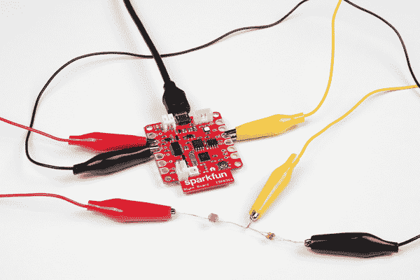](https://cdn.sparkfun.com/assets/learn_tutorials/4/9/5/10-03-Photocell_Connected.jpg)

本教程演示了如何将 **Blynk 板支持添加到 Arduino IDE** 中，这样您就可以开始编写和上传自己的 Blynk 固件了。如果您真的很喜欢项目指南中的 BotaniTweet 项目，但只是想做一些调整，本教程将为您提供必要的工具。

#### Blynk 板教程三部曲

本教程是作为 [Blynk 板项目指南](https://learn.sparkfun.com/tutorials/blynk-board-project-guide)的后续，后者本身是[Blynk 板入门教程](https://learn.sparkfun.com/tutorials/getting-started-with-the-sparkfun-blynk-board)的续篇。

上传新代码到 Blynk 板将(至少暂时)从板上移除预加载的 Blynk 板项目。它还将**移除供应功能**。

然而，固件是开源的。因此，如果你想得到 Blynk 板的默认固件加载备份，你所要做的就是加载回来！

## 安装 FTDI 驱动程序

Blynk 板使用一种称为“FTDI”的专用芯片将 USB 数据转换为更简单的串行接口。Blynk 板通过这个串行接口下载新代码。

如果您以前从未使用过基于 FTDI 的设备，您可能需要在您的计算机上安装驱动程序。我们的[如何安装 FTDI 驱动程序教程](https://learn.sparkfun.com/tutorials/how-to-install-ftdi-drivers)应该可以帮助你安装驱动程序，不管你是在 Mac、Windows 还是 Linux 机器上。

[安装 FTDI 驱动程序](https://learn.sparkfun.com/tutorials/how-to-install-ftdi-drivers)

一旦你安装了驱动程序，你的 Blynk 板应该在你的电脑上显示为 **COM#** (如果你在 Windows 机器上)或**/dev/tty . USB serial-# # # # # # # #**(如果你在 Mac/Linux 电脑上)，其中的#是唯一的数字或字母字符。

## 安装 Blynk 板 Arduino 插件

#### 下载，安装 Arduino

If you've never used an Arduino Board, or the Arduino IDE before, we apologize in advanced for potentially feeding a new addiction. [Arduino](http://www.arduino.cc/) is an open-source development environment for embedded microcontrollers. But, beyond that, it's a [simplified programming language](http://www.arduino.cc/en/Reference/HomePage), standardized hardware layout, and [a helpful community](http://forum.arduino.cc/).

[下载 Arduino！](http://www.arduino.cc/en/Main/Software)

前往 [Arduino.cc](http://www.arduino.cc/en/Main/Software) 下载软件。它可以在 Windows，Mac，Linux 上运行——几乎任何你能扔给它的东西！

要在 Arduino 中使用 Blynk 板，您需要在核心 Arduino 程序上安装一些附加文件。对我们来说幸运的是，Arduino 的新**板管理器**功能只需要几次复制/粘贴和点击按钮就可以完成！

### 安装 Blynk 板插件

The amazing ESP8266 community has cooperatively created an ESP8266 add-on for the IDE, which is what we'll focus on using throughout this tutorial. This ESP8266 addon for Arduino is based on the amazing work by Ivan Grokhotkov and the rest of the ESP8266 community. Check out the [ESP8266 Arduino GitHub repository](https://github.com/esp8266/Arduino) for more information.

我们将使用 Arduino 板管理器特性来帮助设置 Blynk 板的 IDE。按照以下步骤向 IDE 灌输 Blynk 板兼容性。

#### 第一步:给 Arduino 链接

要告诉 Arduino 从哪里获取板卡定义，**打开 Arduino 首选项**，你可以在**文件** > **首选项**菜单下找到。

[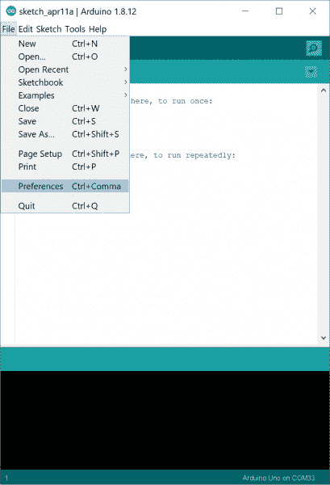](https://cdn.sparkfun.com/assets/learn_tutorials/4/9/5/1-Arduino_IDE_-Preferences.jpg)

然后复制这个 URL:

```
http://arduino.esp8266.com/stable/package_esp8266com_index.json 
```

然后，**将它**粘贴到“附加 Board Manager URLs”文本框中(如下图中红色所示)。如果您有多个插件板，您可以点击文本框右侧的按钮(如绿色小框所示)。这将打开另一个窗口(如较大的绿色框所示),并在新行下粘贴 URL。

[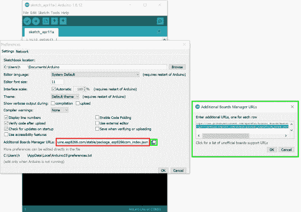](https://cdn.sparkfun.com/assets/learn_tutorials/4/9/5/2-Arduino_IDE_Additional_Board_Manager_URLs.jpg)

#### 步骤 2:安装定义

粘贴好链接后，点击首选项框中的 OK。然后导航到**工具** > **电路板** > **电路板管理器...**。

[](https://cdn.sparkfun.com/assets/learn_tutorials/4/9/5/3-Arduino_IDE_Board_Manager.jpg)

在接下来弹出的窗口中，**搜索“esp8266”**。“**ESP8266**by**ESP8266 Community**”菜单项应该是唯一的幸存者。

[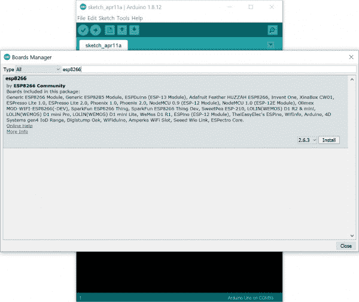](https://cdn.sparkfun.com/assets/learn_tutorials/4/9/5/4-Arduino_IDE__Board_Manager_ESP8266_Install.jpg)

选择它，然后**点击安装**。下载该程序可能需要几分钟，因为工具大约有 100MB。

**Troubleshooting Tip:** The **SparkFun Blynk Board** is now supported with the **ESP8266** by **ESP8266 Community** in **v2.6.0 and above**! We recommend installing the latest version with their board definitions. Installing both the **ESP8266 community board definitions** and the older **SparkFun ESP8266 board definitions** may cause a conflict in how the Arduino IDE organizes board definitions.

Without going into too much detail, if you have both board definitions installed and get an error when trying to upload, this might be your issue. If you decide to use the depreciated SparkFun board definitions, you can uninstall both board definitions and re-install only the SparkFun ESP8266 folder. Check out the detailed instructions with screenshots in the following [.pdf file](https://cdn.sparkfun.com/assets/learn_tutorials/4/9/5/Blynk-_Community_ESP8266_Boards.pdf) using a Mac (the instructions are the same for a Windows computer) if you decide to use the older board files.

[Troubleshooting Community ESP8266 Board Add-Ons (PDF)](https://cdn.sparkfun.com/assets/learn_tutorials/4/9/5/Blynk-_Community_ESP8266_Boards.pdf)
** Although unlikely, if your file systems are corrupted, you may need to go in and delete the associated esp8266 folders from the User and/or AppData folder (Look up how to do this first. Avoid if you are not sure what you are doing, you could do more damage and make it harder to fix.)*.

#### 步骤 3:选择 Blynk 板

在板管理器成功获取 Blynk 板定义后，再次查看**工具** > **板**菜单下——您应该会看到 **SparkFun Blynk 板**的菜单项。

[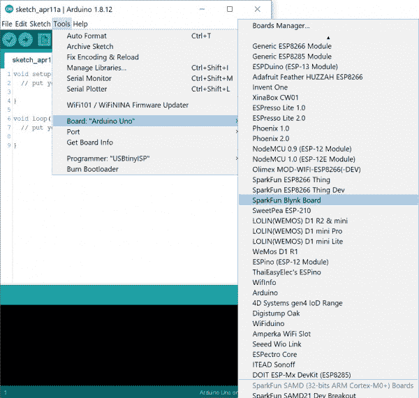](https://cdn.sparkfun.com/assets/learn_tutorials/4/9/5/5-Arduino_IDE_Blynk_Board_Selection.jpg)

选择它，你就快成功了。如果重新打开窗口，您会注意到 SparkFun Blynk 板的 ESP8266 有几个选项。除了将上传速度调整为 **921600** 之外，我们建议将其他选项保留为默认配置。前往**工具** > **端口**，选择 FTDI 枚举到的 COM 端口。在这种情况下，它是 **COM33** ，但在您的计算机上会有所不同。

[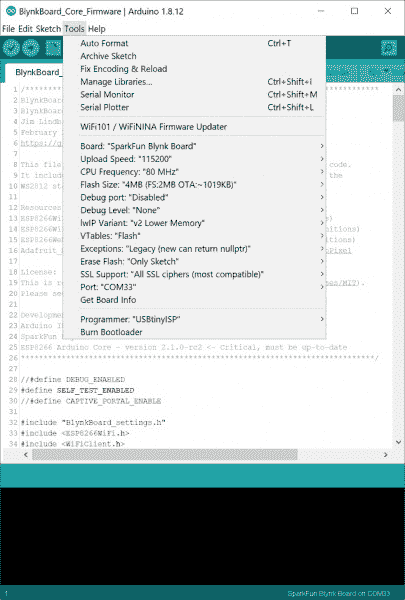](https://cdn.sparkfun.com/assets/learn_tutorials/4/9/5/6-Arduino_IDE_Board_Selection_ESP8266_Options.jpg)

是时候加载一些 Blynk 代码了！

## 获取 Blynk 身份验证令牌

Blynk 板 Arduino 插件包括 [Blynk Arduino 库](https://github.com/blynkkk/blynk-library)，所以你应该拥有启动 Blynk 所需的几乎所有东西。

几乎...

每个 Blynk 项目都被分配了一个唯一的 32 字节字符串，称为“auth token”，它允许您的硬件与应用程序中的特定项目进行通信。当你上传一个新的程序到 Blynk 板时，你需要在你想要添加的任何其他代码之上编写 auth 令牌。

要获得一个新的 Blynk auth 令牌，您有两个选择:使用以前的相同项目，或者创建一个新项目。

#### 选项 1:从以前创建的 Blynk 项目中获取代码

重用 Blynk 项目是节省能源的好方法，只要你不介意删除或修改一些小部件。

要找到一个已有的 Blynk 项目的 auth token，**停止项目**，然后点击右上角的**六角螺母**打开**项目设置**。

[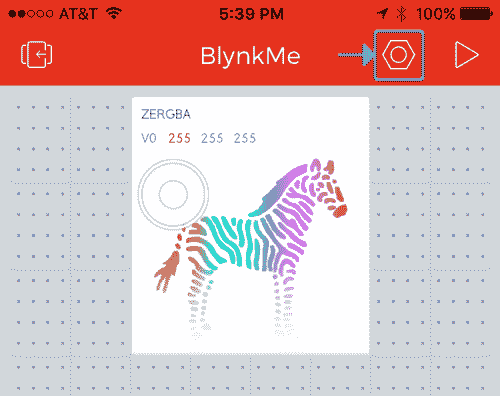](https://cdn.sparkfun.com/assets/learn_tutorials/4/9/5/blynk-project-settings.PNG)

在设置页面上，向下滚动一点找到“认证令牌”部分，你会发现一个很长的，难以理解的 32 个字符的字符串和几个方便的按钮。**点击电子邮件按钮**，将代码通过电子邮件发送到您与 Blynk 连接的电子邮件地址。

[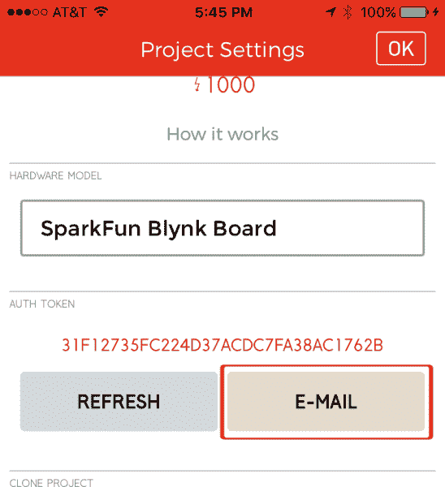](https://cdn.sparkfun.com/assets/learn_tutorials/4/9/5/email-auth-token.PNG)

将你的电脑转向收件箱，寻找一封来自 **dispatcher@blynk.cc** 的邮件。

[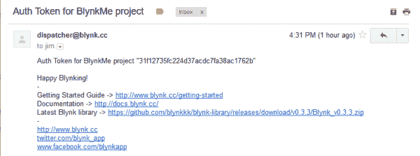](https://cdn.sparkfun.com/assets/learn_tutorials/4/9/5/blynk-auth-email.PNG)

将授权令牌放在手边！你可以点击“OK”(iOS)或者左上角的返回箭头(Android)退出你项目的设置页面。

#### 选项 2:创建一个新的 Blynk 项目

如果你想重新开始一个新的 Blynk 项目，首先返回到 Blynk 项目导航器屏幕——如果你在一个项目中，点击左上角的“返回”按钮。

接下来，尽可能滚动到项目导航器屏幕的右侧，找到**创建新项目**按钮。

[](https://cdn.sparkfun.com/assets/learn_tutorials/4/9/5/createProject.PNG)

点击它会将你带到“项目设置”页面。给你的项目命名，将**硬件型号**设置为 **SparkFun Blynk 板**。

[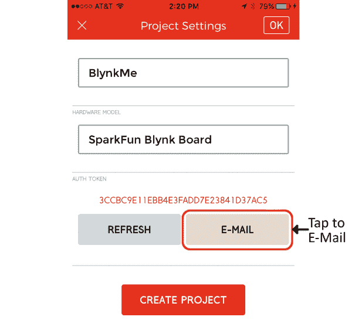](https://cdn.sparkfun.com/assets/learn_tutorials/4/9/5/email-auth-from-create.PNG)

最重要的是，在这个屏幕上，点击 Auth Token 下的 **E-Mail** ，给自己发送一份 32 字节字符串的副本。

最后，点击**创建项目**,在一个空白的 Blynk 项目中找到自己。

## 建立 Blynk 项目

本 Blynk 程序示例仅指定 RGB LED 的功能，但无论固件指定什么，您都可以使用任何硬件引脚。

### 配置按钮、LED 和 ADC

你可以使用**按钮部件**来驱动微小的蓝色 5 针 LED。将其配置为推或拉；只要确保**销设置到 5** 即可。

[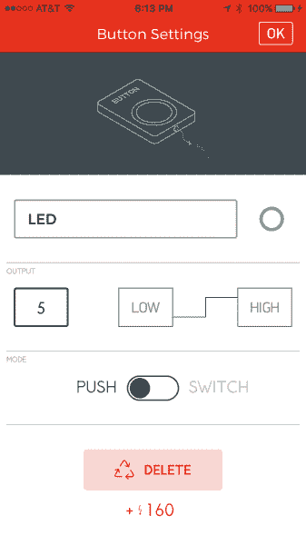](https://cdn.sparkfun.com/assets/learn_tutorials/4/9/5/project-led5.PNG)

Blynk 板的物理按钮可以触发一个**值小部件**。将微件的**引脚设置为 0** 。

[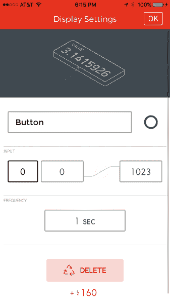](https://cdn.sparkfun.com/assets/learn_tutorials/4/9/5/project-button0.PNG)

最后，您可以使用**标尺或值**小部件来显示 ADC 的值。只要确保**将管脚设置为 ADC** 。

[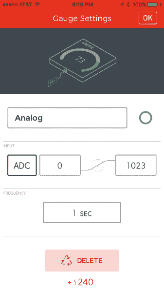](https://cdn.sparkfun.com/assets/learn_tutorials/4/9/5/project-adc-gauge.PNG)

### 配置 zeRGBa

要使用 zeRGBa 小部件，添加它，将开关设置为**合并**并将 pin 设置为 **V0** 。

[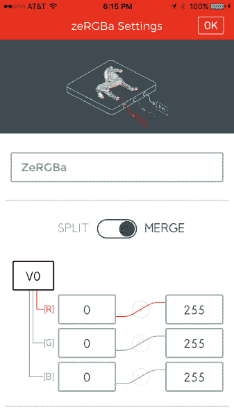](https://cdn.sparkfun.com/assets/learn_tutorials/4/9/5/project-zergba.PNG)

当全部配置完成后，您的项目可能看起来有点像这样:

[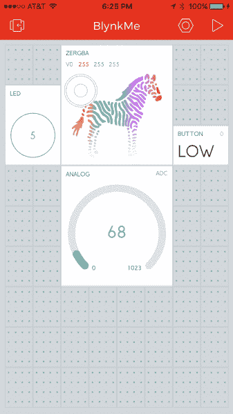](https://cdn.sparkfun.com/assets/learn_tutorials/4/9/5/project-setup-02.PNG)

## 加载一个示例程序

**Note:** If you have not previously installed an Arduino library, please check out our [installation guide.](https://learn.sparkfun.com/tutorials/installing-an-arduino-library) The following example uses these libraries:

*   [**Blynk**by**Volodymyr shymansky**](https://github.com/blynkkk/blynk-library)**v 0 . 6 . 1**
*   [**新像素**by**Adafruit**T5**v 1 . 2 . 1**](https://github.com/adafruit/Adafruit_NeoPixel)

有了 Blynk auth 令牌和项目设置，您就拥有了再次获得 board bl ynk 所需的所有信息。

### 配置代码

将这段代码复制并粘贴到你的 Arduino IDE 中，但是不要上传！

```
language:c
#define BLYNK_PRINT Serial    // Comment this out to disable prints and save space
#include <ESP8266WiFi.h>      
#include <BlynkSimpleEsp8266.h>  // http://librarymanager/All#blynk 
#include <Adafruit_NeoPixel.h>   // http://librarymanager/All#neopixel

////////////////////
// Blynk Settings //
////////////////////
char BlynkAuth[] = "Your_Auth_Token";
char WiFiNetwork[] = "Your_WiFi_Network";
char WiFiPassword[] = "Your_WiFi_Password";

///////////////////////
// Hardware Settings //
///////////////////////
#define WS2812_PIN 4 // Pin connected to WS2812 LED
#define BUTTON_PIN 0
#define LED_PIN    5
Adafruit_NeoPixel rgb = Adafruit_NeoPixel(1, WS2812_PIN, NEO_GRB + NEO_KHZ800);

BLYNK_WRITE(V0) // Handle RGB from the zeRGBa
{
  if (param.getLength() < 5)
    return;

  byte red = param[0].asInt();
  byte green = param[1].asInt();
  byte blue = param[2].asInt();

  uint32_t rgbColor = rgb.Color(red, green, blue);
  rgb.setPixelColor(0, rgbColor);
  rgb.show();
}

void setup()
{
  // Initialize hardware
  Serial.begin(9600); // Serial
  rgb.begin(); // RGB LED
  pinMode(BUTTON_PIN, INPUT); // Button input
  pinMode(LED_PIN, OUTPUT); // LED output

  // Initialize Blynk
  Blynk.begin(BlynkAuth, WiFiNetwork, WiFiPassword);
}

void loop()
{
  // Execute Blynk.run() as often as possible during the loop
  Blynk.run(); 
} 
```

在上传代码之前，您需要调整草图顶部的三个变量:

1.  将您的 **Blynk auth 令牌**粘贴到`Your_Auth_Token`上，设置`BlynkAuth`变量。
2.  将您的 **WiFi 网络名称**粘贴到`Your_WiFi_Network`上，设置`WiFiNetwork`变量。
3.  将你的 **WiFi 密码**粘贴到`Your_WiFi_Password`上，设置`WiFiPassword`变量
    *   如果网络是开放的，将字符串留空(`""`)。

### 上传代码

在上传之前，你需要**配置串口**—“COM #”或“/dev/tty.usbserial-########”号，这是你在 FTDI 驱动安装阶段发现的。知道了这些，导航到**工具** > **端口**，选择你的端口号。

[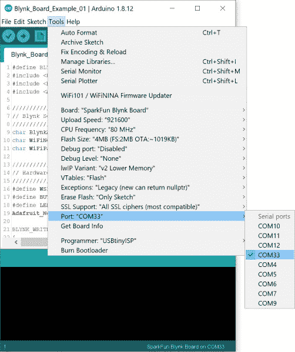](https://cdn.sparkfun.com/assets/learn_tutorials/4/9/5/Arduino_Blynk_COM_Selection.jpg)

我们也建议**增加**到 **921600** 的上传速率。你会发现在**工具下设置** > **上传速度**选项。

这是关键时刻！一旦配置好代码，点击**上传**按钮(向右箭头)。

你的电脑可能需要一分钟左右的时间来编译代码，并将其发送到 Blynk 板。Arduino 应该会通知您上传是否成功。如果没有-再次检查板和端口设置，并再次尝试。有时候这就够了。

### 检查串行监视器

如果代码成功上传，打开 Arduino IDE 右上角的**串行监视器** -放大镜图标。

这个窗口将传递一些方便的调试信息。它会告诉你 Blynk 板是否成功连接到你的 WiFi 网络和 Blynk 服务器。

[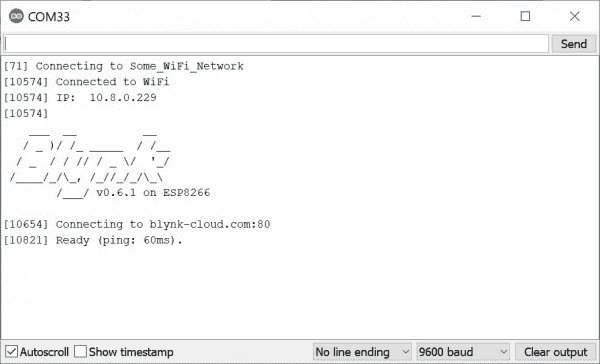](https://cdn.sparkfun.com/assets/learn_tutorials/4/9/5/Serial_Monitor_Blynk_Output.jpg)

如果你看到一个“准备好”的信息，你应该对 Blynk 好！做一些 zeRGBa'ing，按一些按钮，并调整一些模拟输入！你正在制作自己的 Blynk 项目。

## 重新安装默认的 Blynk 板核心固件

**Note:** If you have not previously installed an Arduino library, please check out our [installation guide.](https://learn.sparkfun.com/tutorials/installing-an-arduino-library) The following example uses these libraries. Make sure that you install them before uploading!

*   [**Blynk**by**Volodymyr shymansky**](https://github.com/blynkkk/blynk-library)**v 0 . 6 . 1**
*   [黑桃 htu1d 黑桃 T3](https://github.com/sparkfun/SparkFun_HTU21D_Breakout_Arduino_Library/releases/tag/V_1.1.1)**v1 . 1**
*   [**SparkFun TSL2561 库**by**spark fun**](https://github.com/sparkfun/SparkFun_TSL2561_Arduino_Library/releases/tag/V_1.1.0)**v 1 . 1 . 0**
*   [**新像素**by**Adafruit**T5**v 1 . 2 . 1**](https://github.com/adafruit/Adafruit_NeoPixel)

如果你有兴趣重新安装默认的 Blynk 板核心固件，不要害怕！您需要从 GitHub 资源库下载[**BlynkBoard _ Core _ firmware . ino**和相关文件](https://github.com/sparkfun/Blynk_Board_ESP8266/tree/master/Firmware):

[Blynk_Board_ESP8266 (ZIP)](https://github.com/sparkfun/Blynk_Board_ESP8266/archive/master.zip)

下载后，解压文件。前往**Blynk _ Board _ ESP8266**>**固件**>**BlynkBoard _ Core _ Firmware**并点击**BlynkBoard _ Core _ Firmware . ino**，打开核心固件的文件夹。这将打开 Arduino IDE，并带有一些相关文件作为附加标签。确保选择正确的板卡文件和 COM 端口。准备就绪后，单击上传按钮将默认固件上传回主板。然后按照[说明设置您的 Blynk 板](https://learn.sparkfun.com/tutorials/getting-started-with-the-sparkfun-blynk-board)。

## 解决纷争

### 电路板附加问题和中断

如果您编译并上传了带有中断的代码，如默认的 Blynk 板核心固件，当设置为 **9600** 波特时，您可能会在 Arduino 串行监视器中收到类似以下输出的消息。

```
language:c
[1079] SparkFun Blynk Board Hardware v1.0.0
[1079] SparkFun Blynk Board Firmware v1.0.2
ISR not in IRAM!

User exception (panic/abort/assert)
Abort called

>>>stack>>>

ctx: cont
sp: 3ffffe80 end: 3fffffc0 offset: 0000
3ffffe80:  00000005 00000030 3fffff30 4020c50a  
3ffffe90:  000000fe 00000000 00000000 00000000  
3ffffea0:  00000000 00000000 00000000 00ff0000  
3ffffeb0:  5ffffe00 5ffffe00 7552000a 00000000  
3ffffec0:  00000003 00000000 3fff05f0 4020dd4a  
3ffffed0:  40100c02 000003e8 3fff05c4 4020dd60  
3ffffee0:  3ffe8937 008afd80 3fff05f0 4020eb05  
3ffffef0:  00000000 3fff07e8 3ffe89b7 3fff0918  
3fffff00:  3ffe8937 000003e8 3fff05c4 3fff0918  
3fffff10:  3ffe8937 3ffe87b6 3fff05f0 4020ebb4  
3fffff20:  3ffe8937 3ffe87b6 3fff05f0 40202809  
3fffff30:  3fffff40 3ffe87b6 00000000 4020814d  
3fffff40:  2e302e00 feef0032 80efeffe feefeffe  
3fffff50:  3fffdad0 00000000 3fff08d8 40206729  
3fffff60:  feefeffe feefeffe feefeffe feefeffe  
3fffff70:  feefeffe feefeffe feefeffe feefeffe  
3fffff80:  feefeffe feefeffe feefeffe feefeffe  
3fffff90:  feefeffe feefeffe feefeffe 3fff0918  
3fffffa0:  3fffdad0 00000000 3fff08d8 4020d730  
3fffffb0:  feefeffe feefeffe 3ffe852c 4010155d  
<<<stack<<<
c_?rS?f?[1080] 
```

如果您看到此输出，则此错误是由于 ESP8266 与您正在使用的板定义冲突造成的。对于任何使用 ESP8266 社区板文件(2.5.1 及以上版本)的人来说，[必须在中断服务程序的函数定义](https://arduino-esp8266.readthedocs.io/en/2.6.3/reference.html#interrupts)前包含`ICACHE_RAM_ATTR`。在这种情况下， **BlynkBoard_Setup.ino** 用下面一行代码设置一个中断:

```
language:c
.
.
.
attachInterrupt(BUTTON_PIN, buttonChange, CHANGE); 
```

通过搜索中断服务程序`buttonChange`的位置，它被定义在使用的旧**BlynkBoard _ Core _ firmware . ino**文件中。

```
language:c
void buttonChange(void){
.
.
. 
```

包括在 ISR 定义解决问题之前的`ICACHE_RAM_ATTR`。

```
language:c
ICACHE_RAM_ATTR void buttonChange(void){
.
.
. 
```

## 资源和更进一步

现在你有了一个 Arduino 可编程的 Blynking Blynk 板，你打算做什么新的令人惊叹的物联网项目？需要一些灵感吗？查看这些教程:

[](https://learn.sparkfun.com/tutorials/led-cloud-connected-cloud) [### LED 云-连接云](https://learn.sparkfun.com/tutorials/led-cloud-connected-cloud) Make an RGB colored cloud light! You can also control it from your phone, or hook up to the weather 31[](https://learn.sparkfun.com/tutorials/blynk-board-project-guide) [### Blynk 板项目指南](https://learn.sparkfun.com/tutorials/blynk-board-project-guide) A series of Blynk projects you can set up on the Blynk Board without ever re-programming it.[Favorited Favorite](# "Add to favorites") 18[](https://learn.sparkfun.com/tutorials/blynk-board-bridge-widget-demo) [### Blynk Board Bridge 小部件演示](https://learn.sparkfun.com/tutorials/blynk-board-bridge-widget-demo) A Blynk project that demonstrates how to use the Bridge widget to get two (or more) Blynk Boards to communicate.[Favorited Favorite](# "Add to favorites") 2[](https://learn.sparkfun.com/tutorials/blynk-board-washerdryer-alarm) [### Blynk 板洗衣机/烘干机警报](https://learn.sparkfun.com/tutorials/blynk-board-washerdryer-alarm) How to configure the Blynk Board and app to notify you when your washer or dryer is done shaking.[Favorited Favorite](# "Add to favorites") 9

如果您需要一般的 Blynk 板或 Blynk 应用程序资源，这些资源可能会有所帮助:

*   **SparkFun Blynk 板资源**
    *   [Blynk 板 GitHub 库](https://github.com/sparkfun/Blynk_Board_ESP8266)
    *   [Blynk 板原理图](https://cdn.sparkfun.com/datasheets/IoT/SparkFun-Blynk-Board-ESP8266.pdf)
    *   [Blynk Board Eagle PCB 设计文件](https://cdn.sparkfun.com/assets/learn_tutorials/4/8/6/SparkFun-Blynk-Board-ESP8266-EAGLE.zip)
    *   [Blynk 板 Arduino 固件](https://github.com/sparkfun/Blynk_Board_ESP8266/tree/master/Firmware/BlynkBoard_Core_Firmware)
*   **链接资源**
    *   [Blynk 主页](http://www.blynk.cc/)
    *   [Blynk 入门指南](http://www.blynk.cc/getting-started/)
    *   [Blynk 文档](http://docs.blynk.cc/)
    *   [Blynk Arduino 库](https://github.com/blynkkk/blynk-library/releases/download/v0.3.3/Blynk_v0.3.3.zip)

* * *

如果您需要 Blynk 板的任何技术帮助，请不要犹豫[通过电子邮件、聊天或电话联系我们的技术支持团队](https://www.sparkfun.com/technical_assistance)。