# Blynk Board Bridge 小部件演示

> 原文：<https://learn.sparkfun.com/tutorials/blynk-board-bridge-widget-demo>

## 介绍

Blynk 应用中的 [Bridge Widget](http://docs.blynk.cc/#widgets-other-bridge) 允许设备到设备的通信。不需要运行任何应用程序。该演示展示了 Bridge 小部件用于应用程序到应用程序通信、应用程序到电路板通信和电路板到电路板通信的几种方式。

为了实现完整的功能，需要两个移动设备和两个 [SparkFun Blynk 板](https://www.sparkfun.com/products/13794)。如果你对应用程序到应用程序的通信不感兴趣，只需要一个移动设备。移动设备可以运行 Android 或 iOS。

### 推荐阅读

本教程建立在以前的 Blynk 教程中的概念之上。如果您还没有这样做，我们建议您在开始本教程之前阅读以下内容:

*   [spark fun Blynk 板入门](https://learn.sparkfun.com/tutorials/getting-started-with-the-sparkfun-blynk-board?_ga=1.196250085.890988720.1429644996)
*   [Blynk 板项目指南](https://learn.sparkfun.com/tutorials/blynk-board-project-guide?_ga=1.176530540.890988720.1429644996)
*   [Blynk 板 Arduino 开发指南](https://learn.sparkfun.com/tutorials/blynk-board-arduino-development-guide?_ga=1.176530540.890988720.1429644996)

## 硬件连接

没有必要用额外的硬件来证明概念。软件开发人员可能会欣赏这一点。一旦你有了控制内置 LED 的内置按钮，就只需要改变一两个值和裁剪额外的硬件。

对于本教程，您需要做的只是为 Blynk 板供电。这是最简单的两种方法:USB，或 3.7 伏脂电池(1 秒)。

[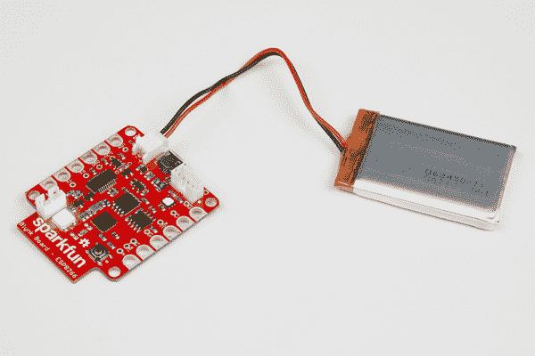](https://cdn.sparkfun.com/assets/learn_tutorials/4/9/4/Blynk_examples-01.jpg)*SparkFun Blynk Board powered with a single cell LiPo battery*

使用连接到开发机器的 USB 电缆为设备供电是制作原型的最简单方法。加载新代码，它就会运行。

[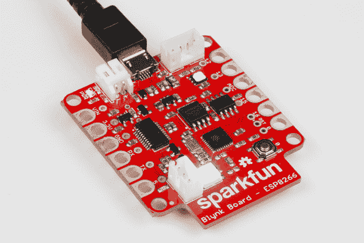](https://cdn.sparkfun.com/assets/learn_tutorials/4/9/4/Blynk_examples-02.jpg)*SparkFun Blynk Board powered with a USB micro-B cable*

## 移动应用

要创建移动应用程序，首先确保您安装了 Blynk 应用程序。如果没有，请从以下两个来源之一安装您的操作系统版本:

[](https://itunes.apple.com/us/app/blynk-control-arduino-raspberry/id808760481?ls=1&mt=8)[](https://play.google.com/store/apps/details?id=cc.blynk)

确切的说明超出了本教程的范围。如果您还没有这样做，请访问【Blynk 入门指南。安装应用程序后，登录或创建新帐户。

[](https://cdn.sparkfun.com/assets/learn_tutorials/4/9/4/01-login.PNG)*Bylink app login screen*

登录后，选择大的*创建新项目*按钮。

[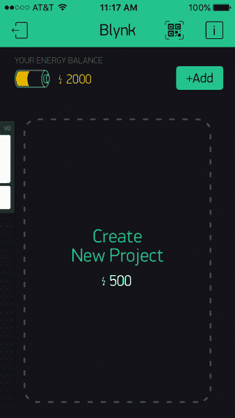](https://cdn.sparkfun.com/assets/learn_tutorials/4/9/4/02-noProject.PNG)*Empty Blynk project*

这将把您带到您命名项目的地方。选择您将连接到的硬件，并获取您的身份验证令牌。这个令牌(本例中的***7 df 0 f1 de 119 f 48149 eff 64 BC 7 b 2 FBD 11***)在后面会非常重要。我发现用电子邮件发给自己比打出来容易。它将被发送到您创建帐户时注册的电子邮件帐户。

[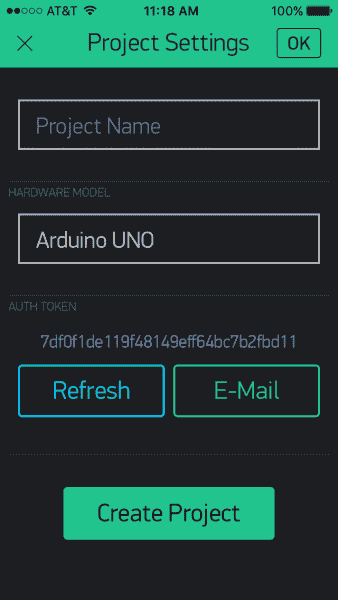](https://cdn.sparkfun.com/assets/learn_tutorials/4/9/4/03-projectSettings.PNG)*Default project settings*

我给我的项目起了一个名字，这个名字与设计用来工作的草图相匹配。这是不必要的，但有助于将混乱降至最低。一旦你选择了一些 SparkFun 硬件，注意主题改变了。

[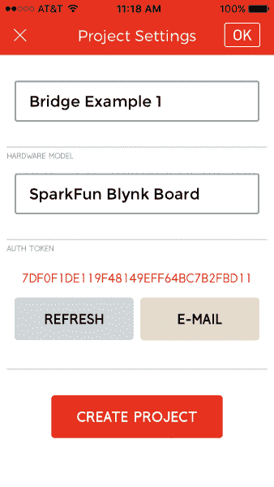](https://cdn.sparkfun.com/assets/learn_tutorials/4/9/4/04-projectSettingsFilled.PNG)*Configured project*

选择*创建项目*选项创建并打开项目。

[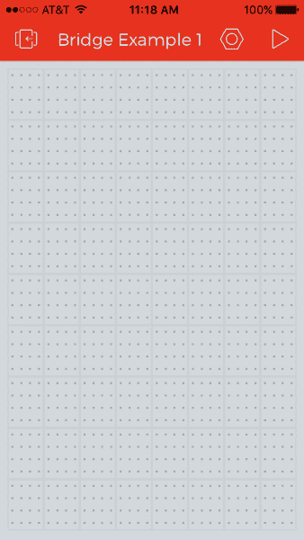](https://cdn.sparkfun.com/assets/learn_tutorials/4/9/4/05-emptyProject.PNG)*Empty project*

现在您有了一个空的项目画布，是时候开始添加 UI 元素了。让我们从终端小部件开始。双击画布并滚动侧边栏，直到看到感兴趣的小部件。

[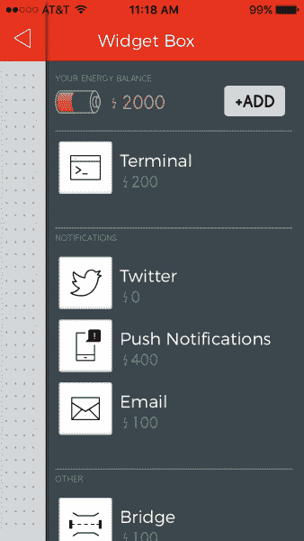](https://cdn.sparkfun.com/assets/learn_tutorials/4/9/4/06-terminalWidget.PNG)*Terminal widget in Widget Box*

选择微件，微件框将关闭。选定的小部件将出现在画布上的下一个可用位置。

[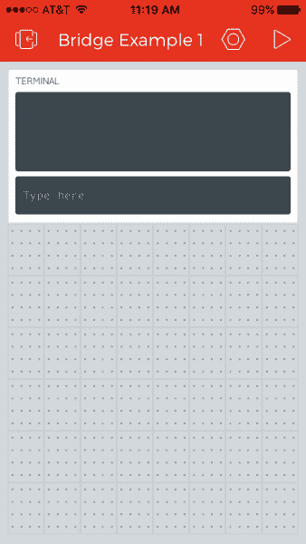](https://cdn.sparkfun.com/assets/learn_tutorials/4/9/4/07-onlyTerminal.PNG)*Placed terminal widget*

现在已经有了一个终端小部件，在小部件框中找到按钮小部件。

[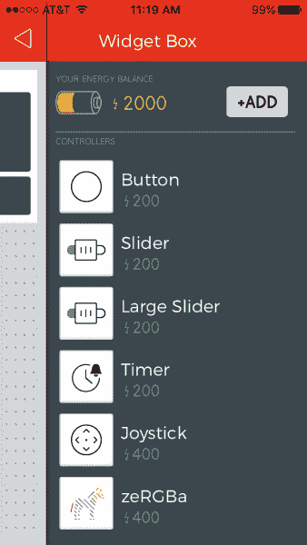](https://cdn.sparkfun.com/assets/learn_tutorials/4/9/4/08-buttonWidget.PNG)*Button widget the Widget Box*

按照相同的步骤放置 Bridge 小部件。可以在底部 Widget Box 的**其他部分**找到。

[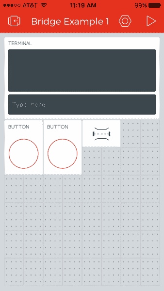](https://cdn.sparkfun.com/assets/learn_tutorials/4/9/4/09-allWidgets.PNG)*Bridge widget placed*

一旦所有的小部件都放置好了，就该配置它们了。首先配置终端小部件。给它一个名字/标签。输入什么大小写都没关系，都会转换成大写。

[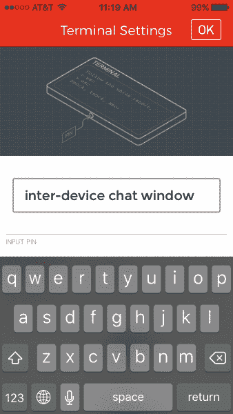](https://cdn.sparkfun.com/assets/learn_tutorials/4/9/4/10-terminalTitle.PNG)*Labeling Terminal widget*

为了与小部件交互，您需要为它分配一个 pin。一些小部件使用真实的物理 pin，而另一些使用虚拟 pin。本例中的所有 UI 都使用虚拟 pin。在这种情况下，我选择将终端连接到虚拟引脚 0。我将终端小部件的其他设置保留为默认值。

[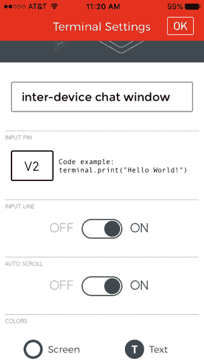](https://cdn.sparkfun.com/assets/learn_tutorials/4/9/4/11-terminalSettings.PNG)*Configured Terminal widget*

按钮小部件的过程与终端小部件的过程相同。为他们提供名称/标签，并选择一个 pin 进行通信。我认为情况我正在使用虚拟引脚零来控制连接到 GP5 的本地 LED。使用虚拟引脚而非物理引脚的原因将在[固件章节](# "Jump to firmware section.")中解释。

[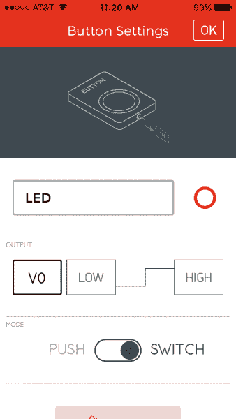](https://cdn.sparkfun.com/assets/learn_tutorials/4/9/4/12-buttonSettings.PNG)*Configured Button widget to control the local LED*

请注意，在上面的图像中，我还将按钮从按压(瞬时)改为开关(锁定)。按钮部件控制颜色的其他配置选项。这对这个演示并不重要，我保留了默认值。完成后的应用程序应该是这样的:

[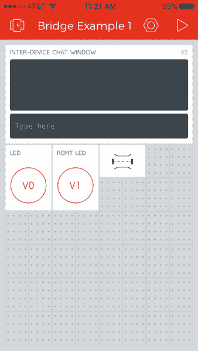](https://cdn.sparkfun.com/assets/learn_tutorials/4/9/4/13-configured.PNG)*Bridge example device 1 setup*

当右上角的三角形被按下时，应用程序将运行，布线的细节对用户隐藏。

[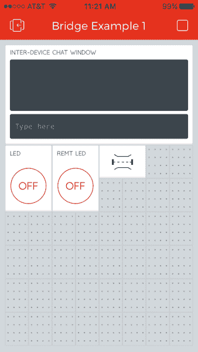](https://cdn.sparkfun.com/assets/learn_tutorials/4/9/4/14-running.PNG)*Bridge example device 1 running*

## 固件

这个演示的固件是 Arduino 代码。有关安装 Blynk 库和配置开发环境的详细信息，请访问 [Blynk Board Arduino 开发指南](https://learn.sparkfun.com/tutorials/blynk-board-arduino-development-guide)。

### 配置

本演示的固件与“标准”Blynk 固件的一个主要区别在于，您需要第二个认证码。

```
language:c
char auth[] = "7DF0F1DE119F48149EFF64BC7B2FBD11"; // Put your Auth Token here
char remoteAuth[] = "RemoteAuthToken"; // Auth token of bridged device 
```

要获得第二个身份验证代码，您需要在移动设备上安装第二个项目。为了使聊天也能进行，您需要在登录到同一帐户的第二个移动设备上启动第二个项目。一旦有了第二个项目用于辅助 Blynk 板，就可以输入该令牌作为主 Blynk 板的 remoteAuth。这两行是 [Bridge_Example_1.ino](https://github.com/sparkfun/Blynk_Board_ESP8266/blob/master/Firmware/Examples/Bridge_Example/Bridge_Example_1/Bridge_Example_1.ino) 和 [Bridge_Example_2.ino](https://github.com/sparkfun/Blynk_Board_ESP8266/blob/master/Firmware/Examples/Bridge_Example/Bridge_Example_2/Bridge_Example_2.ino) 的唯一区别。创建两个是为了方便降低混乱程度，并对其中一个进行调整，而不是两个都更容易。

下一个要配置的部分是别名部分，用于告诉代码体在应用程序中选择了哪个虚拟 pin。如果您遵循了上一节中关于移动应用程序配置的内容，则不需要更改这些内容。在代码和移动应用程序中，我们将本地 LED 按钮映射到虚拟引脚 1 (V1)。我们在应用程序中配置了第二个按钮 *REMT 领导*使用虚拟 pin 2 (V2)。在代码中，我们为 V2 定义了一个别名`REMOTE_LED_BUTTON`。本节允许我们对许多桥接设备使用完全相同的代码。

```
language:c
// Virtual Pins:
#define TERMINAL                 0  // V0
#define LOCAL_LED_BUTTON         1  // V1
#define REMOTE_LED_BUTTON        2  // V2
#define TERMINAL_RECEIVE         3  // V3
#define BRIDGE                   4  // V4
#define LOCAL_LED_RECIEVE        5  // V5
#define REMOTE_LED_STATUS_UPDATE 6  // V6 
```

最后需要的配置是告诉 Blynk 板如何连接到 Wi-Fi。将 *SSID* 替换为 SSID(您的 Wi-Fi 网络的名称),保留双引号。同样，用您网络的实际密码替换*密码*，同样保留双引号。

```
language:c
Blynk.begin(auth, "SSID", "PASSWORD");  // Here your Arduino connects to the Blynk Cloud. 
```

### 它是如何工作的

#### 物理按钮

让我们从 Blynk 板上的物理按钮开始。此按钮将用于切换另一个 Blynk 板上的 LED。

按下此按钮时，GPIO0 接地。这叫做低电平有效；当按钮被按下/激活时，信号变低。内部上拉电阻用于在无效时保持该信号为高电平。一个[中断服务例程](https://en.wikipedia.org/wiki/Interrupt_handler)被用来立即捕获按钮按下事件，但是直到代码的主循环开始执行它时，才采取最终的动作。这使得更重要的事情快速运行。下面是配置刚才描述的内容的代码片段。

```
language:c
// Setup the onboard button
pinMode(BUTTON_PIN, INPUT_PULLUP);
// Attach BUTTON_PIN interrupt to our handler
attachInterrupt(digitalPinToInterrupt(BUTTON_PIN), onButtonPress, FALLING); 
```

`attachInterrupt`函数调用的第二个参数是中断服务处理程序 onButtonPress 的名称。

```
language:c
// Interrupt service routine to capture button press event
ICACHE_RAM_ATTR void onButtonPress()
{
  // Invert state, since button is "Active LOW"
  wasButtonPressed = !digitalRead(BUTTON_PIN);
} 
```

当物理按钮被按下时，这个函数被调用。因为处理器可能正在做一些更关键的事情，所以这个函数做得越少越好，事件稍后再处理。这里我们有一个变量`wasButtonPressed`来跟踪按钮是否被按下。我们将引脚当前状态的相反状态存储在这个变量中。使用`!`操作符可以得到相反的结果。我们再次读取此引脚，作为一种去抖形式。真正按下按钮应该会将该引脚的值发送到低电平，并且至少在跳转到该功能并再次检查状态所需的几分之一秒内保持低电平。这避免了基于快速瞬态毛刺改变状态。

接下来，我们来讨论一下主循环:

```
language:c
void loop()
{
  Blynk.run(); // All the Blynk Magic happens here...

  if (wasButtonPressed) {
    // This can be seen in the Serial Monitor
    BLYNK_LOG("Physical button was pressed.");
    // Toggle state
    remoteLedState ^= HIGH;
    // Send new state to remote board LED
    bridge.virtualWrite(LOCAL_LED_RECIEVE, remoteLedState);
    // Update state of button on local mobile app
    Blynk.virtualWrite(REMOTE_LED_BUTTON, remoteLedState);
    // Clear state variable set in ISR
    wasButtonPressed = false;
  }
} 
```

这里发生了两件事。首先，我们让 Blynk 库完成它的任务。接下来，我们检查是否按下了物理按钮。如果自从上次运行该检查以来，按钮被按下过，我们有一些事情要做。

首先，如果 Blynk 板通过微型 USB 电缆连接到运行终端仿真器或 Arduino 串行监视器的计算机，我们以 9600 波特向其写入调试消息。这是用`BLYNK_LOG("Physical button was pressed.");`完成的。如果草图中的第一行实际代码被删除或注释掉(`#define BLYNK_PRINT Serial`)，就可以编译出这段代码。

跟踪远程 LED 状态的状态变量被切换。这是用`remoteLedState ^= HIGH;`完成的，但也可以用类似`remoteLedState = 1 - remoteLedState;`或`remoteLedState = !remoteLedState;`的东西来完成。

接下来，我们通过网桥发送新状态，对远程 LOCAL _ LED _ RECIEVE 虚拟引脚进行虚拟写入。另一端是处理发送值的函数。

在我们告诉远程设备进行更新之后，我们需要更新连接到这个 Blynk 板的移动应用程序上的状态。我们通过使用新的状态值对`REMOTE_LED_BUTTON`进行虚拟写入来实现这一点。

最后要做的事情是清除表明我们有一个未处理的按钮按下的变量，`wasButtonPressed`。这会导致我们所在的代码块被跳过，直到再次按下按钮。

为了遵循物理按钮按下的逻辑流程，让我们来看一下当另一个设备发出其按钮被按下的信号时的处理函数:

```
language:c
// Remote device triggered an LED change. Update the LED and app status.
BLYNK_WRITE(LOCAL_LED_RECIEVE)
{
  // This can be seen in the Serial Monitor
  BLYNK_LOG("Remote device triggered LED change");

  ledState = param.asInt();
  // Turn on LED
  digitalWrite(LED_PIN, ledState);
  // Set state of virtual button to match remote LED
  Blynk.virtualWrite(LOCAL_LED_BUTTON, ledState);
} 
```

在该功能中发现的新的或重要的项目是`digitalWrite`和`virtualWrite`。更新 LED 状态后，该值被发送到与 LED 相连的 GPIO。然后，我们更新与此板相关联的移动应用程序的用户界面。

前面的代码块处理更新与按下按钮的面板相关联的 GUI。此模块更新物理 LED 和与 LED 发生变化的板相关联的 GUI。一次虚拟按钮按压更新了一个物理 pin 和两个 GUI 元素。

#### 移动应用程序 GUI 中的 LED 按钮

当按下标有 *LED* 的按钮时，调用以下功能。第一点并不新鲜。我们通过串行连接更新状态变量并记录该信息，如果它存在的话。

```
language:c
// Virtual button on connected app was used to change remote LED.
// Tell remote devices about the change.
BLYNK_WRITE(REMOTE_LED_BUTTON)
{
  remoteLedState = param.asInt(); // Update state with info from remote
  BLYNK_LOG("New remote LED state: %s", param.asInt() ? "HIGH" : "LOW");
  // Send updated status to remote board.
  bridge.virtualWrite(LOCAL_LED_RECIEVE, remoteLedState);
} 
```

该函数中的最后一条语句通过桥接器将 *remoteLedStat* 发送到另一个 Bkynk 板的 *LOCAL_LED_RECEIVE* 虚拟管脚。网桥配置如下:

```
language:c
WidgetBridge bridge(BRIDGE); 
```

`BRIDGE`在代码中被定义为虚拟引脚 4。

电桥的另一端通过以下功能对此信号做出反应。这里没有什么新内容，我们通过串行端口(如果存在的话)进行记录，更新状态变量，更新物理 pin，最后更新 GUI 的状态。

```
language:c
// Remote device triggered an LED change. Update the LED and app status.
BLYNK_WRITE(LOCAL_LED_RECIEVE)
{
  // This can be seen in the Serial Monitor
  BLYNK_LOG("Remote device triggered LED change");

  ledState = param.asInt();
  // Turn on LED
  digitalWrite(LED_PIN, ledState);
  // Set state of virtual button to match remote LED
  Blynk.virtualWrite(LOCAL_LED_BUTTON, ledState);
} 
```

#### 移动应用程序 GUI 中的远程 LED 按钮

移动应用程序 GUI 中的远程 LED 按钮的行为与 *LED* 按钮大致相同。在这种情况下，按钮标记为 *REMT LED* 。它使用以下函数。当应用程序中的按钮被按下时，首先调用这个函数。

```
language:c
// Virtual button on connected app was used to change remote LED.
// Tell remote devices about the change.
BLYNK_WRITE(REMOTE_LED_BUTTON)
{
  remoteLedState = param.asInt(); // Update state with info from remote
  BLYNK_LOG("New remote LED state: %s", param.asInt() ? "HIGH" : "LOW");
  // Send updated status to remote board.
  bridge.virtualWrite(LOCAL_LED_RECIEVE, remoteLedState);
} 
```

该函数发送一个信号，该信号在桥的另一端由下面的函数处理。

```
language:c
// Remote device triggered an LED change. Update the LED and app status.
BLYNK_WRITE(LOCAL_LED_RECIEVE)
{
  // This can be seen in the Serial Monitor
  BLYNK_LOG("Remote device triggered LED change");

  ledState = param.asInt();
  // Turn on LED
  digitalWrite(LED_PIN, ledState);
  // Set state of virtual button to match remote LED
  Blynk.virtualWrite(LOCAL_LED_BUTTON, ledState);
} 
```

#### 设备间聊天窗口

这个演示的另一部分是通过桥发送文本。单独来看，这并不是该技术最令人惊讶的用途，但是在互联网中断的情况下，可以为电话聊天服务设置本地 [Blynk 服务器](https://github.com/blynkkk/blynk-server)和 Wi-Fi 路由器。

第一个要求是设置一个终端小部件，与添加到移动应用程序中的小部件相匹配。

```
language:c
// Attach virtual serial terminal to TERMINAL Virtual Pin
WidgetTerminal terminal(TERMINAL); 
```

接下来，一个函数获取这个小部件的输出，并将其发送到另一个 Blynk 板。

```
language:c
// You can send commands from Terminal to your hardware. Just use
// the same Virtual Pin as your Terminal Widget
BLYNK_WRITE(TERMINAL)
{
  // Send from this terminal to remote terminal
  bridge.virtualWrite(TERMINAL_RECEIVE, param.asStr());
} 
```

在桥的另一端是下面的函数，它获取接收到的字符串并将其写入本地终端。

```
language:c
// Receive a string on LOCAL_RECEIVE and write that value to the connected
// phone's terminal
BLYNK_WRITE(TERMINAL_RECEIVE)
{
  terminal.println(param.asStr());  // Write received string to local terminal
  terminal.flush();
} 
```

[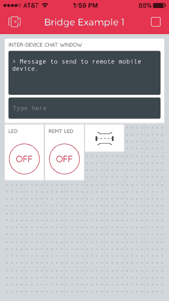](https://cdn.sparkfun.com/assets/learn_tutorials/4/9/4/chat.PNG)*Example of chat functionality*

### 你应该看到什么

这是相当多的，所以让我们来看看在上传代码到各自的 Blynk 板和运行项目后你会看到什么。尝试在任一项目的终端窗口中键入。这将向连接的另一个 Blynk 板发送一条消息，反之亦然。如果您在与项目相关的 Blynk 应用程序上按下一个“ **LED** ”按钮，您会注意到 GUI 对按钮按下做出反应，蓝色 LED 随着 Blynk 板打开。如果您按下与项目相关联的 Blynk 应用程序上的“ **REMT LED** ”按钮或另一个 Blynk 板上的物理按钮，您会注意到 LED 随着 Blynk 板一起打开！

## 资源和更进一步

在本演示中，我们使用了 7 个虚拟引脚。其中三个用于发送各种类型的数据。如果您的项目变得更加复杂，并且您用完了虚拟引脚，您可以通过在一端对信息进行编码，在另一端对其进行解码，来通过一个引脚发送所有数据。

这个演示更多的是针对软件爱好者，因为它不需要额外的硬件。它使用内置按钮和发光二极管。这可以很容易地修改，以使用任何你想连接到他们的其他引脚。一端的按钮可以用一个 [SparkFun 声音探测器](https://www.sparkfun.com/products/12642)代替，另一个 Blynk 板上的 LED 可以用[spark fun beefeat 继电器控制套件](https://www.sparkfun.com/products/11042)代替。这将允许你制作你自己的无线网络版本的拍板。在一个房间拍手，打开/关闭另一所房子的灯！

如果您需要一般的 Blynk 板或 Blynk 应用程序资源，这些资源可能会有所帮助:

*   **SparkFun Blynk 板资源**
    *   [Blynk 板 GitHub 库](https://github.com/sparkfun/Blynk_Board_ESP8266)
    *   [Blynk 板原理图](https://cdn.sparkfun.com/datasheets/IoT/SparkFun-Blynk-Board-ESP8266.pdf)
    *   [Blynk Board Eagle PCB 设计文件](https://cdn.sparkfun.com/assets/learn_tutorials/4/8/6/SparkFun-Blynk-Board-ESP8266-EAGLE.zip)
    *   [Blynk 板 Arduino 固件](https://github.com/sparkfun/Blynk_Board_ESP8266/tree/master/Firmware/BlynkBoard_Core_Firmware)
*   **链接资源**
    *   [Blynk 主页](http://www.blynk.cc/)
    *   [Blynk 入门指南](http://www.blynk.cc/getting-started/)
    *   [Blynk 文档](http://docs.blynk.cc/)
    *   [Blynk Arduino 库](https://github.com/blynkkk/blynk-library/releases/download/v0.3.3/Blynk_v0.3.3.zip)

* * *

如果您需要 Blynk 板的任何技术帮助，请不要犹豫[通过电子邮件、聊天或电话联系我们的技术支持团队](https://www.sparkfun.com/technical_assistance)。