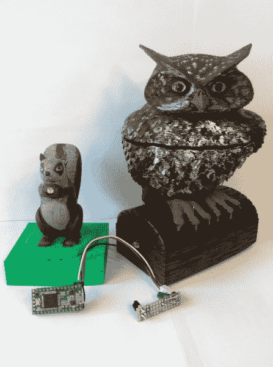

# Boss 警报

> 原文：<https://learn.sparkfun.com/tutorials/boss-alarm>

## 介绍

这在任何办公室都很常见——你正在脸书或浏览 SparkFun，突然你的老板走进来，发现你没有在工作。

这个项目旨在避免来自管理层的尴尬和不满。老板警报提醒你任何人走进你的办公室，并自动改变你电脑上的活动程序。传感器隐藏在可爱的林地生物中，保证照亮你的办公室，绝对不会吓到你的任何同事！

*Definitely not creepy*

Boss 报警器使用一个由几个普通元件制成的红外光束传感器。该设计基于本文中[的原理图，并做了一些修改。](http://jumperone.com/2011/11/break-beam-sensor/)

Boss 警报有三个组成部分。有一个发射器(藏在松鼠体内)向猫头鹰发出一束看不见的光束。owl 包含一个红外接收器(即 [TSOP38238 红外接收器二极管](https://www.sparkfun.com/products/10266))和另一个红外发射器。最后一个组件是另一个连接到 [Teensy 3.2](https://www.sparkfun.com/products/13736) 的红外接收器。

*Harmless woodland creatures!*

Teensy 被配置为 USB 键盘设备。当猫头鹰和松鼠之间的光束被切断时，猫头鹰会向松鼠发送信号。当 Teensy 收到这个信号时，它简单地发送 Alt+Tab 键盘命令到你的计算机来改变激活的程序。如果您在不同的操作系统上，您可以将键盘命令更改为您想要的任何命令(例如，Windows 键+ D 以最小化所有程序)。使用这个项目，你几乎可以触发任何东西。

请观看下面这个项目的视频:

[https://www.youtube.com/embed/R48TrPShaQ4/?autohide=1&border=0&wmode=opaque&enablejsapi=1](https://www.youtube.com/embed/R48TrPShaQ4/?autohide=1&border=0&wmode=opaque&enablejsapi=1)

### 材料

您将需要一些东西来自己构建这个项目。