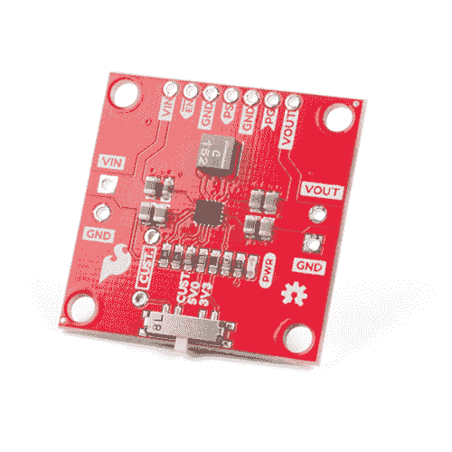

# 降压升压连接指南

> 原文：<https://learn.sparkfun.com/tutorials/buck-boost-hookup-guide>

## 介绍

我们抓到那个巫师了！[降压升压转换器](https://www.sparkfun.com/products/15208)是 SparkFun 的最新突破，允许您微调项目接收的功率量。它可以接受从 **3-16V** 的任何输入电压，然后可以将该电压调节到 **2.5-9V** 之间的输出电压。利用电路板底部的开关，您可以设置 3.3V 和 5V 的常见输出电压，但我们还打破了一个自定义设置，允许您根据您的自定义电压需求填充电阻。更重要的是，我们在电路板顶部断开了 GPIO 引脚，以便进行更多的控制。加油吧！

 

将**添加到您的[购物车](https://www.sparkfun.com/cart)中！**

### 

[In stock](https://learn.sparkfun.com/static/bubbles/ "in stock") COM-15208

SparkFun 降压-升压转换器是一个方便的电源附件板，允许您微调您的项目的功率量

$10.952[Favorited Favorite](# "Add to favorites") 26[Wish List](# "Add to wish list")** **[https://www.youtube.com/embed/lwYBnJvD5ss/?autohide=1&border=0&wmode=opaque&enablejsapi=1](https://www.youtube.com/embed/lwYBnJvD5ss/?autohide=1&border=0&wmode=opaque&enablejsapi=1)

### 所需材料

要跟随本教程，您将需要以下材料。你可能不需要所有的东西，这取决于你有什么。将它添加到您的购物车，通读指南，并根据需要调整购物车。**