# 建造自主车辆:蝙蝠战车

> 原文：<https://learn.sparkfun.com/tutorials/building-an-autonomous-vehicle-the-batmobile>

## 回答为什么

为什么要为 [A+PRS](https://avc.sparkfun.com/) 造一辆自动驾驶汽车？

[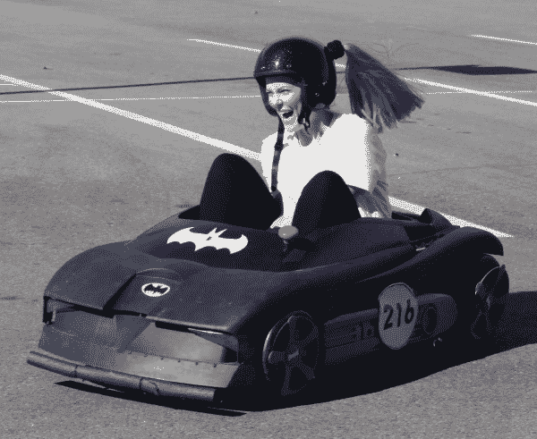](https://cdn.sparkfun.com/assets/learn_tutorials/5/8/9/Smiles-3.JPG)*Test driving the Batmobile*

在离地面极低的地方转弯的快感，你的直觉告诉你这些重力不正常...这就是为什么我们花了无数的时间来制造这些愚蠢的电动轮汽车。咯咯笑和咧嘴笑是不可避免的！这些车开起来很有趣，比赛起来更有趣！

[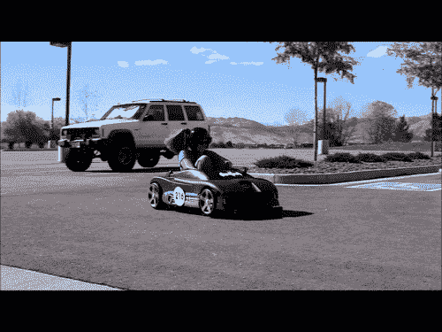](https://cdn.sparkfun.com/assets/learn_tutorials/5/8/9/Toni-Racecar-Driver.gif)

2016 年，SparkFun 举办了第八届年度[自动驾驶汽车比赛](https://avc.sparkfun.com)。今年引入了一条新规则:你需要背着一个人(如果你太胆小，可以背一个 20 磅重的西瓜)。为了做到这一点，我的妻子艾丽西娅和我改装了一辆蝙蝠机动车辆的动力轮，并把它与剃刀底盘结合在一起。结果是一辆极其轻快的电动卡丁车，让每个驾驶它的人都留下了永久的笑容。

我们的目标是创造一种可以快速轻松地在人类驾驶员和无人驾驶模式之间切换的车辆，以便我们可以在 PRS 和 A+PRS 类别中竞争。最终，艾丽西娅在车手类别中获得了非常令人尊敬的第三名，而我没有在自动驾驶类别中完成(DNF)，跑进了许多干草包。

本教程试图记录一个自主+动力赛车系列(A+PRS)车辆六个月的建造过程。每辆自动驾驶汽车都是独一无二的，每辆汽车的要求也因车型不同而不同。

[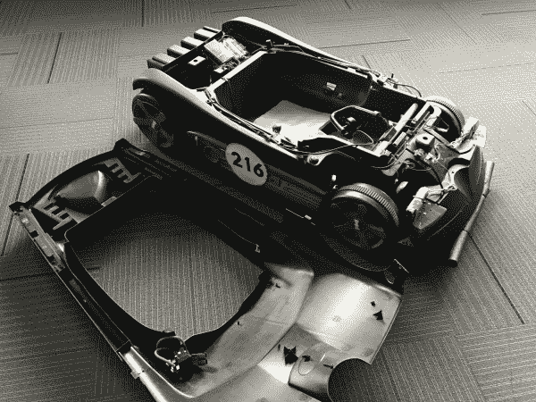](https://cdn.sparkfun.com/assets/learn_tutorials/5/8/9/Top_Off.JPG)

### 材料

您可以在这里看到我们的整体预算，包括组件和供应商列表[。](https://docs.google.com/spreadsheets/d/1ArnGv4S5Yt92EbWMC0-9kvYVRUPvtWbAeWbnaERji5Y/edit?usp=sharing)

[A+PRS Batmobile Material Spreadsheet](https://docs.google.com/spreadsheets/d/1ArnGv4S5Yt92EbWMC0-9kvYVRUPvtWbAeWbnaERji5Y/edit?usp=sharing)
You can get all the code from our repo [here](https://github.com/nseidle/APRS).[A+PRS Batmobile GitHub Repository](https://github.com/nseidle/APRS)

## 底盘

AVC 规则规定，你的总预算不能超过 500 美元，并且你必须保持在一定的规模限制内。我们开始浏览 craigslist，看看那里有什么，并立即发现了大量免费或廉价的“坏掉的”电动轮。当一辆售价 25 美元的蝙蝠战车出现时，我们很快就抢到了它。

[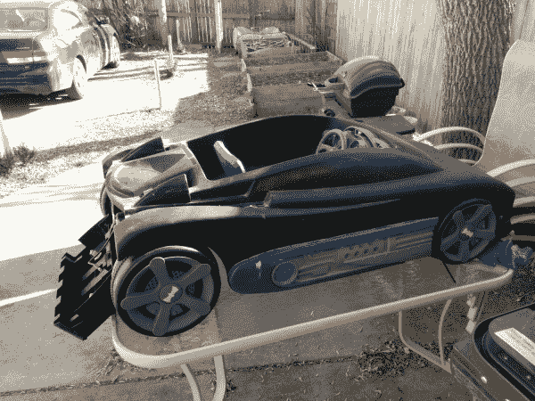](https://cdn.sparkfun.com/assets/learn_tutorials/5/8/9/Batmobile.jpg)*Dusty with dog hair and dead spiders -- it's perfect!*

所有二手动力轮的主要故障是电池没电。蝙蝠战车没有什么不同；我们一放进一个新的 12V SLA(密封铅酸)，它就愉快地，尽管很慢，四处行驶。“动力轮”品牌电池没什么神奇的；选择合适的电压(通常是 12V，有时是 6V)，你几乎可以使用任何你喜欢的电池。

最初的蝙蝠战车底盘是用最好的塑料吹制而成的。车轮是空心的，马达设计用来缓慢地(并且相当安全地)移动孩子，方向盘上散落着一些金属，但大部分都是松动和不稳定的。虽然库存底盘能够移动体重约 200 磅的成年人，但我们知道它无法应付比赛，所以我们决定找一个金属底盘坐在下面。

[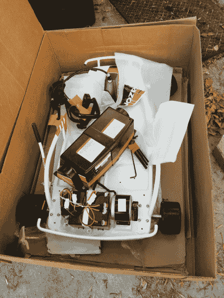](https://cdn.sparkfun.com/assets/learn_tutorials/5/8/9/Razor_Drifter.jpg)*Note the size of the motor and battery. Those are about to get **much** larger.*

Razor 因其踏板车而闻名，但他们也涉足电动卡丁车市场。我们找到了一个 165 美元的[剃刀冲头](https://www.razor.com/products/ride-ons/ground-force-drifter/)开口盒。漂流者为我们整理了方向盘、刹车、车轮和底盘！此外，漂流物配备了 24V 电池、250W 电机和 250W 电机控制器。

许多 [PRS 和 AVC 竞争对手](https://www.flickr.com/photos/sparkfun/sets/72157674124240695)有足够的天赋将他们自己的底盘焊接在一起。DIY 焊接是一个省钱的好方法，但是可能需要几周的制作时间。因为我们计划进入自主领域，所以我们决定找到一个现成的底盘，然后花时间构建和调试自主位。

## 戴上帽子

一旦我们有了动力轮和剃须刀底盘，我们就必须将两者结合起来。

我们把剃刀底盘滑到塑料蝙蝠车壳下面。剃刀底盘有我们最需要的力量:转向，底盘，刹车，传动系统，一切。塑料蝙蝠战车只是一个外壳。四个实心塑料+橡胶剃刀轮与地面接触。四个中空的蝙蝠战车轮子悬浮在地面上，只是为了装饰外观(lulz)。

[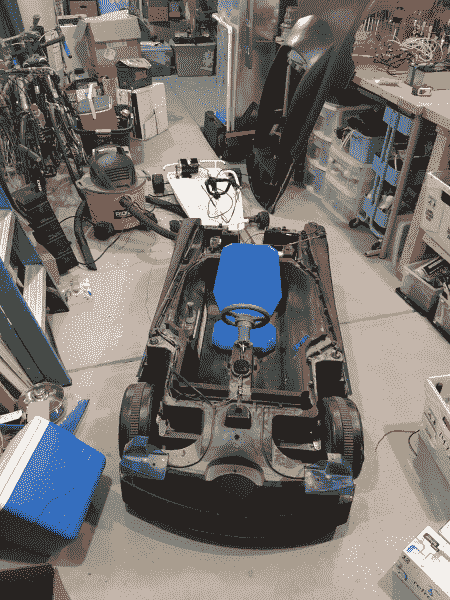](https://cdn.sparkfun.com/assets/learn_tutorials/5/8/9/PowerWheels_and_Chassis.jpg)*A Power Wheels meets a Drifter*

在某些时候，你必须拿出往复锯，并严重修改你美丽的动力轮。我们把蝙蝠战车放在剃刀上，开始切掉所有挡路的碎片。

*Bare metal chassis before shell is laid on top*[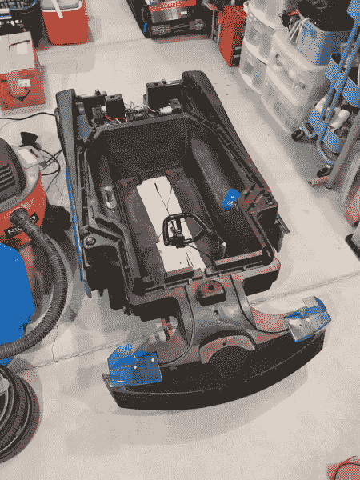](https://cdn.sparkfun.com/assets/learn_tutorials/5/8/9/Power_Wheel_on_Chassis.jpg)*Seats? Where we're going, we don't need seats!*

令人高兴的是，蝙蝠战车位于底盘顶部，有自己的结构支撑。我们不需要添加全线程或其他的隔离。尽管它们什么也没做，我们还是重新安装了原来的轮子，这样看起来就特别古怪。

## 电机和电机控制

[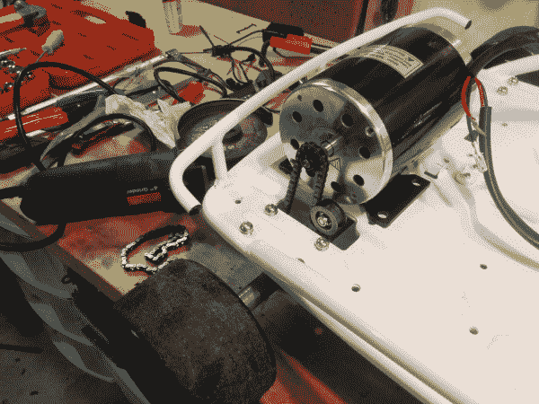](https://cdn.sparkfun.com/assets/learn_tutorials/5/8/9/Motor_1.jpg)*Moar!*

2016 年 A+PRS 允许 48V 系统，所以我们做的第一件事就是拆下 24V 电机，安装一个 1,000W 的 48V/21A 电机。PRS 规则将任何系统限制在 1，400 瓦，因此如果预算限制没有很快生效，我们可能会更大。新的安装孔钻入底盘，不同的齿轮必须安装到电机的末端。但一切都很顺利。股票底盘甚至包括一个链条张紧证明是无价的！

我们使用的 MY1020 48V 电机在 PRS 电路上很常见，性能很好。然而，我们最初的 1000 瓦电机控制器(你应该已经能够知道接下来会发生什么)表现不佳。我们在露天停车场对 48V 系统的第一次测试非常成功，直到电机控制器过热并出现故障。当基于 MOSFET 的电机控制器出现故障时，它们会不安全地出现故障，这意味着我们的车辆决定 100%节流并保持不动。这就是为什么我们有安全开关的原因！艾丽西娅和我在有人受伤之前就把车撞死了。

这种故障应该是可以避免的:电机控制器的额定功率应该至少是你计算的最大负载的两倍。在我们的例子中，如果我们想要控制一个 1kW 的电机，我们应该使用额定负载为 2kW 的电机控制器。幸运的是，A+PRS 规则不要求你记录你花了多少钱(和烧掉了多少钱)；你只需要在比赛当天报告车上的东西。

[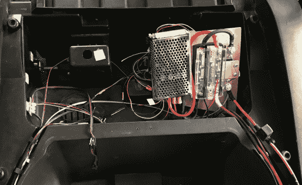](https://cdn.sparkfun.com/assets/learn_tutorials/5/8/9/Motor_Controller.JPG)*The new, larger 5kW motor controller*

我们很快找到了一个更大的 5kW 电机控制器(这个甚至有反转功能！)并订购了它。从那以后，这个更大的电机控制器一直运转良好。找一个带反转的电机控制器。你会忍不住在奇怪的地方(比如 SparkFun 库存通道)驾驶你的动力轮，倒车档允许滑稽的 5 点转弯。

## 刹车

[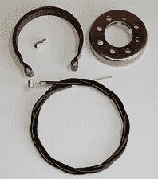](https://cdn.sparkfun.com/assets/learn_tutorials/5/8/9/Drum_Brake.jpg)*Go-kart drum brakes on eBay*

剃须刀的底盘有典型的鼓式制动器，这可能是剃须刀最薄弱的环节。虽然备用刹车对于一个 75 磅的 24V 电池的孩子来说可能是合适的尺寸，但一旦我们增加了额外的 125 磅肉袋、电池和塑料块，我们的刹车就变得很软。我们很少在比赛中使用刹车，但是[的 PRS 规则](http://www.powerracingseries.org/)规定你的排位赛圈必须在车手冲过终点线并刹车停下来时结束:

> 在热圈结束时，你的赛车必须在它的应答器越过起跑线/终点线后 18 英尺内完全停下来。在制动测试中，故意打滑、急转弯或打滑是不可接受的制动方法。

艾丽西娅必须以如此戏剧性的天赋完成令人印象深刻的急刹车、急转弯、侧滑和滑行的组合，以至于她恳求评委不要注意到我们的刹车有多危险。我们将在 2017 年比赛前安装盘式制动器。

## 电池

[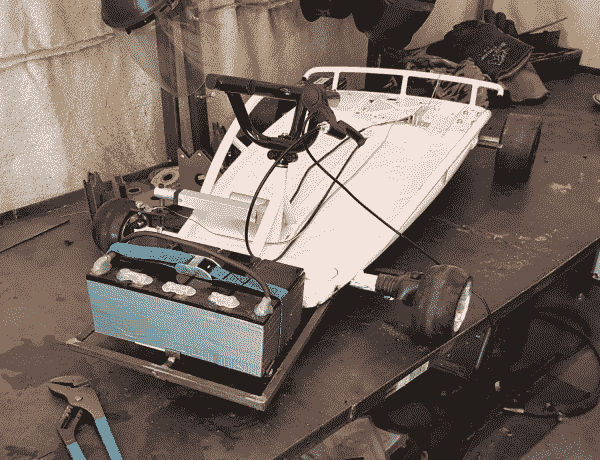](https://cdn.sparkfun.com/assets/learn_tutorials/5/8/9/Battery_On_Chassis.jpg)*Battery holder welded onto the front of the chassis*

作为电机升级的一部分，我们需要将电池电压提高到 48V。为了省钱，我们重新使用了 24V 剃须刀底盘附带的超级普通电池。雷泽很聪明；他们研究了 SLA(密封铅酸)电池行业，选择了最常见的尺寸。这恰好是地球上几乎每一个不间断电源所用的同一块电池。我们额外购买了两块 UPS 大小的电池(比购买剃须刀品牌的电池便宜得多),并把它们串联起来。

[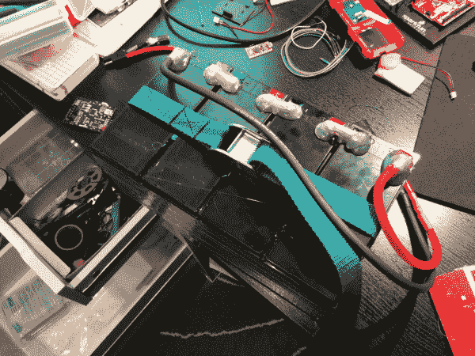](https://cdn.sparkfun.com/assets/learn_tutorials/5/8/9/Battery_Unit.jpg)*Four batteries combined in series*

用胶带将电池粘在一起，并在电池之间加入一滴热胶，使得包装非常坚固。一个低成本，极化，高电流连接器完成了包装。我们有一条旧皮带，它让世界变得不同。单手提着包的把手比双手放在下面要舒服得多。

[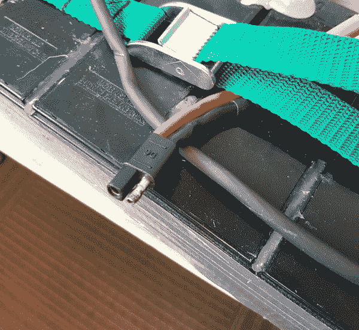](https://cdn.sparkfun.com/assets/learn_tutorials/5/8/9/Battery_Connector.jpg)

避免火灾和其他不好的事情。为你的电池使用极化连接器。

## 电线

[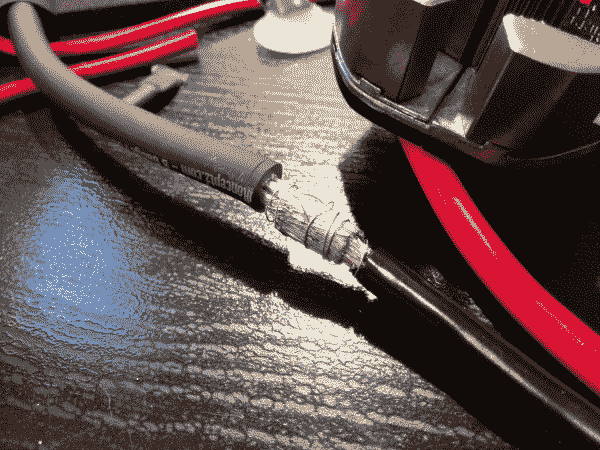](https://cdn.sparkfun.com/assets/learn_tutorials/5/8/9/Soldering_Wire.jpg)*Soldering large-gauge wire*

我们最初设计了一些非常好的，超级柔软的硅护套 8AWG 电线用于配电。我认为我们不会再这样做了；10AWG 就可以了，甚至可能是 12AWG。由于 8 号线不太常见，电线和连接器更贵，更大规格的电线需要更多的焊接热量-这只是一个痛苦的工作。如果你需要目前的能力，去做吧，但对于我们非常活泼，48V 20A 的车辆，8 号线是多余的。

如果你决定使用超级灵活，大规格的电线，花一些时间在互联网上阅读如何焊接这种类型的电线。

我发现的最好的技巧是:

*   确保你已经准备好热缩材料
*   把你的烙铁调到 425 摄氏度(比通常需要的 325 摄氏度要高很多)
*   把金属丝的两端推到一起
*   用 30AWG 绕线紧紧缠绕
*   大量使用助焊剂
*   加热并插入大量焊料，直到接头变成银色

这里有一个很好的视频演示了这种技术:

[https://www.youtube.com/embed/7t9nT3Hn9b0/?autohide=1&border=0&wmode=opaque&enablejsapi=1](https://www.youtube.com/embed/7t9nT3Hn9b0/?autohide=1&border=0&wmode=opaque&enablejsapi=1)

## 切断开关

我们记录了[如何在制作玛格丽塔酒时制造一个无线切断开关](https://learn.sparkfun.com/tutorials/how-to-build-a-remote-kill-switch)。这是一个有趣的吨，所以我们将跳过无线开关系统在这里的位。

[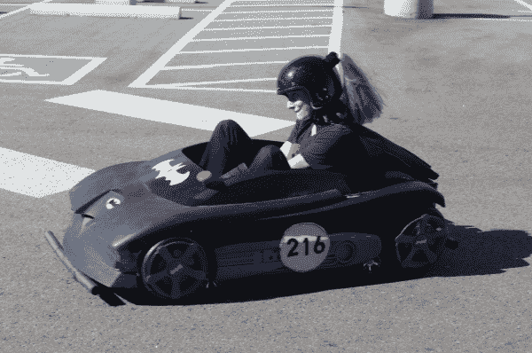](https://cdn.sparkfun.com/assets/learn_tutorials/5/8/9/Smiles.JPG)*Zroooommmm!*

除了无线断开之外，我们还有一个大的红色蘑菇状切断开关，它会发出悦耳而权威的“铛”声来断开电池。拉起蘑菇按钮会将电池重新连接到系统。

[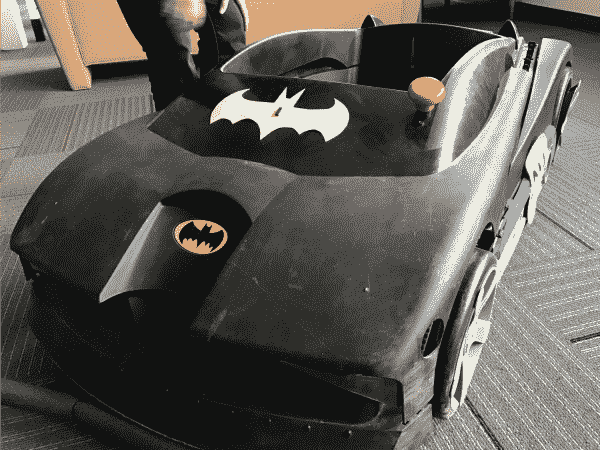](https://cdn.sparkfun.com/assets/learn_tutorials/5/8/9/Kill_Switch.JPG)*Batman logo or Bitman logo?*

作为一个令人愉快的额外功能，蘑菇杀死开关摆脱了讨厌的火花。当将电池连接到电机控制器时，有大量电流涌入电容器和电子设备，连接器会产生火花。一旦我们安装了切断开关，我们就可以在没有火花的情况下连接/断开电池。

[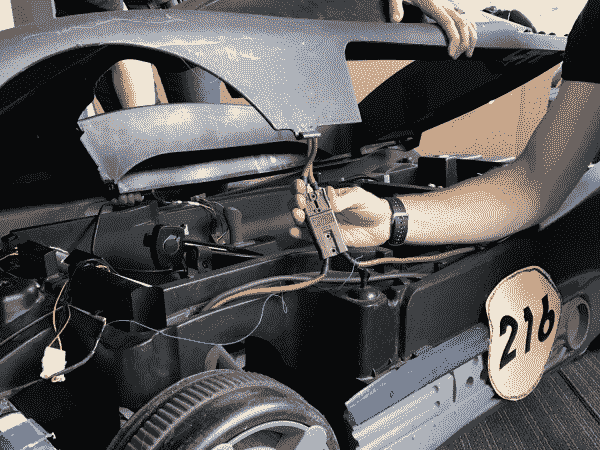](https://cdn.sparkfun.com/assets/learn_tutorials/5/8/9/Power_Connector.JPG)*Connector between kill switch and power bus*

蝙蝠战车的顶部很容易被移除，但因为它安装了切断开关，我们需要一种方法来轻松地将其从电源总线上断开。我们在一个废弃的服务器 UPS 中发现了一个很棒的大功率连接器。这些通常被称为“绞盘连接器”，因为它们的电流更高。有了这个连接器，当我们需要进入车辆内部时，我们能够快速断开断路开关并移除顶部。

## 控制电子学

[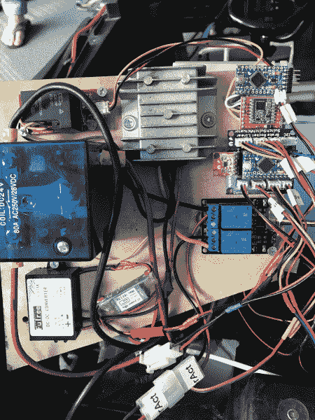](https://cdn.sparkfun.com/assets/learn_tutorials/5/8/9/Locomotion_Control-2.JPG)*Power converters, motor kill relays, steering relays, locomotion controller and wireless communication*

控制电子设备很复杂。我们在这个 beast 上总共有七个微控制器，加上三个用于距离传感器的微控制器，总共有 216 位的处理能力。该系统在 I ² C 总线上运行，大脑向运动控制器和 LCD 发送命令，并从传感器接收数据。

[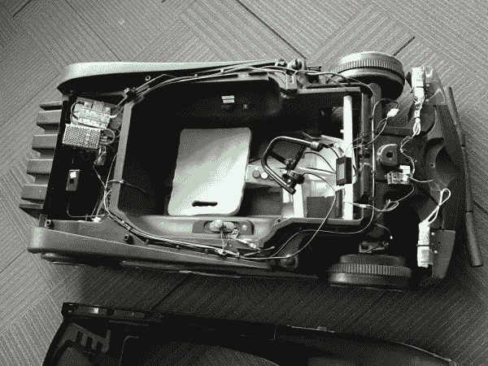](https://cdn.sparkfun.com/assets/learn_tutorials/5/8/9/AVC-Wiring.JPG)*The wiring underneath the Batmobile cover*

对于之前的 [2010 AVC 参赛作品](https://www.flickr.com/photos/sparkfun/4535755865/in/album-72157623889963470/)，我在单个微控制器上做了**所有的事情**。这使得编码和调试成为一项挑战。在我们 2016 年的参赛作品中，我们让每个子系统都专注于做好*一件事*。

子系统细分如下:

*   大脑控制器:一个 [SAMD21 Mini](https://www.sparkfun.com/products/13664) 用于与距离传感器、GPS 和指南针通信并处理所有数据，并发出命令来控制油门和转向。它监控一个启动开关，并将调试信息转发给 LCD。
*   运动控制器:一个 Arduino Pro Mini 读取油门、转向位置、刹车开关和自主火箭开关。它控制马达速度和用于转向的线性致动器。
*   无线终止开关:一个 Arduino Pro Mini 生活在无线终止开关中，这是我们的蝙蝠战车自主部分的一个要求。要了解更多关于无线控制器的信息，请查看我们的教程[如何构建无线断路开关](https://learn.sparkfun.com/tutorials/how-to-build-a-remote-kill-switch)。
*   专用的 Arduino Pro Mini 控制无线断路开关系统的继电器。
*   调试 LCD:我们把我们的 [LCD 屏幕](https://www.sparkfun.com/products/9568?_ga=1.105004803.1411252641.1461206980)算作一个微控制器，因为它里面有一个 Arduino。
*   传感器组合器:一个 SAMD21 Mini 轮询串行 GPS 和 I ² C 罗盘。
*   激光控制器:一个 SAMD21 Mini 控制三个基于串行的激光距离传感器，结合相关信息并响应来自大脑的请求。
*   三个 STM32s 是激光距离传感器的大脑。

## 有兴趣了解更多关于距离感测的知识吗？

了解距离传感器使用的不同技术，以及哪些产品最适合您的下一个项目。

[Take me there!](https://www.sparkfun.com/distance_sensing)

* * *

## 控制电子-大脑

[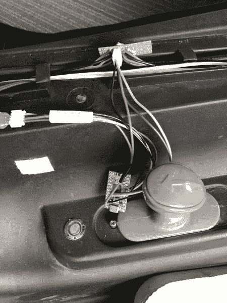](https://cdn.sparkfun.com/assets/learn_tutorials/5/8/9/Reverse_and_Main_Controller.JPG)

大脑是一个 [SAMD21 迷你](https://www.sparkfun.com/products/13664)。它通过 I ² C 总线向运动控制器和调试 LCD 发送命令。

**图中顶部的 4 针 JST 连接器:**我们使用 4 线总线(5V、GND、SDA、SCL)进行通信，并在整个总线上安装了各种抽头，以便连接设备。这在*真的*很有效，允许设备在需要的时候移动。

**左边的 4 针 JST 连接器:**这是按钮的四根电线。为了告诉车辆开始在自主控制下导航，我们使用了一个[金属瞬时按钮](https://www.sparkfun.com/products/11970)，当一切都在线并且快乐时，它就会点亮。人类按下按钮两次，汽车开始比赛。

**大灰色手柄:**这是我们重新使用的原始正向和反向旋钮，用于控制电机控制器上的方向开关(两个引脚短接在一起时导致一个方向，断开时导致另一个方向)。

在这里可以找到大量写得很差的大脑控制代码[。](https://github.com/nseidle/APRS/tree/master/TheBrain)

**用于航路点的 EEPROM**

SAMD21 没有内部 EEPROM。因为我们需要将 GPS 路点和其他配置数据存储到非易失性存储器中，所以我们使用了外部的 [I ² C EEPROM](https://www.sparkfun.com/products/525) 。是的，您可以在 SAMD21 上使用被称为仿真 EEPROM 的东西，但是，每次对电路板重新编程时，您都会覆盖仿真 EEPROM 中先前存储的任何内容。外部 EEPROM 使得存储和调用航路点和设置变得更加容易，而不必在主控制代码中混在一起。

## 控制电子-运动

[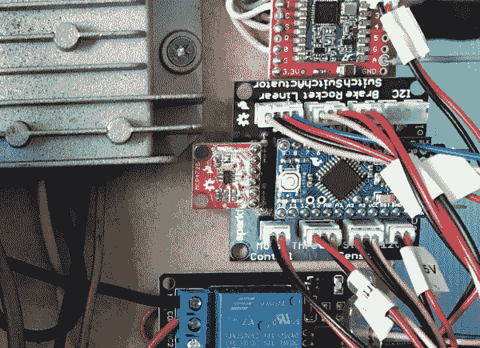](https://cdn.sparkfun.com/assets/learn_tutorials/5/8/9/Locomotion_Control.jpg)*Locomotion Controller hooked up*

注意两极分化的连接器和巨大的标签！你不会想在比赛日之前的晚上 11 点猜什么东西插在哪里。运动控制器代码在[这里](https://github.com/nseidle/APRS/tree/master/LocomotionControl)可用，PCB 布局[这里](https://github.com/nseidle/APRS/tree/master/LocomotionPCB)可用。

因为我们最终希望这种动物能够自主，所以我们需要在油门和马达控制器之间放置一个控制器。我们使用了一台 Arduino Pro Mini，它可以进行各种各样的传感和控制:

*   阅读油门
*   向电机控制器输出模拟电压
*   读取制动开关
*   读取转向位置
*   控制线性转向执行器
*   读取人/机器人控制开关
*   接收并响应 I ² C 上的控制命令

[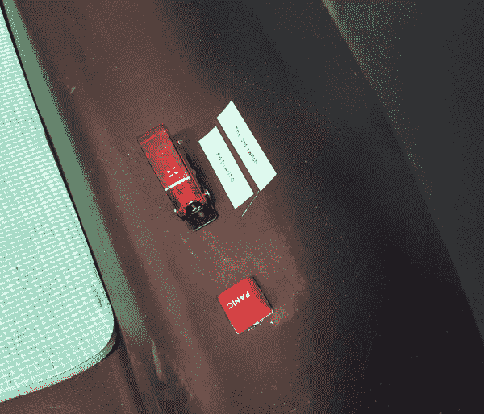](https://cdn.sparkfun.com/assets/learn_tutorials/5/8/9/The_Third_Switch.jpg)*Don't panic*

控制器将监控火箭开关和刹车开关。如果有人踩下刹车或关闭火箭开关，控制器将进入安全关闭状态，并忽略来自大脑的任何命令。

[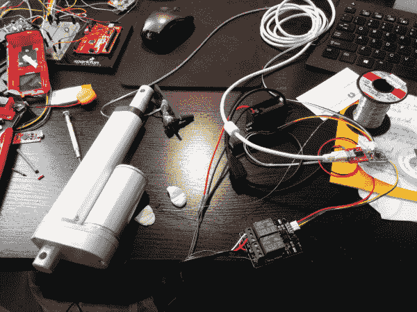](https://cdn.sparkfun.com/assets/learn_tutorials/5/8/9/Steering_Actuator-2.jpg)

使用过压至 24V 的 12V 线性致动器控制转向，以获得额外的速度。两个继电器控制向前/向后运动。

[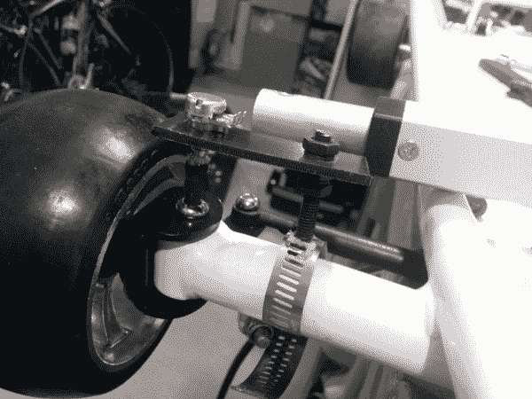](https://cdn.sparkfun.com/assets/learn_tutorials/5/8/9/Steering_Position_Sensor.jpg)

通过将六角扳手切割成大约 1 英寸并将该扳手插入与车轮一起旋转的螺栓中来获得转向位置。然后，使用衬有粘合剂的热收缩将扳手连接到 10k trimpot 上——这种技巧被称为“穷人的耦合器”:一根 3 线丝带将 trimpot 连接到运动控制器。它工作得很好，但我们必须让模拟信号线远离电源总线；否则，ADC 读数中会有不良噪声。

[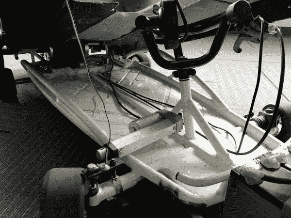](https://cdn.sparkfun.com/assets/learn_tutorials/5/8/9/Steering_Actuator.JPG)*Chassis with the Batmobile raised to see the steering actuator*

对于未来的车辆，我们将改变这种设置。它工作得足够好，但是一旦螺栓将致动器连接到转向装置，你就无法驾驶汽车；只有电脑可以。所以我们没有把车开到起跑线上，而是不得不扛着这个 75 磅的庞然大物。好痛苦。在未来，我们计划找到一个反向驱动的驱动器，或者可能是线控驱动。

## 控制电子设备-显示器

[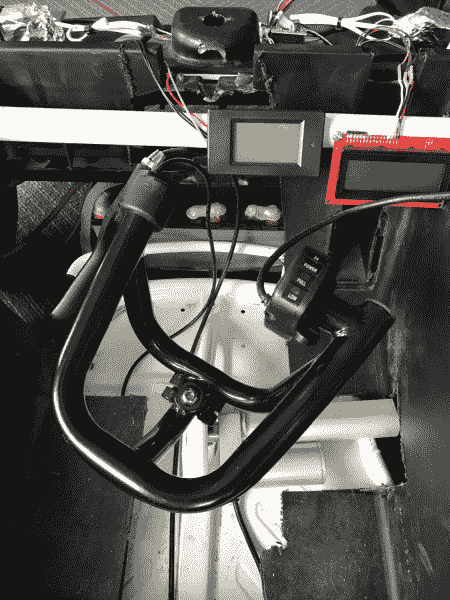](https://cdn.sparkfun.com/assets/learn_tutorials/5/8/9/Throttle.JPG)*Throttle and displays*

我们在一个 1 英寸的 PVC 管上切了一些凹槽，并在蝙蝠车里安装了两个显示器。中间的显示屏是功率计。几乎每个 A+PRS 和 PRS 竞争对手都使用这些超级[低成本功率计](https://www.amazon.com/gp/product/B013PKYILS/ref=oh_aui_detailpage_o00_s00?ie=UTF8&psc=1)来显示电池电压。我们有一些问题，但它工作得足够好。最后，在我们注意到显示屏显示电池组电压降低之前，我们注意到车速下降(表明电池电量耗尽)。但是，它确实帮助我们决定何时进站(永远不要！)因为标称的 48V 组件电压下降到 42V，我们可能会开始损坏 SLA。

右边的显示屏是 20x4 字符的调试液晶屏。这基本上是我们的 [20x4 SerLCD](https://www.sparkfun.com/products/9568) 显示器的升级版(这是一个原型产品，很快就会在你附近的影院推出！).

## 控制电子设备-传感器

[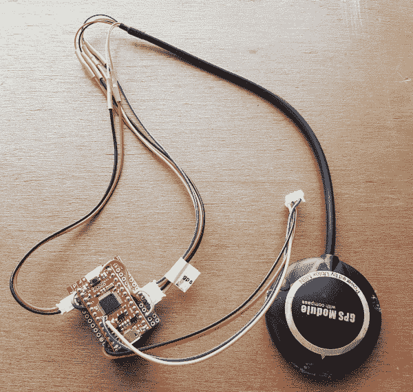](https://cdn.sparkfun.com/assets/learn_tutorials/5/8/9/Sensor_Combinator.jpg)*GPS+Compass connected to SAMD21*

传感器组合器是一个 SAMD21 Mini，它监控一个 GPS 接收器和一个 I ² C 罗盘。我们决定使用 SAMD21，因为它可以配置成具有多个硬件串行和 I ² C 端口。如果你想将 I ² C 设备与主总线隔离，这是必要的。我们想让大脑请求航向并得到航向；传感器组合器负责罗盘的低级 I ² C 功能和航向计算。类似地，Combinator 监听来自基于 u-blox 的 GPS 模块的串行流，并解析出所有需要的纬度/经度/SIV 信息。

传感器组合器的代码可以在[这里](https://github.com/nseidle/APRS/tree/master/SensorCollator)找到。

## 控制电子学-激光器

*Laser tape measures seen on the front of the car, wrapped in foil*

我们破解了三个激光卷尺来测量车前方、左侧或右侧的障碍物。激光卷尺越来越便宜，虽然读取速率(最好的情况下为 3Hz)对激光雷达来说不是很好，但对于基本的低成本自主来说已经足够快了。

[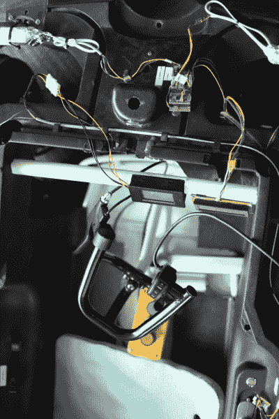](https://cdn.sparkfun.com/assets/learn_tutorials/5/8/9/Lasers.jpg)*Laser Controller at front of car*

不幸的是，激光卷尺释放出足够的射频干扰我们的 GPS 模块，所以我们用箔片包裹激光器。这些传感器值得拥有自己的教程，很快就会写出来。

[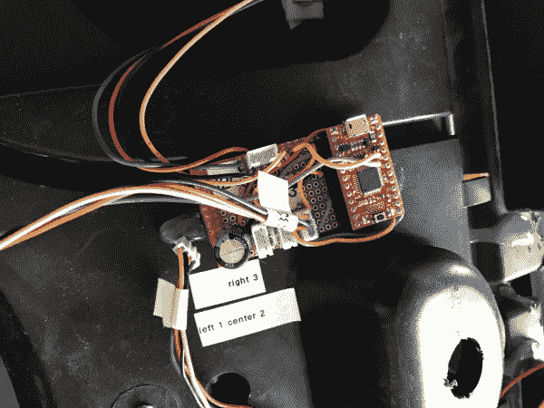](https://cdn.sparkfun.com/assets/learn_tutorials/5/8/9/Laser_Control.JPG)*Laser Controller with labels*

我们再次选择了 [SAMD21 Mini](https://www.sparkfun.com/products/13664) 来帮助我们控制和组合来自三个传感器的串行信息。激光控制器将相关的控制字符串发送到卷尺并监控响应，将它们组合成左/右/中心的距离。大脑会通过 I ² C 向激光控制器请求这些值

注意大量的标签和极化连接器([jst](https://www.sparkfun.com/products/9916)工作得很好！).这个系统需要大量的调试，但运行良好，因为我们能够快速断开和重新连接系统的各个方面。

激光控制器的代码可以在[这里](https://github.com/nseidle/APRS/tree/master/LaserControl)找到。

## 问题

与任何项目一样，我们在前进的道路上有大量的问题和障碍要克服。这里有几个真的很伤人。

** EMI 和 GPS **

激光卷尺测量对 GPS 接收造成了严重干扰。我们最终将 GPS 模块移到了车尾，这提高了定位精度。然而，马达干扰了指南针。

** DC 电机电动势**

DC 汽车产生大量的电磁噪音。我们最初用 48V 电池为整辆车供电。然而，当电机启动时，它会引起足够的纹波，使大脑失灵并重置。我们尝试单独为 I ² C 总线供电，但是，因为运动控制器需要连接到电机控制器，所以必须共享 GND 连接。噪音最终传到了 I ² C 总线上。将来我们将光学隔离 I ² C 总线。

**缺少 EEPROM **

因为 SAMD21 没有内部 EEPROM，我们无法在板上存储 GPS 航路点。我们通过使用基于 I ² C 的 EEPROM 解决了这个问题。

**在驾驶员/无人驾驶之间切换转向**

很难将线性致动器与齿轮齿条式转向装置连接和分离。一旦致动器连接到方向盘上，驾驶员就不能主动转向(例如，转向起跑线)。这可以用一个可以反向驱动的不同致动器来解决，或者我们可以完全将转向柱从转向上拆下来，让它控制一个 trimpot，进而控制线性致动器(线控驱动)。

## 技巧/最佳实践

**小贴士 1)早点出发** -这些交通工具需要很长时间。和朋友聚在一起，开始黑。这是一项伟大的爱的劳动，在时速 15 英里的卡丁车里漂流会让你咯咯地笑。

**提示 2)换向** -换向电机控制器。它将使你可以*驾驶*你的车去你想去的地方，而不是*载着*你的车去你需要的地方。

技巧 3)使用连接器！ -我写过几次关于[使用连接器](https://www.sparkfun.com/tutorials/282)的文章。使用极化连接器和标签制作机，以明确什么插头插在哪里。

**提示 4)正确确定电机和电机控制器的尺寸** -我们搞砸了电机控制器，因为它被低估了。我们的一个朋友因为电流太大而烧坏了他的马达。选择您的系统电压和电流，然后尽可能将额定值加倍。

**提示 5)谨防干扰**——这些车辆加速时能拉 30 安培甚至更大的电流，会产生很大的电磁场。让未屏蔽的电缆和敏感的传感器远离电源线。

**提示 6)无线控制和传感器记录**——当你拿起你的 75 磅重的车辆，第五次把它拖到起跑线后，你就会明白遥控的必要性。创建一个无线系统，让你从远处接管车辆的控制权，这样你就可以把它开到你需要的地方。并传输传感器数据，这样你就可以看到车辆在做什么。

[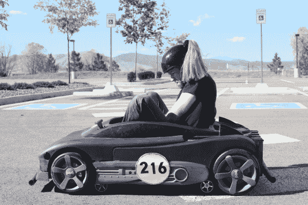](https://cdn.sparkfun.com/assets/learn_tutorials/5/8/9/Contemplation.jpg)

希望你喜欢阅读！明年的 [AVC](https://avc.sparkfun.com/) 见！

* * *

寻找更多 AVC 相关信息？看看这些相关的博客帖子:

 [### AVC 2011！！！

January 18, 2011](https://www.sparkfun.com/news/526 "January 18, 2011: The flood gates are open for AVC 2011.")[Favorited Favorite](# "Add to favorites") 0 [### 儿童 AVC 2012

May 31, 2012](https://www.sparkfun.com/news/877 "May 31, 2012: Bring your robot to SparkFun for some kids-only robotic glory!")[Favorited Favorite](# "Add to favorites") 0 [### AVC 回顾视频:战斗机器人

October 17, 2016](https://www.sparkfun.com/news/2210 "October 17, 2016: 3...2...1...FIGHT!")[Favorited Favorite](# "Add to favorites") 0 [### AVC 就在这个周末！

October 9, 2017](https://www.sparkfun.com/news/2496 "October 9, 2017: Thanks to some big bots, student teams and first-time competitors, we are now the third largest combat robotics tournament in the world!")[Favorited Favorite](# "Add to favorites") 0

查看这些教程，了解更多内容！

 [### 建造自主车辆:蝙蝠战车](https://learn.sparkfun.com/tutorials/building-an-autonomous-vehicle-the-batmobile) Documenting a six-month project to race autonomous Power Wheels at the SparkFun Autonomous Vehicle Competition (AVC) in 2016\.[Favorited Favorite](# "Add to favorites") 8 [### 什么是 GPS RTK？](https://learn.sparkfun.com/tutorials/what-is-gps-rtk) Learn about the latest generation of GPS and GNSS receivers to get 14mm positional accuracy 9 [### GPS-RTK 连接指南](https://learn.sparkfun.com/tutorials/gps-rtk-hookup-guide) Find out where you are! Use this easy hook-up guide to get up and running with the SparkFun high precision GPS-RTK NEO-M8P-2 breakout board.[Favorited Favorite](# "Add to favorites") 5 [### u-blox 的 U-Center 入门](https://learn.sparkfun.com/tutorials/getting-started-with-u-center-for-u-blox) Learn the tips and tricks to use the u-blox software tool to configure your GPS receiver.[Favorited Favorite](# "Add to favorites") 2 [### 设置基于流动站的 RTK 系统](https://learn.sparkfun.com/tutorials/setting-up-a-rover-base-rtk-system) Getting GNSS RTCM correction data from a base to a rover is easy with a serial telemetry radio! We'll show you how to get your high precision RTK GNSS system setup and running.[Favorited Favorite](# "Add to favorites") 15 [### 如何建立一个 DIY GNSS 参考站](https://learn.sparkfun.com/tutorials/how-to-build-a-diy-gnss-reference-station) Learn how to affix a GNSS antenna, use PPP to get its ECEF coordinates and then broadcast your own RTCM data over the internet and cellular using NTRIP to increase rover reception to 10km 14