# 按钮垫连接指南

> 原文：<https://learn.sparkfun.com/tutorials/button-pad-hookup-guide>

## 介绍

本教程介绍矩阵扫描技术，使用 [SparkFun 4x4 按钮板](https://www.sparkfun.com/products/8033)构建一个照明键盘。

[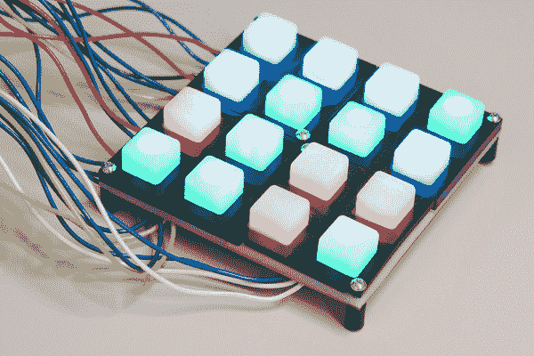](https://www.sparkfun.com/products/8033)*4x4 Button Pad with Arduino Mega 2560*

更重要的是，我们将介绍矩阵扫描的设计和实现的基本概念，这样读者可以为他们自己的项目调整和扩展这些技术。

### 本教程涵盖的内容

本教程由一系列循序渐进的练习组成。首先，我们将探索设计的基本概念和基础。然后，我们将应用我们所学的知识，组装 PCB，并完成几个应用程序，从简单开始，然后增加功能和复杂性。

1.  我们从组装键盘开始。
2.  接下来，我们将通过让单一颜色的 LED 发光来引入矩阵扫描。
3.  从那里，我们将添加按钮作为输入设备。
4.  最后，我们将启用矩阵中其他颜色的 led。

在此过程中，我们将探索一些有助于键盘的设计决策，并研究一些用于控制硬件的编码技术。

### 推荐阅读

*   在本教程中，我们将进行一些低级编程。这里假设你熟悉二进制数和十六进制数和十进制数的相互转换。
*   特别是，我们将使用[位操作符](https://learn.sparkfun.com/tutorials/binary#binary-in-programming)来执行矩阵扫描。
*   你需要熟悉[通孔焊接](https://learn.sparkfun.com/tutorials/how-to-solder---through-hole-soldering)。组装按钮垫涉及一些比我们大多数其他焊接项目更复杂的焊接技术。
*   矩阵扫描将利用内部[上拉电阻](https://learn.sparkfun.com/tutorials/pull-up-resistors)
*   矩阵扫描还使用[二极管](https://learn.sparkfun.com/tutorials/diodes)将开关相互隔离。

## 背景

即使您刚刚进入微控制器和嵌入式编程的世界，您可能已经将一些按钮和 led 连接到您的系统，并编写了让您使用按钮打开和关闭 led 的程序。让 LED 发光很有趣，如果有一个开关来开关它就更有趣了。

在 [SIK 实验指南](https://learn.sparkfun.com/tutorials/sik-experiment-guide-for-arduino---v32/experiment-3-driving-an-rgb-led)中的练习#3、#4 和#5 正是这样的版本。在这些实验中，各种 LED 和按钮被连接到一个红板上，通常一个引脚连接到一个按钮或 LED。

[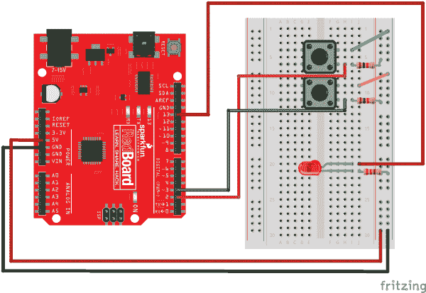](https://cdn.sparkfun.com/assets/learn_tutorials/4/6/2/RedBoard_circuit_05_01.png)

如果几个开关和发光二极管很有趣，那么一堆发光二极管和按钮就更好了，对吗？

这自然会引发关于按钮和 LED 附件限制的问题。如果 RedBoard 允许 20 个引脚用于数字 I/O(数字引脚 0-13，并将 A0 至 A5 重新用作数字引脚)，则允许连接总共 20 个单元的按钮和 led 混合。这种器件直接到引脚的连接策略还假设我们不需要将引脚用于其他目的，例如串行通信。

对于许多应用程序来说，这是一个非常严重的限制。

### 典型的例子

让我们来看看一个经典的微控制器系统，它有一个时尚的“按钮和 led”用户界面，即 [Roland TR-808 鼓机](https://en.wikipedia.org/wiki/Roland_TR-808)。

[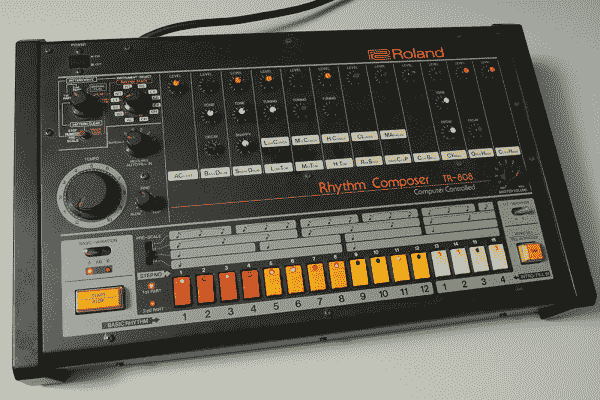](https://cdn.sparkfun.com/assets/learn_tutorials/4/6/2/808-angled.jpg)

控制面板的下边缘有 16 个按钮开关，每个都有一个红色 LED。机器使用 LED 来指示其当前状态，按下按钮会使相关的 LED 开关。

808 于 1980 年推出。内部的 NEC μPD650C 微处理器是当时最先进的，运行频率为 500 KHz(令人尖叫的半兆赫！)。它有 9 个 4 位宽的 I/O 端口，但其中许多端口被外部存储器总线占用(访问 4kb 的外部 RAM)，剩下 20 个引脚用于 I/O。

但是，TR-808 的设计者仅使用*十二个* I/O 引脚连接了所有 32 个组件。

他们是怎么做到的？让我们看看原理图的这一部分。

[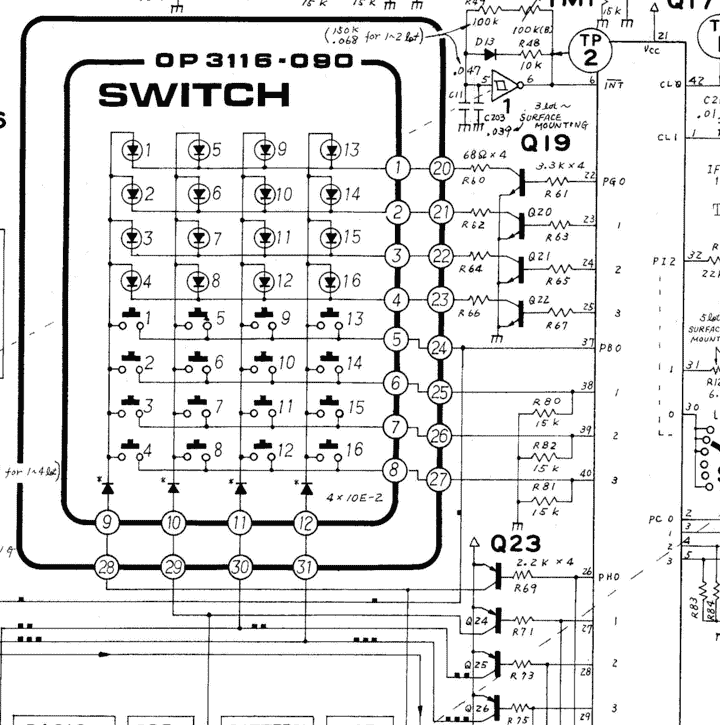](https://cdn.sparkfun.com/assets/learn_tutorials/4/6/2/tr808-schem-snip.png)*TR-808 keys and LEDs (Courtesy Archive.org)*

这里你可以看到靠近顶部的发光二极管，下面的按钮，以及左边的微控制器。led 和按钮呈**扫描矩阵**排列。

### 矩阵扫描导论。

矩阵扫描是一种常用技术，用于将输入或输出数量扩展到可用引脚数量之外。矩阵扫描需要在系统的硬件和软件两方面都有一些聪明之处——有一些微妙的因素在起作用。

为了创建一个扫描矩阵，我们没有直接使用 *n* 引脚作为输入或输出，而是将它们分配为笛卡尔坐标系的轴——把它们想象成经纬线。通常使用术语**行**来描述 X 轴组，使用**列**来描述 Y 轴组。矩阵中的任何交集都可以使用其 *X，Y* 或*行、列*坐标来描述。

[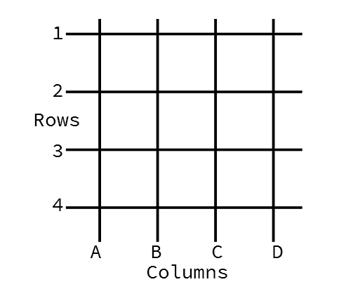](https://cdn.sparkfun.com/assets/learn_tutorials/4/6/2/row-col1.png)If you're having trouble keeping them straight, remember that [Doric](https://en.wikipedia.org/wiki/Doric_order) and [Ionic](https://en.wikipedia.org/wiki/Ionic_order) columns are vertical structures in classical architecture.

Also keep in mind that the physical layout of a matrix circuit may not correspond to the conceptual axes used in the design. We could lay LEDs out in a circle, but still use X,Y based scanning to address each of them.

扫描矩阵电路将电子元件放置在行、列交叉处。通过一次选择一行和一列，可以唯一地寻址每个组件。

#### 简单的例子

让我们探索一个简单的例子。使用四个引脚，我们将其中两个用作行选择器，另外两个用作列选择器。在矩阵的每个交叉点，我们将安装一个按钮开关，使行和列短路。

[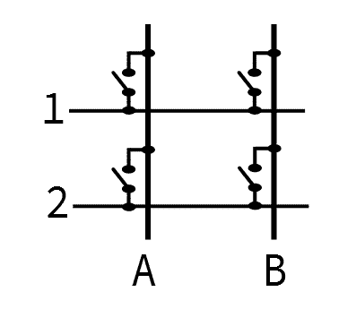](https://cdn.sparkfun.com/assets/learn_tutorials/4/6/2/row-col2x2-switches1.png)

*   row 引脚配置为输入，带有上拉电阻。我们称它们为 1 和 2。
*   列引脚被配置为输出。我们称他们为 A 和 b。
*   在每对引脚的交叉点，我们将放置一个瞬时接触开关，当它被按下时，该开关将行和列桥接起来。

为了使用这个矩阵，我们一次驱动一个输出来选择一列。当它被驱动时，我们读取输入。如果我们看到驱动信号从输入引脚返回，我们知道 X，Y 位置的开关闭合。

实际的扫描矩阵经常因为几个巧妙的原因反转引脚上的电压。使用反相逻辑被称为**低电平有效**系统。

Many microcontrollers have input pins that can be configured with an internal pull-up resistor. If nothing is driving a pulled-up pin, it will read as a logic high. It's uncommon for port pins to have an internal pull-down.

To take advantage of those internal pull-up resistors, scan matrices often use inverted logic. The selected row is set to a low level, and the others are set high. Reading the columns, we look for a logic low to indicate that a button is closed, allowing the selection signal through. This is also why we'll use the relative terms "selected" or "driven," rather than the absolute terms "high" and "low."

扫描包括在输出引脚周围移动逻辑低电平，并在输入引脚上寻找该低电平。

[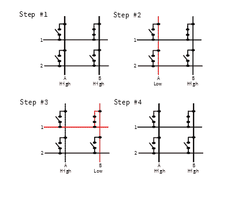](https://cdn.sparkfun.com/assets/learn_tutorials/4/6/2/row-col2x2-switches-scan.png)

上图中，B1 处的按钮被按住。随着扫描的进行，它会执行以下操作:

1.  未选择任何内容。输出 A 和 B 都很高，我们不担心输入 1 和 2。
2.  以逻辑低选择列 A。
    *   系统读取输入 1 和 2。两者均开路，因此上拉电阻会将输入拉高。由于这是一个有效的低矩阵，高输入表示没有按下任何东西。
3.  系统通过将其驱动为高电平来取消选择列 A，并通过将其驱动为低电平来选择列 B。
    *   系统读取输入 1 和 2。由于开关 B1 被保持，来自列选择的低电平出现在输入 1。
    *   通过将转向柱输出(B)与检测到的开关(1)配对，系统知道开关 B1 被按下。
4.  最后，通过将两个输出驱动至高电平来取消选择所有内容。

#### 简单的问题是

当按住单个按钮时，上面描述的过程工作得很好，但是当同时按住多个按钮时，可能会有问题。让我们看看当我们一起按下按钮 A1 和 B1 时会发生什么。

当扫描设置列输出为低时，按钮 A1 将该低电压置于行 1 上。因为 B1 也被保持，所以来自 A 的低选择电压被施加到列 B 上，即使 B 没有被选择，并且在输出引脚上施加高电平。

*这是个问题！*

我们无意中将两个输出连接在一起，并将它们驱动到不同的逻辑电平。很难预测输入 1 读取的电压会是多少。输出 A 和 B 相互竞争，结果取决于输入和输出引脚的具体架构。

*   在一个完美的宇宙中，两个输出会彼此平衡，并且该行会位于两个电压的中间(即:在 5V 系统中为 2.5V)。
*   宇宙通常并不完美。更有可能的情况是，一个引脚比另一个引脚更难驱动，第 1 行要么为高电平，要么为低电平。
*   有时宇宙是彻头彻尾的恶毒。将两个输出短接在一起，可能会损坏一个或两个引脚内部的电路，甚至烧毁。

不管实际结果如何，像这样将端口引脚连接在一起被认为是不良做法。最终，这个电路太简单了，不太有用。

#### 简单之上的一步

为了解决上述情况，二极管与每个按钮串联，如下所示。即使同时按住多个按钮，二极管也会将扫描列相互隔离。

[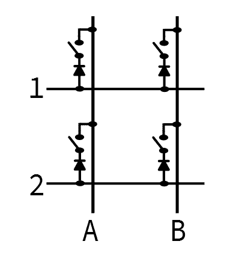](https://cdn.sparkfun.com/assets/learn_tutorials/4/6/2/row-col2x2-switches-diodes.png)

二极管就位后，我们同时按住 A1 和 B1，B1 上的二极管不会将行电压传导回 b 列。短路不再存在，我们可以分别检测到 A1 和 B1 同时被按下。

该电路常见于 MIDI 键盘，微控制器需要能够正确检测到多个键同时被按住，以便弹奏和弦。

这也是一种用于高质量个人电脑键盘的电路。能够正确检测任意组合键被称为 [N 键翻转](https://en.wikipedia.org/wiki/Rollover_(key))。虽然它对日常触摸打字不是特别有用，但它对游戏和替代打字系统非常重要，如盲文和[和弦打字](https://en.wikipedia.org/wiki/Chorded_keyboard)。

### 扭转局势

我们已经看到了如何扫描一个 2x2 键矩阵来注册输入。现在让我们来扭转局面，使用 2x2 LED 矩阵输出。矩阵将发光二极管放置在矩阵的连接处。

[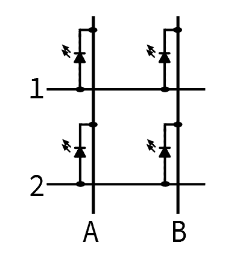](https://cdn.sparkfun.com/assets/learn_tutorials/4/6/2/row-col2x2-LEDs.png)

LED 矩阵利用了我们在开关矩阵分析中讨论的优势，当阳极电压高于阴极电压时，上述二极管(或者更具体地说，*发光二极管*)仅在一个方向上导通。如果两端电压相同(均为高，或均为低)，或者二极管为*反向偏置*(阳极低于阴极)，则电流不流过，LED 不亮。

与上面的按钮示例不同，驱动引脚都配置为输出。通过小心地控制列和行上的电压，我们可以控制 LED 两端的电压，从而可以单独寻址每个 LED。

让我们看看，如果我们想点亮 B1，而让其他二极管保持黑暗，低电平有效扫描将如何进行。

[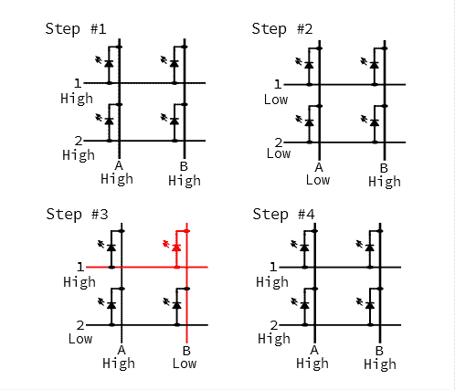](https://cdn.sparkfun.com/assets/learn_tutorials/4/6/2/row-col2x2-LEDs-scan.png)

1.  扫描开始时，所有引脚都为高电平。
2.  通过将引脚 A 拉低来选择第一列。我们不希望 A 列中的 led 亮起，因此我们也将引脚 1 和 2 拉低。led 上没有电压，因此是暗的。
3.  通过将其驱动为高电平来取消选择列 A，通过将其驱动为低电平来选择列 B。为了点亮 LED B1，我们还将第 1 行驱动至高电平。B1 正向偏置，并点亮。
4.  在扫描结束时，取消选择列 B，并且行 1 和 2 也被驱动为高电平。

LED 仅在扫描 B 列时亮起。这利用了我们的眼睛如何感知我们周围的世界——当 LED 足够快地闪烁时，我们看到它被稳定地照亮(尽管它可能看起来不如连续点亮的 LED 亮)。).这是视觉暂留现象**的一个例子。**

### 变大

为了解决更多的按钮或发光二极管，我们只需添加列和行。例如，如果我们想要 16 个按钮，我们可以添加两行和两列，形成一个 4x4 的矩阵。

一个 4x4 矩阵几乎让我们兜了一圈，回到 Roland TR-808，它有 16 个按钮和 16 个 led。通过包括按钮和 led，808 实现了最后一项设计优化:开关的扫描输出与 led 共享。

如果我们更仔细地看示意图，我们会看到(从上到下)

*   端口 G 引脚 0 至 3 是 LED 行选择输入。
*   端口 B 引脚 0 至 3 是开关行输入。
*   端口 H 引脚 0 至 3 为列输出，开关和 led 共用。

端口 G 和 H 的输出引脚使用分立晶体管进行缓冲，因为μPD650C 的端口引脚无法提供或吸收点亮 led 所需的电流。

端口 B 具有分立下拉电阻，表明这是一个高电平有效扫描矩阵。μPD650C 没有内部上拉电阻，因此没有理由为了利用它们而反转扫描。

您还会注意到，不是每个按钮都有一个二极管，而是每个列选择线都有一个二极管——这隔离了列选择输出，但如果同时按住多个开关，并不能防止误导行为(尽管这种按压可以在软件中检测到并忽略)。

### 更多的细节

我们在上面提到过，扫描矩阵要求硬件和软件都很聪明。我们上面的讨论已经涵盖了一些巧妙的硬件设计问题，例如安装二极管以防止争用，使用低电平有效逻辑来利用端口引脚上的内部上拉电阻，以及在按钮和 LED 矩阵之间共享选择线。

扫描矩阵还需要考虑一些其他问题，通常由相关软件处理。

*   扫描进行的速率是一个关键参数。当扫描太慢时，led 会明显闪烁，并且按钮似乎没有反应。
*   更快的扫描使 led 变得平滑，但容易检测到按钮动作中的小故障。当我们[挂上按钮](https://learn.sparkfun.com/tutorials/button-pad-hookup-guide#exercise-2-monochrome-plus-buttons)时，我们将探索消除按钮故障的软件技术。

* * *

在讲述了矩阵扫描的基本概念后，让我们看看它们是如何在 4x4 RGB 按钮板上实现的！

## 4x4 RGB 按钮板

随着矩阵扫描的基础知识的建立，让我们看看他们如何在 SparkFun 4x4 RGB 按钮垫上工作。

[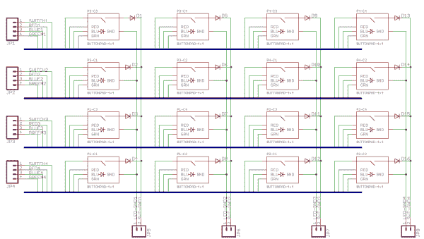](https://cdn.sparkfun.com/assets/learn_tutorials/4/6/2/4x4-schem.png)*[Button Pad Schematic](https://www.sparkfun.com/datasheets/Components/Buttons/Button_Pad_Breakout.pdf)*

从我们在[前一节](https://learn.sparkfun.com/tutorials/button-pad-hookup-guide#background)中探索的内容，我们可以识别列和行。矩阵中的每个结点由一个按钮开关和 RGB LED 组成。发光二极管是一个单独的外壳，包含单独的红色、绿色和蓝色发光二极管，它们共用一个阴极。led 设置为三个重叠的 4x4 矩阵，每种颜色一个。

### 正误表

按钮板 PCB 设计可追溯到 2008 年左右，在 SFE 历史上相对较早。因此，它并不完全符合我们现代的标记和标签标准。先澄清几点。

*   首先，PCB 设计的 RGB LED 不再可用。我们有一个几乎相同的库存，但是有一个问题——绿色和蓝色的大头针互换了位置。
*   PCB 丝网印刷有印刷在顶部的 led 元件标志，但它们被标记为 C1 到 C4。 *C* (通常用于电容)实际上应该是 a *D* (用于二极管)。
*   行信号被组合成总线(水平深蓝色线)。这是一种简化的原理图，但会使页面上的单根电线更难理解。在这种情况下，四个信号从左侧进入总线，并在矩阵的每个结点被拉出。
*   底部的连接标有“接地”。这些更准确地称为“列”。
    *   对于按钮，它们可以标记为列选择。
    *   对于发光二极管，它们是发光二极管的阴极。
*   行和列都用数字标记(1 到 4)，如果一个轴是字母 A 到 d，可能更容易理解。

* * *

让我们组装键盘，并开始使用它。

## 材料

以下练习使用以下愿望清单上的项目。**