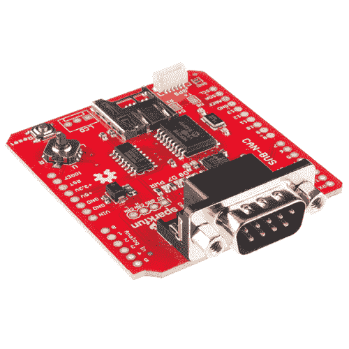

# CAN 总线屏蔽连接指南

> 原文：<https://learn.sparkfun.com/tutorials/can-bus-shield-hookup-guide>

## 介绍

[CAN-Bus Shield](https://www.sparkfun.com/products/13262) 为您的 Arduino 或 Redboard 提供 CAN-Bus 功能，并允许您侵入您的车辆！

*CAN-Bus Shield connected to a RedBoard.*

[https://www.youtube.com/embed/ui4GW-wO2nk?t=1m17s/?autohide=1&border=0&wmode=opaque&enablejsapi=1](https://www.youtube.com/embed/ui4GW-wO2nk?t=1m17s/?autohide=1&border=0&wmode=opaque&enablejsapi=1)

该保护罩允许您查询 ECU 的信息，包括冷却液温度、节气门位置、车速和发动机转速。您也可以存储这些数据或将其输出到屏幕上，制作一个 in-dash 项目。

### 所需材料

您将需要 CAN-Bus 屏蔽，以便遵循本连接指南。

 

将**添加到您的[购物车](https://www.sparkfun.com/cart)中！**

### [CAN 总线屏蔽](https://www.sparkfun.com/products/13262)

[In stock](https://learn.sparkfun.com/static/bubbles/ "in stock") DEV-13262

CAN-BUS Shield 为您的 Arduino 或 Redboard 提供 CAN-BUS 功能，并允许您侵入您的车辆。这个阏氏…

$28.9524[Favorited Favorite](# "Add to favorites") 55[Wish List](# "Add to wish list")** **我们还建议您访问以下材料。**