# 电容器

> 原文：<https://learn.sparkfun.com/tutorials/capacitors>

## 介绍

电容器是一种两端的电气元件。与[电阻](https://learn.sparkfun.com/tutorials/resistors)和电感一起，它们是我们使用的最基本的**无源**元件之一。你必须非常努力地寻找一个*中没有*电容的电路。

[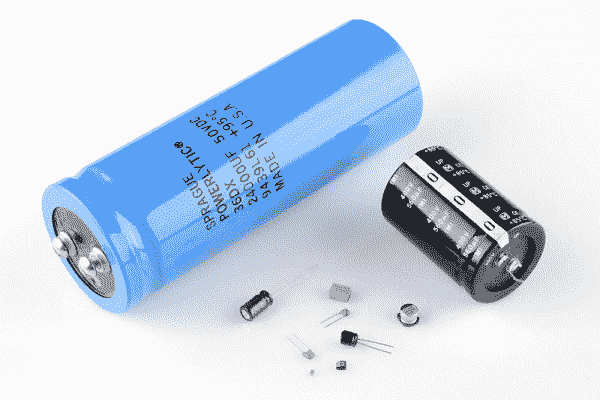](https://cdn.sparkfun.com/assets/1/9/6/3/0/51968eb0ce395f352c000000.jpg)

电容器的特别之处在于它们能够**储存能量**；它们就像一个充满电的电池。*电容*，我们通常称之为电容，在电路中有各种关键应用。常见应用包括本地储能、电压尖峰抑制和复杂信号滤波。

### 本教程涵盖的内容

在本教程中，我们将研究各种与电容相关的主题，包括:

*   电容器是如何制造的
*   电容器如何工作
*   电容单位
*   电容器的类型
*   如何识别电容器
*   电容如何串联和并联
*   常见电容应用

### 推荐阅读

本教程中的一些概念建立在以前的电子学知识之上。在进入本教程之前，考虑先阅读(至少略读)以下内容:

*   [什么是电？](https://learn.sparkfun.com/tutorials/what-is-electricity)
*   [电压、电流、电阻和欧姆定律](https://learn.sparkfun.com/tutorials/voltage-current-resistance-and-ohms-law)
*   [什么是电路](https://learn.sparkfun.com/tutorials/what-is-a-circuit)
*   [串联与并联电路](https://learn.sparkfun.com/tutorials/series-and-parallel-circuits)
*   [如何使用万用表](https://learn.sparkfun.com/tutorials/how-to-use-a-multimeter)
*   [公制前缀](https://learn.sparkfun.com/tutorials/metric-prefixes-and-si-units)

* * *

## 符号和单位

### 电路符号

在原理图中绘制电容器有两种常见的方法。它们总是有两个端子，用来连接电路的其余部分。电容器符号由两条平行线组成，要么是平的，要么是弯曲的；两条线应相互平行、靠近，但不接触(这实际上代表了[电容器的制作方式](https://learn.sparkfun.com/tutorials/capacitors#capacitor-theory))。难以描述，更容易展示:

[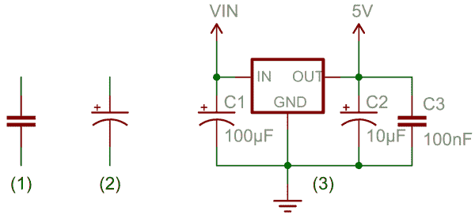](https://cdn.sparkfun.com/assets/0/1/0/f/3/5193cd4ece395fa97a000000.png)*(1) and (2) are standard capacitor circuit symbols. (3) is an example of capacitors symbols in action in a voltage regulator circuit.*

带有曲线的符号(上图中的#2)表示电容器被[极化](https://learn.sparkfun.com/tutorials/polarity)，这意味着它可能是一个电解电容器。在本教程的[电容器类型](types-of-capacitors)部分会有更多的介绍。

每个电容器都应附有一个名字——C1、C2 等..-和一个值。该值应指示电容器的电容；它有多少法拉。说到法拉...

### 电容单位

并非所有的电容都是一样的。每个电容器都具有特定的电容量。电容器的电容告诉你**它能储存多少电荷**，电容越大意味着储存电荷的容量越大。电容的标准单位称为**法拉**，缩写为 *F* 。

原来一法拉是一个 *lot* 的电容，即使是 0.001F (1 毫法拉- 1mF)也是一个很大的电容。通常你会看到电容的额定值在微微(10 ^(-12) )到微法(10 ^(-6) )范围内。

| 前缀名称 | 缩写 | 重量 | 等效法拉 |
| 微微法拉 | 性能因素(Performance Factor) | 10 ^(-12) | 0.000000000001 F |
| 纳法拉 | 法国标准 | 10 ^(-9) | 0.000000001 F |
| 微法 | F | 10 ^(-6) | 0.000001 华氏度 |
| 毫法拉 | 中频(medium frequency) | 10 ^(-3) | 0.001 华氏度 |
| 千法拉 | 肯纳-大便培养基 | 10 ³ | 1000 华氏度 |

当你进入法拉到千法拉的电容范围时，你就开始谈论被称为*超级*或*超*电容器的特殊电容。

* * *

## 电容器理论

*注意*:这一页上的内容对于电子初学者的理解并不完全重要...到最后就有点复杂了。我们推荐阅读*电容器是如何制造的*部分，其他的如果让你头疼的话可以跳过。

### 电容器是如何制造的

电容器的示意符号实际上非常类似于它是如何制造的。电容器由两块金属板和一种叫做电介质的绝缘材料制成。金属板彼此非常靠近，平行放置，但电介质位于它们之间，以确保它们不会接触。

[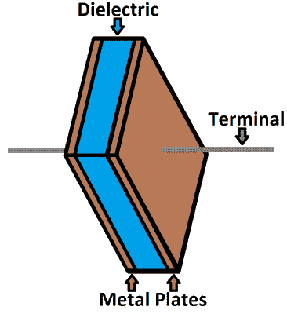](https://cdn.sparkfun.com/assets/a/f/3/b/2/51969be3ce395f662c000000.png)*Your standard capacitor sandwich: two metal plates separated by an insulating dielectric.*

电介质可以由各种绝缘材料制成:纸、玻璃、橡胶、陶瓷、塑料或任何会阻碍电流流动的东西。

这些板由导电材料制成:铝、钽、银或其他金属。它们每个都连接到一根终端线，最终连接到电路的其余部分。

电容器的电容——它有多少法拉——取决于它的构造。更大的电容需要更大的电容器。具有更多重叠表面积的板提供更大的电容，而板之间的更大距离意味着更小的电容。电介质的材料甚至对一个电容有多少法拉有影响。电容的总电容可以通过下式计算:

[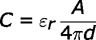](https://cdn.sparkfun.com/assets/e/9/e/c/7/51c0975bce395f0775000000.png)

其中ε [*r*] 为电介质的[相对介电常数](https://en.wikipedia.org/wiki/Relative_static_permittivity)(由电介质材料决定的常数值)， *A* 为极板相互重叠的面积量， *d* 为极板间的距离。

### 电容器如何工作

[电流](https://learn.sparkfun.com/tutorials/voltage-current-resistance-and-ohms-law#current)是[电荷](https://learn.sparkfun.com/tutorials/what-is-electricity/flowing-charges)的流动，这是电气元件用来点亮，或旋转，或做任何它们做的事情。当电流流入电容器时，电荷会“粘”在极板上，因为它们无法通过绝缘介质。电子——带负电的粒子——被吸进其中一个板中，它整体带负电。一个极板上的大量负电荷会推开另一个极板上的同性电荷，使其带正电。

[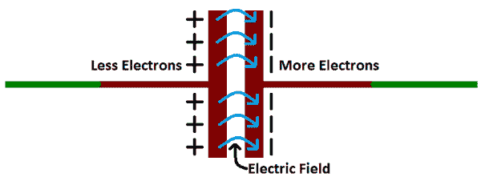](https://cdn.sparkfun.com/assets/b/0/9/4/4/5196a7d5ce395fa82c000004.png)

这些极板上的正负电荷相互吸引，因为这就是异性电荷的作用。但是，由于电介质位于它们之间，无论它们多么想聚集在一起，电荷都将永远停留在极板上(直到它们有别的地方可去)。这些板上的静电荷产生了一个[电场](https://learn.sparkfun.com/tutorials/what-is-electricity/electric-fields)，它影响[电势](https://learn.sparkfun.com/tutorials/what-is-electricity/electric-potential-energy)和[电压](https://learn.sparkfun.com/tutorials/voltage-current-resistance-and-ohms-law#voltage)。当电荷像这样聚集在一个电容器上时，电容器储存电能，就像电池储存化学能一样。

#### 充电和放电

当正负电荷在电容器极板上结合时，电容器变成**充电**。电容器可以保持其电场-保持其电荷-因为每个极板上的正负电荷相互吸引，但永远不会到达对方。

在某一点上，电容器极板会充满电荷，以至于不能再接受更多的电荷。一个盘子上有足够多的负电荷，它们可以排斥任何试图加入的其他盘子。这就是电容器的**电容**(法拉)发挥作用的地方，它告诉你电容可以存储的最大电荷量。

如果在电路中创建了一条路径，这允许电荷找到另一条路径到达彼此，它们将离开电容器，并且它将**放电**。

例如，在下面的电路中，可以使用电池在电容器两端感应电势。这将导致相等但相反的电荷在每个极板上积累，直到它们充满，从而阻止更多的电流流动。与帽串联放置的 LED 可以为电流提供路径，并且存储在电容器中的能量可以用于短暂地点亮 LED。

[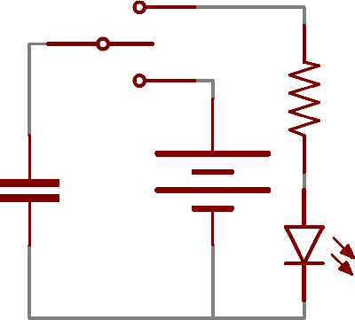](https://cdn.sparkfun.com/assets/d/2/d/5/1/519a737ece395fe042000002.gif)

### 计算电荷、电压和电流

电容器的电容量——它有多少法拉——告诉你它能储存多少电荷。电容器*目前*储存多少电荷取决于其极板间的电位差(电压)。电荷、电容和电压之间的这种关系可以用以下等式来建模:

*Charge (Q) stored in a capacitor is the product of its capacitance (C) and the voltage (V) applied to it.*

电容器的电容应该总是一个恒定的已知值。所以我们可以调节电压来增加或减少电容的电荷。更高的电压意味着更多的电荷，更低的电压...少收费。

这个等式也给了我们一个很好的方法来定义一法拉的值。一法拉(F)是每一伏特储存一单位能量(库仑)的容量。

#### 计算电流

我们可以进一步利用电荷/电压/电容方程，找出电容和电压如何影响电流，因为电流是电荷流动的*速率*。电容器与电压和电流关系的要点是:通过电容器的**电流量取决于电容和**电压上升或下降的速度**。如果电容器两端的电压迅速上升，电容器中将感应出一个大的正电流。电容器上的电压上升越慢，通过它的电流就越小。如果电容器两端的电压稳定不变，就没有电流通过。**

(这个很丑，进入微积分。在进入时域分析、滤波器设计和其他复杂的内容之前，这些都不是必需的，所以如果你对这个等式不太熟悉，可以跳到下一页。)计算流经电容的电流的公式为:

[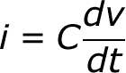](https://cdn.sparkfun.com/assets/8/8/f/8/4/519a5ef6ce395f7d11000000.png)

等式中的 *dV/dt* 部分是电压对时间的导数(这是一种描述*瞬时速率*的奇特方式)，相当于说“此时此刻电压上升或下降的速度有多快”。从这个等式可以看出，如果**电压稳定**，导数为零，这意味着**电流也为零**。这就是电流不能流过保持稳定 DC 电压的电容器的原因。

* * *

## 电容器的类型

有各种各样的电容器类型，每一种都有一定的特点和缺点，使其在某些应用中比其他应用更好。

决定电容器类型时，有几个因素需要考虑:

*   **尺寸** -物理体积和电容的尺寸。电容是电路中最大的元件并不罕见。它们也可以非常小。更大的电容通常需要更大的电容器。
*   **最大电压** -每个电容器都有一个额定的最大压降。一些电容器的额定电压可能为 1.5V，另一些可能为 100V。超过最大电压通常会损坏电容器。
*   **漏电流** -电容不完美。每个电容都有可能通过电介质从一端向另一端泄漏少量电流。这种微小的电流损失(通常为纳安或更小)称为泄漏。漏电会导致储存在电容器中的能量缓慢但肯定会流失。
*   **等效串联电阻(ESR)** -电容器的端子不是 100%导电的，它们总是有很小的电阻(通常小于 0.01 &欧姆；)对他们来说。当大量电流流过电容时，这种电阻就会成为一个问题，产生热量和功率损耗。
*   **容差** -电容器也不能被制造成具有精确的电容。每个电容的标称电容都是额定的，但是，根据类型的不同，精确值可能会在期望值的 1%到 20%之间变化。

### 陶瓷电容器

最常用和生产的电容是陶瓷电容。这个名字来源于制造电介质的材料。

陶瓷电容通常在物理和电容方面都很小。很难找到比 10 F 大得多的陶瓷电容，表贴陶瓷电容通常采用 0402 (0.4mm x 0.2mm)、0603 (0.6mm x 0.3mm)或 0805 小型封装。通孔陶瓷帽通常看起来像小灯泡(通常是黄色或红色)，有两个突出的端子。

[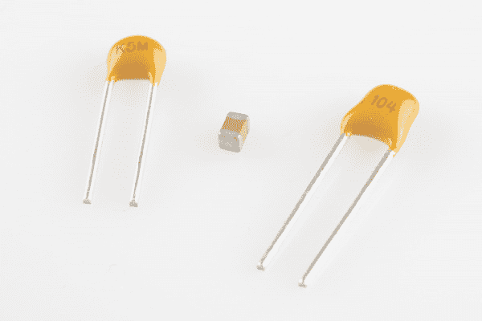](https://cdn.sparkfun.com/assets/6/5/f/8/e/51968eb0ce395f432c000001.jpg)*Two caps in a through-hole, radial package; a 22pF cap on the left, and a 0.1µF on the right. In the middle, a tiny 0.1µF 0603 surface-mount cap.*

与同样受欢迎的电解电容相比，陶瓷是一种更接近理想的电容(ESR 和漏电流低得多)，但其小电容可能会受到限制。它们通常也是最便宜的选择。这些电容非常适合高频耦合和[去耦](https://learn.sparkfun.com/tutorials/capacitors/application-examples#decoupling)应用。

### 铝和钽电解

电解技术之所以伟大，是因为它们可以在相对较小的体积内装入大量的电容。如果你需要 1 F-1mF 范围内的电容，你最有可能找到电解形式的电容。由于其相对较高的最大额定电压，它们特别适合高压应用。

铝电解电容器是电解系列中最受欢迎的，通常看起来像小锡罐，两根引线都从底部伸出。

[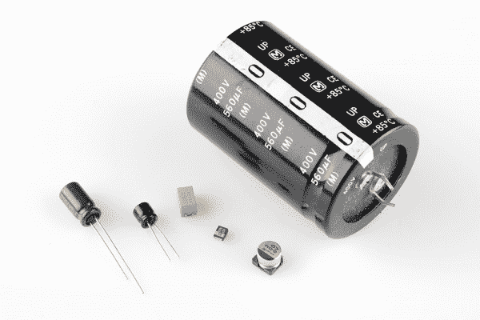](https://cdn.sparkfun.com/assets/7/b/5/b/6/51968eb0ce395f872c000001.png)*An assortment of through-hole and surface-mount electrolytic capacitors. Notice each has some method for marking the cathode (negative lead).*

可惜电解电容一般都是**极化。它们有一个正极，即阳极，和一个负极，即阴极。当电压施加到电解电容上时，阳极的电压必须高于阴极。电解电容器的阴极通常在外壳上用一个“-”标记和一个彩色条来标识。作为另一个指示，阳极的腿也可以稍微长一些。如果在电解电容上反向施加电压，它们会戏剧性地失败(发出*声*并突然打开)，并且是永久性的。爆裂后，电解质将表现得像短路。**

 **这些电容也因**泄漏**而臭名昭著——允许少量电流(nA 量级)通过电介质从一个端子流到另一个端子。这使得电解电容器对于能量存储来说不够理想，考虑到它们的高容量和额定电压，这是不幸的。

### 超级电容器

如果你正在寻找一种用来储存能量的电容器，那就看看超级电容器吧。这些电容设计独特，具有非常高的电容，在法拉范围内。

[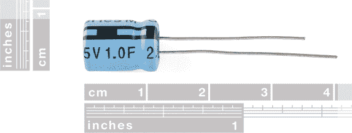](https://cdn.sparkfun.com/assets/e/f/e/d/6/51950b61ce395ffc1e000000.png)*A 1F (!) supercapacitor. High capacitance, but only rated for 2.5V. Notice these are also polarized.*

虽然超级电容器可以储存大量的电荷，但它们不能处理非常高的电压。[这款 10F](https://www.sparkfun.com/products/746) 超级电容的最大额定电压仅为 2.5V。再多就会毁了它。超级电容通常串联[以获得更高的额定电压(同时减少总电容)。](capacitors-in-seriesparallel)

超级电容器的主要应用是**储存和释放能量**，就像电池一样，这是它们的主要竞争对手。虽然超级电容器不能像同等大小的电池一样储存大量能量，但它们可以更快地释放能量，而且寿命通常也更长。

### 其他人

电解电容和陶瓷电容覆盖了约 80%的电容器类型(超级电容仅占 2%，但它们是超级电容！).另一种常见的电容类型是**薄膜电容**，其寄生损耗(ESR)非常低，非常适合处理非常高的电流。

还有很多其他不太常见的电容。**可变电容**可以产生一定范围的电容，这使得它们成为调谐电路中可变电阻的良好替代品。绞合线或 PCB 会产生电容(有时是不希望的),因为它们都由绝缘体分隔的两个导体组成。[莱顿瓶](http://en.wikipedia.org/wiki/Leyden_jar)——一个装满导体并被导体包围的玻璃罐——是电容器家族的 O.G .最后，当然，[通量电容器](https://www.youtube.com/watch?v=Or7P9jfhcZ0)(一种电感器和电容器的奇怪组合)是至关重要的，如果你曾经计划回到辉煌的日子。

* * *

## 串联/并联电容器

与[电阻器](../resistors/series-and-parallel-resistors)非常相似，多个电容器可以以[串联或并联](https://learn.sparkfun.com/tutorials/series-and-parallel-circuits)的方式组合在一起，形成一个组合等效电容。然而，电容叠加在一起的方式**与电阻的**完全相反。

### 并联电容器

当电容器彼此并联时，总电容就是所有电容的总和**。这类似于串联电阻相加的方式。**

例如，如果并联三个电容值分别为 10 F、1 F 和 0.1 F，则总电容为 11.1 F (10+1+0.1)。

### 串联电容器

就像并联电阻是一件痛苦的事情一样，当电容器被放在*系列*中时，就会变得古怪。串联的 *N* 个电容的总电容是所有反电容之和的倒数。

[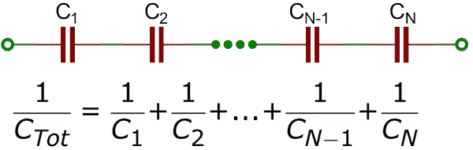](https://cdn.sparkfun.com/assets/e/f/5/8/c/51951385ce395f3f1f000001.png)

如果您只有两个串联的**电容，您可以使用“积和”方法计算总电容:**

[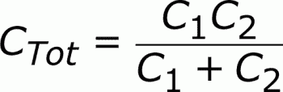](https://cdn.sparkfun.com/assets/f/8/7/7/2/5195152ace395fc921000001.png)

更进一步，如果你有两个串联的等值电容，总电容是它们的一半。例如，两个串联的 [10F 超级电容器](https://www.sparkfun.com/products/746)将产生 5F 的总电容(它还具有使总电容器的额定电压加倍的好处，从 2.5V 到 5V)。

* * *

## 应用示例

这种小巧(实际上通常很大)的无源元件有大量的应用。为了让你了解它们的广泛用途，这里有几个例子:

### [去耦(旁路)电容器](#decoupling)

你在电路中看到的很多电容，尤其是那些具有[集成电路](https://learn.sparkfun.com/tutorials/integrated-circuits)的电容，都是去耦的。去耦电容的作用是抑制电源信号中的高频噪声。它们从电源中消除微小的电压纹波，否则这些纹波可能会对精密的 IC 造成损害。

在某种程度上，去耦电容充当 IC 的一个非常小的本地电源(几乎就像计算机的不间断电源一样)。如果电源非常短暂地降低电压(这实际上很常见，特别是当它供电的电路不断切换其负载要求时)，去耦电容可以以正确的电压短暂供电。这就是为什么这些电容器也被称为**旁路**电容；它们可以暂时充当电源，*绕过*电源。

去耦电容连接在电源(5V、3.3V 等)之间。)和地。使用两个或更多不同值、甚至不同类型的电容来旁路电源并不少见，因为在滤除某些频率的噪声时，某些电容值会比其他电容值更好。

[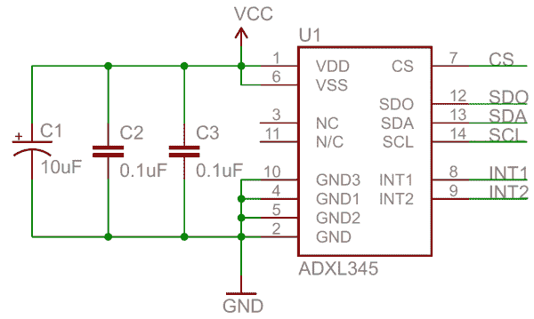](https://cdn.sparkfun.com/assets/2/6/7/7/e/51965e31ce395f412a000000.png)*In [this schematic](http://www.sparkfun.com/datasheets/Sensors/Accelerometer/ADXL345-BreakoutBoard-v13.pdf), three decoupling capacitors are used to help reduce the noise in an accelerometer's voltage supply. Two ceramic 0.1µF and one tantalum electrolytic 10µF split decoupling duties.*

虽然这可能会造成电源与地之间的短路，但只有高频信号才能通过电容到达地。正如所期望的那样，DC 信号将进入 IC。称之为旁路电容的另一个原因是，高频(kHz-MHz 范围内)绕过 IC，通过电容接地。

物理放置去耦电容时，应尽可能靠近 IC。它们离得越远，效果就越差。

[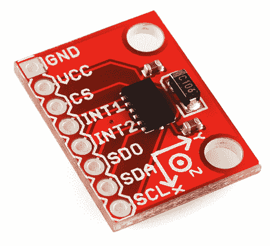](https://cdn.sparkfun.com/assets/0/1/f/d/2/51965e79ce395fd129000002.png)*Here's the physical circuit layout from the schematic above. The tiny, black IC is surrounded by two 0.1µF capacitors (the brown caps) and one 10µF electrolytic tantalum capacitor (the tall, black/grey rectangular cap).*

为了遵循良好的工程实践，每个 IC 至少要增加一个去耦电容。通常 0.1 F 是个不错的选择，甚至可以加一些 1 F 或者 10 F 的封顶。它们是一种廉价的附加物，它们有助于确保芯片不会受到电压大幅下降或峰值的影响。

### 电源滤波

[二极管整流器](../diodes/diode-applications)可用于将来自墙壁的交流电压转换成大多数电子产品所需的 DC 电压。但是光靠二极管无法将交流信号转换成干净的 DC 信号，它们需要电容的帮助！通过给桥式整流器增加一个**并联电容**，整流后的信号如下:

[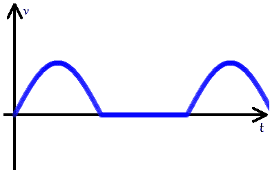](https://cdn.sparkfun.com/assets/6/b/4/7/1/519a7e33ce395f7d47000009.png)

可以变成这样的近水平 DC 信号:

[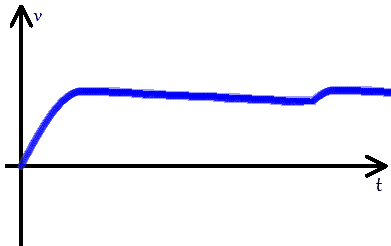](https://cdn.sparkfun.com/assets/3/9/6/3/e/519a7ebfce395fde13000000.png)

电容器是顽固的元件，它们总是试图抵抗电压的突然变化。滤波电容器将随着整流电压的增加而充电。当进入电容的整流电压开始快速下降时，电容将获取其储存的能量，并缓慢放电，为负载提供能量。在输入整流信号开始再次增加之前，电容不应完全放电，从而为电容充电。只要电源还在使用，这种舞蹈一秒钟就要上演很多次。

[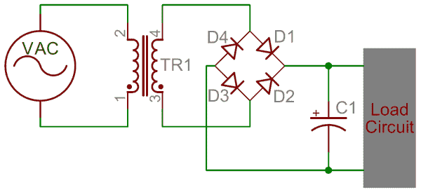](https://cdn.sparkfun.com/assets/2/a/5/9/f/5196722dce395fbd2c000000.png)*An AC-to-DC power supply circuit. The filter cap (C1) is critical in smoothing out the DC signal sent to the load circuit.*

如果你拆开任何交流到 DC 的电源，你一定会发现至少有一个相当大的电容器。下面是一个 9V DC 墙壁适配器的内部结构。注意到里面有电容器吗？

[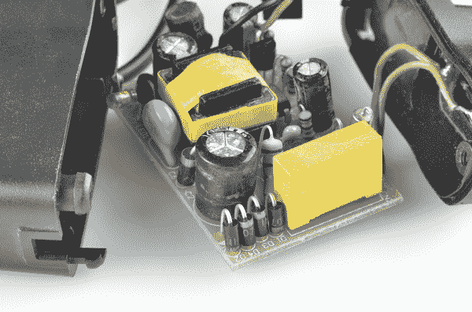](https://cdn.sparkfun.com/assets/3/8/7/4/8/519672dbce395f1d2c000000.jpg)

电容可能比你想象的要多！有四个看起来像锡罐的电解电容，温度范围为 47°F 至 1000°F。前景中的黄色大矩形是一个高压 0.1°F 聚丙烯薄膜电容。蓝色的圆盘形帽子和中间的绿色小帽子都是陶瓷的。

### 能量储存和供应

很明显，如果电容器储存能量，它的许多应用之一就是向电路提供能量，就像电池一样。问题是电容器的能量密度比电池低得多；它们只是不能像同样大小的化学电池一样储存能量(但是这个差距正在缩小！).

电容器的好处是它们通常比电池寿命更长，这使它们成为更好的环保选择。它们还能够比电池更快地输送能量，这使得它们适用于需要短时间高功率爆发的应用。相机闪光灯可能从电容器中获得能量(反过来，电容器可能由电池充电)。

**Battery or Capacitor?**

|  | 电池 | 电容器 |
| 容量 | -好的 |  |
| 能量密度 | -好的 |  |
| 充电/放电速率 |  | -好的 |
| 寿命 |  | -好的 |

### 信号过滤

电容对不同频率的信号有独特的响应。它们可以阻挡低频或 DC 信号成分，同时允许高频信号通过。他们就像是一个只对高频开放的高级俱乐部的保镖。

滤波信号在各种信号处理应用中都很有用。无线电接收机可能会使用电容器(以及其他元件)来滤除不需要的频率。

电容信号滤波的另一个例子是扬声器内部的无源**交叉**电路，它将单个音频信号分成多个。一个串联电容将阻挡低频，因此信号的剩余高频部分可以进入扬声器的高音扬声器。在低频通过的超重低音电路中，高频大部分可以通过并联电容分流到地。

[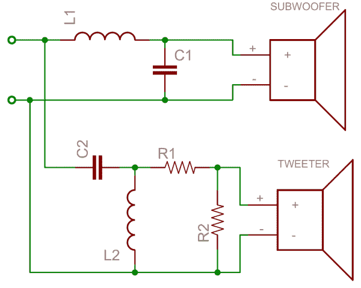](https://cdn.sparkfun.com/assets/b/4/8/9/e/51968be2ce395f362c000000.png)*A very simple example of an audio crossover circuit. The capacitor will block out low frequencies, while the inductor blocks out high frequencies. Each can be used to deliver the proper signal to tuned audio drivers.*

### 降额

使用电容时，电路的电容容差必须远高于系统中潜在的最高电压尖峰，这一点非常重要。

这里有一个来自 SparkFun 工程师 Shawn 的精彩视频，讲述了当你未能降低电容器的额定值并超过其最大电压规格时，不同类型的电容器会发生什么。你可以在这里阅读更多关于他的实验。

[https://www.youtube.com/embed/sW0a9d_vWoc/?autohide=1&border=0&wmode=opaque&enablejsapi=1](https://www.youtube.com/embed/sW0a9d_vWoc/?autohide=1&border=0&wmode=opaque&enablejsapi=1)

* * *

## 购买电容器

在这些小的能量储存元件上储存能量，或者将它们作为一个初级电源组件。

### 我们的建议:

[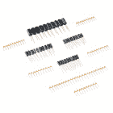](https://www.sparkfun.com/products/13698) 

将**添加到您的[购物车](https://www.sparkfun.com/cart)中！**

### [SparkFun 电容套装](https://www.sparkfun.com/products/13698)

[In stock](https://learn.sparkfun.com/static/bubbles/ "in stock") KIT-13698

这是一个工具包，为您提供一个基本的电容器分类，开始或继续您的电子修补。不要…

$8.9512[Favorited Favorite](# "Add to favorites") 86[Wish List](# "Add to wish list")****[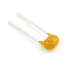](https://www.sparkfun.com/products/8375) 

将**添加到您的[购物车](https://www.sparkfun.com/cart)中！**

### [电容陶瓷 0.1uF](https://www.sparkfun.com/products/8375)

[In stock](https://learn.sparkfun.com/static/bubbles/ "in stock") COM-08375

这是一个非常常见的 0.1uF 电容。用于各种应用，将 IC 从电源去耦。0.1 英寸间距…

$0.301[Favorited Favorite](# "Add to favorites") 16[Wish List](# "Add to wish list")****[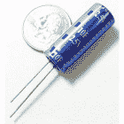](https://www.sparkfun.com/products/746) 

将**添加到您的[购物车](https://www.sparkfun.com/cart)中！**

### [超级电容- 10F/2.5V](https://www.sparkfun.com/products/746)

[In stock](https://learn.sparkfun.com/static/bubbles/ "in stock") COM-00746

是的，你没看错——10 法拉电容器。这个小电容可以充电，然后在整个运行过程中慢慢消耗

$4.953[Favorited Favorite](# "Add to favorites") 33[Wish List](# "Add to wish list")****[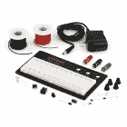](https://www.sparkfun.com/products/retired/8373) 

### [开始嵌入式电子-电源套件](https://www.sparkfun.com/products/retired/8373)

[Retired](https://learn.sparkfun.com/static/bubbles/ "Retired") KIT-08373

这是嵌入式电子讲座开始时附带的大量物品。您将获得以下所有内容…

**Retired**[Favorited Favorite](# "Add to favorites") 7[Wish List](# "Add to wish list")****** ******## 有兴趣学习更多基础主题吗？

查看我们的 **[工程要点](https://www.sparkfun.com/engineering_essentials)** 页面，了解电气工程相关基础主题的完整列表。

带我去那里！

## 资源和更进一步

咻。觉得自己是电容专家？！想继续学习更多的电子基础知识吗？如果你还没有，考虑阅读一些其他常见的电子元件:

*   [电阻器](https://learn.sparkfun.com/tutorials/resistors)
*   [二极管](https://learn.sparkfun.com/tutorials/diodes)
*   [开关](https://learn.sparkfun.com/tutorials/button-and-switch-basics)
*   [集成电路](https://learn.sparkfun.com/tutorials/integrated-circuits)
*   [晶体管](https://learn.sparkfun.com/tutorials/transistors)

或者也许这些教程中的一些会引起你的注意？

*   [电池技术](https://learn.sparkfun.com/tutorials/battery-technologies)
*   [如何为项目提供动力](https://learn.sparkfun.com/tutorials/how-to-power-a-project)
*   [电力](https://learn.sparkfun.com/tutorials/electric-power)

* * *********