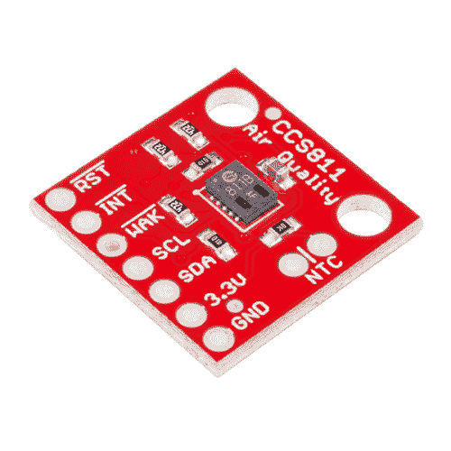

# CCS811 空气质量突破连接指南

> 原文：<https://learn.sparkfun.com/tutorials/ccs811-air-quality-breakout-hookup-guide>

## 介绍

[CCS811 Air Quality Breakout](https://www.sparkfun.com/products/14193) 是一款数字气体传感器解决方案，可感应各种总挥发性有机化合物(TVOCs)，包括等效二氧化碳(eCO [2] )和金属氧化物(MOX)水平。它旨在用于手表和电话等个人设备的室内空气质量监测，但我们已经将它放在一个分线板上，所以你可以将它作为一个常规的 I ² C 设备使用。

 

### [SparkFun 空气质量突围赛- CCS811](https://www.sparkfun.com/products/retired/14193)

[Retired](https://learn.sparkfun.com/static/bubbles/ "Retired") SEN-14193

CCS811 Air Quality Breakout 是一款数字气体传感器解决方案，可检测各种挥发性有机化合物总量…

9 **Retired**[Favorited Favorite](# "Add to favorites") 43[Wish List](# "Add to wish list")

### 所需材料

要学习本项目教程，您需要以下材料: