# Cherry MX 交换机转接连接指南

> 原文：<https://learn.sparkfun.com/tutorials/cherry-mx-switch-breakout-hookup-guide>

## 介绍

[Cherry MX 按键开关](https://www.sparkfun.com/products/13834)是顶级的机械键盘开关。它们的“咔嗒声”令人满意，可靠性高达数千万次按键，是游戏和编程键盘的重要组成部分。为了使开关更容易适应试验板或基于性能板的项目，我们创建了 [SparkFun Cherry MX 开关突破](https://www.sparkfun.com/products/13773)。

[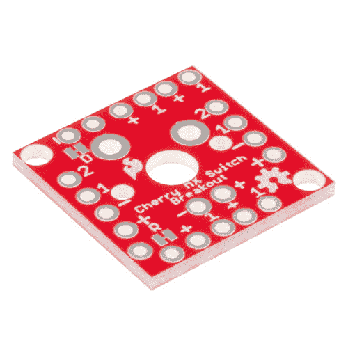](https://www.sparkfun.com/products/13773) 

将**添加到您的[购物车](https://www.sparkfun.com/cart)中！**

### [樱桃 MX 开关分线点](https://www.sparkfun.com/products/13773)

[In stock](https://learn.sparkfun.com/static/bubbles/ "in stock") BOB-13773

Cherry MX 按键开关是顶级的机械键盘开关。他们令人满意的“点击”,可靠到…

$2.105[Favorited Favorite](# "Add to favorites") 29[Wish List](# "Add to wish list")****[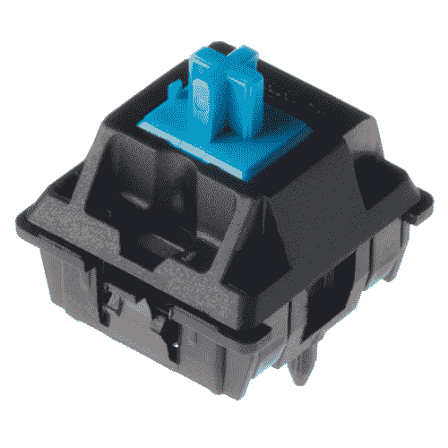](https://www.sparkfun.com/products/13834) 

将**添加到您的[购物车](https://www.sparkfun.com/cart)中！**

### [樱桃 MX 开关](https://www.sparkfun.com/products/13834)

[In stock](https://learn.sparkfun.com/static/bubbles/ "in stock") COM-13834

Cherry MX 按键开关是顶级的机械键盘开关。他们令人满意的“点击”,可靠到…

$1.05[Favorited Favorite](# "Add to favorites") 31[Wish List](# "Add to wish list")**** ****[https://www.youtube.com/embed/GGNV3bmZrdg/?autohide=1&border=0&wmode=opaque&enablejsapi=1](https://www.youtube.com/embed/GGNV3bmZrdg/?autohide=1&border=0&wmode=opaque&enablejsapi=1)

除了将开关触点连接到试验板兼容的接头上之外，该分线点还提供了一个可选的安装在开关上的 LED。此外，引脚分线的设计考虑到了键盘矩阵，因此您可以将任意数量的电路板互连成行列配置，尽可能降低 I/O 引脚要求。

| [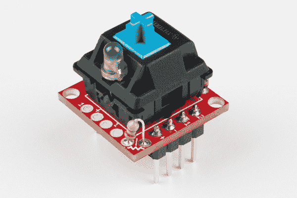](https://cdn.sparkfun.com/assets/learn_tutorials/5/0/3/Cherry_MX_Switch_Tutorial-03.jpg) | [](https://cdn.sparkfun.com/assets/learn_tutorials/5/0/3/Cherry_MX_Switch_Tutorial-11.jpg) |
| *Cherry MX 开关动作* | *矩阵配置* |

Cherry MX Switch Breakout 是一款完美的原型工具，适用于从单键到完全定制的 101 键键盘的各种输入设备。

### 本教程涵盖的内容

本教程记录了 SparkFun Cherry MX 交换机分线点，提供了分线点的概述，以及一些组装和使用技巧。它分为几个部分，您可以使用右边的按钮来浏览。

或者使用下面的链接跳过:

1.  [硬件概述](https://learn.sparkfun.com/tutorials/cherry-mx-switch-breakout-hookup-guide#hardware-overview)-Cherry MX 交换机分线板功能的分解。
2.  [组装提示](https://learn.sparkfun.com/tutorials/cherry-mx-switch-breakout-hookup-guide#assembly-tips) -为分线板添加接头、电线、电阻和二极管的提示。
3.  [测试电路](https://learn.sparkfun.com/tutorials/cherry-mx-switch-breakout-hookup-guide#testing-the-circuit) -一个简单的电路，用于测试开关、LED 和你可能添加的任何其他组件。
4.  [矩阵分线点](https://learn.sparkfun.com/tutorials/cherry-mx-switch-breakout-hookup-guide#matrixing-breakouts) -将两个或更多分线板组合成一个行/列矩阵，并用 Arduino 扫描它们的指南。

### 材料清单

除了 [Cherry MX 开关](https://www.sparkfun.com/products/13834)之外，您可能还想在[分线板](https://www.sparkfun.com/products/13773)上添加一些其他项目。

**[3mm led](https://www.sparkfun.com/categories/171)**可以放在开关里面。随便挑一种颜色:[红](https://www.sparkfun.com/products/533)、[绿](https://www.sparkfun.com/products/9650)、[黄](https://www.sparkfun.com/products/532)，或者[骑行](https://www.sparkfun.com/products/11448)。

[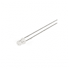](https://www.sparkfun.com/products/11448) 

将**添加到您的[购物车](https://www.sparkfun.com/cart)中！**

### [【LED-3mm 循环 RGB(慢速)](https://www.sparkfun.com/products/11448)

[In stock](https://learn.sparkfun.com/static/bubbles/ "in stock") COM-11448

这些变色发光二极管让人们不再需要制造疯狂、炫目、闪亮的东西...内斯。只需接通电源，LED 就会自动启动…

$0.55[Favorited Favorite](# "Add to favorites") 7[Wish List](# "Add to wish list")****[](https://www.sparkfun.com/products/9650) 

将**添加到您的[购物车](https://www.sparkfun.com/cart)中！**

### [LED -基本绿色 3mm](https://www.sparkfun.com/products/9650)

[In stock](https://learn.sparkfun.com/static/bubbles/ "in stock") COM-09650

发光二极管-那些闪闪发光的东西。电源指示、引脚状态、光电传感器和有趣的闪烁显示器的必备组件。…

$0.451[Favorited Favorite](# "Add to favorites") 8[Wish List](# "Add to wish list")****[](https://www.sparkfun.com/products/533) 

将**添加到您的[购物车](https://www.sparkfun.com/cart)中！**

### [LED -基本红色 3mm](https://www.sparkfun.com/products/533)

[In stock](https://learn.sparkfun.com/static/bubbles/ "in stock") COM-00533

发光二极管-那些闪闪发光的东西。电源指示、引脚状态、光电传感器和有趣的闪烁显示器的必备组件。…

$0.45[Favorited Favorite](# "Add to favorites") 7[Wish List](# "Add to wish list")****[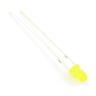](https://www.sparkfun.com/products/532) 

将**添加到您的[购物车](https://www.sparkfun.com/cart)中！**

### [LED -基本黄色 3mm](https://www.sparkfun.com/products/532)

[In stock](https://learn.sparkfun.com/static/bubbles/ "in stock") COM-00532

发光二极管-那些闪闪发光的东西。电源指示、引脚状态、光电传感器和有趣的闪烁显示器的必备组件。…

$0.45[Favorited Favorite](# "Add to favorites") 5[Wish List](# "Add to wish list")******** ********分线板还为可选的 **LED 限流电阻器**提供了一个覆盖区。推荐使用 1/6W PTH 电阻，如[这些 330ω的](https://www.sparkfun.com/products/11507)。

如果您将多个分线板组合在一起，您可能需要在板上添加一个**小信号二极管**，以帮助隔离开关并防止任何可能的“重影”。标准的 [1N4148 二极管](https://www.sparkfun.com/products/8588)应该可以做到这一点。

如果你需要固定电路板，它有安装孔，可以安装 [2-56 螺钉](https://www.sparkfun.com/products/8992)和[螺母](https://www.sparkfun.com/products/8995)。

[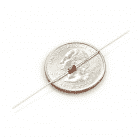](https://www.sparkfun.com/products/8588) 

将**添加到您的[购物车](https://www.sparkfun.com/cart)中！**

### [二极管小信号- 1N4148](https://www.sparkfun.com/products/8588)

[In stock](https://learn.sparkfun.com/static/bubbles/ "in stock") COM-08588

这是一个很常见的信号二极管——1n 4148。将此用于高达 200mA 电流的信号。

$0.25[Favorited Favorite](# "Add to favorites") 10[Wish List](# "Add to wish list")****[](https://www.sparkfun.com/products/8995) 

将**添加到您的[购物车](https://www.sparkfun.com/cart)中！**

### [【螺母-金属(2-56)](https://www.sparkfun.com/products/8995)

[In stock](https://learn.sparkfun.com/static/bubbles/ "in stock") PRT-08995

**描述* *:这些是带有 2-56 螺纹的标准螺母。适用于 2-56 机器螺丝和五个按钮垫套件，列出的是…

$0.15 $0.04[Favorited Favorite](# "Add to favorites") 1[Wish List](# "Add to wish list")****[](https://www.sparkfun.com/products/retired/8992) 

### [【螺钉-平头(3/8”，2-56)](https://www.sparkfun.com/products/retired/8992)

[Retired](https://learn.sparkfun.com/static/bubbles/ "Retired") PRT-08992

这些是标准螺钉，2-56 螺纹，3/8 英寸长，推荐用于小按钮垫套件。可用于 2-56 …

**Retired**[Favorited Favorite](# "Add to favorites") 0[Wish List](# "Add to wish list")[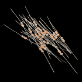](https://www.sparkfun.com/products/retired/11507) 

### [电阻 330 欧姆 1/6 瓦 PTH - 20 包](https://www.sparkfun.com/products/retired/11507)

[Retired](https://learn.sparkfun.com/static/bubbles/ "Retired") COM-11507

1/6 瓦+/- 5%容差的 PTH 电阻。这些 330 欧姆的电阻通常用于试验板和性能板，是出色的…

2 **Retired**[Favorited Favorite](# "Add to favorites") 16[Wish List](# "Add to wish list")**** ****你需要**焊接工具**，包括[烙铁](https://www.sparkfun.com/products/9507)和[焊料](https://www.sparkfun.com/products/9163)。其他工具，如[剥线钳](https://www.sparkfun.com/products/12630)、[平切钳](https://www.sparkfun.com/products/11952)和[第三只手](https://www.sparkfun.com/products/9317)也有帮助。

[](https://www.sparkfun.com/products/14782) 

将**添加到您的[购物车](https://www.sparkfun.com/cart)中！**

### [平齐刀具- Xcelite](https://www.sparkfun.com/products/14782)

[Out of stock](https://learn.sparkfun.com/static/bubbles/ "out of stock") TOL-14782

这些是来自 Excelite 的简单平切刀具，让您可以非常干净地切割引线并靠近焊点。

$8.952[Favorited Favorite](# "Add to favorites") 18[Wish List](# "Add to wish list")****[](https://www.sparkfun.com/products/9163) 

将**添加到您的[购物车](https://www.sparkfun.com/cart)中！**

### [无铅焊料- 15 克管](https://www.sparkfun.com/products/9163)

[In stock](https://learn.sparkfun.com/static/bubbles/ "in stock") TOL-09163

这是你的无铅焊料的基本管，带有不干净的水溶性树脂芯。0.031 英寸规格，15 克

$3.954[Favorited Favorite](# "Add to favorites") 14[Wish List](# "Add to wish list")****[](https://www.sparkfun.com/products/9507) 

将**添加到您的[购物车](https://www.sparkfun.com/cart)中！**

### [烙铁- 30W(美国，110V)](https://www.sparkfun.com/products/9507)

[33 available](https://learn.sparkfun.com/static/bubbles/ "33 available") TOL-09507

这是一个非常简单的固定温度，快速加热，30W 110/120 VAC 烙铁。我们真的很喜欢使用更贵的 iro…

$10.957[Favorited Favorite](# "Add to favorites") 21[Wish List](# "Add to wish list")****[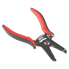](https://www.sparkfun.com/products/retired/12630) 

### [剥线钳-30a WG](https://www.sparkfun.com/products/retired/12630)

[Retired](https://learn.sparkfun.com/static/bubbles/ "Retired") TOL-12630

使用 Hakko 的剥线钳非常方便和舒适。这些是任何一个黑客的必备技能…

3 **Retired**[Favorited Favorite](# "Add to favorites") 14[Wish List](# "Add to wish list")****** ******最后，[接头](https://www.sparkfun.com/products/116)或[导线](https://www.sparkfun.com/products/11367)将帮助分线板连接到您的试验板或开发平台。

### 推荐阅读

该连接指南依赖于一些初级电子知识。如果下面的任何一个主题对你来说听起来很陌生，考虑先看看那个教程:

[](https://learn.sparkfun.com/tutorials/resistors) [### 电阻](https://learn.sparkfun.com/tutorials/resistors) A tutorial on all things resistors. What is a resistor, how do they behave in parallel/series, decoding the resistor color codes, and resistor applications.[Favorited Favorite](# "Add to favorites") 57[](https://learn.sparkfun.com/tutorials/diodes) [### 二极管](https://learn.sparkfun.com/tutorials/diodes) A diode primer! Diode properties, types of diodes, and diode applications.[Favorited Favorite](# "Add to favorites") 70[](https://learn.sparkfun.com/tutorials/button-and-switch-basics) [### 按钮和开关基础知识](https://learn.sparkfun.com/tutorials/button-and-switch-basics) A tutorial on electronics' most overlooked and underappreciated component: the switch! Here we explain the difference between momentary and maintained switches and what all those acronyms (NO, NC, SPDT, SPST, ...) stand for.[Favorited Favorite](# "Add to favorites") 53[](https://learn.sparkfun.com/tutorials/light-emitting-diodes-leds) [### 发光二极管](https://learn.sparkfun.com/tutorials/light-emitting-diodes-leds) Learn the basics about LEDs as well as some more advanced topics to help you calculate requirements for projects containing many LEDs.[Favorited Favorite](# "Add to favorites") 67

## 硬件概述

虽然它看起来像一个简单的分线点，但 Cherry MX 交换机分线板有点过度设计。这是引脚排列和电路板其他特性的快速分类。

[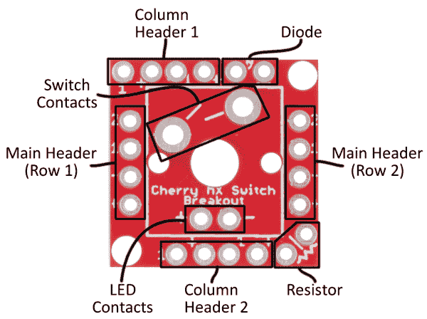](https://cdn.sparkfun.com/assets/learn_tutorials/5/0/3/top-annotated.jpg)

### 分线针标签

多达四个引脚用于与 Cherry MX 开关交互-两个用于开关触点，两个用于可选的 LED。这些引脚分布在电路板的各个侧面，标记为“1”、“2”、“正”或“-”。这些标签是以下内容的简称:

| Pin Label | Pin 描述 |
| one | 开关触点 1 |
| Two | 开关触点 2 |
| + | LED 阳极 |
| - | LED 阴极 |

如果你只想使用开关，标有“1”和“2”的引脚应该就是你所需要的。如果您正在集成一个 3 毫米的 LED，LED 的阳极和阴极将分别在“+”和“-”引脚上。

#### 标题对

分线板的每一侧都配有一个四引脚接头(不要将它们与二极管或电阻引脚混淆)，但并非所有这些接头都是相同的！两个接头断开所有四个引脚，而另外两个接头*仅*断开 LED 阳极和一个开关触点。

[](https://cdn.sparkfun.com/assets/learn_tutorials/5/0/3/headers-labeled.png)

电路板左右两侧的一对接头**断开所有四个引脚**。这些是主要用途。您可以将插针焊接到这两个接头上，并将开关插入试验板。

[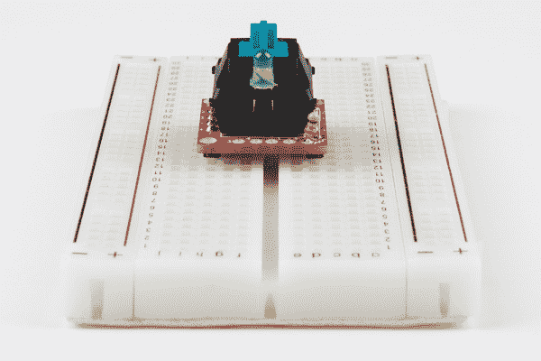](https://cdn.sparkfun.com/assets/learn_tutorials/5/0/3/Cherry_MX_Switch_Tutorial-02.jpg)

仅断开*的一对接头*LED 阳极和开关触点 1 设计用于键盘矩阵，其中多块电路板以行/列对连接。稍后在教程中会有更多关于这个[的内容。](https://learn.sparkfun.com/tutorials/cherry-mx-switch-breakout-hookup-guide#matrixing-breakouts)

## 组装技巧

要使用分线板，至少需要将 Cherry MX 交换机和接头或电线焊接到“1”和“2”引脚。[公接头](https://www.sparkfun.com/products/116)适用于大多数试验板应用，而[实芯](https://www.sparkfun.com/products/11367)或[绞合线](https://www.sparkfun.com/products/11375)适用于将分线点连接到远处的情况。

[](https://www.sparkfun.com/products/11367) 

将**添加到您的[购物车](https://www.sparkfun.com/cart)中！**

### [](https://www.sparkfun.com/products/11367)

[In stock](https://learn.sparkfun.com/static/bubbles/ "in stock") PRT-11367

各种颜色的电线:你知道这是一个美丽的东西。六种不同颜色的硬纸板实芯焊丝…

$21.5037[Favorited Favorite](# "Add to favorites") 86[Wish List](# "Add to wish list")****[](https://www.sparkfun.com/products/116) 

将**添加到您的[购物车](https://www.sparkfun.com/cart)中！**

### [破开头球——直击](https://www.sparkfun.com/products/116)

[In stock](https://learn.sparkfun.com/static/bubbles/ "in stock") PRT-00116

一排标题-打破适应。40 个引脚，可切割成任何尺寸。用于定制 PCB 或通用定制接头。

$1.7520[Favorited Favorite](# "Add to favorites") 133[Wish List](# "Add to wish list")****[](https://www.sparkfun.com/products/11375) 

将**添加到您的[购物车](https://www.sparkfun.com/cart)中！**

### [](https://www.sparkfun.com/products/11375)

[In stock](https://learn.sparkfun.com/static/bubbles/ "in stock") PRT-11375

各种颜色的电线:你知道这是一个美丽的东西。六种不同颜色的绞线装在一个纸板盒里…

$22.5019[Favorited Favorite](# "Add to favorites") 46[Wish List](# "Add to wish list")****[](https://www.sparkfun.com/products/553) 

将**添加到您的[购物车](https://www.sparkfun.com/cart)中！**

### [挣脱男头球-直角](https://www.sparkfun.com/products/553)

[In stock](https://learn.sparkfun.com/static/bubbles/ "in stock") PRT-00553

一排直角公接头-断开以适合。40 个引脚，可切割成任何尺寸。用于定制 PCB 或一般定制…

$2.255[Favorited Favorite](# "Add to favorites") 47[Wish List](# "Add to wish list")******** ********还有许多其他附加选项，包括 3 毫米 LED，限流电阻和开关隔离二极管，这些都在下面记录。

### 3 毫米 LED

大多数 Cherry MX 开关——包括我们出售的[蓝色 MX1A-E1NW](https://www.sparkfun.com/products/13834) 开关——在它们的主体上有一个凹槽，用于安装一个小的[3 毫米 LED](https://www.sparkfun.com/categories/171) 。

开关顶部的“A”和背面的二极管符号都表示 LED 的推荐极性。

[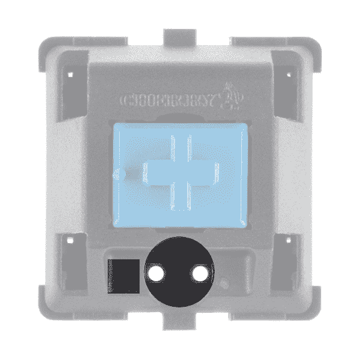](https://cdn.sparkfun.com/assets/learn_tutorials/5/0/3/switch-top-led.jpg)*The LED's recessed home in the switch. Note the "A" indicator for the LED's "anode."*

要将 LED 添加到交换机中，请将 LED 的阳极和阴极引脚插入到各自的引脚中——LED 较长的阳极引脚应插入到“A”引脚中——然后翻转电路板，并将 LED 焊接到分线板上。

[](https://cdn.sparkfun.com/assets/learn_tutorials/5/0/3/Cherry_MX_Switch_Tutorial-04.jpg)

#### 添加限流电阻

如果要在开关上增加一个 LED，很可能需要一个限流电阻。分线点提供了一个与 LED 串联的电阻覆盖区。您可以在电路板的右下角找到电阻焊盘。

Small PTH resistors are recommended for this application – **1/6W or 1/8W through-hole packages** work best. 1/4W resistors can be too large – potentially interfering with any keycap that may be on the switch.

要将 LED 连接到电路板，弯曲其中一个电阻引脚，使其与另一个平行。然后像这样把两条腿插入板中:

[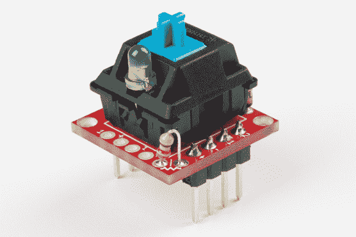](https://cdn.sparkfun.com/assets/learn_tutorials/5/0/3/Cherry_MX_Switch_Tutorial-05.jpg)

你还需要**切断电路板背面的“R”跳线**，这在你焊接任何东西之前可能更容易做到。一把[业余爱好刀](https://www.sparkfun.com/products/9200)和一只稳定的手应该可以搞定。

[](https://cdn.sparkfun.com/assets/learn_tutorials/5/0/3/resistor-jumper.jpg)

默认情况下，电路板在限流电阻上短路。切断此跳线可以消除短路，并在功能上为电路增加电阻。

### 防重影二极管

如果您计划互连四个或更多分线点——创建开关的行/列矩阵——您可能还想考虑添加一个**小信号二极管**来帮助防止“重影”。 [1N4148 小信号二极管](https://www.sparkfun.com/products/8588)非常适合这项任务。

#### 开关矩阵重影

“重影”是一个会对同时按下多个按钮的**检测产生不利影响的问题。如果没有二极管保护，同时按下按钮的某些组合会导致一个或多个未启动的按钮显示为被按下(“重影”)。结果是误报按键，这可能会导致项目中出现不期望的行为。**

为了避免按钮重影，可以在每个按键后的电路中放置小信号二极管。二极管防止按键信号通过线路“反馈”回来。

[](https://cdn.sparkfun.com/assets/learn_tutorials/5/0/3/row-col2x2-switches-shorted.png)

虽然二极管确实可以防止重影，但它确实会对您的按钮检测产生一定的限制。它迫使二极管阳极(正极)侧的开关触点处于比另一个触点更高的电压，因为开关只能在一个方向传导有意义的电流。

有关键盘重影的更多信息，请查看 [Byron 在按钮键盘连接指南](https://learn.sparkfun.com/tutorials/button-pad-hookup-guide#background)中的解释。

电路板右上角有一个小的“垂直”二极管。在该封装中的一个焊盘附近，一条**小白线**表示哪个引脚应该连接到**二极管的阴极**(负)引脚。

要将二极管焊接到电路板上，向下弯曲阳极腿，使其与阴极腿平行。然后将二极管插入电路板，确保将阴极脚(通常用黑条表示)放入标记的孔中。

[](https://cdn.sparkfun.com/assets/learn_tutorials/5/0/3/Cherry_MX_Switch_Tutorial-06.jpg)

你还需要**切断电路板背面的“D”跳线**-否则二极管会短路。(如果在焊接任何东西之前这样做，可能会更容易。)

[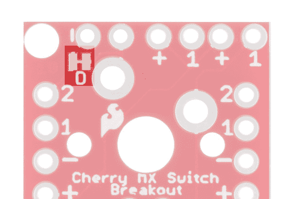](https://cdn.sparkfun.com/assets/learn_tutorials/5/0/3/diode-jumper.jpg)

像电阻一样，分线短路通过二极管。切断此跳线可以消除短路，并在电路中添加二极管。

### 安装孔尺寸

一对安装孔设置在分线板的相对的角上。这些孔用于安装 **2-56 (3/8")** 螺钉。[推荐平头](https://www.sparkfun.com/products/8992)，虽然[圆头](https://www.sparkfun.com/products/8993)也可以。

[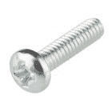](https://www.sparkfun.com/products/8993) 

将**添加到您的[购物车](https://www.sparkfun.com/cart)中！**

### [【螺丝-十字接头(3/8”，2-56)](https://www.sparkfun.com/products/8993)

[In stock](https://learn.sparkfun.com/static/bubbles/ "in stock") PRT-08993

这些是标准螺钉，2-56 螺纹，3/8 英寸长，推荐用于小按钮垫套件。可用于 2-56 …

$0.15 $0.05[Favorited Favorite](# "Add to favorites") 1[Wish List](# "Add to wish list")****[](https://www.sparkfun.com/products/8995) 

将**添加到您的[购物车](https://www.sparkfun.com/cart)中！**

### [【螺母-金属(2-56)](https://www.sparkfun.com/products/8995)

[In stock](https://learn.sparkfun.com/static/bubbles/ "in stock") PRT-08995

**描述* *:这些是带有 2-56 螺纹的标准螺母。适用于 2-56 机器螺丝和五个按钮垫套件，列出的是…

$0.15 $0.04[Favorited Favorite](# "Add to favorites") 1[Wish List](# "Add to wish list")****[](https://www.sparkfun.com/products/retired/8992) 

### [【螺钉-平头(3/8”，2-56)](https://www.sparkfun.com/products/retired/8992)

[Retired](https://learn.sparkfun.com/static/bubbles/ "Retired") PRT-08992

这些是标准螺钉，2-56 螺纹，3/8 英寸长，推荐用于小按钮垫套件。可用于 2-56 …

**Retired**[Favorited Favorite](# "Add to favorites") 0[Wish List](# "Add to wish list")**** ****如果你要在你的键盘上做很多干扰，你会希望它被绑住！

## 测试电路

只需一个电源和几根电线，您就可以创建一个快速电路来测试您的开关、LED、电阻和二极管。将**“+”引脚连接至 5V** (或 3.3V)。然后**把“-”和“1”**连在一起。并将**“2”连接到地线**。(如果没有加限流电阻，一定要外部加一个！它可以代替从“+”到电源或 2 到地的导线。)

[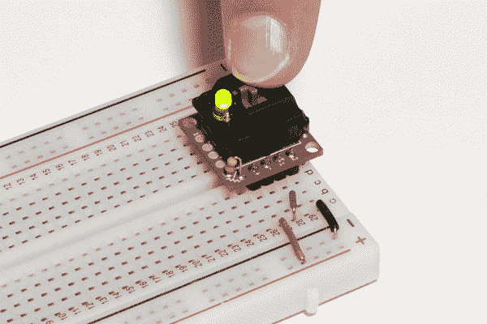](https://cdn.sparkfun.com/assets/learn_tutorials/5/0/3/Cherry_MX_Switch_Tutorial-01.jpg)

现在启动开关，观察 LED 是否亮起。

请注意，如果您添加了重影二极管，这是开关工作的唯一极性-引脚 1 的电压必须高于引脚 2。

## 矩阵突破

Cherry MX 交换机分线板的设计考虑到了交换机矩阵。通过创建开关的行/列矩阵，您可以节省潜在的几十个微控制器 I/O 引脚。例如，一个 64 键的键盘只需要 16 个 I/O 引脚就可以扫描。

### 键间距

虽然键盘按键间距没有具体的标准，但大多数全尺寸键盘按键的中心间距为 3/4 英寸(0.75 英寸)。行可以偏移 3/8 英寸(0.375 英寸)或 3/16 英寸(0.1875 英寸)，或者根本不偏移。

[](https://cdn.sparkfun.com/assets/learn_tutorials/5/0/3/z_011306keycapspacing.jpg)*Typical keyboard row offsets. (Image courtesy of [The PC Guide](http://www.pcguide.com/ref/kb/const/capSize-c.html).)*

该分线点旨在尽可能简化典型的键间距。通过巧妙地从一个棋盘跳到下一个棋盘，你可以将任何标准偏移添加到附近的行中。

[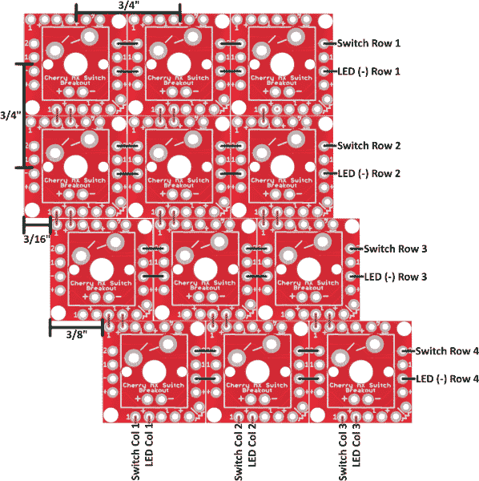](https://cdn.sparkfun.com/assets/learn_tutorials/5/0/3/matrix-examples_1.png)

所以，计划好你的键盘，拿起烙铁！

### 创建关键矩阵

要创建交换机矩阵，请根据需要排列您的板。沿着这些行，排列“2”、“1”、“1-”和“+”标签。然而，**您将只连接跨行**的“2”和“-”引脚。首先将各排焊接在一起:

[](https://cdn.sparkfun.com/assets/learn_tutorials/5/0/3/Cherry_MX_Switch_Tutorial-07.jpg)

没有一种简单的方法把电路板焊接在一起。你可能需要[剥线器](https://www.sparkfun.com/products/12630)将[实芯线](https://www.sparkfun.com/products/11367)分割切割成小块(~3/8”)。一个[第三只手](https://www.sparkfun.com/products/9317)可以在你焊接小电线的时候帮上大忙，让电路板保持不动。

一旦你创建了你的行，通过匹配“1”和“+”针来排列**列。有三个偏移选项可用，如上图所示。**

[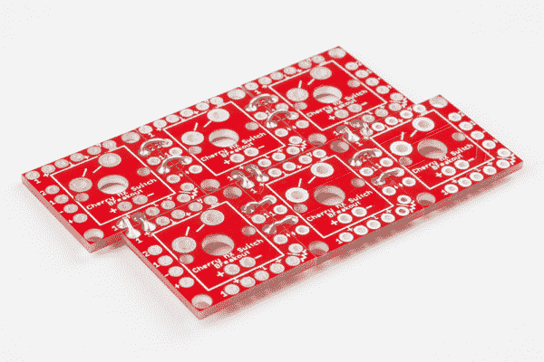](https://cdn.sparkfun.com/assets/learn_tutorials/5/0/3/Cherry_MX_Switch_Tutorial-08.jpg)

这是一个完整的 3x3 矩阵的例子。中间一排从顶部偏移 3/16 英寸，底部一排从中间偏移 3/8 英寸。这将使中间一行相当于键盘的 A、S 和 D 键，顶部一行是 Q、W 和 E，底部一行是 Z、X 和 C——我们正在制作一个以 WASD 为中心的 9 键键盘！

[](https://cdn.sparkfun.com/assets/learn_tutorials/5/0/3/Cherry_MX_Switch_Tutorial-10.jpg)

将电线连接到您需要接触的行和列引脚，完成焊接工作。如果您不使用任何 led，您只需焊接到沿行的“1”引脚和沿列的“2”引脚。

[](https://cdn.sparkfun.com/assets/learn_tutorials/5/0/3/Cherry_MX_Switch_Tutorial-11.jpg)

如果项目需要，不要忘记添加开关、led、电阻或二极管！

### 键盘扫描 Arduino 代码

这是一个简单的 Arduino 草图，设计用于 9 键 3x3 矩阵，但很容易扩展为更大的键盘。

草图假设了这样一个电路:

[](https://cdn.sparkfun.com/assets/learn_tutorials/5/0/3/keypad-hookup-example_bb.png)*It may look like a mess of wires, but -- with 9 switches and LEDs -- we've at least turned 18 wires into 12.*

| 行/列名称 | 突破标签 | Arduino 引脚 |
| LED 第 1 行 | - | Two |
| LED 第 2 行 | - | three |
| LED 第 3 行 | - | four |
| LED 列 1 | + | five |
| LED 列 2 | + | six |
| LED 栏 3 | + | seven |
| 切换第 1 行 | Two | eight |
| 切换第 2 行 | Two | nine |
| 切换第 3 行 | Two | Ten |
| 切换列 1 | one | Eleven |
| 切换列 2 | one | Twelve |
| 切换第 3 列 | one | Thirteen |

然后复制这段代码并上传:

**注意:**此示例假设您在桌面上使用的是最新版本的 Arduino IDE。如果这是你第一次使用 Arduino，请回顾我们关于[安装 Arduino IDE 的教程。](https://learn.sparkfun.com/tutorials/installing-arduino-ide)

If you have not previously installed an Arduino library, please check out our [installation guide.](https://learn.sparkfun.com/tutorials/installing-an-arduino-library)

```
language:c
/* Button/LED Matrix Scanning Example - 3x3 Keypad
   Code derived from Button Pad Hookup Guide Example 2
   by Byron Jacquot @ SparkFun Electronics
     https://learn.sparkfun.com/tutorials/button-pad-hookup-guide#exercise-2-monochrome-plus-buttons
*/
//////////////////////
// Config Variables //
//////////////////////
#define NUM_LED_COLS (3) // Number of LED columns (+, anode)
#define NUM_LED_ROWS (3) // Number of LED rows (-, cathode)
#define NUM_BTN_COLS (3) // Number of switch columns (isolating diode anode)
#define NUM_BTN_ROWS (3) // Number of switch rows (isolating diode cathode)

// Debounce built-in to the code. This sets the number of button
// high or low senses that trigger a press or release
#define MAX_DEBOUNCE (3)

////////////////////
// Hardware Setup //
////////////////////
static const uint8_t btnRowPins[NUM_BTN_ROWS] = {8, 9, 10}; // Pins connected to switch rows (2)
static const uint8_t btnColPins[NUM_BTN_COLS] = {11, 12, 13}; // Pins connected to switch columns (1)
static const uint8_t ledRowPins[NUM_LED_ROWS] = {2, 3, 4}; // Pins connected to LED rows (-)
static const uint8_t ledColPins[NUM_LED_COLS] = {5, 6, 7}; // Pins connected to LED cols (+)

//////////////////////
// Global Variables //
//////////////////////
static bool LED_buffer[NUM_LED_COLS][NUM_LED_ROWS]; // Keeps track of LED states
static int8_t debounce_count[NUM_BTN_COLS][NUM_BTN_ROWS]; // One debounce counter per switch

void setup()
{
  Serial.begin(9600);

  setupLEDPins();
  setupSwitchPins();

  // Initialize the debounce counter array
  for (uint8_t i = 0; i < NUM_BTN_COLS; i++)
  {
    for (uint8_t j = 0; j < NUM_BTN_ROWS; j++)
    {
      debounce_count[i][j] = 0;
    }
  }
  // Initialize the LED buffer
  for (uint8_t i = 0; i < NUM_LED_COLS; i++)
  {
    for (uint8_t j = 0; j < NUM_LED_ROWS; j++)
    {
      LED_buffer[i][j] = 0; // All LED's off
    }
  }
}

void loop() 
{
  scan();
}

static void scan()
{
  // Each run through the scan function operates on a single row
  // of the matrix, kept track of using the currentRow variable.
  static uint8_t currentRow = 0;
  uint8_t i, j; // for loop counters

  // Select current row, and write all components on that row LOW.
  // That'll set the LED anode's LOW, and write the switch "2" pins LOW.
  // If diodes were added, "2' should be connected to the diode cathode
  digitalWrite(btnRowPins[currentRow], LOW);
  digitalWrite(ledRowPins[currentRow], LOW);

  // Look at the LED_buffer variable along this row.
  // If any column is 1, turn the LED on.
  // Otherwise LED will be left off
  for (i = 0; i < NUM_LED_COLS; i++)
  {
    if (LED_buffer[currentRow][i])
    {
      digitalWrite(ledColPins[i], HIGH); // Turn LED on
    }
  }

  // Scan through switches on this row:
  for ( j = 0; j < NUM_BTN_COLS; j++)
  {
    // Read the button. If it's pressed, it should be LOW.
    if (digitalRead(btnColPins[j]) == LOW)
    {
      if ( debounce_count[currentRow][j] < MAX_DEBOUNCE)
      { // Increment a debounce counter
        debounce_count[currentRow][j]++;
        if ( debounce_count[currentRow][j] == MAX_DEBOUNCE )
        { // If debounce counter hits MAX_DEBOUNCE (default: 3)
          // Trigger key press -- Do anything here...
          Serial.print("Key pressed "); 
          Serial.println((currentRow * NUM_BTN_COLS) + j);
          LED_buffer[currentRow][j] = 1; // Set LED to turn on next time through
        }
      }
    }
    else // Otherwise, button is released
    {
      if ( debounce_count[currentRow][j] > 0)
      { 
        debounce_count[currentRow][j]--; // Decrement debounce counter
        if ( debounce_count[currentRow][j] == 0 )
        { // If debounce counter hits 0
          // Trigger key release -- Do anything here...
          Serial.print("Key released "); // Trigger key release
          Serial.println((currentRow * NUM_BTN_COLS) + j);
          LED_buffer[currentRow][j] = 0; // Set LED to turn off next time through
        }
      }
    }
  }

  // Once done scanning, de-select the switch and LED rows
  // by writing them HIGH.
  digitalWrite(btnRowPins[currentRow], HIGH);
  digitalWrite(ledRowPins[currentRow], HIGH);

  // Then turn off any LEDs that might have turned on:
  for (i = 0; i < NUM_LED_ROWS; i++)
  {
    digitalWrite(ledColPins[i], LOW);
  }

  // Increment currentRow, so next time we scan the next row
  currentRow++;
  if (currentRow >= NUM_LED_ROWS)
  {
    currentRow = 0;
  }
}

static void setupLEDPins()
{
  uint8_t i;

  // LED drive rows - written LOW when active, HIGH otherwise
  for (i = 0; i < NUM_LED_ROWS; i++)
  {
    pinMode(ledRowPins[i], OUTPUT);
    digitalWrite(ledRowPins[i], HIGH);
  }

  // LED select columns - Write HIGH to turn an LED on.
  for (i = 0; i < NUM_LED_COLS; i++)
  {
    pinMode(ledColPins[i], OUTPUT);
    digitalWrite(ledColPins[i], LOW);
  }
}

static void setupSwitchPins()
{
  uint8_t i;

  // Button drive rows - written LOW when active, HIGH otherwise
  for (i = 0; i < NUM_BTN_ROWS; i++)
  {
    pinMode(btnRowPins[i], OUTPUT);

    // with nothing selected by default
    digitalWrite(btnRowPins[i], HIGH);
  }

  // Buttn select columns. Pulled high through resistor. Will be LOW when active
  for (i = 0; i < NUM_BTN_COLS; i++)
  {
    pinMode(btnColPins[i], INPUT_PULLUP);
  }
} 
```

每当您按下一个开关时，开关上的 LED 也会亮起。松开开关会关闭 LED。

#### 改编代码

该代码适用于更大或更小的矩阵，只需对草图顶部进行一些修改。

修改`Config Variables`部分的行数或列数:

```
language:c
//////////////////////
// Config Variables //
//////////////////////
#define NUM_LED_COLS (3) // Number of LED columns (+, anode)
#define NUM_LED_ROWS (3) // Number of LED rows (-, cathode)
#define NUM_BTN_COLS (3) // Number of switch columns (diode anode)
#define NUM_BTN_ROWS (3) // Number of switch rows (diode cathode) 
```

和/或转换`Hardware Setup`部分的销连接:

```
language:c
////////////////////
// Hardware Setup //
////////////////////
static const uint8_t btnRowPins[NUM_BTN_ROWS] = {8, 9, 10}; // Pins connected to switch rows (2)
static const uint8_t btnColPins[NUM_BTN_COLS] = {11, 12, 13}; // Pins connected to switch columns (1)
static const uint8_t ledRowPins[NUM_LED_ROWS] = {2, 3, 4}; // Pins connected to LED rows (-)
static const uint8_t ledColPins[NUM_LED_COLS] = {5, 6, 7}; // Pins connected to LED cols (+) 
```

如果您添加了**防重影二极管**，请记住开关的“1”引脚(按列组织)必须处于比行“2”引脚更高的电位。

要扫描键盘矩阵，我们建议使用上拉电阻(通常在 I/O 引脚内部)将 row 引脚拉高。然后逐渐将列引脚拉至地，并检查哪一行(如果有的话)也被拉低。

## 资源和更进一步

Cherry MX 交换机分线板是开源的！如果你想查看[原理图](https://cdn.sparkfun.com/assets/learn_tutorials/5/0/3/SparkFun-Cherry-MX-Switch-Breakout.pdf)或 [PCB 设计文件](https://cdn.sparkfun.com/assets/learn_tutorials/5/0/3/SparkFun-Cherry-MX-Switch-Breakout_1.zip)，请随意阅读我们的 [GitHub 库](https://github.com/sparkfun/Cherry_MX_Switch_Breakout)。

*   [示意图(PDF)](https://cdn.sparkfun.com/datasheets/BreakoutBoards/SparkFun-Cherry-MX-Switch-Breakout.pdf)
*   [老鹰文件(ZIP)](https://cdn.sparkfun.com/datasheets/BreakoutBoards/SparkFun-Cherry-MX-Switch-Breakout.zip)
*   [GitHub 回购](https://github.com/sparkfun/Cherry_MX_Switch_Breakout)
*   [SFE 产品展示区](https://youtu.be/GGNV3bmZrdg)
    *   [CherryMX 和弦键控器项目](https://github.com/sparkfun/CherryMX-Chord-Keyer)

* * *

### 键帽和不同大小的按键

一旦你完成了你的键盘，考虑用一个**键帽**来完成你的按键。樱桃 MX 键帽种类繁多，颜色、透明度、高度、标签和大小各不相同。以下是 Cherry MX 交换机顶部的[目录](https://www.sparkfun.com/categories/315)中的几个可用选项。

[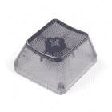](https://www.sparkfun.com/products/15307) 

将**添加到您的[购物车](https://www.sparkfun.com/cart)中！**

### [樱桃 MX 键帽- R2(半透明黑色)](https://www.sparkfun.com/products/15307)

[In stock](https://learn.sparkfun.com/static/bubbles/ "in stock") PRT-15307

这款半透明的黑色 Cherry MX 键帽适用于所有标准尺寸的 Cherry MX 交换机。它是为 R2 街设计的，但是…

$1.05[Favorited Favorite](# "Add to favorites") 3[Wish List](# "Add to wish list")****[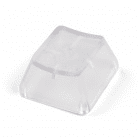](https://www.sparkfun.com/products/15306) 

将**添加到您的[购物车](https://www.sparkfun.com/cart)中！**

### [樱桃 MX 键帽- R2(半透明)](https://www.sparkfun.com/products/15306)

[In stock](https://learn.sparkfun.com/static/bubbles/ "in stock") PRT-15306

这款半透明的 MX 键帽可以在所有标准尺寸的 Cherry MX 交换机上使用。它是为 R2 街设计的，但也可以用于…

$1.05[Favorited Favorite](# "Add to favorites") 5[Wish List](# "Add to wish list")****[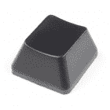](https://www.sparkfun.com/products/15305) 

将**添加到您的[购物车](https://www.sparkfun.com/cart)中！**

### [樱桃 MX 键帽- R2(不透明黑色)](https://www.sparkfun.com/products/15305)

[In stock](https://learn.sparkfun.com/static/bubbles/ "in stock") PRT-15305

这款黑色 Cherry MX 键帽适用于所有标准尺寸的 Cherry MX 交换机。它是为 R2 街设计的，但也可以用于…

$1.05[Favorited Favorite](# "Add to favorites") 5[Wish List](# "Add to wish list")****** ******如果你正在寻找更多的选项，那里有大量的键帽来源，包括 MechanicalKeyboards.com 的 WASD 键盘和 T2 的 T3。一旦你选择了你的键帽，并把它放在键上，它应该看起来像下面的图像。

[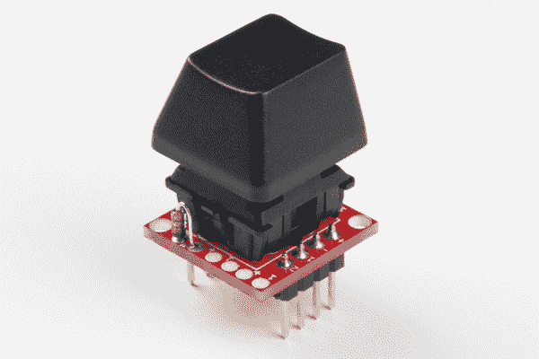](https://cdn.sparkfun.com/assets/learn_tutorials/5/0/3/Cherry_MX_Switch_Tutorial-09.jpg)

或者考虑在您的项目中添加一个四倍于正常大小的键！

[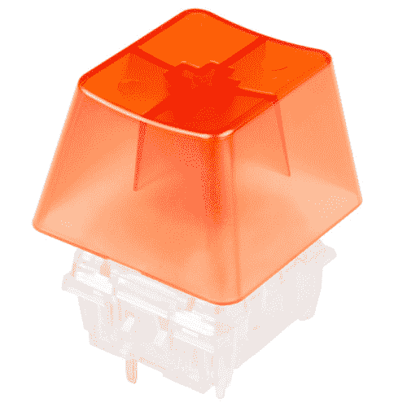](https://www.sparkfun.com/products/retired/14583) 

### [新奇按键大开关——触觉](https://www.sparkfun.com/products/retired/14583)

[Retired](https://learn.sparkfun.com/static/bubbles/ "Retired") COM-14583

组装你自己的定制键盘正迅速成为计算机爱好者的一种有趣的爱好，但是如果你能建造一个…

**Retired**[Favorited Favorite](# "Add to favorites") 16[Wish List](# "Add to wish list")

* * *

如果你想继续探索 SparkFun 教程中的项目创意，这里有一些我们推荐的指南:

[](https://learn.sparkfun.com/tutorials/reaction-timer) [### 反应速度测量器](https://learn.sparkfun.com/tutorials/reaction-timer) Demonstrate mental chronometry with this simple reaction timer 11[](https://learn.sparkfun.com/tutorials/wav-trigger-hookup-guide-v11) [### WAV 触发器连接指南 V11](https://learn.sparkfun.com/tutorials/wav-trigger-hookup-guide-v11) An introduction to being able to trigger music and sound effects based on buttons, sensors, or switches using the WAV Trigger board.[Favorited Favorite](# "Add to favorites") 0[](https://learn.sparkfun.com/tutorials/sx1509-io-expander-breakout-hookup-guide) [### SX1509 I/O 扩展器转接连接指南](https://learn.sparkfun.com/tutorials/sx1509-io-expander-breakout-hookup-guide) Learn how you can use the SX1509 to control 16 LEDs or up to 64 buttons with just two pins.[Favorited Favorite](# "Add to favorites") 12[](https://learn.sparkfun.com/tutorials/button-pad-hookup-guide) [### 按钮垫连接指南](https://learn.sparkfun.com/tutorials/button-pad-hookup-guide) An introduction to matrix scanning, using the SparkFun 4x4 Button Pad.[Favorited Favorite](# "Add to favorites") 15

或者看看这篇博客文章，寻找灵感，3D 打印你自己的键帽。

[](https://www.sparkfun.com/news/2412 "June 15, 2017: A Cherry MX keyboard for Eagle shortcut keys") [### 按下我们的按钮

June 15, 2017](https://www.sparkfun.com/news/2412 "June 15, 2017: A Cherry MX keyboard for Eagle shortcut keys")[Favorited Favorite](# "Add to favorites") 3[](https://www.sparkfun.com/news/3345 "July 30, 2020: In a previous blog post we showed off a custom macro keyboard. In this week's post, we update it to make it wireless!") [### Enginursday:构建无线定制键盘

July 30, 2020](https://www.sparkfun.com/news/3345 "July 30, 2020: In a previous blog post we showed off a custom macro keyboard. In this week's post, we update it to make it wireless!")[Favorited Favorite](# "Add to favorites") 3****************************************