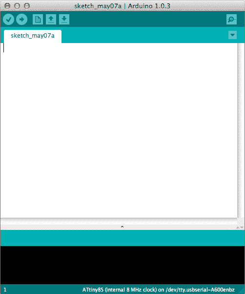
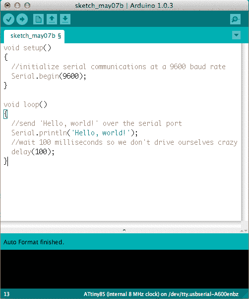
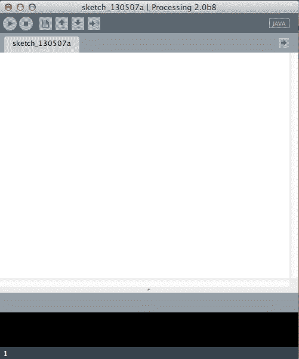
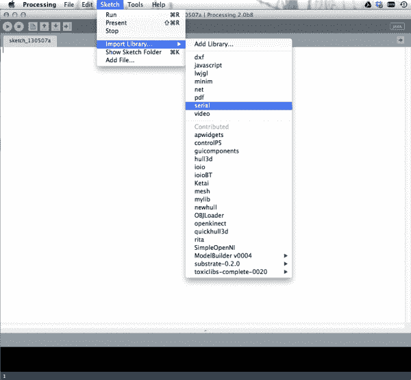
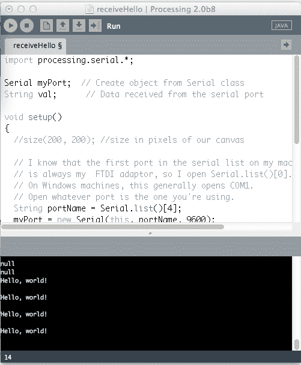
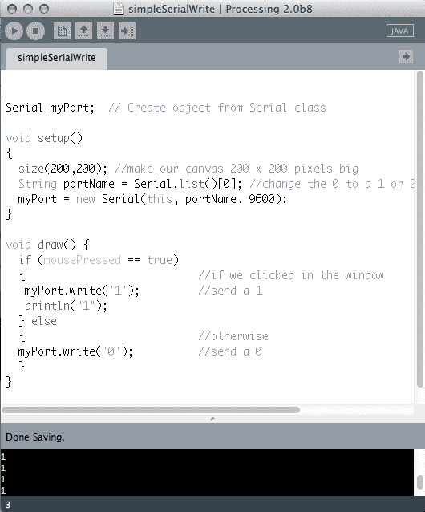
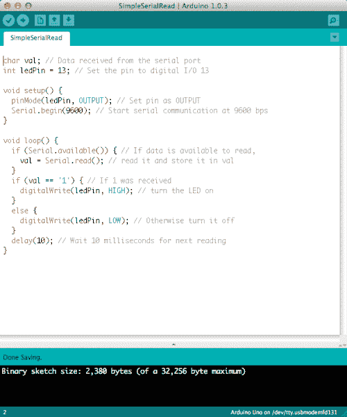
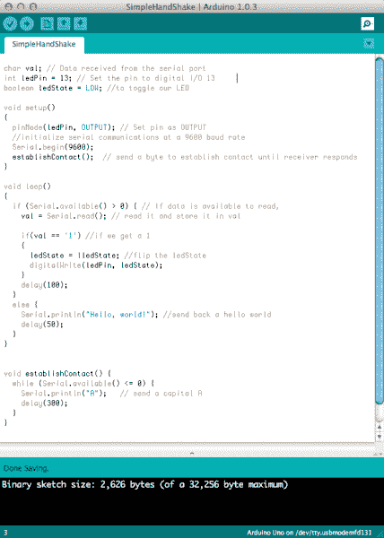
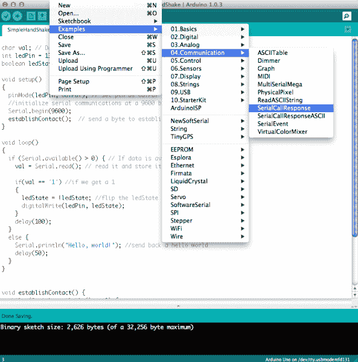

# 将 Arduino 连接到处理

> 原文：<https://learn.sparkfun.com/tutorials/connecting-arduino-to-processing>

## 介绍

所以，你已经用 [Arduino](http://arduino.cc) 闪烁了一些 led，也许你甚至用[处理](http://processing.org)画了一些漂亮的图片——下一步是什么？此时你可能会想，“我想知道是否有办法让 Arduino 和 Processing 相互通信？”。好吧，你猜怎么着——有了！本教程将向您展示如何做到这一点。

在本教程中，我们将学习:

*   如何通过串行端口将数据从 Arduino 发送到处理
*   如何在处理中接收来自 Arduino 的数据
*   如何将处理中的数据发送到 Arduino
*   如何在 Arduino 中接收处理数据
*   如何编写 Arduino 和处理之间的串行“握手”来控制数据流
*   如何制作一个使用模拟传感器控制球拍的“乒乓”游戏

在我们开始之前，为了从本教程中获得最大收益，您应该确定自己已经熟悉了一些东西:

*   什么是 Arduino？
*   [如何使用试验板](https://learn.sparkfun.com/tutorials/how-to-use-a-breadboard)
*   [使用焊线](https://learn.sparkfun.com/tutorials/working-with-wire)
*   [什么是串行通信？](https://learn.sparkfun.com/tutorials/serial-communication)
*   对处理的[有一些基本的了解是有用的，但不是绝对必要的。](http://processing.org)

## 寻找合适的 Arduino？

查看我们的 **[Arduino 对比指南](https://www.sparkfun.com/standard_arduino_comparison_guide)** ！我们已经编译了我们携带的每个 Arduino 开发板，因此您可以快速比较它们，找到最适合您需求的开发板。

带我去那里！


## 来自 Arduino...

让我们从 Arduino 方面的事情开始。我们将向您展示如何设置 Arduino sketch 以通过串行方式发送信息的基础知识。

*   重要的事情先来。如果您还没有这样做，[下载并为您的操作系统安装 Arduino 软件](http://arduino.cc/en/Main/Software)。[如果你卡住了，这里有一个教程](https://learn.sparkfun.com/tutorials/installing-arduino)。
*   您还需要一个 Arduino 兼容的微控制器和一种将其连接到电脑的适当方式(A-to-B USB 电缆、微型 USB 或 FTDI 分线点)。如果你不确定哪一款适合你，请查看[这份比较指南](https://learn.sparkfun.com/tutorials/arduino-comparison-guide)。

好的。至此，您应该已经安装了 Arduino 软件、某种 Arduino 板和一根电缆。现在进行一些编码！别担心，这很简单。

*   打开 Arduino 软件。您应该会看到类似这样的内容:

[](https://cdn.sparkfun.com/assets/e/5/d/d/0/51894727ce395fe854000000.png)

这个漂亮的大空白是我们要写代码的地方。单击白色区域并键入以下内容(如果您觉得懒，也可以复制并粘贴):

```
language:cpp
void setup() 
{
//initialize serial communications at a 9600 baud rate
Serial.begin(9600);
} 
```

这就是我们的设置方法。这是我们“设置”程序的地方。在这里，我们用它来启动从 Arduino 到我们计算机的串行通信，波特率为 9600。现在，关于波特率，你需要知道的是(基本上)它是我们向计算机发送数据的速率，如果我们以不同的速率发送和接收数据，一切都会变得像天书一样，一方无法理解另一方。这很糟糕。

在我们的`setup()`方法之后，我们需要一个叫做`loop()`的方法，只要我们的程序在运行，这个方法就会不断重复。对于我们的第一个例子，我们将只发送字符串“Hello，world！”通过串口，一遍又一遍(一遍又一遍)。在您的 Arduino 草图中，在我们已经编写的代码下面键入以下内容:

```
language:cpp
void loop()
{
//send 'Hello, world!' over the serial port
Serial.println("Hello, world!");
//wait 100 milliseconds so we don't drive ourselves crazy
delay(100);
} 
```

这就是我们第一个例子中 Arduino 端所需要的。我们正在设置 Arduino 的串行通信，并告诉它每 100 毫秒发送一次数据。您的 Arduino 草图现在应该看起来像这样:

[](https://cdn.sparkfun.com/assets/b/3/c/f/b/51895ebece395f3b55000001.png)

剩下要做的就是插入你的 Arduino 板，选择你的板类型(在工具->板类型下)和你的串口(在工具->串口下)，点击“上传”按钮将你的代码加载到 Arduino 上。

现在我们准备看看我们是否能神奇地(或通过代码)检测到‘你好，世界！’我们正在处理发送的字符串。

## ...到处理

我们现在的任务是找到一种方法来监听我们的 Arduino 草图正在发送的内容。幸运的是，Processing 附带了一个专门为此类事情设计的串行库！如果你没有 Processing 的版本，一定要去[Processing.org](http://processing.org)为你的操作系统下载最新版本。一旦安装了处理，就打开它。您应该会看到类似这样的内容:

[](https://cdn.sparkfun.com/assets/4/b/8/6/b/518961ffce395f9d54000000.png)

看起来很像 Arduino，是吧？Arduino 软件实际上部分基于处理——这就是开源项目的美妙之处。一旦我们有了一个打开的草图，我们的第一步是导入串行库。进入草图->导入库->串行，如下图所示:

[](https://cdn.sparkfun.com/assets/d/2/e/5/b/5189644fce395fc86e000000.png)

你现在应该在草图的顶部看到一条类似`import processing.serial.*;`的线。神奇！在 import 语句下，我们需要声明一些全局变量。这意味着这些变量可以用在草图的任何地方。在 import 语句下添加这两行:

```
language:java
Serial myPort;  // Create object from Serial class
String val;     // Data received from the serial port 
```

为了监听任何串行通信，我们必须获得一个串行对象(我们称之为`myPort`，但你可以随意使用它)，它让我们监听计算机上的串行端口，以接收任何传入的数据。我们还需要一个变量来接收实际输入的数据。在这种情况下，由于我们要发送一个字符串(字符序列 Hello，World！’)从 Arduino，我们想在处理中接收一个字符串。就像 Arduino 有`setup()`和`loop()`，处理有`setup()`和`draw()`(而不是循环)。

对于我们的`setup()`处理方法，我们将找到 Arduino 所连接的串行端口，并设置我们的串行对象来监听该端口。

```
language:java
void setup()
{
  // I know that the first port in the serial list on my mac
  // is Serial.list()[0].
  // On Windows machines, this generally opens COM1.
  // Open whatever port is the one you're using.
  String portName = Serial.list()[0]; //change the 0 to a 1 or 2 etc. to match your port
  myPort = new Serial(this, portName, 9600);
} 
```

还记得我们如何在 Arduino 中设置`Serial.begin(9600)`吗？好吧，如果我们不想要我所说的那种官样文章，我们最好也把 9600 作为我们正在处理的串行对象中的最后一个参数。通过这种方式，Arduino 和 Processing 以相同的速率进行通信。快乐时光！

在我们的`draw()`循环中，我们将监听我们的串行端口，我们得到一些东西，将这些东西放在我们的`val`变量中，并将其打印到控制台(处理草图底部的黑色区域)。

```
language:java
void draw()
{
  if ( myPort.available() > 0) 
  {  // If data is available,
  val = myPort.readStringUntil('\n');         // read it and store it in val
  } 
println(val); //print it out in the console
} 
```

哒哒！如果你点击“运行”按钮(你的 Arduino 已经插入并加载了上一页的代码)，你会看到一个小窗口弹出，一秒钟后你会看到“你好，世界！出现在处理控制台中。一遍又一遍。像这样:

[](https://cdn.sparkfun.com/assets/4/4/6/9/4/51ae08bace395f6f1b000000.png)

太棒了。我们现在已经攻克了如何从 Arduino 发送数据进行处理。我们的下一步是弄清楚如何反其道而行之——将数据从处理发送到 Arduino。

## 来自加工...

因此，我们已经将数据从 Arduino 发送到处理，但如果我们想以另一种方式发送数据——从处理发送到 Arduino，该怎么办呢？小菜一碟！

先说事情的处理方面。它的开始很像我们上一个草图:我们导入串行库并为我们的端口声明一个全局串行对象变量，在我们的`setup()`方法中，我们找到我们的端口并用我们的串行变量以 9600 波特初始化该端口上的串行通信。我们还将使用`size()`命令，给我们一个小窗口来点击，这将触发我们的草图通过串行端口向 Arduino 发送一些东西。

```
language:java
import processing.serial.*;

Serial myPort;  // Create object from Serial class

void setup() 
{
  size(200,200); //make our canvas 200 x 200 pixels big
  String portName = Serial.list()[0]; //change the 0 to a 1 or 2 etc. to match your port
  myPort = new Serial(this, portName, 9600);
} 
```

在我们的`draw()`循环中，我们通过使用来自处理串行库的`write`方法，通过串行端口发送我们想要的任何东西。对于该草图，每当我们在加工窗口中单击鼠标时，我们将发送一个“1”。我们还会在控制台上将其打印出来，以便看到我们确实在发送一些东西。如果我们没有点击，我们将发送“0”来代替。

```
language:java
void draw() {
  if (mousePressed == true) 
  {                           //if we clicked in the window
   myPort.write('1');         //send a 1
   println("1");   
  } else 
  {                           //otherwise
  myPort.write('0');          //send a 0
  }   
} 
```

此时，您的代码应该是这样的:

[](https://cdn.sparkfun.com/assets/5/2/c/b/5/51a51ac5ce395f2a24000001.png)

如果您运行这段代码，每当您在窗口中单击鼠标时，您应该会看到控制台区域中出现一串 1。整洁！但是我们如何从 Arduino 中寻找这些 1 呢？我们能用它们做什么？

## ...去 Arduino

好吧！在这一页上，我们将寻找来自处理的那些 1，如果我们看到它们，我们将打开引脚 13 上的 LED(在某些 Arduinos 上，如 Uno，引脚 13 是板上 LED，因此您不需要外部 LED 来查看这项工作)。

在 Arduino 草图的顶部，我们需要两个全局变量——一个用于保存来自处理的数据，另一个用于告诉 Arduino 我们的 LED 连接到哪个引脚。

```
language:cpp
 char val; // Data received from the serial port
 int ledPin = 13; // Set the pin to digital I/O 13 
```

接下来，在我们的`setup()`方法中，我们将 LED 引脚设置为输出，因为我们正在给 LED 供电，我们将以 9600 波特开始串行通信。

```
language:cpp
 void setup() {
   pinMode(ledPin, OUTPUT); // Set pin as OUTPUT
   Serial.begin(9600); // Start serial communication at 9600 bps
 } 
```

最后，在`loop()`方法中，我们将查看传入的串行数据。如果我们看到“1”，我们将 LED 设置为高(或打开)，如果我们没有看到(例如，我们看到的是“0”)，我们将关闭 LED。在循环结束时，我们设置了一个小的延迟来帮助 Arduino 跟上串行流。

```
language:cpp
 void loop() {
   if (Serial.available()) 
   { // If data is available to read,
     val = Serial.read(); // read it and store it in val
   }
   if (val == '1') 
   { // If 1 was received
     digitalWrite(ledPin, HIGH); // turn the LED on
   } else {
     digitalWrite(ledPin, LOW); // otherwise turn it off
   }
   delay(10); // Wait 10 milliseconds for next reading
} 
```

完成后，您的代码应该是这样的:

[](https://cdn.sparkfun.com/assets/f/2/3/b/6/51a51dfcce395fe124000001.png)

瞧啊。如果我们将此代码加载到我们的 Arduino 上，并运行上一页中的处理草图，您应该能够打开连接到 Arduino 引脚 13 的 LED，只需在处理画布中单击即可。

## 握手(第一部分)

到目前为止，我们已经展示了当一个在说话，另一个在听时，Arduino 和 Processing 可以通过串行通信。我们能否建立一个允许数据双向流动的链接，以便 Arduino 和 Processing 都发送*和*接收数据？你打赌！在商业中，我们称之为串行“握手”，因为双方必须同意何时发送和接收数据。

在这一页和下一页，我们将把前面的两个例子结合起来，这样处理都可以接收到“Hello，world！”并将 1 发送回 Arduino 以切换 LED。当然，这也意味着 Arduino 必须能够发送“你好，世界！”同时监听来自处理的 1。咻！

让我们从 Arduino 方面的事情开始。为了顺利进行，双方都必须知道要听什么，以及对方期望听到什么。我们还希望最小化串行端口上的流量，以便获得更及时的响应。

就像我们的串行读取示例一样，我们需要一个变量用于输入数据，一个变量用于我们想要点亮的 LED 引脚:

```
language:cpp
char val; // Data received from the serial port
int ledPin = 13; // Set the pin to digital I/O 13
boolean ledState = LOW; //to toggle our LED 
```

因为我们试图提高效率，所以我们将更改代码，以便我们只监听 1，每次听到 1，我们就打开或关闭 LED。为此，我们添加了一个布尔(真或假)变量来表示 LED 的高或低状态。这意味着我们不必不断地从处理中发送 1 或 0，这大大释放了我们的串行端口。

我们的`setup()`方法看起来基本相同，只是增加了一个`establishContact()`函数，我们稍后会用到这个函数——现在只需输入它。

```
language:cpp
void setup() 
{
  pinMode(ledPin, OUTPUT); // Set pin as OUTPUT
  //initialize serial communications at a 9600 baud rate
  Serial.begin(9600);
  establishContact();  // send a byte to establish contact until receiver responds 
} 
```

在我们的循环函数中，我们刚刚合并并精简了前面两个草图中的代码。最重要的是，我们已经更改了 LED 代码，以便根据新的布尔值进行切换。“！”意味着每当我们看到一个 1 时，我们将布尔值设置为与之前相反的值(低到高，反之亦然)。我们也把我们的‘你好，世界！’在 else 语句中，所以我们只在没有看到' 1 '输入时才发送它。

```
language:cpp
void loop()
{
  if (Serial.available() > 0) { // If data is available to read,
    val = Serial.read(); // read it and store it in val

    if(val == '1') //if we get a 1
    {
       ledState = !ledState; //flip the ledState
       digitalWrite(ledPin, ledState); 
    }
    delay(100);
  } 
    else {
    Serial.println("Hello, world!"); //send back a hello world
    delay(50);
    }
} 
```

现在我们到了放在我们的`setup()`方法中的`establishContact()`函数。这个函数只是发出一个字符串(我们在处理过程中需要查找的同一个字符串)来查看它是否听到任何反馈——表明处理过程准备好接收数据了。这就像一遍又一遍地说“马可”，直到你听到某个地方传来“波罗”的声音。

```
language:cpp
void establishContact() {
  while (Serial.available() <= 0) {
  Serial.println("A");   // send a capital A
  delay(300);
  }
} 
```

您的 Arduino 代码应该如下所示:

[](https://cdn.sparkfun.com/assets/f/a/1/4/6/51ae469bce395f3536000000.png)

这就是 Arduino 方面的内容，现在开始处理！

## 握手(第二部分)

对于事情的处理方面，我们必须做一些改变。我们将使用`serialEvent()`方法，每当我们在串行缓冲区中看到一个特定的字符时，就会调用该方法，它充当我们的分隔符——基本上它告诉处理我们已经完成了一个特定的“块”数据——在我们的例子中，是一个“Hello，world！”。

我们草图的开头是一样的，除了一个新的`firstContact` boolean，它让我们知道我们何时连接到 Arduino。

```
language:java
import processing.serial.*; //import the Serial library
 Serial myPort;  //the Serial port object
 String val;
// since we're doing serial handshaking, 
// we need to check if we've heard from the microcontroller
boolean firstContact = false; 
```

我们的`setup()`函数和我们的串行写程序一样，*，除了*我们增加了`myPort.bufferUntil('\n');`行。这让我们将传入的数据存储到一个缓冲区中，直到我们看到一个我们正在寻找的特定字符。在本例中，这是一个回车符(\n)，因为我们从 Arduino 发送了一个 Serial.print *ln* 。结尾的' ln '意味着字符串以回车结束，所以我们知道这将是我们看到的最后一个东西。

```
language:java
void setup() {
  size(200, 200); //make our canvas 200 x 200 pixels big
  //  initialize your serial port and set the baud rate to 9600
  myPort = new Serial(this, Serial.list()[4], 9600);
  myPort.bufferUntil('\n'); 
} 
```

因为我们在连续发送数据，所以我们的`serialEvent()`方法现在充当我们的新`draw()`循环，所以我们可以让它为空:

```
language:java
void draw() {
  //we can leave the draw method empty, 
  //because all our programming happens in the serialEvent (see below)
} 
```

现在是大事件:`serialEvent()`。每次我们看到回车，这个方法就会被调用。我们每次都需要做一些事情来保持事情顺利进行:

*   读取输入数据
*   查看其中是否真的有任何内容(即，它不为空或“null”)
*   修剪空白和其他不重要的东西
*   如果这是我们第一次听到正确的事情，改变我们的`firstContact`布尔值，让 Arduino 知道我们准备好了更多的数据
*   如果这是我们第一次运行的*而不是*，将数据打印到控制台，并将我们在窗口中得到的任何有效的鼠标点击(作为 1)发送回来
*   最后，告诉 Arduino 我们准备好了更多的数据

这需要很多步骤，但幸运的是，对于我们来说，Processing 有一些功能可以让大多数任务变得非常简单。让我们来看看它是如何分解的:

```
language:java
void serialEvent( Serial myPort) {
//put the incoming data into a String - 
//the '\n' is our end delimiter indicating the end of a complete packet
val = myPort.readStringUntil('\n');
//make sure our data isn't empty before continuing
if (val != null) {
  //trim whitespace and formatting characters (like carriage return)
  val = trim(val);
  println(val);

  //look for our 'A' string to start the handshake
  //if it's there, clear the buffer, and send a request for data
  if (firstContact == false) {
    if (val.equals("A")) {
      myPort.clear();
      firstContact = true;
      myPort.write("A");
      println("contact");
    }
  }
  else { //if we've already established contact, keep getting and parsing data
    println(val);

    if (mousePressed == true) 
    {                           //if we clicked in the window
      myPort.write('1');        //send a 1
      println("1");
    }

    // when you've parsed the data you have, ask for more:
    myPort.write("A");
    }
  }
} 
```

哦。这是一个很大的挑战，但是如果你一行一行地仔细阅读(尤其是评论)，它将开始变得有意义。如果你已经完成了 Arduino 代码并加载到你的板上，试着运行这个草图。你应该看看“你好，世界！”进入控制台，当您在处理窗口中单击时，您应该看到引脚 13 上的 LED 打开和关闭。成功！你现在是一个连续握手专家。

## 提示和技巧

在使用 Arduino 和 Processing 开发您自己的项目时，有几个“陷阱”有助于您在遇到困难时牢记在心。

*   确保您的波特率匹配
*   确保您在处理中读取的是正确的端口——有一个`Serial.list()`命令会显示您可以连接的所有可用端口。
*   如果你正在使用`serialEvent()`方法，确保在你的`setup()`方法中包含`port.bufferUntil()`函数。
*   此外，确保您缓冲的字符(例如，' \n ')是您实际上从 Arduino 发送的字符。
*   如果您想发送大量的传感器值，最好先计算一下您期望的字节数，这样您就知道如何正确解析传感器数据。(Arduino 附带的示例(如下所示)给出了一个很好的例子:

[](https://cdn.sparkfun.com/assets/a/7/9/0/8/51ae5ff4ce395f4836000000.png)*This is the example to select for some good sensor parsing code*

## 资源和更进一步

既然你已经知道了如何将数据从 Arduino 发送到 Processing，然后再返回(甚至同时发送！)，你已经为一些非常酷的项目做好了准备。通过将 Arduino 和 Processing 结合在一起，你可以做一些事情，比如实时可视化传感器数据，或者在手指上制作一个带有 flex 传感器的手套，让企鹅出现在屏幕上，或者从 Processing 制作一个命令控制台，控制一个巨大的 led 阵列。

以下是一些有用的链接，您可能会发现它们对您的发展很有帮助:

*   [德里克·朗伯格的加工课程](https://learn.sparkfun.com/curriculum/45)
*   [Arduino &加工图集课程](https://learn.sparkfun.com/curriculum/46)
*   [处理危险护罩](https://learn.sparkfun.com/curriculum/16)
*   [Arduino，处理，& MaxMSP](https://learn.sparkfun.com/curriculum/34)