# 质量控制方面的不断创新

> 原文：<https://learn.sparkfun.com/tutorials/constant-innovation-in-quality-control>

## 介绍

在质量控制方面，我们不断面临创建快速、全面和可靠的测试程序的挑战。我们永远不愿意牺牲这三个因素中的任何一个，所以，加快测试的唯一方法就是雇佣更多的技术人员或者...创新。在我们真正的引导风格中，我们总是尽最大努力做到后者。

2009 年，我们开始使用 pogopins 设计测试设备。

[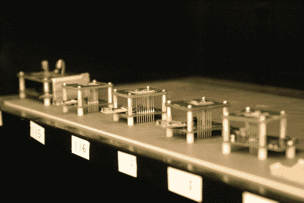](https://cdn.sparkfun.com/assets/learn_tutorials/6/5/pogobeds1.jpg)

你可以在这里了解更多: [PogoBeds: SparkFun 生产和测试](https://www.sparkfun.com/tutorials/138)

2011 年，我们用我们的第一台华夫饼压机黑出了一个多板程序员。

[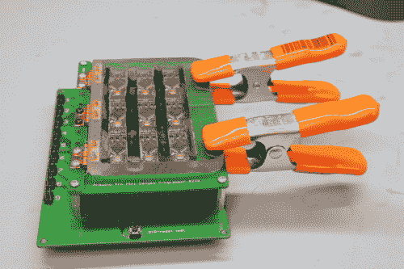](https://www.sparkfun.com/tutorials/233)

你可以在这里了解更多:[AVR ISP mkii 的联动编程](https://www.sparkfun.com/tutorials/233)

从那以后，我们在硬件、代码、检查流程和电路板布局方面取得了巨大进步。在这篇文章中，我们将分享过去几年中一些最好的想法。我们希望它们能帮助你设计更好的项目，甚至以新的方式思考你的硬件设计。

为制造伟大的电子产品*和*干杯！

## 多板编程

我们的第一个多板编程方法包括多个程序员、一个 USB 集线器、一堆电缆和一些复杂的批处理文件操作。

[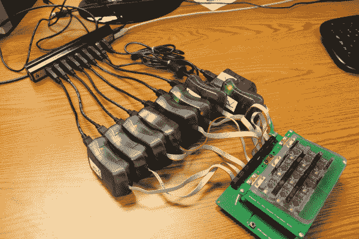](https://cdn.sparkfun.com/assets/2/f/7/f/c/5273d577757b7ff47b8b4567.JPG)

这确实加快了我们的生产速度。一次九个是对我们以前单板编程方法的巨大改进。但是，就像我们的大多数测试设备一样，它最终变得过时了，我们想要升级它。

安装变得有点麻烦——确保所有东西都正确插入。随着时间的推移，带状电缆开始磨损。在 2011 年 11 月，我们发布了一个关于这个联合程序员如何工作的非常全面的教程。点击[此处](https://www.sparkfun.com/tutorials/233)查看。除了硬件设计的想法，它实际上是使用批处理文件的一个很好的练习。

大约在上述程序员发布一年后，我们开始让很多技术人员的计算机在编程过程中死机。著名的蓝屏死亡发生得太频繁了。我们用质量更好的集线器替换了 USB 集线器，这似乎对问题有所帮助。然而，我们知道需要另一种方法。

我们希望找到一种方法，用一个程序员同时对多个电路板进行编程。我们首先想到的是在编程线路上使用某种放大器或缓冲器。

要使用 ISP 对 AVR 进行编程，需要从编程器到目标 IC 建立 6 条连接:

*   VCC
*   GND
*   重置
*   血清肌酸激酶
*   军事情报部门组织(Military Intelligence Service Organization)
*   MOSI

通过对我们的逻辑电平转换器进行实验，我们能够用几块电路板对一个程序员进行编程。我们最初的硬件如下。

GND、VCC 和复位的物理总线(如同一网络中的金属连接)。

SCK 和 MOSI 需要缓冲，因为这些信号被发送到多个目标。MKII 似乎没有足够的输出阻抗来编程多个目标，所以我们通过逻辑电平转换器发送它们。这样，信号强度依赖于转换器的高逻辑引脚，而不是 MKII 的输出。

味噌系列有点棘手。这条线将通信从目标传送回程序员。如果你有几个目标同时试图和程序员对话，程序员就不会理解返回的数据。我们找到的解决方案是只有一个目标 IC 与程序员对话。这样，程序员认为它只与一个 IC 对话，而总线上其余的目标 IC 只是简单地跟着听。我们认为可以稍后用其他测试代码测试剩余 ICs MISO 线上的焊点。

[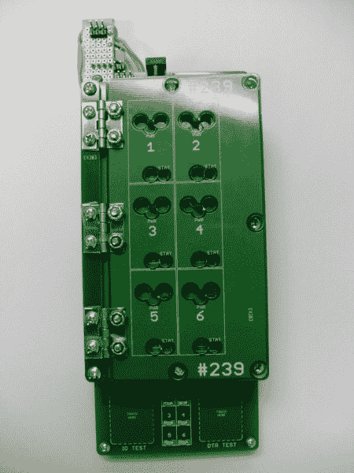](https://cdn.sparkfun.com/assets/e/0/f/5/e/5273dde2757b7f467c8b456a.jpg)

上图是第一个包含缓冲编程电路的测试硬件。它被用于 Arduino Pro Mini。它可以一次给六块电路板编程，在生产车间过着体面的生活。如果你仔细观察左上方，你可以看到编程线上使用的原型板和逻辑电平转换器。不幸的是，这是我能找到的最好的照片了。它已经升级到新版本(包括一个十六进制转换器缓冲电路)。上图中的原始硬件一定是被扔进了我们的电子产品回收中心。

然后，我们将晶体管缓冲器集成到测试平台 PCB 中，如下图所示:

[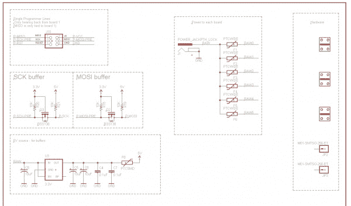](https://cdn.sparkfun.com/assets/9/0/b/0/d/5273e2f9757b7ff47b8b4568.jpg)

生产中的最新型号包含一个十六进制转换器，用于放大 SCK 和 MISO 线路，如下所示:

[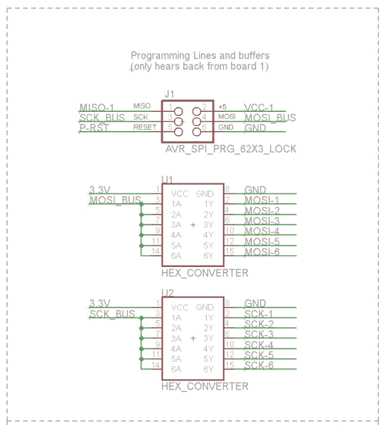](https://cdn.sparkfun.com/assets/f/f/6/0/1/5273e91d757b7f300d8b4567.jpg)

下面是一张为 [9 自由度-剃刀 IMU](https://www.sparkfun.com/products/10736) 最新联动编程器的图片。它一次对六块电路板进行编程，并且只使用一个程序员。

[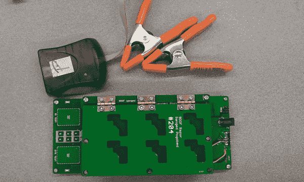](https://cdn.sparkfun.com/assets/8/6/6/2/2/52792ef7757b7f2c628b456a.jpg)

它还有一些其他的进步，包括华夫饼干顶部，capsense 按钮等等。本文接下来的几节将专门讨论这些改进。请继续阅读，了解更多信息。

## 华夫饼干顶部

事实证明，将电路板固定在适当的位置(在 pogopins 之上)一直是一个相当大的挑战。我们最终确定了两种方式:小块饼干和华夫饼干。

对于我们的具有最小 pogopins 的测试床(通常是单板测试器)，我们使用一个我们称之为“锁定小块”的小设备。基本上，它是一个小的椭圆形 PCB，中间有一个钻孔。这些小块靠近帧层的边缘。下面是一个相当新的测试床设计的图片，它测试我们的 [TXB014 分线点](https://www.sparkfun.com/products/11771)。

[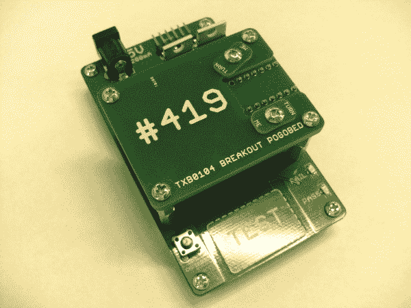](https://cdn.sparkfun.com/assets/2/1/c/7/3/5279203c757b7ffc588b456b.jpg)

下一张图片显示的是测试中的电路板。注意小块是如何转动并把板子压在弹簧顶上的。

[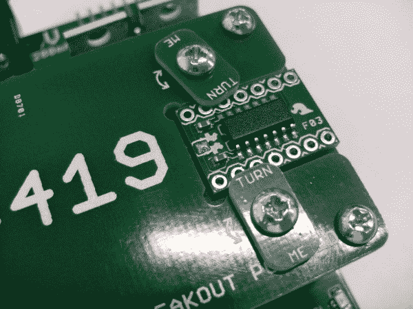](https://cdn.sparkfun.com/assets/1/2/8/5/c/527920b7757b7fb8778b4567.jpg)

第二种方法是我们喜欢称之为“华夫饼干顶部”。我们将这种解决方案用于需要更多表面积和压力来固定电路板(或面板)的大型测试平台。

它涉及到使用各种各样的平板(下面显示了一个由丙烯酸制成的例子)。华夫饼干顶部被设计成位于测试中的板(或板组)的顶部。它通过铰链连接到试验台的边缘，以保持对齐。这种铰链连接也使得在将被测板移入和移出时很容易提起。它实际上非常类似于华夫饼干熨斗的工作原理，因此得名。

下面是第一个华夫饼干顶部的图片。它由丙烯酸制成，用于我们的[Arduino Pro Mini 328-5V/16 MHz](https://www.sparkfun.com/products/11113)的测试平台。

[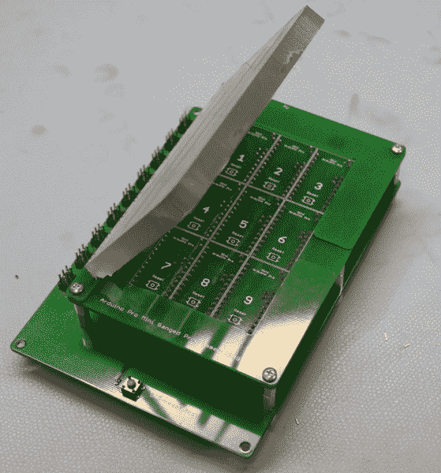](https://cdn.sparkfun.com/assets/e/b/2/6/1/5273ece2757b7fe77c8b4567.JPG)

我们发现，订购两块 PCB 并将它们粘合在一起已被证明是一种更简单的方法。下图是我们的 Arduino FIOs 测试平台。

[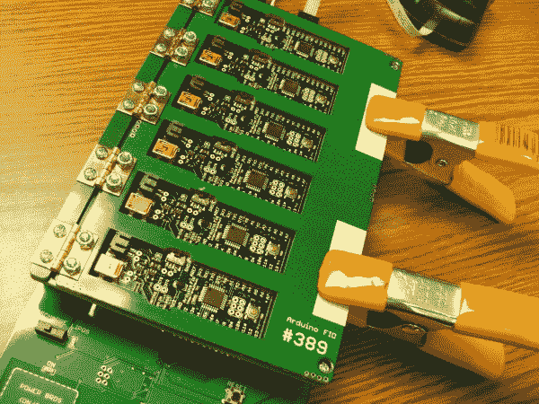](https://cdn.sparkfun.com/assets/9/c/6/d/e/5273ee14757b7fb6728b4567.jpg)

请注意，它还具有切除区域，以便为 Fios 上的填充部件留出空间。再次，这是一个很好的过渡，将华夫饼干设计成 PCB，因为当用有机玻璃制作这些时，这种工作特别耗时。我们还了解到，非常清楚地让你的工厂知道路线区域是很重要的。我们现在添加大的文本。下面是 FIO 华夫饼干顶部的纸板文件:

[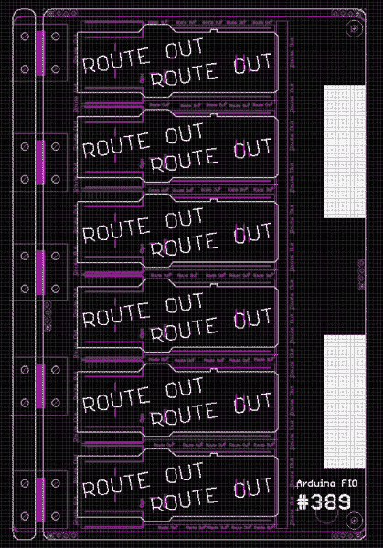](https://cdn.sparkfun.com/assets/4/b/c/3/8/5273f0fb757b7f067d8b4568.jpg)

我们还花了大量时间围绕我们的黄金转轴进行设计。获得合适的间距和高度是很重要的，这样华夫饼的顶部就可以很好地落在板子上，没有任何束缚。这是我们最新的 IOIO 测试平台铰链区域的特写镜头:

[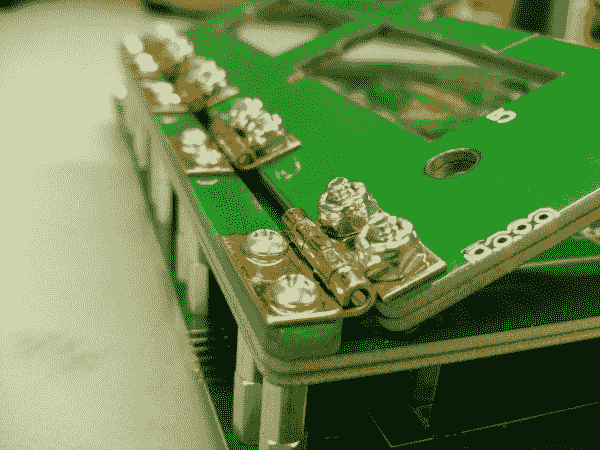](https://cdn.sparkfun.com/assets/f/d/8/1/f/5273ef0a757b7f3e7c8b4569.jpg)

在这个特殊的设计上(因为它相当大)，我们结合了一些锁定头足迹，以帮助在胶合期间对准。我们只需在每块纸板上放几个标题条，当胶水变干时，这真的有助于保持它们完全对齐。

[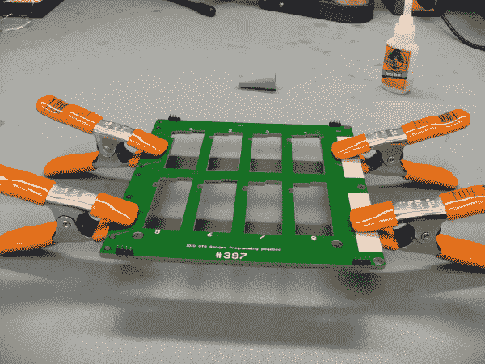](https://cdn.sparkfun.com/assets/e/b/f/e/d/5273f1fe757b7f0b7d8b4567.jpg)

## 控制 led 的移位寄存器

我们的一些较大的测试床需要指示 8-16 板的状态。技术人员需要查看是否所有的板都通过或未通过测试。为了扩展我们的标准测试床微处理器(可靠的 ATMega328)的 IO 能力，我们用移位寄存器扩充了我们的设计。

[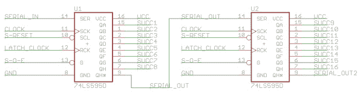](https://cdn.sparkfun.com/assets/a/0/1/a/7/52782a86757b7f336c8b4567.jpg)

上图中，你可以看到我们将两个移位寄存器用 daisey 链连接在一起。这样，我们可以使用我们的微处理器相同的 5 个引脚来控制多达 16 个 led。

我们喜欢这款器件( [74HC595](https://www.sparkfun.com/products/10680) )有两个原因:(1)它已经在我们的库存中，以及(2)SOIC 封装相对容易手工焊接到测试平台上，不太可能跳线。

有人可能会问，“为什么不用更大的微处理器呢？”嗯，我们喜欢保持事情简单，这意味着保持我们的设计小，相似，可重复。因此，我们希望尽可能继续使用 ATMega328。我们 99%的测试平台都使用这种微处理器。

下面是我们针对 [9 自由度传感器棒](https://www.sparkfun.com/products/10724)的多板测试平台的图片。Kade Jensen 是该项目的测试开发者，他恰当地将其命名为“144 DOF”。

[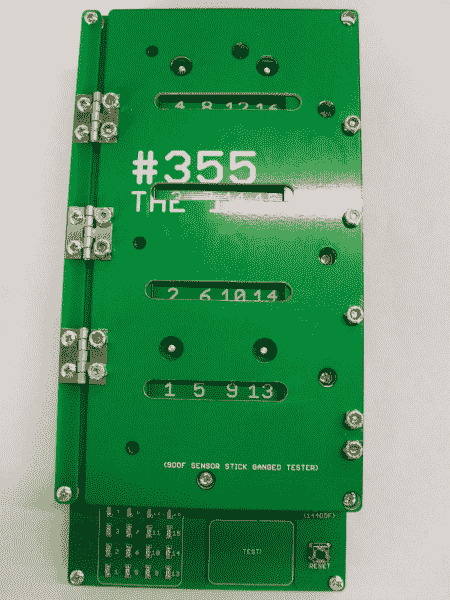](https://cdn.sparkfun.com/assets/e/6/f/4/0/52782da7757b7f67608b4568.jpg)

查看所有这些状态指示灯:

[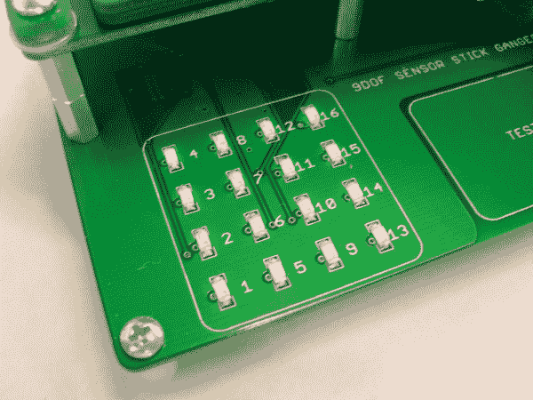](https://cdn.sparkfun.com/assets/8/d/0/1/a/52782def757b7fe7628b4567.jpg)

这一切都要归功于移位寄存器的创新——哇哦！

## 大写感应按钮

[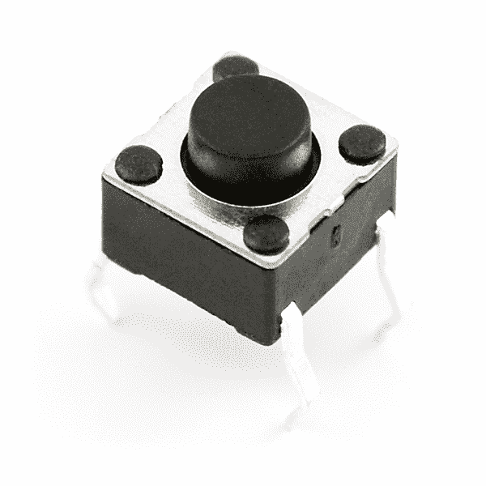](https://cdn.sparkfun.com/assets/c/a/8/b/b/5272daca757b7fba6a8b4567.jpg)

上图是我们经典的小瞬间按钮。一个简单的机械开关是技术人员进行测试的好方法。我们在数百个测试台上使用了这个按钮。如今，生产车间仍有数百台。然而，我们发现在地板上放置几个月后(特别是我们更受欢迎的产品，每天可能会有 1000 次按压)，按钮会在 100%的时间里停止工作。我们发现自己每周都要更换相当多的纽扣。

为了一劳永逸地解决这个问题，我们转向了一种非机械方式:电容式触摸。使用这种新方法，没有机械连接会磨损，我们也不会看到它们在地板上失效。下面是我们的[开口段护盾](https://www.sparkfun.com/products/11847)试验台的图片。您可以看到两个 capsense 按钮，用于测试的不同部分。

[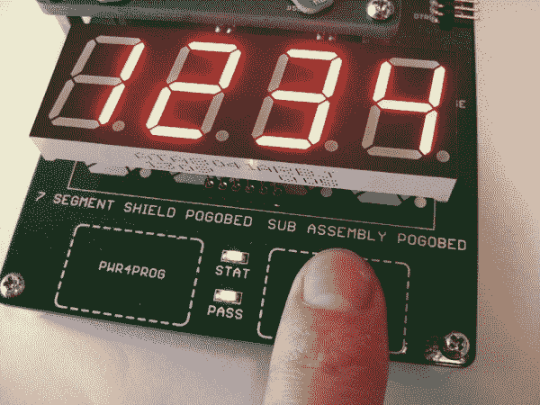](https://cdn.sparkfun.com/assets/6/3/b/1/3/52792a39757b7f41788b4568.jpg)

如果你是电容触摸的新手，请点击查看这个关于 Arduino 的[精彩教程。这是相同的库和硬件技术，我们这些天在我们所有的测试床上使用。](http://playground.arduino.cc//Main/CapacitiveSensor?from=Main.CapSense)

我们还创建了一个特殊的 Eagle 设备，它在包中包含了一些很好的功能，以加快设计工作。它有一个大小合适的金属焊盘用作感应区。垫上没有`tstop`保护手指免受油脂和氧化。它还有一个内置在包装中的`trestrict`盒，用于防止地面倾倒。它在丝绸上有一条虚线来指定按钮的触摸区域。最后，电阻内置于封装中，因此很容易融入设计。

[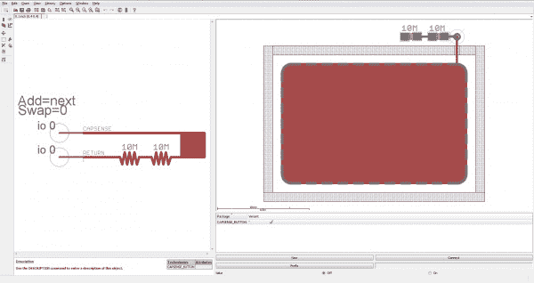](https://cdn.sparkfun.com/assets/1/2/3/0/c/5272dde6757b7ff56a8b4567.jpg)

起初，我们认为对于更简单的测试平台来说，仅仅为了使用一个按钮而包含一个微处理器似乎有点过分了。但是我们现在发现，如果投入 30 分钟来设计和组装测试床能够确保测试床在不需要维修的情况下使用多年，那么这种努力是非常值得的。在大多数情况下，与 QC 相关的硬件，我们投资我们的时间和努力，以找到更永久的修复。

## 高端开关

为了更安全地控制被测电路板的电源，我们现在使用一种叫做高端开关的东西。对我们测试平台的这一改进使我们能够主动控制提供给电路板的电源。

在这项创新之前，测试台上的 pogopins 一直在供电。我们有时会称之为“热”波戈平。此外，用这种硬件在测试平台上交换电路板的行为被称为“热插拔”。这种向被测电路板供电的方法通常适用于低功耗产品，我们的生产车间仍有大量测试平台有热引脚。然而，当您处理更高电流的设备时，它会变得相当危险。

第一款获得此次升级的产品是[大易驱动](https://www.sparkfun.com/products/11699)。与大多数步进电机驱动器一样，该板需要大量电流。最初的测试平台有热波尖端，因此有时会损坏测试中的电路板和/或测试平台本身。

不幸的是，我无法挖掘出原始测试硬件的像样的图片。但是我可以得到最新的版本:

[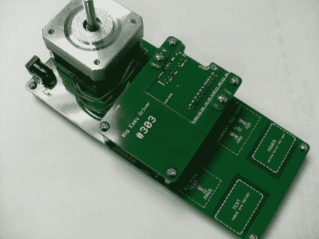](https://cdn.sparkfun.com/assets/b/c/a/e/8/527925f2757b7f06528b456f.jpg)

请注意，技术人员如何使用 cap-sense 按钮进行测试。当他或她按下此按钮时，将首先打开高端开关(为被测电路板供电)，然后进行测试。这确保了该技术不会将电路板压在热弹簧上。

热插拔带来的另一个问题是可能出现短暂的意外短路。当技术人员将电路板放在测试床上时，有时他们可能会意外地水平滑动电路板。如果 VCC 和 GND 在电路板设计中位置相邻(这是经常发生的情况)，那么这可能会导致它们之间的短路。这可能会导致大电流尖峰，并损坏电路板和测试平台。使用高端开关有助于避免这些意外短路的可能性。

高端开关的电路实际上与我们的 [MOSFET 电源控制套件](https://www.sparkfun.com/products/10256)非常相似。下面是我们高端开关模板的示意图:

[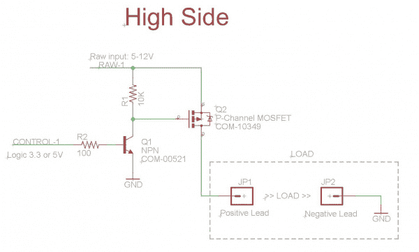](https://cdn.sparkfun.com/assets/3/1/d/7/3/5265781e757b7fcf7c8b4567.JPG)

## 跳线的预测试

2013 年 7 月，我们从测试原始输入功率为 9V 到 15V 的 IOIO OTG。这是为了确保我们的用户能够在更大的输入电压下使用该板。

这也导致了我们很多测试平台的死亡。我们最终发现，如果任何电源轨(在测试中的 IOIO 板上)出现接地短路，通常会烧坏测试平台和电路板。我们的直接解决办法是让我们的技术人员使用万用表检查所有电源轨上的接地短路。尽管这使我们能够继续构建和测试 IOIOs，但这并不是预测试的最有效方法。我们知道一定有什么方法可以自动进行这种预测试。

因此，一天下午，我告诉皮特·多克特我们的麻烦，他帮助我们做了下面的测试。它基本上是用一个分压器来测量一条线路，看它是否有一条到 GND 的跳线。

[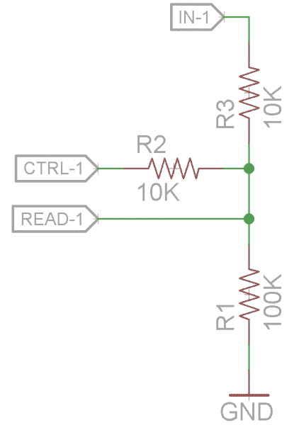](https://cdn.sparkfun.com/assets/3/d/1/e/5/527166a1757b7f1f048b4567.jpg)

它需要微处理器的两个引脚:一个控制引脚(数字)和一个读取引脚(ADC)。通过将控制引脚控制在高电平和低电平，并观察 read 引脚上的电压，我们可以知道输入引脚(IOIO 情况下的电源轨)是否跳接到 GND。

如果 IN-1 网络接地，那么 READ 网络应该位于 CTRL-1(逻辑电平)的大约 1/2 处。结合高端开关的电源控制，我们可以避免给跳线连接到 GND 的电路板上电，最终保护被测电路板和测试平台免受潜在损坏。

下面是我们在最新的 IOIO 测试平台上测试跳线时使用的函数:

```
language:c
boolean jumper_test(int control_pin, int read_pin){

  digitalWrite(pre_testing_led, HIGH);

  pinMode(control_pin, OUTPUT);
  pinMode(read_pin, INPUT);

  digitalWrite(control_pin, HIGH);
  delay(200);
  int reading = analogRead(read_pin);

  if(debug){
  Serial.begin(9600);
  Serial.print("\t reading:");
  Serial.print(reading);
  Serial.end();
  }

  pinMode(control_pin, INPUT);

  int jumper_val = 486;

  digitalWrite(pre_testing_led, LOW);

  if((reading < (jumper_val*1.05)) && (reading > (jumper_val*0.95))) return true; // jumper detected!!
  else return false;

} 
```

我们总是将 [PTC 可重置保险丝](https://www.sparkfun.com/products/11637)放在我们的测试床上，以防止电流尖峰时的损坏，但增加这种预测试是一种确保电流永远不会在第一时间浪涌的好方法。这个问题在之前的测试中从未出现过，因为我们的大多数产品只需要很小的电流。这意味着当我们测试电路板时，我们可以限制电源电流(大多数测试要求 200mA)。另一方面，IOIOs 需要高得多的电流来测试充电电路。给我们的平板电脑充电时，它们实际上消耗高达 800 毫安的电流。

虽然看到这么多测试平台被淘汰有点令人痛苦，但这最终是一件好事，因为它促使我们做出更好的测试平台。我们现在有了一个额外的工具用于高电流产品！

## 焊盘尺寸、圆角和 AOI

作为我们不断追求提高测试彻底性的一部分，2011 年春天，我们购买了第一台 AOI 机器([自动光学检测](http://en.wikipedia.org/wiki/Automated_optical_inspection))。看着它运行了几个面板的板子后，我们很快就把它命名为“ [Disco Stu](http://simpsons.wikia.com/wiki/Disco_Stu) ”。如果你曾经见过 AOI 机器运行，那么你可能记得许多各种颜色的闪光灯。这实际上是一个相当壮观的景象，通常对巡演有很好的“啊啊啊”效果。

AOI 的主要目的是查看电路板，并告诉我们是否有任何制造错误。它检查三件事:

*   标记(告诉我们器件是否在电路板上，极性是否正确)

*   焊料(告诉我们是否有足够数量的焊料以及它回流的情况)

*   引线组和引线脚(告诉我们 IC 上的任何引脚是否一起跳接和/或引脚脚上没有足够的焊料)

随着我们编制了更多的配方(500 多个内部组件中的每一个都有独特的配方)，我们开始注意到机器在检测我们的一些组件时遇到了困难——尤其是我们的 0603 焊点。原因是焊点在元件引脚下方形成。这使得自上而下的摄像机很难看到。此外，焊料没有在其边缘形成圆角。相反，它基本上在下面形成了一个小气泡。

我们早期的设计倾向于在 PCB 上使用 0402 尺寸的封装，然后填充 0603 尺寸的器件。这样做是为了节省空间，同时仍然使用一个尺寸适中的元件，便于用一组镊子来处理。

我们这样做了很多年，似乎没什么大问题。但是现在，有了我们的新 AOI 机器，我们想进一步微调我们的流程，缩小任何制造误差——不管它们有多小。我们希望开始捕捉非常罕见的情况，即 0.1uF 电容会影响到一块石头，并通过生产溜到您的工作台上。

为了理解这个问题是如何影响 AOI 的，我们需要仔细看看机器是如何进行测试的。实际上，在三种不同的颜色下，它会以不同的方式观察同一个组件:

*   白色(所有白色 led 指向主板的正下方)

*   红色(这主要用于查看平坦的表面，因为如果表面不平坦，红光会反射到侧面)

*   红色、绿色和蓝色(实际上是从三个独特的角度击中棋盘)

下图是四幅不同图像的组合。每张图片都是在独特的灯光下拍摄的同一排组件。这种特殊的设计具有 0402 焊盘尺寸，并填充了 0603 器件。

[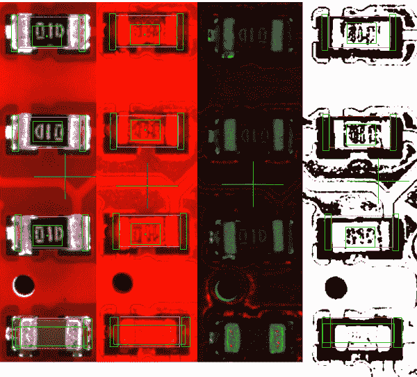](https://cdn.sparkfun.com/assets/b/8/7/3/a/52713968757b7fb9658b4568.jpg)

在右侧，我们还可以看到 AOI 生成的二进制位图图像，有助于检查良好的回流焊。二进制位图是从在红光下拍摄的图像创建的。白色像素代表板上的平点，黑色像素代表曲面。这样，裸焊盘(上面没有任何焊料)将反射红光，并显示为全白像素。该软件可以计算电路板上指定区域的白色像素，并确定是否有足够的焊料。

如果观察元件的任何一侧，可以看到只有很少的焊盘空间可供分析。大部分被元件和焊料覆盖。这使得 AOI 很难测试足够的焊料。

下一个图像是一排类似的元件，但这次它们有正确的 0603 尺寸的焊盘，并填充了 0603 零件。

[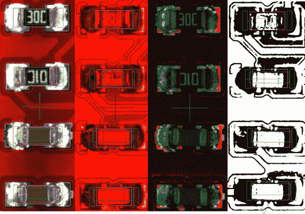](https://cdn.sparkfun.com/assets/c/9/7/0/5/5271396a757b7f4d678b4569.jpg)

请注意，从这个俯视图中可以看到更多的焊盘。我们现在可以比较白色和黑色像素的数量，并验证是否有足够的焊料。

这也有助于我们确定该部分是否有轻微的墓碑。当你得到一个墓碑时，留在焊盘上的焊料通常会枕起来，并在顶部有一个漂亮的闪亮的平点。AOI 可以在红光下寻找这个平点，并查看器件是否没有正确回流。

[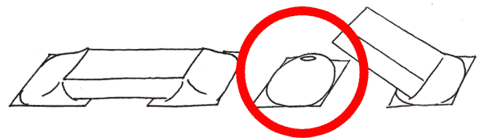](https://cdn.sparkfun.com/assets/5/3/a/a/f/5271396b757b7fcb678b4567.jpg)*On the left, a part has reflowed correctly. On the right, the part has tombstoned.*

我们最近大力修改了很多旧设计，以包含真正的 0603 足迹。我们 QC 小组的每个成员都努力每月修改至少一个设计(有时是两个！).

此外，所有未来的设计都将具有正确的焊盘尺寸。事实上，每当设计新零件的新外形时，生产质量控制团队都会积极参与。我们希望确保焊盘尺寸和形状能够促进最佳的回流焊，并且我们可以利用 AOI 来捕捉任何可能的错误。

为了尽可能地创建最佳足迹，我们最近开发了一种新技术，使用 Eagle 中组件底部的图像。如果你愿意，你可以在我们的教程[在 Eagle](https://learn.sparkfun.com/tutorials/making-custom-footprints-in-eagle) 中定制脚印中了解更多。

## 路由和伪造的痕迹

如前所述，我们开始做更多的设计修改来帮助回流。一个最近的发展是“假痕迹”的想法。当从 IC(尤其是小间距 QFN)走线时，走线作业实际上会影响焊盘尺寸/形状，并最终影响回流和圆角形成。由于 PCB 上尺寸过大的`tstop`(又名掩模切口)，焊盘尺寸实际上在走线方向上稍微扩大了一点。这里有一个例子:

[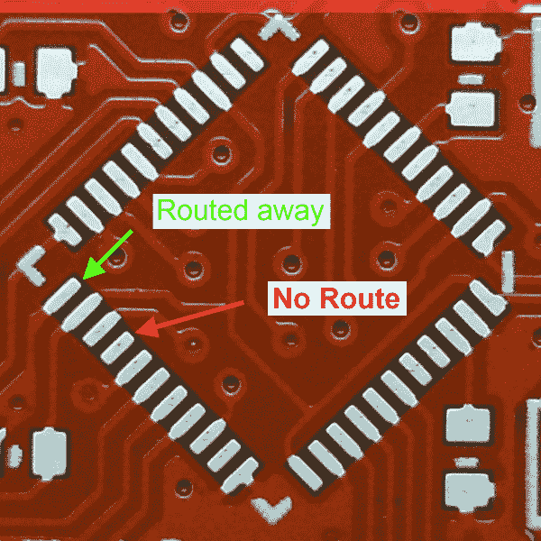](https://cdn.sparkfun.com/assets/3/3/1/a/9/5272c7ce757b7fc1698b4567.jpg)

上图是 Pro Micro 的裸 pcb。您可以看到，一些焊盘已经远离 IC 布线，一些焊盘已经在下方布线，一些焊盘根本没有任何布线。这种微小的差异会影响焊料流动的方式。

[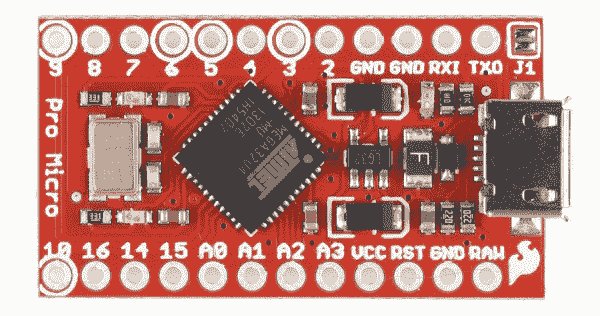](https://cdn.sparkfun.com/assets/c/6/0/8/1/52a8ab1c757b7fa8128b4567.jpg)

上面是一个填充板的图片。现在让我们更仔细地看看 IC 的左侧。

[](https://cdn.sparkfun.com/assets/d/e/a/a/d/5277d8c6757b7ff24e8b456a.jpg)

请注意每个焊盘的圆角大小和形状是如何不同的。走线的焊盘最好看！另一个额外的好处是，AOI 现在要检测的焊料量几乎是以前的两倍。

除了确保所有走线直接远离 IC，我们还从库级别着手解决这个问题。在 Eagle 6 中，您现在可以创建复杂的凸台形状。这意味着我们可以添加一点额外的顶部铜(在下面的例子中，这是一个用线工具绘制的简单线条)，Eagle 将这些额外的铜识别为焊盘的一部分。这样，电线就像一个假的痕迹！在下面的例子中，我们修改了 QFN-44 封装上的焊盘，增加了一些额外的假迹线。

[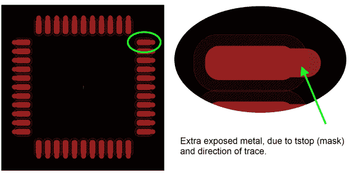](https://cdn.sparkfun.com/assets/d/8/5/0/2/5272a8b9757b7fc5758b456b.jpg)

*   进行此操作时要记住一点:焊线必须从与焊盘中心点完全相同的 X-Y 坐标开始。这一点很重要，因为它将确保您不会遇到每个焊盘的 DRC(设计规则检查)错误。

这种方法的优点在于，即使其中一个焊盘没有走线(即设计中不需要它或者它是无连接的)，它仍然具有相同的形状和焊盘尺寸与粘贴比。路由方向现已在库级别嵌入到零件中——哇哦！！

## 资源和更进一步

这些只是我们不断创新的一些例子，不仅是我们的质量控制，还有我们整个电路板设计流程。在真正的开源方式中，我们希望与您分享我们发现的帮助我们生产更好产品的每一个技巧、诀窍和技术。如果您有任何问题或意见，请随时跳到讨论区，开始对话。否则，请使用 Raspberry Pi 独立程序员查看 SparkFun 质量控制的下一步进展！

[](https://learn.sparkfun.com/tutorials/raspberry-pi-stand-alone-programmer) [### Raspberry Pi 独立程序员

#### 2018 年 3 月 8 日](https://learn.sparkfun.com/tutorials/raspberry-pi-stand-alone-programmer) This tutorial will show you how to use a headless Raspberry Pi to flash hex files onto AVR microcontrollers as a stand-alone programmer. It also tells the story about production programming challenges, how SparkFun came to this solution, and all the lessons learned along the way.[Favorited Favorite](# "Add to favorites") 12

如果你正在寻找更多关于电子组装和设计的信息，请查看其他教程。

*   [如何安装和设置 Eagle PCB 软件](https://learn.sparkfun.com/tutorials/how-to-install-and-setup-eagle)
*   [如何布局 PTH PCBs:原理图](https://learn.sparkfun.com/tutorials/using-eagle-schematic)
*   [如何布局 PTH PCBs:板布局](https://learn.sparkfun.com/tutorials/using-eagle-board-layout)
*   [创建 SMD 封装](https://learn.sparkfun.com/tutorials/designing-pcbs-smd-footprints)
*   [如何布局 SMD PCB](http://learn.sparkfun.com/tutorials/designing-pcbs-advanced-smd)
*   [在 Eagle 中制作定制脚印](https://learn.sparkfun.com/tutorials/making-custom-footprints-in-eagle)
*   [电子组件](https://learn.sparkfun.com/tutorials/electronics-assembly)