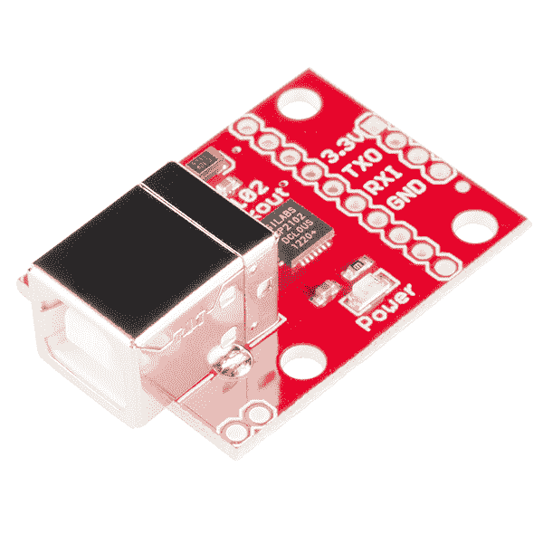

# CP2102 USB 转串行转换器连接指南

> 原文：<https://learn.sparkfun.com/tutorials/cp2102-usb-to-serial-converter-hook-up-guide>

## 概观

[CP2102 分线板](https://www.sparkfun.com/products/198)对于需要串行连接到计算机的嵌入式系统来说是一个很好的工具。该板通过一个标准 B 型母连接器连接到 USB 总线，并显示为一个标准 COM 端口。

该 IC 不需要任何外部振荡器，具有片上稳压器，并使用可重编程内部 EEPROM 来描述器件。全硬件 UART 具有 300bps 至 921600bps 波特率的流量控制。该分线点还允许您将喜爱的微控制器或串行应用的 TX/RX 引脚连接到分线点的 RX/TX 引脚，从而实现简单的串行电缆替换。

## 所需材料

您需要以下材料来完成本连接指南。