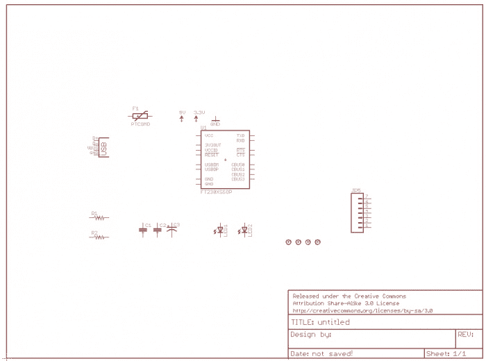
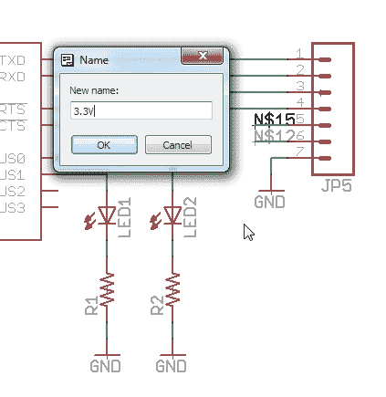
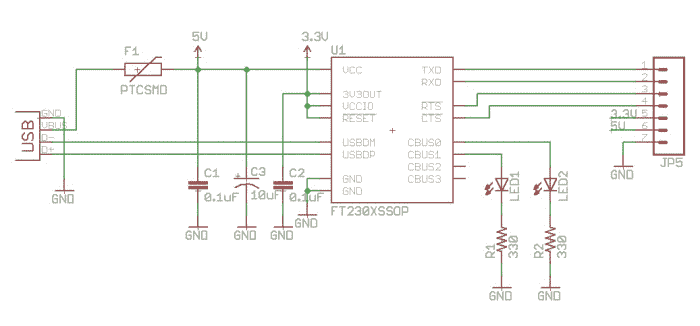
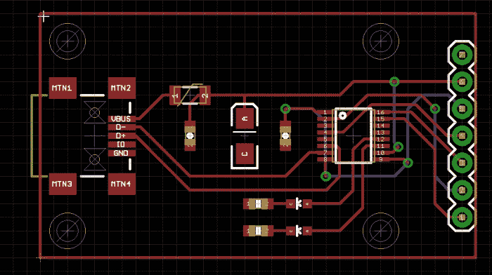
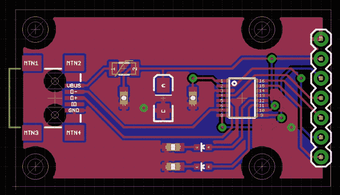

# 设计 PCB:高级 SMD

> 原文：<https://learn.sparkfun.com/tutorials/designing-pcbs-advanced-smd>

## 如何创建基于 SMD 的 PCB

本教程将带您了解更高级的 SMD 布局。这是一场马拉松，所以给自己准备一杯酒和一个带滚轮的鼠标，然后开始吧。

我们假设您已经阅读了我们关于通孔 PCB 布局的其他教程，因此您应该已经安装了 Eagle 和各种支持文件。我们大量使用键盘快捷键，所以你最好也安装它们。

让我们创建一个每个人的工具箱中都应该有的工具:USB 到串行转换器板。FT230X 是一个非常简洁的 USB 到串行转换器，应该可以很好地完成我们的工作。

我们将假设您正在使用包含 FT230X 的库。如果你想学习如何从头开始为 Eagle 创建 SMD 封装，请参见本教程。

### 推荐阅读

在开始本教程之前，您可能需要了解以下教程和概念:

*   [如何阅读原理图](https://learn.sparkfun.com/tutorials/how-to-read-a-schematic)
*   [PCB 基础知识](https://learn.sparkfun.com/tutorials/pcb-basics)
*   [如何安装和设置 Eagle PCB 软件](https://learn.sparkfun.com/tutorials/how-to-install-and-setup-eagle)
*   [如何布局 PTH PCBs:原理图](https://learn.sparkfun.com/tutorials/using-eagle-schematic)
*   [如何布局 PTH PCBs:板布局](https://learn.sparkfun.com/tutorials/using-eagle-board-layout)
*   [创建 SMD 封装](https://learn.sparkfun.com/tutorials/designing-pcbs-smd-footprints)

## 创建原理图

首先，在 Eagle 中创建新项目。右键单击项目文件夹并选择“新建项目”。将该项目称为“FT230X 突破”。右键单击文件夹并选择新建原理图。

让我们从给原理图添加一个框架开始。从 Eagle 主窗口中，导航到库文件夹。单击单词“Libraries”旁边的小箭头将其展开。然后扩展 SparkFun-Aesthetics 库(既然框架只是为了美观)。导航到框架字母组件，然后单击添加。

将框架的角放在“图解布局”窗口的角上。按两次 escape 键返回主原理图窗口。

使用滚轮放大/缩小。按住滚轮拖动示意图窗口。

现在，让我们添加本例所需的各种位:

*   来自 DigitalICs 库的 **FT230X** 组件。找到组件的最佳方法是单击任何组件，然后按“f”键，转到以“f”开头的组件。将此添加到您的原理图中。单击一次可放下该项目。按两次 escape 返回到 Eagle 主窗口。

**NOTE:** If you do not see the FT230X, the FT232RL is pretty close and can be used for purposes of this tutorial.

*   连接器库中的 **M07** 。你会想要“M07”设备。这是最常见的 7 引脚 0.1 英寸接头封装。
*   连接器库中的 **USB** 。您将需要“USBSMD”设备(它具有“USB-miniB”封装类型)。
*   美学库中的 **5V** 、 **3.3V** 、 **GND** 。
*   LED 库中的两个**LED**。你会想要 LED0603。这是小型 0603 表面贴装 LED。
*   被动库中的两个**瓶盖**。获取 CAP0603-CAP 封装。
*   被动库中的 CAP_POL 。获取 CAP_POL1206-KIT 封装。
*   无源库中的两个**电阻**。你会想要电阻 0603-RES。
*   来自 PowerIC 库的 PTC 。获取 PTCSMD 包。
*   来自机电的四个**支架**。去拿那个隔离包。

我们这里有所有的零件。现在点击 F7 进入“移动”模式。单击一个项目并四处移动它。我们的目标是数据手册中的例子。像这样排列你的组件:

当您选择并移动一个组件时，通过右键单击旋转它。左键单击将放下组件。

现在按 F9 开始将组件连接在一起。单击 USB 连接器上 D 引脚的末端，将其连接到 FT230X 上的 USBDM 引脚。再次单击引脚，电线应停止布线，表明已成功连接。

如图所示继续接线。

您可能会看到一个窗口，显示“将网络段‘N $ 4’合并到供电网络‘5V’”？或者类似的警告。答案是肯定的。

我们将需要更多的 GND 联系。按 F8 进入复印模式。点击 GND 符号，创建 8 个左右的副本。

我经常使用的一个技巧是:点击 F7 来移动 GND 符号。将它直接移动到电容器的末端，然后单击将其放下。

现在单击同一个地面符号并向下移动。老鹰会自动接上电线。这使您不必手动进行一些接线。

多装些东西。请注意 7 针连接器上 5 针和 6 针上的两根电线。这些是未命名的、未连接的网络。

按 Alt+F9 进入“标签”模式。然后左键单击一个存根。Eagle 会突出显示线路——这是它询问这是否是您想要摆弄的线路的方式。再次左键单击以确认- Eagle 将显示存根的标签。再次单击将标签锚定到存根。对第二个存根重复上述操作。

现在按 F4 进入“名字”模式。单击第一个存根。您确定要连接它们吗？是的，你是。重复上述步骤，但将第二个网络命名为 5V。

按 F5 进入“数值”模式。然后点击 R1，设置值为 330。设置以下各项的值:

*   R2 = 330
*   C1 = 0.1uF
*   C2 = 0.1uF
*   C3 = 10uF

嘿！该是你保存工作的时候了！点击 Ctrl+s 或磁盘图标。将您的工作另存为“FT230X-Breakout-v10”。这是第一个版本，所以是 1.0 版。如果要进行更改，请将文件保存为-v11、-v12 等。

看一看。这些值有点像是在电线上运行。让我们按 Alt+F7 进入'组'模式。

将光标移动到左上角。点按并按住按钮，然后拖到右下角。请注意，我们选择的是刚过 C2。

释放鼠标按钮。您应该看到一束电线和组件被选中。现在我们有了一个小组，但我们还没有告诉 Eagle 我们在这个小组里做什么。按 F7 进入“移动”模式。现在让我们移动这个组！按住 Ctl，单击鼠标右键。现在，该组将随着鼠标光标移动。

将其向左移动两次，以便 0.1uF 文本不会超出 GND 符号。

让我们在连接器附近创建标签并命名网络。这将有助于我们进行 PCB 布局。按 Alt+F9 进入标签模式。点击一根电线，鹰会突出显示它。再次单击以确认您要处理高亮显示的线。并第三次单击以在该位置放置一个标签。一旦你有四个随机标签(如 N$9，N$13 等)，然后点击 F4 和重命名电线如图所示:

*   TXO
*   RXI
*   ！即时战略游戏
*   ！同ＣARPAL TUNNEL SYNDROME

注意前面的“！”会在网名上面放一条线(工整！).

看起来相当不错！让我们开始追踪。

## PCB 布局

现在让我们点击“电路板”按钮，开始 PCB 布局！

是的，请根据原理图创建。

哇哦。整洁！使用鼠标滚轮放大和缩小。单击鼠标滚轮并移动鼠标来浏览某个区域。

现在按 F7 进入“移动”模式。开始将零件移至 PCB 的下角。

当你移动东西的时候，右击来旋转一个部件。

你会看到老鼠窝的无线更新，因为你去。注意旋转或定位元件，尽量减少电线的重叠。你不会把所有事情都弄清楚，但现在是考虑的时候了。这一阶段的合理布局将使以后的布线更加容易。定期按 F8 更新鼠窝。

我们正在到达那里。

我们现在需要缩小电路板的形状，以适应我们粗略的零件排列。你应该会看到一条白色细线组成一个大正方形。这条线位于尺寸层上，代表您的外部电路板形状。按下 F7，然后点击白线，将电路板的两边向内移动，在你的组件周围形成一个紧密的盒子。

注:USB 连接器可能会稍微悬在边缘上。

另外，看到光标附近的电路板轮廓不是“在网格上”吗？按 F7 进入“移动”模式。然后按住 Ctrl 键，同时单击尺寸线的角。

电线或组件(无论你在哪里)都会跳到网格上。这是一个让东西回到网格上的有价值的技巧。右上角和左下角重复。

好的——我们把所有的东西都打包好了。请注意以下几点:

*   在棋盘中间画一条水平线。你会注意到我已经沿着中线定位了很多组件。这比什么都更有助于美观，但也有助于一些路由。
*   不要试图将所有东西紧挨着放在一起。你最终会将这些部件焊接到电路板上，并且需要一些空间来放置烙铁和焊芯。

我们花点时间打开所有图层，看看有没有问题。单击显示，然后单击“全部”按钮，然后单击确定。

我们有几个问题。有些文本我们甚至不知道(知识共享许可！耶！).你还可以看到支架周围的红色圆环。这些环在“顶部禁止”层。它们显示了标准螺钉头部的半径。如果我们试着在分线板上放一个螺丝，它会碰到 USB 连接器！最好把东西摊开。

使用滚轮缩小。点击 F7 抓取并移动你的板下面的许可证。

记住使用 Alt+F7 组合键将东西组合在一起，然后按 F7 进入“移动”模式，再按 Ctrl+右键来移动组合。我用这个技巧同时抓住了两个支架孔和框架，使板子变得更宽。然后抓取更多的位并点击几下。

现在，按 F11 将所有层返回到它们的原始/默认查看状态。这让我们可以专注于布局。开始路由吧！我们将手动布线这块电路板，以展示更先进的布线技术。如果你愿意，欢迎使用自动路由器。

在 SparkFun，我们手工为所有东西布线。是的，一切。这是我几年前观点的转变。我们过去常常自动路由一切。这些板子可以用，但是看起来很糟糕。我们倾向于认为，我们应该努力打造一款不仅实用而且美观的主板。我有没有提到布线板就像解决一个难题？我喜欢拼图！

下面是我们将使用的主要命令的快速分类:

*   按 F9 键放置轨迹
*   按下 F9 键来撕掉一个

单击 pad VBUS 的中间。将导线拖到网格交叉点(它会捕捉到它)。再次单击以锚定追踪，然后再次单击以停止传送该追踪。

现在从 PTC 开始布线。点击“1”键盘。将轨迹拖到交叉点，然后拖到其他轨迹。您可能会听到一声悦耳的“叮”声，让您知道追踪已完成。

在 PTC 后继续该路线。请注意，它位于 FT230X 的右侧。我担心会把其他的轨迹屏蔽掉，所以我只在这里双击留下一个轨迹的存根。

GND 的无线电干扰了我。点击“I ”,然后点击 GND 线。看到底部写着“隐藏无线线路”的方框了吗？选中该框，然后单击“确定”。这将使所有的地面天线消失。稍后我们将得到多边形浇注的 GND 线。

开始攻击最容易的路线。在你看到交叉问题的地方留下存根。看看不使用过孔能走多远。我们接下来会谈到这些！

## 创建过孔

现在我们来谈谈过孔。过孔是 PCB 上的一个孔，孔内有金属，因此电路板正面的走线通过该孔与电路板背面电连接。

按 F9 进入路由模式，并在右上角寻找**钻孔**框。Eagle 中的默认过孔尺寸为 0.02362205 英寸(或者更确切地说是 0.6 毫米)。我把它改为 0.02 英寸(或者 0.5 毫米，如果你愿意的话)，然后按回车键让 Eagle 保存这个尺寸。

0.02”没什么神奇的。这是我们发现大多数 PCB 工厂可以钻的尺寸，没有太多的公差问题。它也足够小，可以用阻焊膜覆盖，使电路板看起来更好。

按 F9 键从凸台布线。当你选择路线的时候，按住 shift 键并点击鼠标左键。这将减少一个过孔，您将继续在顶层布线。现在点击鼠标中轮。这将使你下降到底层，你可以继续路由。

继续布置其他一些网络。

上面的路径可以工作，但是如果我们向下突出过孔，我们可以把蓝色的轨迹弄直一点。像这样:

吹毛求疵？绝对的。但是随着时间的推移，改变不同的路线会使整个路线更加整洁。

请注意，我将几乎所有内容都保留在 0.05 英寸的网格上。这使得布线和间距更加容易。尺寸(0.05 英寸)相当小。重要的是，所有的组件和一般的路由都保持在同一个网格上。

我们这里有两个问题。如果我们撕掉 8 到 9 的布线，两条导线可以不通过过孔布线。这两根电线也在它们自身上交叉。重新排列指示灯可以解决这个问题。

修好了。但是，您可能会注意到 FT230 上的迹线连接引脚 11 脱离了网格。布线时，按住 Alt 键可以“跳出网格”。脱离电网完全没问题，但作为一个经验法则，我会尽可能地保持在电网上。

移除 8 至 9 路径也打开了它，这样我们就可以将 D+和 D-走线直接布线到 IC。

啊！干净利落。如果我们移动一些东西，我们可以得到！不需要过孔的 CTS 布线。

这里显然有一个 DRC 错误，但我们可以在需要时修复它。我们就这样吧，以防其他事情发生变化。

现在，我需要将引脚 8 连接到引脚 1，但 Eagle 不允许我从较低的过孔开始布线，它一直希望我从引脚 8 布线。为了解决这个问题，我将撕掉过孔附近的一些走线，这样我就可以有一个起点。按 Alt+F9，然后点击一个跟踪撕了它。

我撕掉了一个小痕迹，给了我一个无线线路，我开始路由。

重新布线。请注意，我仍然有一个非常小的 airwire 需要布线。不难，按 F9，单击 airwire，再次单击，它将路由。

接下来，我们创建多边形！

## 多边形浇注

嘿！这看起来很不错。现在我们需要让 GND 溃败。让我们用多边形倒酒来做这件事。

单击多边形。

沿着空间轮廓画一个方框，左键单击每个角。

当你合上盒子时，它就会被打碎。现在点击“I ”,然后点击虚线。这将显示关于多边形的信息。

我们需要将隔离从 0 更改为 0.012”，单击“确定”。

为什么要改变 Eagle 默认的隔离层？我们有多个 PCB 制造厂，生产非常高质量的 PCB，制造出意外“溢出”到走线或焊盘上的多边形浇注。这种错误很少发生，但是我们想让 PCB 制造厂的工作更容易，而不是更难。提高隔离会将多边形从走线和焊盘上拉开一点点，让 PCB fab house 有更大的误差容限，并增加 PCB 无误差进入的机会。

现在连接多边形倒到地网，按 F4 进入'名称'模式。然后单击多边形的边。把网名改成 GND。

按下 F8 刷新鼠窝。这也会导致多边形灌注重新计算。整洁！

现在重复底部多边形倒酒。单击多边形，然后单击中间的滚轮，移动到底层。将木板装箱。将隔离更改为 0.012 英寸。按 F4。名字网到 GND。点击 F8 来刷新多边形。

耶！我们有底部和顶部多边形连接到 GND。请注意窗口左下角的注释。" Ratsnest: 2 airwires(隐藏:2 GND)"。啊哦。看来我们还有一些事情要联系起来。让我们重新打开 GND 无线网。单击“I”，然后单击多边形的边。取消选中“Airwires hidden ”,然后单击“ok”。

没错。这是个问题。让我们创建一个 GND 通孔来连接各个 GND 岛到下层多边形。

点击菜单上的“via”按钮，将 Via 放入需要连接的 GND 岛。这个通道还没有连接到 GND——它还没有命名。所以按下 F4，然后再次点选 via。把它命名为“GND”。现在点击 F8 获得最新更新。整洁！一根电线不见了。

既然我们有一个好的 GND 通孔，我们可以复制它。单击“copy”按钮，然后单击我们刚刚创建的 GND。你会看到一个随光标移动的过孔。将它移向棋盘右端的 GND 岛。放下通孔。按 escape 键退出复制模式。点击 F8 刷新记录。

耶！Ratsnest 无事可做！我们已经成功地安排了所有的线路。接下来，我们需要在板上标记所有的东西。

## 添加标签

Eagle 的默认 DRC 规则在某些方面有点过于保守，而在另一些方面则非常糟糕。让我们加载位于[这里](https://github.com/sparkfun/SparkFun_Eagle_Settings)的 SparkFun 2 层标准 dru 文件。对于此板，我们将使用点击 DRC 按钮，然后加载。

双击 SparkFun.dru 文件，然后在 DRC 主窗口中单击“选择”。它应该会消失。

什么？看起来一样。但是等等！点击 F8 做一个最新的刷新。这样看起来好一点！SparkFun DRU 文件将铜层和尺寸层(电路板的边界)之间的空间从 40 密耳减少到 10 密耳。

所有这些通孔*都应该*工作，但是它们非常粗糙。SparkFun 设计规则文件增加了过孔周围环形圈的尺寸。这给了 PCB fab houses 一个更大的环来钻透中间，从而降低了电路板制造错误的几率。

现在，让我们将电路板轮廓的宽度从 0 英寸增加到 0.008 英寸。我们这样做是为了让 DRC(设计规则检查器)有机会告诉我们是否有任何东西太靠近电路板边缘。当 PCB 工厂将电路板分开时，他们使用非常精确的铣床，但我们假设他们并不完美。我们使用电路板轮廓的宽度来提供额外的安全性。

要更改纸板边缘的宽度，请单击扳手，然后单击宽度，然后单击“...”。输入“0.008”，然后单击纸板边缘。它可能会突出显示多边形倒。要解决这个问题，右键单击堆栈中的下一个东西会高亮显示-它可能是另一个多边形，所以再次右键单击。最后，应突出显示构成电路板轮廓的白线。很好-现在左键单击以应用宽度更改。现在对另外三面也这样做。

现在是时候给*一切贴上标签*了！点击“文本”按钮。将弹出一个窗口，输入“TX”。

然后在底层会有文字。不好。单击鼠标中轮并选择“放置”。tPlace 上的任何东西都会被印成丝绸。按住 alt 键，将 TX 标签放在 TX LED 旁边。

按 escape 键将会把你带回文本输入窗口。键入“RX”并在另一个 LED 旁边添加标签。

看 TX 和 RX 的 X 是怎么平分的？我喜欢文本居中。我把这些标签扔了下来，但我真的不知道哪个 LED 是哪个。让我们参考 FT230X 数据手册:

好的，CBUS1 是 RX LED，CBUS2 是 TX LED。让我们来看看我们的原理图:

哦不！我接线错了。让我们删除这两条导线(按 F3，然后单击要删除的导线)，将 LED/电阻器/GND 分组(alt+F7，然后选择，然后 F7)，将它们向下移动(ctrl +右键)，然后添加回导线(F9)。

让我们也标记网络，这样我们就可以在我们的布局上知道哪个是哪个。Alt+F9 然后单击导线以添加标签。再次单击将标签锚定到导线上。F4 将导线重命名为 RXLED(在 CBUS1 引脚上)。对 CBUS2 线标签重复上述步骤。

确定已修复。让我们回到我们的布局。

我们有一些串线。撕掉那里的痕迹，用 alt-F7 组命令交换 LED 的位置，然后重新布线。

改道了。现在按 F12 来“显示”轨迹名称，并单击一个轨迹。你会在鹰窗口的左下角看到网名。“TXLED”现在标签正确。

多复制几次 TX 标签。按 F12 键并单击每条迹线，找出那里有什么(还记得我们在原理图上命名的网络吗？这里是回报的地方)。然后做一个“改变”扳手->文本，并改变每个标签，每个引脚实际上是什么。

文字大小对你的口味来说是不是有点大？你也可以用扳手来改变尺寸。我们倾向于使用 0.05 英寸或更大的尺寸，这样文本更容易阅读。

**记住:**PCB 工厂的能力是有限的。我们发现任何小于 0.04 英寸的物体都会变成一团不可读的白色斑点。

现在做一些标签居中。看到标签中间的那些通孔了吗？用户可能能够阅读标签，但让我们移动两个过孔，使标签不被破坏。

没有必要将过孔从文本中移走吗？我认为这是必要的。如果你知道如何把它挂起来，这块板才有价值。我说的不是接下来的一两周，我说的是当你用头灯在梯子上焊接时，你不知道该把传感器焊接到哪个位置...清晰的标签决定一个项目的成败。

我对这个布局很满意。让我们添加一些收尾工作。因为我们是 SparkFun，我们把我们的标志扔在所有东西上。我们也是开源硬件倡议的大力支持者。从美学库中，让我们添加两个标志-SFE 和一个 OSHW 标志。

我有时不得不在 tDocu 层上添加一些线条来显示我在板上的中心点。我用手画出这些，然后在我用它们来居中一个标志或文字标签时，把它们去掉。

这是板的 1.0 版，所以在板的底部添加铜制文本。点击 F8 鼠标刷新，并查看底部铜文本。

现在做一些理智检查。我已经打开了所有的层，以确保通孔将被帐篷(覆盖了阻焊膜)。您可以在截图中看到，大多数 SMD 焊盘和电路板末端的 0.1 英寸大连接器上有白色散列标记。然而，较小的过孔没有这些散列标记。DRC 规则被设置(参见 DRC 下的掩模选项卡)以掩模任何 0.020”或更小的孔。我增加了一个更大的过孔来说明这一点。这个较大的通孔将被暴露。

在一些情况下，我们会暴露一两个通孔——通常是为了测试点。我们使用弹簧加载的[弹簧针](https://www.sparkfun.com/products/8870)来接触电路板上的那个点，以便我们可以更容易地测试电路板。但一般来说，出于美观原因，SparkFun 板上的所有过孔都被掩盖起来。

最后，我们将设计师的名字添加到 PCB 和原理图上。这是为了在设计被重用或修改时维护属性。如果有支持问题，知道该和谁谈也很好。

## 设计规则检查

是时候在板上运行 DRC 了，以确保我们没有犯任何电气或机械错误。让我们通过按 F11 关闭额外的层，并点击 DRC 按钮，然后“检查”。

嗯（表示踌躇等）...我们有一些错误。这个尺寸误差是因为连接器的圆环太靠近板的边缘。还记得我们增加电路板轮廓的宽度吗？正因为如此，这个问题被提了出来。这里的风险是，当板被铣出时，它可能会划伤这个连接器的环形圈。SparkFun 的一般政策是，这是可以的，0.01 英寸连接器上的这种错误可以忽略。在极少数情况下，如果戒指被划破，连接和信号将会保留。点击所有尺寸错误的“批准”。

这是一个有效的错误！看起来好像是我在布线那条非常小的 airwire 时，不小心创建了两个过孔，一个在另一个上面。要解决这个问题，让我们按 alt+F9，然后点击过孔，看看我们是否可以删除一个。

我们已经移除了过孔，但是 Eagle 试图告诉我们(用一个大 X)仍然有问题。点击 F8 ratsnest 刷新没有帮助，所以我要撕掉这些痕迹，并重新路由。

我撕掉了那些痕迹，然后改变了路线。然后我重新运行了 DRC，Eagle 现在很高兴。错误已清除。

这是 Eagle 试图告诉我们这个文本的迹线宽度太窄。通常，工厂不希望走线薄于 8 密耳(0.008 英寸)。这篇文章违反了这一点。显然，我们和 fab house 并不关心这些痕迹是否被破坏，因为‘1.0’是为了信息目的，而不是为了信号。但纠正这一点的真正方法是增加文本比例，使轨迹大于 8mil。点击“I”按钮，点击文本，将“比率”增加到 20%。重新运行 DRC，错误应该会清除。

好的。我们接近终点线了。击中 F8，确保没有剩余的无线线路。最后一次运行 DRC 以确保没有 DRC 错误。

我经常关掉除了顶层以外的所有东西，查看跟踪路由。有没有做什么真正傻事的痕迹？然后我对底层做同样的操作。

## 格柏一代

这样布局就完成了！现在让我们生成一些 gerbers，并得到这个板！点击 F11 打开所有的标准图层，然后点击 CAM。如果你没有 SparkFun cam 文件，[在这里](//cdn.sparkfun.com/assets/9/e/a/3/1/50d4c519ce395f9056000000.cam)获取它，并把它放在你的 Eagle\cam 目录中，或者，我建议你把这个 CAM 文件放在一个 [Dropbox](http://www.dropbox.com/) 文件夹中，这样你就可以在不同版本的 Eagle 和不同的计算机之间使用相同的 CAM 文件。

在 CAM 窗口中，点击文件->打开并找到 sfe-gerb274X 文件。打开 sfe-gerb274x.cam 后，点击“处理作业”。将弹出几个窗口，然后关闭。现在去看看包含 FT230X-Breakout 的文件夹:

*。brd 和*。sch 文件是主要的 Eagle 文件。如果你想在网上发布或与朋友分享你的设计，这是你需要压缩并发送的两个文件。

所有以*结尾的文件。b#1，。乙#2，。s#1，。s#5 等都是备份。每次保存原理图或 board Eagle 都会创建一个新的 b#_ 文件，并将之前的 brd 文件保存到其中。如果您需要恢复到您正在处理的版本，这很方便。

*。gpi(通用光电绘图仪信息)和*。PCB 制造厂通常不需要 dri(钻孔信息)。

您需要获取的主要 gerber 文件:

*   *.GBL 底部铜层
*   *.GBO -底部覆盖(丝网印刷)
*   *.GBS 底部阻焊膜
*   *.GTL 顶部铜层
*   *.GTO 顶部覆盖层(丝网印刷)
*   *。几何和拓扑结构
*   *.TXT - Drill 文件(坐标信息)

注意此列表中没有维度文件。使用我们的 CAM 文件将尺寸层导出到顶层铜层。你的 fab house 可能可以用这个工作，但可能想要一些不同的东西。

你可能会看到一个*。GTP 档案。这是最上面的粘贴层。在 SparkFun，我们使用这一层有一个粘贴模板切割。如果你运行 3 或 4 个以上的电路板，模板焊膏和 SMD 回流是非常有用的。您完全可以在没有大型昂贵设备的情况下进行印刷电路板的模板制作、制作和回流焊。你甚至可以在家切割模板。

选择 gerber 文件和 drill 文件，共 7 个。通过单击第一个文件，然后按住 Ctrl 键，再单击其他每个文件来完成此操作。在 Windows 7 下点击右键，你可以发送到一个 zip 文件。用你最习惯的方式把它们合在一起。

我最近才发现 www.gerber-viewer.com。他们有一个很好的界面来检查你的 gerber 文件。我强烈建议您在发送它们之前使用独立于 Eagle 的 gerber 浏览器。

手里拿着你的 gerber 文件，给你最喜欢的 PCB 工厂发电子邮件。大多数 fab houses 设置为:

*   丝印一面
*   绿色阻焊膜
*   白色丝网印刷
*   1.6 毫米厚的 FR4 PCB

几乎所有的 PCB 都有这些规格，但是做更好的 PCB 越来越便宜了。[我们所有的产品](http://www.sparkfun.com/categories/20)都是用红色阻焊膜制作，两面都有丝印。我们的 [LilyPad](http://www.sparkfun.com/categories/135) 线 0.8 毫米厚，带紫色阻焊膜。如果你只是做原型，坚持使用标准设置。如果你正在进行生产，发挥你的创造力！

现在去玩一些传送门 2，而你等待你的 PCB 回来。制造多氯联苯可能需要几天到几周的时间。

## 资源和更进一步

我们希望您喜欢阅读这篇关于如何进行基于 SMD 的 PCB 布局的教程！现在，您已经知道如何对 SMD PCBs 进行布局布线，下面是一些您可能喜欢阅读的主题:

*   [连接器基础知识](https://learn.sparkfun.com/tutorials/connector-basics)
*   SMD 焊接
*   模版印刷和回流
*   [创建 SMD 封装](https://learn.sparkfun.com/tutorials/designing-pcbs-smd-footprints)
*   [电子组件](https://learn.sparkfun.com/tutorials/electronics-assembly)

如果你想与世界分享你的 PCB 作品，看看这些教程:

*   [使用 GitHub](https://learn.sparkfun.com/tutorials/using-github)
*   [使用 GitHub 与 SparkFun 分享](https://learn.sparkfun.com/tutorials/using-github-to-share-with-sparkfun)