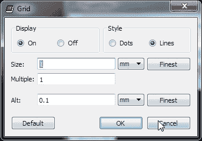
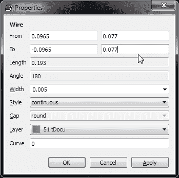
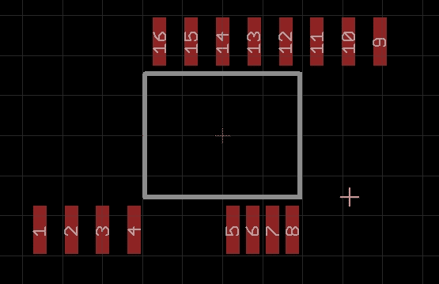
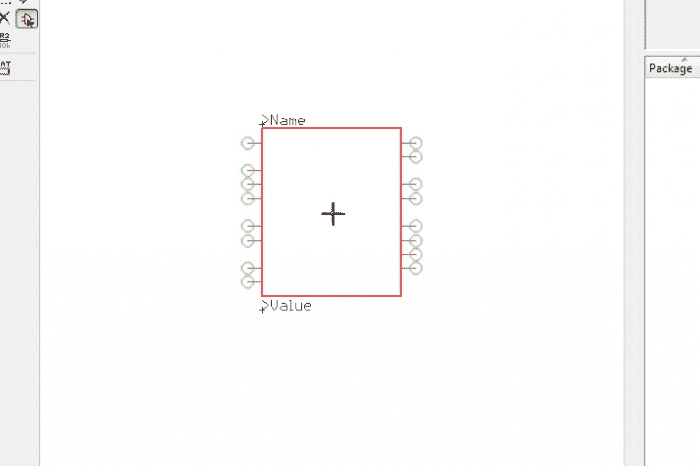
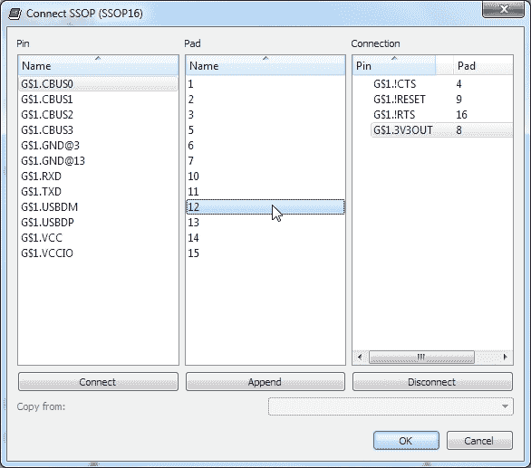

# 设计 PCB:SMD 尺寸

> 原文：<https://learn.sparkfun.com/tutorials/designing-pcbs-smd-footprints>

## 入门指南

如果你急切地阅读本教程，你会对 Eagle 有很深的了解。恭喜你！继续前进！

我们假设您已经阅读了我们关于通孔和 SMD PCB 布局的其他教程，因此您应该已经安装了 Eagle 和各种支持文件。我们大量使用键盘快捷键，所以你最好也安装它们。

本教程将向您展示如何创建自定义 SMD 封装外形和原理图符号库。对于任何想要通过 SMD 模块或新的 SMD ICs 获得最新技术的黑客来说，这是一项至关重要的技能。

*SMD ICs are incredibly small. Learning how to make footprints that work with these tiny part is a crucial skill.*

### 推荐阅读

以下是本教程所基于的一些概念，您可能需要了解这些概念:

*   [PCB 基础知识](https://learn.sparkfun.com/tutorials/pcb-basics)
*   [如何阅读原理图](https://learn.sparkfun.com/tutorials/how-to-read-a-schematic)
*   [如何安装和设置 Eagle PCB 软件](https://learn.sparkfun.com/tutorials/how-to-install-and-setup-eagle)
*   [如何布局 PTH PCBs:原理图](https://learn.sparkfun.com/tutorials/using-eagle-schematic)
*   [如何布局 PTH PCBs:板布局](https://learn.sparkfun.com/tutorials/using-eagle-board-layout)
*   [如何布局 SMD PCB](http://learn.sparkfun.com/tutorials/designing-pcbs-advanced-smd)

## 选择零件

随着新 ic 的出现，世界上的 PCB 布局软件在其组件库中将没有该特定部件。例如，鹰可能有一个给定的足迹(SOIC 8 或 QFN 24)，但我不会相信它。我在有错误足迹的 PCB 上损失了很多钱，以至于我不使用内置的库，Eagle 或其他。有时我会使用朋友的图书馆，但我们都会犯错误(实际上我欠大卫·梅利斯一杯啤酒，因为他弄坏了他的一块电路板，因为他依赖于我们的足迹)。不要相信任何人或任何人的图书馆没有一对一的打印和彻底审查的数据手册和引脚映射。

FTDI 的 FT230X 看起来像一款有趣的新 IC。让我们为它做一个分线板。在开始电路板布局之前，我们需要创建一个全新的封装(在 Eagle 中也称为“封装”)、原理图符号和器件，然后才能开始 PCB 布局。

换句话说:

footprint + schematic symbol = thing I can use

或者用鹰的语言

package + symbol = device

* * *

既然我们已经选择了一个零件，让我们为它留下足迹吧！

## 足迹创建

Eagle 需要三样东西才能让 IC 进入图书馆:

*   封装(也称为封装)
*   符号(示意符号)
*   设备(将它们映射在一起)

教程图像向我们展示了如何从 SparkFun-DigitalIC.lbr 文件开始工作，但是如果您愿意，您也可以创建自己的自定义库文件。

我们将从头开始创建足迹。因为 FT230X 是数字 IC，所以我们来打开 SparkFun-DigitalIC 库。

我们有一个干净的石板！点击“包装”

现在调出 FT230X 的[数据表](http://www.ftdichip.com/Support/Documents/DataSheets/ICs/DS_FT230X.pdf)，浏览封装描述。该 IC 采用 SSOP16 封装，有 16 个引脚。维基百科有一些关于 T2 SSOP T3 芯片的好信息。出于我们的目的，我们只需要将一个简短的包标识符放入 Eagle。

在 Eagle footprint 列表中，单击此窗口中的任何一个 footprint，然后按“s”。这将把您带到以字母 s 开头的包。现在您有机会查看您将要创建的包是否已经可用。在我们的例子中，“SSOP20”可用，但 ssop 16(16 的衍生物)不可用。

要创建新的包，请在“新建:”框中键入名称 **SSOP16** 。这符合与 SSOP20 包相同的命名结构。

您的库中是否已经有 SSOP16？(看看你，你有最新的图书馆！)继续吧，把这个叫做“SSOP16-PRACTICE”或你以后能找到的类似名字。

现在我们有一个什么都没有的黑色窗口。从数据表上看，这款 IC 宽 *E1* (0.154”)，长 *D* (0.193”)。现在，让我们在 tDocu(顶部文档)层创建一个正方形。点击“电线”。

我们现在可以画画了，但是我们需要到达 tDocu 层。为此，您可以下拉图层菜单并选择图层 *51 tDocu* 或...

单击鼠标的中央按钮/滚轮。我更喜欢用滚轮来选择图层，因为我经常跳到不同的图层。你会看到很多不同的层次。找到图层 51 并单击它。

画一个盒子。按 escape 键停止绘制。这不是真正的集成电路的形状。为了得到准确的形状，让我们再看一下 IC 的尺寸。宽 0.154 英寸，长 0.193 英寸。每个制造商都会有不同的公差。提供标称尺寸时，使用标称尺寸。如果你只有最小和最大尺寸，我将使用它们之间的中点。

在 Eagle 中，我们希望组件的 0，0 位于组件的中心。因此，如果 X 维度是 0.193，盒子的左侧将是-0.0965，右侧将是 0.0965。让我们修改左侧和右侧在这些 X 位置。

单击“I”按钮，然后通过左键单击选择左侧灰色栏。我们现在正在修改这条线的起点和终点的 X 和 Y 坐标。注意，在这幅图中由线是-3，2 到-3，-3。我走错格子了！我在公制网格上，但是我们的尺寸是英制的。这是一个常见的问题，你会经常在不同的网格类型之间切换。

要在网格类型之间切换，退出任何窗口，然后按 **F10** 选择标准英制网格，按 **Alt+F10** 选择公制网格。

要改变网格到真正狂野的东西，点击菜单栏左上角的网格按钮。在这里，您可以修改许多不同的设置。总的来说，我们坚持:

*   0.05 英寸尺寸，英制网格有 0.005 英寸的替代尺寸
*   1 毫米尺寸，公制网格有 0.1 毫米的替代尺寸

再次，学习 **F10** 和 **Alt+F10** 快捷键。他们会为你节省很多时间。

关闭此窗口，点击 **F10** 切换到英制网格。现在点击“I ”,然后左键点击我们画的方框的左边。

我们的长度看起来很奇怪，因为这条线是用公制绘制的，现在正被转换成英制。让我们将其修改为-0.0965”。

对 0.0965 英寸的右栏重复上述步骤。

哇哦。这个 IC 越来越小了！

现在，让我们将顶部栏和底部栏修改为 0.154" / 2 = 0.077 "

啊！我们现在有了这个 SSOP 方案的实体轮廓。很小！

是时候保存你的工作了。点击磁盘图标或点击 **Ctrl+s** 。

处理 IC 尺寸时，手边要有一个计算器，准备好公制和英制之间的转换(我很懒，用[谷歌](https://www.google.com/search?hl=en&q=0.041in+in+mm))。如果您没有适合您器件的数据手册，请不要着急！将零件拿在手中，拿出你的[数字卡尺](http://www.sparkfun.com/products/10997)并开始测量。我们已经创建了许多没有数据手册的器件。

现在，我们需要在这个轮廓周围添加 SMD 焊盘。根据数据手册，每个焊盘:

*   0.041 英寸长:(*尺寸 E* - *尺寸 E1* ) / 2
*   0.01 英寸宽:*尺寸 b*

点击 Smd(加油鹰！是**贴片**不是**贴片**！).你会有一个红色的矩形浮动。现在进入 *Smd:* 框，输入 0.041x0.01

现在等等！我们制作了一个正好和大头针一样大的垫子。我们实际上需要一个比引脚略长、略宽的焊盘，以便在引脚和焊盘周围填充焊料。我有时会在每个方向增加 10-20%。这里没有硬性规定。我们经常会找到类似尺寸的推荐尺寸数据手册。在本例中，我将查看数字 ICs 库中包含的 SSOP20 尺寸，并使用该元件的焊盘尺寸。我知道 SSOP20 工作良好(我们已经多次使用旧的 FT232 IC ),所以我相信该焊盘尺寸。

点击 Eagle 窗口顶部菜单中的 *Package* 按钮，然后滚动至 SSOP20。

单击“我”(不是眼球)，然后单击一个 pad。确保突出显示红色焊盘，而不是白色焊盘。如果突出显示了错误的面板，右键单击和 Eagle 将循环显示堆叠在一起的项目。

0.01574803 x 0.05905512？！？那是什么鬼东西？记住，我们在帝国的网格上。让我们关闭这个窗口，点击 **Alt+F10** 切换到公制网格。您应该会看到网格的大小发生了变化。现在点击同一个面板。如果白色块突出显示，请按 escape 键(关闭面板信息窗口)并尝试单击红色面板更中心的位置。

0.4 x 1.5 -啊哈！这更有意义。凸台是在公制网格上创建的。让我们为我们的组件做同样的事情。记住这个值。

在我们离开这个包之前，让我们来谈谈 tDocu 层，以及为什么在红色方块的上面有一个白色方块。还记得我们说过需要创建一个比引脚大的焊盘吗？创建这个包的人创建了一个白色方块来指示顶部文档层(tDocu)上的*实际*引脚和使用 Smd 按钮的实际电垫。这使得工程师可以看到引脚的确切位置以及 SMD 焊盘的下方位置。这个白色的便笺簿真的只是帮助我们想象正在发生的一切。另请注意，红色焊盘与白色正方形不同心(不共享同一个中心点)。

(成角度的垫上的销的图片)

这是因为只有一部分销碰到衬垫。这是数据表上的尺寸 L :

这些都是为这个设备创建 pad 的非常小的细节。对于您自己的 SMD 封装，请记住:

1.  创建一个比引脚尺寸稍大的 SMD 焊盘
2.  定位焊盘，使其靠近金属引脚的中心

好了，现在让我们回到我们正在创建的新 SSOP16 封装。单击顶部 Eagle 菜单中的“Package”按钮，向下滚动到 SSOP16 包并双击它。你现在应该看到我们创建的白盒。

单击 SMD 并创建一个 0.4x1.5 的焊盘

在封装轮廓周围放置 16 个焊盘(这是一个 16 引脚器件)。

让我们按照数据手册中的标注将焊盘重命名为“1”、“2”等(引脚编号以逆时针方式环绕器件)。

按下 **F4** 进入*名字*模式(或点击名字按钮)。然后点击左下角的 pad。将此焊盘重命名为“1”。转到下一个凸台，将其命名为 2，依此类推。

完成了。你可能会想，你应该根据它们的实际功能来命名 pads 是 *TX* ，2 是 *RTS#* ，等等)。这是不正确的。我们正在制作一个通用的 SSOP16 包。稍后，我们将引脚功能与焊盘编号相关联。现在，只要确保引脚编号正确即可。连接器的编号通常与 IC 不同，因此请仔细阅读数据手册。

回到数据表，看 *e* 尺寸(小 E，不是大 E)。这是引脚之间的距离，也称为引脚**间距**。对于此 IC，间距为 0.025 英寸。

每侧有 8 个引脚，因此我将从下排焊盘开始，将焊盘 5 设置为+0.0125”(0.025 的 1/2)。点击“I”按钮，然后点击 Pad 5。将 X 位置调整为 0.0125，然后单击“确定”。

焊盘 6 将为 0.0125 + 0.025 = 0.0375”。垫 7 将在 0.0625，等等。对垫片 5 至 8 重复上述步骤。

整洁！那些垫子离得很近，但是看起来它们之间的距离是合理的。

现在对焊盘 1 至 4 进行同样的操作。衬垫 4 将为 0.025 = -0.0125 英寸。Pad 3 会是-0.0125 - 0.025 = -0.0375 等等。

现在你应该有正确的 X 坐标底部垫。现在，利用对称性，我们可以使用相同的 X 坐标，并做垫 9 至 16。单击每个面板(我从 16 个开始，然后向右移动)并调整 X 坐标。

All right! This is starting to look like a footprint!

现在我们需要计算并调整所有凸台的 Y 坐标。这有点棘手，但请将数据手册放在面前，并按照说明进行操作:

我们希望 SMD 焊盘位于器件引脚(金属引脚)的中心下方。我们想找出从 IC 中心到金属腿中心的距离。我们可以从**尺寸 E** (0.236”)和**尺寸 L** (最大 0.05 -最小 0.016 / 2 = 0.033)来推断这一点。

从 IC 中心到金属引脚外缘的距离为 E/2 (0.236 / 2 = 0.118”)。

然后我们需要返回金属腿的宽度，即 L / 2 (0.033 / 2 = 0.0165”)。

所以 0.118 - 0.0165 = 0.1015”。从零件中心到每个金属腿中间的距离为 0.1015 英寸。

这是顶行(16 到 9)上所有焊盘的 Y 坐标。让我们通过点击“I”来调整它们，然后在每个面板上，将 Y 坐标校正为 0.1015 英寸。

顶行已调整。这看起来很不错。让我们把最下面一排也带上来。

是时候保存您的工作了！点击磁盘图标或点击 **Ctrl+s** 。

现在让我们检查一下我们的工作。我们知道腿的外部尺寸是 E (0.236”)，所以让我们在 tDocu 上画一条线。点击“wire”按钮，画一条几格长的线:

按 escape 键停止绘制。现在修改这条线的 Y 坐标为 0.118 到-0.118。这条线现在代表实际 IC 上引脚的外部边缘。按 F7 进入“移动”模式。然后点击你刚刚创建的线。现在你应该可以移动这条线了。

这条线将在主网格上跳跃。要转到备用网格，请在移动鼠标的同时按住“alt”键。现在，线条应该会随着更精细的调整而移动。

我们用这条线作为一个测量棒，看看引脚的边缘会落在垫。它看起来像引脚的边缘将下降到垫的中间吗？没错。在我看来相当不错。将线移到旁边的某个地方，单击一次将其放在那里。现在点击 **F3** 进入“删除”模式，点击该行将其删除。

让我们通过单击“圆形”按钮添加一个 pin 1 指示器。我们最后一次绘制任何东西是在 *tDocu* 层。我们希望该指示器出现在 PCB 的丝网印刷中，以便我们知道如何在电路板上定位 IC。所以在我们开始绘图之前，点击鼠标滚轮打开图层窗口并选择*t 位置*(顶部位置是 PCB 上的丝印图层)。

现在将光标移动到左下角靠近引脚 1 的位置，并单击一次。搞什么？！老鹰正试图捕捉到主网格。那很糟糕。按 escape 键取消此绘图。你应该还在圈子模式。按住 alt 键，将光标移动到您想要的圆心位置，单击一次，然后移动鼠标光标。

啊哈！圆圈现在大概在我们想要的位置。请注意， *tPlace* 层(将被印刷)看起来与 *tDocu* 层(仅用于参考，不会被印刷在 PCB 上)颜色相同。扑朔迷离！所以让我们通过修改图层颜色来解决这个问题。点击“I”按钮下左侧菜单栏中的“显示”按钮。

这里我们看到许多层。我将删除层*路由 2* 到*路由 15* ，因为我从未创建过具有内部层的封装外形。如果你是超级用户，你可能想离开他们。

双击*t 位置*。然后点击**颜色**旁边的灰色方块。把颜色改成白色。单击确定返回到层窗口。

现在让我们改变 *tDocu* 的颜色。把它改成柔和的黄色。

啊！这更容易想象发生了什么。白色将被丝网印刷。黄色就在那里，所以我们知道 IC 边缘在哪里。我更喜欢在我的 PCB 上有一个白盒来指示 IC 的位置，所以让我们在 tPlace 层上画一些线。

这里我做了一个白盒，比 tDocu 线稍微长一点，也稍微细一点。这可以防止我将任何东西放在离 IC 末端太近的地方，以免碰到附近的元件。但是，这有一个问题。丝网印刷的厚度应该为 0.008 英寸或更大，以便 PCB 工厂可以清晰地印刷。试图印刷太小的丝网会导致线条剥落，文字变成白色斑点。

因此，让我们通过单击“更改”扳手，然后单击“宽度”，再单击“...”，将丝印宽度修改为 0.008”在名单的最后。你会看到一个窗口，你可以输入自己的宽度。输入“0.008”并按回车键。你点击的任何一条线现在都会变成 0.008”

点击每条白线增加其厚度。同时点击引脚 1 指示器圆圈。这个圆现在有点接近边缘了，让我们把它向上移动一点。通过点击 F7 进入移动模式。点击圆圈的中间。它会想捕捉到主要的网格，所以按住 alt 的同时，你移动圆，它会给你更好的位置。

This is looking pretty good!

最后要做的是分别在 *tValues* 和 *tNames* 图层上添加一个“值”和“名称”文本标签。当您处于 PCB 布局模式时，Eagle 会查找这些特殊标签，并用 IC 的值和名称填充它们。最终，我们会看到“FT230X”和“U3”会自动填充到这里。

点击“文本”按钮。Eagle 将提示您输入文本。键入 **>值**并按回车键。在放置文本之前，点击你的滚轮并选择*图层。*

当你四处移动时，你会发现这个文本有点大，所以我将把大小改为 0.025。在顶部菜单栏中找到**尺寸**框。键入 0.025，然后按 enter 键。

现在按住 alt 键将文本放在 IC 的中间(以获得更细的网格)。一旦你满意了，单击鼠标左键放置文本。点击退出。你将返回到“输入文本”窗口。再次按 escape 键返回主窗口。现在重复这个过程，但是这次用> Name，并把它放在 *tNames* 层。

看起来真不错！一定要给你的包裹一些描述。点击屏幕底部的蓝色“描述”行即可。Eagle 将弹出一个窗口，允许您编辑该包的描述。

HTML tags are allowed but not required.

我喜欢放一些关于这个包的组件的信息。在我们的例子中，我们为 FT230X 设计了这种封装，但它也可以用于其它 SSOP16 尺寸的 IC。我还想提一下这是一个新的/未测试的足迹，还是已经过全面测试。这样做的问题是，我经常忘记回来更新包描述，所以做你想做的。保存您的工作！

恭喜你！您已经完成了 SSOP16 包的创建！现在让我们创建原理图符号。

## 符号创建

Eagle 需要三样东西才能让 IC 进入图书馆:

*   封装(也称为封装)
*   符号(示意符号)
*   设备(将它们映射在一起)

教程图像向我们展示了如何从 SparkFun-DigitalIC.lbr 文件开始工作，但是如果您愿意，您也可以创建自己的自定义库文件。

是时候创建原理图符号了。点击“符号”按钮。

现在给这个符号起个名字。我们正在为 FT230X 创建原理图元件，我们看到没有另一个具有该名称的符号，所以让我们使用它！

首先点击“电线”并画一个方框。按 escape 键停止绘制。

FT230X 有多少个功能引脚？我问的是“功能”引脚，因为有些 IC 的引脚没有标记或标记为 NC(未连接)。我通常不会在我的原理图符号上显示 NC 管脚，因为它们会使事情变得混乱。对于 FT230X，所有 16 个引脚都有一个功能。

您会在左侧菜单中找到“pin”按钮。点击它。

一旦你进入“锁定”模式，你会在屏幕上方看到一个不同的菜单。单击“短”以缩短此大头针指示器的长度。我这样做是为了节省空间。现在在盒子周围放 16 个大头针。

是时候保存您的工作了！打盘或者 **Ctrl+s** 。

这是一个丑陋的示意符号。现在让我们为每个引脚命名。按下 **F4** 进入命名模式，然后点击第一个引脚 P$1。

我将从 VCC 列表的顶部开始，沿着数据手册列表往下，这样就不会遗漏任何一个。请注意，有两个 GND 引脚(3 和 13)，因此使用该名称制作两个引脚。

哦不！不能用相同的名称命名两个管脚。为了绕过这个鹰，你可以用@符号来命名图钉。所以把第一个 GND 别针命名为 GND@3(意思是 GND 别针在 3 号针)。另一个是 13 岁的 GND。当我们将原理图符号映射到封装上的焊盘时，您会看到这一点发挥作用。

reset 引脚被命名为 RESET#，是“低电平有效”的缩写。换句话说，当引脚被拉低时，IC 复位。

老鹰乐队的一个把戏:如果我们放一个“！”在引脚名称之前，它会在引脚上加一条线(引脚名称上加一条线是另一种表示低电平有效的简写方式)。这对整个器件或布局没有任何影响，只是看起来不错，并帮助我们记住此引脚是一个低电平有效引脚。对 RTS 和 CTS 进行同样的操作。

我们现在已经给我们的大头针贴上标签了。

现在我们可以定义每种引脚类型。压水堆对 VCC 和 GND 很好。您还可以定义输入和输出。如有疑问，我会将 pin 保留为默认“io”。

现在大头针有了方向。这些标志可以帮助 DRC(设计规则检查)和 ERC(电气规则检查)检测您的电路板的潜在问题。例如，一个输出通常不与另一个输出相连，因此如果 ERC 检测到连接在一起的输出引脚，它会发出警告。

现在点击 F7 按钮进入“移动”模式。我喜欢将电源和配置引脚安排在符号的左侧，将用户可访问的引脚安排在右侧。

我选择这种配置有几个原因:

*   Reset 通常与 3V3OUT 高电平相连，因此我将它们放在彼此附近。
*   VCCIO 可以连接到 3V3OUT 或 VCC(最常见的是 3V3OUT)，因此它靠近 VCC 和 3V3OUT。
*   当直接连接到 USB 连接器时，USBDM 是通常在 USBDP 网之上的网。你不会知道这一点，直到你用 USB 布局一个原理图的处理，并不得不跨越 USB+和 USB-网络，让他们进入其他组件。更简单的方法是将 USBDM 引脚放在 USBDP 引脚上方。
*   所有的图钉都是按照它们的用途分组的。TX 和 RX 以及主要引脚-右上角。接下来，CTS/RTS 很少使用，但经常一起使用。非常整洁，但选项 CBUS 引脚关闭自己。

现在让我们把这头野兽放在中间。点击 **Alt+F7** 进入“群组”模式。将光标放在左上角。单击鼠标并按住，然后将正方形拖到右下角。放开鼠标。

请注意所有内容是如何突出显示的。您已经选择了该原理图符号的所有部分。

现在，按住 ctrl 并右键单击。你会看到整个团队开始移动。

或者(对于没有 ctrl 键的苹果用户)你可以右击然后点击移动:组菜单选项。我非常喜欢 ctrl+右键的方法，因为它节省了你一个步骤。

现在移动整个组，使原点符号(较小的+)在你的部分的中间。如果你的部位恰好是一个方向的长方形，那没问题，把它靠近中心就行了。

还记得创建包时奇怪的>名称>值的事情吗？我们需要再做一次！点击“文本”按钮。键入姓名，然后按回车键。在放置文字之前，点击你的滚轮，进入>名称层。

我做了几件事，然后单击鼠标，将文本放到适当的位置:

*   将文本大小增加到 0.07
*   在移动我的文本时按住 alt，这样它就不会靠着我们部分的边界。让我们在创建 pdf 和打印原理图时更容易阅读。

对>值重复上述步骤。保存您的工作！

请务必为您的零件添加描述。看看吧！如果我们愿意，我们可以添加一些基本的 HTML 标记！

单击“I ”,然后单击给定的 pin。默认情况下，每个引脚的“可见”选项都设置为“两者”。这意味着分配给该引脚的数字和 pad 功能都将显示。这将在您的原理图上显示如下:

这取决于零件，但我经常认为显示管脚号比需要的信息更多，并开始使零件看起来混乱。例如，我们不需要知道该器件上的 **BYP** 引脚也是 IC 封装上的焊盘 2，我们只需要知道该连接点用于旁路电容。

要关闭此功能，我们将每个引脚上的“可见”选项设置为“固定”。

点击'更换'扳手，*可见*，然后*销*。然后点击每个大头针。您不会在原理图元件上看到任何变化，但它会反映在您的整个原理图上。

点击保存，你就完成了！接下来，我们继续设备创建。

## 设备创建

Eagle 需要三样东西才能让 IC 进入图书馆:

*   封装(也称为封装)
*   符号(示意符号)
*   设备(将它们映射在一起)

教程图像向我们展示了如何从 SparkFun-DigitalIC.lbr 文件开始工作，但是如果您愿意，您也可以创建自己的自定义库文件。

是时候创造一个装置了。该设备将虚拟示意图符号映射到真实世界的足迹。首先点击设备按钮。

检查我们是否已经创建了一个设备始终是一种好的做法。从设备列表中，您可以看到我们目前没有类似 FT230X 的设备，因此我们创建一个新设备。

第一步，单击“添加”将原理图符号添加到您的设备中。浏览符号列表，直到找到之前创建的“FT230X”。双击它。

放下符号，使符号的中心与设备空间的中心对齐，然后单击鼠标左键。按两次 escape 键返回主窗口。

现在点击“新建”包。导航到您之前创建的 SSOP16 包，然后双击。

在主窗口中，你会看到一个新的包，带有标签为“(这是默认的)和一个感叹号。

给定的集成电路可以封装成各种不同的形状和尺寸(例如 DIP、SSOP 或更小的 QFN 型封装)。变体名称允许同一原理图符号有多个示意图。

上图就是一个很好的例子。IC 是相同的，但有两种不同的尺寸:8 引脚 DIP 和 8 引脚 SOIC。不能有重复的变体名称，因此在本例中我们使用了“DIP”和“SOIC”。

Eagle 不允许你有两个同名的包。要更改变量名称，右键单击包类型，然后单击“重命名”。给这个封装起一个名字，比如 SMD 或 DIP 或 SSOP。无论你需要什么来弄清楚这是什么包变体。

接下来，我们需要告诉 Eagle 包装上的衬垫与符号上的引脚相匹配。双击软件包窗口下的栏，或单击窗口底部的“连接”按钮。

这是非常重要的一步。我们必须参考 FT230X 的数据手册，并非常小心地正确连接引脚和焊盘。CTS 是焊盘 4，因此在 CTS 突出显示时，双击焊盘列表中的 4。

继续操作，直到将所有引脚连接到焊盘。如果你有剩余的别针，那就糟了，老鹰会抱怨的。不过，如果你有焊盘留下来，那也没关系——你可能有一些焊盘在封装上没有连接。

如果你有任何遗留的东西，这是一个很好的时间来仔细检查你是否已经正确地识别了你的足迹和原理图符号上的所有焊盘和管脚。

还记得我们把大头针命名为 GND 3 号和 GND 13 号吗？猜猜 GND@3 连接到哪个 pad？Pad 3！而 GND@13？13 号发射台。这就是我们使用@符号的原因——当有多个同名引脚连接到不同焊盘时，这样更容易。

一旦你完成了，你应该在你的变体旁边有一个漂亮的绿色复选标记。

注意符号上的 G$1。“G”对于集成电路来说是错误的(我们通常使用“U”)，而“$”非常烦人，在原理图上看起来很糟糕。要解决这个问题，点击右下角的“前缀”按钮，输入“U ”,不要输入其他内容。这将使默认前缀' U '而不是 G$。当返回主窗口时，G$1 仍然会在那里。要改变这一点，按下 F4 并点击符号。然后，您可以将名称更改为 U1。

一定要给你的设备一个好的，冗长的描述！当你有一个包含 100 个不同部件的库时，这将会非常有帮助。现在保存您的工作！

## 资源和更进一步

就是这样！我希望你喜欢阅读这篇关于如何在 Eagle 下创建一个新的足迹、原理图符号和设备的教程。从这里开始，您应该在 PCB 上使用该器件！

要了解更多信息，我们建议您查看以下内容:

*   [连接器基础知识](https://learn.sparkfun.com/tutorials/connector-basics)
*   [如何对 SMD PCB 进行布局](http://learn.sparkfun.com/tutorials/designing-pcbs-advanced-smd)
*   SMD 焊接
*   模版印刷和回流
*   [在 Eagle 中创建自定义足迹](https://learn.sparkfun.com/tutorials/making-custom-footprints-in-eagle)
*   [电子组件](https://learn.sparkfun.com/tutorials/electronics-assembly)

如果你想与世界分享你的 PCB 作品，看看这些教程:

*   [使用 GitHub](https://learn.sparkfun.com/tutorials/using-github)
*   [使用 GitHub 与 SparkFun 分享](https://learn.sparkfun.com/tutorials/using-github-to-share-with-sparkfun)