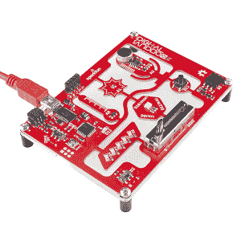
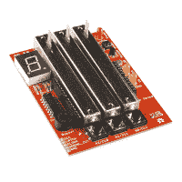
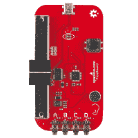
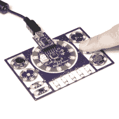
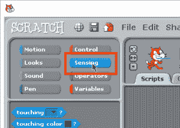
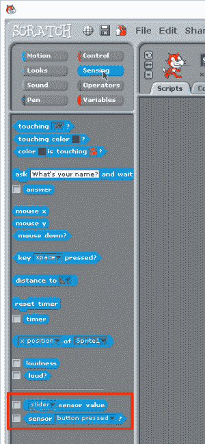
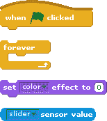
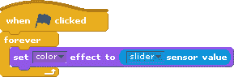
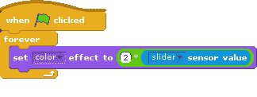
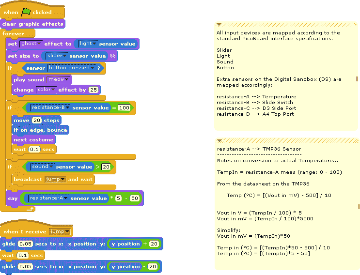

# 数字沙盒微微板

> 原文：<https://learn.sparkfun.com/tutorials/digitalsandbox-picoboard>

## 介绍

**Heads up!** As of the writing of this tutorial, Scratch 3.0 and 2.0 does not fully support the PicoBoard. We suggest using [Scratch 1.4](http://scratch.mit.edu/scratch_1.4/) until the full PicoBoard extensions are implemented, tested, and rolled out with Scratch 2.0+.

->[](https://www.sparkfun.com/products/12651)[](https://cdn.sparkfun.com/assets/learn_tutorials/2/7/0/9Tpee4Kqc.png)[](https://cdn.sparkfun.com/assets/learn_tutorials/2/7/0/scratch-cat-transparent.png)<—

数字沙盒(DS)是一个结合了  、 [DangerShield](https://www.sparkfun.com/products/11649) 和 [Lilypad Protosnap 开发板](https://www.sparkfun.com/products/11262)最佳功能的产品。我们结合了这三个伟大的入门学习平台的精华，创建了一个具有几个常用外围设备的单板——led、RGB、滑块、按钮和各种传感器。

->[](https://cdn.sparkfun.com/assets/learn_tutorials/2/7/0/11649-Built_Up.jpg)[](https://cdn.sparkfun.com/assets/learn_tutorials/2/7/0/11888-05.jpg)[](https://cdn.sparkfun.com/assets/learn_tutorials/2/7/0/11262-04a.jpg)<—

目前 PicoBoard 上的每个传感器(滑块、按钮、灯光和声音)也在这个板上。我们认为在这个设备上复制 PicoBoard 固件会很棒。

### 推荐阅读

*   [Arduino 是什么？](https://learn.sparkfun.com/tutorials/what-is-an-arduino)
*   [替代 Arduino 接口](https://learn.sparkfun.com/tutorials/alternative-arduino-interfaces)

## 上传固件

首先，我们需要将固件上传到数字沙箱，以便它模拟与微微板上相同的数据包信息。PicoBoard 的原始 C 代码可以在 [GitHub](https://github.com/sparkfun/PicoBoard) 上获得，但是这些代码不能直接在 Arduino 编程 IDE 中工作。

我们移植了这个代码库，并根据数字沙盒中 pin 配置的不同做了一些调整。

这段代码读取数字沙箱上的所有传感器，创建模拟微微板的数据“包”,并将其发送到您的计算机上——通过 Scratch 读取。

### 微微板 Arduino 代码

```
language:c
    // DigitalSandboxPico
//
// PicoBoard Firmware modified for the DigitalSandBox 
// Arduino Learning Platform.
// Ported over from original C code.
//
// Modified by: Brian Huang, Sparkfun Electronics
// Date:  August 7, 2014

#define SCRATCH_DATA_REQUEST 0x01

char request = 0;
unsigned int sensor_value = 0;
char data_packet[2]= "";

int SLIDER = A3; // Slider on DS Board
int SOUND = A2;  // Microphone on DS Board
int LIGHT = A1;  // Light Detector on DS Board
int BUTTON = 12; // Push Button on DS Board

int RA = A0; // Temp
int RB = 2;  // Switch
int RC = 3;  // D3 -- Side Port 
int RD = A4; // A4 -- Top Port

void setup()
{
  pinMode(BUTTON, INPUT_PULLUP);  // enable internal pull-up resistor
  pinMode(RB, INPUT_PULLUP);  // enable internal pull-up resistor
  Serial.begin(38400);
}

void loop()
{
  request = Serial.read();
  if(request == SCRATCH_DATA_REQUEST)
  {
    // send the ID packet
    buildScratchPacket(data_packet, 15, 0x04);
    sendScratchPacket(data_packet);

    // Do not change the order of this sequence. Scratch expects the data 
    // to be organized in this order.

    //Read/Report channel 0 (Resistance-D)
    sensor_value=analogRead(RD);
    buildScratchPacket(data_packet, 0, sensor_value);
    sendScratchPacket(data_packet);

    //Read/Report Channel 1 (Resistance-C)
    sensor_value=analogRead(RC);
    buildScratchPacket(data_packet, 1, sensor_value);
    sendScratchPacket(data_packet);

    //Read/Report Channel 2 (Resistance-B)
    sensor_value=1023*digitalRead(RB);
    buildScratchPacket(data_packet, 2, sensor_value);
    sendScratchPacket(data_packet);         

    //Read/Report Channel 3 (Button)
    sensor_value = 1023*(1 - digitalRead(BUTTON));
    buildScratchPacket(data_packet, 3, sensor_value);
    sendScratchPacket(data_packet); 

    //Read/Report Channel 4(Resistance-A)
    sensor_value=analogRead(RA);
    buildScratchPacket(data_packet, 4, sensor_value);
    sendScratchPacket(data_packet);     

    //Read/Report Channel 5(LIGHT)
    sensor_value=1023 - analogRead(LIGHT);
    buildScratchPacket(data_packet, 5, sensor_value);
    sendScratchPacket(data_packet); 

    //Read/Report Channel 6(Sound)
    sensor_value=analogRead(SOUND);
    buildScratchPacket(data_packet, 6, sensor_value);
    sendScratchPacket(data_packet);         

    //Read/Report Channel 7(Slider)
    sensor_value=analogRead(SLIDER);
    buildScratchPacket(data_packet, 7, sensor_value);
    sendScratchPacket(data_packet);
  }
}

void buildScratchPacket(char * packet, int channel, int value)
{
  char upper_data=(char)((value&(unsigned int)0x380)>>7);   //Get the upper 3 bits of the value
  char lower_data=(char)(value&0x7f);   //Get the lower 7 bits of the value
  *packet++=((1<<7)|(channel<<3)|(upper_data));
  *packet++=lower_data;
}

void sendScratchPacket(char * packet)
{
  Serial.write(*packet++);
  delayMicroseconds(400);
  Serial.write(*packet++);
  delayMicroseconds(400);
} 
```

将这段代码复制粘贴到你的 Arduino IDE 中。选择 Lilypad w/ ATMega328 作为您的电路板类型或数字沙盒(如果您使用的是我们的 Arduino 版本)。

## 使用 Scratch

Scratch 是一个非常棒的编程入门教学平台。它使用简单的颜色编码块，这些颜色编码块组合在一起创建程序或“脚本”它是为孩子设计的，但 Scratch 的特性和功能足够广泛，您可以创建自己的数据记录仪表板、街机风格的游戏或全长动画。一旦你上传了“Picoboard Arduino 代码”，数字沙盒将与 Scratch 中的 Picoboard 一样工作。

* * *

**Heads up!** As of the writing of this tutorial, Scratch 3.0 and 2.0 does not fully support the PicoBoard. We suggest using [Scratch 1.4](http://scratch.mit.edu/scratch_1.4/) until the full PicoBoard extensions are implemented, tested, and rolled out with Scratch 2.0+.

* * *

要使用微微板传感器模块，请单击蓝色传感调色板:

[](https://cdn.sparkfun.com/assets/learn_tutorials/2/7/0/8-8-2014_3-39-58_PM.jpg)

在列表的最底部，有两个我们可以使用的模块。一个是(*滑块*传感器值)另一个是布尔/逻辑块<传感器*按钮被按下*？>pico board(数字沙箱)上的所有传感器返回一个从 0 到 100 的值。在临时环境中，它是一个缩放值，其中 0 V == > 0 和 5 V == > 100。

[](https://cdn.sparkfun.com/assets/learn_tutorials/2/7/0/8-8-2014_3-41-55_PM.jpg)

为了帮助我们开始，我想用这四个模块制作一个真正快速简单的测试脚本:

[](https://cdn.sparkfun.com/assets/learn_tutorials/2/7/0/scratchDemo2.gif)

将这些模块连接/组装成一个简单的程序，如下所示:

[](https://cdn.sparkfun.com/assets/learn_tutorials/2/7/0/scratchtestcomplete.gif)

### 测试一下！

点击绿色标志，看看会发生什么。当你前后移动滑块时，猫抓痕的颜色应该会改变。你应该看到猫从橙色->黄色->绿色->蓝色。

似乎我们漏掉了一些颜色。稍微研究一下 Scratch 上的文档就可以发现，*设置颜色效果*块的工作范围是 0 - 200。因此，要获得完整范围，我们需要将传感器值乘以 2。从数学运算符中抓取乘法块:

[](https://cdn.sparkfun.com/assets/learn_tutorials/2/7/0/8-8-2014_4-12-15_PM.jpg)

然后，重新组装积木，使其看起来像这样:

[](https://cdn.sparkfun.com/assets/learn_tutorials/2/7/0/8-8-2014_4-13-33_PM.jpg)

点击绿色标志，再试一次！Scratch 现在经历了多少种颜色？

[](https://cdn.sparkfun.com/assets/learn_tutorials/2/7/0/BlueScratch.jpg)

尝试其他效果选项和功能。你可以将这些与 PicoBoard(数字沙盒)上的任何传感器联系起来——滑块、光或声音。我们将温度与电阻(一个传感器)联系起来，电阻的值也是从 0 到 100。

[](https://cdn.sparkfun.com/assets/learn_tutorials/2/7/0/effectOptions.jpg)

## 报告温度

在数字沙盒中使用温标非常简单——尽管需要一点数学知识。查看该板上温度传感器的数据手册 [TMP36](https://cdn.sparkfun.com/assets/learn_tutorials/2/7/0/TMP35_36_37.pdf) 可能令人望而生畏，但我们关心的是:

* * *

TMP36 的额定温度范围为 40°C 至+125°C，在 25°C 时提供 750 mV 输出，采用 2.7 V 单电源供电，工作温度范围为 125°C。以及“TMP35 和 TMP36 的输出比例因子均为 10mV/°c。”

* * *

### 翻译

TMP36 输出随温度线性变化的电压。因为它是线性的，我们可以从[代数 I](https://www.khanacademy.org/math/algebra) 中我们最喜欢的方程开始——直线的一般方程:

*y = mx + b**Temp = (slope) * (voltage) + b*

电压与温度之间的比例(比率)为 10mV/°C，但我们希望斜率以°/ mV 为单位。因此，如果我们取 10mV/°C 的倒数，这就是 0.1°C/mV。比例是一样的，单位也是正确的。那是我们的斜坡！

拦截点需要一点数学知识。利用“在 25°C 时提供 750 mV 输出”的信息，我们可以找到截取点。

*25 °C = (0.1 °C/mV)(750 mV) + b**25 °C = 75 °C + b**-50 °C = b*

### 最终方程

*Temp (°C) = (0.1 °C/mV) * (voltage in mV) - 50 °C*

### 在划痕中

在 Scratch 中，电压的范围是从 0 到 100。让我们来看看这是如何工作的:

*Temp = (0.1 °C/mV) * (voltage in Scratch/100)*(5000 mV) - 50 °C*

看这个，我看到很多小数，乘以 1000，除以 100。看起来我们应该能够简化这一点。首先，我们简化一下除以 100 乘以 5000。

*Temp = (0.1 °C/mV) * (voltage in Scratch*(50 mV) - 50 °C*

接下来，将 0.1 乘以 50，简化为:

*Temp = (voltage in Scratch*(5 °C) - 50 °C*

在 Scratch 中，这看起来像是:

[](https://cdn.sparkfun.com/assets/learn_tutorials/2/7/0/tempCalc.gif)

## 示例草稿脚本

我们创建了一个小样本脚本，在一个例子中展示了所有的特性。你可以随意使用它，取它的一部分，或者重新混合到你自己的新程序中。它根据灯光输入、滑块值和音量来改变精灵。

如果您将滑动开关拨到 ON (1)位置，精灵还会来回走动，并且当您按下按钮时会改变颜色(并播放声音)。摆弄这个例子。我们相信你也会想出其他有趣的主意！

[](https://cdn.sparkfun.com/assets/learn_tutorials/2/7/0/DigitalSandboxPico.sb)

点击[此处](https://cdn.sparkfun.com/assets/learn_tutorials/2/7/0/DigitalSandboxPico.sb)下载该文件的副本，在您自己的电脑上运行。

## 更进一步

DigitalSandbox Picoboard 是编程和与传感器交互的良好开端，但它只允许您将输入值读入 Scratch，不允许我们控制执行器或影响输出。

如果你有兴趣将其扩展到不仅仅是读取传感器，请尝试[scratch 4a duino](http://s4a.cat/)或 [ArduBlock](http://blog.ardublock.com/) 。我们有一系列围绕 Ardublock 的活动和实验，使用数字沙盒[在这里](https://learn.sparkfun.com/tutorials/digital-sandbox-arduino-companion)。

### 其他资源

*   [替代 Arduino 接口](https://learn.sparkfun.com/tutorials/alternative-arduino-interfaces)
*   [模块套件](http://www.modk.it/alpha)
*   [迷你批量](http://blog.minibloq.org/)
*   [用于 Arduino 的 Labview】](https://www.sparkfun.com/products/11225)