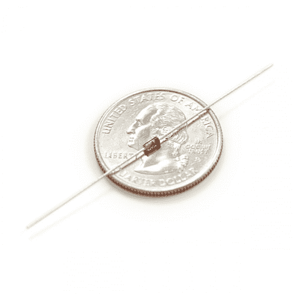
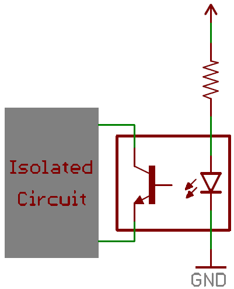

# 二极管

> 原文：<https://learn.sparkfun.com/tutorials/diodes>

## 介绍

一旦你从简单的无源元件，即[电阻](https://learn.sparkfun.com/tutorials/resistors)、[电容](https://learn.sparkfun.com/tutorials/capacitors)和电感毕业，是时候步入半导体的奇妙世界了。最广泛使用的半导体元件之一是二极管。

在本教程中，我们将介绍:

*   什么是二极管！？
*   二极管工作理论
*   重要的二极管特性
*   不同类型的二极管
*   二极管看起来像什么
*   典型二极管应用

### 推荐阅读

本教程中的一些概念建立在以前的电子学知识之上。在进入本教程之前，先考虑阅读(至少略读)以下内容:

 [### 什么是电路？](https://learn.sparkfun.com/tutorials/what-is-a-circuit) Every electrical project starts with a circuit. Don't know what a circuit is? We're here to help.[Favorited Favorite](# "Add to favorites") 82 [### 电压、电流、电阻和欧姆定律](https://learn.sparkfun.com/tutorials/voltage-current-resistance-and-ohms-law) Learn about Ohm's Law, one of the most fundamental equations in all electrical engineering.[Favorited Favorite](# "Add to favorites") 132 [### 什么是电？](https://learn.sparkfun.com/tutorials/what-is-electricity) We can see electricity in action on our computers, lighting our houses, as lightning strikes in thunderstorms, but what is it? This is not an easy question, but this tutorial will shed some light on it 83 [### 串联和并联电路](https://learn.sparkfun.com/tutorials/series-and-parallel-circuits) An introduction into series and parallel circuits.[Favorited Favorite](# "Add to favorites") 58 [### 如何使用万用表](https://learn.sparkfun.com/tutorials/how-to-use-a-multimeter) Learn the basics of using a multimeter to measure continuity, voltage, resistance and current.[Favorited Favorite](# "Add to favorites") 67

## 想探索不同的二极管吗？

我们掩护你！

 

将**添加到您的[购物车](https://www.sparkfun.com/cart)中！**

### [SparkFun 初学者配件包](https://www.sparkfun.com/products/13973)

[28 available](https://learn.sparkfun.com/static/bubbles/ "28 available") KIT-13973

SparkFun 初学者配件包是一个包含常用配件的小容器，为您提供所有的基本组件…

$18.5012[Favorited Favorite](# "Add to favorites") 84[Wish List](# "Add to wish list")**** 

将**添加到您的[购物车](https://www.sparkfun.com/cart)中！**

### [SparkFun 分立半导体套件](https://www.sparkfun.com/products/13682)

[In stock](https://learn.sparkfun.com/static/bubbles/ "in stock") KIT-13682

SparkFun 分立半导体套件满足了您只需要一个或几个晶体管而不需要…

$12.956[Favorited Favorite](# "Add to favorites") 62[Wish List](# "Add to wish list")**** 

将**添加到您的[购物车](https://www.sparkfun.com/cart)中！**

### [二极管整流器——1A，50V (1N4001)](https://www.sparkfun.com/products/8589)

[In stock](https://learn.sparkfun.com/static/bubbles/ "in stock") COM-08589

这是一个简单的，超小型尺寸，轴向引线安装整流二极管。1N4001 的额定电压高达 1A/50V。

$0.251[Favorited Favorite](# "Add to favorites") 13[Wish List](# "Add to wish list")**** 

将**添加到您的[购物车](https://www.sparkfun.com/cart)中！**

### [二极管整流器——1A，400V (1N4004)](https://www.sparkfun.com/products/14884)

[In stock](https://learn.sparkfun.com/static/bubbles/ "in stock") COM-14884

这是一个简单的，超小型尺寸，轴向引线安装整流二极管。1N4004 的额定电压高达 1A/400 伏。

$0.25 $0.06[Favorited Favorite](# "Add to favorites") 5[Wish List](# "Add to wish list")****************[See all diodes](https://www.sparkfun.com/categories/325)

* * *********  ********## 理想二极管

**理想**二极管的关键功能是控制电流的*方向*。通过二极管的电流只能向一个方向流动，这个方向叫做正向。试图反向流动的电流被阻挡。它们就像电子设备的单向阀。

如果二极管两端的电压为负，则没有电流流过 [*](#idealNotReal) ，理想的二极管看起来像开路。在这种情况下，二极管被称为*关断*或**反向偏置**。

只要二极管上的电压不是负的，它就会“导通”并传导电流。理想情况下，如果二极管传导电流，它会像短路(0V)一样工作。当二极管传导电流时，它是正向偏置的**(电子术语“开”)。**

***The current-voltage relationship of an ideal diode. Any negative voltage produces zero current -- an open circuit. As long as the voltage is non-negative the diode looks like a short circuit.*

| **理想二极管特性** |
| 操作方式 | 开(正向偏置) | 关(反向偏置) |
| 电流通过 | I>0 | I=0 |
| 电压 | V=0 | V<0 |
| 二极管看起来像 | 短路 | 断路 |

### 电路符号

每个二极管都有**两个端子**——元件两端的连接——这些端子是**极化的**，这意味着两个端子截然不同。重要的是不要混淆二极管的连接。二极管的正极端叫做**阳极**，负极端叫做**阴极**。电流可以从阳极端流向阴极，但不能反过来。如果你忘记了电流流经二极管的方式，请努力记住助记符 *ACID* :“二极管中的阳极电流”(也就是*阳极阴极就是二极管*)。

标准二极管的**电路符号**是一个紧靠一条线的三角形。正如我们将在本教程后面的[中介绍的，二极管有多种类型，但通常它们的电路符号看起来像这样:](types-of-diodes)

进入三角形平边的端子代表阳极。电流沿着三角形/箭头所指的方向流动，但不能反方向流动。

以上是几个简单的二极管电路例子。左边，二极管 D1 正向偏置，允许电流流过电路。本质上，它看起来像一个短路。在右边，二极管 D2 反向偏置。电流不能流过电路，它本质上看起来像一个开路。

*警告！星号！不完全正确...不幸的是，没有理想的 T2 二极管。但是不用担心！二极管确实是真实的，它们只是有一些特性，使得它们的工作方式比我们的理想模型稍差一些...

* * *

## 真实二极管特性

*理想情况下*，二极管将阻止任何和所有电流反向流动，或者如果电流正向流动，则只起到短路的作用。不幸的是，实际的二极管行为并不十分理想。二极管在传导正向电流时确实会消耗一些功率，而且它们不会阻挡所有的反向电流。现实世界中的二极管稍微复杂一些，它们都有独特的特性，这些特性决定了它们的实际工作方式。

### 电流-电压关系

最重要的二极管特性是其电流-电压( *i-v* )关系。这就定义了流经一个元件的电流是多少，给定该元件上测得的电压是多少。例如，电阻器具有简单的线性 *i-v* 关系...[欧姆定律](../voltage-current-resistance-and-ohms-law/ohms-law)。然而，二极管的电流-电压曲线完全是非线性的。它看起来像这样:

*The current-voltage relationship of a diode. In order to exaggerate a few important points on the plot, the scales in both the positive and negative halves are not equal.*

根据施加在二极管上的电压，二极管将工作在三个区域之一:

1.  **正向偏置**:当二极管两端的电压为正时，二极管“导通”，电流可以通过。电压应该大于正向电压(V [F] )以使电流有意义。
2.  **反向偏置**:这是二极管的“关”模式，此时电压小于 V [F] 但大于-V [BR] 。在这种模式下，电流(大部分)被阻断，二极管关闭。一个非常小的电流量(nA 量级)称为反向饱和电流能够反向流过二极管。
3.  **击穿**:当二极管两端施加的电压非常大且为负时，大量电流将会反向流动，从阴极流向阳极。

### 正向电压

为了“导通”并正向传导电流，二极管需要施加一定量的正电压。导通二极管所需的典型电压称为*正向电压* (V [F] )。它也可以被称为*接通电压*或*接通电压*。

从 *i-v* 曲线我们知道，通过二极管的电流和电压是相互依赖的。更多的电流意味着更多的电压，更少的电压意味着更少的电流。然而，一旦电压达到正向电压额定值，电流的大幅增加仍然意味着电压的小幅增加。如果二极管完全导通，通常可以假定其两端的电压为正向电压额定值。

*A [multimeter](https://learn.sparkfun.com/tutorials/retired---how-to-use-a-multimeter-) with a diode setting can be used to measure (the minimum of) a diode's forward voltage drop.*

特定二极管的 V [F] 取决于它是由什么半导体材料制成的。通常，硅二极管的 V [F] 约为 **0.6-1V** 。锗基二极管可能更低，约为 0.3v。*型*二极管在定义正向压降方面也有一定的重要性；发光二极管可以具有大得多的 V [F] ，而肖特基二极管专门设计为具有比通常低得多的正向电压。

### 击穿电压

如果对二极管施加足够大的负电压，二极管就会屈服，允许电流反向流动。这个大的负电压被称为**击穿电压**。一些二极管实际上被设计为工作在击穿区，但对于大多数普通二极管来说，承受大的负电压不是很健康。

对于普通二极管，该击穿电压约为-50V 至-100V，甚至更负。

## 二极管数据表

所有上述特性都应在每个二极管的数据手册中详细说明。例如，1N4148 二极管的[数据表](http://www.vishay.com/docs/81857/1n4148.pdf)列出了最大正向电压(1V)和击穿电压(100V)(以及许多其他信息):

数据手册甚至可能为您提供一张非常熟悉的电流-电压图，进一步详细说明二极管的工作原理。二极管数据手册中的这张图放大了 *i-v* 曲线的弯曲前向区域部分。请注意，电流越大，电压越高:

该图指出了另一个重要的二极管特性——最大正向电流。就像任何组件一样，二极管在熔断之前只能消耗这么多功率。所有二极管都应列出最大电流、反向电压和功耗。如果二极管承受的电压或电流超过了它所能承受的范围，那么它就会发热(或者更糟；融化，冒烟，...).

有些二极管非常适合高电流，如 1A 或更高的电流，而其他二极管，如上面所示的 1N4148 小信号二极管，可能只适合 200mA 左右的电流。

* * *

1N4148 只是现有各种二极管的一小部分。接下来，我们将探讨各种各样的二极管，以及每种类型的用途。

## 二极管的类型

### 普通二极管

#### 信号二极管

标准**信号二极管**是二极管家族中最基本、最普通、最简单的成员。它们通常具有中高的正向压降和低的最大额定电流。信号二极管的一个常见例子是 [1N4148](http://www.sparkfun.com/products/8588) 。

 

将**添加到您的[购物车](https://www.sparkfun.com/cart)中！**

### [二极管小信号- 1N4148](https://www.sparkfun.com/products/8588)

[In stock](https://learn.sparkfun.com/static/bubbles/ "in stock") COM-08588

这是一个很常见的信号二极管——1n 4148。将此用于高达 200mA 电流的信号。

$0.25[Favorited Favorite](# "Add to favorites") 10[Wish List](# "Add to wish list")** **非常通用，其典型正向压降为 0.72V，最大正向电流额定值为 300mA。

*A small-signal diode, the 1N4148\. Notice the black circle around the diode, that marks which of the terminals is the cathode.*

#### 功率二极管

**整流器或功率二极管**是一种标准二极管，具有更高的最大额定电流。这种更高的额定电流通常以更大的正向电压为代价。 [1N4001](http://www.sparkfun.com/products/8589) 就是功率二极管的一个例子。

 

将**添加到您的[购物车](https://www.sparkfun.com/cart)中！**

### [二极管整流器——1A，50V (1N4001)](https://www.sparkfun.com/products/8589)

[In stock](https://learn.sparkfun.com/static/bubbles/ "in stock") COM-08589

这是一个简单的，超小型尺寸，轴向引线安装整流二极管。1N4001 的额定电压高达 1A/50V。

$0.251[Favorited Favorite](# "Add to favorites") 13[Wish List](# "Add to wish list")** **1N4001 的额定电流为 1A，正向电压为 1.1V

*A 1N4001 PTH diode. This time a gray band indicates which pin is the cathode.*

当然，大多数二极管也有表贴类型。你会注意到，每个二极管都有某种方式(无论多么微小或难以看到)来指示两个引脚中的哪一个是阴极。

### 发光二极管(led！)

二极管家族中最耀眼的成员一定是[发光二极管](https://learn.sparkfun.com/tutorials/light-emitting-diodes-leds)。当施加正电压时，这些二极管真的会发光。

*A handful of through-hole LEDs. From left to right: a [yellow 3mm](https://www.sparkfun.com/products/532), [blue 5mm](https://www.sparkfun.com/products/11372), [green 10mm](https://www.sparkfun.com/products/8861), [super-bright red 5mm](https://www.sparkfun.com/products/528), an [RGB 5mm](https://www.sparkfun.com/products/10820) and a [blue 7-segment LED](https://www.sparkfun.com/products/9191).*

像普通二极管一样，led 只允许电流单向通过。它们还具有正向额定电压，这是它们点亮所需的电压。LED 的 V [F] 额定值通常大于普通二极管的 V[F]额定值(1.2~3V)，这取决于 LED 发出的颜色。例如，[超高亮蓝色 LED](http://www.sparkfun.com/products/529) 的额定正向电压约为 3.3V，而同等尺寸的[超高亮红色 LED](http://www.sparkfun.com/products/528) 的额定正向电压仅为 2.2V

显然，在照明应用中，你最常看到的就是 led。它们闪闪发光，很有趣！但更重要的是，它们的高效率已经广泛应用于路灯、显示器、背光以及更多领域。其他发光二极管发出人眼不可见的光，如红外发光二极管，这是大多数遥控器的支柱。led 的另一个常见用途是将危险的高压系统与低压电路进行光学隔离。光隔离器将红外 LED 与光电传感器配对，当光电传感器检测到来自 LED 的光时，允许电流流动。下面是一个光隔离器的示例电路。请注意二极管的原理图符号与普通二极管有何不同。LED 符号添加了一对从符号向外延伸的箭头。

### 肖特基二极管

另一种非常常见的二极管是肖特基二极管。

 

将**添加到您的[购物车](https://www.sparkfun.com/cart)中！**

### [肖特基二极管](https://www.sparkfun.com/products/10926)

[In stock](https://learn.sparkfun.com/static/bubbles/ "in stock") COM-10926

肖特基二极管以其低正向压降和极快的开关动作而闻名。这个 1A 40V 肖特基二极管是…

$0.251[Favorited Favorite](# "Add to favorites") 12[Wish List](# "Add to wish list")** **肖特基二极管的半导体成分与普通二极管略有不同，这导致了更小的正向压降，通常在 0.15V 和 0.45V 之间。尽管如此，它们仍然具有非常大的击穿电压。

肖特基二极管在限制损耗方面特别有用，因为电压的最后一位*必须*保留。它们是独一无二的，在阴极线的末端有几个弯曲，足以成为它们自己的电路符号。

### 齐纳二极管

齐纳二极管是二极管家族中奇怪的弃儿。它们通常用来故意**传导反向电流**。

 

### [齐纳二极管- 5.1V 1W](https://www.sparkfun.com/products/retired/10301)

[Retired](https://learn.sparkfun.com/static/bubbles/ "Retired") COM-10301

齐纳二极管可用于产生基准电压或作为低电流应用的稳压器。这些二极管…

**Retired**[Favorited Favorite](# "Add to favorites") 10[Wish List](# "Add to wish list")

齐纳二极管被设计成具有非常精确的击穿电压，称为**齐纳击穿电压**或**齐纳电压**。当足够的电流反向流过齐纳二极管时，齐纳二极管上的压降将稳定在击穿电压。

利用齐纳二极管的击穿特性，齐纳二极管通常用来产生与其齐纳电压完全相同的已知基准电压。它们可以用作小负载的电压调节器，但它们并不是真正用来调节电路电压的，因为电路会产生大量的电流。

齐纳非常特别，有自己的电路符号，在阴极线上有波浪形的末端。这个符号甚至可以定义二极管的齐纳电压到底是多少。这是一个 3.3V 齐纳二极管，用于产生稳定的 3.3V 基准电压:

### 光电二极管

光电二极管是专门构造的二极管，它从光的光子中捕获能量(参见物理学，量子)以产生电流。有点像反 LED。

 

将**添加到您的[购物车](https://www.sparkfun.com/cart)中！**

### [微型太阳能电池- BPW34](https://www.sparkfun.com/products/9541)

[In stock](https://learn.sparkfun.com/static/bubbles/ "in stock") PRT-09541

BPW34 是一款小型通用[PiN 光电二极管](http://en . Wikipedia . org/wiki/PiN _ diode)。这个光电二极管有一吨的 u…

$1.601[Favorited Favorite](# "Add to favorites") 36[Wish List](# "Add to wish list")*****A BPW34 photodiode (not the quarter, the little thing on top of that). Get it under the sun and it can generate about few µW's of power!.*

太阳能电池是光电二极管技术的主要受益者。但是这些二极管也可以用来探测光，甚至进行光通信。

* * *

## 二极管应用

对于这样一个简单的元件，二极管有着广泛的用途。几乎每个电路中都有某种类型的二极管。从小信号数字逻辑到高压功率转换电路，它们都可以发挥作用。让我们来探索其中的一些应用。

### 整流器

整流器是将[交流电(AC)转换为直流电(DC)](https://learn.sparkfun.com/tutorials/alternating-current-ac-vs-direct-current-dc) 的电路。这种转换对于各种家用电子产品都至关重要。交流信号来自你家墙上的插座，但 DC 是大多数电脑和其他微电子设备的电源。

交流电路中的电流实际上是*交替*——在正负方向上快速切换——但是 DC 信号中的电流只在一个方向上流动。因此，要从交流转换到 DC，你只需要确保电流不能反向流动。听起来像是二极管的工作！

一个**半波整流器**可以仅由一个二极管制成。如果交流信号(例如正弦波)通过二极管发送，信号的任何负分量都会被滤除。

*Input (red/left) and output (blue/right) voltage waveforms, after passing through the half-wave rectifier circuit (middle).*

一个**全波桥式整流器**使用四个二极管将交流信号中的负峰转换为正峰。

*The bridge rectifier circuit (middle), and the output wave form it creates (blue/right).*

这些电路是交流到 DC 电源的关键组件，它将墙上插座的 120/240VAC 信号转换为 3.3V、5V、12V 等。DC 信号。如果你拆开一个[壁式电源](https://www.sparkfun.com/products/8269)，你很可能会看到里面有几个二极管，用来整流。

*Can you spot the four diodes making a bridge rectifier in this wall-wart?*

### 反向电流保护

有没有把电池插错过？还是把红黑电源线对调？如果是这样，二极管可能是你的电路仍然活着的原因。与电源正极串联的二极管称为反向保护二极管。它确保电流只能在正方向流动，电源只向您的电路施加正电压。

当电源连接器没有极化时，这种二极管应用非常有用，很容易出错，意外地将输入电路的负电源连接到正电源。

反向保护二极管的缺点是，由于正向压降，它会引起一些电压损失。这使得**肖特基二极管**成为反向保护二极管的绝佳选择。

### 逻辑门

别管晶体管了！简单的[数字逻辑门](https://learn.sparkfun.com/tutorials/digital-logic/combinational-logic)，如 AND 或 or，可以由二极管构成。

例如，二极管双输入 or 门可以由两个共用阴极节点的二极管构成。逻辑电路的输出也位于该节点。每当任一输入(或两者)为逻辑 1(高/5V)时，输出也变为逻辑 1。当两个输入均为逻辑 0(低电平/0V)时，输出通过电阻被拉低。

“与”门以类似的方式构成。两个二极管的*阳极*连接在一起，这是电路输出所在的位置。两个输入都必须为逻辑 1，迫使电流流向输出引脚，并将它拉高。如果任一输入为低电平，5V 电源的电流将流经二极管。

对于这两种逻辑门，只需增加一个二极管，就可以增加更多的输入。

### 反激二极管和电压尖峰抑制

二极管经常被用来限制意外的大电压尖峰造成的潜在损害。瞬态电压抑制(TVS)二极管是特种二极管，有点像齐纳二极管——较低的击穿电压(通常在 20V 左右)——但具有非常大的额定功率(通常在千瓦级范围内)。它们被设计成当电压超过其击穿电压时分流电流并吸收能量。

反激二极管在抑制电压尖峰方面也有类似的作用，特别是由电机等感性元件感应的电压尖峰。当流经电感的电流突然变化时，会产生一个电压尖峰，可能是一个非常大的负尖峰。一个反激二极管跨接在感性负载上，将为负电压信号提供一条安全的放电路径，实际上是通过电感和二极管一次又一次地循环，直到它最终消失。

这只是这个神奇的小半导体元件的少数应用。

* * *

## 购买二极管

现在你的*电流*正朝着正确的方向流动，是时候好好利用你的新知识了。无论您是在寻找一个起点，还是只是在备货，我们都有一个发明家套件以及单独的二极管可供选择。

### 我们的建议:

 

将**添加到您的[购物车](https://www.sparkfun.com/cart)中！**

### [二极管小信号- 1N4148](https://www.sparkfun.com/products/8588)

[In stock](https://learn.sparkfun.com/static/bubbles/ "in stock") COM-08588

这是一个很常见的信号二极管——1n 4148。将此用于高达 200mA 电流的信号。

$0.25[Favorited Favorite](# "Add to favorites") 10[Wish List](# "Add to wish list")**** 

将**添加到您的[购物车](https://www.sparkfun.com/cart)中！**

### [二极管整流器——1A，50V (1N4001)](https://www.sparkfun.com/products/8589)

[In stock](https://learn.sparkfun.com/static/bubbles/ "in stock") COM-08589

这是一个简单的，超小型尺寸，轴向引线安装整流二极管。1N4001 的额定电压高达 1A/50V。

$0.251[Favorited Favorite](# "Add to favorites") 13[Wish List](# "Add to wish list")**** 

将**添加到您的[购物车](https://www.sparkfun.com/cart)中！**

### [肖特基二极管](https://www.sparkfun.com/products/10926)

[In stock](https://learn.sparkfun.com/static/bubbles/ "in stock") COM-10926

肖特基二极管以其低正向压降和极快的开关动作而闻名。这个 1A 40V 肖特基二极管是…

$0.251[Favorited Favorite](# "Add to favorites") 12[Wish List](# "Add to wish list")**** 

### [SparkFun 发明家工具包- V3.2](https://www.sparkfun.com/products/retired/12060)

[Retired](https://learn.sparkfun.com/static/bubbles/ "Retired") KIT-12060

* *您可能已经从[我们的博客帖子](https://www . spark fun . com/news/2241)中看到，我们最近为 SIK 移动了注塑模具…

76 **Retired**[Favorited Favorite](# "Add to favorites") 76[Wish List](# "Add to wish list")****** ******## 有兴趣学习更多基础主题吗？

查看我们的 **[工程要点](https://www.sparkfun.com/engineering_essentials)** 页面，了解电气工程相关基础主题的完整列表。

带我去那里！

## 资源和更进一步

现在你已经掌握了二极管，也许你想进一步探索更多的半导体:

*   [晶体管](https://learn.sparkfun.com/tutorials/transistors)
*   [发光二极管](https://learn.sparkfun.com/tutorials/light-emitting-diodes-leds)
*   或者了解集成电路，比如:
    *   555 个计时器
    *   运算放大器
    *   [移位寄存器](https://learn.sparkfun.com/tutorials/shift-registers)

或者发现一些其他常见的电子元件:

*   [电阻器](../resistors)
*   [电容器](https://learn.sparkfun.com/tutorials/capacitors)
*   感应器
*   电压调节器************************