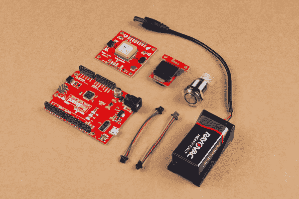

# 用 GPS 模块显示你的坐标

> 原文：<https://learn.sparkfun.com/tutorials/displaying-your-coordinates-with-a-gps-module>

## 介绍

有什么比学 [GPS](https://www.sparkfun.com/gps) 更好的？快乐地学习它！今天我们将做一个简单的项目来帮助你熟悉 GPS。多亏了我们的 [Qwiic 连接系统](https://www.sparkfun.com/qwiic)，这个项目变得又快又简单。大意就是按一个按钮，看到你的经纬度坐标。我们可能开始简单，但肯定有更高级的用户修改和发展项目的空间！

软件开发者从“Hello World！”每个硬件工程师都记得他们的第一个 LED 电路，对吗？因此，让我们通过创建一个接收 GPS 信号并将其输出到用户屏幕上的项目来融合这些想法。然后我们可以让它移动起来。我已经想到了！

### 所需材料

要跟随本教程，您将需要以下材料。你可能不需要所有的东西，这取决于你有什么。将它添加到您的购物车，通读指南，并根据需要调整购物车。

&nbsp