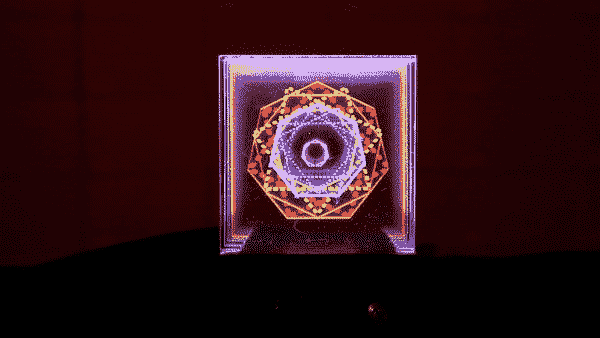

# DIY 灯光雕塑

> 原文：<https://learn.sparkfun.com/tutorials/diy-light-sculpture>

## 介绍

设计和建造时间:5 小时

在这个项目中，我们将用可寻址的 [LED](https://www.sparkfun.com/leds) s 通过边缘照明激光切割亚克力来创造一个漂亮的桌面光雕塑。这个项目嵌入了一个 [QDuino Mini](https://www.sparkfun.com/products/13614) 、 [8x8 Adafruit 新像素矩阵](https://www.sparkfun.com/products/12662)、[电位器](https://www.sparkfun.com/products/9939)、[瞬时按钮](https://www.sparkfun.com/products/10302)和[开关](https://www.sparkfun.com/products/102)。

[https://www.youtube.com/embed/xNxK31xRIdA/?autohide=1&border=0&wmode=opaque&enablejsapi=1](https://www.youtube.com/embed/xNxK31xRIdA/?autohide=1&border=0&wmode=opaque&enablejsapi=1)

### 所需材料

让我们回顾一下你将项目组合在一起所需要的所有东西。根据您拥有的设备，您可能不需要此处列出的所有设备。将它添加到您的购物车，通读指南，并根据需要调整购物车。