# 点/条显示驱动器连接指南

> 原文：<https://learn.sparkfun.com/tutorials/dotbar-display-driver-hookup-guide>

## 介绍

[LM3914](https://www.sparkfun.com/products/12694) 和 [LM3916](https://www.sparkfun.com/products/12695) 是一系列单片模拟控制 led 驱动器中的两个 ic。有了这些芯片，只需要一个**模拟信号**来驱动一串 10+LED，可以配置成**条形模式**(某一点以下的所有 LED 都打开)或**点模式**(每次只有一个 LED 打开)。将它们恰当地连接起来，你就可以创造出各种漂亮的多 LED 显示屏，比如音频可视化的 [VU 计](http://en.wikipedia.org/wiki/VU_meter)。

[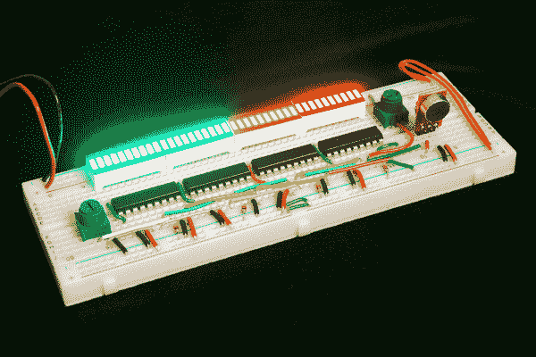](https://cdn.sparkfun.com/assets/a/0/1/5/4/52d81e7ece395f06448b456e.jpg)

这两种 IC 的引脚排列和接口相似。它们的不同之处在于如何将模拟信号映射到输出 LED。LM3914 使用**线性**输出比例，而 LM3916 使用更为**的对数 VU(音量单位)比例**，这使得它非常适合音频应用。

在本教程中，我们将[深入研究这些 LED 驱动器的数据手册](https://learn.sparkfun.com/tutorials/dotbar-display-driver-hookup-guide/ic-overview)，找出它们的工作原理，并仔细观察 18 引脚 DIP 芯片的引脚排列。最后，我们将展示一对示例电路，展示一个[简单](https://learn.sparkfun.com/tutorials/dotbar-display-driver-hookup-guide/example-hookup---simple-dotbar-display)连接和一个更加[高级的级联](https://learn.sparkfun.com/tutorials/dotbar-display-driver-hookup-guide/example-hookup---cascading)连接。

### 所需材料

如果您想继续学习本教程，以下是我们用来制作驱动电路的元件:

*   IC:简单电路 1 个 [LM3914](https://www.sparkfun.com/products/12694) ，级联电路 2-4 个 [LM3916](https://www.sparkfun.com/products/12695) 。
*   显示器:[5 毫米发光二极管](https://www.sparkfun.com/products/9881)和/或 2-4 个[条形图发光二极管](https://www.sparkfun.com/products/9935)
*   [电阻器套件](https://www.sparkfun.com/products/10969)中的各种电阻器
*   [全尺寸试验板](https://www.sparkfun.com/products/12615)
*   [电位器](https://www.sparkfun.com/products/9806)(或任何能产生模拟信号的传感器)
*   [试验板跳线](https://www.sparkfun.com/products/124)
*   电源:
    *   [5V 交流适配器](https://www.sparkfun.com/products/8269)和[筒式插孔适配器](https://www.sparkfun.com/products/10288)-或-
    *   [试验板电源](https://www.sparkfun.com/products/10804)(焊接有[公接头](https://www.sparkfun.com/products/116)

### 推荐阅读

使用这些 IC 相当简单——不需要疯狂的微控制器或编程！在继续学习之前，您应该熟悉以下几个基本的电子学概念:

*   [集成电路](https://learn.sparkfun.com/tutorials/integrated-circuits)
*   [模拟与数字](https://learn.sparkfun.com/tutorials/analog-vs-digital)
*   [发光二极管](https://learn.sparkfun.com/tutorials/light-emitting-diodes-leds)
*   [电阻器](https://learn.sparkfun.com/tutorials/resistors)
*   [分压器](https://learn.sparkfun.com/tutorials/voltage-dividers)
*   [如何使用试验板](https://learn.sparkfun.com/tutorials/how-to-use-a-breadboard)

## IC 概述

在本页中，我们将了解 18 引脚 LM3914/6 的引脚排列。我们还会更深入一点，看看是什么让 IC 做了它们该做的事情。

### 引脚排列

该芯片的 DIP(通孔双列直插封装)版本有 18 个引脚，以及一个点和一个凹口来指示[极性](https://learn.sparkfun.com/tutorials/polarity)。

[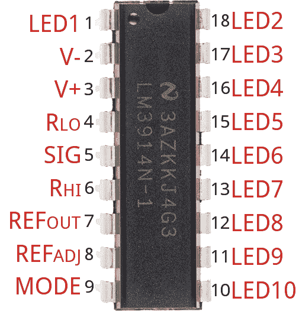](https://cdn.sparkfun.com/assets/d/e/5/7/e/52d81a30ce395f27228b4569.png)

超过一半的引脚负责驱动 led。其余引脚用于电源、基准电压和 IC 控制。这里是芯片引脚排列的概述:

| Pin # | Pin 名称 | 引脚功能 |  | Pin # | Pin 名称 | 引脚功能 |
| one | LED 1 | 第一个(最低值)LED |  | Eighteen | LED 2 | 第二个 LED |
| Two | v^— | 地面 |  | Seventeen | LED 3 | 第三个 LED |
| three | v&加； | 电源电压(3-25V) |  | Sixteen | LED 4 | 第四个 LED |
| four | R [LO] | 分压器低压 |  | Fifteen | LED 5 | 第 5 个 LED |
| five | 信号输入 | 模拟信号输入 |  | Fourteen | LED 6 | 第 6 个 LED |
| six | 嗨，嗨，嗨，嗨 | 分压器高压 |  | Thirteen | LED 7 | 第 7 个 LED |
| seven | 裁判出局 | 参考输出电压 |  | Twelve | LED 8 | 第 8 个 LED |
| eight | 参考调整 | 基准电压调整 |  | Eleven | LED 9 | 第 9 个 LED |
| nine | 方式 | 点/条模式选择 |  | Ten | LED 10 | 最后一个(最高模拟输入)LED |

这似乎是一个令人望而生畏的引脚和基准电压源列表，但实际上非常简单。其中许多引脚可以接地，V [CC] ，甚至悬空。其他引脚可能需要一两个电阻来设置恒定的电流或电压值。

#### LED 输出

**LED 输出**都是集电极开路，因此它们吸收电流。将 LED 的**阴极**连接到这些管脚，并将 LED 的另一个管脚**阳极**连接到你的电压源。不需要限流电阻，因为芯片会负责电流调节。

#### 方式选择

*模式*引脚允许您在“条”模式和“点”模式之间进行选择。在条形模式下，所有 led 按顺序打开。因此，如果信号电压接近最大值，*所有的*发光二极管应该打开。在“点”模式下，任何时候都只有一个 LED 灯亮着。对于条形模式，将模式直接连接到电源，对于点模式，使其悬空。

| 方式 | 模式引脚设置 |
| 条形图 | 直接绑上 V ^(&加号；) |
| 点显示 | 左浮动(无连接) |
| 点显示(级联驱动器) | 第一个驱动器的 Mode 引脚连接到 next 的引脚 1。 |

#### 用 R [HI] 和 R [LO] 设置模拟范围

*R [HI]* (引脚 6)和 *R [LO]* (引脚 4)引脚用于映射 LM3914/6 的感应范围。*R[HI]设定最大电压，*R[LO]设定最小电压。**

这两个引脚可以连接到任何电压，只要它比电源电压低 1.5V(V^(&plus)；))，且大于 0V。

#### Ref Out 时设置 LED 电流

从 *Ref Out* 引脚(引脚 7)流出的电流设置流经每个 LED 的电流，因此该引脚可用于调节 **LED 亮度**。

如果从该引脚到地连接一个电阻(R [L] ),则流经每个 LED 的电流大约等于以下等式:

[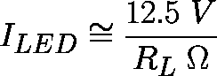](https://cdn.sparkfun.com/assets/f/1/8/0/4/52d57552ce395fe15d8b4567.)

例如，如果从引脚 7 到地连接一个 1kω电阻，LED 电流应该在 12.5 mA 左右。

如果您有一个更复杂的电路连接到此引脚，请记住 *Ref Out* 和 *Ref Adj* 引脚(引脚 8)之间的电压应为 1.25v。LED 电流等于从 *Ref Out* 流出的电流的 10 倍。

### 内部——一系列比较器

**注意:**理解这些芯片如何工作并不重要，但这是对[集成电路](https://learn.sparkfun.com/tutorials/integrated-circuits)内部的一次巧妙研究。如果这看起来有点太像 Circuits I 类，请随意跳到[下一页](https://learn.sparkfun.com/tutorials/dotbar-display-driver-hookup-guide/example-hookup---simple-dotbar-display)。

下图来自 [LM3914/6 数据手册](http://cdn.sparkfun.com/datasheets/Components/General%20IC/lm3914.pdf)，提供了这些芯片内部情况的绝佳概览:

[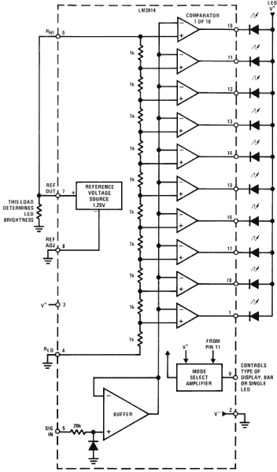](https://cdn.sparkfun.com/assets/c/5/e/f/7/52d47451ce395f53338b4567.png)

每个 LED 由一个**比较器**的输出控制，比较器是一个非常简单的运算放大器电路。如果电压进入&加号；(同相)引脚大于(反相)引脚，比较器输出 1(高电平，或者，在这种情况下，引脚“悬空”)。如果引脚电压大于&正；比较器的输出是 0(拉向地)。

[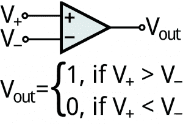](https://cdn.sparkfun.com/assets/f/b/8/d/5/52d56383ce395f9f498b4567.png)*The input/output combinations of a comparator.*

在芯片内部，引脚 5 的模拟控制信号连接到比较器的各反相()输入端。比较器的非反相(&plus;)输入连接到一串 1kω电阻，从而产生越来越大的[分压器](https://learn.sparkfun.com/tutorials/voltage-dividers)。&加号；第一个比较器上的电压将是**分压器输入电压**(R[HI]—R[LO])，而&plus；最后一个比较器上的电压是该电压的 1/10 ^(th) 。

要打开 LED，意味着比较器的输出为 0，模拟信号电压必须大于比较器的分压输入。因此，与以下任何一种相比，需要更小的信号电压来开启第一 LED。

### 额定电压和电流

lm 3914/6 IC 具有非常宽的电源电压范围:从 **1.8V 到 18V** 的任何电压。

R [HI] 和 R [LO] 引脚之间的电压可以是 0V(虽然这不会太有用)到低于电源电压 1.5V 的**之间的任何电压。因此，如果给芯片提供 5V 电源，它只能映射 0V 到 3.5V 之间的电压。**

此外，请记住流经芯片的电流。每个 LED 可以消耗 7 到 13 毫安的电流，为芯片供电还需要 2 到 9 毫安的电流。

## 示例连接-简单的点/条显示

在本页，我们将介绍一个非常简单的单 IC 10 LED 连接。这将向您展示如何设置 **LED 电流**、**分压器电压**，以及如何在**点或条**显示模式之间进行选择。

该电路适用于 LM3914 和 LM3916。唯一的区别是开启每个发光二极管所需的模拟电压不同。

### 试验板和示意图

这里有一对图表详细描述了这个简单的布局。我们假设电路由 5V 供电。如果您的电源电压不同，一些电阻值可能需要改变(详见下文)。

[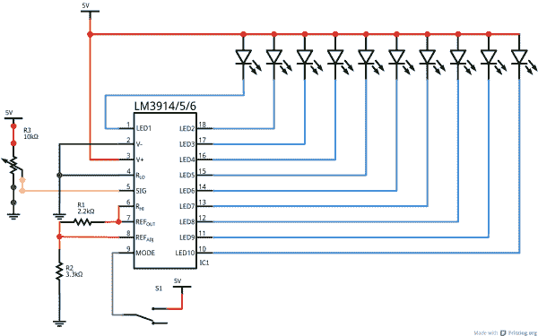](https://cdn.sparkfun.com/assets/f/b/d/1/e/52d709fece395f4c6e8b4567.png)*Schematic view of simple LM3914 circuit.*[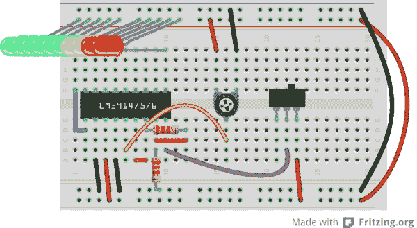](https://cdn.sparkfun.com/assets/f/2/b/d/5/52d709a1ce395f0b1b8b4567.png)*Breadboard view of LM3914 circuit.*

本例中的**模拟输入**是一个电位计，适合测试，否则会令人厌烦。你可以用它来代替任何模拟传感器，甚至是来自麦克风或立体声的音频信号。

**开关**可用于在**点或条模式**之间切换。如果 mode 引脚被拉高，IC 将处于 bar 模式。如果该引脚悬空，显示器以点模式工作。

最后是 led。挑选你喜欢的任何颜色或尺寸的组合。这些 10 路输出 LED 驱动器非常适合 [10 段条形图 LED](https://www.sparkfun.com/products/9935)。或者你也可以选择手边任何其他 led 灯的组合。[5 毫米 led](https://www.sparkfun.com/products/9881)有点太大，无法完美地安装到这个试验板连接中，所以你可能需要创造性地弯曲它们来适应:

[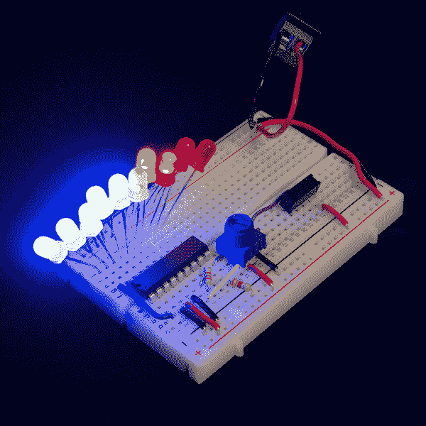](https://cdn.sparkfun.com/assets/0/a/e/7/8/52d80e6ece395f3c3d8b4569.jpg)

不需要限流电阻，但要确保每个 LED 的连接方向正确(阳极连接到电源，阴极连接到 IC 引脚)。

有多种选项可用于[为显示器](https://learn.sparkfun.com/tutorials/how-to-power-a-project)供电。在上面的例子中，我们使用了一个 [5V 壁式电源](https://www.sparkfun.com/products/8269)插入一个[筒式插孔适配器](https://www.sparkfun.com/products/10288)，一对电线从那里连接到试验板。如果您正在使用试验板， [5V/3.3V 试验板电源](https://www.sparkfun.com/products/10804)可能会让您的生活更轻松。

### 设置参考电压和 LED 电流

该电路中的两个电阻用于设置流经发光二极管的**电流**，以及分压器的**高压端**。

在这个电路中，R [HI] 引脚连接到我们的基准电压输出。要计算该电压，已知两个电阻值，使用以下公式:

[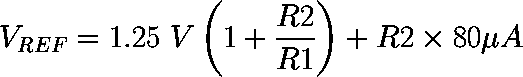](https://cdn.sparkfun.com/assets/1/9/4/4/9/52d704d0ce395fe86c8b456b.png)

然后，知道 V [REF] ，就可以用下面的等式计算通过 LED 的电流:

[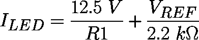](https://cdn.sparkfun.com/assets/f/3/8/f/0/52d70467ce395f5c438b456b.png)

在上面的电路中，R1 为 2.2kΩ，R2 为 3.3kΩ，V [REF] 将约为 **3.4V** (在电源电压下安全为 1.5V)。I [LED] 将约为**7.2 毫安** -对于大多数 LED 来说，这是一个愉快的中等电流。

如果您需要选择更宽或更小的范围，您将不得不使用这些电阻值，但等式应该成立。

## 示例连接-级联

通过级联这些 IC，你可以创造出极其灵敏的 VU 计，驱动 40 个甚至更多的 led。

*4 LM3916's chained together to produce a 40 LED VU meter.*

以下是如何将两个驱动程序链接在一起的方法:

[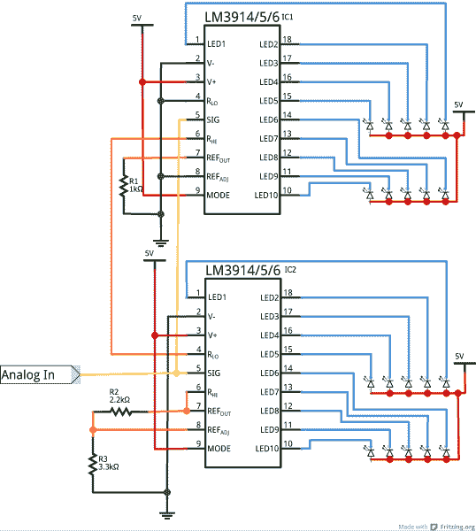](https://cdn.sparkfun.com/assets/e/d/7/c/4/52d71728ce395f7c5c8b456f.png)*Schematic of a dual LM3914/6 cascade.*

mode 引脚永久连接到 5V 电源，迫使显示器进入条形模式。要将级联的 LM3914/6 转换为适当的点模式，需要一点额外的布线。查看[数据表](http://cdn.sparkfun.com/datasheets/Components/General%20IC/lm3914.pdf)(第 11 页)获取帮助。

[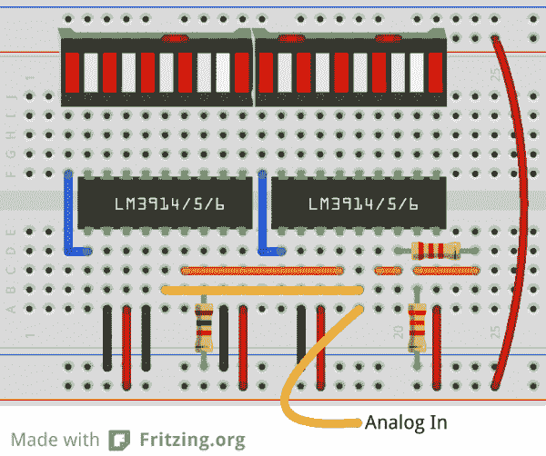](https://cdn.sparkfun.com/assets/b/d/0/e/5/52d7174fce395f13068b4569.png)*Breadboard view of two cascaded LM3914/6's.*

在这个例子中，我们使用了[条形图 led](https://www.sparkfun.com/products/9935)，它似乎是为 LM3914/6 制造的。确保将 led 的阳极连接到电源电压，阴极引脚可以直接连接到驱动器上的输出引脚。

级联的关键是将*R[LO]和*R[HI]引脚连接好。链中最低 IC 的 *R [LO]* (引脚 4)应接地，链中最高 IC 的 *R [HI]* (引脚 6)应连接到您感测范围内的最大电压。在这两点之间，一个 IC 的 *R [HI]* 应连接到下一个 IC 的 *R [LO]* 。这将把 IC 内部的每个电阻串连接在一起，在芯片内部形成一大组高度敏感的分压器。**

按照这个过程，你可以将更多的这种 IC 连在一起，制作出一些高质量的 VU 计或其他显示器。

## 资源和更进一步

如果您计划构建自己的 LM3914/6 电路，这些资源和本教程可能会有所帮助:

*   [LM3914 数据表](http://cdn.sparkfun.com/datasheets/Components/General%20IC/lm3914.pdf)
*   [LM3916 数据手册](http://cdn.sparkfun.com/datasheets/Components/General%20IC/lm3916.pdf)

### 更进一步

你打算用 LM3914 或 16 造什么？需要一些灵感吗？查看这些教程，继续您的旅程:

*   [RGB 面板连接指南](https://learn.sparkfun.com/tutorials/rgb-panel-hookup-guide) -如果你认为驾驶 40 个 led 很酷，等到你驾驶超过 3000 个。这些 32x32 RGB LED 面板可以创造出一些令人惊叹的视觉效果，但它们需要不止一个模拟信号来驱动...
*   [使用 open segment](https://learn.sparkfun.com/tutorials/using-opensegment)——继续展示主题，这些易于控制的 led 可以让你显示数字(甚至几个字母)。
*   光 -回到基础，学习光背后的所有物理知识。