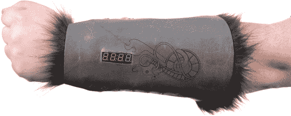

# 龙与地下城骰子战书

> 原文：<https://learn.sparkfun.com/tutorials/dungeons-and-dragons-dice-gauntlet>

## 介绍

D&D 护腕是一个相当快速，有趣，书呆子气 LilyPad 项目。最终产品是一个可穿戴的护腕，它有一个显示屏，可以根据手臂的运动随机产生 1 到 4、6、8、10、12、20 或 100 之间的数字，因此它可以有效地代替你包里的所有骰子进行 D&D 游戏。它也可以作为一件装饰服装，让你进入角色！

这是一个中级 LilyPad 教程。你可以期望做相当多的缝纫，适度的手工制作，并且你需要能够上传代码到 LilyPad arduino 板上。您不必编写代码，它已经为您提供了。但是，如果您想练习或使用它，还有自定义的空间。这个电路和代码是由我们的技术支持天才之一约翰·特雷普克(John Trepke)从一个类似的项目中改编而来的(我只是创造了这个词，但我喜欢它！)

### 材料

本教程需要混合使用电子物品和手工用品。这里有一个电子产品的奇特愿望清单: