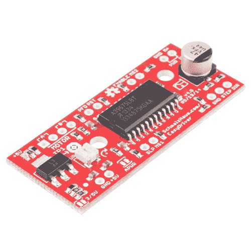

# 简易驾驶员挂钩指南

> 原文：<https://learn.sparkfun.com/tutorials/easy-driver-hook-up-guide>

## 介绍

[Easy Driver](https://www.sparkfun.com/products/12779) 能够驱动每相 150mA 至 700mA 的双极步进电机。

 

将**添加到您的[购物车](https://www.sparkfun.com/cart)中！**

### [EasyDriver -步进电机驱动器](https://www.sparkfun.com/products/12779)

[In stock](https://learn.sparkfun.com/static/bubbles/ "in stock") ROB-12779

EasyDriver 是一个简单易用的步进电机驱动器，兼容任何可以输出数字 0 到 5V 或 0 到 3 的设备。…

$16.9539[Favorited Favorite](# "Add to favorites") 56[Wish List](# "Add to wish list")** **### 所需材料

为了跟随本教程，我们建议您访问以下资料。你可能不需要所有的东西，这取决于你拥有什么。将它添加到您的购物车，通读指南，并根据需要调整购物车。**