# 使用 Arduino CLI 和 Visual Studio 代码进行高效的 Arduino 编程

> 原文：<https://learn.sparkfun.com/tutorials/efficient-arduino-programming-with-arduino-cli-and-visual-studio-code>

## 介绍

Arduino IDE(集成开发环境)很好地实现了它的预期目的:它是一个简单的单文件应用程序开发环境。它有足够的集成工具来帮助实现这一目的。但是对于更大的应用程序开发——无论您是在设计 Arduino 库还是开发新的 Arduino 内核——它都无法与全功能的 C/C++ IDE 相比。

[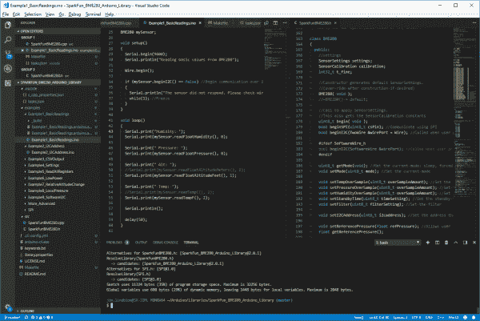](https://cdn.sparkfun.com/assets/learn_tutorials/8/2/5/overview-vs-code-arduino-halfscreen.png)*VS Code used to edit an Arduino sketch file while viewing a library's .h file*

Arduino IDE 缺少许多“专业的”代码辅助功能，例如:

*   **代码导航**——无论是通过引用查找(立即导航到您正在使用的函数的定义)、通过符号搜索(快速导航到文件中的函数或符号定义)，还是快速链接到编译错误，代码导航对于管理大型代码库都是至关重要的。
*   自动补全(Auto-Complete)——这个特性当然可以帮助补全长常量名，但是它也可以提供对函数可能期望的参数的洞察。
*   版本控制集成(Version control integration)——无论你使用的是 git 还是 SVN，许多现代 IDE 都提供了源代码控制集成，可以一行一行地显示自上次提交以来你所做的更改。
*   **重构**——需要彻底检查一个函数的命名方案？或者将一个普通的代码块转换成一个可以在整个应用程序中更广泛使用的函数？听起来像是重构工作！现代的 IDE 可以帮助解决这个问题。
*   **集成终端**——无论你使用 bash 还是 Windows CMD，一个集成终端都可以节省你大量的时间。这个工具允许你运行“make”、“grep”或者任何你喜欢的终端命令，而不需要切换窗口。

一旦你花时间去学习这些工具，它们会让 C/C++(或者任何语言)编程变得更加高效。它们有助于更快地产生更好的代码。

We'll focus on using Microsoft's free, open-source VS Code editor in this tutorial, but a lot of the concepts should translate to other IDE's like Eclipse, Netbeans, or anything else you may prefer. We're not shilling for VS Code in this tutorial but it may be hard, at times, to hide our admiration for the well-done editing tool.

对本教程同样重要的是 Arduino 最近(预)发布的 **[Arduino CLI](https://github.com/arduino/arduino-cli)** 。Arduino CLI 为以下任务提供了命令行界面:

*   构建 Arduino 草图
*   上传 Arduino 草图
*   下载库
*   下载新的电路板定义文件。

Arduino CLI 是我们用来将 VS 代码 IDE 与通用 Arduino 编译和上传工具配对的“粘合剂”。Arduino CLI 为我们提供了一个命令行界面，可以通过 IDE 传递给 make 或 shell 等工具。

### 本教程涵盖的内容

本教程将演示如何**使用 VS 代码来构建和编程 Arduino**——所有这些都不需要打开舒适但受限的 Arduino IDE。我们将尽可能地尝试如何使用 VS 代码/Arduino CLI 对来**开发 Arduino 库**，但是我们将涉及的许多内容都可以适用于新的 Arduino 核心开发，甚至是简单的 Arduino 草图编写。

### 先决条件

这是一个比较高级的教程。如果你不熟悉使用终端或调用像`make`这样的**命令行工具**，我们建议你先学习一下这些。有大量的资源可以帮助您熟悉这些工具。我们特别推荐的几个是:

*   userland -一本由 SparkFun 老校友写的非常平易近人的命令行书籍。
*   O'Reilly 的用 GNU Make 管理项目，第三版 -一本免费的、详尽的关于使用 Make 的书。

或者，老实说，只要拿起一个[树莓派](https://www.sparkfun.com/products/14643)，一头扎进[无头树莓派设置](https://learn.sparkfun.com/tutorials/headless-raspberry-pi-setup)

你还需要在你的机器上安装 Arduino。访问 [arduino.cc](https://www.arduino.cc/en/Main/Software) 将最新版本下载到本机。

我们还建议您设置您的 Arduino sketchbook 位置，并使用 Arduino IDE 安装您想要使用的所有库和电路板定义。(随着 Arduino CLI 的不断发展，这些功能似乎仍处于初级阶段。)

## VS 代码入门

微软的 Visual Studio (VS)代码集成开发环境是一个多功能、免费、开源的代码编辑器。它可以用于开发您想到的任何应用程序——无论代码基础是 C、C++、Python、Javascript 还是您发现自己正在使用的任何其他编程语言。

VS 代码适用于所有操作系统。你可以在这里或者从下面的按钮下载[。](https://code.visualstudio.com/Download)

[Download VS Code!](https://code.visualstudio.com/Download)

下载后，按照安装提示安装软件。

微软提供了一系列支持 VS 代码的优秀文档，从他们的[入门指南](https://code.visualstudio.com/docs)开始。如果这是您第一次尝试 IDE，我们强烈建议您查看一下。

### 安装扩展

VS 代码的强大源于它庞大的扩展库。IDE 的这些插件可以做任何事情，从为其他语言提供代码导航支持，到为 IDE 配备源代码控制支持，只是修改编辑器的美观性。

如果它们不是默认安装的，我们建议安装 [C/C++](https://marketplace.visualstudio.com/items?itemName=ms-vscode.cpptools) 。这是一个广泛的 C/C++扩展，为 IDE 增加了代码格式化、自动完成、符号搜索等等。

[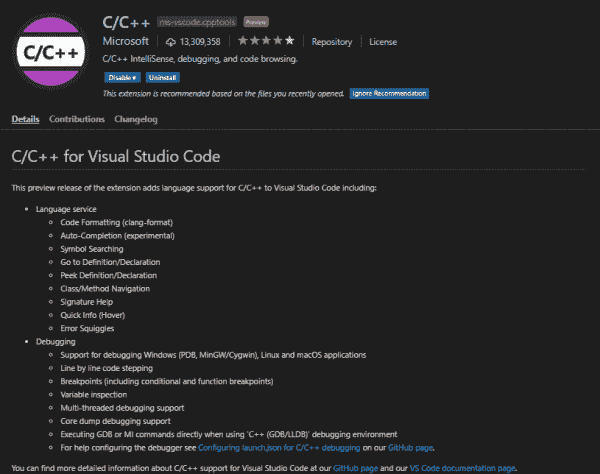](https://cdn.sparkfun.com/assets/learn_tutorials/8/2/5/c__-extension-install.png)

您还可以使用 IDE 中的“扩展”浏览器(查看->扩展，或者单击左边栏中的方形图标)来搜索或浏览其他扩展。

安装扩展应该像在 Visual Studio Marketplace 页面上或者从 IDE 的扩展浏览器中单击 install 一样简单。

## Arduino 库开发的 VS 代码

如果你熟悉 VS 代码，你会明白它的灵活性意味着 IDE 可以用于任何编程语言。本节将帮助您设置 VS 代码，以在 Arduino 库中开发 C、C++或其他源文件。

### 在 VS 代码中打开 Arduino 库

要继续学习，您需要在您的机器上安装一个 Arduino 库。如果你想更进一步，下载我们的 [BME280 Arduino 库](https://github.com/sparkfun/SparkFun_BME280_Arduino_Library)，这就是我们要用的一个例子。

将库下载到 Arduino Sketchbook 的“libraries”文件夹中。我们推荐使用 git 下载。这将特别展示 VS Code 的源代码控制能力。查看我们的[使用 GitHub](https://learn.sparkfun.com/tutorials/using-github) 教程，获得使用 git 下载库的帮助。或者，你可以使用 GitHub 网页界面中的“克隆或下载”>“下载 ZIP”按钮来下载库。

打开 VS 代码，然后导航到**文件** > **打开文件夹，打开你的 Arduino 库文件夹...**。(或者点击 CTRL+K，然后点击 CTRL+O。)

[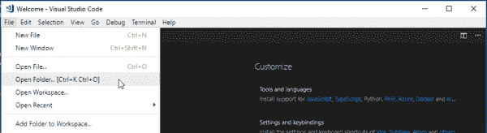](https://cdn.sparkfun.com/assets/learn_tutorials/8/2/5/vs-code-open-folder.png)

然后选择您想要在 IDE 中打开的 Arduino 库文件夹。它应该是库的顶级目录，其中包含“src”和“examples”目录。

[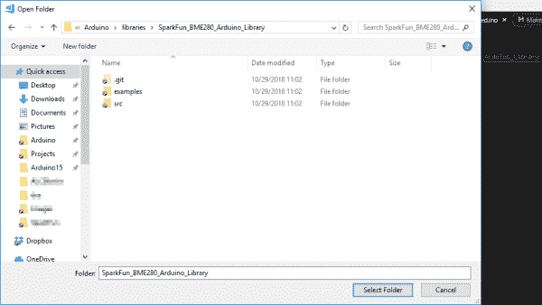](https://cdn.sparkfun.com/assets/learn_tutorials/8/2/5/opening-arduino-library-folder-2.png)

这将打开一个新的 VS 代码窗口。重要的是，您应该注意到左边的文件导航器显示了标准的 Arduino 库文件结构(“examples”、“src”、“kewords.txt”等)。).你可以点击“src”文件夹，双击“cpp”和/或“h”文件打开它们。你也可以**分割你的窗口**。我喜欢把我的“h”文件放在右边，把“cpp”文件放在左边。要移动文件，只需将它的标签拖到窗口的另一边。

[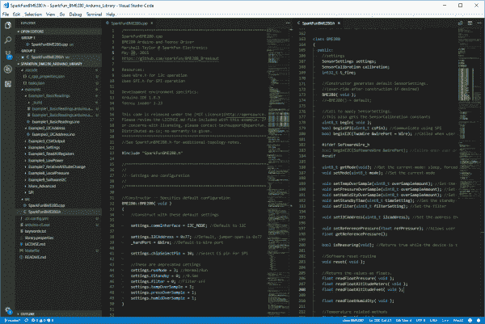](https://cdn.sparkfun.com/assets/learn_tutorials/8/2/5/vs-code-simple-open-bme280-2.png)

### 修改 *c_cpp_properties.json*

当你第一次打开一个 Arduino 库文件夹时，如果你点击窗口底部的“问题”标签，你会看到一些错误。其中大部分可能是由于 VS 代码环境不知道你的 Arduino 核心文件安装在哪里。找到这些文件将允许你深入挖掘 Arduino 定义，找出字符串、串行、数字读取等。定义了类和函数。

要设置这些位置，请按 CTRL+SHIFT+P，然后键入:“C/CPP:Edit configuration”——或者至少开始键入，然后在正确的设置突出显示时按 enter。

[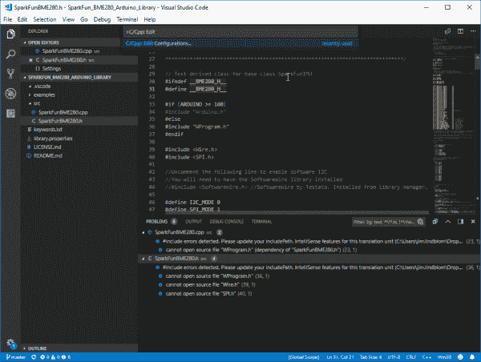](https://cdn.sparkfun.com/assets/learn_tutorials/8/2/5/vs-code-create-c-cpp-properties.png)

这将创建一个名为“c_cpp_properties.json”的文件，该文件将存储在一个。vscode”文件夹。这个文件告诉 VS 代码 IDE 在哪里寻找函数引用、定义等等。如果你告诉它你的 Arduino 内核、库和编译器的位置，你应该能够使用 IDE 的 **Go to Definitions** 特性进行回溯。

当使用安装了标准库的 Arduino Uno 时，这是我的 c_cpp_properties.json 文件:

```
language:Javascript
{
    "configurations": [
        {
            "name": "Win32",
            "includePath": [
                "${workspaceFolder}/**",
                "C:/Program Files (x86)/Arduion/hardware/arduino/avr/cores/arduino",
                "C:/Program Files (x86)/Arduino/hardware/arduino/avr/libraries/EEPROM/src",
                "C:/Program Files (x86)/Arduino/hardware/arduino/avr/libraries/HID/src",
                "C:/Program Files (x86)/Arduino/hardware/arduino/avr/libraries/SoftwareSerial/src",
                "C:/Program Files (x86)/Arduino/hardware/arduino/avr/libraries/SPI/src",
                "C:/Program Files (x86)/Arduino/hardware/arduino/avr/libraries/Wire/src",
                "C:/Program Files (x86)/Arduino/hardware/arduino/avr/libraries/SPI/src"
            ],
            "defines": [
                "_DEBUG",
                "UNICODE",
                "_UNICODE",
                "F_CPU=16000000L",
                "ARDUINO=10805",
                "ARDUINO_AVR_UNO",
                "ARDUINO_ARCH_AVR"
            ],
            "compilerPath": "C:/Program Files (x86)/Arduino/hardware/tools/avr/bin/avr-gcc.exe",
            "cStandard": "c11",
            "cppStandard": "c++17",
            "intelliSenseMode": "clang-x64"
        }
    ],
    "version": 4
} 
```

请随意将上述内容复制到您的属性文件中并保存。如有必要，请确保修改目录位置。您可能需要重新启动 IDE 才能使 Intellisense 正常工作。

使用该设置，尝试导航到核心或库 Arduino 函数调用。右击它，说“去定义”。

[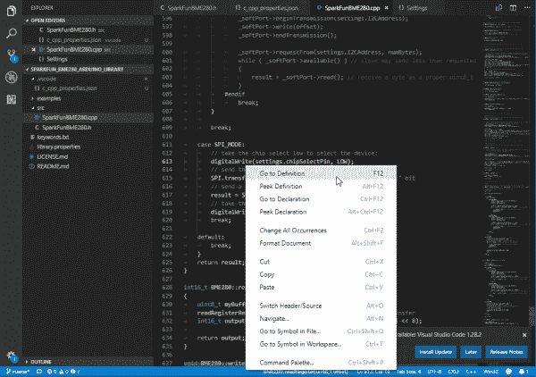](https://cdn.sparkfun.com/assets/learn_tutorials/8/2/5/go-to-definitions.png)

如果你在开发 Arduino 库的时候想利用 Arduino 核心/库所提供的一切，这是一个非常强大的工具。

### 打开终端

VS 代码最强大的特性之一是它支持多种集成终端。即使您在 Windows 上，您也可以将这个终端用作 bash shell、Cygwin 接口，当然，也可以用作 Windows 命令行提示符。

你可以通过进入视图>终端(或 CTRL+`)来打开终端。

[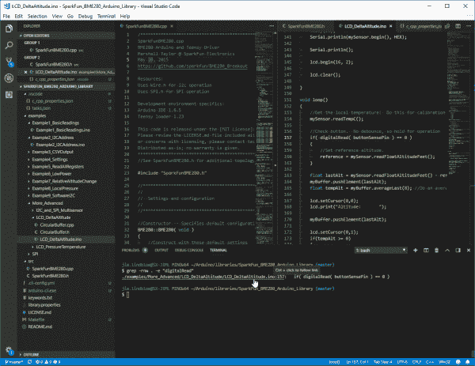](https://cdn.sparkfun.com/assets/learn_tutorials/8/2/5/vs-code-terminal-usage.png)*Using the terminal to search for text. Notice the CTRL+Click feature! So powerful.*

#### 定义您的终端

您可以通过进入**设置**窗口，然后**功能** > **终端** > **外部**来修改终端可执行文件。这里的可执行文件应该与您想要使用的终端相匹配。

我经常发现自己在终端之间切换，这取决于我的项目。但我在这里最常见的设置是:

*   Windows CMD: `C:\Windows\System32\cmd.exe` -许多特定于 Windows 的可执行文件仍然需要 Windows CMD。如果您使用 VS 代码的 Windows 安装，这应该是您的默认设置。
*   Git Bash: `C:\Program Files\Git\bin\bash.exe` -我喜欢 [git](https://git-scm.com/) 的 Windows 安装。主要是因为我喜欢它安装在我的 Windows 机器上的 Unix 风格的 bash。我可以用它来“grep”、“find”、“rm”、“cp”，或者在我名义上的 Windows 系统上执行各种其他 Unix 命令。
    *   注意这个选项确实需要你安装 [Git for Windows](https://git-scm.com/download/win) 。

关于使用和修改 VS Code 的集成终端的更多信息，请查看他们的文档。

## Arduino CLI 简介

既然你已经有了用 Arduino 库进行 VS 代码配对的速成课程，那么是时候深入本教程的第二个特色工具了:Arduino CLI。

Arduino CLI 是一个命令行界面，它将 Arduino IDE 的所有功能打包成一个简单的基于文本的工具。使用 Arduino CLI，您可以构建草图、上传程序、下载库或电路板定义，以及做更多更多的事情。最重要的是，Arduino CLI 为我们提供了一个命令行界面，可以从 VS 代码中触发来构建和上传 Arduino 草图。

### 下载 Arduino CLI

Arduino CLI 仍处于开发的初级阶段。你可以在这里从 GitHub 资源库下载最新的“alpha”版本:[https://GitHub . com/arduino/arduino-CLI # download-the-latest-unstable-alpha-preview](https://github.com/arduino/arduino-cli#download-the-latest-unstable-alpha-preview)。

[Download the Arduino CLI](https://github.com/arduino/arduino-cli#download-the-latest-unstable-alpha-preview)

这个下载包是一个简单的可执行文件，您需要直接从命令提示符中提取和调用它。我发现直接复制并放置在我的 Arduino 项目文件夹中很方便。(希望有一天，在它出了 alpha 版之后，Arduino CLI 将被打包成一个完整的安装程序！)

### 生成 Arduino CLI 配置文件

这可能只是一个 alpha 错误，但我机器上的 Arduino CLI 很难找到我的 Arduino sketchbook 和 board manager 安装。为了帮助 Arduino CLI 找到您以前安装的 Arduino，创建一个 Arduino CLI 配置文件会有所帮助。这个配置文件是以 [YAML](https://en.wikipedia.org/wiki/YAML) 格式定义的。

要创建基本配置文件，您可以使用 Arduino CLI。打开命令提示符并键入:

```
language:shell
arduino-cli.exe config init 
```

(请注意，`arduino-cli.exe`可能需要重命名为类似于`arduino-cli-0.2.2-alpha.preview-windows.exe`的名称，或者您下载的任何版本。)

该命令将创建一个名为**的新文件。cli-config.yml** 。在这个配置文件中要修改的最重要的参数有:

*   **`sketchbook_path`**——应该匹配你的 **Arduino sketchbook** 的目录。这是安装所有手动库和硬件定义的地方。
*   **`arduino_data`**——应该匹配你的 Arduino 板和库管理器的安装位置。在大多数情况下，这应该不需要改变。

其他选项通常可以保持默认值。

### 使用 Arduino CLI

Arduino CLI GitHub 存储库中的[自述文件](https://github.com/arduino/arduino-cli/blob/master/README.md)包含了该工具特性和功能的概要。我们强烈建议在继续之前浏览自述文件。试试 Arduino CLI 吧！看看它的能力。

[Arduino CLI README](https://github.com/arduino/arduino-cli/blob/master/README.rst)

以下是您开始使用该工具时可以提供的几个关键选项:

#### 创建新草图

简单介绍一下，Arduino CLI 可以使用`sketch`选项创建一个新的空白草图:

```
language:shell
arduino-cli sketch new cli_test 
```

这将在 Arduino sketchbook 中创建一个名为“cli_test”的新文件夹和文件

#### 编写草图

`arduino-cli`的`compile`功能可用于为任何支持的电路板编译草图。该功能需要的关键选项是**板类型**，可以提供一个`--fqbn`(全限定板名)选项。

支持的`fqbn`取决于您安装的主板，但这里有一些常见的选项:

*   Arduino Uno : `arduino:avr:uno`
*   Arduino Mega : `arduino:avr:mega`
*   [SparkFun RedBoard](https://www.sparkfun.com/products/13975) 或 [SparkFun BlackBoard](https://www.sparkfun.com/products/14669) : `SparkFun:avr:RedBoard`
    *   (要求安装 SparkFun avr 板定义。)
*   [SparkFun SAMD21 Mini](https://www.sparkfun.com/products/13664) : `SparkFun:samd:samd21_mini`
    *   (要求安装 SparkFun samd 板定义。)

你会注意到，`fqbn`值采用了*制造商* : *架构* : *板*的格式。

此示例命令编译我们刚刚为 Arduino Uno 创建的草图:

```
language:shell
arduino-cli compile --fqbn arduino:avr:uno C:/Users/user.name/Documents/Arduino/cli_test 
```

(注意:您需要将 Arduino sketchbook 目录换成上面示例中的“C:/Users/user . name/Documents/Arduino/”。)

[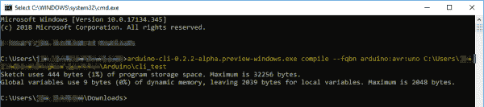](https://cdn.sparkfun.com/assets/learn_tutorials/8/2/5/arduino-cli-compile-cmd.png)

您可以向该命令添加各种有趣的标志，包括:

*   **冗长** : `-v` -如果你想看到所有的选项和文件都被编译到你的草图中，这很有用。
*   **构建路径**:`--build-path [string]`——如果你想存储编译后的对象和十六进制文件，这很有用。
    *   注意:在我的 Windows 机器上，至少，这个参数的值需要是一个完整的路径(没有亲戚)。

#### 上传草图

一旦你完成了草图，你就可以上传了。与编译命令一样，上传命令需要一个 FQBN。它也在一个串口上传到，设置使用`-p`选项。

这里有一个基于上一个例子的命令，上传到 COM18 上的 Windows COM 端口:

```
language:shell
arduino-cli upload -p COM18 --fqbn -v arduino:avr:uno C:/Users/user.name/Documents/Arduino/cli_test 
```

如果一切顺利，你的 Arduino 应该开始闪烁其 RX/TX led，它应该很快开始运行一个空白草图。

## 用 Arduino CLI 装备 VS 代码

既然您已经掌握了 VS 代码和 Arduino CLI，那么是时候将它们组合成一个单一的、无 Arduino 的 Arduino IDE 了！如果您想跟随，我们将使用 VS 代码部分中的 Arduino 库示例来构建一个 Arduino 接口。

有几种方法可以处理这种集成，并且各有利弊。第一个依赖于 VS Code 的[任务集成](https://code.visualstudio.com/docs/editor/tasks)，它提供了一个简单的键绑定接口来触发任何命令行工具。第二个使用 Makefiles 调用 Arduino CLI 这个例子有点复杂，但是提供了更多的灵活性。

### 选项 1:修改 tasks.json

在打开的 VS 代码窗口中，导航到**终端** > **运行构建任务**。这将提示您创建一个新文件——“tasks . JSON”——方法是在顶部的焦点窗口中按几次 Enter。

[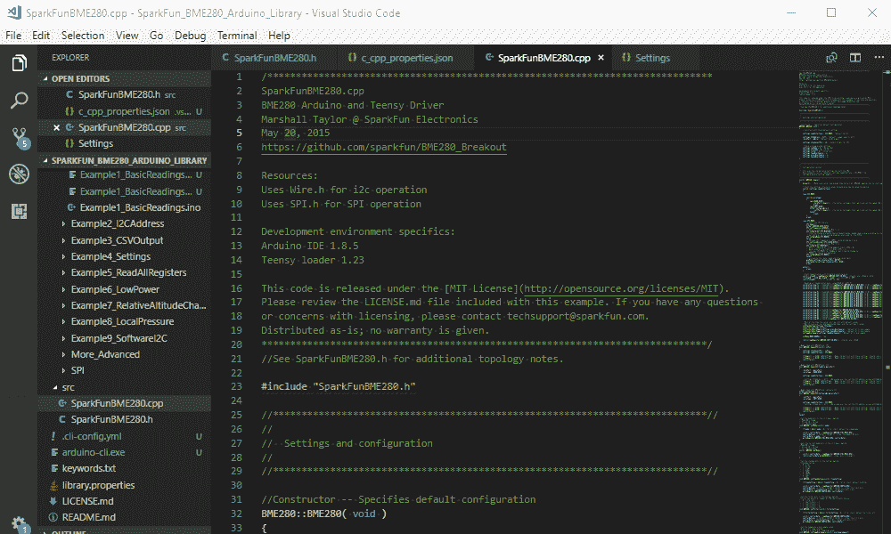](https://cdn.sparkfun.com/assets/learn_tutorials/8/2/5/create-tasks-animated.gif)

用如下内容覆盖该文件的内容:

```
language:JSON
{
    // See https://go.microsoft.com/fwlink/?LinkId=733558
    // for the documentation about the tasks.json format
    "version": "2.0.0",
    "tasks": [
        {
            "label": "Example1",
            "type": "shell",
            "command": "arduino-cli compile -v -b arduino:avr:uno examples/Example1_BasicReadings",
            "group": "build",
            "isBackground": false,
            "presentation": {
                "echo": true,
                "reveal": "always",
                "focus": false,
                "panel": "shared",
                "showReuseMessage": true
            },
            "problemMatcher": []
        },
        {
            "label": "Example1-program",
            "type": "shell",
            "command": "arduino-cli upload -p COM18 -v --fqbn arduino:avr:uno examples/Example1_BasicReadings",
            "group": "test",
            "isBackground": false,
            "presentation": {
                "echo": true,
                "reveal": "always",
                "focus": false,
                "panel": "shared",
                "showReuseMessage": true
            },
            "problemMatcher": []
        }
    ]
} 
```

上面的示例任务文件创建了两个新任务:一个用于构建，一个用于测试(编程)。这两个任务的关键是它们的“标签”、“组”和“命令”参数。

在这两个选项的“命令”参数中，您会看到一些熟悉的 arduino-cli 命令行结构。一个“示例 1”编译代码，另一个“示例 1-程序”上传代码。

您可能需要编辑这些命令参数中的一些值:上传端口和 arduino-cli 位置，最重要的是。您可能还需要修改 FQBN 值来选择您正在使用的电路板。

设置了 tasks.json 文件后，尝试返回到**终端** > **运行构建任务**——您应该会看到“Example1”的选项单击该按钮，Arduino CLI 将被调用并开始编译。您将看到编辑器底部弹出一个终端窗口，希望您不会遇到任何错误。

[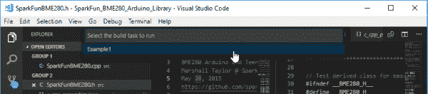](https://cdn.sparkfun.com/assets/learn_tutorials/8/2/5/vs-code-run-example1.png)

也可以通过进入**终端** > **运行任务** > **实例 1-程序**来上传代码。这将调用我们在上面的任务文件中定义的第二个任务。

### 选项 2: Makefile 定制

如果你的系统安装了[GNU Make](https://www.gnu.org/software/make/)(Windows 用户:查看 [Make for Windows](http://gnuwin32.sourceforge.net/packages/make.htm) )创建一个定制的 makefile 提供了一个更灵活的开发解决方案。

尝试一下，在 Arduino 库的顶层目录中创建一个名为 **Makefile** 的文件。在该文件中，粘贴如下内容:

```
language:Makefile
# Arduino Library base folder and example structure
EXAMPLES_BASE = examples
EXAMPLE ?= Example1_BasicReadings

# Arduino CLI executable name and directory location
ARDUINO_CLI = arduino-cli
ARDUINO_CLI_DIR = .

# Arduino CLI Board type
BOARD_TYPE ?= arduino:avr:uno

# Default port to upload to
SERIAL_PORT ?= COM18

# Optional verbose compile/upload trigger
V ?= 0
VERBOSE=

# Build path -- used to store built binary and object files
BUILD_DIR=_build
BUILD_PATH=$(PWD)/$(EXAMPLES_BASE)/$(EXAMPLE)/$(BUILD_DIR)

ifneq ($(V), 0)
    VERBOSE=-v
endif

.PHONY: all example program clean

all: example

example:
    $(ARDUINO_CLI_DIR)/$(ARDUINO_CLI) compile $(VERBOSE) --build-path=$(BUILD_PATH) --build-cache-path=$(BUILD_PATH) -b $(BOARD_TYPE) $(EXAMPLES_BASE)/$(EXAMPLE)

program:
    $(ARDUINO_CLI_DIR)/$(ARDUINO_CLI) upload $(VERBOSE) -p $(SERIAL_PORT) --fqbn $(BOARD_TYPE) $(EXAMPLES_BASE)/$(EXAMPLE)

clean:
    @rm -rf $(BUILD_PATH)
    @rm $(EXAMPLES_BASE)/$(EXAMPLE)/*.elf
    @rm $(EXAMPLES_BASE)/$(EXAMPLE)/*.hex 
```

这个 makefile 为调用 Arduino CLI 和构建/上传库中的各种示例提供了一些选项。它非常简单，但是完成了我们设定的目标。

作为最简单的例子，尝试执行:

```
make EXAMPLE=Example1_BasicReadings 
```

这将构建该库中的第一个示例。你也可以添加触发器，比如`V=1`用于详细编译/上传，或者`BOARD_TYPE`用于指定你正在为哪个 Arduino 板编译。

[](https://cdn.sparkfun.com/assets/learn_tutorials/8/2/5/make-build-example1.gif)

同样，**上传**构建好的 Arduino 草图也有一个 make 目标。尝试类似这样的内容:

```
make program EXAMPLE=Example1_BasicReadings SERIAL_PORT=COM18 
```

这将采用我们刚刚编译的相同示例，并将其上传到 COM18 上的 Arduino。

#### 为 Makefile 分配任务

基于第一个选项，您可以使用 VS 代码的任务快速调用 Makefile 命令。代替“命令”字符串，尝试添加一个`make`调用或`make program`来运行“测试”

```
language:JSON
{
    // See https://go.microsoft.com/fwlink/?LinkId=733558
    // for the documentation about the tasks.json format
    "version": "2.0.0",
    "tasks": [
        {
            "label": "make current example",
            "type": "shell",
            "command": "make EXAMPLE=${fileBasenameNoExtension}",
            "group": "build",
            "isBackground": false,
            "presentation": {
                "echo": true,
                "reveal": "always",
                "focus": false,
                "panel": "shared",
                "showReuseMessage": true
            },
            "problemMatcher": []
        },
        {
            "label": "program current example",
            "type": "shell",
            "command": "make program EXAMPLE=${fileBasenameNoExtension}",
            "group": "test",
            "isBackground": false,
            "presentation": {
                "echo": true,
                "reveal": "always",
                "focus": false,
                "panel": "shared",
                "showReuseMessage": true
            },
            "problemMatcher": []
        }
    ]
} 
```

这个示例使用 VS 代码的[变量引用](https://code.visualstudio.com/docs/editor/variables-reference)来告诉任务构建当前打开的示例草图。(注意:您需要在示例草图中打开光标，否则这个构建任务将会失败。)

VS Code 的 tasks 实用程序的特别强大之处在于它可以通过 keybinds 快速访问。您可以按下 **CTRL+SHIFT+B** 然后输入(或者键入您想要运行的任务)，并立即开始构建一个示例。默认情况下，测试任务没有被绑定，但是您可以使用 VS 代码的键盘快捷键(CTRL+K CTRL+S)并修改“运行测试任务”来改变这一点。

按键绑定是 VS 代码背后的真正力量——你可以不用触摸鼠标就能做这么多事情！

## 资源&更进一步

感谢您和我们一起体验 VS 代码和 Arduino CLI 的世界。我们希望这种配对，或者类似的配对，将有助于把你的 Arduino 开发提升到另一个水平。

有关 VS 代码和 Arduino CLI 的更多资源，请查看以下链接:

*   [Visual Studio 代码文档中心](https://code.visualstudio.com/docs)
*   [用 Visual Studio 进行 C/C++编程](https://code.visualstudio.com/docs/languages/cpp)
    *   强烈推荐使用 IDE 阅读[导航代码](https://code.visualstudio.com/docs/languages/cpp#_navigating-code)。这是该软件如此强大的一部分。
*   Arduino CLI GitHub 存储库
*   [来自 NYU ITP 的 Arduino CLI 教程](https://itp.nyu.edu/physcomp/resources/using-the-arduino-command-line-interface/)

如果您想留下任何反馈，请不要犹豫对本教程发表评论。

## 寻找合适的 Arduino？

查看我们的 **[Arduino 对比指南](https://www.sparkfun.com/standard_arduino_comparison_guide)** ！我们已经编译了我们携带的每个 Arduino 开发板，因此您可以快速比较它们，找到最适合您需求的开发板。

带我去那里！

