# EL 电线发光狗线束

> 原文：<https://learn.sparkfun.com/tutorials/el-wire-light-up-dog-harness>

## 介绍

无论是为了让 Fido(或我的情况下，马利)在冒险中可见，还是作为一个可怕的全年服装，一个亮灯的狗挽具是你最喜欢的小狗的绝佳配件。

[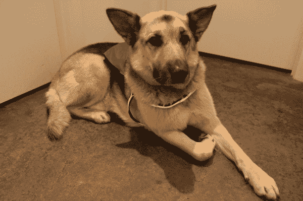](https://cdn.sparkfun.com/assets/learn_tutorials/6/0/LightUpDogHarness_FinalTest.JPG)

EL wire 是可穿戴灯的绝佳选择。它保持凉爽，有弹性，并且有许多不同的颜色。这个设计使用了 [SparkFun EL Sequencer](https://www.sparkfun.com/products/11323) 在外面足够暗的时候自动打开 EL 线，所以你不用担心找到狗先生来打开 on 系统。

### 材料

这是制作这个项目所用的所有零件和工具的清单。

#### 电子学

[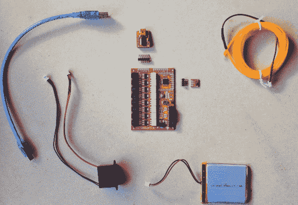](https://cdn.sparkfun.com/assets/learn_tutorials/6/0/Materials_Electronics.JPG)

*   [EL 电线](https://www.sparkfun.com/search/results?term=el+wire&_ga=1.61978479.273388466.1418147030)
    *   El 线有多种颜色，挑你喜欢的吧！
*   [EL 序列发生器](https://www.sparkfun.com/products/11323)
*   [锂离子电池](https://www.sparkfun.com/products/8483)
*   [5V FTDI BOB](https://www.sparkfun.com/products/9716) (或电缆)
*   [DC 至交流逆变器- 3V](https://www.sparkfun.com/products/10201)
*   [环境光传感器](https://www.sparkfun.com/products/8688)
*   [可堆叠接头引脚](https://www.sparkfun.com/products/553)(总共 8 个:5 个用于 FTDI 摆锤，3 个用于光传感器)
*   三(3)根[公母试验板线](https://www.sparkfun.com/products/9385)
*   注意:如果 EL 线、电池和逆变器没有连接器，请购买三(3)个 JST 连接器。

#### 线束材料

[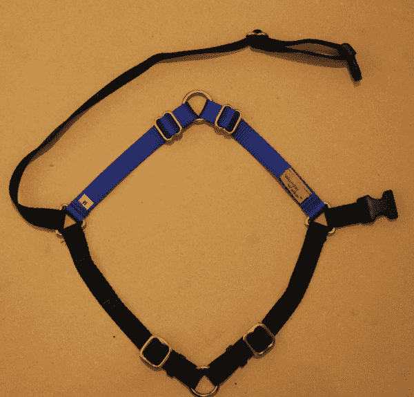](https://cdn.sparkfun.com/assets/learn_tutorials/6/0/Materials_DogHarness.JPG)

*   狗挽具
    *   背心或背包也可以
*   带口袋的防水夹克
*   可选:特百惠或其他可密封的塑料容器

### 工具

[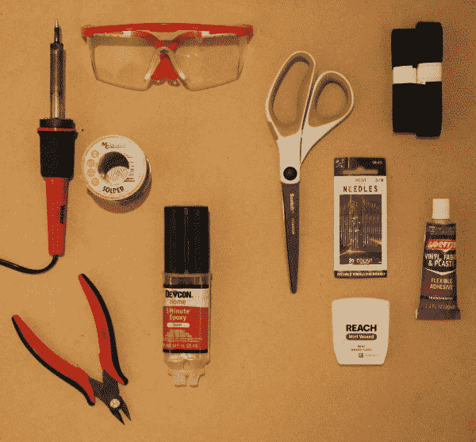](https://cdn.sparkfun.com/assets/learn_tutorials/6/0/Tools.JPG)

*   防护眼镜
*   烙铁
*   钢丝钳/剥线钳
*   环氧树脂(防水)
*   剪刀
*   针+线或织物粘合剂
*   可选:Velcro

### 推荐阅读

如果你对电子学、EL wire 或 EL Sequencer 不熟悉，或者想了解这个项目中主要组件的更多信息，请查看本教程:

*   [EL 序列器入门](https://www.sparkfun.com/tutorials/353)

由于这种设计也使用锂离子电池，我也推荐阅读[本教程](https://www.sparkfun.com/tutorials/241)来给你一个关于正确保养和处理锂电池的概述。

## 装配

**注意:**虽然是小电流，但是 EL 线是靠高压交流电(100 VAC)运行的。EL 序列器板上有外露的连接，因此在处理板时要小心。在触摸电路板的任何部分之前，一定要反复检查电源开关是否关闭。对于最终项目，建议用环氧树脂、热熔胶、绝缘胶带或其他绝缘材料涂覆所有暴露的连接。

1.  用 EL 线测试 EL 序列器。将 EL 电线、逆变器和电池连接到 EL 序列器。打开电源开关，检查 EL 线是否打开(应该闪烁)。您可以连接和控制多达 8 股不同的 EL 电线。

    [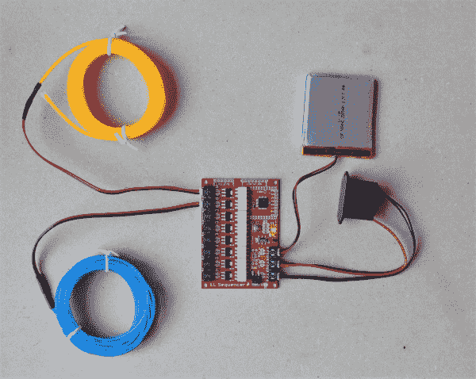](https://cdn.sparkfun.com/assets/learn_tutorials/6/0/ELSeqTest.JPG)
2.  将接头引脚焊接到 EL 序列器上的 5V FTDI 针孔上。

    [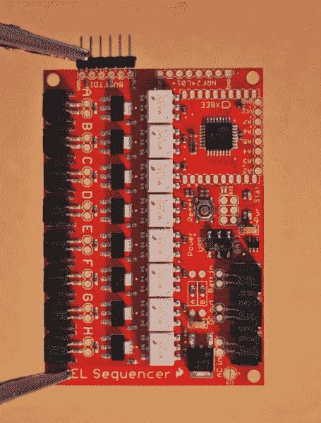](https://cdn.sparkfun.com/assets/learn_tutorials/6/0/ELSeq_HeaderPins1.JPG)
3.  将接头引脚焊接到“GND”、“VCC”和“A2”针孔 EL 序列器(右侧)。

    [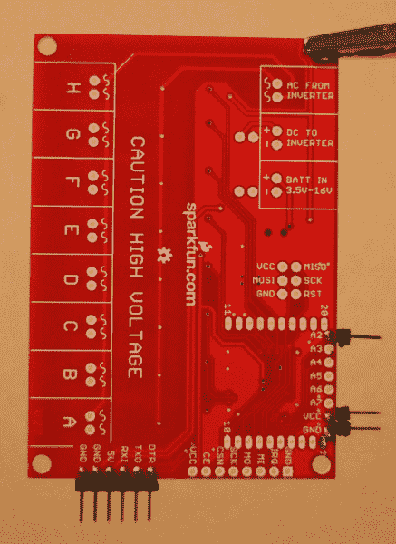](https://cdn.sparkfun.com/assets/learn_tutorials/6/0/ELSeq_LightSensorPins.JPG)
4.  将试验板电线的公端焊接到环境光传感器上。用环氧树脂涂覆传感器上暴露的金属(不要涂覆实际的传感器)。

    注意:建议将引脚焊接在传感器的底部，以便传感器可以更容易地连接到线束(发现这一点很难..).

    [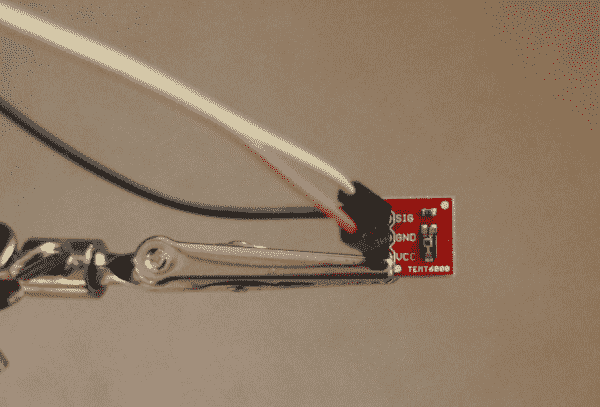](https://cdn.sparkfun.com/assets/learn_tutorials/6/0/LightSensor_Wires.JPG)
5.  将 EL 电线连接到线束上。

    [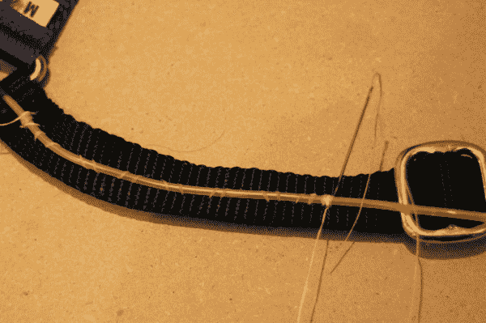](https://cdn.sparkfun.com/assets/learn_tutorials/6/0/ELWire_Start.JPG)

    用牙线将 EL 线缝到线束上，形成牢固、持久的结合。也可以使用合适的织物粘合剂。

    [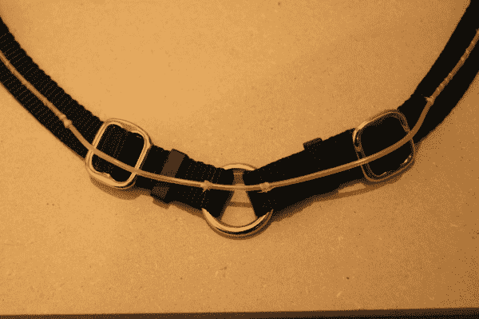](https://cdn.sparkfun.com/assets/learn_tutorials/6/0/ELWire_StrapsBuckles.JPG)*For straps/buckles: leave about 1" of unadhered EL wire on either side of the strap/buckle.*

    你可以把电线整个包起来，也可以把它剪断，然后把两端绝缘。

    [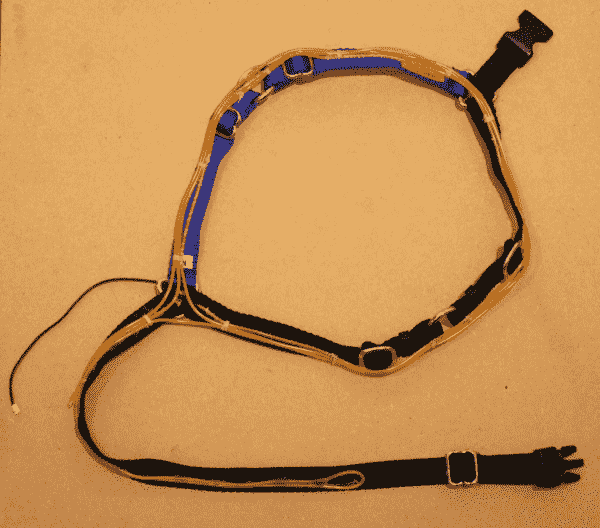](https://cdn.sparkfun.com/assets/learn_tutorials/6/0/ELWire_Wrapped.JPG)
6.  为电子产品制作一个耐用的袋子。

    对于防水袋，在防水夹克上剪一个口袋。我还在袋子里放了一个小塑料容器来存放电子产品，以进一步隔离和保护它们免受天气和狗的影响。

    [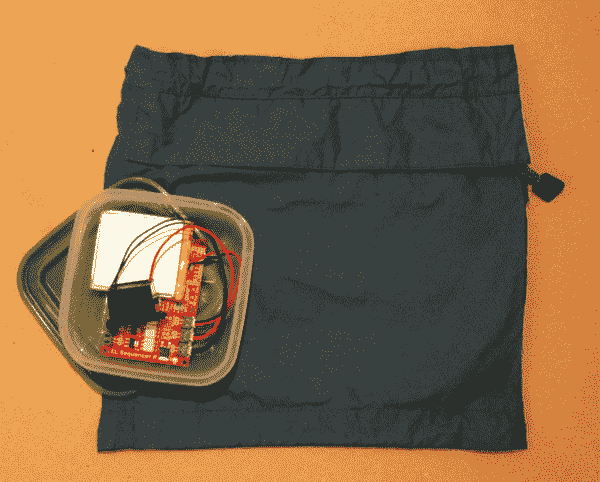](https://cdn.sparkfun.com/assets/learn_tutorials/6/0/Materials_HarnessPouch.JPG)
7.  将电子袋连接到线束上。

    把袋子缝在安全带的上面，或者任何对你的小狗来说舒适和实用的地方。建议给狗套上挽具，为袋子找到一个合适的位置。

    [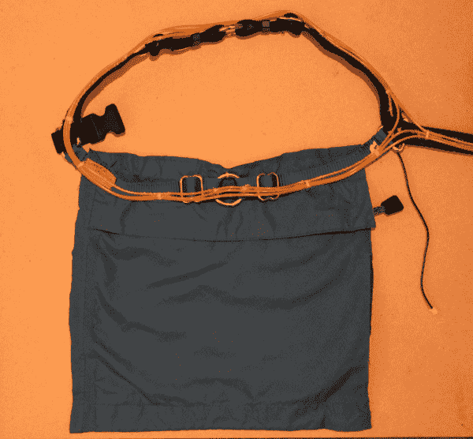](https://cdn.sparkfun.com/assets/learn_tutorials/6/0/HarnessPouchFront.JPG)
8.  在袋子的下面为 EL 线 JST 连接器和光传感器线切一些小孔。

    [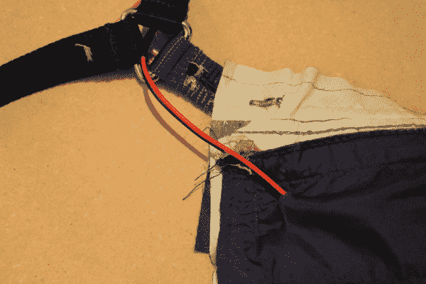](https://cdn.sparkfun.com/assets/learn_tutorials/6/0/HarnessPouchBack_WireSlit.JPG)
9.  将光传感器连接并固定到线束上。建议在狗狗身上系上安全带，并标记光传感器的位置，使其朝上。

    雨衣口袋里有一个理想的口盖，我可以在上面剪一个洞，把传感器穿过去，然后在另一边涂上环氧树脂。你也可以使用 velcro，或者将光传感器缝在口袋或挽具上，只要确保它保持静止，不会在狗移动时被遮住。

    [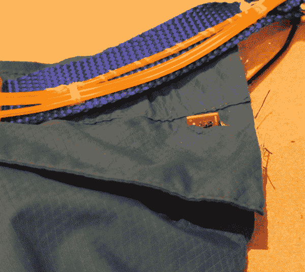](https://cdn.sparkfun.com/assets/learn_tutorials/6/0/HarnessPouch_LightSensor.JPG)
10.  如果使用塑料制品，在塑料制品上切割或钻孔，用于 EL 电线 JST 连接器和光传感器电线。

    如果您不使用 tuperware，建议为电子设备和/或环氧树脂所有连接(JST 连接器除外)加垫，以保护它们免受您的狗的恶作剧。

    [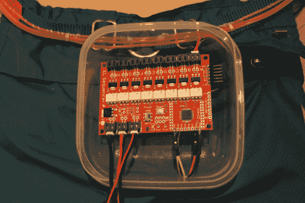](https://cdn.sparkfun.com/assets/learn_tutorials/6/0/HarnessPouch_Tupperware_Connected.JPG)
11.  将 EL 电线和光传感器连接到 EL 序列器(通过 tuperware 上的孔)，然后用环氧树脂将孔固定住，并保持防水密封。

    [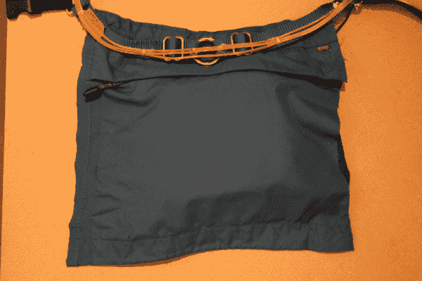](https://cdn.sparkfun.com/assets/learn_tutorials/6/0/HarnessPouch_Complete.JPG)

## 编程；编排

现在是给电子设备编程的时候了。

通过 5V FTDI BOB 或电缆将 EL Sequencer 连接到计算机。

使用 Arduino 平台对 EL 序列器进行编程；EL 序列发生器在 8 MHz 和 3.3V 下运行 ATmega 328p。

编写一个程序来读入环境光传感器的模拟值，以对应于低光的值打开适当的 EL 线通道，并在光传感器值高于低光阈值时关闭。

以下是带有预设光阈值的 Arduino 草图示例:

```
language:c
// EL Wire Dog Harness Program
// Turn EL wire on when ambient light is low.
// JenFoxBot
// Based on test sketch by Mike Grusin, SparkFun Electronics

void setup() {
  Serial.begin(9600);  
  // The EL channels are on pins 2 through 9
  // Initialize the pins as outputs
  pinMode(2, OUTPUT);  // channel A  
  pinMode(3, OUTPUT);  // channel B   
  pinMode(4, OUTPUT);  // channel C
  pinMode(5, OUTPUT);  // channel D    
  pinMode(6, OUTPUT);  // channel E
  pinMode(7, OUTPUT);  // channel F
  pinMode(8, OUTPUT);  // channel G
  pinMode(9, OUTPUT);  // channel H
  // We also have two status LEDs, pin 10 on the Escudo, 
  // and pin 13 on the Arduino itself
  pinMode(10, OUTPUT);     
  pinMode(13, OUTPUT); 
  pinMode(A2, INPUT);  
}

void loop() 
{
  int x,status;

  //If ambient lighting is too low, turn on EL wire
  if(analogRead(A2) < 50){
    digitalWrite(2, HIGH); //turn EL channel on
    delay(1000); //wait 1 second

    //Keep EL wire on until light sensor reading is greater than 50
    if(analogRead(A2) > 50){
      digitalWrite(2, LOW); //turn EL channel off
      delay(10);
    }

    Serial.println(analogRead(A2)); // Use this to check value of ambient light 

    digitalWrite(10, status);   // blink both status LEDs
    digitalWrite(13, status);
  }
} 
```

检查 EL 线在环境光线较暗时是否打开，在明亮光线下是否关闭。

## 最终产品

将 EL 序列器、逆变器和电池放入袋子(和特百惠塑料)中。将所有组件连接到 EL 序列器，并使用电池电源将其打开。在昏暗和明亮的光线下进行测试，以确保其功能正常。

[](https://cdn.sparkfun.com/assets/learn_tutorials/6/0/LightUpDogHarness_FinalTest.JPG)

如果系统按预期工作，穿上狗，去探索！作为一个额外的奖励，你可以使用电子袋储存其他小的，非磁性物品。尽情享受吧！

[](https://cdn.sparkfun.com/assets/learn_tutorials/6/0/LightUpDogVestV4.JPG)[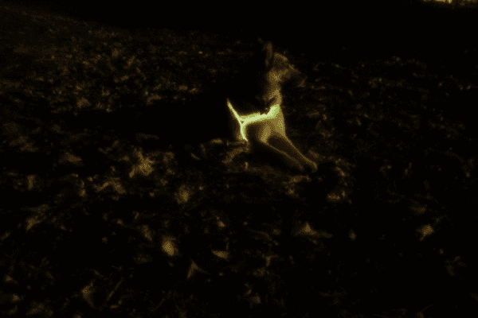](https://cdn.sparkfun.com/assets/learn_tutorials/6/0/LightUpDogVest_FinalV2.JPG)

这里有一段视频。

[https://www.youtube.com/embed/tOhfRe7Ik_Q/?autohide=1&border=0&wmode=opaque&enablejsapi=1](https://www.youtube.com/embed/tOhfRe7Ik_Q/?autohide=1&border=0&wmode=opaque&enablejsapi=1)

## 资源和更进一步

感谢阅读！享受这些其他 SparkFun 教程。EL wire 还有很多其他令人敬畏的用途！查看这个[心跳紧身衣教程](https://www.sparkfun.com/tutorials/130)获得更多灵感。有兴趣使用 EL 序列器的射频功能吗？查看 [SparkFun NRF 收发器突破连接指南](https://learn.sparkfun.com/tutorials/nrf24l01-transceiver-hookup-guide)！

[](https://learn.sparkfun.com/tutorials/nrf24l01-transceiver-hookup-guide) [### nRF24L01+收发器连接指南](https://learn.sparkfun.com/tutorials/nrf24l01-transceiver-hookup-guide) A basic getting started guided to the SparkFun Transceiver Breakout - nRF24L01+[Favorited Favorite](# "Add to favorites") 4[](https://learn.sparkfun.com/tutorials/heartbeat-straight-jacket) [### 心跳直筒夹克](https://learn.sparkfun.com/tutorials/heartbeat-straight-jacket) An EL project that displays one person's heartbeat on another person's costume.[Favorited Favorite](# "Add to favorites") 9

或者看看这篇博文中的一些想法:

[](https://www.sparkfun.com/news/2700 "July 12, 2018: Here at SparkFun, we love our dogs. When we searched deep in our dog-loving hearts, we found one true question: What if they could talk? ") [### 今日英语:挖衣领

July 12, 2018](https://www.sparkfun.com/news/2700 "July 12, 2018: Here at SparkFun, we love our dogs. When we searched deep in our dog-loving hearts, we found one true question: What if they could talk? ")[Favorited Favorite](# "Add to favorites") 4