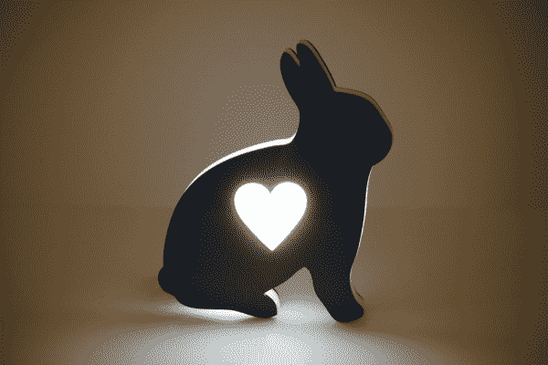
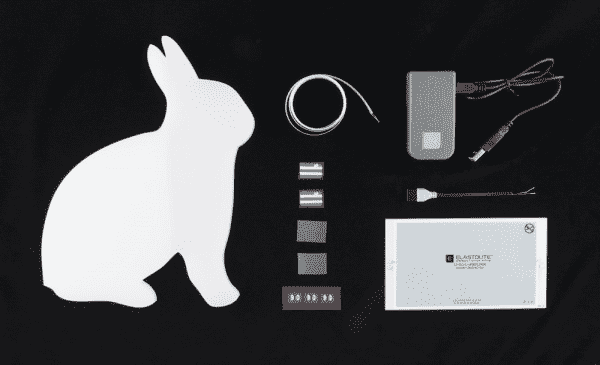

# 弹性夜灯

> 原文：<https://learn.sparkfun.com/tutorials/elasto-nightlight>

## 欢迎光临！

除了一个明显的例外，兔子通常是一种可爱且性情温和的物种，这使它们成为夜灯的完美图标，以安抚孩子们——例如——没有迅猛龙在他们的壁橱里等待夜幕降临，快乐地享用它们的部分。我决定将这个项目作为一种追溯疗法，因为它会让*真的*对我来说派上用场，因为我是一个 9 岁的孩子，刚刚看完我的第一部 PG-13 电影，已经沮丧地了解到迅猛龙不仅可以打开门，而且还可能在我的壁橱里等到夜幕降临时出现，愉快地享用我的部分。

这个项目在婴儿室或者任何你需要额外光线的地方也很棒。

是啊。所以，让我们开始吧！

本教程使用了 [ELastoLite](https://www.sparkfun.com/search/results?term=elastolite) -一种防水、可弯曲、可熨烫的电致发光面板，可以适应任何东西，也非常适合衣服。你可以用这些面板做很多事情。在其他项目中，我们还用它们制作了[美国队长盾](https://www.youtube.com/watch?v=YmYDFzPLMP0)和[发光临时纹身](https://www.youtube.com/watch?v=TS4Y5sNOWKo)。

### 推荐阅读

充分披露:在制作这个项目之前，我从未玩过 ELastoLite，所以如果你想在开始之前阅读更多内容，我建议查看一下 [ELastoLite 连接指南](https://learn.sparkfun.com/tutorials/elastolite-hookup-guide/)和我们的[装配视频](https://www.youtube.com/watch?v=aa3HT1FPj3g)，这两个视频都是我在制作 light 之前大量参考的。其他一些可能有助于您开始这个项目的教程包括:

*   [灯](https://learn.sparkfun.com/tutorials/light)
*   [使用焊线](https://learn.sparkfun.com/tutorials/working-with-wire)

## 夜灯的剖析

以下是我开始时的所有片段:

这里有一个零件的愿望清单，让你不用再猜测了。