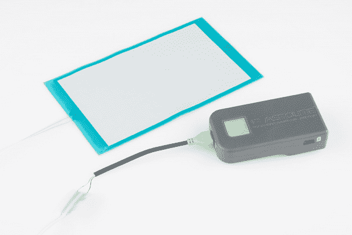
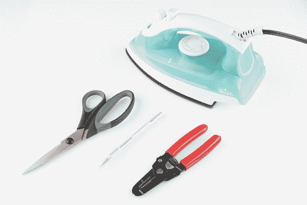
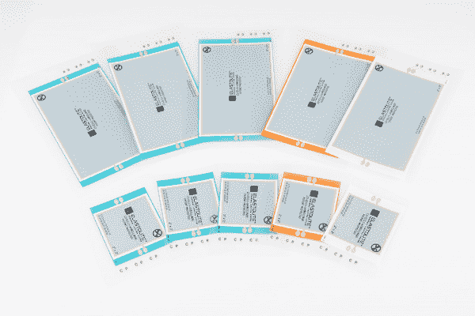
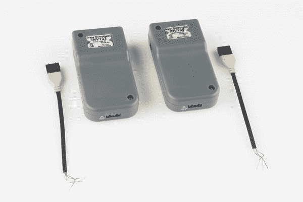
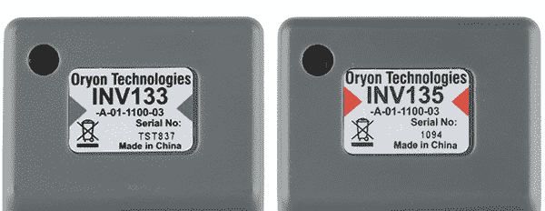
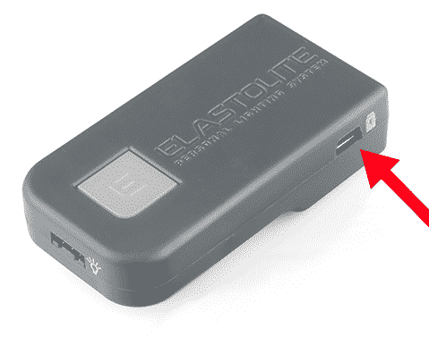
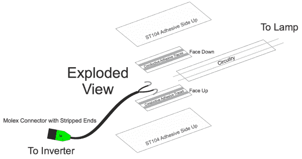
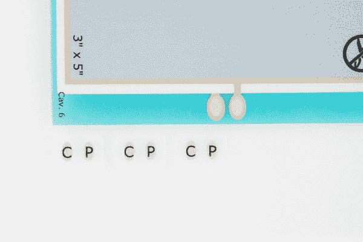

# ELastoLite 连接导轨

> 原文：<https://learn.sparkfun.com/tutorials/elastolite-hookup-guide>

## 弹性体简介

在本教程中，我们将讨论来自 [Oryon Technologies](http://www.oryontech.com/) 的 [ELastoLite EL 灯](https://www.sparkfun.com/search/results?term=ELastoLite)，我们将向您展示如何将一个 ELastoLite 灯连接到一个逆变器。ELastoLite 因其防水外壳和极高的柔韧性而适合用于电子纺织品和可穿戴应用。此外，电路包含在外壳上的熨斗中，允许您将其连接到衣服或材料的内部，从而消除了容易断开或不方便的自由浮动导线。在尝试将 ELastolite 添加到您的服装中之前，您必须阅读整个教程，因为这个过程并不像看起来那么简单，并且有很多不可逆错误的空间。

现在，你可能正在阅读本教程，因为你不知道你的项目需要哪些部分。我们没有为 ELastoLite 准备一个工具包，因为所需的部件会有很大的不同，以至于标准的初学者工具包只会让很少的人受益。本教程旨在帮助您决定需要哪些部件以及如何连接它们。

***注:*** ELastoLite 从交流电中流出，类似于 EL 电线，如果处理不当，它会给你轻微的电击。请小心搬运弹性面板、连接器和逆变器。

### 你会学到的

本教程涵盖的主题包括:

*   规划您的设计
*   选择正确的零件
*   组装技术
*   适当的照顾。

会有少量的数学，但我保证，我们会尽可能地让它变得简单。我们知道不是每个人都像我们一样喜欢数学。

### 推荐阅读

本教程建立在一些之前讨论过的概念之上。如果你对这些不熟悉，请查看相应的教程。

*   什么是电学？
*   [什么是电路？](https://learn.sparkfun.com/tutorials/what-is-a-circuit)
*   [电压、电流、电阻和欧姆定律](https://learn.sparkfun.com/tutorials/voltage-current-resistance-and-ohms-law)
*   [交流电与直流电(DC)](https://learn.sparkfun.com/tutorials/alternating-current-ac-vs-direct-current-dc)
*   [用导电线工作](https://learn.sparkfun.com/tutorials/sewing-with-conductive-thread)

## 所需材料

你要做的第一件事就是收集所有你需要的材料。以下是我们推荐的使用 ELastoLite 的工具和用品清单。

**铁**

你需要一个熨斗。不是烙铁，而是熨斗。熨斗需要棉垫，因为这是粘合连接器的最佳温度。

**爱好刀**

电路将需要被剥去它的盖，在那里连接将被做。一把业余爱好刀会让这一切变得简单。

**蜡纸**

虽然在某些情况下需要连接器连接，并一次性熨烫衣服上的所有物品，但其他情况下一次熨烫一件可能会更容易。蜡纸将有助于保持铁材料粘在你的工作表面。此外，熨烫时将蜡纸放在电路上方有助于你施加太大的压力或保持熨斗太长时间。

**剥线器**

有一个小的机会，你可能不得不剥离逆变器电线一点点。所以，虽然不是必须的，你可能想在手边准备一双鞋。

**耐心**

这可能是一个有点令人沮丧的过程。把你的注意力放在目标上，对自己保持耐心。

## 选择逆变器

选择 ELastoLite 产品时，考虑您的逆变器能提供多大功率非常重要。因此，在您开始购买 ELastoLite 面板之前，您应该查看逆变器选项，以确保您有足够的电力为您项目中想要的所有面板供电。

*An assortment of [ELastoLite panels](https://www.sparkfun.com/search/results?term=ELastoLite+Panel&what=products).*

Oryon technologies 为 SparkFun 提供了这些专为 ELastoLite 设计的出色逆变器。除了可充电之外，这种纽扣非常适合用在衣服上。为了减少在衣服口袋里误按的可能性，需要长时间按下按钮来改变闪光频率或打开或关闭。逆变器有两种尺寸，即 [INV133](https://www.sparkfun.com/products/11914) 和 [INV135](https://www.sparkfun.com/products/11915) 。不要让数字欺骗你，INV133 是两者中更强大的。

*The [INV133 inverter](https://www.sparkfun.com/products/11914) with [connector](https://www.sparkfun.com/products/11913) (left), and the [INV135 inverter](https://www.sparkfun.com/products/11915) with [connector](https://www.sparkfun.com/products/11912) (right).*

你使用哪一个将由你在你的项目中使用多少灯(面板空间)来决定。如果您使用的 ELastoLite 灯的总面积在 ² 中低于 8，那么您需要使用 INV135。在较小的区域使用这种逆变器很重要，因为如果负载不够大，逆变器的内置电路保护可能会跳闸。如果你的总面积在 ² 的 8 和 ² 的 20 之间，那么你要使用 INV133。以上任何区域对于单个逆变器来说都太大，需要两个或更多的组合。这里有一组等式用于计算:

**If Σ A1 + A2 + ... ≤ 8 in² where A = Length*Width use INV135 and an Orange Molex Connector.****If 20 in² ≥ Σ A1 + A2 + ... > 8 in² where A = Length*Width use INV133 and a Green Molex Connector.**

每个面板产品页面上的尺寸应包括每个灯的面积。否则，产品标题中的数字就足够了(例如:3x5 英寸的灯面积为 3*5 或 15 英寸)。

一旦您选择了正确的逆变器，您需要选择 Molex 连接器来搭配逆变器。如果你还没有开始，我建议你开始写材料清单。有两种颜色分别与两个逆变器相关联。我强烈建议购买正确的颜色，因为这将是一个很好的参考，你的电路需要正确供电的逆变器。逆变器具有出色的安全功能，因此较小面积的灯可能不会产生足够的电流来关闭 INV133 的安全功能。此外，INV135 没有足够的功率为一些较大的灯配置供电。购买正确颜色的 Molex 连接器将为您省去很多麻烦。

INV135 对应橙色 Molex 连接器，INV133 对应绿色连接器。您可以通过变频器标签上的颜色再次检查这一点。

### 给逆变器充电

逆变器出厂时已经放电，因此您需要在首次使用前对其充电。只需将随附的 USB Mini B 电缆插入变频器上的 Mini B USB 连接器。当变频器电量不足时，这是重新充电的相同方法。INV133 和 INV135 均以 1100 毫安的电流在 3.7V 下充电。有一个内部电路可以将 5V 输入调节到所需的 3.7V，因此您可以从计算机 USB 端口或 USB 壁式电源插座充电。

## 选择正确的电路

现在，您应该已经挑选出灯具、逆变器和 Molex 连接器。我们现在需要购买电路和连接器来连接它们。下面是 Molex 连接器和电路上的熨斗之间连接的分解图。

**(注意:顶部胶带条的粘合面朝下，而不是如上图所示的朝上。)**

为了进行这种连接，你需要两个[直连接器](https://www.sparkfun.com/products/11920)。一个在上面，另一个在下面。这些将被包裹在[铁胶带](https://www.sparkfun.com/products/11918)的外层中。你只需要 1 个单位。我们出售两英寸长的。当切成两半时，它提供了顶部和底部所需的适当数量。

下一个需要的部分是[电路带](https://www.sparkfun.com/products/11916)，它将提供 Molex 连接器和实际的 [ELastoLite 灯](https://www.sparkfun.com/products/11903)之间的连接。我们卖 3 英尺长的。我不建议建立比这更长的连接。但是，如果您愿意，请重复上面分解图中概述的直连接器连接。不要在一端使用 Molex 导线，使用另一段熨烫电路。这些长度将完全封闭，电路中的导电线需要暴露出来(我们将在后面介绍)。

有助于在电路上的熨斗和灯之间建立连接的接触片将包括在灯内(侧面的小点)。每盏灯都有三个补丁。将使用三个中的两个。第一个将用于建立电路上的熨斗和灯之间的连接。如果有一个以上的灯串，第二个灯串也会这样做。如果没有，接触片将用于覆盖通电时将带电的灯上的接触点。

### 为您的项目购买 ELastoLite 零件

这是各部分及其用途的概述。在本教程中，我将组装一个 3x5 英寸灯和 INV133 逆变器的电路。下面是我们将在下一节使用的零件的愿望清单。你可以随意增减你认为合适的部分。