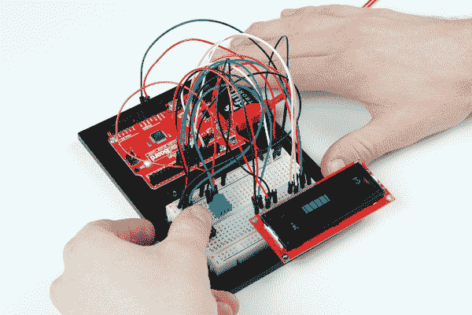

# 无尽的奔跑游戏

> 原文：<https://learn.sparkfun.com/tutorials/endless-runner-game>

## 介绍

通过像 [Temple Run](https://en.wikipedia.org/wiki/Temple_Run) 这样的手机游戏而流行起来的[无尽奔跑](https://en.wikipedia.org/wiki/Platform_game#Endless_running_game)类型的游戏是一种在更大的“平台”类型上极其简单的旋转，在这种游戏中，玩家对不断前进的角色的控制有限。 [Flappy bird](https://en.wikipedia.org/wiki/Flappy_Bird) 虽然通常不被认为是一款“奔跑”游戏，但它是另一款受欢迎的无限平台游戏，对角色的控制有限:用户只能点击屏幕让小鸟向上飞，以便在不断向右移动的同时通过障碍。

我们将使用 Arduino、按钮和字符 LCD 制作我们自己的《无尽的奔跑》游戏。虽然在视觉上不如《神庙逃亡》或《Flappy Bird》吸引人，但它几乎同样令人上瘾。

The code for this game comes from [Joshua Brooks on Instructables](http://www.instructables.com/member/joshua.brooks/). The original project can be found [here.](http://www.instructables.com/id/Arduino-LCD-Game/)

### 所需材料

您可以使用[spark fun Inventor ' s Kit v 4.0](https://www.sparkfun.com/products/14265)中的部件来完成这个项目。具体来说，您需要: