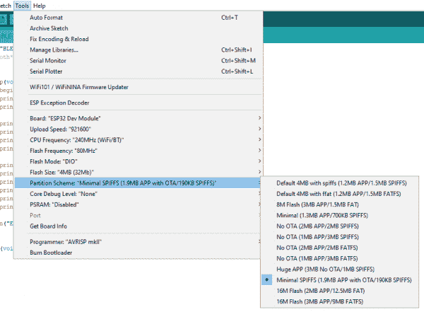
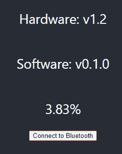
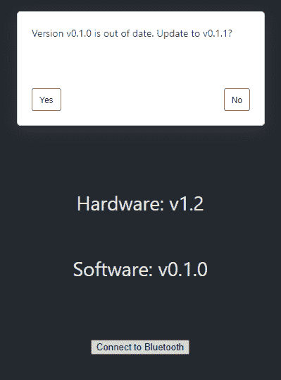

# ESP32 通过 React Web 应用程序在 BLE 上进行 OTA 更新

> 原文：<https://learn.sparkfun.com/tutorials/esp32-ota-updates-over-ble-from-a-react-web-application>

## 介绍

ESP32 是一个功能强大的微控制器。有了 WiFi、蓝牙和双核，您可以做很多事情，包括更新固件，而无需将其插入您的计算机。这是我一直想实现的东西，允许像我祖母这样的人给一个假想的电子礼物推送软件更新。我一直在网上看到的例子都是基于 Arduino IDE 中包含的 ArduinoOTA 例子，遵循相同的基本方法。

1.  **使用 Arduino IDE 将您的 SSID 和密码硬编码到 ESP32 中**
2.  将 ESP32 连接到 WiFi，并设置能够接收二进制文件的本地 web 服务器。
3.  如果 ESP32 的 mDNS 不想在您的网络上工作，请通过串行获取 IP 地址。
4.  将编译好的二进制文件存储在你的电脑或手机上。
5.  导航到 ESP32 的页面或 IP 地址
6.  使用 ESP32 提供的下拉菜单浏览到该文件，然后点击 send。

这个过程运行良好，并根据文件大小在几秒钟内更新 ESP32，但对于某些应用程序来说，这不是最好的。例如，我想在 HTML 中有一个漂亮的笨重的应用程序，它可以通过 BLE 与我的 ESP32 交互，将它放入 Arduino 草图(除了难以处理之外)可能会超出 OTA 更新的内存预算。所以，既然我已经在使用 BLE 和一个网络应用，让我们把 OTA 更新作为锦上添花。BLE 不是最好的方法，但是就像我说的，它已经在其他地方使用了。本次 BLE OTA 更新采用了以下方法。

1.  ESP32 开始 BLE 服务器。
2.  WebApp 允许用户使用网络蓝牙与我们的 ESP32 BLE 服务器配对。(对不起 iPhone 用户)
3.  配对后，WebApp 读取硬编码到 ESP32 草图中的硬件和软件版本号。
4.  该版本号与包含软件版本及其兼容硬件版本的 JSON 文件进行了交叉检查。
5.  如果有兼容的更新，会询问用户是否要更新。
6.  如果用户单击 yes，WebApp 将获取固件并以缓冲块的形式将其写入 ESP32。

[](https://www.sparkfun.com/products/15663) 

将**添加到您的[购物车](https://www.sparkfun.com/cart)中！**

### [【spark fun Thing Plus-ESP32 WROOM(微-B)](https://www.sparkfun.com/products/15663)

[Out of stock](https://learn.sparkfun.com/static/bubbles/ "out of stock") WRL-15663

SparkFun ESP32 Thing Plus 是开始使用 Espressif 物联网概念的下一步，同时还可以享受所有的便利设施

$22.5010[Favorited Favorite](# "Add to favorites") 48[Wish List](# "Add to wish list")*****The Illustrious ESP32*

## Web 应用程序

这是我第一次尝试 Javascript 和 HTML，所以我从一个 [React WebApp 开始(点击此链接设置一个普通的)。](https://reactjs.org/docs/create-a-new-react-app.html)你可以点击下面的按钮，下载最终的代码进行细读。如果您已经正确设置了 React 的所有工具，您应该能够导航到/ESP32_OTA_BLE 并运行`npm start`来本地运行 WebApp。阅读这个[谷歌开发者网络蓝牙教程](https://developers.google.com/web/updates/2015/07/interact-with-ble-devices-on-the-web)也是一个不错的主意，最重要的是，确保你知道什么是 [Javascript 承诺](https://developer.mozilla.org/en-US/docs/Web/JavaScript/Reference/Global_Objects/Promise)以及它们是如何工作的。

[Download WebApp and Arduino Sketch](https://github.com/sparkfun/ESP32_OTA_BLE_React_WebApp_Demo/archive/master.zip)

你可以在应用程序中四处摸索，但让我们来看看`App.js`中的代码，看看这个应用程序实际上在做什么。

### 应用程序()

这是 DOM 实际呈现的函数，所以我们页面的基本结构可以放在这里。在这个简单的应用程序中，我们将连接按钮和用户提示弹出框放在这里。点击我们的按钮，启动 BTConnect 功能，开始搜索设备。

### BTConnect()

调用 BTConnect 函数来搜索并连接到我们的 ESP32 的 BLE 服务器。注意我们如何过滤匹配`myESP32`变量的服务，这个变量在第 13 行用一个定制的 UUID 声明。这个 UUID 与 ESP32 用于其 BLE 服务的那个相匹配，因此当我们寻找设备时，我们只会看到我们已经用 OTA 草图编程的 ESP32。一旦我们连接上，我们保存刚刚全局连接到的 BLE 服务，并运行我们的`CheckVersion()`函数。

### onDisconnect()

`onDisconnect`是一个事件处理程序，当设备断开连接时，它会提示用户是否要重新连接。如果 ESP32 在更新过程中断开，请在重试之前重置 ESP32。这个函数有点问题，有时会死机，所以需要做一些工作。

### 检查版本()

`CheckVersion()`首先从 ESP32 获取硬件和软件版本号，并将其全局存储。该应用程序然后从 GitHub 获取 JSON 文件，该文件包含我们现有的软件版本及其兼容硬件版本的列表。如果软件版本不匹配，我们会检查最新版本是否与我们当前的硬件兼容。如果是，我们调用`PrompUserForUpdate()`询问用户是否要更新到兼容版本。如果没有，我们检查下一个最新的软件版本，直到我们不可避免地找到一些兼容的软件。

### PromptUserForUpdate()

该函数打开一个简单的弹出窗口，显示是或否选项。弹出窗口通知用户他们的当前版本已经过期，并询问他们是否希望更新到与他们的硬件兼容的最新版本。如果他们点击 yes，应用程序从 GitHub 获取适当的二进制文件，存储它，并调用`SendFileOverBluetooth()`将我们刚刚下载的二进制文件传递到函数中。

### SendFileOverBluetooth()

这个函数做的第一件事是通过获取数据的初始大小来准备要发送的数据。这个函数在我们写入二进制数据的同一个 GATT 特征上设置一个事件侦听器，以便当 ESP32 完成处理数据时，ESP32 可以写入特征并触发事件侦听器发送下一个数据包。一旦我们设置了事件监听器来调用`SendBufferedData()`，我们自己调用`SendBufferedData()`来开始写/标记/写周期。

### SendBufferedData & RecursiveSend(特征，数据)

`SendBufferedData()`获取我们的文件并将其分割成适当的 512 字节大小的块(GATT 特性的大小),并使用适当的块调用`RecursiveSend(characteristic, data)`。这个函数返回一个承诺给它自己，因为它发送以确保我们不会在 GATT 操作仍在进行时试图写入特征。

## Arduino 草图

在 Arduino 方面，事情相对简单。我们有一个 begin 函数来初始化我们的 BLE 服务器、服务和特性。用`NOTIFY`和`WRITE`对`pOtaCharacteristic`进行初始化，这允许它写入标志并从我们的客户端接收数据。对于`NOTIFY`，我们还需要向特征添加一个 BLE2902 描述符。对于`WRITE`，必须附加一个回调，这样每次写入特性时，ESP32 都会对数据做一些事情。查看下面的`begin()`函数中`pOtaCharacteristic`是如何初始化的。

```
language:c
pOtaCharacteristic = pService->createCharacteristic(
                     CHARACTERISTIC_UUID_FW,
                     BLECharacteristic::PROPERTY_NOTIFY | BLECharacteristic::PROPERTY_WRITE
                     );
pOtaCharacteristic->addDescriptor(new BLE2902());
pOtaCharacteristic->setCallbacks(new otaCallback(this)); 
```

回调本身就是所有奇迹发生的地方。启动时，ESP32 的`updateFlag`为假。第一次调用回调时(即应用程序想要开始编写新版本)，ESP32 配置其 OTA 处理程序并开始分区。在随后的每次回调中，都会检查接收数据的大小。如果它是一个完整的 512 字节，ESP32 将其写入 OTA 分区，然后将几个字节写入它刚刚读取的特征，以通知 WebApp 它准备好接收另一个包。如果我们有一个不完整的数据包，我们知道我们已经穷途末路了，所以我们将这些字节写入分区，检查分区是否正常，如果是的话，我们用新的固件重新启动。这个回调的代码如下。

```
language:c
void otaCallback::onWrite(BLECharacteristic *pCharacteristic)
{
  std::string rxData = pCharacteristic->getValue();
  if (!updateFlag) { //If it's the first packet of OTA since bootup, begin OTA
    Serial.println("BeginOTA");
    esp_ota_begin(esp_ota_get_next_update_partition(NULL), OTA_SIZE_UNKNOWN, &otaHandler);
    updateFlag = true;
  }
  if (_p_ble != NULL)
  {
    if (rxData.length() > 0)
    {
      esp_ota_write(otaHandler, rxData.c_str(), rxData.length());
      if (rxData.length() != FULL_PACKET)
      {
        esp_ota_end(otaHandler);
        Serial.println("EndOTA");
        if (ESP_OK == esp_ota_set_boot_partition(esp_ota_get_next_update_partition(NULL))) {
          esp_restart();
        }
        else {
          Serial.println("Upload Error");
        }
      }
    }
  }

  uint8_t txData[5] = {1, 2, 3, 4, 5};
  //delay(1000);
  pCharacteristic->setValue((uint8_t*)txData, 5);
  pCharacteristic->notify();
} 
```

### 为 OTA 编译

如果你要进行 OTA 更新，你必须确保你的闪存大小和分区方案在 Arduino 中设置正确。我通常喜欢在 ESP32 开发模块选项中选择`Minimal SPIFFS (1.9 MB APP with OTA/190KB SPIFFS)`作为分区方案，因为我很少使用 SPIFFS。

[](https://cdn.sparkfun.com/assets/learn_tutorials/1/1/9/9/compile.PNG)*Compilation Settings*

如果你愿意，你也可以[手动配置你的分区表](https://docs.espressif.com/projects/esp-idf/en/latest/esp32/api-guides/partition-tables.html)，但是我们不会在本教程中讨论这个。你还需要改变硬件和软件的版本号来反映现实，这些可以在`BLE.cpp`的开头找到

一旦你选择了合适的选项，继续前进，进入*草图* - > *导出编译后的二进制文件*，编译并保存二进制文件到你的草图文件夹。从这里开始，我们需要重命名并移动这个`BIN`来配置我们的 GitHub repo，这样一切都可以很好地配合。

## 开源代码库

我们的 WebApp 将与 GitHub 交互，因此作为开发人员，我们可以相对容易地通过 GitHub 的发布功能推出新代码。然而，我们实际上只抓取了一个`JSON`和一个`BIN`,所以你也可以在应用本身中托管它们。GitHub 从中删除的唯一一步是，通过正确地给你的版本命名，你可以避免手动改变一些文件结构，这样 WebApp 就可以找到正确的`BIN`。无论如何，我们在 GitHub 上需要两个组件。一个是我们现有软件版本及其兼容硬件版本的`JSON`，另一个是与软件版本兼容的所有`BIN`文件。查看 GitHub 上的[发布页面](https://github.com/sparkfun/ESP32_OTA_BLE_React_WebApp_Demo/releases),并检查每个发布的内容，如果你对应该如何构建还有疑问的话。

### 版本。JSON

我们的`version.JSON`文件是用数组中位置`0`处的最新软件版本构建的。通过调用`data.firmware[0]['software']`可以获得最新的软件版本。然后，您可以遍历同一条目的`'hardware'`部分，查看与该软件兼容的所有硬件。最新的硬件版本也应该放在`JSON`条目的顶部。下面是一个示例`JSON`文件。

```
language:json
{
    "firmware": [
        {
            "software": "v2.0.0",
            "hardware": [
                "v2.0"
            ]
        },
        {
            "software": "v0.1.1",
            "hardware": [
                "v1.3",
                "v1.2"
            ]
        },
        {
            "software": "v0.1.0",
            "hardware": [
                "v1.3",
                "v1.2",
                "v1.1"
            ]
        }
    ]
} 
```

### **BIN** 文件

本教程使用的存储库有三个文件夹。标题为`GithubRepo`的应用程序应该拥有面向公众的实际存储库所需的所有内容，它实际上只是几个`BIN`文件(与同一软件兼容的多个硬件版本)和一个`JSON`。您的`BIN`文件应该以它们兼容的*硬件*版本命名，您的`JSON`文件应该包括当前版本以及所有以前版本的结构。例如，上面的`JSON`文件将位于一个只有一个标题为`v2.0.bin`的`BIN`的文件夹中。将这些文件推送到 GitHub 后，[在此状态下发布](https://help.github.com/en/enterprise/2.13/user/articles/creating-releases)仓库，并将其命名为软件版本。对于上述`JSON`(以及相关的`BIN`)标签和发布的标题*将为 **v2.0.0** 。重要的是，每个软件版本都有自己的对应版本，包括编译后的二进制文件和`JSON`。*

## 使用 OTA 更新程序

好了，现在我们已经了解了一切是如何工作的，用法应该相当简单。首先要做的是将 ArduinoSketch 文件夹中的草图上传到您的 ESP32(不要忘记选择正确的分区设置，如 [Arduino 草图部分](https://learn.sparkfun.com/tutorials/esp32-ota-updates-over-ble-from-a-react-web-application#arduino-sketch)所述)。该草图应配置为硬件版本 1.2(此处的实际版本号是任意的，只是为了显示功能性)和软件版本 0.1.0。现在继续操作，打开位于 **115200** BPS 的[串行终端](https://learn.sparkfun.com/tutorials/terminal-basics)进行确认，并最终观察 ESP 使用其新固件重启。

现在，ESP32 已经有了它的固件，我们可以继续在本地服务器上启动 WebApp，方法是导航到它被下载到的文件夹(在 WebApp 下的[库](https://github.com/sparkfun/ESP32_OTA_BLE_React_WebApp_Demo)内)并运行`npm start`。

[](https://cdn.sparkfun.com/assets/learn_tutorials/1/1/9/9/Updating.PNG)*Starting Webpage*

从这里，继续点击`Connect to Bluetooth`按钮，这将调出具有适当 UUID 的可用设备，并允许您进行连接。显然，继续并连接到设备。

[](https://cdn.sparkfun.com/assets/learn_tutorials/1/1/9/9/pairing.png)*Connection Screen*

等待几秒钟，让应用程序连接并检查设备上的版本号。如果软件不是最新的，应该会出现一个弹出窗口，如下图所示，询问用户是否要更新到最新的兼容软件。

[](https://cdn.sparkfun.com/assets/learn_tutorials/1/1/9/9/UserPrompt.PNG)*Prompt User for Update*

单击“是”将开始更新过程。将出现一个百分比，显示更新进度。这个过程可能需要相当长的时间。完成后，ESP32 将重新启动。

[](https://cdn.sparkfun.com/assets/learn_tutorials/1/1/9/9/Updating.PNG)*Loading New Firmware to ESP32*

当 ESP32 重新启动时，它将与蓝牙断开连接。WebApp 目前不能很好地处理这个问题，并且会死机，所以只要你觉得合适就重启它，然后再次连接到你的 ESP32，就可以看到新版本弹出来了！您也可以在串行监视器中检查这一点

现在，您可以随意将各种东西添加到您的 ESP32 草图或 WebApp 中！请务必确保您不仅可以刷新已编译的二进制文件，还可以刷新到运行该已编译二进制文件的 ESP32。此外，确保跟踪好二进制文件，并确保编译后的二进制文件包含正确的硬件和软件版本号，否则可能会出现问题。

通过一些仔细的整理，相对容易的最终用户体验是可能的！

## 资源和更进一步

*   [WebApp 和 Arduino 草图](https://github.com/sparkfun/ESP32_OTA_BLE_React_WebApp_Demo/archive/master.zip)
*   [手动配置您的分区](https://docs.espressif.com/projects/esp-idf/en/latest/esp32/api-guides/partition-tables.html)
*   [用于 OTA 更新的 ESP32 API 参考](https://docs.espressif.com/projects/esp-idf/en/latest/esp32/api-reference/system/ota.html)**