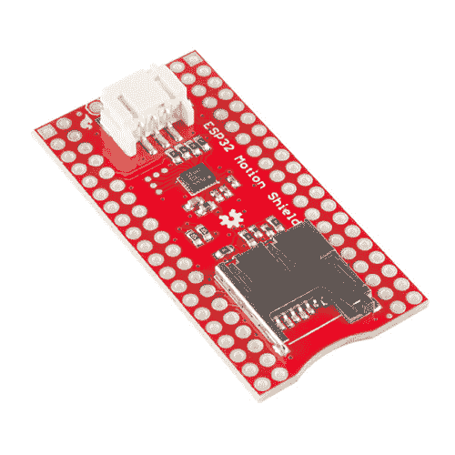

# ESP32 事物运动屏蔽连接指南

> 原文：<https://learn.sparkfun.com/tutorials/esp32-thing-motion-shield-hookup-guide>

## 介绍

这个 [ESP32 东西运动护罩](https://www.sparkfun.com/products/14430)是我们 [ESP32 东西](https://www.sparkfun.com/products/13907)的多功能补充。经过实践检验的 LSM9DS1 IMU 可以检测到微小的移动，增加 GPS 传感器可以检测到大的移动和时间。有一个用于 [GP-20U7](https://www.sparkfun.com/products/13740) 模块的端口，以及用于任何串行设备的分线针。通过将 microSD 卡插入插槽，可以轻松记录数据。*我提到过通用 LED 吗？*显示 GPS 锁定状态效果相当不错！

 

将**添加到您的[购物车](https://www.sparkfun.com/cart)中！**

### [SparkFun ESP32 东西运动盾](https://www.sparkfun.com/products/14430)

[In stock](https://learn.sparkfun.com/static/bubbles/ "in stock") DEV-14430

SparkFun ESP32 Thing Motion Shield 是对我们的 ESP32 Thing 的多功能运动感应补充。

$22.50 $12.381[Favorited Favorite](# "Add to favorites") 7[Wish List](# "Add to wish list")** **[https://www.youtube.com/embed/_XW5mhYnbwo/?autohide=1&border=0&wmode=opaque&enablejsapi=1](https://www.youtube.com/embed/_XW5mhYnbwo/?autohide=1&border=0&wmode=opaque&enablejsapi=1)

### 所需材料

要完全遵循这个连接指南，你需要以下材料。不过，你可能不需要所有的东西，这取决于你有什么和你想做什么。将它添加到您的购物车中，通读指南，并根据您的喜好对购物车进行必要的调整。

**Note:** This list doesn't include the Motion Shield. It is all of the *accessories* used to complete this guide.**