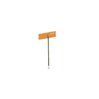

# ESP32 Thing Plus 连接指南

> 原文：<https://learn.sparkfun.com/tutorials/esp32-thing-plus-hookup-guide>

## 介绍

[SparkFun ESP32 Thing Plus](https://www.sparkfun.com/products/14689) 和[spark fun ESP32 Thing Plus U . FL](https://www.sparkfun.com/products/17381)享受 ESP32 Thing 的所有便利设施，但增加了一些亮点。我们将电路板加长了一点，以容纳一个 [Qwiic](https://www.sparkfun.com/qwiic) 连接器，满足您所有的 Qwiic 分线需求。我们还移动了一些引脚，使主板与 Adafruit huzzah 32–ESP32 羽毛板兼容，这样您就可以使用所有可用的可爱[护盾](https://www.adafruit.com/category/814)！ESP32 Thing plus 还集成了丰富的外设，包括电容式触摸传感器、霍尔传感器、SD 卡接口、以太网、高速 SPI、UART、I ² S 和 I ² C。

[](https://www.sparkfun.com/products/15663) 

将**添加到您的[购物车](https://www.sparkfun.com/cart)中！**

### [【spark fun Thing Plus-ESP32 WROOM(微-B)](https://www.sparkfun.com/products/15663)

[Out of stock](https://learn.sparkfun.com/static/bubbles/ "out of stock") WRL-15663

SparkFun ESP32 Thing Plus 是开始使用 Espressif 物联网概念的下一步，同时还可以享受所有的便利设施

$22.5010[Favorited Favorite](# "Add to favorites") 48[Wish List](# "Add to wish list")****[](https://www.sparkfun.com/products/17381) 

将**添加到您的[购物车](https://www.sparkfun.com/cart)中！**

### [spark fun Thing Plus-ESP32 WROOM(U . FL)](https://www.sparkfun.com/products/17381)

[In stock](https://learn.sparkfun.com/static/bubbles/ "in stock") WRL-17381

SparkFun ESP32 Thing Plus with U.FL 允许您在开始使用 Espressif 物联网概念的同时，仍然享受所有的

$22.5010[Favorited Favorite](# "Add to favorites") 16[Wish List](# "Add to wish list")**** ****[https://www.youtube.com/embed/nvpeqxgSIE0/?autohide=1&border=0&wmode=opaque&enablejsapi=1](https://www.youtube.com/embed/nvpeqxgSIE0/?autohide=1&border=0&wmode=opaque&enablejsapi=1)

有了 [Espressif 的 ESP32](https://espressif.com/en/products/hardware/esp32/overview) 综合开发平台、**蓝牙低能耗**支持(即 BLE、BT4.0、蓝牙智能)，以及近 30 个 I/O 引脚，这些板卡塞满了各种可能性！

**尚未实现**:ESP32 微控制器的 Arduino 内核仍在开发中。还有一些[外设和功能](https://docs.espressif.com/projects/arduino-esp32/en/latest/libraries.html)尚未实现，包括:

*   模拟输出(`analogWrite([pin], [value])`)
    *   替代: [LED 控制 API](https://espressif-docs.readthedocs-hosted.com/projects/arduino-esp32/en/latest/api/ledc.html)
*   脉冲计数器
*   迪索
*   ~~定时器/~~ 实时时钟
    *   备选: [ESP32Time Arduino 库](https://github.com/fbiego/ESP32Time)
*   TWAI

ESP32 的[物联网开发框架](https://github.com/espressif/esp-idf)中提供了外设(如果还处于起步阶段的话)。如果您的应用需要上述任何功能，请考虑尝试一下 [ESP-IDF](https://github.com/espressif/esp-idf) ！*(更新时间:2022 年 6 月。)*

### 所需材料

**Note:** For the ESP32 Thing Plus **U.FL**, external antenna hardware is required. We offer various [antennas](https://www.sparkfun.com/search/results?term=antenna) options.

*   **用 ESP32 加**美国 fl∶**

    ### **[2.4 GHz 鸭式天线 RP-SMA](https://www.sparkfun.com/products/145)**

    **【wrl-00145】【库存中】鸭式天线 2.2dBi，带反向极化 SMA(消歧义)射频连接器。非常适合用我们的射频 ICs 制作原型. 50 块欧姆阻抗……****【t8.95】****[](https://www.sparkfun.com/products/558)**

    ### ****2.4 GHz 鸭式天线 RP-SMA-large****

    ****【【【wrl-00558】【)大型鸭式天线 5dBi，带反向极化 SMA(消歧义)射频连接器。非常适合用我们的射频 ICs 制作原型. 50 块欧姆 imp…****

    ### ****[接口电缆 RP-SMA(消歧义)到 u . fl](https://www.sparkfun.com/products/retired/662)****

    ****[【退役】](https://learn.sparkfun.com/static/bubbles/ "Retired")【wrl-00662】t 通常用于将基于 WiFi 蓝牙或 nRFxxx 的设备连接到 2.4GHz 天线.**********退役**************

    ### ****[天线胶(包括 FL)连接器)](https://www.sparkfun.com/products/retired/11320)****

    ****[【撤回】](https://learn.sparkfun.com/static/bubbles/ "Retired")【wrl-11320】

    这种粘性的全向天线非常适合当你试图从发射机接收信号时的情况**** ****【6】**退役[********
*****   **未经检验:**
    [](https://www.sparkfun.com/products/17389)

    将**添加到您的[购物车](https://www.sparkfun.com/cart)中！**

    ### **[树莓圆周率 4 计算模块天线套件](https://www.sparkfun.com/products/17389)**

    **[有货](https://learn.sparkfun.com/static/bubbles/ "in stock")WRL-17389

    这是用于树莓 Pi 4 计算模块无线变型的天线套件. . .** **$ 5.00****[最爱 最爱](# "Add to favorites")4[](# "Add to wish list") [### 无线局域网三频天线-150 毫米](# "Add to wish list") [退役](https://learn.sparkfun.com/static/bubbles/ "Retired")WRL-17095

    TE 连通的 Wi-Fi 6E 天线可以支持三个频段,包括 6GHz 频段

    **退役**

    ### 双频无线局域网/蓝牙天线-PCB V 200 毫米

    [退役](https://learn.sparkfun.com/static/bubbles/ "Retired")WRL-17341

    TE 连通的小型无线局域网天线提供 2400 兆赫至 7125 兆赫的频率范围、50ω的额定阻抗和高达…

    **退役********

 ******ESP32 Thing Plus 的大部分功能只需给电路板供电即可使用。为此，你需要一根 [Micro-B USB 线](https://www.sparkfun.com/products/10215)。ESP32 Thing Plus 的 USB 接口可用于为芯片供电和编程。一旦你完成了对芯片的编程，一个 [5V 微型 B USB 墙壁适配器](https://www.sparkfun.com/products/12890)可以用来给电路板供电。

[](https://www.sparkfun.com/products/15311) 

将**添加到您的[购物车](https://www.sparkfun.com/cart)中！**

### [【墙上适配器电源- 5VDC，2A (USB Micro-B)](https://www.sparkfun.com/products/15311)

[In stock](https://learn.sparkfun.com/static/bubbles/ "in stock") TOL-15311

这是一个高品质的开关“壁式电源”AC 到 DC 5V 2000mA USB 微型 B 壁式电源，专为 S…

$6.50[Favorited Favorite](# "Add to favorites") 2[Wish List](# "Add to wish list")****[](https://www.sparkfun.com/products/13244) 

将**添加到您的[购物车](https://www.sparkfun.com/cart)中！**

### [【USB Micro-B 线缆-6】](https://www.sparkfun.com/products/13244)

[In stock](https://learn.sparkfun.com/static/bubbles/ "in stock") CAB-13244

这是一根 USB 2.0 型转 Micro-B 型 5 针黑色电缆。你知道，通常配在手机上的迷你 B 连接器，可以…

$2.103[Favorited Favorite](# "Add to favorites") 7[Wish List](# "Add to wish list")****[](https://www.sparkfun.com/products/11456) 

将**添加到您的[购物车](https://www.sparkfun.com/cart)中！**

### [USB 壁式充电器- 5V，1A(黑色)](https://www.sparkfun.com/products/11456)

[In stock](https://learn.sparkfun.com/static/bubbles/ "in stock") TOL-11456

近来，USB 越来越多地被作为一种电源连接标准来实现，但是你并不总是在 han 上有一台计算机…

$4.502[Favorited Favorite](# "Add to favorites") 10[Wish List](# "Add to wish list")****[](https://www.sparkfun.com/products/96) 

将**添加到您的[购物车](https://www.sparkfun.com/cart)中！**

### [电解去耦电容- 100uF/25V](https://www.sparkfun.com/products/96)

[In stock](https://learn.sparkfun.com/static/bubbles/ "in stock") COM-00096

电解去耦电容 100uF/25V。这些电容是出色的瞬态/浪涌抑制器。在…之间附加一个

$0.45[Favorited Favorite](# "Add to favorites") 10[Wish List](# "Add to wish list")******************⚡WARNING!** If you have v1.0 of the board [[WRL-14689](https://www.sparkfun.com/products/14689)], make sure your power supply is **5V**, NOT 5.1V. We have noticed a power spike in our [5.1V power supplies](https://www.sparkfun.com/products/13831) that can damage the IC. Long cables can also generate a large enough voltage spike to damage the IC. We recommend keeping power supply cables shorter than 6 feet to minimize potential damage.

[](https://cdn.sparkfun.com/assets/learn_tutorials/8/5/2/14689-SparkFun_Thing_Plus_-_ESP32_WROOM-03_v10.jpg)
To avoid voltage spikes that might damage the IC, we recommend soldering a 10&ohm; resistor in-line. If you have v2.0 of the board [[WRL-15663](https://www.sparkfun.com/products/15663)] , this issue has been addressed and you can disregard this message.

作为一种替代电源，ESP32 Thing Plus 包括对[单芯锂聚合物(LiPo)](https://www.sparkfun.com/search/results?term=lithium%20polymer&tab=products) 电池的支持，该电池可插入主板的白色 2 引脚 JST 连接器。抽脂对于正在进行的项目，或者那些只需要一点额外脂肪的人来说是完美的。该板包括一个**脂肪充电器** -可充电电池可以通过将 Thing Plus 插入 5V USB 电源来充电。

[](https://www.sparkfun.com/products/13813) 

将**添加到您的[购物车](https://www.sparkfun.com/cart)中！**

### [锂离子电池-1Ah](https://www.sparkfun.com/products/13813)

[In stock](https://learn.sparkfun.com/static/bubbles/ "in stock") PRT-13813

基于锂离子化学的超薄超轻电池。每个电池在 1000 毫安时输出 3.7V 的标称电压！

$10.958[Favorited Favorite](# "Add to favorites") 75[Wish List](# "Add to wish list")****[](https://www.sparkfun.com/products/13854) 

将**添加到您的[购物车](https://www.sparkfun.com/cart)中！**

### [锂离子电池- 850mAh](https://www.sparkfun.com/products/13854)

[In stock](https://learn.sparkfun.com/static/bubbles/ "in stock") PRT-13854

这是基于锂离子化学的非常薄、非常轻的电池。每个电池在 850℃时输出 3.7V 的标称电压…

$10.952[Favorited Favorite](# "Add to favorites") 17[Wish List](# "Add to wish list")****[](https://www.sparkfun.com/products/13851) 

将**添加到您的[购物车](https://www.sparkfun.com/cart)中！**

### [锂离子电池- 400mAh](https://www.sparkfun.com/products/13851)

[In stock](https://learn.sparkfun.com/static/bubbles/ "in stock") PRT-13851

这是一种基于锂离子化学的非常小、非常轻的电池，具有目前最高的能量密度…

$5.5010[Favorited Favorite](# "Add to favorites") 41[Wish List](# "Add to wish list")****[](https://www.sparkfun.com/products/13855) 

将**添加到您的[购物车](https://www.sparkfun.com/cart)中！**

### [锂离子电池- 2Ah](https://www.sparkfun.com/products/13855)

[In stock](https://learn.sparkfun.com/static/bubbles/ "in stock") PRT-13855

这是基于锂离子化学的非常薄、非常轻的电池。每个电池在 200 伏时输出一个标称的 3.7 伏电压…

$13.959[Favorited Favorite](# "Add to favorites") 43[Wish List](# "Add to wish list")******** ********如果您希望使用主板的 qw IC 功能，您需要一根 qw IC 电缆:

[](https://www.sparkfun.com/products/14427) 

将**添加到您的[购物车](https://www.sparkfun.com/cart)中！**

### [Qwiic 线缆- 100mm](https://www.sparkfun.com/products/14427)

[In stock](https://learn.sparkfun.com/static/bubbles/ "in stock") PRT-14427

这是一条 100 毫米长的 4 芯电缆，带有 1 毫米 JST 端接。它旨在将支持 Qwiic 的组件连接在一起…

$1.50[Favorited Favorite](# "Add to favorites") 32[Wish List](# "Add to wish list")****[](https://www.sparkfun.com/products/14429) 

将**添加到您的[购物车](https://www.sparkfun.com/cart)中！**

### [Qwiic 线缆- 500mm](https://www.sparkfun.com/products/14429)

[In stock](https://learn.sparkfun.com/static/bubbles/ "in stock") PRT-14429

这是一根 500mm 长的 4 芯电缆，带有 1mm JST 端接。它旨在将支持 Qwiic 的组件连接在一起…

$1.951[Favorited Favorite](# "Add to favorites") 25[Wish List](# "Add to wish list")****[](https://www.sparkfun.com/products/14426) 

将**添加到您的[购物车](https://www.sparkfun.com/cart)中！**

### [Qwiic 线缆- 50mm](https://www.sparkfun.com/products/14426)

[In stock](https://learn.sparkfun.com/static/bubbles/ "in stock") PRT-14426

这是一根 50 毫米长的 4 芯电缆，带有 1 毫米 JST 端接。它旨在将支持 Qwiic 的组件连接在一起…

$0.95[Favorited Favorite](# "Add to favorites") 29[Wish List](# "Add to wish list")****[](https://www.sparkfun.com/products/14428) 

### [Qwiic 线缆- 200mm](https://www.sparkfun.com/products/14428)

[Out of stock](https://learn.sparkfun.com/static/bubbles/ "out of stock") PRT-14428

这是一根 200 毫米长的 4 芯电缆，带有 1 毫米 JST 端接。它旨在将支持 Qwiic 的组件连接在一起…

[Favorited Favorite](# "Add to favorites") 21[Wish List](# "Add to wish list")****** ******### 工具

为了利用 ESP32 Thing Plus 的 28 个外部引脚，您需要一个烙铁、焊料和[通用焊接附件](https://www.sparkfun.com/categories/49)。

[](https://www.sparkfun.com/products/116) 

将**添加到您的[购物车](https://www.sparkfun.com/cart)中！**

### [破开头球——直击](https://www.sparkfun.com/products/116)

[In stock](https://learn.sparkfun.com/static/bubbles/ "in stock") PRT-00116

一排标题-打破适应。40 个引脚，可切割成任何尺寸。用于定制 PCB 或通用定制接头。

$1.7520[Favorited Favorite](# "Add to favorites") 133[Wish List](# "Add to wish list")****[](https://www.sparkfun.com/products/14228) 

### [威勒 WLC100 焊台](https://www.sparkfun.com/products/14228)

[Out of stock](https://learn.sparkfun.com/static/bubbles/ "out of stock") TOL-14228

Weller 的 WLC100 是一款多功能的 5 瓦至 40 瓦焊台，非常适合业余爱好者、DIY 爱好者和学生。…

2[Favorited Favorite](# "Add to favorites") 17[Wish List](# "Add to wish list")[](https://www.sparkfun.com/products/9325) 

将**添加到您的[购物车](https://www.sparkfun.com/cart)中！**

### [无铅焊料- 100 克线轴](https://www.sparkfun.com/products/9325)

[In stock](https://learn.sparkfun.com/static/bubbles/ "in stock") TOL-09325

这是带有水溶性树脂芯的无铅焊料的基本线轴。0.031 英寸规格，100 克。这是一个好主意…

$9.957[Favorited Favorite](# "Add to favorites") 33[Wish List](# "Add to wish list")****[](https://www.sparkfun.com/products/15187) 

将**添加到您的[购物车](https://www.sparkfun.com/cart)中！**

### [羽毛可堆叠头套](https://www.sparkfun.com/products/15187)

[In stock](https://learn.sparkfun.com/static/bubbles/ "in stock") PRT-15187

这些可堆叠的接头可与[spark fun ESP32 Thing Plus](https://www . spark fun . com/products/14689)配合使用，以控制

$1.75[Favorited Favorite](# "Add to favorites") 4[Wish List](# "Add to wish list")****** ******### 推荐阅读

它可能看起来令人生畏，但 ESP32 Thing Plus -尤其是当你利用它的 Arduino 兼容性时-对于所有经验水平的电子产品用户来说，都是一个完美的物联网基础。但是，在深入学习本教程之前，您应该熟悉一些概念。如果下面的任何概念对你来说听起来很陌生，请考虑先通读该教程:

[](https://learn.sparkfun.com/tutorials/how-to-solder-through-hole-soldering) [### 如何焊接:通孔焊接](https://learn.sparkfun.com/tutorials/how-to-solder-through-hole-soldering) This tutorial covers everything you need to know about through-hole soldering.[Favorited Favorite](# "Add to favorites") 70[](https://learn.sparkfun.com/tutorials/serial-communication) [### 串行通信](https://learn.sparkfun.com/tutorials/serial-communication) Asynchronous serial communication concepts: packets, signal levels, baud rates, UARTs and more 100[](https://learn.sparkfun.com/tutorials/how-to-power-a-project) [### 如何为项目提供动力](https://learn.sparkfun.com/tutorials/how-to-power-a-project) A tutorial to help figure out the power requirements of your project.[Favorited Favorite](# "Add to favorites") 67[](https://learn.sparkfun.com/tutorials/what-is-an-arduino) [### 什么是 Arduino？](https://learn.sparkfun.com/tutorials/what-is-an-arduino) What is this 'Arduino' thing anyway? This tutorials dives into what an Arduino is and along with Arduino projects and widgets.[Favorited Favorite](# "Add to favorites") 50[](https://learn.sparkfun.com/tutorials/three-quick-tips-about-using-ufl) [### 关于使用 U.FL 的三个快速提示](https://learn.sparkfun.com/tutorials/three-quick-tips-about-using-ufl) Quick tips regarding how to connect, protect, and disconnect U.FL connectors.[Favorited Favorite](# "Add to favorites") 14

## 硬件概述

[Espressif 的 ESP32 WROOM](https://cdn.sparkfun.com/assets/learn_tutorials/8/5/2/esp32-wroom-32_datasheet_en.pdf) 是一款功能强大的通用 Wi-Fi+BT+BLE MCU 模块，面向各种应用。该模块的核心是 ESP32-D0WDQ6 芯片，该芯片设计为可扩展和自适应。它的一系列功能包括:

*   Xtensa 双核 32 位 LX6 微处理器
*   高达 240MHz 时钟频率
*   16MB 闪存存储
*   520kB 内部 SRAM
*   集成 802.11 BGN WiFi 收发器
*   集成双模蓝牙(经典和 BLE)
*   3.0 至 3.6V 工作范围
*   21 GPIO
*   8 电极电容式触摸支持
*   硬件加速加密(AES、SHA2、ECC、RSA-4096)
*   2.5 深度睡眠电流

ESP32 Thing Plus 是围绕 ESP32-WROOM 模块设计的，具有运行和编程微控制器所需的一切功能，以及一些利用芯片独特功能的额外功能。

[](https://cdn.sparkfun.com/assets/learn_tutorials/8/5/2/Hardware_Overview_Highlight_1.jpg)

### 外围设备和输入/输出

ESP32 Thing Plus 具有您的标准硬件外围设备，包括:

*   13 个模数转换器(ADC)通道
*   3 个 UART(Arduino IDE 中默认只配置了两个，一个用于引导加载/调试)
*   3 个 SPI(在 Arduino IDE 中默认只配置一个)
*   2 I ² C(在 Arduino IDE 中默认只配置一个)
*   2 I2S 音频
*   2 个数模转换器(DAC)通道
*   16 路 PWM 输出

而且，由于芯片的**引脚多路复用**功能，这些外设可以连接到几乎任何断开的 I/O 引脚。这意味着您可以决定哪些引脚是 RX、TX、MISO、MOSI、SCLK、SDA、SCL 等。

然而，有一些硬件特性，即 ADC 和 DAC，是分配给静态引脚的。下面的图形数据表有助于说明在哪里可以找到这些外设(单击 embiggen！).

[](https://cdn.sparkfun.com/assets/learn_tutorials/8/5/2/ESP32ThingPlusV20.pdf)*Click the image for a closer look.*

一个 I ² C、两个 UART 接口和一个 SPI 接口可以分配给项目所需的任何引脚。

### 为 ESP32 Thing Plus 供电

ESP32 Thing Plus 的两个主要电源输入是 **USB** 和**单节锂聚合物(LiPo** 电池。如果 USB 和 LiPo 都插入主板，板载充电控制器将以高达 **500mA** 的速率给 LiPo 电池充电。

⚡ The ESP32's operating voltage range is **3.0** to **3.6V**. Under normal operation the ESP32 Thing Plus will power the chip at **3.3V**. The I/O pins are **not 5V-tolerant**! If you interface the board with 5V (or higher) components, you'll need to do some [**logic level shifting**.](https://learn.sparkfun.com/tutorials/bi-directional-logic-level-converter-hookup-guide)

ESP32 Thing Plus 上的 **3.3V 稳压器**可以**可靠地提供高达 600mA** 的电流，这对大多数项目来说应该绰绰有余。在射频传输期间，ESP32 可以消耗多达**250 毫安，但我们通常测量它消耗大约**150 毫安** -即使是在通过 WiFi 积极传输的时候。调节器的输出也分接到电路板的两侧，即标有“ **3V3** 的引脚。此引脚可用于为外部元件供电。**

[](https://cdn.sparkfun.com/assets/learn_tutorials/8/5/2/Power_Pin_Highlight.jpg)

除了 USB 和电池连接器之外， **VBAT** 和 **VUSB** 引脚都在电路板的侧面断开。这些引脚可以用作 Thing Plus 的备用电源输入。 **VUSB 的最大允许电压输入为 5.8V** ，VBAT 不应连接到除 LiPo 电池之外的任何设备。或者，如果您在 **3.0V** 和 **3.6V** 之间有一个稳压电源，则可以使用“ **3V3** 线直接为 ESP32 及其外设供电。

## 组装技巧

### 头球

ESP32 Thing Plus 出厂时没有将任何东西焊接到接头引脚上，确保您可以根据您的项目来定制电路板。要使用芯片的引脚，你需要将*某种东西*焊接到电路板两侧的 I/O 和电源轨通孔上。

New to soldering? Check out our [Through-Hole Soldering Tutorial](https://learn.sparkfun.com/tutorials/how-to-solder---through-hole-soldering) for a quick introduction!

*您将什么*焊接到 ESP32 Thing Plus 的 I/O 引脚完全由您决定。接头排与试验板兼容，因此您可能需要焊接[公接头](https://www.sparkfun.com/products/116)。

[](https://cdn.sparkfun.com/assets/learn_tutorials/8/5/2/SparkFun_Transparent_Graphical_OLED_Breakout__Qwiic__Hookup_Guide-01.jpg)*ESP32 Thing Plus with soldered male headers.*

然后将其插入试验板，将 USB 和 LiPo 连接器挂在末端，开始布线！

或者，[母接头](https://www.sparkfun.com/products/115)(你可能需要两个单独的条来焊接所有的引脚)，[直角接头](https://www.sparkfun.com/products/553)，或者[绞合线](https://www.sparkfun.com/products/11375)都是不错的选择，这取决于你的项目需求。

### 连接天线

单位 FL 连接器非常好，但它们是为在笔记本电脑等小型嵌入式应用中实现而设计的。将 U.FL 连接器暴露在野外会有损坏的风险。

[](https://cdn.sparkfun.com/assets/learn_tutorials/8/5/2/antenna_assembly_patch.jpg)[](https://cdn.sparkfun.com/assets/learn_tutorials/8/5/2/antenna_assembly_duck.jpg)*U.FL antenna options connected to ESP32 Thing Plus (U.FL).*

**小心！** U.FL 连接器容易损坏。确保连接器对齐，面对面齐平(不倾斜)，然后使用坚硬的钝边(如 PCB 边缘或小平头螺丝刀尖端)向下按压。更多信息，请查看我们的[使用 u.FL 连接器](https://learn.sparkfun.com/tutorials/845)的提示和技巧。

[](https://learn.sparkfun.com/tutorials/three-quick-tips-about-using-ufl) [### 关于使用 U.FL 的三个快速提示

#### 2018 年 12 月 28 日](https://learn.sparkfun.com/tutorials/three-quick-tips-about-using-ufl) Quick tips regarding how to connect, protect, and disconnect U.FL connectors.[Favorited Favorite](# "Add to favorites") 14

## 软件设置

**Note:** This example assumes you are using the latest version of the Arduino IDE on your desktop. If this is your first time using Arduino, please review our tutorial on [installing the Arduino IDE.](https://learn.sparkfun.com/tutorials/installing-arduino-ide)

ESP32 Thing Plus 的安装分为两部分。像 ESP32 一样，你需要通过 Arduino 板管理器安装板定义。此外，您还需要下载并安装最新的 CP2104 USB 驱动程序。请注意，某些旧版本的驱动程序(包括 Windows 自动安装的版本)会导致自动重置在上传过程中失败。

### 安装板定义

Espressif 增加了对 Arduino Boards Manager 的支持，其中包括大量优秀的内置示例。通过板管理器安装的说明可以在 [espressif 的 arduino-esp32 文档](https://docs.espressif.com/projects/arduino-esp32/en/latest/installing.html)中找到。

[Installation Instructions using Arduino IDE Boards Manager](https://docs.espressif.com/projects/arduino-esp32/en/latest/installing.html)

有关通过 Arduino 板管理器安装板的更多信息，请查看我们的安装 Arduino IDE 教程的[附加组件部分。](https://learn.sparkfun.com/tutorials/installing-arduino-ide#board-add-ons-with-arduino-board-manager)

[](https://learn.sparkfun.com/tutorials/installing-arduino-ide) [### 安装 Arduino IDE

#### 2013 年 3 月 26 日](https://learn.sparkfun.com/tutorials/installing-arduino-ide) A step-by-step guide to installing and testing the Arduino software on Windows, Mac, and Linux.[Favorited Favorite](# "Add to favorites") 16

如果您熟悉通过 Arduino IDE 板管理器安装板，可以添加以下 url:

```
language:c
https://raw.githubusercontent.com/espressif/arduino-esp32/gh-pages/package_esp32_index.json 
```

**Note:** If you have previously installed the ESP32 Arduino Core, we strongly recommend removing the associated folders before installing via the boards manager.

To remove previous arduino core installs for the esp32, start by finding your ***.../Arduino/hardware*** folder. This can be located by looking at your Sketchbook location under **File** > **Preferences**.

[](https://cdn.sparkfun.com/assets/learn_tutorials/5/0/7/Preferences-hardwareFolderLocation.png)*Click to enlarge.*
Go to this location in your finder and delete the **esp32** folder.

[](https://cdn.sparkfun.com/assets/learn_tutorials/5/0/7/esp32_folder.png)
Once you have deleted the **esp32** folder, you can then install using the **Arduino Boards Manager**.

#### 选择纸板定义

安装后，使用 Arduino 板下拉菜单中的 Adafruit ESP32 羽毛板。

[](https://cdn.sparkfun.com/assets/learn_tutorials/8/5/2/FeatherBoardArduino.png)*Selecting board definition from **Tools** drop down menu.***Feeling adventurous?**
If you are feeling strong or would like to have more control over your development environment, you can install Espressif’s official ESP32 Arduino core. Installation is covered in our [ESP32 Thing Hookup Guide.](https://learn.sparkfun.com/tutorials/esp32-thing-hookup-guide#installing-the-esp32-arduino-core)

### [安装 CP2104 USB 驱动](#CP2104)

**Note:** Make sure to manually install the driver for the CP210X with the following instructions. The driver that Windows auto-installs will not work with the auto-reset circuit on the board and cause serial uploads to fail.

你还需要安装 SiLabs CP2104 驱动程序，可以在这里找到: [USB 转 UART 桥 VCP 驱动程序](https://www.silabs.com/products/development-tools/software/usb-to-uart-bridge-vcp-drivers)

[Download Windows VCP Driver (ZIP)](https://cdn.sparkfun.com/assets/learn_tutorials/8/5/2/CP210x_Universal_Windows_Driver.zip)[Download Mac OSX VCP Driver (ZIP)](https://www.silabs.com/documents/public/software/Mac_OSX_VCP_Driver.zip)**Note:** If applicable, make sure you are using the proper driver files for your CPU architecture. This is usually indicated by a folder or file name with "*x86*" for 32-bit processors or "*x64*" for 64-bit processors.

## Arduino 示例:眨眼

安装了 ESP32 Arduino 核心之后，您就可以开始编程了。如果您还没有，请**使用 micro-B USB 电缆将 ESP32 Thing Plus 插入您的计算机**。

[](https://cdn.sparkfun.com/assets/learn_tutorials/8/5/2/SparkFun_Transparent_Graphical_OLED_Breakout__Qwiic__Hookup_Guide-02.jpg)

一旦插上主板(并安装了驱动程序)，就应该给它分配一个唯一的端口标识符。在 Windows 机器上，这将是类似于`COM#`的东西，而在 MAC 或 Linux 计算机上，它将以`/dev/tty.usbserial-XXXXXX`的形式出现。

### 选择板和端口

确保在**工具** > **板**菜单下选择了 Adafruit ESP32 羽毛板定义。

[](https://cdn.sparkfun.com/assets/learn_tutorials/8/5/2/FeatherBoardArduino.png)

然后选择你的 ESP32 东西加'串口下的**工具** > **端口**菜单。

[](https://cdn.sparkfun.com/assets/learn_tutorials/8/5/2/portSelect.png)

您还可以选择**上传速度:“921600”**波特-最快的可选速率-将代码最快地加载到您的 ESP32 上，但偶尔可能会上传失败。(为了速度的提升还是很值得的！)

### 加载闪烁

为了确保您的工具链和电路板设置正确，我们将上传最简单的草图-眨眼！连接到 **GPIO 13** 的 LED 非常适合这个测试。另外，将 ESP32 连接到您的计算机上，这是测试串行通信的好时机。将下面的示例草图复制并粘贴到新的 Arduino 草图中:

```
language:c
int ledPin = 13;

void setup()
{
    pinMode(ledPin, OUTPUT);
    Serial.begin(115200);
}

void loop()
{
    Serial.println("Hello, world!");
    digitalWrite(ledPin, HIGH);
    delay(500);
    digitalWrite(ledPin, LOW);
    delay(500);
} 
```

一切设置正确后，上传代码！一旦代码传输完毕，**打开[串口监视器](https://learn.sparkfun.com/tutorials/terminal-basics)** 并将波特率设置为 **115200** 。你应该看到`Hello, world!`开始飞驰而过。

If the blue LED remains dimly lit, it's probably still sitting in the bootloader. After uploading a sketch, you may need to **tap the RST button** to get your ESP32 Thing Plus to begin running the sketch.[](https://cdn.sparkfun.com/assets/learn_tutorials/8/5/2/ResetOutput1.png)

您可能还注意到，当 ESP32 启动时，它会打印出一长串调试消息。每次芯片复位时都会发出这些信号——总是在 **115200 波特**时。

## Arduino 示例:WiFi

ESP32 Arduino 核心包括一些 WiFi 示例，这些示例演示了从[扫描附近的网络](https://github.com/espressif/arduino-esp32/blob/master/libraries/WiFi/examples/WiFiScan/WiFiScan.ino)到向客户端服务器发送数据的所有内容。你可以在**文件下** > **例子** > **WiFi** 菜单下找到例子。

这里是另一个使用 WiFi 库的例子，它演示了如何连接到附近的 WiFi 网络，并作为客户端轮询远程域([http://example.com/](http://example.com/))。

**Please note:** Make sure you are connecting to the 2.4GHz band on your wireless router; the ESP32 is not (yet) compatible with 5GHz signals.

```
language:c
#include <WiFi.h>

// WiFi network name and password:
const char * networkName = "YOUR_NETWORK_HERE";
const char * networkPswd = "YOUR_PASSWORD_HERE";

// Internet domain to request from:
const char * hostDomain = "example.com";
const int hostPort = 80;

const int BUTTON_PIN = 0;
const int LED_PIN = 13;

void setup()
{
  // Initilize hardware:
  Serial.begin(115200);
  pinMode(BUTTON_PIN, INPUT_PULLUP);
  pinMode(LED_PIN, OUTPUT);

  // Connect to the WiFi network (see function below loop)
  connectToWiFi(networkName, networkPswd);

  digitalWrite(LED_PIN, LOW); // LED off
  Serial.print("Press button 0 to connect to ");
  Serial.println(hostDomain);
}

void loop()
{
  if (digitalRead(BUTTON_PIN) == LOW)
  { // Check if button has been pressed
    while (digitalRead(BUTTON_PIN) == LOW)
      ; // Wait for button to be released

    digitalWrite(LED_PIN, HIGH); // Turn on LED
    requestURL(hostDomain, hostPort); // Connect to server
    digitalWrite(LED_PIN, LOW); // Turn off LED
  }
}

void connectToWiFi(const char * ssid, const char * pwd)
{
  int ledState = 0;

  printLine();
  Serial.println("Connecting to WiFi network: " + String(ssid));

  WiFi.begin(ssid, pwd);

  while (WiFi.status() != WL_CONNECTED) 
  {
    // Blink LED while we're connecting:
    digitalWrite(LED_PIN, ledState);
    ledState = (ledState + 1) % 2; // Flip ledState
    delay(500);
    Serial.print(".");
  }

  Serial.println();
  Serial.println("WiFi connected!");
  Serial.print("IP address: ");
  Serial.println(WiFi.localIP());
}

void requestURL(const char * host, uint8_t port)
{
  printLine();
  Serial.println("Connecting to domain: " + String(host));

  // Use WiFiClient class to create TCP connections
  WiFiClient client;
  if (!client.connect(host, port))
  {
    Serial.println("connection failed");
    return;
  }
  Serial.println("Connected!");
  printLine();

  // This will send the request to the server
  client.print((String)"GET / HTTP/1.1\r\n" +
               "Host: " + String(host) + "\r\n" +
               "Connection: close\r\n\r\n");
  unsigned long timeout = millis();
  while (client.available() == 0) 
  {
    if (millis() - timeout > 5000) 
    {
      Serial.println(">>> Client Timeout !");
      client.stop();
      return;
    }
  }

  // Read all the lines of the reply from server and print them to Serial
  while (client.available()) 
  {
    String line = client.readStringUntil('\r');
    Serial.print(line);
  }

  Serial.println();
  Serial.println("closing connection");
  client.stop();
}

void printLine()
{
  Serial.println();
  for (int i=0; i<30; i++)
    Serial.print("-");
  Serial.println();
} 
```

确保在`networkName`和`networkPswd`变量中填入您的 WiFi 网络的名称(或 SSID)和密码！一旦你完成并上传了代码，打开你的**串行监视器**。

[](https://cdn.sparkfun.com/assets/learn_tutorials/5/0/7/wifi-example-serial.png)

在您的 ESP32 连接到 WiFi 网络后，它会等待您按下“0”按钮。点击它将使 ESP32 向[example.com](http://example.com)发出 HTTP 请求。您应该会看到一串 HTTP 头和 HTML，类似于上面的截图。

## Arduino 示例:ESP32 BLE

board manager 安装和 ESP32 arduino 核心安装都附带了蓝牙示例，从充当简单的 BLE 设备到充当蓝牙服务器或客户端。这里我们将简单回顾一下可以在**文件中找到的`BLE_write`示例** > **示例** > **ESP32 BLE Arduino** 。这个例子允许你在你的手机上写消息，然后可以在你的电脑上的一个串行监视器中读取。

这个例子适用于你手机上的 BLE 扫描仪。一个很好的基本应用是用于 T2 iPhone T3 或 T4 Android T5 的 BLE 扫描仪。请务必安装应用程序，以遵循这个例子。

编译并上传以下代码，或者如果你愿意，从**文件** > **示例** > **ESP32 BLE Arduino** 菜单中打开**BLE _ 写**示例。确保您将 ***ESP32 开发模块*** 作为您的板，并且已经选择了正确的端口。

```
language:c
/*
    Based on Neil Kolban example for IDF: https://github.com/nkolban/esp32-snippets/blob/master/cpp_utils/tests/BLE%20Tests/SampleWrite.cpp
    Ported to Arduino ESP32 by Evandro Copercini
*/

#include <BLEDevice.h>
#include <BLEUtils.h>
#include <BLEServer.h>

// See the following for generating UUIDs:
// https://www.uuidgenerator.net/

#define SERVICE_UUID        "4fafc201-1fb5-459e-8fcc-c5c9c331914b"
#define CHARACTERISTIC_UUID "beb5483e-36e1-4688-b7f5-ea07361b26a8"

class MyCallbacks: public BLECharacteristicCallbacks {
    void onWrite(BLECharacteristic *pCharacteristic) {
      std::string value = pCharacteristic->getValue();

      if (value.length() > 0) {
        Serial.println("*********");
        Serial.print("New value: ");
        for (int i = 0; i < value.length(); i++)
          Serial.print(value[i]);

        Serial.println();
        Serial.println("*********");
      }
    }
};

void setup() {
  Serial.begin(115200);

  Serial.println("1- Download and install an BLE scanner app in your phone");
  Serial.println("2- Scan for BLE devices in the app");
  Serial.println("3- Connect to MyESP32");
  Serial.println("4- Go to CUSTOM CHARACTERISTIC in CUSTOM SERVICE and write something");
  Serial.println("5- See the magic =)");

  BLEDevice::init("MyESP32");
  BLEServer *pServer = BLEDevice::createServer();

  BLEService *pService = pServer->createService(SERVICE_UUID);

  BLECharacteristic *pCharacteristic = pService->createCharacteristic(
                                         CHARACTERISTIC_UUID,
                                         BLECharacteristic::PROPERTY_READ |
                                         BLECharacteristic::PROPERTY_WRITE
                                       );

  pCharacteristic->setCallbacks(new MyCallbacks());

  pCharacteristic->setValue("Hello World");
  pService->start();

  BLEAdvertising *pAdvertising = pServer->getAdvertising();
  pAdvertising->start();
}

void loop() {
  // put your main code here, to run repeatedly:
  delay(2000);
} 
```

一旦你上传了你的代码，打开一个设置在 **115200 波特**的[串行监视器](https://learn.sparkfun.com/tutorials/terminal-basics/arduino-serial-monitor-windows-mac-linux)，这样你就可以看到我们将要写的消息。

[](https://cdn.sparkfun.com/assets/learn_tutorials/5/0/7/ESP32_Bluetooth_Initialize_Serial_Monitor.jpg)

然后打开手机上的 **BLE 扫描仪**应用。您将看到多个选项；滚动浏览这些并连接到 **MyESP32** 。

[](https://cdn.sparkfun.com/assets/learn_tutorials/5/0/7/1_connectToMyESP32.PNG)

现在我们需要深入了解我们想要的通信能力。一旦您连接到 **MyESP32** ，您将被带到以下页面。选择**客服**。

[](https://cdn.sparkfun.com/assets/learn_tutorials/5/0/7/2_CustomService.PNG)

下一页将向您展示这样做的通信和选项。选择**写入，读取**。

[](https://cdn.sparkfun.com/assets/learn_tutorials/5/0/7/3_Write_Read.PNG)

最后，我们可以选择允许我们写消息的选项。选择**写入值**。

[](https://cdn.sparkfun.com/assets/learn_tutorials/5/0/7/4_Write.PNG)

现在我们可以写我们的信息了。确保你选择了**文本**，给自己写一条消息，然后点击**写**按钮。

[](https://cdn.sparkfun.com/assets/learn_tutorials/5/0/7/5_Message.PNG)

那现在怎么办？去看看你的串行监视器。您应该会在消息中看到“**新值:**”。

[](https://cdn.sparkfun.com/assets/learn_tutorials/5/0/7/6_ReceivedMessage.jpg)

这只是提供的一个例子的快速浏览。我们建议浏览所提供的其余示例，并尝试代码，看看哪些可能适合您的应用程序。更多关于蓝牙技术及其工作原理的信息，请查看我们的[蓝牙基础教程](https://learn.sparkfun.com/tutorials/bluetooth-basics)。

## 解决纷争

如果您在从 Arduino IDE 上传时遇到问题，请仔细检查您使用的是 CP210X Uart IC 的最新 USB 驱动程序。如果您使用的是较旧的驱动程序(或随 Windows 自动安装的驱动程序)，这可能会导致串行上传失败，并且您可能会在 Arduino 的调试控制台中遇到以下错误消息:

[](https://cdn.sparkfun.com/assets/learn_tutorials/8/5/2/wrong_driver_error.png)

驱动程序实际上控制自动复位电路的工作方式，因此有必要使用 10.1.3.2130 或更高版本。

如果您想仔细检查您当前使用的驱动程序，您可以打开设备管理器并导航到您的 COM 端口的属性。您应该在“属性”窗口的“驱动程序”选项卡中看到以下内容:

[](https://cdn.sparkfun.com/assets/learn_tutorials/8/5/2/CP210X_correct_driver.png)

要安装正确的驱动程序，请遵循上面的[驱动程序安装说明](https://learn.sparkfun.com/tutorials/esp32-thing-plus-hookup-guide#CP2104)。

## 资源和更进一步

有关 ESP32 Thing Plus 的更多资源，请查看以下链接:

*   [ESP32 东西加 GitHub 回购](https://github.com/sparkfun/ESP32_Thing_Plus)
    *   [示意图(PDF)](https://cdn.sparkfun.com/assets/6/d/c/6/c/ESP32_Thing_Plus_Schematic.pdf)
    *   [老鹰文件(ZIP)](https://cdn.sparkfun.com/assets/a/3/9/3/b/ESP32_Thing_Plus_v20.zip)
*   [ESP32 东西加(美国 fl)github rest](https://github.com/sparkfun/ESP32_Thing_Plus_U.FL)
    *   [示意图](https://cdn.sparkfun.com/assets/d/9/7/e/d/ESP32_Thing_Plus_UFL.pdf)
    *   [老鹰档案](https://cdn.sparkfun.com/assets/d/c/8/c/c/ESP32_Thing_Plus_UFL.zip)
*   数据表
    *   [图形数据表(PDF)](https://cdn.sparkfun.com/assets/learn_tutorials/8/5/2/ESP32ThingPlusV20.pdf)
    *   [ESP32-Wroom 32 (PDF)](https://cdn.sparkfun.com/assets/learn_tutorials/8/5/2/esp32-wroom-32_datasheet_en.pdf)
    *   [ESP32 (PDF)](https://cdn.sparkfun.com/assets/learn_tutorials/8/5/2/esp32_datasheet_en.pdf)
*   [CP2104 USB 驱动程序](https://www.silabs.com/products/development-tools/software/usb-to-uart-bridge-vcp-drivers)
    *   [Windows (ZIP)](https://cdn.sparkfun.com/assets/learn_tutorials/8/5/2/CP210x_Universal_Windows_Driver.zip)
    *   [麦克 OSX(邮编)](https://www.silabs.com/documents/public/software/Mac_OSX_VCP_Driver.zip)
*   [SFE 产品展示区](https://youtu.be/nvpeqxgSIE0)

Espressif 有一些围绕 ESP32 构建的重要资源:

*   ESP32.com-很棒的论坛，在这里你可以讨论 ESP32 新闻，获得帮助，或者展示你的项目。
*   [Espressif ESP32 资源页面](http://espressif.com/en/products/hardware/esp32/resources) -最新数据表、参考手册和软件工具的绝佳来源。
*   Espressif GitHub Repositories-Espressif 正在尽可能地开源。除此之外，你会发现 [Arduino ESP32 支持](https://github.com/espressif/arduino-esp32)、 [SDK 的](https://github.com/espressif/esp-idf)，甚至还有一个[概念验证 NES 模拟器](https://github.com/espressif/esp32-nesemu)托管在他们的 GitHub 页面上。
*   [ESP-IDF - IoT 开发框架](https://github.com/espressif/esp-idf)——如果你想把你的开发环境从 Arduino 上一个台阶，这应该是你进入 ESP32 软件开发的第一步。关于 IDF 的一些注意事项:
    *   以色列国防军是有据可查的。查看[设置指南](https://github.com/espressif/esp-idf#setting-up-esp-idf)(适用于 Windows、Mac 或 Linux)以帮助您设置环境。有关 API 和数据结构的帮助，请查看 [esp32.info](http://esp-idf.readthedocs.io/en/latest/) 。
    *   有一些[示例应用](https://github.com/espressif/esp-idf/tree/master/examples)，包括一个 **BLE 广告**示例，它是 ESP32 蓝牙支持的概念验证。
    *   一旦您准备好开始创建自己的应用，请使用 [ESP-IDF 项目模板](https://github.com/espressif/esp-idf-template)。

有关 ESP32 相关教程的更多信息，请查看以下内容。

[](https://learn.sparkfun.com/tutorials/esp32-thing-power-control-shield-hookup-guide) [### ESP32 东西电源控制屏蔽连接指南](https://learn.sparkfun.com/tutorials/esp32-thing-power-control-shield-hookup-guide) This tutorial shows you how to get started with the ESP32 Thing Power Control Shield.[Favorited Favorite](# "Add to favorites") 3[](https://learn.sparkfun.com/tutorials/how-to-load-micropython-on-a-microcontroller-board) [### 如何在微控制器板上加载 MicroPython](https://learn.sparkfun.com/tutorials/how-to-load-micropython-on-a-microcontroller-board) This tutorial will show you how to load the MicroPython interpreter onto a variety of development boards.[Favorited Favorite](# "Add to favorites") 5[](https://learn.sparkfun.com/tutorials/esp32-thing-plus-usb-c-hookup-guide) [### ESP32 Thing Plus (USB-C)连接指南](https://learn.sparkfun.com/tutorials/esp32-thing-plus-usb-c-hookup-guide) Meet the updated ESP32 Thing Plus (USB-C) development board. We have included some extra bells and whistles that users will appreciate, so check out out hookup guide for all the details 1[](https://learn.sparkfun.com/tutorials/sparkfun-rtk-facet-l-band-hookup-guide) [### SparkFun RTK 刻面 L 波段连接指南](https://learn.sparkfun.com/tutorials/sparkfun-rtk-facet-l-band-hookup-guide) Setup the RTK Facet L-Band in minutes to begin gathering millimeter level geospatial coordinates.[Favorited Favorite](# "Add to favorites") 0

如果您需要一些项目灵感，请查看这些以物联网为重点的项目并开始制作！

[](https://learn.sparkfun.com/tutorials/reconbot-with-the-tessel-2) [### 用 Tessel 2 重组机器人](https://learn.sparkfun.com/tutorials/reconbot-with-the-tessel-2) Build a robot with the Tessel 2 that you can control from a browser on your phone or laptop.[Favorited Favorite](# "Add to favorites") 8[](https://learn.sparkfun.com/tutorials/sparkfun-edge-hookup-guide) [### SparkFun Edge 连接指南](https://learn.sparkfun.com/tutorials/sparkfun-edge-hookup-guide) Get to know your Edge board, including both the hardware features for you to utilize as well as how to get talking to it.[Favorited Favorite](# "Add to favorites") 3[](https://learn.sparkfun.com/tutorials/esp32-relay-web-server) [### ESP32 中继 Web 服务器](https://learn.sparkfun.com/tutorials/esp32-relay-web-server) The goal of this project is to have a website hosted on an ESP32 that controls any relay controlled device connected to a local network and keeps a dynamically updated state of those devices.[Favorited Favorite](# "Add to favorites") 10[](https://learn.sparkfun.com/tutorials/lte-gnss-breakout---sara-r5-hookup-guide) [### LTE GNSS 分线大会- SARA-R5 连接指南](https://learn.sparkfun.com/tutorials/lte-gnss-breakout---sara-r5-hookup-guide) A guide to get you started with the SparkFun LTE GNSS Breakout - SARA-R5\. This breakout features the SARA-R5 module from u-blox.[Favorited Favorite](# "Add to favorites") 3

或者看看这篇相关的博文:

[](https://www.sparkfun.com/news/2957 "July 11, 2019: Terrify your coworkers! Annoy your friends! How many people in upper management can I frighten without losing my job?") [### 今日英语:恐怖互联网

July 11, 2019](https://www.sparkfun.com/news/2957 "July 11, 2019: Terrify your coworkers! Annoy your friends! How many people in upper management can I frighten without losing my job?")[Favorited Favorite](# "Add to favorites") 0[](https://www.sparkfun.com/news/3137 "December 12, 2019: Details from a project upgrading an old incandescent lamp to utilize addressable LEDs") [### 今日英语:旧灯学新花样

December 12, 2019](https://www.sparkfun.com/news/3137 "December 12, 2019: Details from a project upgrading an old incandescent lamp to utilize addressable LEDs")[Favorited Favorite](# "Add to favorites") 5[](https://www.sparkfun.com/news/3255 "March 5, 2020: This is the second part depicting the building of a keycode-based anti-theft system for a car.") [### Enginursday: Keycode 安全入门，第 2 部分

March 5, 2020](https://www.sparkfun.com/news/3255 "March 5, 2020: This is the second part depicting the building of a keycode-based anti-theft system for a car.")[Favorited Favorite](# "Add to favorites") 1[](https://www.sparkfun.com/news/3345 "July 30, 2020: In a previous blog post we showed off a custom macro keyboard. In this week's post, we update it to make it wireless!") [### Enginursday:构建无线定制键盘

July 30, 2020](https://www.sparkfun.com/news/3345 "July 30, 2020: In a previous blog post we showed off a custom macro keyboard. In this week's post, we update it to make it wireless!")[Favorited Favorite](# "Add to favorites") 3**************************************