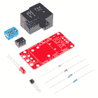
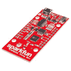
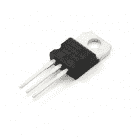
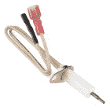
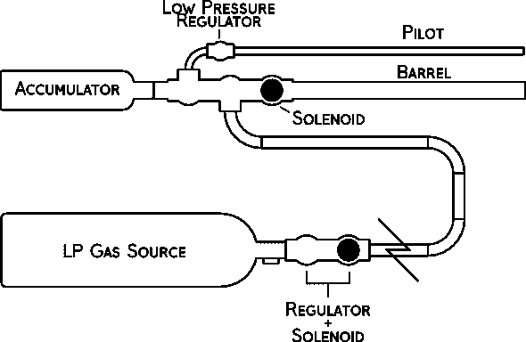
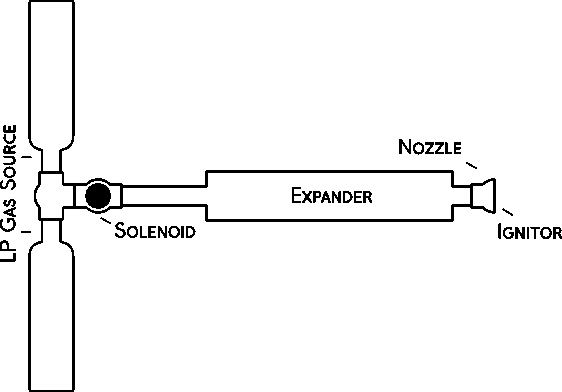
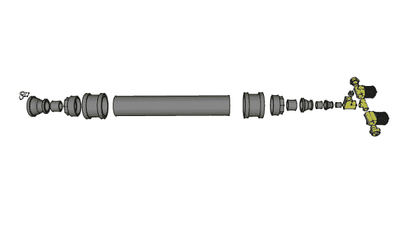
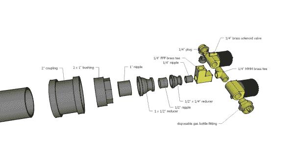
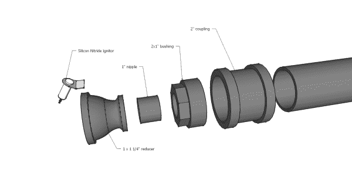
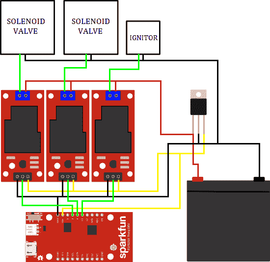

# ESP8266 动力丙烷储罐

> 原文：<https://learn.sparkfun.com/tutorials/esp8266-powered-propane-poofer>

## 介绍

有什么比看一场大火更有趣的吗？在历史上的大部分时间里，从奥运会到亲吻团聚之旅(当然，这些是人类历史上的决定性时刻)，烟火效果一直在为每件事增添边缘。但尽管古希腊人更喜欢与一名筋疲力尽的手持火炬的运动员一起点火，我对舒适的沙发上点火更感兴趣。进入: [ESP8266 东西开发板](https://www.sparkfun.com/products/13711)。现在我们用煤气做饭...

[](https://cdn.sparkfun.com/assets/learn_tutorials/4/9/3/12466116_10153370524028527_1736780082453415786_o.jpg)*This could be us but you haven't built a flame-thrower.*

[https://www.youtube.com/embed/AI_m0yrUAlA/?autohide=1&border=0&wmode=opaque&enablejsapi=1](https://www.youtube.com/embed/AI_m0yrUAlA/?autohide=1&border=0&wmode=opaque&enablejsapi=1)

### 所需材料

除了制造丙烷储罐(稍后讨论)所需的所有组件之外，您还需要以下电子设备来复制该项目:

[](https://www.sparkfun.com/products/13815) 

将**添加到您的[购物车](https://www.sparkfun.com/cart)中！**

### [spark fun beef beast 继电器控制套件(版本。2.0)](https://www.sparkfun.com/products/13815)

[Out of stock](https://learn.sparkfun.com/static/bubbles/ "out of stock") KIT-13815

你的 5V 系统可以通过这个大而结实的继电器板发挥巨大的能量。NC 触点上的 10A 和 NO cont 上的 20A 是如何…

$9.9521[Favorited Favorite](# "Add to favorites") 36[Wish List](# "Add to wish list")****[](https://www.sparkfun.com/products/13711) 

将**添加到您的[购物车](https://www.sparkfun.com/cart)中！**

### [SparkFun ESP8266 东西开发板](https://www.sparkfun.com/products/13711)

[In stock](https://learn.sparkfun.com/static/bubbles/ "in stock") WRL-13711

SparkFun ESP8266 Thing Dev Board 是一款开发板，专门围绕 ESP8266 设计，集成了一个

$18.5070[Favorited Favorite](# "Add to favorites") 58[Wish List](# "Add to wish list")****[](https://www.sparkfun.com/products/107) 

将**添加到您的[购物车](https://www.sparkfun.com/cart)中！**

### [稳压器- 5V](https://www.sparkfun.com/products/107)

[Only 7 left!](https://learn.sparkfun.com/static/bubbles/ "only 7 left!") COM-00107

这是基本的 L7805 电压调节器，一个具有 5V 固定输出电压的三端正调节器。这个固定的 reg…

$1.053[Favorited Favorite](# "Add to favorites") 50[Wish List](# "Add to wish list")****[](https://www.sparkfun.com/products/retired/11694) 

### [氮化硅点火器- 12V](https://www.sparkfun.com/products/retired/11694)

[Retired](https://learn.sparkfun.com/static/bubbles/ "Retired") COM-11694

每个人都喜欢(小心控制的)火！我们遇到了一些非常有野心的家伙，他们的使命是让制造商保持…

2 **Retired**[Favorited Favorite](# "Add to favorites") 5[Wish List](# "Add to wish list")****** ******### 推荐阅读

如果您在这个项目之前没有使用过 ESP8266，我们强烈建议您在开始这个项目之前阅读我们的 ESP8266 Thing Dev Board 连接指南。

[](https://learn.sparkfun.com/tutorials/esp8266-thing-development-board-hookup-guide) [### ESP8266 东西开发板连接指南

#### 2015 年 11 月 5 日](https://learn.sparkfun.com/tutorials/esp8266-thing-development-board-hookup-guide) An overview of SparkFun's ESP8266 Thing Development Board - a development board for the Internet of Things.[Favorited Favorite](# "Add to favorites") 15

## 火焰投掷 101

丙烷储罐是一个综合解决的工程问题。在谷歌上快速搜索一下，就会发现丙烷动力火焰效果的设计比你摇动棍子能看到的还要多。很明显，火人节吸引了相当多的半职业烟火爱好者。浏览这些设计，我发现虽然有很多变化，丙烷储罐的基本结构保持不变:

[](https://cdn.sparkfun.com/assets/learn_tutorials/4/9/3/poofer.png)

这是丙烷火焰加农炮的最佳设计，也就是所谓的“蓄压加农炮”。在蓄压式加农炮中，燃料源被调节到相对较低的压力，并被送入蓄压罐(通常，它们是经过改造的丙烷气瓶)。这些蓄压器允许几门加农炮从一个大的气源中供气。每门加农炮都有一个低压调节器，当需要制造火球时，它会持续燃烧以提供点火源。到时候，蓄能器末端的电磁阀打开，让蓄能器通过枪管放空，由飞行员点火。因为蓄压器被允许增压，你可以在同一个坦克上同时发射多门蓄压器加农炮，而不用担心系统中的巨大压力下降。

因为我正在建造一门便携式加农炮，所以我决定稍微修改一下这个设计。这是我想到的:

[](https://cdn.sparkfun.com/assets/learn_tutorials/4/9/3/poofer2.png)

我的燃料来源是一对一次性的丙烷钢瓶，就像野营用的炉子和火把一样。这些体积小，重量轻，价格便宜...另外，我可以在当地的五金店买一大把。两辆这样的坦克可以给我的大炮提供燃料。一旦我决定了我设计的要点，我就开始购买零件...

## 建造贫民区

在亚马逊和五金店之间，我整理出了以下零件清单:

来自五金店管道部

*   2 英寸 x12 英寸螺纹管接头
*   2 英寸耦合器(x2)
*   2 英寸 x1 英寸套管(x2)
*   1 英寸螺纹管接头(x2)
*   1 英寸 x1/2 英寸异径管
*   1/2 英寸螺纹管接头
*   1/2 英寸 x1/4 英寸异径管
*   1/4 英寸螺纹管接头
*   1 1/4 英寸异径管
*   1/4 英寸螺纹塞

来自不同的亚马逊卖家

*   1/4 英寸 FFF 黄铜三通
*   1/4" MMM 黄铜三通
*   1/4 英寸电磁阀(x2)
*   1/4 英寸黄铜气瓶适配器

所有的零件都收集好了，是时候组装大炮了！这里有几个分解图(没有双关的意思)来详细说明一切是如何配合的:

[](https://cdn.sparkfun.com/assets/learn_tutorials/4/9/3/xploded_3.jpg)*Click images for a larger view.*

如你所见，我用一系列变径接头将一英尺长的 2 英寸管道连接到气瓶的出口，从而建造了膨胀室。我用电子点火器取代了飞行员，消除了对低压调节器和单独的燃料管线的需要。我还决定将电磁阀移到三通接头之前的部分，这样我就可以单独打开每个通向膨胀室的瓶子。让我们仔细看看这个三通接头:

[](https://cdn.sparkfun.com/assets/learn_tutorials/4/9/3/xploded_1_labeled.jpg)

你可能会奇怪，为什么我在扩管器和公三通之间加了一个母三通，只是为了堵住不用的端口。最初，在加农炮的输出端有一个大电磁阀，允许膨胀机用作蓄能器。我有一个 1/4 英寸的压力传感器拧入端口，以监测膨胀室的内部压力。事实证明，将膨胀机升至油箱压力并通过 1”螺线管进行吹扫不仅噪音震耳欲聋，而且会产生几乎不可能可靠点燃的未碳化气体流。当我移除大电磁阀时，我也移除了压力传感器(因为大炮的那个部分变得对大气开放)。

[](https://cdn.sparkfun.com/assets/learn_tutorials/4/9/3/xploded_2_labeled.jpg)

大炮的喷嘴端被设计成促使逸出的气体扩散并与周围的空气混合。我钻了一个孔，在一侧的减少配件，以确保氮化硅点火器。点火器的导线沿着膨胀室的侧面延伸，在膨胀室中，导线被包在加热带中，以保护导线免受火灾。

因为这种加农炮没有引爆器，所以为了在炮管末端产生明火，需要从一个坦克向膨胀室进行短暂的爆发。当气体通过喷嘴和点火器附近的碳从膨胀机中缓慢泄漏时，它将保持低火焰。当要发射一个大的噗的时候，你只需要打开两个瓶子大约半秒钟，然后*嗖的一声*！

## 装上电线

如果丙烷瓶是这次行动的核心，那么 ESP8266 绝对是大脑。东西板将允许我们连接到火焰加农炮，并在安全的距离内发射它。因为这个东西不能提供接近点燃电磁阀或点火器所需的电压或电流，我们将使用我们的[牛肉继电器](https://www.sparkfun.com/products/11042)套件来切换它们。我们的 12v 直流电源需要是便携式的，可充电的，并且能够提供相当大的电流，所以我在家用报警系统中使用了密封的铅酸电池。你可以在大多数家装店买到这些。

这是整个项目连接起来后的样子:

[](https://cdn.sparkfun.com/assets/learn_tutorials/4/9/3/flamedia3.png)

在这个项目中，SLA 电池用作整个钻机的电源。但是，ESP8266 Thing Dev 板的 VIN 容差为 **3.3V 和 6V** 。我不建议用未调节的 12V 给你的东西开发板供电。需要一个 5V 的电源来正确地给东西开发板供电以及启动继电器。我草率地连接了一个 5V 的调节器，它提供了足够的 5V 电源来有效地切换这些强壮的继电器。每个继电器的信号线都连接到一个 GPIO 引脚上，我选择 4，0 和 13 只是因为它们是并排的。最后，在到达点火器和两个电磁阀之前，12V 线路的高压侧由每个继电器切换。

为了给 SLA 电池充电，我只是把它放在我的工作台电源上，大约 14V，直到它停止汲取电流。有更好的方法可以做到这一点，但是我对我的系统很满意。由于板载跟踪天线，我没有找到一个必要的外部天线来使它在很大的范围内工作。然而，如果你想要额外的范围，你可以切断天线迹线，在 RP-SMA 尾纤上添加一个 [U.fl，并拧上我们的一个大](https://www.sparkfun.com/products/662)[橡胶鸭天线](https://www.sparkfun.com/products/558)。

为了保持电子产品的安全和干燥，我把它们放在一个塑料弹药箱里，这是我在五金店买的。一束电缆穿过盒子侧面的一个孔，连接到大炮上。整个单元不太重，可以把炮靠在箱子上稳住。

## 编程的东西

我们在评估板上使用的固件基于 AP Web 服务器示例代码。此示例代码将事物板设置为无线接入点，并为任何连接的客户端提供简单的网页。大部分的魔法都在 ESP8266WiFi 库中，所以草图本身根本就不是很长。让我们来看看:

```
language:c

#include <ESP8266WiFi.h>

//////////////////////
// WiFi Definitions //
//////////////////////
const char WiFiAPPSK[] = "sparkfun";

/////////////////////
// Pin Definitions //
/////////////////////
const int VENT1_PIN = 4; // 
const int VENT2_PIN = 0; // 
const int IGNITION_PIN = 13; // 

WiFiServer server(80);

void setup() 
{
  initHardware();
  setupWiFi();
  server.begin();
}

void loop() 
{
  // Check if a client has connected
  WiFiClient client = server.available();
  if (!client) {
    return;
  }

  // Read the first line of the request
  String req = client.readStringUntil('\r');
  Serial.println(req);
  client.flush();

  // Match the request
  int val = -1;
  if (req.indexOf("/vent1/1") != -1)
    val = 0; 
  else if (req.indexOf("/vent2/1") != -1)
    val = 2; 
  else if (req.indexOf("/vent_all/1") != -1)
    val = 3;
  else if (req.indexOf("/ignition/1") != -1)
    val = 4; 
  else if (req.indexOf("/ignition/0") != -1)
    val = 5;

  // Set GPIO according to the request

  if (val == 0){
    digitalWrite(VENT1_PIN, 1);
    delay(500);
    digitalWrite(VENT1_PIN, 0);}

  else if (val == 2){
    digitalWrite(VENT2_PIN, 1);
    delay(500);
    digitalWrite(VENT2_PIN, 0);}

  else if (val == 3){
    digitalWrite(VENT1_PIN, 1);
    digitalWrite(VENT2_PIN, 1);
    delay(500);
    digitalWrite(VENT1_PIN, 0);
    digitalWrite(VENT2_PIN, 0);}

  else if (val == 4){
    digitalWrite(IGNITION_PIN, 1);}

  else if (val == 5){
    digitalWrite(IGNITION_PIN, 0);}

  client.flush();

  // Prepare the response. Start with the common header:
  String s = "HTTP/1.1 200 OK\r\n";
  s += "Content-Type: text/html\r\n\r\n";
  s += "<!DOCTYPE HTML>\r\n<html>\r\n";

  if ( digitalRead(IGNITION_PIN) == 0 ){
  s += "Ignitior is currently turned OFF.";}
  else{
  s += "Ignitior is currently turned ON.";}
  s += "<br><br>\r\n"; // Go to the next line.

  s += "<a href = \"/ignition/1\">Glow Ingition On</a><br>\r\n";
  s += "<a href = \"/ignition/0\">Glow Ingition Off</a><br>\r\n";
  s += "<a href = \"/vent1/1\">Vent Tank 1 (500ms)</a><br>\r\n";
  s += "<a href = \"/vent2/1\">Vent Tank 2 (500ms)</a><br>\r\n";
  s += "<a href = \"/vent_all/1\">Vent Both Tanks (500ms)</a><br>\r\n";

  s += "</html>\n";

  // Send the response to the client
  client.print(s);
  delay(1);
  Serial.println("Client disonnected");

  // The client will actually be disconnected 
  // when the function returns and 'client' object is detroyed
}

void setupWiFi()
{
  WiFi.mode(WIFI_AP);

  // Do a little work to get a unique-ish name. Append the
  // last two bytes of the MAC (HEX'd) to "Thing-":
  uint8_t mac[WL_MAC_ADDR_LENGTH];
  WiFi.softAPmacAddress(mac);
  String macID = String(mac[WL_MAC_ADDR_LENGTH - 2], HEX) +
                 String(mac[WL_MAC_ADDR_LENGTH - 1], HEX);
  macID.toUpperCase();
  String AP_NameString = "ESP8266 Flame Cannon " + macID;

  char AP_NameChar[AP_NameString.length() + 1];
  memset(AP_NameChar, 0, AP_NameString.length() + 1);

  for (int i=0; i<AP_NameString.length(); i++)
    AP_NameChar[i] = AP_NameString.charAt(i);

  WiFi.softAP(AP_NameChar, WiFiAPPSK);
}

void initHardware()
{
  Serial.begin(115200);
  pinMode(VENT1_PIN, OUTPUT);
  digitalWrite(VENT1_PIN, LOW);
  pinMode(VENT2_PIN, OUTPUT);
  digitalWrite(VENT2_PIN, LOW);
  pinMode(IGNITION_PIN, OUTPUT);
  digitalWrite(IGNITION_PIN, LOW);

} 
```

因为这段代码本质上是示例代码的扩展版本，所以我不会在这里深入探讨。话虽如此，让我们来看看发生了什么变化:

### 匹配请求

虽然示例代码仅寻找 3 个可能的有效请求，但我们将寻找 5 个中的任何一个:点火开启、点火关闭、排气箱 1、排气箱 2 和全部排气。我们通过给每个请求赋值来处理这些请求，如下所示:

```
language:c
  if (req.indexOf("/vent1/1") != -1)
    val = 0; 
  else if (req.indexOf("/vent2/1") != -1)
    val = 2; 
  else if (req.indexOf("/vent_all/1") != -1)
    val = 3;
  else if (req.indexOf("/ignition/1") != -1)
    val = 4; 
  else if (req.indexOf("/ignition/0") != -1)
    val = 5; 
```

当我们发送回复时，我们会包含每个请求的超链接。

### 设置 GPIO

```
language:c
 if (val == 0){ // Vent Tank 1
    digitalWrite(VENT1_PIN, 1);
    delay(500);
    digitalWrite(VENT1_PIN, 0);}

  else if (val == 2){ // Vent Tank 2
    digitalWrite(VENT2_PIN, 1);
    delay(500);
    digitalWrite(VENT2_PIN, 0);}

  else if (val == 3){ // Vent All
    digitalWrite(VENT1_PIN, 1);
    digitalWrite(VENT2_PIN, 1);
    delay(500);
    digitalWrite(VENT1_PIN, 0);
    digitalWrite(VENT2_PIN, 0);}

  else if (val == 4){ // Ignition On
    digitalWrite(IGNITION_PIN, 1);}

  else if (val == 5){ // Ignition Off
    digitalWrite(IGNITION_PIN, 0);} 
```

每个有效请求都有一个相关的 GPIO 调用来打开或关闭继电器。“放空罐”要求简单地关闭继电器半秒钟，然后释放。向点火器发出的请求将其设置为开或关位置，直到进一步通知。

### 拟定答复

我们的服务器的回复将始终是一个超链接列表，这样可以很容易地快速发出有效的请求。在列表的顶部，我们将添加一个指示器，让我们知道是否打开了点火器。html 响应的每一行都被附加到一个 string 对象上，并被发送到服务器库，以便转发给客户机。没有奇怪格式的 html 响应如下所示:

```
 HTTP/1.1 200 OK
  Content-Type: text/html
  <!DOCTYPE HTML>

  <html>

  Ignitior is currently turned ON.<br>
  <a href = "/ignition/1">Glow Ingition On</a><br>
  <a href = "/ignition/0">Glow Ingition Off</a><br>
  <a href = "/vent1/1">Vent Tank 1 (500ms)</a><br>
  <a href = "/vent2/1">Vent Tank 2 (500ms)</a><br>
  <a href = "/vent_all/1">Vent Both Tanks (500ms)</a><br>

  </html> 
```

## 生火！

这东西准备喷火了！但首先，一份清单:

*   确保你的丙烷瓶连接牢固。
*   倾听可能的泄漏。
*   连接电池引线，为系统通电。
*   保持安全距离。
*   在手机或笔记本电脑上连接喷火器的 WiFi 网络。
*   导航至 192 . 168 . 4 . 1/点火/0
*   按下“辉光点火开启”
*   给点火器几秒钟时间加热。
*   按下“通风罐 1(500 毫秒)”
*   等待火焰开始燃烧

大炮现在已经点燃，准备发射。清空该区域，并按下“发泄所有”一个可怕的火球！一定要给大炮一些时间休息。每次你开炮时，电磁阀都会被冰冷的液态丙烷淹没，过多的连续操作*会*损坏阀门，可能会锁住阀门。

[](https://cdn.sparkfun.com/assets/learn_tutorials/4/9/3/9dd458e3-417b-44e9-bc56-9c44fd8e7a7e.png)*Kudos to Sarah for holding the cannon while I was holding the trigger*

## 资源和更进一步

人们可以在网上找到几乎无限的资源来制作消防玩具。多亏了像火人节这样的节日和像制造者集会这样的活动，人们可以去很多地方展示他们的燃烧性创作，这意味着他们周围已经形成了一个大社区。如果你对构建火焰效果感兴趣，这里有几个值得一去的地方:

*   [Poofer Supply](http://www.poofersupply.com/)——出售消防玩具零零碎碎的小网店。即使你更愿意在亚马逊上购物，这也是一个很好的起点，你可以从中找到你想要的东西。
*   Foxfur 逗乐博客 -一个不错的小构建，我在开发 poofer 时参考了它。
*   燃烧人火焰特效社区 -为喜欢制作火焰特效的人设立的令人敬畏的脸书团队。
*   [工程圆桌会议](https://www.youtube.com/watch?v=A1VySF2Rd4I&list=PL9E713AB7106526D2&index=14)-Chris Taylor 声控火炬！

### 更进一步

有关 Thing board 和其他连接项目的更多信息，请查看这些教程！

[](https://learn.sparkfun.com/tutorials/esp8266-thing-development-board-hookup-guide) [### ESP8266 东西开发板连接指南](https://learn.sparkfun.com/tutorials/esp8266-thing-development-board-hookup-guide) An overview of SparkFun's ESP8266 Thing Development Board - a development board for the Internet of Things.[Favorited Favorite](# "Add to favorites") 15[](https://learn.sparkfun.com/tutorials/interactive-smart-mirror) [### 交互式智能镜子](https://learn.sparkfun.com/tutorials/interactive-smart-mirror) Build a smart mirror that displays weather data using the Intel® Edison.[Favorited Favorite](# "Add to favorites") 24[](https://learn.sparkfun.com/tutorials/led-cloud-connected-cloud) [### LED 云-连接云](https://learn.sparkfun.com/tutorials/led-cloud-connected-cloud) Make an RGB colored cloud light! You can also control it from your phone, or hook up to the weather 31******