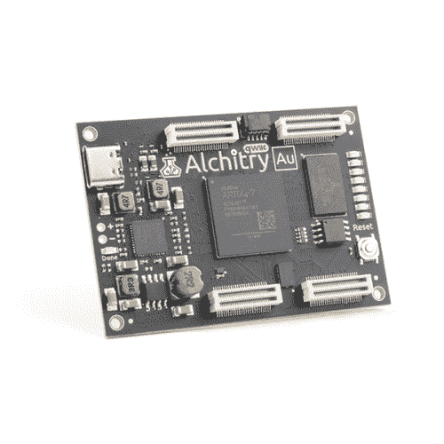

# 外部 IO 和亚稳定性

> 原文：<https://learn.sparkfun.com/tutorials/external-io-and-metastability>

## 介绍

如果您已经阅读了前几篇 Alchitry 教程，您可能想知道顶级模块的输入和输出如何知道电路板上的连接位置。LED 名称告诉工具使用 [FPGA](https://www.sparkfun.com/fpga) 上的哪个引脚是什么？难怪了！在本教程中，我将解释约束文件的基础知识，并探究在设计中使用外部信号的一些危险。

 

将**添加到您的[购物车](https://www.sparkfun.com/cart)中！**

### [Alchitry Cu FPGA 开发板(格子 iCE40 HX)](https://www.sparkfun.com/products/16526)

[In stock](https://learn.sparkfun.com/static/bubbles/ "in stock") DEV-16526

如果您不需要大量的电源来开始您的 FPGA 冒险，或者正在寻找一个更经济的选择，Alchitry…

$53.503[Favorited Favorite](# "Add to favorites") 7[Wish List](# "Add to wish list")**** 

### [Alchitry Au FPGA 开发板(Xilinx Artix 7)](https://www.sparkfun.com/products/16527)

[Out of stock](https://learn.sparkfun.com/static/bubbles/ "out of stock") DEV-16527

Alchitry Au 是 FPGA 开发板的黄金标准，可能是同类产品中最强的板之一…

6[Favorited Favorite](# "Add to favorites") 15[Wish List](# "Add to wish list") 

将**添加到您的[购物车](https://www.sparkfun.com/cart)中！**

### [Alchitry Au+ FPGA 开发板(Xilinx Artix 7)](https://www.sparkfun.com/products/17514)

[In stock](https://learn.sparkfun.com/static/bubbles/ "in stock") DEV-17514

Alchitry Au+是 FPGA 开发板的黄金标准，可能是同类开发板中最强的一种

$324.951[Favorited Favorite](# "Add to favorites") 12[Wish List](# "Add to wish list")**** ****### 所需材料

本教程主要是概念性的，但是如果你想继续学习，你需要以下材料。

&nbsp****