# 萤火虫罐组装指南

> 原文：<https://learn.sparkfun.com/tutorials/firefly-jar-assembly-guide>

## 入门指南

本教程使用[萤火虫罐套件](https://www.sparkfun.com/products/11833)。

[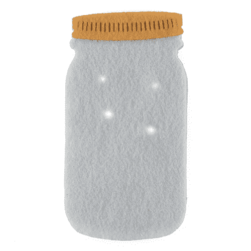](https://www.sparkfun.com/products/retired/11833) 

### [萤火虫罐套装](https://www.sparkfun.com/products/retired/11833)

[Retired](https://learn.sparkfun.com/static/bubbles/ "Retired") KIT-11833

你正在寻找一个有趣而简单的电子纺织品项目吗？萤火虫罐套件是一个伟大的项目，任何人从初学者到…

2 **Retired**[Favorited Favorite](# "Add to favorites") 20[Wish List](# "Add to wish list")

好了，我们准备好开始使用我们的萤火虫套件了。请注意，您必须将 ProtoSnap LilyTwinkle 板拆分成下面列出的所有独立组件。你可能需要用剪刀把它们分开。让我们来看一下完成项目所需的所有东西:

**LilyPad ProtoSnap 包括:**

*   百合
*   4 个 LilyPad LEDs
*   LilyPad 硬币电池座(开关式)
*   3V 纽扣电池

**其他组件包括:**

*   导电线线轴
*   毛毡罐盖
*   两个相同的毛毡罐层
*   缝纫针

[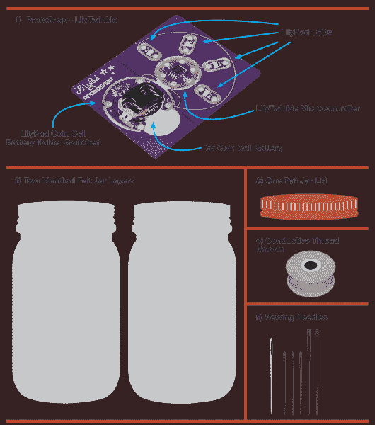](https://cdn.sparkfun.com/assets/9/a/a/4/6/51b8e7a4ce395f7c02000000.png)*All the components you'll need to put your Firefly kit together*
For the graphics in this tutorial, we'll be using a key that helps explain what is going on at each step:

现在让我们开始缝纫吧！

### 推荐阅读

如果你以前从未使用过电子纺织品，你可以看看其他的教程。

*   [电子纺织品基础知识](https://learn.sparkfun.com/tutorials/e-textile-basics)
*   [用导电线缝制](https://learn.sparkfun.com/tutorials/sewing-with-conductive-thread)
*   [基础 Lilypad 教程](https://www.sparkfun.com/tutorials/313)
*   [LilyPad Protosnap 入门指南](https://www.sparkfun.com/tutorials/307)

## 第一步:积极有力

**注意！**

请注意，原理图上的灰色组件表示它们位于毛毡片的侧对面的**侧。请注意“脸”字的方向。**

**注意！**

你只需要一个毛毡罐子切口来缝你的组件。暂时把另一个放下。按照示意图中所示的方式放置您的组件。注意脸朝向哪个方向。

[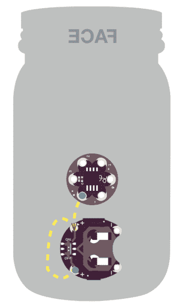](https://cdn.sparkfun.com/assets/5/4/4/b/1/51b75261ce395f4d12000000.png)

1.  开始时，在电池座的底部**正极**引脚周围绕 2-3 圈。
2.  缝合到顶部**正极**销。穿过并绕着针循环 2-3 次。
3.  缝合到微控制器上的**正极**引脚。在那里打个结。剪掉任何多余的线。

## 步骤 2:脚踏实地

请注意，原理图上的灰色组件表示它们位于毛毡片的侧对面的**侧。请注意“脸”字的方向。**

[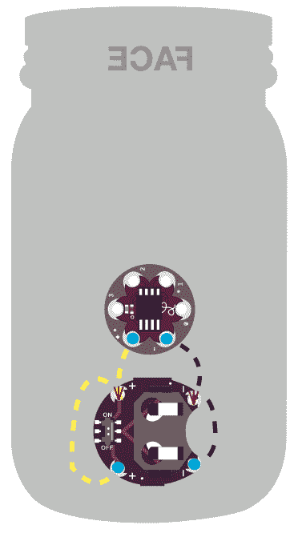](https://cdn.sparkfun.com/assets/7/5/0/a/0/51b75307ce395f5912000000.png)

1.  用一根新的线环穿过并绕过电池座的底部**负极**引脚 2-3 圈。
2.  缝合到顶部**负**销。穿过并绕着针循环 2-3 次。
3.  缝合到微控制器上的**负**引脚。在那里打个结。剪掉任何多余的线。

## 第三步:第一个 LED

请注意，原理图上的灰色组件表示它们位于毛毡片的侧对面的**侧。请注意“脸”字的方向。**

请注意，发光二极管需要**灯面朝上**放置在这块毛毡的另一侧。[第 8 步](https://learn.sparkfun.com/tutorials/firefly-jar/step-8-check-yourself)向你展示它应该是什么样子。在第 3-6 步中，你将为每个 led 使用一根新的线。

[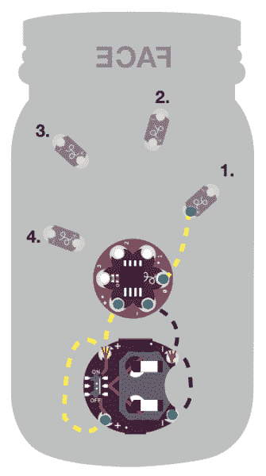](https://cdn.sparkfun.com/assets/0/7/9/a/3/51b754e7ce395f8f12000000.png)

1.  将新的线穿过并绕过微控制器上的**引脚 0**2-3 次。
2.  缝合到 **LED 1** 的**正极**引脚。在那里打个结。剪掉任何多余的线。

## 第四步:LED:续集

请注意，原理图上的灰色组件表示它们位于毛毡片的侧对面的**侧。请注意“脸”字的方向。**

[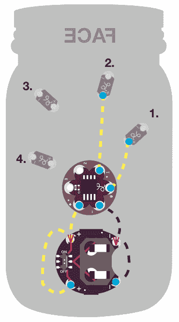](https://cdn.sparkfun.com/assets/d/b/5/f/1/51b759e5ce395fa013000000.png)

1.  将线穿过并绕过微控制器上的**引脚 1**2-3 次。
2.  缝合到 **LED 2** 上的**正极**引脚。在那里打个结。剪掉任何多余的线。

## 第五步:领导第三个

请注意，原理图上的灰色组件表示它们位于毛毡片的侧对面的**侧。请注意“脸”字的方向。**

[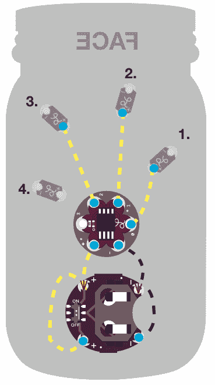](https://cdn.sparkfun.com/assets/9/d/7/7/b/51b75b68ce395f0911000001.png)

1.  将线穿过并绕过微控制器上的**引脚 2**2-3 次。
2.  缝合到 **LED 3** 的**正极**引脚。在那里打个结。剪掉任何多余的线。

## 第六步:最后一个 LED！

请注意，原理图上的灰色组件表示它们位于毛毡片的侧对面的**侧。请注意“脸”字的方向。**

[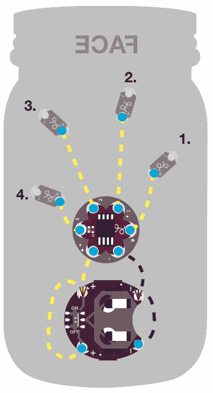](https://cdn.sparkfun.com/assets/6/7/a/4/8/51b764bfce395f2012000000.png)

1.  最后，将线穿过并绕过微控制器上的**引脚 3**2-3 次。
2.  缝合到 **LED 4** 的**正极**引脚。在那里打个结。剪掉任何多余的线。

## 第七步:你是消极的！

请注意，原理图上的灰色组件表示它们位于毛毡片的侧对面的**侧。请注意“脸”字的方向。**

[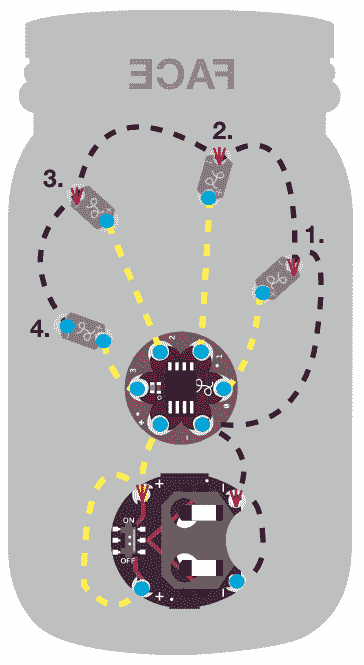](https://cdn.sparkfun.com/assets/a/b/8/7/2/51b767c3ce395f4612000001.png)

1.  接下来，剪一根长的线(2 英尺)，穿过并绕过微控制器上的**负极**引脚 2-3 次，继续缝到 **LED 1** 上的第一个**负极引脚**。
2.  绕着它循环 2-3 次，从右到左继续你的轨迹。绕过**led 2-4**上的每个**负极**引脚 2-3 次。
3.  一旦到达 **LED 4** 的负极引脚，在那里打一个环并打结。剪掉任何多余的线。
4.  万岁！这就完成了你的缝纫。查看[第 8 步](https://learn.sparkfun.com/tutorials/firefly-jar-assmebly-guide/step-8-check-yourself)看看接下来要做什么！

## 第八步:自我检查

**注意！**

这种毛毡图案现在翻转到正面。

[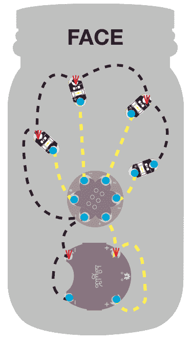](https://cdn.sparkfun.com/assets/a/3/0/0/b/51b76885ce395f2e12000002.png)

1.  检查以确保你的萤火虫罐从发光二极管所在的正面看起来像这样。

## 步骤 9:测试 1、2、3

请注意，原理图上的灰色组件表示它们位于毛毡片的侧对面的**侧。请注意“脸”字的方向。**

[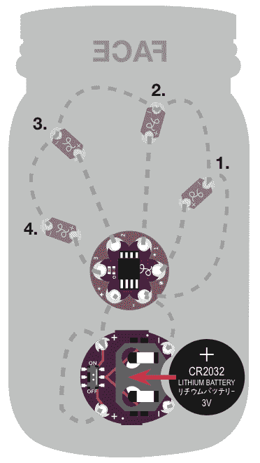](https://cdn.sparkfun.com/assets/5/f/6/7/1/51b76a46ce395f9713000005.png)

1.  将硬币电池正极(+)朝上滑入电池盒，测试您的项目。打开它，并确保它亮起。
2.  如有必要，执行任何故障排除。(如有需要，请参考[电子纺织基础教程](https://learn.sparkfun.com/tutorials/e-textile-basics)获取帮助。)

**注意！**

在继续执行步骤 10 之前，请确保关闭您的开关。

## 第十步:掩盖事实

**注意！**

这种毛毡图案现在翻转到正面。

[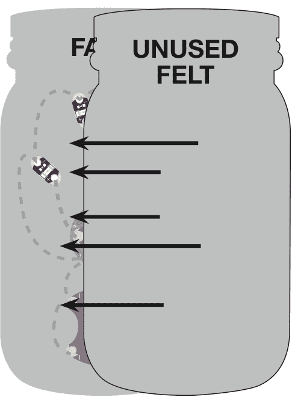](https://cdn.sparkfun.com/assets/8/0/f/4/4/51b76c28ce395f7d12000004.png)

1.  确保缝合毛毡的背面暴露在外，以便能够接触到电池座和开关。

有两种方法可以完成你的萤火虫罐:

A.将之前放在一边的未使用过的毛毡放在缝制毛毡的 LED 暴露面上。用普通的线把边缘缝在一起

B.用喷胶把没用过的毛毡粘上。将该片粘贴到缝制毛毡的 LED 暴露侧。

## 第十一步:盖上盖子

*This is your felt lid*

1.  拿起你的毛毡盖，把它缝在或喷胶在没用过的毛毡上。

## 第十二步:要有光！

1.  把你的硬币电池放回电池座，打开开关，看着你的萤火虫发光！尽情享受吧！

## 进一步阅读

既然你已经掌握了 firefly-jar e-textile 的制作艺术，你可能想看看其他一些教程:

*   [LDK 实验一:点亮一个基本电路](https://learn.sparkfun.com/tutorials/ldk-experiment-1-lighting-up-a-basic-circuit)
*   [软电路 LED 感情披萨](https://learn.sparkfun.com/tutorials/soft-circuits-led-feelings-pizza)
*   [lily pad MP3 播放器入门](https://learn.sparkfun.com/tutorials/getting-started-with-the-lilypad-mp3-player)
*   [加热垫暖手毯](https://learn.sparkfun.com/tutorials/heating-pad-hand-warmer-blanket)