# 柔性传感器连接指南

> 原文：<https://learn.sparkfun.com/tutorials/flex-sensor-hookup-guide>

## 介绍

这款柔性传感器是一款独一无二的可变电阻。弯曲传感器的电阻随着部件主体的弯曲而增加。像这样的传感器被用在任天堂的[电动手套](http://en.wikipedia.org/wiki/Power_Glove)中。它们还可以被用作门传感器、[机器人触须传感器](http://hackedgadgets.com/2008/04/13/map-bot-floor-mapping-robot/)，或者是创造[有知觉填充动物](https://www.flickr.com/photos/p_kirn/405370202/)的主要部件。

[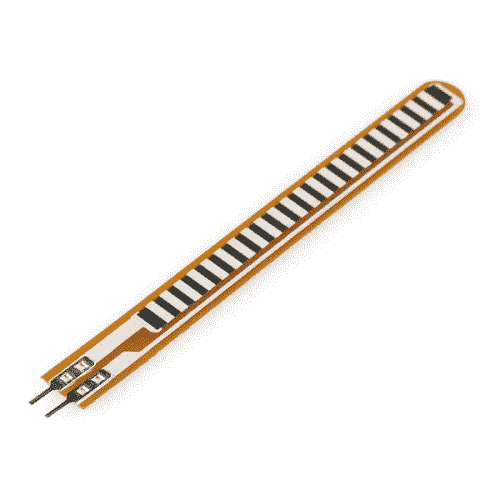](https://www.sparkfun.com/products/10264) 

将**添加到您的[购物车](https://www.sparkfun.com/cart)中！**

### [柔性传感器 2.2"](https://www.sparkfun.com/products/10264)

[Out of stock](https://learn.sparkfun.com/static/bubbles/ "out of stock") SEN-10264

长度为 2.2 英寸的简单柔性传感器。随着传感器弯曲，传感器两端的电阻增加。专利技术…

$11.9515[Favorited Favorite](# "Add to favorites") 70[Wish List](# "Add to wish list")****[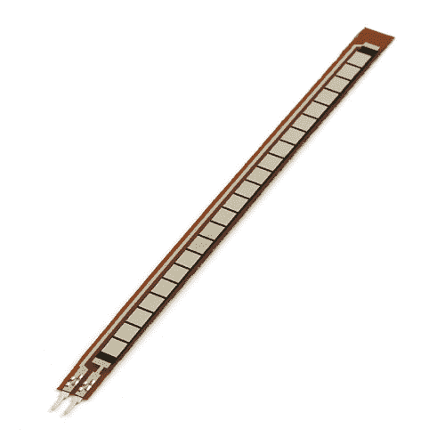](https://www.sparkfun.com/products/8606) 

将**添加到您的[购物车](https://www.sparkfun.com/cart)中！**

### [柔性传感器 4.5"](https://www.sparkfun.com/products/8606)

[In stock](https://learn.sparkfun.com/static/bubbles/ "in stock") SEN-08606

长度为 4.5 英寸的简单弯曲传感器。随着传感器弯曲，传感器两端的电阻增加。专利技术…

$17.9510[Favorited Favorite](# "Add to favorites") 58[Wish List](# "Add to wish list")**** ****[https://www.youtube.com/embed/lEUVlSsAhCg/?autohide=1&border=0&wmode=opaque&enablejsapi=1](https://www.youtube.com/embed/lEUVlSsAhCg/?autohide=1&border=0&wmode=opaque&enablejsapi=1)

柔性传感器有两种尺寸:一种是 2.2 英寸(5.588 厘米)长的，另一种是 4.5 英寸(11.43 厘米)长的。

如果平放，这些传感器看起来就像一个 30kΩ电阻。弯曲时，两个端子之间的电阻会在 90°角时增加到 70kΩ。

通过将柔性传感器与静态电阻结合起来，创建一个[分压器](https://learn.sparkfun.com/tutorials/voltage-dividers)，您可以产生一个可变电压，该电压可以被微控制器的模数转换器读取。

### 建议的材料

本教程作为 flex 传感器的快速入门，并演示如何连接和使用它们。除传感器外，建议使用以下材料:

**[Arduino Uno](https://www.sparkfun.com/products/11021)**——我们将使用 Arduino 的模数转换器读入传感器的可变电阻。任何兼容 Arduino 的开发平台——无论是 [RedBoard](https://www.sparkfun.com/products/12757) 、 [Pro](https://www.sparkfun.com/products/10914) 还是[Pro Mini](https://www.sparkfun.com/products/11113)——都可以替代。

**[电阻套件](https://www.sparkfun.com/products/10969)**——为了将 flex 传感器的可变电阻转化为可读电压，我们将它与一个静态电阻结合起来，创建一个分压器。这种电阻套件便于进行一些反复试验，以便尽可能地找出最敏感的电路。

**[试验板](https://www.sparkfun.com/products/12002)和[跳线](https://www.sparkfun.com/products/11026)** -柔性传感器的端子与试验板兼容。我们会把它和电阻粘在一起，然后用跳线从试验板连接到 Arduino。

[](https://www.sparkfun.com/products/10969) 

将**添加到您的[购物车](https://www.sparkfun.com/cart)中！**

### [【电阻器套件- 1/4W(共 500)](https://www.sparkfun.com/products/10969)

[Out of stock](https://learn.sparkfun.com/static/bubbles/ "out of stock") COM-10969

电阻是个好东西，事实上，在许多电路设计中，电阻是至关重要的。唯一的问题似乎是…

$8.95180[Favorited Favorite](# "Add to favorites") 185[Wish List](# "Add to wish list")****[](https://www.sparkfun.com/products/13975) 

将**添加到您的[购物车](https://www.sparkfun.com/cart)中！**

### [spark fun red board——用 Arduino 编程 T3](https://www.sparkfun.com/products/13975)

[In stock](https://learn.sparkfun.com/static/bubbles/ "in stock") DEV-13975

SparkFun RedBoard 结合了 UNO 的 Optiboot 引导程序的简单性、FTDI 的稳定性和 shield com…

$21.5049[Favorited Favorite](# "Add to favorites") 89[Wish List](# "Add to wish list")****[](https://www.sparkfun.com/products/12002) 

将**添加到您的[购物车](https://www.sparkfun.com/cart)中！**

### [【试验板-不干胶(白色)](https://www.sparkfun.com/products/12002)

[In stock](https://learn.sparkfun.com/static/bubbles/ "in stock") PRT-12002

这是你的尝试和真正的白色无焊试验板。它有 2 条电源总线，10 列，30 行，总共 400 个连接…

$5.5048[Favorited Favorite](# "Add to favorites") 93[Wish List](# "Add to wish list")****[](https://www.sparkfun.com/products/11026) 

将**添加到您的[购物车](https://www.sparkfun.com/cart)中！**

### [跳线标准 7" M/M - 30 AWG (30 个装)](https://www.sparkfun.com/products/11026)

[In stock](https://learn.sparkfun.com/static/bubbles/ "in stock") PRT-11026

如果你需要快速完成一个原型，没有什么比一堆跳线更能加快速度的了，让我们来看看

$2.4520[Favorited Favorite](# "Add to favorites") 43[Wish List](# "Add to wish list")******** **********[力敏电阻适配器](https://www.sparkfun.com/categories/tags/amphenol-fci)** -虽然 FSR 端子与试验板兼容，但我们发现它可能会在试验板中松动。对于那些正在寻找一种不用焊接就能实现更安全连接的方法的人来说，试试看相关的 Amphenol 引脚适配器。你需要一把[尖嘴钳](https://www.sparkfun.com/products/8793)来夹住适配器。

[](https://www.sparkfun.com/products/14194) 

将**添加到您的[购物车](https://www.sparkfun.com/cart)中！**

### [【安费诺 FCI】紧钳连接器(2 位，母)](https://www.sparkfun.com/products/14194)

[In stock](https://learn.sparkfun.com/static/bubbles/ "in stock") COM-14194

安费诺 FCI 公司的这些铆钉连接器可用于将扁平柔性电缆(ffc)端接至易于使用的标准 h…

$2.10[Favorited Favorite](# "Add to favorites") 5[Wish List](# "Add to wish list")****[](https://www.sparkfun.com/products/14195) 

将**添加到您的[购物车](https://www.sparkfun.com/cart)中！**

### [【安费诺 FCI 钳连接器(2 位，公)](https://www.sparkfun.com/products/14195)

[In stock](https://learn.sparkfun.com/static/bubbles/ "in stock") COM-14195

安费诺 FCI 公司的这些铆钉连接器可用于将扁平柔性电缆(ffc)端接至易于使用的标准 h…

$2.10[Favorited Favorite](# "Add to favorites") 9[Wish List](# "Add to wish list")****[](https://www.sparkfun.com/products/14196) 

将**添加到您的[购物车](https://www.sparkfun.com/cart)中！**

### [【安费诺 FCI】紧钳连接器(3 位，母)](https://www.sparkfun.com/products/14196)

[In stock](https://learn.sparkfun.com/static/bubbles/ "in stock") COM-14196

安费诺 FCI 公司的这些铆钉连接器可用于将扁平柔性电缆(ffc)端接至易于使用的标准 h…

$1.051[Favorited Favorite](# "Add to favorites") 2[Wish List](# "Add to wish list")****[](https://www.sparkfun.com/products/14197) 

将**添加到您的[购物车](https://www.sparkfun.com/cart)中！**

### [【安费诺 FCI 钳连接器(3 位，公)](https://www.sparkfun.com/products/14197)

[In stock](https://learn.sparkfun.com/static/bubbles/ "in stock") COM-14197

安费诺 FCI 公司的这些铆钉连接器可用于将扁平柔性电缆(ffc)端接至易于使用的标准 h…

$1.052[Favorited Favorite](# "Add to favorites") 3[Wish List](# "Add to wish list")******** ********### 推荐阅读

模拟元件，如这些 flex 传感器，对于初学者来说是一个很好的传感器读取切入点，但有几个电子概念你应该熟悉。如果这些教程的标题对你来说听起来很陌生，考虑先浏览一下这些内容。

[](https://learn.sparkfun.com/tutorials/analog-to-digital-conversion) [### 模数转换](https://learn.sparkfun.com/tutorials/analog-to-digital-conversion) The world is analog. Use analog to digital conversion to help digital devices interpret the world.[Favorited Favorite](# "Add to favorites") 58[](https://learn.sparkfun.com/tutorials/voltage-dividers) [### 分压器](https://learn.sparkfun.com/tutorials/voltage-dividers) Turn a large voltage into a smaller one with voltage dividers. This tutorial covers: what a voltage divider circuit looks like and how it is used in the real world.[Favorited Favorite](# "Add to favorites") 70[](https://learn.sparkfun.com/tutorials/what-is-an-arduino) [### 什么是 Arduino？](https://learn.sparkfun.com/tutorials/what-is-an-arduino) What is this 'Arduino' thing anyway? This tutorials dives into what an Arduino is and along with Arduino projects and widgets.[Favorited Favorite](# "Add to favorites") 50[](https://learn.sparkfun.com/tutorials/analog-vs-digital) [### 模拟与数字](https://learn.sparkfun.com/tutorials/analog-vs-digital) This tutorial covers the concept of analog and digital signals, as they relate to electronics.[Favorited Favorite](# "Add to favorites") 66

## 柔性传感器概述

在我们开始电路构建和 Arduino 编程之前，我们先简要介绍一下 flex 传感器的重要电气特性。

### 它是如何工作的

传感器的一面印有聚合物墨水，其中嵌入了导电颗粒。当传感器是直的时，粒子给墨水提供大约 30k 欧姆的电阻。当传感器弯曲远离墨水时，导电颗粒进一步分开，增加了电阻(当传感器弯曲到 90°时，电阻约为 50k-70K 欧姆，如下图所示)。

[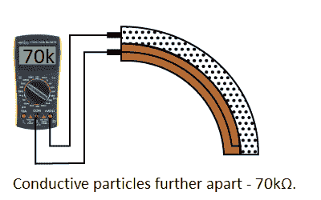](https://cdn.sparkfun.com/assets/learn_tutorials/5/1/1/how-it-works-bent.png)

当传感器再次伸直时，电阻恢复到初始值。通过测量电阻，您可以确定传感器弯曲的程度。

[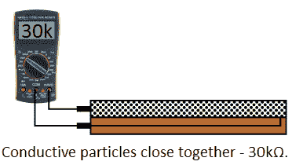](https://cdn.sparkfun.com/assets/learn_tutorials/5/1/1/how-it-works-straight.png)

flex 传感器设计为只能向一个方向弯曲，即远离油墨的方向，如下图所示。

[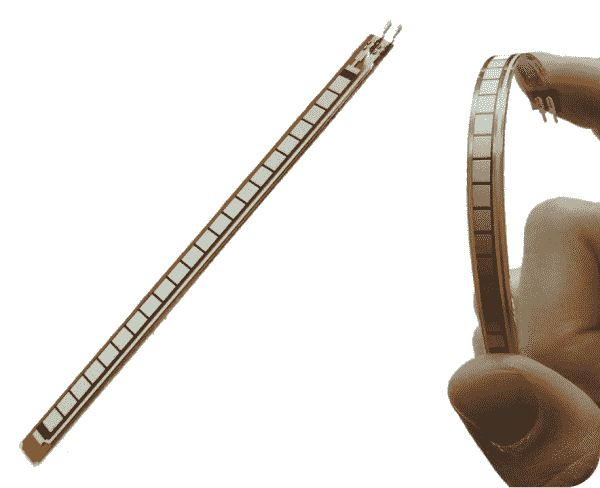](https://cdn.sparkfun.com/assets/learn_tutorials/5/1/1/flex-sensor-direction.png) 
*弯曲传感器弯曲方向(来自[光谱符号数据表](https://cdn.sparkfun.com/datasheets/Sensors/ForceFlex/FLEX%20SENSOR%20DATA%20SHEET%202014.pdf))。*

向另一个方向弯曲传感器不会产生任何可靠的数据，并可能损坏传感器。此外，注意不要将传感器弯曲到靠近底座的位置，因为它们有扭结和失效的趋势。

## 硬件装配

传感器具有焊接接头，焊接接头穿过柔性基板与半导体材料接触。根据您的项目应用和技能，有几种连接到传感器的方法。可能需要一些组件来可靠地连接到引脚。

[](https://cdn.sparkfun.com/assets/learn_tutorials/5/1/0/Solder-Tab-Crimped-Force-Sensitive-Resistor.jpg)

### 试验板兼容标签

对于原型制作和测试，这些焊片可以插入试验板或母跳线。这里有两个关于 flex 和 soft 电位计传感器的例子。

| [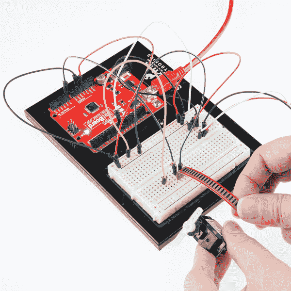](https://learn.sparkfun.com/tutorials/sik-experiment-guide-for-arduino---v32/experiment-9-using-a-flex-sensor) | [](https://learn.sparkfun.com/tutorials/sik-keyboard-instrument) |
| *弯曲传感器垂直插入试验板上，留有弯曲空间* | *软罐垂直插入试验板上，与桌子齐平* |

**Tip:** You can also use the **2.54mm pitch screw terminal** to connect the sensors on a breadboard. However, using two screw terminals side by side for sensors with three solder tabs can make it a tight fit due to the housing. Additionally, they were meant to be soldered into a PCB and the screw terminals may not sit securely in a breadboard socket like a square header pin. **IC hooks** are another option but are only meant as a temporary connection. Any small bumps can cause the IC hook to become loose and disconnect. Using the IC hooks with the sensor for long term projects may not be most secure. [**Alligator clips** can also be used to connect](https://learn.sparkfun.com/tutorials/using-the-sparkfun-picoboard-and-scratch#fsr) to the solder tabs. However, alligator clip's teeth can damage the flexible substrate or cause shorts due to the solder tabs being close to each other.

[](https://www.sparkfun.com/products/9741) 

将**添加到您的[购物车](https://www.sparkfun.com/cart)中！**

### [带猪尾的 IC 钩](https://www.sparkfun.com/products/9741)

[In stock](https://learn.sparkfun.com/static/bubbles/ "in stock") CAB-09741

这些是高质量的 IC 测试钩，带有一根公连接线。这些有两个挂钩，而不是一个挂钩…

$5.5010[Favorited Favorite](# "Add to favorites") 30[Wish List](# "Add to wish list")****[](https://www.sparkfun.com/products/13191) 

将**添加到您的[购物车](https://www.sparkfun.com/cart)中！**

### [【带辫子的鳄鱼夹(4 个装)](https://www.sparkfun.com/products/13191)

[In stock](https://learn.sparkfun.com/static/bubbles/ "in stock") CAB-13191

这是一个 4 包电线，预先终止于一端的鳄鱼夹和另一端的连接尾纤。阿利加…

$3.50[Favorited Favorite](# "Add to favorites") 21[Wish List](# "Add to wish list")****[](https://www.sparkfun.com/products/10571) 

将**添加到您的[购物车](https://www.sparkfun.com/cart)中！**

### [【螺丝端子 2.54mm 螺距(2 针)](https://www.sparkfun.com/products/10571)

[In stock](https://learn.sparkfun.com/static/bubbles/ "in stock") PRT-10571

这些是带有 2.54 毫米间距引脚的简单双位螺丝端子。额定高达 150 伏@ 6A，这个终端可以接受 30 至 18A…

$0.953[Favorited Favorite](# "Add to favorites") 18[Wish List](# "Add to wish list")****** ******### 焊接到标签上

**Warning!** The flexible substrate and semi-conductive material are sensitive to heat. The force sensitive resistors from Interlink are more sensitive compared to other flexible sensors. There is a risk of damaging the sensor when soldering to the solder tabs. We only recommend this for **advanced users** that have adjusted their soldering iron for lower temperatures.

当将其集成到长期项目和安装中时，可以选择将导线或 PCB 直接焊接到焊片上。然而，由于柔性衬底和半导体材料的限制，过多的热量会熔化材料并损坏传感器。下面是我们的生产组装技术人员将 flex 传感器焊接到 PCB 上的示例。

[](https://cdn.sparkfun.com/assets/learn_tutorials/5/1/0/14666-SparkFun_Qwiic_Flex_Glove_Controller-Solder-Tabs-Soldered.jpg)

虽然您可以焊接到 flex 传感器的焊片上，但我们只建议有焊接经验的**高级用户**使用。对于那些焊接到弯曲传感器的，你需要在一个较低的温度下焊接，并确保烙铁加热标签不超过 1 秒钟。再久一点，你会损坏材料和半导体材料。与柔性传感器和软电位计相比，力敏电阻器尤其容易损坏。

**Tip:** For advanced users that are interested in the challenge, try checking out the following forum post and instructions from Digi-Key. While they use a force sensitive resistor, the steps to solder to a flex sensor's solder tabs are the same.

*   [Digi-Key 论坛:如何焊接互连电子 FSR 传感器](https://forum.digikey.com/t/how-to-solder-interlink-electronics-fsr-sensor/555)
*   [如何将电线焊接到 FSR 传感器上](https://media.digikey.com/pdf/Data%20Sheets/Interlink%20Electronics.PDF/FSR400_Soldering_Instr.pdf)

### 安费诺 CFI 铆钉连接器

作为替代，用户可以使用安费诺 FCI 紧钳连接器与传感器进行可靠连接，并在压接连接器上提供少量应变消除。这是推荐给那些以前没有焊接过并且在试验板或教室环境之外的长期项目中使用传感器的人。该连接器被设计成压接柔性印刷电路上的引脚，作为向热敏元件(如半导电材料或导电墨水)施加热量的替代方案。

[](https://cdn.sparkfun.com/assets/learn_tutorials/5/1/0/Flex_Force_Sensitive_SoftPot_Sensor_Clincher_Connector.jpg)

##### 压接敲弯连接器

我们将使用阳铆钉连接器来压接弯曲传感器。然而，下面列出的说明也适用于任何两个或三个引脚的柔性传感器。

要连接，您需要切断传感器上的焊片。确保尽可能靠近焊片切割。如果切掉太多传感器，连接半导体材料可能会有问题。软罐上的半导电焊盘的长度小于力敏电阻器和弯曲传感器。

| [](https://cdn.sparkfun.com/assets/learn_tutorials/5/1/0/Cut_Solder-Tabs_Flex_Sensor_Clincher_Connector.jpg) | [](https://cdn.sparkfun.com/assets/learn_tutorials/5/1/0/Cut_Solder-Tabs_Slide_Pot_Clincher_Connector.jpg) |
| *从弯曲传感器上切下焊片* | *从滑壶上切下焊片* |

切断订书钉后，将传感器插入相应的敲弯连接器。确保半导体材料与新订书钉对齐，否则可能会造成短路。根据传感器的不同，您可以使用较少的半导体材料。如右图所示，切除焊片后，软罐将有更小的焊盘。

| [](https://cdn.sparkfun.com/assets/learn_tutorials/5/1/0/Insert_Flex_Sensor_Clincher_Connector.jpg) | [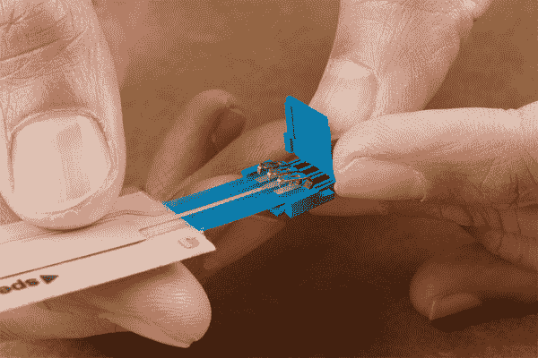](https://cdn.sparkfun.com/assets/learn_tutorials/5/1/0/Insert_Slide_Pot_Clincher_Connector.jpg) |
| *将弯曲传感器插入 2 针敲弯连接器* | *将软电位传感器插入 3 针敲弯连接器* |

一旦您对准了传感器，我们建议您用一条胶带压住传感器和紧钳连接器，以防止传感器在夹紧连接器时移动。

[](https://cdn.sparkfun.com/assets/learn_tutorials/5/1/0/Tape_Flex_Sensor_Clincher_Connector.jpg)

我们建议使用平齐的滑动接头钳来夹紧连接器。从图中可以看出，力施加在锁闩和卡钉的中心，而不是沿着连接器侧面的凹槽。与柔性传感器和 SoftPot 上的其他柔性基板相比，力敏电阻器将更容易被箝位。当压接针咬穿传感器时，您会听到一声微小但令人满意的爆裂声。

[](https://cdn.sparkfun.com/assets/learn_tutorials/5/1/0/Flush_Narrow_Slip_Joint_Plier_Flex_Sensor_Clincher_Connector.jpg)

否则，可以使用尖嘴钳将钉夹到传感器上。合上拉环，将压接引脚固定在半导体材料上。然后确保小心地从每个角向中心施力(同时避开侧面的凹槽)。

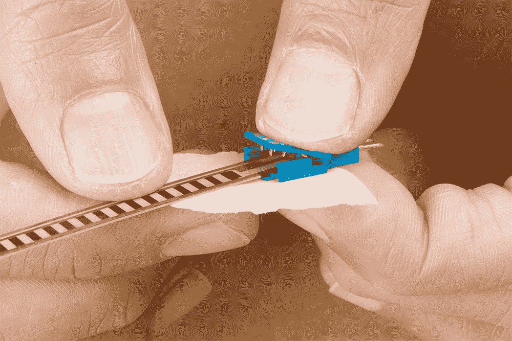[](#carousel-63c18eeac5920)[](#carousel-63c18eeac5920)

如果使用尖嘴钳时用力不当，会有损坏塑料外壳的风险。右图显示，尽管压接引脚与软外壳接触，但紧钳连接器外壳已损坏。

| [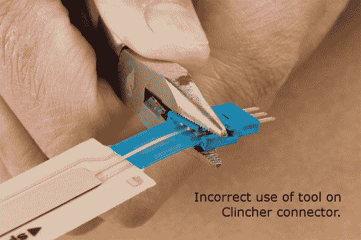](https://cdn.sparkfun.com/assets/learn_tutorials/5/1/0/Incorrect_Use_Pliers_Clincher_Connector_Housing.jpg) | [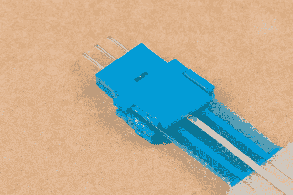](https://cdn.sparkfun.com/assets/learn_tutorials/5/1/0/Damaged_Clincher_Connector_Housing.jpg) |
| *钳子未正确应用于敲弯连接器。* | *软罐的敲弯连接器外壳损坏。* |

**Tip:** If you have issues pushing down on the tab to crimp the pins simultaneously, you can individually crimp the pins with needle nose pliers. Just make sure to be careful so that the grooves are not damaged. Here's an example from Provancher.

[Flex-circuit Soldering & Assembly Tutorial and Notes](https://my.mech.utah.edu/~wil/tutorials/flexCirc_soldering_tutorial/Flex_circuit_Soldering_Tutorial.html)

完成后，从背面取下胶带。为了测试，你可以[使用万用表](https://learn.sparkfun.com/tutorials/how-to-use-a-multimeter/)来确定传感器是否短路或者电阻是否会改变。您也可以使用跳线将传感器连接到电路，以检查传感器是否按预期工作。

[](https://cdn.sparkfun.com/assets/learn_tutorials/5/1/0/Flex_Force_Sensitive_SoftPot_Sensor_Clincher_Connector.jpg)

## 示例电路

将该传感器集成到您的项目中的最简单方法是在[分压器](https://learn.sparkfun.com/tutorials/voltage-dividers)中使用它。该电路需要一个电阻。从 10KΩ到 100KΩ的许多值都适用。如果你有一个[电阻套件](https://www.sparkfun.com/products/10969)，你可能想引入一些试错法来磨练完美的静态电阻。

介于最小和最大电阻值之间的值通常是一个不错的选择。在本例中，我们将使用一个 47kΩ电阻。这是连接:

[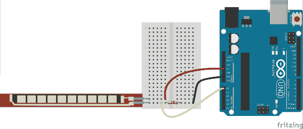](https://cdn.sparkfun.com/assets/learn_tutorials/5/1/1/example_circuit_bb.png)

和示意图:

[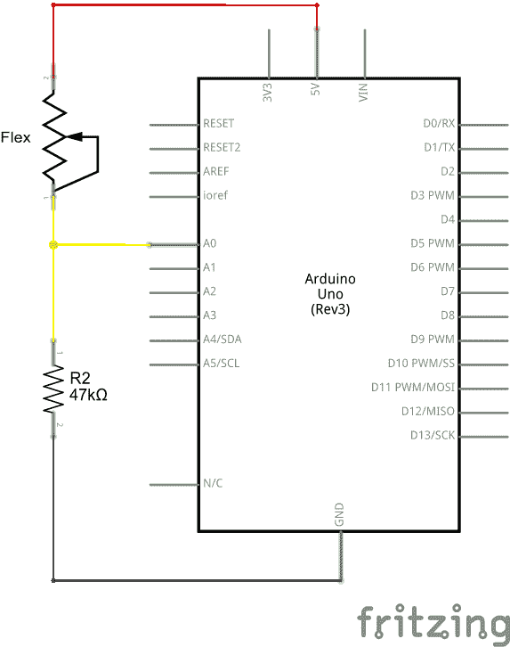](https://cdn.sparkfun.com/assets/learn_tutorials/5/1/1/example_circuit_schem.png)

接地端的 47kΩ电阻和 5V 端的 flex 传感器意味着随着 flex 传感器电阻的增加(意味着传感器正在弯曲), A0 上的电压将降低。

## 示例程序

这是一个基于上述电路的简单 Arduino 示例。复制并粘贴到你的 Arduino IDE，然后上传！

**注意:**此示例假设您在桌面上使用的是最新版本的 Arduino IDE。如果这是你第一次使用 Arduino，请回顾我们关于[安装 Arduino IDE 的教程。](https://learn.sparkfun.com/tutorials/installing-arduino-ide)

If you have not previously installed an Arduino library, please check out our [installation guide.](https://learn.sparkfun.com/tutorials/installing-an-arduino-library)

```
language:c
/******************************************************************************
Flex_Sensor_Example.ino
Example sketch for SparkFun's flex sensors
  (https://www.sparkfun.com/products/10264)
Jim Lindblom @ SparkFun Electronics
April 28, 2016

Create a voltage divider circuit combining a flex sensor with a 47k resistor.
- The resistor should connect from A0 to GND.
- The flex sensor should connect from A0 to 3.3V
As the resistance of the flex sensor increases (meaning it's being bent), the
voltage at A0 should decrease.

Development environment specifics:
Arduino 1.6.7
******************************************************************************/
const int FLEX_PIN = A0; // Pin connected to voltage divider output

// Measure the voltage at 5V and the actual resistance of your
// 47k resistor, and enter them below:
const float VCC = 4.98; // Measured voltage of Ardunio 5V line
const float R_DIV = 47500.0; // Measured resistance of 3.3k resistor

// Upload the code, then try to adjust these values to more
// accurately calculate bend degree.
const float STRAIGHT_RESISTANCE = 37300.0; // resistance when straight
const float BEND_RESISTANCE = 90000.0; // resistance at 90 deg

void setup() 
{
  Serial.begin(9600);
  pinMode(FLEX_PIN, INPUT);
}

void loop() 
{
  // Read the ADC, and calculate voltage and resistance from it
  int flexADC = analogRead(FLEX_PIN);
  float flexV = flexADC * VCC / 1023.0;
  float flexR = R_DIV * (VCC / flexV - 1.0);
  Serial.println("Resistance: " + String(flexR) + " ohms");

  // Use the calculated resistance to estimate the sensor's
  // bend angle:
  float angle = map(flexR, STRAIGHT_RESISTANCE, BEND_RESISTANCE,
                   0, 90.0);
  Serial.println("Bend: " + String(angle) + " degrees");
  Serial.println();

  delay(500);
} 
```

上传后，**打开你的[串口监视器](https://learn.sparkfun.com/tutorials/terminal-basics/arduino-serial-monitor-windows-mac-linux)** ，设置波特率为 9600 bps。

如果您弯曲弯曲传感器，您应该会看到电阻和估计角度的计算发生变化:

[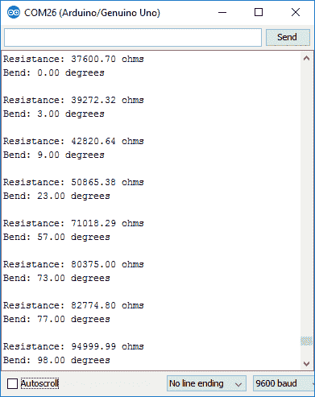](https://cdn.sparkfun.com/assets/learn_tutorials/5/1/1/flex-serial-output.png)

如果值看起来不正确，确保常数`VCC`和更重要的`R_DIV`是准确的。如果您使用的不是 47kΩ电阻，请在`R_DIV`中输入该值。

通过反复试验，尝试获得更准确的`STRAIGHT_RESISTANCE`和`BEND_RESISTANCE`值，即弯曲传感器笔直弯曲 90°时的电阻。

## 资源和更进一步

寻找更多与 flex 传感器相关的文档？以下是一些你可能想参考的资料:

*   [数据表](https://cdn.sparkfun.com/datasheets/Sensors/ForceFlex/FLEX%20SENSOR%20DATA%20SHEET%202014.pdf)
*   [ITP 物理计算-传感器:基础知识](https://itp.nyu.edu/physcomp/lessons/sensors-the-basics/)
    *   [报表/ Flex(已存档)](http://itp.nyu.edu/archive/physcomp-spring2014/sensors/Reports/Flex.html)

希望将 flex 传感器添加到电子纺织品/可穿戴项目中？尝试使用包含 4.5 英寸 flex 传感器的 Qwiic flex 手套控制器。

[](https://learn.sparkfun.com/tutorials/qwiic-flex-glove-controller-hookup-guide) [### Qwiic Flex 手套控制器连接指南

#### 2018 年 7 月 19 日](https://learn.sparkfun.com/tutorials/qwiic-flex-glove-controller-hookup-guide) Is your finger bent? Is your finger straight? The Qwiic Flex Glove controller board will answer this age old question for you with the flex sensor 9

需要一些项目灵感？想看看类似的模拟传感器吗？查看一些相关教程:

[](https://learn.sparkfun.com/tutorials/getting-started-with-load-cells) [### 称重传感器入门](https://learn.sparkfun.com/tutorials/getting-started-with-load-cells) A tutorial defining what a load cell is and how to use one.[Favorited Favorite](# "Add to favorites") 27[](https://learn.sparkfun.com/tutorials/sik-keyboard-instrument) [### SIK 键盘乐器](https://learn.sparkfun.com/tutorials/sik-keyboard-instrument) We can use the parts and concepts in the SparkFun Invetor's Kit to make a primitive keyboard instrument.[Favorited Favorite](# "Add to favorites") 5[](https://learn.sparkfun.com/tutorials/sensor-kit-resource-hub) [### 传感器套件资源中心](https://learn.sparkfun.com/tutorials/sensor-kit-resource-hub) An overview of each component in the SparkFun Sensor Kit, plus links to tutorials and other resources you'll need to hook them up.[Favorited Favorite](# "Add to favorites") 6[](https://learn.sparkfun.com/tutorials/force-sensitive-resistor-hookup-guide) [### 力敏电阻连接指南](https://learn.sparkfun.com/tutorials/force-sensitive-resistor-hookup-guide) How to hook a force-sensitive resistor up to an Arduino to measure pressure variances.[Favorited Favorite](# "Add to favorites") 9**************************