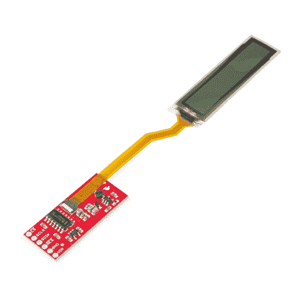
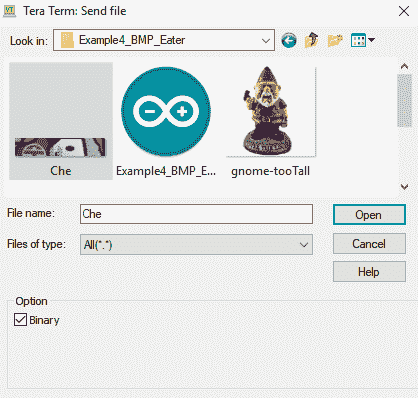

# 灵活的灰度有机发光二极管连接指南

> 原文：<https://learn.sparkfun.com/tutorials/flexible-grayscale-oled-hookup-guide>

## 介绍

多年来，我们一直在 CES 上听说和看到柔性屏幕，但现在你终于可以拿在手中弯曲屏幕了！你不能像折叠纸一样折叠它，但是这款来自 Wisechip 的[柔性灰度有机发光二极管](https://www.sparkfun.com/products/14606)可以弯曲到 40 毫米半径而不会损坏。该显示器厚度不到 0.5 毫米，不到 0.5 克，可以显示一些对比度很大的令人印象深刻的图形。

[](https://www.sparkfun.com/products/retired/14606) 

### [【spark fun 柔性灰度有机发光二极管突破-1.81】](https://www.sparkfun.com/products/retired/14606)

[Retired](https://learn.sparkfun.com/static/bubbles/ "Retired") LCD-14606

SparkFun 灵活的灰度有机发光二极管突破是一个小的灰度有机发光二极管，可以弯曲到 40 毫米半径，没有任何担心…

**Retired**[Favorited Favorite](# "Add to favorites") 25[Wish List](# "Add to wish list")

[https://www.youtube.com/embed/1pMXxWJNPCg/?autohide=1&border=0&wmode=opaque&enablejsapi=1](https://www.youtube.com/embed/1pMXxWJNPCg/?autohide=1&border=0&wmode=opaque&enablejsapi=1)

有机发光二极管显示器长 1.81 英寸，具有 160x32 个 4 位灰度像素。接口为三线式 SPI，每个像素需要 4 位。这意味着您将需要一个能够存储 80*32 = 2，560 字节的本地阵列的处理器，以便真正灵活(双关)灰度显示的能力。基本的 8 位 Arduinos 可以与显示器进行通信，并做像文本这样的事情，但图形将是棘手的。

### 所需材料

首先，您需要一个微控制器来控制项目中的一切。

[](https://www.sparkfun.com/products/13975) 

将**添加到您的[购物车](https://www.sparkfun.com/cart)中！**

### [spark fun red board——用 Arduino 编程 T3](https://www.sparkfun.com/products/13975)

[In stock](https://learn.sparkfun.com/static/bubbles/ "in stock") DEV-13975

SparkFun RedBoard 结合了 UNO 的 Optiboot 引导程序的简单性、FTDI 的稳定性和 shield com…

$21.5049[Favorited Favorite](# "Add to favorites") 89[Wish List](# "Add to wish list")****[](https://www.sparkfun.com/products/13907) 

将**添加到您的[购物车](https://www.sparkfun.com/cart)中！**

### [SparkFun ESP32 东西](https://www.sparkfun.com/products/13907)

[In stock](https://learn.sparkfun.com/static/bubbles/ "in stock") DEV-13907

SparkFun ESP32 Thing 是 Espressif 的 ESP32 的综合开发平台，ESP32 是他们的超级充电版本…

$23.5069[Favorited Favorite](# "Add to favorites") 83[Wish List](# "Add to wish list")****[](https://www.sparkfun.com/products/13774) 

将**添加到您的[购物车](https://www.sparkfun.com/cart)中！**

### [【粒子光子】](https://www.sparkfun.com/products/13774)

[Out of stock](https://learn.sparkfun.com/static/bubbles/ "out of stock") WRL-13774

Particle 的 IoT(物联网)硬件开发板 Photon 提供了构建互联网络所需的一切…

$19.0032[Favorited Favorite](# "Add to favorites") 51[Wish List](# "Add to wish list")****[](https://www.sparkfun.com/products/retired/13825) 

### [树莓派 3](https://www.sparkfun.com/products/retired/13825)

[Retired](https://learn.sparkfun.com/static/bubbles/ "Retired") DEV-13825

每个人都知道并喜欢 Raspberry Pi，但如果您不需要额外的外设来使其无线化会怎么样呢？覆盆子…

92 **Retired**[Favorited Favorite](# "Add to favorites") 97[Wish List](# "Add to wish list")****** ******### 工具

你需要一个烙铁、焊料和一般的焊接附件。

[](https://www.sparkfun.com/products/14228) 

### [威勒 WLC100 焊台](https://www.sparkfun.com/products/14228)

[Out of stock](https://learn.sparkfun.com/static/bubbles/ "out of stock") TOL-14228

Weller 的 WLC100 是一款多功能的 5 瓦至 40 瓦焊台，非常适合业余爱好者、DIY 爱好者和学生。…

2[Favorited Favorite](# "Add to favorites") 17[Wish List](# "Add to wish list")[](https://www.sparkfun.com/products/9325) 

将**添加到您的[购物车](https://www.sparkfun.com/cart)中！**

### [无铅焊料- 100 克线轴](https://www.sparkfun.com/products/9325)

[In stock](https://learn.sparkfun.com/static/bubbles/ "in stock") TOL-09325

这是带有水溶性树脂芯的无铅焊料的基本线轴。0.031 英寸规格，100 克。这是一个好主意…

$9.957[Favorited Favorite](# "Add to favorites") 33[Wish List](# "Add to wish list")** **### 推荐阅读

如果您不熟悉以下概念，我们建议您在继续之前查看这些教程。

[](https://learn.sparkfun.com/tutorials/how-to-solder-through-hole-soldering) [### 如何焊接:通孔焊接](https://learn.sparkfun.com/tutorials/how-to-solder-through-hole-soldering) This tutorial covers everything you need to know about through-hole soldering.[Favorited Favorite](# "Add to favorites") 70[](https://learn.sparkfun.com/tutorials/serial-peripheral-interface-spi) [### 串行外设接口(SPI)](https://learn.sparkfun.com/tutorials/serial-peripheral-interface-spi) SPI is commonly used to connect microcontrollers to peripherals such as sensors, shift registers, and SD cards.[Favorited Favorite](# "Add to favorites") 91[](https://learn.sparkfun.com/tutorials/logic-levels) [### 逻辑电平](https://learn.sparkfun.com/tutorials/logic-levels) Learn the difference between 3.3V and 5V devices and logic levels.[Favorited Favorite](# "Add to favorites") 82

## 硬件概述

让我们来看一下灵活的有机发光二极管的一些特征，以便我们对它的行为有更多的了解。

| **特性** | **范围** |
| 工作电压 | **3.5V - 5V** |
| 工作温度 | -40 摄氏度- 60 摄氏度 |
| 解决 | 160 x 32 |
| 弯曲半径 | 40 毫米 |
| 像素密度 | 88 DPI |
| 灰度分辨率 | 4 位 |

### 腿

下表概述了柔性有机发光二极管分线点上可用引脚的特性。

| Pin Label | 引脚功能 | 笔记 |
| CS | 芯片选择 | 片选，低电平有效，SPI 接口的一部分。3.3V 或 5V 逻辑 |
| SCLK | 串行时钟 | 为串行接口提供时钟信号。3.3V 或 5V 逻辑 |
| SDIN(地理信息系统) | 主输出 | 主机的数据输出。所有图像数据都在这条线上发送。3.3V 或 5V 逻辑 |
| RES | 重置 | 复位显示器，低电平有效。3.3V 或 5V 逻辑 |
| GND | 地面 | 0V/公共电压。 |
| 车辆识别号码 | 电源 | 应该在 **3.5V - 5V** 之间 |

[](https://cdn.sparkfun.com/assets/learn_tutorials/7/5/8/14606-SparkFun_Flexible_Grayscale_OLED_Breakout_-_1.81in.-02.jpg)

## 硬件装配

灵活的有机发光二极管很容易连接到您的微控制器。您可以将接头焊接到有机发光二极管分线点，也可以将电线直接焊接到分线引脚。如果你还没有将接头焊接到电路板上，[请务必查看我们的焊接教程](https://learn.sparkfun.com/tutorials/how-to-solder-through-hole-soldering)。

### 连接表

板载缓冲器意味着您可以将显示器直接连接到 **3.3V 或 5V 逻辑**，而无需任何逻辑转换电路。因此，您可以将引脚直接连接到微控制器的 I/O 上。只需将引脚连接到下表中的指定位置，我们就可以开始了。如果您需要使用其中任何一个来控制项目的其他部分，可以稍后在软件中更改这些大头针。

| 灵活的灰度有机发光二极管分线板引脚 | Arduino 引脚 |
| 车辆识别号码 | 应该在 **3.5V - 5V** 之间 |
| GND | 0V/公共电压 |
| RES | 第 9 针 |
| SDIN(地理信息系统) | 第 11 针 |
| SCLK | 第 13 针 |
| CS | 第 10 针 |

## 库概述

**注意:**此示例假设您在桌面上使用的是最新版本的 Arduino IDE。如果这是你第一次使用 Arduino，请回顾我们关于[安装 Arduino IDE 的教程。](https://learn.sparkfun.com/tutorials/installing-arduino-ide)如果您之前没有安装 Arduino 库，请查看我们的[安装指南。](https://learn.sparkfun.com/tutorials/installing-an-arduino-library)

首先，你需要下载并安装 **Sparkfun 灵活灰度有机发光二极管 Brekaout** 库。您可以通过 Arduino 库管理器或点击下面的按钮手动安装它。

[Download the SparkFun Flexible Grayscale Library](https://github.com/sparkfun/SparkFun_SSD1320_OLED_Arduino_Library/archive/master.zip)

在我们开始开发草图之前，让我们看看这个库的可用功能。

*   **`void command(uint8_t c);`** -向显示器发送一个命令字节。
*   **`void data(uint8_t c);`** -发送显示一个数据字节。
*   **`void setColumnAddress(uint8_t add);`** -设置列地址。
*   **`void setPageAddress(uint8_t add);`** -设置页面地址。

### LCD 绘图功能

*   **`void clearDisplay(uint8_t mode):`** -清除有机发光二极管内存中的屏幕缓冲，传入`mode = CLEAR_DISPLAY`清除显示器内存，`mode = CLEAR_BUFFER`清除显示器缓冲，或`mode = CLEAR_ALL`清除两者。
*   **`void display(void);`** -将显示内存移动到屏幕以绘制内存中的图像。
*   **`void setCursor(uint8_t x, uint8_t y);`** -将光标位置设置为(x，y)。
*   **`void invert(boolean inv);`** -将每个黑色像素变为白色，将所有白色像素变为黑色。
*   **`void setContrast(uint8_t contrast);`** -在 0 到 255 之间任意改变对比度值。
*   **`void flipVertical(boolean flip);`**——※屏幕的垂直镜面。
*   **`void flipHorizontal(boolean flip);`**——※屏幕的一面水平的镜子。

*   **`void setPixel(uint8_t x, uint8_t y);`** -使用当前前景色和当前绘制模式在屏幕缓冲区的 x，y 位置绘制一个像素。

*   **`void setPixel(uint8_t x, uint8_t y, uint8_t color, uint8_t mode);`**——在屏幕缓冲区的 x，y 位置用范数或异或绘制模式绘制一个像素。

*   **`void line(uint8_t x0, uint8_t y0, uint8_t x1, uint8_t y1);`** -使用当前前景色和当前绘制模式从屏幕缓冲区的 x0，y0 到 x1，y1 绘制线条。

*   **`void line(uint8_t x0, uint8_t y0, uint8_t x1, uint8_t y1, uint8_t color, uint8_t mode);`** -使用屏幕缓冲区的颜色和模式从 x0，y0 到 x1，y1 画线。
*   **`void lineH(uint8_t x, uint8_t y, uint8_t width);`** -使用当前前景色和当前绘制模式从屏幕缓冲区的 x，y 到 x+width，y 绘制水平线。
*   **`void lineH(uint8_t x, uint8_t y, uint8_t width, uint8_t color, uint8_t mode);`**——使用屏幕缓冲区的颜色和模式从 x，y 到 x+width，y 绘制水平线。
*   **`void lineV(uint8_t x, uint8_t y, uint8_t height);`** -使用当前前景色和当前绘制模式从 x，y 到 x，y+屏幕缓冲区高度绘制垂直线。
*   **`void lineV(uint8_t x, uint8_t y, uint8_t height, uint8_t color, uint8_t mode);`** -使用颜色和模式从 x，y 到 x，y+屏幕缓冲区的高度绘制垂直线。

*   **`void rect(uint8_t x, uint8_t y, uint8_t width, uint8_t height);`** -使用当前前景色和当前绘制模式绘制矩形，从 x，y 到 x+宽度，y+高度的屏幕缓冲区。

*   **`void rect(uint8_t x, uint8_t y, uint8_t width, uint8_t height, uint8_t color , uint8_t mode);`** -使用颜色和模式绘制矩形，从 x，y 到 x+宽度，y+高度的屏幕缓冲区。
*   **`void rectFill(uint8_t x, uint8_t y, uint8_t width, uint8_t height);`** -使用当前前景色和当前绘制模式绘制填充矩形，从 x，y 到 x+宽度，y+高度的屏幕缓冲区。
*   **`void rectFill(uint8_t x, uint8_t y, uint8_t width, uint8_t height, uint8_t color , uint8_t mode);`** -使用颜色和模式从 x，y 到 x+宽度，y+高度的屏幕缓冲区绘制填充矩形。

*   **`void circle(uint8_t x, uint8_t y, uint8_t radius);`** -使用当前前景色和当前绘制模式，以屏幕缓冲区的 x，y 为中心，绘制半径为的圆。

*   **`void circle(uint8_t x, uint8_t y, uint8_t radius, uint8_t color, uint8_t mode);`** -使用颜色和模式，以屏幕缓冲区的 x，y 为圆心，画一个半径为的圆。
*   **`void circleFill(uint8_t x0, uint8_t y0, uint8_t radius);`** -使用当前前景色和当前绘制模式，以屏幕缓冲区的 x，y 为中心，绘制半径为的实心圆。
*   **`void circleFill(uint8_t x0, uint8_t y0, uint8_t radius, uint8_t color, uint8_t mode);`** -使用颜色和模式绘制半径为实心圆，圆心在屏幕缓冲区的 x，y 轴。

*   **`void drawChar(uint8_t x, uint8_t y, uint8_t c);`** -在位置(x，y)绘制一个字符。

*   **`void drawChar(uint8_t x, uint8_t y, uint8_t c, uint8_t color, uint8_t mode);`** -在位置(x，y)使用颜色和模式绘制一个字符

*   **`void drawBitmap(uint8_t * bitArray);`** -绘制预加载的位图。

*   **`uint16_t getDisplayWidth(void);`**——得到有机发光二极管的宽度。
*   **`uint16_t getDisplayHeight(void);`**——得到有机发光二极管的高度。
*   **`void setDisplayWidth(uint16_t);`** -设置有机发光二极管的宽度。
*   **`void setDisplayHeight(uint16_t);`**——设定有机发光二极管的高度。
*   **`void setColor(uint8_t color);`** -设置有机发光二极管的颜色
*   **`void setDrawMode(uint8_t mode);`** -设置有机发光二极管的绘制模式
*   **`uint8_t *getScreenBuffer(void);`**—

### 字体设置

*   **`uint8_t getFontWidth(void);`** -以字节形式获取当前字体宽度。
*   **`uint8_t getFontHeight(void);`** -以字节形式获取当前字体高度。
*   **`uint8_t getTotalFonts(void);`** -返回加载到 MicroOLED 的闪存中的字体总数。
*   **`uint8_t getFontType(void);`** -返回当前字体的字体类型号(字体类型如下所示)。
*   **`boolean setFontType(uint8_t type);`** -设置字体类型(字体类型如下所示)。

| 字体类型 | 最大列数 | 最大行数 | 描述 |
| Zero | Ten | six | 最小的 5x7 像素字符。 |
| one | six | three | 中等，8x16 像素字符。 |
| Two | five | three | 7 段显示样式字符，每段 10x16 像素。 |
| three | five | one | 大，12x48(整个屏幕高度)字符。 |

*   **`uint8_t getFontStartChar(void);`** -返回当前字体的起始 ASCII 字符。
*   **`uint8_t getFontTotalChar(void);`** -返回当前字体的总字符数。

### 旋转和滚动

以下功能将在每个功能的不同指定方向上滚动屏幕。开始和停止表示将要滚动的行/列的范围。

*   **T2`void scrollRight(uint8_t start, uint8_t stop);`**
*   **T2`void scrollLeft(uint8_t start, uint8_t stop);`**
*   **T2`void scrollUp(uint8_t start, uint8_t stop);`**
*   **T2`void scrollStop(void);`**

## 示例代码

现在我们已经安装了我们的库，我们可以开始使用我们的例子来学习更多关于屏幕行为的知识。

### 示例 1 -文本

要开始，打开**文件下的**example 1 _ Text****>**Examples**>**spark fun 灵活灰度有机发光二极管突破**>**example 1 _ Text**。打开这个例子，您会注意到我们的`void loop()`是空的。这是因为我们只需要将图像绘制到我们的有机发光二极管一次，以使它停留在那里。我们首先用连接到引脚 10 的 **`CS`** 和连接到引脚 9 的 **`RES`** 来初始化我们的屏幕。然后在我们的设置循环中，我们使用`flexibleOLED.begin(160, 32);`来开始一个 160x32 像素的显示。然后，我们使用下面几行来首先清除显示，设置字体，我们想要键入的位置，以及我们想要键入的文本。最后一行告诉显示器显示我们刚刚写入显示缓冲区的内容。

```
language:c
flexibleOLED.clearDisplay(); //Clear display and buffer

flexibleOLED.setFontType(1); //Large font
flexibleOLED.setCursor(28, 12);
flexibleOLED.print("Hello World!");

flexibleOLED.setFontType(0); //Small font
flexibleOLED.setCursor(52, 0);
flexibleOLED.print("8:45:03 AM");

flexibleOLED.display(); 
```

这将在我们的微控制器运行设置循环时将文本写入显示器，并将其留在那里，输出应该类似下图。

[](https://cdn.sparkfun.com/assets/learn_tutorials/7/5/8/Flexible_Grayscale_OLED_Breakout_Photos-01.jpg)

### 示例 2 -图形

要开始，打开**文件下的**example 2 _ Graphics****>**Examples**>**SparkFun 灵活灰度有机发光二极管突围**>**example 2 _ Graphics**。这个例子将从转换前的图像数据中绘制一个灰度图像，在这个例子中，是一个猕猴的图像。为了将您自己的图像转换为有机发光二极管可读的格式，请查看这个简洁的 [Python 脚本](https://github.com/sparkfun/BMPtoArray)，用于将位图转换为灰度有机发光二极管的数组。首先你需要一个 ***。bmp** 文件，宽 160 像素，高 32 像素。一旦你有了你的 ***。bmp** ，生成一个图像数组就像从命令行运行 python 脚本一样简单，如下所示。(确保您输入了正确的文件路径)

```
language:bash
python <path to bmptoarray.py> <pathway to image.bmp> 
```

输出将被放在与 *bmptoarray.py* 相同目录下的 *output.txt* 文件中，看起来类似下图。

[](https://cdn.sparkfun.com/assets/learn_tutorials/7/5/8/Text.PNG)

然后必须将这个大数组复制到一个 ***中。h** 文件与您的草图放在同一个文件夹中。继续命名它，我的草图文件夹是这样的，我的数组在 *TestImage.h* 文件中

[](https://cdn.sparkfun.com/assets/learn_tutorials/7/5/8/sketch.PNG)

然后，在我们的草图中，我们需要确保包含这个数组的文件，所以一定要在草图的顶部加上一个`#include "TestImage.h"`。还要确保注释掉可能包含的任何其他图像文件。如果您还没有将猕猴替换为您自己的图像，输出应该类似于下图，否则，它显然应该类似于您选择在有机发光二极管上显示的任何图像。

[](https://cdn.sparkfun.com/assets/learn_tutorials/7/5/8/Flexible_Grayscale_OLED_Breakout_Photos-02.jpg)

### 示例 3 -线条

要开始，打开**文件** > **下的**示例 3_Lines** 示例** > **SparkFun 灵活灰度有机发光二极管突破** > **示例 3_Lines** 。此示例在显示器上绘制了一些形状。同样，它只是简单地将图像写入显示器，并将其留在那里。尝试绘制每个矩形和圆形的参数，以确定这如何影响它们的位置和大小。股票示例代码应该类似于下图。

[](https://cdn.sparkfun.com/assets/learn_tutorials/7/5/8/Flexible_Grayscale_OLED_Breakout_Photos-03.jpg)

### 实施例 4 - BMP 食用者

在这个例子中，我们将使用类似 Tera Term 的[串行终端直接将位图输入屏幕。如果你不太熟悉使用终端，查看我们的](https://learn.sparkfun.com/tutorials/terminal-basics/tera-term-windows)[串行终端基础概述](https://learn.sparkfun.com/tutorials/terminal-basics)并下载 Tera Term。这很有用，因为我们不必将位图转换成`prog_mem`或任何东西。首先，我们必须确保微控制器能够正确地将串行输入解析为像素数据。继续打开**文件** > **下的**示例 4_BMP_Eater** 示例** > **SparkFun 灵活灰度有机发光二极管突破** > **示例 4_BMP_Eater** 。打开并上传后，检查一下`getBitmap()`函数，它检查我们通过串口发送的内容的结构，然后将其写入屏幕。既然我们的微控制器已经准备好接收数据，是时候打开 **Tera Term** 并开始发送数据了。Tera Term 的一个新实例应该提示您输入 COM 端口。确保输入微控制器所在的端口。

[](https://cdn.sparkfun.com/assets/learn_tutorials/7/5/8/com.PNG)

一旦我们完成了这些，我们将需要改变我们终端的波特率来匹配微控制器的波特率 **57600** 。通过进入**设置** > **串口来完成...**并从下拉菜单中选择 **57600** 。现在我们已经打开了与有机发光二极管的连接，我们可以开始向它发送图像。为此，我们需要做的就是转到**文件** > **发送文件...**选择我们想要发送到屏幕的位图。转到**文档**>**Arduino**>**库**>**spark fun _ Flexible _ gray _ 有机发光二极管 _Breakout** > **示例** > **示例 4_BMP_Eater** 。这个文件夹应该包含一些位图。如果你在第二个例子中使用了你自己的位图，你也可以加载它。选择你的文件，确保你是以二进制格式发送的(下图显示了选中的二进制框)。

[](https://cdn.sparkfun.com/assets/learn_tutorials/7/5/8/binary.PNG)

上传图像应该显示显示刷新逐行，因为它得到新的数据咀嚼。这个过程看起来像下面的 GIF。

[](https://cdn.sparkfun.com/assets/learn_tutorials/7/5/8/unnamed__2_.gif)

### 示例 5 -所有文本

要开始，打开**文件** > **下的**example 5 _ all the text**example**>**spark fun 灵活灰度有机发光二极管突围**>**example 5 _ all the text**。本示例显示了有机发光二极管的所有文本功能。看看下面的文本示例函数，看看每个函数是如何编写相应的文本的。

```
language:c
void smallTextExample()
{
  printTitle("Small text", 0);

  flexibleOLED.setFontType(0); //Small text

  byte thisFontHeight = flexibleOLED.getFontHeight();

  flexibleOLED.clearDisplay(); //Clear display RAM and local display buffer
  flexibleOLED.setCursor(0, thisFontHeight * 3);
  flexibleOLED.print("ABCDEFGHIJKLMNOPQRSTUVWXYZ");
  flexibleOLED.setCursor(0, thisFontHeight * 2);
  flexibleOLED.print("abcdefghijklmnopqrstuvwxyz");
  flexibleOLED.setCursor(0, thisFontHeight * 1);
  flexibleOLED.print("1234567890!@#$%^&*(),.<>/?");
  flexibleOLED.setCursor(0, thisFontHeight * 0);
  flexibleOLED.print(";:'\"[]{}-=_+|\\~`");

  flexibleOLED.display();

  delay(2000);
} 
```

改变文本类型只需使用`setFontType()`并改变屏幕使用的字体。还要注意，我们必须对文本行使用不同的光标位置，以防止它们相互重叠。

```
language:c
void largeTextExample()
{
  printTitle("Large text", 0);

  flexibleOLED.setFontType(1); //Larger text
  byte theDisplayHeight = flexibleOLED.getDisplayHeight();
  byte thisFontHeight = flexibleOLED.getFontHeight();

  flexibleOLED.clearDisplay(); //Clear display RAM and local display buffer

  flexibleOLED.setCursor(0, theDisplayHeight - (thisFontHeight * 1));
  flexibleOLED.print("ABCDEFGHIJKLMNOPQ");
  flexibleOLED.setCursor(0, theDisplayHeight - (thisFontHeight * 2));
  flexibleOLED.print("abcdefghij1234567");

  flexibleOLED.display();

  delay(2000);
} 
```

上传这个例子应该会在你的屏幕上产生类似下图所示的输出。

[](https://cdn.sparkfun.com/assets/learn_tutorials/7/5/8/unnamed__1_.gif)

### 示例 6 -乒乓

下一个例子将为我们玩一个漂亮的假乒乓小游戏。要开始，打开**文件下的**示例 6 _ Pong****>**示例** > **SparkFun 灵活灰度有机发光二极管突破** > **示例 6_Pong** 。这个 pong 示例中的肉和土豆包含在`shapeExample()`函数中，如下所示。

```
language:c
void shapeExample()
{
  printTitle("Shapes!", 0);

  // Silly pong demo. It takes a lot of work to fake pong...
  int paddleW = 3;  // Paddle width
  int paddleH = 15;  // Paddle height
  // Paddle 0 (left) position coordinates
  int paddle0_Y = (flexibleOLED.getDisplayHeight() / 2) - (paddleH / 2);
  int paddle0_X = 2;
  // Paddle 1 (right) position coordinates
  int paddle1_Y = (flexibleOLED.getDisplayHeight() / 2) - (paddleH / 2);
  int paddle1_X = flexibleOLED.getDisplayWidth() - 3 - paddleW;
  int ball_rad = 2;  // Ball radius
  // Ball position coordinates
  int ball_X = paddle0_X + paddleW + ball_rad;
  int ball_Y = random(1 + ball_rad, flexibleOLED.getDisplayHeight() - ball_rad);//paddle0_Y + ball_rad;
  int ballVelocityX = 1;  // Ball left/right velocity
  int ballVelocityY = 1;  // Ball up/down velocity
  int paddle0Velocity = -1;  // Paddle 0 velocity
  int paddle1Velocity = 1;  // Paddle 1 velocity

  //while(ball_X >= paddle0_X + paddleW - 1)
  while ((ball_X - ball_rad > 1) &&
         (ball_X + ball_rad < flexibleOLED.getDisplayWidth() - 2))
  {
    // Increment ball's position
    ball_X += ballVelocityX;
    ball_Y += ballVelocityY;
    // Check if the ball is colliding with the left paddle
    if (ball_X - ball_rad < paddle0_X + paddleW)
    {
      // Check if ball is within paddle's height
      if ((ball_Y > paddle0_Y) && (ball_Y < paddle0_Y + paddleH))
      {
        ball_X++;  // Move ball over one to the right
        ballVelocityX = -ballVelocityX; // Change velocity
      }
    }
    // Check if the ball hit the right paddle
    if (ball_X + ball_rad > paddle1_X)
    {
      // Check if ball is within paddle's height
      if ((ball_Y > paddle1_Y) && (ball_Y < paddle1_Y + paddleH))
      {
        ball_X--;  // Move ball over one to the left
        ballVelocityX = -ballVelocityX; // change velocity
      }
    }
    // Check if the ball hit the top or bottom
    if ((ball_Y <= ball_rad) || (ball_Y >= (flexibleOLED.getDisplayHeight() - ball_rad - 1)))
    {
      // Change up/down velocity direction
      ballVelocityY = -ballVelocityY;
    }
    // Move the paddles up and down
    paddle0_Y += paddle0Velocity;
    paddle1_Y += paddle1Velocity;
    // Change paddle 0's direction if it hit top/bottom
    if ((paddle0_Y <= 1) || (paddle0_Y > flexibleOLED.getDisplayHeight() - 2 - paddleH))
    {
      paddle0Velocity = -paddle0Velocity;
    }
    // Change paddle 1's direction if it hit top/bottom
    if ((paddle1_Y <= 1) || (paddle1_Y > flexibleOLED.getDisplayHeight() - 2 - paddleH))
    {
      paddle1Velocity = -paddle1Velocity;
    }

    // Draw the Pong Field
    flexibleOLED.clearDisplay(CLEAR_BUFFER); //Save time. Only clear the local buffer.
    // Draw an outline of the screen:
    flexibleOLED.rect(0, 0, flexibleOLED.getDisplayWidth() - 1, flexibleOLED.getDisplayHeight());
    // Draw the center line
    flexibleOLED.rectFill(flexibleOLED.getDisplayWidth() / 2 - 1, 0, 2, flexibleOLED.getDisplayHeight());
    // Draw the Paddles:
    flexibleOLED.rectFill(paddle0_X, paddle0_Y, paddleW, paddleH);
    flexibleOLED.rectFill(paddle1_X, paddle1_Y, paddleW, paddleH);
    // Draw the ball:
    flexibleOLED.circle(ball_X, ball_Y, ball_rad);
    // Actually draw everything on the screen:
    flexibleOLED.display();

    //delay(25);  // Delay for visibility
  }

  delay(1000);
} 
```

这个函数的大部分是简单的数学运算，在屏幕上移动球拍和球，并检查碰撞。对象的实际绘制在函数的最后几行执行，就在`flexibleOLED.display():`函数之前。在我们的`void loop()`中反复调用`shapeExample()`函数，以推进乒乓棋子的位置。上传代码后，有机发光二极管应该看起来像下面的 GIF。

[](https://cdn.sparkfun.com/assets/learn_tutorials/7/5/8/unnamed__3_.gif)

### 示例 7 -徽标

要开始，打开**文件下的**示例 7 _ Logo****>**示例** > **SparkFun 灵活灰度有机发光二极管突破** > **示例 7_Logo** 。这个例子简单地向我们展示了如何显示已经在有机发光二极管缓冲区中的内容。我们要做的就是在不清空缓冲区的情况下初始化屏幕，给出`flexibleOLED.display()`命令，有机发光二极管就会显示 SparkFun 的 logo。它看起来类似于下图。

[](https://cdn.sparkfun.com/assets/learn_tutorials/7/5/8/Flexible_Grayscale_OLED_Breakout_Photos-04.jpg)

### 示例 8 -噪声绘图

首先，打开**文件下的**示例 8 _ noise drawing****>**示例** > **SparkFun 灵活灰度有机发光二极管突破** > **示例 8_NoiseDrawing** 。本例将噪声直接写入显示器和缓冲区。然而，缓冲区不能进行灰度处理，所以我们在调用`writeToBuffer()`函数时只会得到黑白噪声。仔细观察我们可以发现，这些函数都从`A0`和`A1`引脚写入噪声，所以要确保这些引脚没有连接到任何东西。输出将类似下图。请注意，来自缓冲器的噪声只是黑白的。

[](https://cdn.sparkfun.com/assets/learn_tutorials/7/5/8/unnamed.gif)

## 资源和更进一步

既然您已经成功地启动并运行了灵活的灰度有机发光二极管显示器，那么是时候将它集成到您自己的项目中了！

有关更多信息，请查看以下资源:

*   [示意图(PDF)](https://cdn.sparkfun.com/assets/2/8/a/3/7/SparkFun_Flexible_Grayscale_OLED_Breakout.pdf)
*   [老鹰文件(ZIP)](https://cdn.sparkfun.com/assets/2/4/a/a/9/SparkFun_Flexible_Grayscale_OLED_Breakout.zip)
*   [柔性灰度有机发光二极管显示器数据表](https://cdn.sparkfun.com/assets/6/9/9/9/3/SAS1-12003-B_UG-6032CSWBGA1.pdf)
*   [SSD1320 命令集](https://cdn.sparkfun.com/assets/6/c/8/5/2/SSD1320_1.1_APPENDIX__to_Wisechip_.pdf)
*   [SSD1320 协议数据表](https://cdn.sparkfun.com/assets/d/b/1/f/d/SSD1320_1.0__to_Wisechip_.pdf)
*   开源代码库
    *   [产品报告](https://github.com/sparkfun/Flexible_Grayscale_OLED) -硬件设计文件
    *   [Arduino 库](https://github.com/sparkfun/SparkFun_SSD1320_OLED_Arduino_Library) -库和示例代码。
    *   将灰度图像输出到 OLEDs 时，Python 脚本将位图转换为 Arduino prog_mem 数组。
*   [SFE 产品展示:SparkFun 柔性灰度有机发光二极管分会场](https://youtu.be/1pMXxWJNPCg)

你的下一个项目需要一些灵感吗？查看一些相关教程:

[](https://learn.sparkfun.com/tutorials/quick-illuminated-boxes) [### 快速照明箱](https://learn.sparkfun.com/tutorials/quick-illuminated-boxes) A quick tutorial to show you how to add LEDs to gift or holiday bags or boxes.[Favorited Favorite](# "Add to favorites") 5[](https://learn.sparkfun.com/tutorials/qwiic-micro-oled-hookup-guide) [### Qwiic 微型有机发光二极管连接指南](https://learn.sparkfun.com/tutorials/qwiic-micro-oled-hookup-guide) Get started displaying things with the Qwiic Micro OLED.[Favorited Favorite](# "Add to favorites") 7[](https://learn.sparkfun.com/tutorials/basic-character-lcd-hookup-guide) [### 基本字符 LCD 连接指南](https://learn.sparkfun.com/tutorials/basic-character-lcd-hookup-guide) Liquid crystal displays (LCDs) are a great way to output a string of words or sensor data to a display for visual feedback. In this tutorial, we'll learn about LCDs, how to print a string of words to a 16x2 basic character LCD and create custom characters.[Favorited Favorite](# "Add to favorites") 16[](https://learn.sparkfun.com/tutorials/qwiic-kit-for-raspberry-pi-v2-hookup-guide)[New!

### 覆盆子酱 V2 连接指南的 Qwiic 套件](https://learn.sparkfun.com/tutorials/qwiic-kit-for-raspberry-pi-v2-hookup-guide) Get started with the SGP40, BME280, VCNL4040, and microOLED via I2C using the Qwiic system and Python on a Raspberry Pi! Measure VOC Index, light, temperature, humidity, and pressure from the environment. Then display them on the microOLED, serial terminal, or the cloud with Cayenne 0********