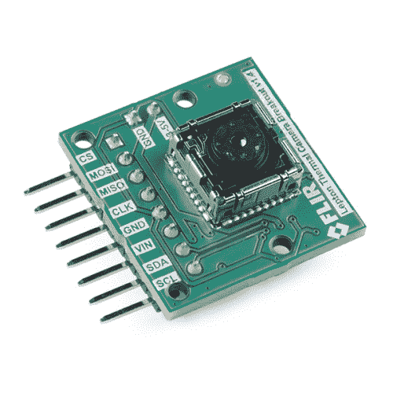
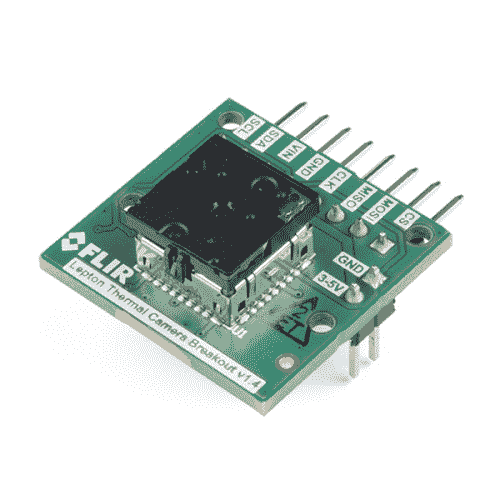

# FLIR 轻子连接指南

> 原文：<https://learn.sparkfun.com/tutorials/flir-lepton-hookup-guide>

## 介绍

**Note:** This tutorial was originally written for the FLiR Lepton [KIT-13233]. However, the FLiR Lepton 2.5 with Radiometry should function the same.

当我们的团队发现我们将测试一个长波红外(LWIR)相机时，有两个词我们一直在说:捕食者视觉。没错，我们终于能够看到无形的热世界了，如果我们发现自己在一个偏远的丛林中追捕一队特种特工，或者，你知道，试着不被一杯热茶烫伤，这将对我们有很大的帮助。

碰巧的是， [FLIR 轻子](https://www.sparkfun.com/products/13233)对于这个价格来说是一个非常好的小模块，并且 Pure Engineering 在旋转分线板和文档方面做得非常好。

 

### [前视开发套件](https://www.sparkfun.com/products/retired/13233)

[Retired](https://learn.sparkfun.com/static/bubbles/ "Retired") KIT-13233

FLiR 开发套件包括一个突破以及一个轻子长波红外(LWIR)成像仪。使用此套件，您将能够…

27 **Retired**[Favorited Favorite](# "Add to favorites") 104[Wish List](# "Add to wish list") 

### [FLIR 辐射轻子开发套件](https://www.sparkfun.com/products/retired/14654)

[Retired](https://learn.sparkfun.com/static/bubbles/ "Retired") KIT-14654

与前视红外辐射轻子开发套件，您将能够把前视红外热成像的可靠性和权力，以您的设计…

3 **Retired**[Favorited Favorite](# "Add to favorites") 22[Wish List](# "Add to wish list")

然而，在设置过程中有一些小的“陷阱”,所以我们认为最好是分享我们在玩这个东西时学到的东西。但是首先……一点理论...

### 建议的视频

[https://www.youtube.com/embed/X92f6WH-qvg/?autohide=1&border=0&wmode=opaque&enablejsapi=1](https://www.youtube.com/embed/X92f6WH-qvg/?autohide=1&border=0&wmode=opaque&enablejsapi=1)

[https://www.youtube.com/embed/24Cbw5f3Iv0/?autohide=1&border=0&wmode=opaque&enablejsapi=1](https://www.youtube.com/embed/24Cbw5f3Iv0/?autohide=1&border=0&wmode=opaque&enablejsapi=1)

*Having a hard time seeing the videos? Try viewing the videos in full screen mode.*

### 所需材料

要跟随本教程，您将需要以下硬件和软件。你可能不需要所有的东西，但这取决于你有什么和你的设置。将硬件添加到购物车中，通读指南，并根据需要调整购物车。

#### 五金器具

今天，我们将设置由 Pure Engineering 提供并在我们的产品视频中出现的 Raspberry Pi 示例代码。至少，我们需要一个[树莓派](https://www.sparkfun.com/products/13825)...实际上，没什么别的了。只需几根跳线、一个显示器、键盘、你的 Raspberry Pi 的随附电缆和你选择的 FLIR 轻子相机。

以下是建议零件的愿望清单: