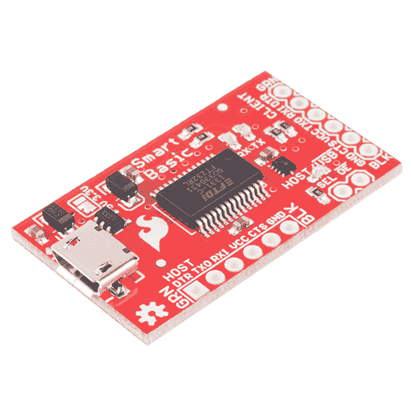
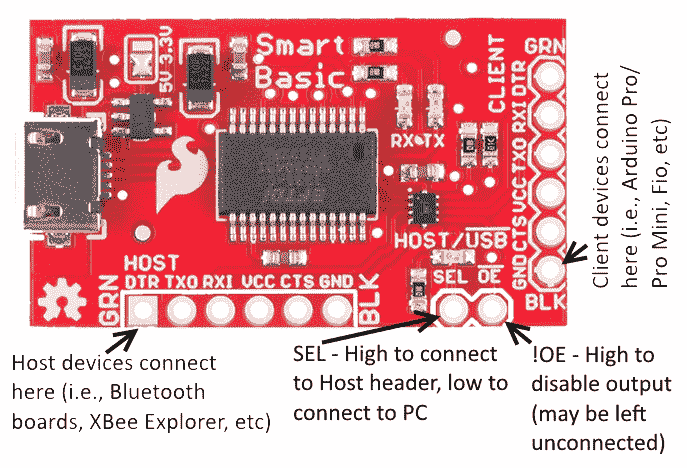
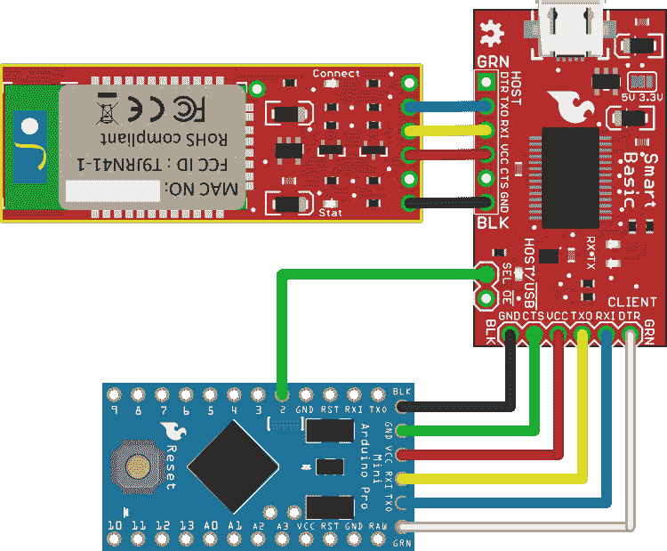

# FTDI 智能基本连接指南

> 原文：<https://learn.sparkfun.com/tutorials/ftdi-smartbasic-hookup-guide>

## 介绍

[](https://cdn.sparkfun.com/assets/learn_tutorials/2/6/4/12935-01.jpg)

[FTDI SmartBasic](https://www.sparkfun.com/products/12935) 是我们经典 [FTDI Basic](https://www.sparkfun.com/products/9716) 的变体，它允许您将第二个设备连接到 Arduino Pro、Pro Mini 或其他无 USB 板的硬件串行端口，而不会影响从 Arduino IDE 引导加载代码的能力。

通常，要使用需要 Arduino 板上串行端口资源的设备，必须使用软件串行端口，或者在编程过程中插拔设备。SmartBasic 板为来自 Arduino 的串行端口引脚添加了一个多路复用器，允许应用程序代码将串行信号从 USB 端口切换到另一个设备。启用编程也不需要特殊代码！

### 推荐阅读

在我们开始之前，您可能需要查看以下其他教程:

*   [逻辑电平](https://learn.sparkfun.com/tutorials/logic-levels) -将 FTDI SmartBasic 上的跳线设置为错误的电压电平可能会损坏与其相连的一块或多块电路板。
*   [串行通信](https://learn.sparkfun.com/tutorials/serial-communication)-FTDI smart basic 是一种复用串行信号的设备；通过本教程了解更多关于串行数据及其工作原理的知识。
*   [安装 FTDI 驱动程序](https://learn.sparkfun.com/tutorials/how-to-install-ftdi-drivers)

## 硬件之旅

FTDI SmartBasic 硬件非常简单。它将串行信号从 Arduino Pro、Pro Mini、Fio 或 LilyPad 板(以及任何其他使用标准 FTDI 接头封装的板)通过 USB 转串行桥发送到编程 PC，或者发送到任何其他具有 FTDI 基本型接头的设备。它使用了[原装 FTDI 基板](https://www.sparkfun.com/search/results?term=ftdi+basic)上使用的久负盛名的 [FT232RL 芯片](https://www.sparkfun.com/products/650)和 TI 的 [TS3USB221A 信号复用器，使连接多个串行设备变得容易。](http://www.ti.com/product/ts3usb221)

### 董事会

[](https://cdn.sparkfun.com/assets/learn_tutorials/2/6/4/12935-02.jpg)

实际的电路板设计相当紧凑。我们没有设置标题，因此您可以选择最适合您应用的标题。

标有“CLIENT”的标题与标准 FTDI 主板上的输出标题基本相同。如果您像使用普通 Basic 一样将该接头连接到 Arduino，您就可以像平常一样对 Arduino 进行编程，而不会注意到任何差异。

好处来自“主机”标题。该接头可以连接到任何主机类型的设备(如另一个 FTDI 板，或我们的任何[蓝牙](https://www.sparkfun.com/products/12580) [Mate](https://www.sparkfun.com/products/12576) [类型](https://www.sparkfun.com/products/11927)板)。然后，您可以连接！OE 和 SEL 线连接到 Arduino 上的引脚，使应用程序代码能够将串行数据从硬件端口路由到 USB 串行桥*或*连接到主机接头的设备。

由于 SEL 线上的下拉电阻，如果该引脚悬空，数据流的默认目的地是 USB 串行桥。在引导加载程序模式下，所有非串行引脚都将是高阻抗输入，因此在 Arduino IDE 重置 Arduino 板后，引导加载程序和 PC 将能够通信，直到加载的应用程序改变该引脚的电平。

AUX/！当选择主机端口时，USB LED 将亮起，当数据被发送到 USB 串行桥时，USB LED 将熄灭。有一个可以调节的焊接跳线，以将两个接头上的 VCC 引脚上的电压(以及 FT232RL 芯片上的 IO 电压)从 3.3V 变为 5V；如果该跳线被完全清除，两个串行接头之一上的电源可用于为两个器件和 VDDIO 供电，如果您需要 5V 或 3.3V 以外的电压。

## 连接 SmartBasic

使用串行连接的蓝牙加密狗进行开发时遇到的一个常见问题是 Arduino 软件串行库的不足。软件串行传输是资源密集型的，在传输过程中会阻塞处理器。Long 接收很容易使缓冲区溢出，并会丢弃用于 millis()和 micros()的内部时钟。

显然，如果可能的话，最好使用硬件串行端口，因为它绕过了大多数这些问题。然而，将除 FTDI 型串行端口之外的任何东西连接到硬件串行端口头会阻止它用于加载代码，除非移除其它设备。下图显示了如何以消除该问题的方式连接 FTDI SmartBasic。

[](https://cdn.sparkfun.com/assets/learn_tutorials/2/6/4/smartbasic_programming.png)

你可以看到蓝牙 Mate 和 Arduino Pro Mini 的连接都是直通的；不需要交叉电线，所以你可以直接把它们插上。还要注意数字 I/O 引脚 2 与 FTDI basic 上 SEL 线的连接。这就是允许串行数据多路复用的原因:当电路板处于 bootloader 模式时，该引脚将成为数字输入，SEL 线将被 SmartBasic 上的下拉电阻拉低。这将把数据路由到 FTDI 芯片，以便发送到 PC，来自 FTDI 芯片的数据将被路由到 Pro Mini 板，草图的引导加载可以正常进行。

另请注意，SmartBasic 和 Bluetooth Mate 之间的 CTS 和 DTR 引脚未连接。由于 SmartBasic 上的多路复用器只有两个通道，因此只能交换数据通道。不过，这很重要，因为在引导加载时需要 DTR 来重置 Arduino。如果它被改变路线，那将违背这个委员会的目的。

加载应用草图后，用户可以通过将引脚 2 置位高电平(用于蓝牙配对)或低电平(用于 PC)来在两个数据端点(PC 和蓝牙配对)之间切换。这是一个简单的 Arduino 草图，展示了这一点。

```
#define SEL 2  // When the SEL pin is held low, the data will be
               //  routed to the PC via the USB-serial bridge.
               //  That port is also the port used for programming
               //  by the Arduino IDE. When in bootloading mode, a
               //  pull-down resistor on the SmartBasic causes it
               //  to remain in programming mode.

#define ARDUINO_IDE   LOW  // Constants to make our routing change
#define AUX_TERMINAL  HIGH //  more obvious. When the SEL pin is 
                           //  LOW, data is routed to the
                           //  programming port.

void setup()
{
  Serial.begin(115200);    // Set up the hardware serial port.

  pinMode(SEL, OUTPUT);    // Make the select line an output...
  digitalWrite(SEL, ARDUINO_IDE); // ...and connect the board to
                           //  the Arduino IDE's terminal.  
}

void loop()
{
  // The loop just says "Hello" to the two terminals, over and
  //  over, forever. Note the use of the "flush()" function. If
  //  omitted, the Arduino will re-route the serial data before
  //  the transmission has been completed; flush() causes the
  //  Arduino to block until the serial data output buffer is
  //  empty. Failure to use flush() will result in data being
  //  sent to the wrong device, or to multiplexer changes during
  //  transmission which may cause framing errors or data
  //  corruption. *Always put in a flush() before you change
  //  destination devices or disable the output.*
  Serial.flush();
  digitalWrite(SEL, ARDUINO_IDE);
  Serial.println("Hello, Arduino IDE!");

  // Swap to the non-Arduino terminal and say hello.
  Serial.flush();
  digitalWrite(SEL, AUX_TERMINAL);
  Serial.println("Hello, auxilliary terminal!");

  Serial.flush();

  delay(500); // This is a rate-limiter only. The temptation to use
              //  delay() instead of flush() is strong, but fight it.
              //  If you use delay, you will *certainly* make a change
              //  to the code which makes the original delay time too
              //  short for the new serial data stream, resulting in
              //  data corruption. flush() will *always* be the right
              //  length.
} 
```

最后，我省略了对 OE 引脚的讨论。正常使用时可以不连接；然而，如果出于某种原因需要将 SmartBasic 上的 TX 和 RX 引脚从客户端板断开，则该引脚可以置位高电平，从而将多路复用器上的客户端引脚置于高阻态模式。

## 进一步阅读

*   安装引导程序——这个教程将帮助你在 Arduino 板上(或者一个裸 Atmega328P 上)安装或者重新安装引导程序。
*   引导程序开发 -更多关于引导程序如何工作以及如何添加或删除功能的信息。
*   关于引导程序如何工作的 Arduino 论坛帖子。