# 保险丝转接板连接指南

> 原文：<https://learn.sparkfun.com/tutorials/fuse-breakout-board-hookup-guide>

## 介绍

在本教程中，我们将探索两种类型的保险丝，组装[保险丝转接板](https://www.sparkfun.com/products/15697)，并将其添加到电路中进行保护！

[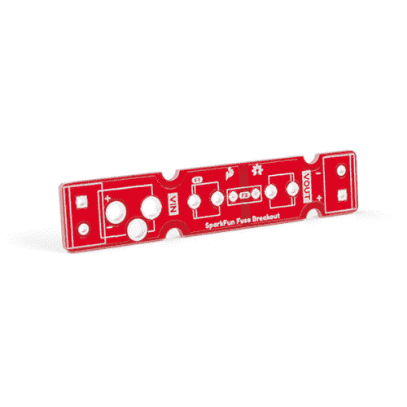](https://www.sparkfun.com/products/15697) 

将**添加到您的[购物车](https://www.sparkfun.com/cart)中！**

### [火花保险丝转接板](https://www.sparkfun.com/products/15697)

[In stock](https://learn.sparkfun.com/static/bubbles/ "in stock") BOB-15697

该板允许您为您的项目装配内嵌保险丝。使用筒式千斤顶和/或 5 毫米螺距螺丝端子。

$2.10 $1.37[Favorited Favorite](# "Add to favorites") 1[Wish List](# "Add to wish list")**** 

### [火花保险丝断接套件](https://www.sparkfun.com/products/retired/15702)

[Retired](https://learn.sparkfun.com/static/bubbles/ "Retired") KIT-15702

该套件允许您为您的项目装配和使用 250VAC、500mA 串联保险丝。配有桶形千斤顶和 5 毫米螺距…

1 **Retired**[Favorited Favorite](# "Add to favorites") 8[Wish List](# "Add to wish list")** **[https://www.youtube.com/embed/peHeryRQKW8/?autohide=1&border=0&wmode=opaque&enablejsapi=1](https://www.youtube.com/embed/peHeryRQKW8/?autohide=1&border=0&wmode=opaque&enablejsapi=1)

### 所需材料

按照这个教程，你需要一个分线板保险丝！你可能不需要所有的东西，这取决于你拥有什么。将它添加到您的购物车，通读指南，并根据需要调整购物车。玻璃套管保险丝所需的最少组件包含在套件版本中。然而，我们建议在原型制作和测试时更换不止一个玻璃保险丝。

 

### [火花保险丝断接套件](https://www.sparkfun.com/products/retired/15702)

[Retired](https://learn.sparkfun.com/static/bubbles/ "Retired") KIT-15702

该套件允许您为您的项目装配和使用 250VAC、500mA 串联保险丝。配有桶形千斤顶和 5 毫米螺距…

1 **Retired**[Favorited Favorite](# "Add to favorites") 8[Wish List](# "Add to wish list")

如果您单独订购分线板，您可以从我们的[保险丝类别](https://www.sparkfun.com/categories/320)中选择适合您项目的保险丝。只要确保获得必要的保险丝夹和连接器，以满足您的需求。

 

将**添加到您的[购物车](https://www.sparkfun.com/cart)中！**

### [自愈保险丝 PTC](https://www.sparkfun.com/products/8357)

[In stock](https://learn.sparkfun.com/static/bubbles/ "in stock") COM-08357

这是一个方便的小装置，可以让你的身体系统远离吸烟。可复位保险丝(也称为 PTC)(http://en . wiki…

$1.50[Favorited Favorite](# "Add to favorites") 12[Wish List](# "Add to wish list")**** 

将**添加到您的[购物车](https://www.sparkfun.com/cart)中！**

### [保险丝 5mm 125VAC 5A](https://www.sparkfun.com/products/9772)

[In stock](https://learn.sparkfun.com/static/bubbles/ "in stock") COM-09772

这是一个玻璃套圈型保险丝。它非常适合我们的 5 毫米保险丝夹。保险丝的额定电压为 125 伏交流电，最高可达 5 安。保险丝是 p…

$0.55[Favorited Favorite](# "Add to favorites") 4[Wish List](# "Add to wish list")****[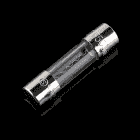](https://www.sparkfun.com/products/10166) 

将**添加到您的[购物车](https://www.sparkfun.com/cart)中！**

### [保险丝 5mm 250V 500mA](https://www.sparkfun.com/products/10166)

[In stock](https://learn.sparkfun.com/static/bubbles/ "in stock") COM-10166

这是一个玻璃套圈型保险丝。它非常适合我们的 5 毫米保险丝夹。保险丝的额定电压为 250 伏交流电，最高可达 500 毫安。保险丝配置…

$1.05 $0.84[Favorited Favorite](# "Add to favorites") 4[Wish List](# "Add to wish list")****[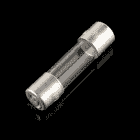](https://www.sparkfun.com/products/retired/10165) 

### [保险丝 5mm 250V 200mA](https://www.sparkfun.com/products/retired/10165)

[Retired](https://learn.sparkfun.com/static/bubbles/ "Retired") COM-10165

这是一个玻璃套圈型保险丝。它非常适合我们的 5 毫米保险丝夹。保险丝的额定电压为 250 伏交流电，最高可达 200 毫安。保险丝配置…

1 **Retired**[Favorited Favorite](# "Add to favorites") 4[Wish List](# "Add to wish list")****** ******### 工具

你需要一个烙铁、焊料和一般的焊接附件。

 

将**添加到您的[购物车](https://www.sparkfun.com/cart)中！**

### [袖珍螺丝刀套装](https://www.sparkfun.com/products/12891)

[In stock](https://learn.sparkfun.com/static/bubbles/ "in stock") TOL-12891

每个黑客都应该拥有什么？没错，一把螺丝刀(你必须以某种方式进入那些箱子)。什么…

$4.505[Favorited Favorite](# "Add to favorites") 24[Wish List](# "Add to wish list")**** 

将**添加到您的[购物车](https://www.sparkfun.com/cart)中！**

### [【烙铁- 60W(可调温度)](https://www.sparkfun.com/products/14456)

[In stock](https://learn.sparkfun.com/static/bubbles/ "in stock") TOL-14456

当你不想倾家荡产，但又需要一个可靠的烙铁时，这个可调节温度的烙铁是一个很好的工具…

$16.5016[Favorited Favorite](# "Add to favorites") 43[Wish List](# "Add to wish list")**** 

将**添加到您的[购物车](https://www.sparkfun.com/cart)中！**

### [无铅焊料- 15 克管](https://www.sparkfun.com/products/9163)

[In stock](https://learn.sparkfun.com/static/bubbles/ "in stock") TOL-09163

这是你的无铅焊料的基本管，带有不干净的水溶性树脂芯。0.031 英寸规格，15 克

$3.954[Favorited Favorite](# "Add to favorites") 14[Wish List](# "Add to wish list")****** ******### 推荐阅读

如果您不熟悉以下概念，我们建议您在继续之前查看这些教程。

 [### 连接器基础](https://learn.sparkfun.com/tutorials/connector-basics) Connectors are a major source of confusion for people just beginning electronics. The number of different options, terms, and names of connectors can make selecting one, or finding the one you need, daunting. This article will help you get a jump on the world of connectors.[Favorited Favorite](# "Add to favorites") 62 [### 什么是电路？](https://learn.sparkfun.com/tutorials/what-is-a-circuit) Every electrical project starts with a circuit. Don't know what a circuit is? We're here to help.[Favorited Favorite](# "Add to favorites") 82 [### 电力](https://learn.sparkfun.com/tutorials/electric-power) An overview of electric power, the rate of energy transfer. We'll talk definition of power, watts, equations, and power ratings. 1.21 gigawatts of tutorial fun 54 [### 极性](https://learn.sparkfun.com/tutorials/polarity) An introduction to polarity in electronic components. Discover what polarity is, which parts have it, and how to identify it.[Favorited Favorite](# "Add to favorites") 52

## 保险丝是如何工作的？

[保险丝](https://en.wikipedia.org/wiki/Fuse_(electrical))是帮助保护您的项目免受过电流保护的电气组件。根据制造商和应用，有不同的电流和电压额定值。保险丝烧断的速度也可以从**慢烧(又名延时)**、**正常烧断**、**快烧断**和**超快烧断**不等。保险丝有很多种，但我们将重点关注以下几种。

*   玻璃套管保险丝
*   可复位保险丝(又称正温度系数或 PTC)

**More About Fuses:** Check out this sweet article and video from Digi-Key about testing and identifying fuse problems.

[Digi-Key: Testing and Identifying Fuse Problems](https://www.digikey.com/en/blog/testing-and-identifying-fuse-problems)

### 玻璃套管保险丝

当您想到保险丝时，通常会想到玻璃套管保险丝。它们非常简单。如果电流超过保险丝的额定值，保险丝内部的小灯丝就会变热并断裂(就像灯泡烧坏一样)。然后电路被断开，希望你的电路被从熔化的毁灭中拯救出来。玻璃盒对于检查保险丝是否熔断是有用的，但是与陶瓷盒相比，它们的故障电流较低。

根据不同的规格，你可能会注意到灯丝发光，并在炽热的光辉中熄灭。或者你可能会注意到灯丝可能只亮了一小会儿就融化了。在其他情况下，灯丝可能会在断开前弯曲或融化成微小的金属球(没有那么令人兴奋)。

### 可复位保险丝(又称 PTC)

正温度系数(PTC)(也称为多保险丝、多保险丝、多开关或[热敏电阻](http://en.wikipedia.org/wiki/Thermistor))是一种当电流流过时电阻会增加的器件。左边的 PTC 用于通孔焊盘，而右边的 PTC 用于 SMD。

|  | [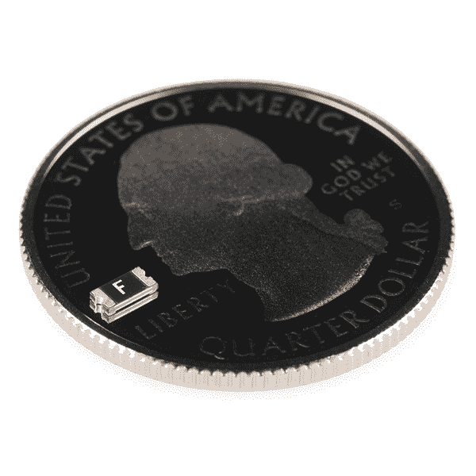](https://www.sparkfun.com/products/retired/11637) |
| *PTH PTC* | *贴片 PTC* |

PTC 是你的朋友！初学电子的人经常会弄短路或者不小心把东西弄反了。这些 PTC 可以设计为在一定的电流下(比如一个 250mA 的 PTC，电流保护为 500mA)，电阻急剧增加，从而限制电流。您可以在某些连接到 USB 端口的电机板和微控制器上找到这些自复位保险丝，如下图所示。

| [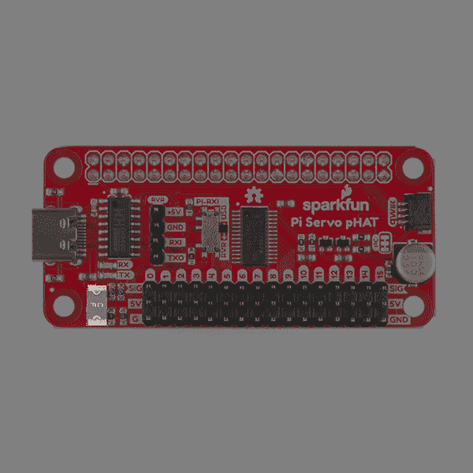](https://cdn.sparkfun.com/assets/learn_tutorials/9/6/6/15316-SparkFun_Servo_pHAT_for_Raspberry_Pi-resettable-fuse.jpg) |  | [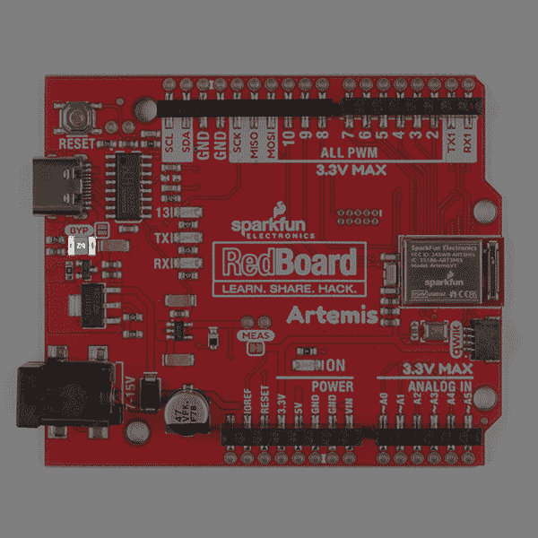](https://cdn.sparkfun.com/assets/learn_tutorials/9/6/6/15444-SparkFun_RedBoard_Artemis-resettable-fuse.jpg) |
| *伺服帽上的[自复保险丝](https://www.sparkfun.com/products/14328)* | *自定义[Arduino Uno](https://www.sparkfun.com/products/11021)T3 的自复位保险丝* | *为[雷德卡阿耳忒弥斯](https://www.sparkfun.com/products/15444)的自复保险丝* |

基本上，PTC 的作用相当于[可复位保险丝](https://en.wikipedia.org/wiki/Resettable_fuse)！你会想把这个设备串联，在你的电压调节器之前。如果您的电路消耗超过 500 毫安(例如，如果您将电源短接到地)，250 毫安的 PTC 将会发热，并将电流限制在 250 毫安。一旦消除短路，电流将下降，PTC 将冷却，电路将再次开始正常工作。这是一个非常酷的小组件，可以让许多设计免于冒烟。

*Resettable fuse included in design from the [Beginning Embedded Electroics Tutorial Series](https://www.sparkfun.com/tutorials/57).*

PTC 通孔保险丝下面的热图像很好地显示了当 PTC 跳闸时会发生什么。左边的热图显示了正常状态下的电压调节电路。右图显示了短路时的电路。注意 PTC 变得多热(213 华氏度！)因为它限制了通过电路的破坏性电流量。主要感谢约书亚韦弗伟大的热拍摄！

| [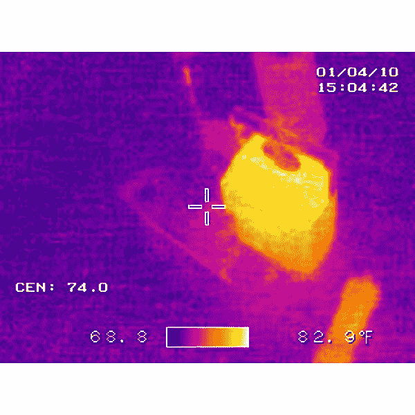](https://cdn.sparkfun.com/assets/learn_tutorials/9/6/6/Resettable-PTC-Fuse_VREG_Thermal-Image.jpg) | [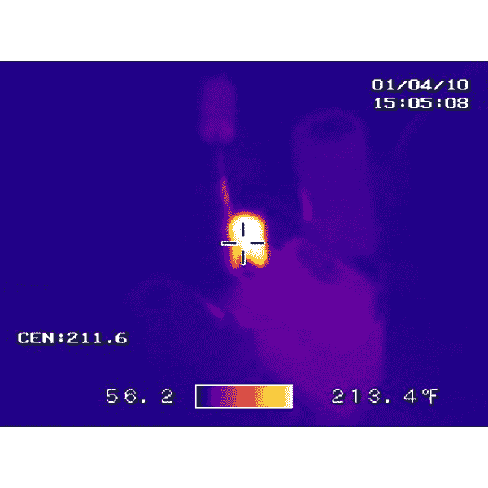](https://cdn.sparkfun.com/assets/learn_tutorials/9/6/6/Resettable-PTC-Fuse-Tripping_Thermal-Image.jpg) |
| *正常情况下运行的电压调节器* | *PTC 保险丝跳闸，防止电路损坏* |

## 硬件概述

### 车辆识别号码

左侧是我们的输入 VIN。您可以在输入侧焊接 2 针螺丝端子(5 毫米)(以黄色突出显示)。或者，如果您决定轻松连接墙壁适配器(带有中央正极筒式插孔)进行极化连接，您可以为输入焊接一个筒式插孔(以黑色突出显示)。

请记住，与[筒形插孔](https://www.sparkfun.com/datasheets/Prototyping/Barrel-Connector-PJ-202A.pdf)触点相比，[5 毫米螺丝端子](https://www.sparkfun.com/datasheets/Prototyping/Screw-Terminal-5mm.pdf)的额定电流更大。然而，[目录中销售的 DC 墙壁适配器](https://www.sparkfun.com/categories/308)使用筒式插孔供电。您也可以将电线直接焊接到分线板上，只要[它们的额定值与项目的](https://learn.sparkfun.com/tutorials/working-with-wire#wire-thickness)相符。

### 玻璃保险丝

⚡ **Heads up!** The PCB was designed for **DC power**. It was not designed for AC power. Make sure that you are using the glass fuse on the DC side for protection!

The fuse breakout board has been tested up to a 5A glass ferrule fuse.

如果您使用玻璃保险丝盒，有两个夹子需要焊接到电路板上。确保正确焊接夹子。

### PTC 保险丝

增加了 PTC 保险丝的通孔，以防您决定使用可复位的 PTC 保险丝。虽然电路板是为通孔 PTC 设计的，但在制作原型时，您仍可以将 SMD PTC 保险丝焊接到焊盘上。根据 SMD 保险丝的大小，组件可能不太合适。

### VOUT

右侧是输出 VOUT。你可以在这里焊接一个 2 针螺丝端子(5 毫米)。

### 安装孔

如果您决定将主板安装到面板或机箱中，主板上有四个安装孔。为了确保电路板尺寸降至最低，包括一半的安装孔。

### 电路板尺寸

该板的尺寸为 0.50 英寸 x 2.56in 英寸。如果您决定安装该板或并排放置，有四个半圆形安装孔。

[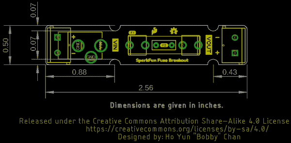](https://cdn.sparkfun.com/assets/learn_tutorials/9/6/6/SparkFun_Fuse_Breakout_Board_Dimensions.png)

## 硬件装配

你需要把你的连接器和保险丝夹焊接到分接头上。你可以按你喜欢的任何顺序焊接元件。如果你以前没有焊接过，看看我们下面的教程吧！

 [### 如何焊接:通孔焊接

#### 2013 年 9 月 19 日](https://learn.sparkfun.com/tutorials/how-to-solder-through-hole-soldering) This tutorial covers everything you need to know about through-hole soldering.[Favorited Favorite](# "Add to favorites") 70

### 焊接输入和输出连接器

在 VIN 方面，您有两种选择。对于那些使用这与墙壁适配器与中心积极桶插孔，你会想要使用它与桶插孔连接器。否则，您可以在 VIN 侧焊接 5mm 螺丝端子。

|  | [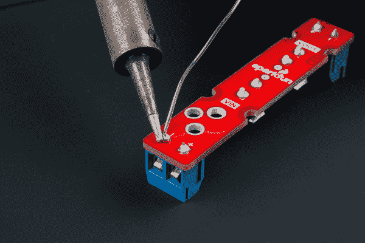](https://cdn.sparkfun.com/assets/learn_tutorials/9/6/6/Fuse_Breakout_Kit_Hookup_Solder_VIN.jpg) |
| *VIN 的桶形千斤顶* | *VIN 的 5 毫米螺丝端子* |

焊接输入端后，将螺丝端添加到 VOUT 侧。

**Note:** If you ordered the kit, you'll have an extra connector after soldering the components on the board. We provided the extra connector as an option depending on your project's needs. Just place it in your parts kit and pull it back out when you need!

### 焊接 5 毫米保险丝夹

下一步是将玻璃保险丝的夹子焊接到电路板上。将夹子插入每一侧。在将每条腿钉到板上之前，你需要确保夹子的方向正确。如果你仔细观察每个保险丝夹的丝网印刷，你会看到正方形的一边增加了一条副线。这是你应该将弯曲的钻头朝向的一面。一旦每条腿被钉牢，焊接另一条腿。焊接时夹子可能会变热，因此您可能需要用胶带将其贴在电路板上，或者用一小块纸板将夹子固定在电路板上。

[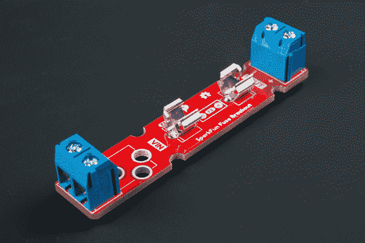](https://cdn.sparkfun.com/assets/learn_tutorials/9/6/6/Fuse_Breakout_Kit_Hookup_Solder_Fuse_Clip.jpg)*Click image for a closer view of the fuse clips!***Note:** If you decide to use the breakout board with a PTC fuse, you can simply solder the through hole PTC fuse without the need to solder the fuse clips. You''ll need to cut off any excess leads left from the through hole PTC using a flush cutter. For advanced users, you can also use the through hole pads to solder a SMD PTC Fuse.

### 为您的系统添加保险丝

如果您使用的是玻璃保险丝，现在可以将玻璃保险丝盒插入夹子中。如果你的保险丝烧断了，就拿一把[平头螺丝刀](https://www.sparkfun.com/products/9146)小心地把它撬出来。

[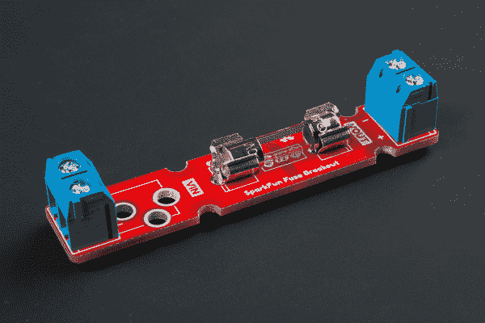](https://cdn.sparkfun.com/assets/learn_tutorials/9/6/6/SparkFun_5mmx20mm_Glass_Cartridge_Ferrule_Fuse.jpg)

否则，将筒形千斤顶插入 VIN 侧或拧紧螺钉，以压住电源和负载之间的[剥线](https://learn.sparkfun.com/tutorials/working-with-wire/all#how-to-strip-a-wire)。确保注意你的电压和地线的丝网印刷。

### 增加

部分设计包括半圆形安装孔。如果您决定将电路板安装到面板或外壳上，这将非常有用。要进行装载，您需要:

*   拧紧一些支架(或螺钉和支架)
    *   确保硬件之间有滑动 PCB 的空间
*   将 PCB 放在支架之间拧紧
    *   如果您使用一个以上的保险丝分接头，在拧紧之前，将支架放置在两个印刷电路板之间
*   对每个支架重复上述步骤

[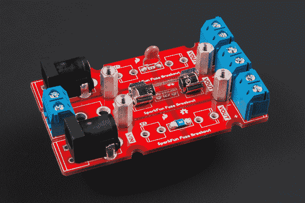](https://cdn.sparkfun.com/assets/learn_tutorials/9/6/6/SparkFun_Fuse_Breakout_Mounting.jpg)

## 选择保险丝时的考虑因素

选择保险丝取决于您的项目。在电源或电池后放置保险丝时，需要考虑以下几点。

### 项目电压和电流要求

你首先需要一个能够承受负载电压和电流的保险丝。保险丝的[数据表](https://www.sparkfun.com/tutorials/223)应提供该信息。然后[测量项目在不损坏电路的情况下预计从你的电源获取的最大功率](https://learn.sparkfun.com/tutorials/how-to-use-a-multimeter/all#measuring-current)。如果项目在一段时间内输出过多的热量，您可能需要考虑这一点。通过测量，您需要确定保险丝熔断或跳闸的电流。该值通常等于或低于跳闸电流，并在电源的安培数范围内(即，如果您希望保险丝在部分负载拉动 20A 大电流电源的 1A 时跳闸)。有短暂电流峰值的项目(例如使用电机的机器人)需要一个缓慢的冲击(也就是延时)。其他项目可能要求保险丝立即熔断，需要快速或超快速熔断。我们假设它们将在室温下使用。

### 玻璃套管保险丝或 PTC

对于高电流电源，您可能需要考虑在项目中使用玻璃套管保险丝来断开和熔断。对于低电流电源，您可能需要考虑使用自恢复保险丝。请记住，可复位保险丝在跳闸时会变热，并且仍然会向负载泄漏电流。

### 压力测试

一旦你决定了一个熔丝来满足你的原型需求，一定要测试它！是的，这意味着牺牲你的玻璃套圈保险丝，但你要确保当你的电路开始有自己的想法时，组件按预期工作。

## 例子

### 高电流电源

设计该板的灵感来自于阅读 Hackaday 的文章:[融合 LED 灯条的工程案例](https://hackaday.com/2018/01/29/the-engineering-case-for-fusing-your-led-strips/)。对于具有高电流输出的电源，它们只会不断向负载注入电流。这可能会损坏您的电路，并存在相当大的火灾隐患。将保险丝放在靠近电源输出的地方，可以在线路发生故障时保护电路。在这种情况下，我们希望保险丝熔断，并断开其余 led 的电源。如果您使用一个高电流电源的多个 LED 灯条，您只需为每个 LED 灯条部分分配电流。

[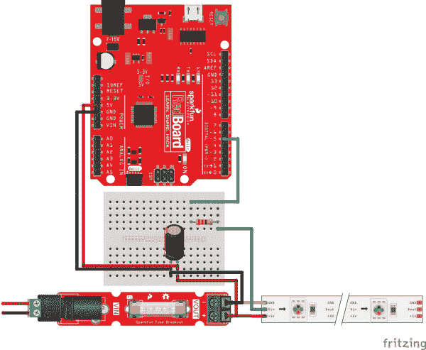](https://cdn.sparkfun.com/assets/learn_tutorials/9/6/6/Fuse-Addressable-LEDs-Strip-WS2812-APA-Fritzing_bb.jpg)

### 低电流电源

如果您决定使用带低电流电源的可复位 PTC 保险丝，您可以将其放在输入电压之后。下面是一个示例[示意图](https://learn.sparkfun.com/tutorials/how-to-read-a-schematic/all)，PTC 位于墙壁适配器和电压调节器之间。如果您需要在最终设计之前快速测试设置，在制作原型时将 PTC 保险丝与分线板放在一起非常有用。

[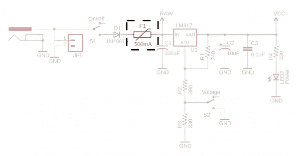](https://cdn.sparkfun.com/assets/learn_tutorials/9/6/6/Breadboard_Power_Supply_PTC_Fuse_Highlighted.jpg)*PTC fuse used in the design of the [Breadboard Power Supply Kit](https://www.sparkfun.com/products/114).*

下面是在 USB 连接器和微控制器之间放置 PTC 保险丝的示例。

[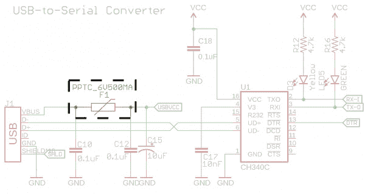](https://cdn.sparkfun.com/assets/learn_tutorials/9/6/6/RedBoard_Qwiic_PTC_Fuse_Highlight.jpg)*PTC fuse used in the design of the [RedBoard Qwiic](https://www.sparkfun.com/products/15123)***Tip:** Want more circuit production? Add an additional Schottky diode with a fuse for reverse current protection.

*Reverse Current Protection from the [Diode Tutorial](https://learn.sparkfun.com/tutorials/diodes/all#diode-applications)*

## 资源和更进一步

现在，您已经成功地启动并运行了 fuse 分线板，是时候将它合并到您自己的项目中了！有关更多信息，请查看以下链接。

*   [示意图(PDF)](https://cdn.sparkfun.com/assets/3/9/6/0/5/SparkFun_Fuse_Breakout_Board-Schematic.pdf)
*   [老鹰文件(ZIP)](https://cdn.sparkfun.com/assets/2/1/d/a/4/SparkFun_Fuse_Breakout_Board.zip)
*   [电路板尺寸](https://cdn.sparkfun.com/assets/learn_tutorials/9/6/6/SparkFun_Fuse_Breakout_Board_Dimensions.png)
*   文章
    *   [Digi-Key:测试和识别保险丝问题](https://www.digikey.com/en/blog/testing-and-identifying-fuse-problems)
    *   [Hackaday:融合 LED 灯条的工程案例](https://hackaday.com/2018/01/29/the-engineering-case-for-fusing-your-led-strips/)
*   [GitHub](https://github.com/sparkfun/SparkFun-Fuse-Breakout-Board)
*   [SFE 产品展示区](https://youtu.be/peHeryRQKW8)

需要一些灵感吗？查看其他相关教程:

 [### 台式电源板套件连接指南

#### 2014 年 11 月 3 日](https://learn.sparkfun.com/tutorials/benchtop-power-board-kit-hookup-guide) Need more power? This Benchtop ATX Power Supply Kit should help give you the boost you need to power those energy hungry projects.[Favorited Favorite](# "Add to favorites") 16 [### 爱好伺服教程](https://learn.sparkfun.com/tutorials/hobby-servo-tutorial) Servos are motors that allow you to accurately control the rotation of the output shaft, opening up all kinds of possibilities for robotics and other projects.[Favorited Favorite](# "Add to favorites") 24 [### 12V/5V 电源连接指南](https://learn.sparkfun.com/tutorials/12v5v-power-supply-hookup-guide) In this tutorial, we will replace the 12V/5V (2A) power supply's molex connector with two male barrel jacks adapters.[Favorited Favorite](# "Add to favorites") 5 [### LumiDrive 连接指南](https://learn.sparkfun.com/tutorials/lumidrive-hookup-guide) The LumiDrive LED Driver is SparkFun’s foray into all things Python on micro-controllers. With the SparkFun LumiDrive you will be able to control and personalize a whole strand of APA102s directly from the board itself.[Favorited Favorite](# "Add to favorites") 5 [### SML 电源板 LiPo 连接指南](https://learn.sparkfun.com/tutorials/sml-power-board-lipo-hookup-guide) Small in size, small on current draw. It's a smôl world! This guide will get you up and running with the smôl Power Board LiPo.[Favorited Favorite](# "Add to favorites") 0

或者看看下面的博客文章，寻找灵感:

 [### 电源保护

January 13, 2009](https://www.sparkfun.com/news/220 "January 13, 2009: What is the best way to protect electronics against reverse polarization?")[Favorited Favorite](# "Add to favorites") 0 [### t:加热毯拆卸

June 21, 2016](https://www.sparkfun.com/news/2120 "June 21, 2016: Sarah takes apart a non-functional heated blanket to have a look around")[Favorited Favorite](# "Add to favorites") 0**************