# 英特尔 Edison spark fun 模块通用指南

> 原文：<https://learn.sparkfun.com/tutorials/general-guide-to-sparkfun-blocks-for-intel-edison>

## 什么是“块”？

[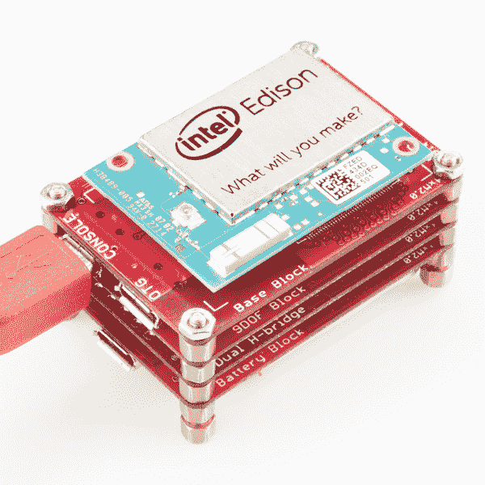](https://cdn.sparkfun.com/assets/learn_tutorials/3/2/2/Edison_Block_Stack_ISO.jpg)

[英特尔 Edison 的 SparkFun 模块](https://www.sparkfun.com/search/results?term=edison+blocks)是解锁微型 70 针扩展连接器提供的所有功能的绝佳方式。通过混合和匹配模块，用户可以为任何应用定制 Edison。首先，我们来看一下一堆块的结构。

*A sample stack of Blocks*

*   [英特尔 Edison](https://www.sparkfun.com/products/13024) -堆栈的“大脑”，提供处理和通信。
*   70 针连接器——堆栈的主干，为所有模块提供电源和数据路径。
*   支座-为堆垛块料提供机械强度。
*   块-70 针扩展连接器的分支功能的板。

块允许应用程序保持小，利用爱迪生的微型尺寸。这样做需要继续使用 70 针连接器。

[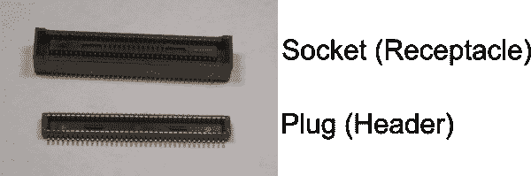](https://cdn.sparkfun.com/assets/learn_tutorials/3/2/2/Connectors_annotated.png)*Hirose DF40 Socket and Plug*

制造商(Hirose)将连接器命名为接头和插座。我们将各自的连接器命名为插头和插座，以便更好地描述它们之间的接口。

*   插座-该连接器位于应用板上。这允许信号被爱迪生或堆叠块接收。
*   插头(头部)-该连接器位于爱迪生上。当在块上使用时，这允许信号传递到堆栈中的下一个块。

大多数块都有两个连接器，允许信号被使用，然后传递到堆栈中的下一个块。这与 Arduino 盾牌的工作方式非常相似。现在让我们看看不同类型的块，并学习如何创建自己的堆栈。

## 我需要哪些积木？

不是所有的块都被同等地创建。有电力、通信和与环境互动的障碍。SparkFun 工程师肖恩在下面的视频中对爱迪生和积木做了一个很好的概述。视频结束后，我们将试着对积木进行分类，以大致了解每个积木的用途。有些积木具有多种功能，会出现在多个类别中。

替换打开

[//www.youtube.com/embed/GY8kaaFzbTE](//www.youtube.com/embed/GY8kaaFzbTE)

替换关闭

* * *

## 电源模块

当构建一堆块时，首先要考虑的是功率。有许多模块可为 Intel Edison 供电。这些模块能够为位于 70 针扩展连接器上的 Edison VSYS 输入提供所需的电源。SparkFun 制造的所有电源模块都旨在为 VSYS 总线提供 4.0-4.1V 电压。

* * *

| [面向英特尔 Edison 的 SparkFun 模块- Base](https://www.sparkfun.com/products/13045)
该模块可以通过微型 USB 连接器为 Edison 堆栈供电。首选方法是通过标有“控制台”的端口供电。这使得 OTG 端口可用于 USB 设备，如网络摄像机、大容量存储设备或其他支持 USB 的设备。电源按钮能够使 Edison 进入休眠状态，并完全关闭模块电源。 |  |
| 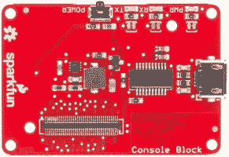 | [英特尔 Edison 控制台的 SparkFun 模块](https://www.sparkfun.com/products/13039)
控制台模块可以通过微型 USB 连接器为 Edison 堆栈供电。电源按钮能够使 Edison 进入休眠状态，并完全关闭模块电源。 |
| [英特尔 Edison - UART 的 SparkFun 模块](https://www.sparkfun.com/products/13040)
UART 模块与 5V 兼容 FTDI 设备配对，如我们的 [FTDI 基本分线点](https://www.sparkfun.com/products/9716)，将为 Edison 堆栈供电。UART 将为功耗不超过 500mA 的电池组供电。这是市场上典型 FTDI 设备的局限性。 | 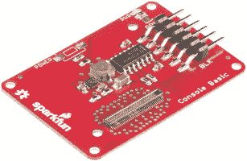 |
| 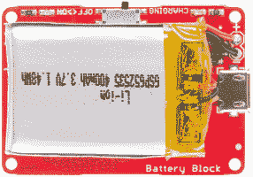 | [英特尔爱迪生电池的 SparkFun 模块](https://www.sparkfun.com/products/13037)
电池模块可能是为爱迪生电池组供电的最简单方式。只需扳动开关，一个 400 毫安时的锂聚合物电池就能为爱迪生供电一个多小时。电池寿命会因 CPU 和 WiFi 使用情况而异。电池块上的微型 USB 连接器提供了一种给电池充电的方式。微型 USB 接口仅用于充电。 |
| [英特尔 Edison - GPIO 的 SparkFun 模块](https://www.sparkfun.com/products/13038)
GPIO 模块提供对 Edison 堆栈中 VSYS 和 GND 线引脚的访问。虽然可以通过 GPIO 模块为 Edison 堆栈供电，但还是有风险的。你必须小心，只提供 3.3-4.5V。超过这些范围将损坏电池堆和爱迪生。 | 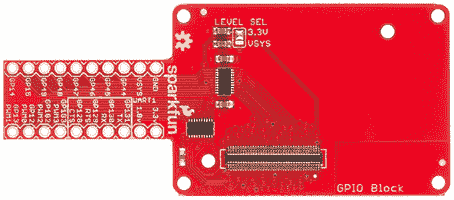 |

* * *

## 控制台通信模块

既然我们的 Edison 堆栈有电了，我们需要登录我们的 Edison。Edison 使用一个[串行终端](/tutorials/terminal-basics)接口来允许用户访问 Edison 控制台。该控制台位于 **UART2** 上。所有 SparkFun 通信块都提供必要的级别转换。

* * *

| [用于英特尔 Edison 的 SparkFun 模块-基本模块](https://www.sparkfun.com/products/13045)
基本模块利用 FT231x 为控制台提供 USB 串行接口。当 UART 激活时，有两个状态 LED 亮起。该基础模块还利用 USB OTG 端口来实现 Edison 模块提供的 USB 网络功能。 |  |
|  | [用于英特尔 Edison 的 SparkFun 模块-控制台](https://www.sparkfun.com/products/13039)
控制台模块利用 FT231x 为控制台提供 USB 串行接口。当 UART 激活时，有两个状态 LED 亮起。 |
| [英特尔 Edison - UART 的 SparkFun 模块](https://www.sparkfun.com/products/13040)
UART 模块为控制台端口提供电平转换接口。当 USB 不是一个选项时，这是一个伟大的解决方案。这允许 Edison 模块通过提供受保护的信号接口与传统硬件接口。 |  |

* * *

## 输入块

输入块类别显示了每个块如何将数据引入 Edison 进行处理。这些输入可以是原始信号电平，也可以是来自外部传感器的经过处理的数据。这些输入依赖于多种通信方法，每个模块都有说明。这些模块采用了 Edison 的原始功能，并使用户可以访问它。

* * *

| [面向英特尔 Edison 的 SparkFun 模块- 9 自由度](https://www.sparkfun.com/products/13033)
9 自由度模块利用 [LSM9DS0](https://www.sparkfun.com/products/12636) 为 Edison 提供惯性测量单元(IMU)。使用此模块来确定方向、加速度和指南针方向。传感器默认使用 [I2C](/tutorials/i2c) 。通过对跳线进行一些重新配置，它可以与 [SPI](/tutorials/serial-peripheral-interface-spi) 接口一起使用。 | 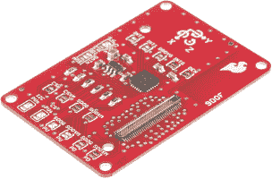 |
| 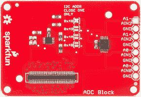 | [英特尔 Edison - ADC 的 SparkFun 模块](https://www.sparkfun.com/products/13046)
[模数转换器](https://learn.sparkfun.com/tutorials/analog-to-digital-conversion) (ADC)模块是与传感器和以模拟(可变电压)格式输出信号的设备接口的绝佳方式。该模块为用户提供一个 12 位σ-δ转换器，可多路复用至 4 路单输入或 2 路差分输入对。该模块通过 I2C 进行通信，使用一些跳线，您可以在一个堆栈中支持多达 4 个模块。 |
| [英特尔 Edison - Arduino](https://www.sparkfun.com/products/13036)
的 SparkFun 模块 Arduino 模块用途极其广泛。通过扩展接头上的 UART1 编程，可以将 Arduino 用作任何传感器的串行接口，这些传感器通常与 [Arduino Pro Mini](https://www.sparkfun.com/products/11114) 一起工作。当您需要传感器的精确计时时，Arduino 模块非常有用，例如 [WS2812 LED 的](https://www.sparkfun.com/products/11820) | 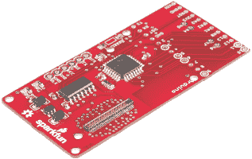 |
|  | [英特尔 Edison 的 SparkFun 模块-GPIO](https://www.sparkfun.com/products/13038)
GPIO 模块为 Edison 提供电平转换输入功能。所有通用 GPIO 都已按功能分解和分组。Edison 有八个通用 GPIO、四个具有 PWM 功能的 GPIO 和四个可以充当第二个 UART 的 GPIO。由于电平转换器的双向能力，当使用引脚作为输入时，有必要提供上拉/下拉电阻。 |
| [英特尔爱迪生 I2C](https://www.sparkfun.com/products/13034)
的 SparkFun 模块 I2C 模块是与任何通过 [I2C](/tutorials/i2c) 进行通信的外部传感器或设备进行交互的绝佳方式。该模块能够为您的设备提供 3.3V 或 VSYS 电源。该器件提供从 1.8V 爱迪生信号到模块中任一选定电压的电平转换。可以黑掉该器件以提供 5V 电平转换。 | 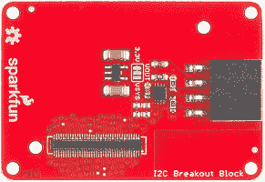 |
| 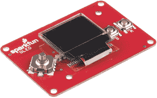 | [英特尔爱迪生-有机发光二极管](https://www.sparkfun.com/products/13035)
的 SparkFun 模块基于[微有机发光二极管突破](https://www.sparkfun.com/products/13003)和[微视图](https://www.sparkfun.com/products/12923)，有机发光二极管模块为用户提供 64x48 像素的蓝黑显示。该模块还有两个按钮和一个 [5 向开关](https://www.sparkfun.com/products/10063)。使用这些来创建游戏和交互式菜单。 |
| [英特尔 Edison - UART 的 SparkFun 模块](https://www.sparkfun.com/products/13040)
UART 模块可用于连接 Edison 与传统硬件或 GPS 接收器。UART 模块提供对 UART1 或 UART2 的电平转换访问。使用 [RS232 转换器](https://www.sparkfun.com/products/449)可以将 Edison 连接到老式自动化设备和仪器中常见的 RS232 设备。 |  |

* * *

## 输出块

输出模块类别显示了 Edison 如何利用每个模块来控制外部组件或功能。

* * *

| [英特尔 Edison - Arduino](https://www.sparkfun.com/products/13036)
的 SparkFun 模块 Arduino 模块用途极其广泛。通过扩展接头上的 UART1 编程，可以将 Arduino 用作任何输出设备的串行接口，这些输出设备通常与 [Arduino Pro Mini](https://www.sparkfun.com/products/11114) 一起工作。当您需要输出的精确定时时，Arduino 模块非常有用，例如 [WS2812 LED 的](https://www.sparkfun.com/products/11820) |  |
|  | [英特尔 Edison 的 SparkFun 模块-GPIO](https://www.sparkfun.com/products/13038)
GPIO 模块为 Edison 提供电平转换输出功能。所有通用 GPIO 都已被分解并按功能分组。Edison 有八个通用 GPIO、四个具有 PWM 功能的 GPIO 和四个可以充当第二个 UART 的 GPIO。由于电平转换器的双向功能，在使用继电器和 LED 等高电流器件时，有必要提供一个外部开关。电平转换器只能提供 20mA。您可以直接从电平转换器点亮 LED，但它可能看起来不太亮。 |
| [英特尔 Edison 的 SparkFun 模块-双 H 桥](https://www.sparkfun.com/products/13043)
双 H 桥模块能够从外部电源驱动两个 DC 电机到 1A。电压输入可以是 5-15V DC。有一个跳线允许电机由 VSYS 驱动，但这将电机电压限制在每通道 4V 和 500mA。该模块基于[火花马达驱动器](https://www.sparkfun.com/products/9457)。 | 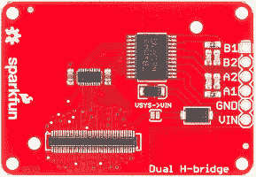 |
|  | [英特尔爱迪生 I2C](https://www.sparkfun.com/products/13034)
的 SparkFun 模块 I2C 模块是与任何通过 [I2C](https://cdn.sparkfun.com/tutorials/i2c) 进行通信的外部传感器或设备进行交互的绝佳方式。该模块能够为您的设备提供 3.3V 或 VSYS 电源。该器件提供从 1.8V 爱迪生信号到模块上所选电压的电平转换。可以黑掉该器件以提供 5V 电平转换。更多信息见 I2C 块连接指南。 |
| [英特尔爱迪生-有机发光二极管](https://www.sparkfun.com/products/13035)
的 SparkFun 模块基于[微有机发光二极管突破](https://www.sparkfun.com/products/13003)和[微视图](https://www.sparkfun.com/products/12923)，有机发光二极管模块为用户提供 64x48 像素的蓝黑显示。使用它来创建用户反馈显示、游戏和交互式菜单。 |  |
|  | [英特尔 Edison - PWM 的 SparkFun 模块](https://www.sparkfun.com/products/13042)
PWM 模块为 Edison 模块增加了额外的 PWM 功能。PWM 模块通过 I2C 通信，可以控制 8 个 12 位分辨率的通道。使用地址跳线，可以堆叠额外的 8-10 个模块(由于信号完整性崩溃)。使用该块控制 [LED 的](https://www.sparkfun.com/categories/89)或[伺服](https://www.sparkfun.com/categories/245)。 |
| [英特尔 Edison - UART 的 SparkFun 模块](https://www.sparkfun.com/products/13040)
UART 模块可用于连接 Edison 和传统硬件。UART 模块提供对 UART1 或 UART2 的电平转换访问。使用 [RS232 转换器](https://www.sparkfun.com/products/449)可以将 Edison 连接到老式自动化设备和仪器中常见的 RS232 设备。 |  |

* * *

## 特殊功能块

* * *

| [英特尔 Edison - Arduino](https://www.sparkfun.com/products/13036)
的 SparkFun 模块 Arduino 模块用途极其广泛。通过扩展头上的 UART1 编程，可以将 Arduino 用作任何通常与 [Arduino Pro Mini](https://www.sparkfun.com/products/11114) 一起工作的串行接口。当您需要传感器或输出的精确定时时，Arduino 模块非常有用，例如[编码器](https://www.sparkfun.com/search/results?term=encoder)或 [WS2812 LED 的](https://www.sparkfun.com/products/11820) |  |
|  | [英特尔 Edison - Base 的 SparkFun 模块](https://www.sparkfun.com/products/13045)
该基座可用于将 Edison 作为文件系统安装在主机上。基础模块提供与[英特尔 Edison 和迷你分线](https://www.sparkfun.com/products/13025)板相同的功能。该基础模块具有通过控制台端口为 Edison 供电的额外功能，从而释放 OTG 端口供设备使用。 |
| [英特尔 Edison - microSD 的 SparkFun 模块](https://www.sparkfun.com/products/13041)
microSD 卡持有者可以访问 Edison 的高速 SD 端口。将您的 Edison 变成移动文件服务器、高容量数据记录器，或者扩展您操作系统的文件系统。 | 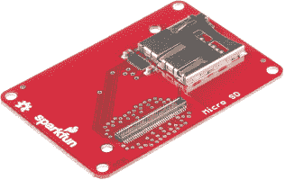 |
|  | [英特尔爱迪生有机发光二极管](https://www.sparkfun.com/products/13035)
的 SparkFun 模块有机发光二极管模块因其被视为“终端模块”而获得了特殊的功能分类。因为它是一个用户界面，所以它必须总是在块堆栈的末尾。有机发光二极管块被设计成允许用户创建一个定制的控制器或便携式游戏系统。 |

## 我如何制作自己的积木？

如果您已经超出了我们当前提供的[块，我们随时可以提供帮助！如果你错过了我们在](https://www.sparkfun.com/categories/272)[主页上的帖子](https://www.sparkfun.com/news/1591)，我们发布了一个模板来帮助你开始下一个想法。该模板旨在帮助创建与现有生态系统相结合的新区块。

[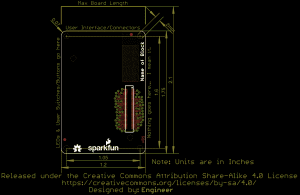](https://cdn.sparkfun.com/assets/learn_tutorials/3/2/2/EdisonEagle.png)

**[这里是我们的模板设计文件](https://github.com/sparkfun/Sparkfun_Blocks_Template)** ，拿去看看你能想出什么吧！原理图和电路板文件中有各种有用的信息。Edison 连接器的库部件也在那里。

[Download the Edison Block Template](https://github.com/sparkfun/Sparkfun_Blocks_Template)

这是爱迪生连接器的详细示意图，显示了引脚编号以及名称和功能。这对于测试信号也是有用的。

[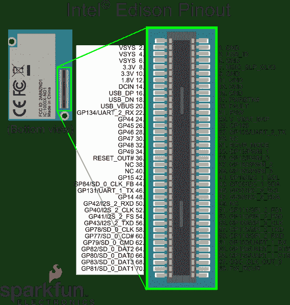](https://cdn.sparkfun.com/assets/learn_tutorials/3/2/2/edison-pinout_1.png)[Download the Edison Pinout Diagram as a PDF](https://cdn.sparkfun.com/assets/learn_tutorials/3/2/2/edison-pinout.pdf)

希望我们已经为您了解英特尔 Edison 生态系统的 SparkFun 模块提供了一个良好的开端。

## 资源和更进一步

现在，您已经对英特尔 Edison 的 Sparkfun 模块有了一个简要的概述，让我们来看看其他一些教程。这些教程涵盖编程、模块堆叠以及与英特尔 Edison 生态系统的接口。

*   [爱迪生入门指南](https://learn.sparkfun.com/tutorials/edison-getting-started-guide)
*   [在 Edison 上加载 Debian(Ubilinix)](https://learn.sparkfun.com/tutorials/loading-debian-ubilinux-on-the-edison)

查看 SparkFun 的其他爱迪生相关教程:

 [### 面向英特尔 Edison 的 SparkFun 模块-基本模块](https://learn.sparkfun.com/tutorials/sparkfun-blocks-for-intel-edison---base-block-) A quick overview of the features of the Base Block.[Favorited Favorite](# "Add to favorites") 2 [### 爱迪生入门指南](https://learn.sparkfun.com/tutorials/edison-getting-started-guide) An introduction to the Intel® Edison. Then a quick walk through on interacting with the console, connecting to WiFi, and doing...stuff.[Favorited Favorite](# "Add to favorites") 12 [### 在 Edison 上加载 Debian (Ubilinux)](https://learn.sparkfun.com/tutorials/loading-debian-ubilinux-on-the-edison) How to load a Debian distribution (specifically Ubilinux) onto the Edison.[Favorited Favorite](# "Add to favorites") 5 [### 交互式智能镜子](https://learn.sparkfun.com/tutorials/interactive-smart-mirror) Build a smart mirror that displays weather data using the Intel® Edison.[Favorited Favorite](# "Add to favorites") 24