# 称重传感器入门

> 原文：<https://learn.sparkfun.com/tutorials/getting-started-with-load-cells>

## 介绍

你曾经想知道某物的重量吗？知道体重随时间的变化怎么样？您希望您的项目通过测量某个表面上的应变或负载来感知某个物体的存在吗？如果是这样，你来对地方了。本教程旨在帮助您开始了解称重传感器及其变体。

[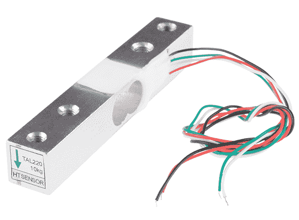](https://cdn.sparkfun.com/assets/learn_tutorials/3/8/2/13329-01Crop.jpg)*One of many kinds of load cells.*

### 建议阅读:

在了解称重传感器及其强大功能之前，我们建议您先熟悉一些基本概念，如果您还不了解的话:

 [### 电压、电流、电阻和欧姆定律](https://learn.sparkfun.com/tutorials/voltage-current-resistance-and-ohms-law) Learn about Ohm's Law, one of the most fundamental equations in all electrical engineering.[Favorited Favorite](# "Add to favorites") 132 [### 分压器](https://learn.sparkfun.com/tutorials/voltage-dividers) Turn a large voltage into a smaller one with voltage dividers. This tutorial covers: what a voltage divider circuit looks like and how it is used in the real world.[Favorited Favorite](# "Add to favorites") 70 [### 电阻](https://learn.sparkfun.com/tutorials/resistors) A tutorial on all things resistors. What is a resistor, how do they behave in parallel/series, decoding the resistor color codes, and resistor applications.[Favorited Favorite](# "Add to favorites") 57 [### 串联和并联电路](https://learn.sparkfun.com/tutorials/series-and-parallel-circuits) An introduction into series and parallel circuits.[Favorited Favorite](# "Add to favorites") 58 [### 如何阅读原理图](https://learn.sparkfun.com/tutorials/how-to-read-a-schematic) An overview of component circuit symbols, and tips and tricks for better schematic reading. Click here, and become schematic-literate today 112

## 称重传感器基础知识

### 称重传感器的类型

称重传感器是一种可以将压力(力)转化为电信号的物理元件(如果你想成为技术人员，也可以称为传感器)。

这意味着什么呢？称重传感器主要通过三种方式将作用力转化为可测量的读数。

#### 液压测压元件

液压测压元件使用传统的活塞和气缸装置，通过活塞的运动来传递压力变化，并使用隔膜装置来产生与测压元件相连的 Bourdon 管上的压力变化。

[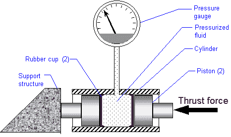](https://cdn.sparkfun.com/assets/learn_tutorials/3/8/2/hyd_dia3.gif)*Diagram of a Hydraulic Load Cell from [Nikka's Rocketry](http://www.nakka-rocketry.net/hydlc.html)*

#### 气动称重传感器

气动称重传感器使用施加在膜片一端的空气压力，并通过位于称重传感器底部的喷嘴排出，称重传感器内部有一个压力计。

[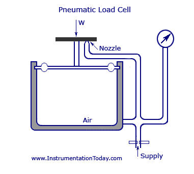](https://cdn.sparkfun.com/assets/learn_tutorials/3/8/2/Pneumatic-Load-Cell.jpg)*Diagram of a pneumatic load cell from [Instrumentation Today](http://www.instrumentationtoday.com/force-transducers/2011/07/)*

#### 应变式称重传感器

最后(尽管有许多其他不太常见的称重传感器设置)，还有一种应变式称重传感器，这是一种机械元件，其力通过元件上的一个(或几个)应变计的变形来检测。

[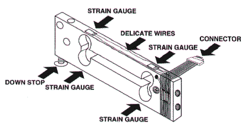](https://cdn.sparkfun.com/assets/learn_tutorials/3/8/2/loadcell.gif)*Strain gauge load cell diagram from [Scalenet.com](http://www.scalenet.com/applications/glossary.html)*

在杆式应变仪称重传感器中，传感器以“Z”形设置，以便将扭矩施加到杆上，传感器上的四个应变仪将测量弯曲变形，两个测量压缩，两个测量拉伸。当这四个应变计以惠斯通电桥形式设置时，很容易精确测量应变计电阻的微小变化。

[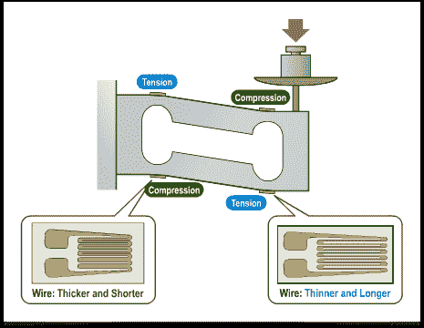](https://cdn.sparkfun.com/assets/learn_tutorials/3/8/2/img0054.png)*More in depth diagram of strain gauges on bar load cells when force is applied*

在本教程中，我们将重点关注应变式称重传感器，如 SparkFun 携带的传感器:

[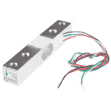](https://www.sparkfun.com/products/13329) 

将**添加到您的[购物车](https://www.sparkfun.com/cart)中！**

### [称重传感器- 10kg，直杆(TAL220)](https://www.sparkfun.com/products/13329)

[In stock](https://learn.sparkfun.com/static/bubbles/ "in stock") SEN-13329

这种直杆测压元件(有时称为应变仪)可以将高达 10kg 的压力(力)转化为电…

$9.503[Favorited Favorite](# "Add to favorites") 20[Wish List](# "Add to wish list")****[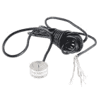](https://www.sparkfun.com/products/13332) 

将**添加到您的[购物车](https://www.sparkfun.com/cart)中！**

### [称重传感器- 200kg，圆盘(TAS606)](https://www.sparkfun.com/products/13332)

[Out of stock](https://learn.sparkfun.com/static/bubbles/ "out of stock") SEN-13332

这种盘式测压元件(有时称为应变仪)可以将高达 200 公斤的压力(力)转化为电…

$64.504[Favorited Favorite](# "Add to favorites") 19[Wish List](# "Add to wish list")****[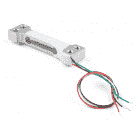](https://www.sparkfun.com/products/14728) 

将**添加到您的[购物车](https://www.sparkfun.com/cart)中！**

### [【迷你称重传感器- 500g，直杆(TAL221)](https://www.sparkfun.com/products/14728)

[In stock](https://learn.sparkfun.com/static/bubbles/ "in stock") SEN-14728

这种直杆测压元件(有时称为应变仪)可以将高达 500 克的压力(力)转化为电…

$10.95[Favorited Favorite](# "Add to favorites") 6[Wish List](# "Add to wish list")****[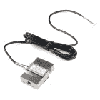](https://www.sparkfun.com/products/14282) 

将**添加到您的[购物车](https://www.sparkfun.com/cart)中！**

### [称重传感器- 200kg，S 型(TAS501)](https://www.sparkfun.com/products/14282)

[Out of stock](https://learn.sparkfun.com/static/bubbles/ "out of stock") SEN-14282

这种 S 型测压元件(有时称为应变仪)可以将高达 200 千克的压力(力)转化为电信号…

$64.503[Favorited Favorite](# "Add to favorites") 8[Wish List](# "Add to wish list")**** 

将**添加到您的[购物车](https://www.sparkfun.com/cart)中！**

### [【迷你称重传感器- 100g，直杆(TAL221)](https://www.sparkfun.com/products/14727)

[In stock](https://learn.sparkfun.com/static/bubbles/ "in stock") SEN-14727

这种直杆测压元件(有时称为应变仪)可以将高达 100 克的压力(力)转化为电…

$9.951[Favorited Favorite](# "Add to favorites") 5[Wish List](# "Add to wish list")****[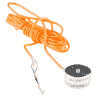](https://www.sparkfun.com/products/13331) 

将**添加到您的[购物车](https://www.sparkfun.com/cart)中！**

### [称重传感器- 50kg，圆盘(TAS606)](https://www.sparkfun.com/products/13331)

[In stock](https://learn.sparkfun.com/static/bubbles/ "in stock") SEN-13331

这种单盘测压元件(有时称为应变仪)可以将高达 50 公斤的压力(力)转化为电…

$64.502[Favorited Favorite](# "Add to favorites") 5[Wish List](# "Add to wish list")****[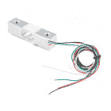](https://www.sparkfun.com/products/14729) 

将**添加到您的[购物车](https://www.sparkfun.com/cart)中！**

### [称重传感器- 5kg，直杆(TAL220B)](https://www.sparkfun.com/products/14729)

[In stock](https://learn.sparkfun.com/static/bubbles/ "in stock") SEN-14729

这种直杆测压元件(有时称为应变仪)可以将高达 5 公斤的压力(力)转化为电…

$11.951[Favorited Favorite](# "Add to favorites") 7[Wish List](# "Add to wish list")************** ************大多数应变式称重传感器的工作方式非常相似，但尺寸、材料和机械设置可能会有所不同，这可能会导致每个传感器具有不同的最大负载和灵敏度。对于一些可能的称重传感器机械设置，请查看带有[称重传感器设置](https://learn.sparkfun.com/tutorials/load-cell-amplifier-hx711-breakout-hookup-guide#load-cell-setup)的连接指南。

| [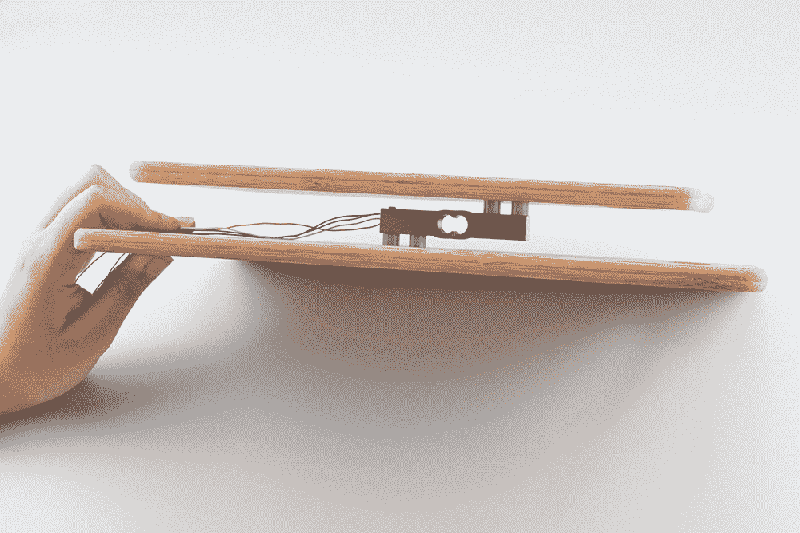](https://learn.sparkfun.com/tutorials/load-cell-amplifier-hx711-breakout-hookup-guide#load-cell-setup) |
| *[一种可能的称重传感器设置，带有杆式称重传感器](https://learn.sparkfun.com/tutorials/load-cell-amplifier-hx711-breakout-hookup-guide#load-cell-setup)* |

## 应变仪基础

应变仪是一种测量电阻变化的装置，电阻变化与施加在装置上的应变(或压力或力或任何你想称之为的东西)成正比。最常见的应变计由非常细的金属丝或箔片组成，以栅格模式设置，当在一个特定方向施加应变时，电阻会发生线性变化，最常见的基本电阻为 120ω、350ω和 1，000ω。

### 量规因数

每个应变仪对应变都有不同的灵敏度，定量表示为**应变仪因子(GF)** 。规格系数定义为电阻的分数变化与长度(应变)的分数变化之比。(金属应变计的应变系数通常约为 2。)

### 应变的微小变化

我们设置一个应变式称重传感器，测量电阻变化，一切正常，对吗？没那么快。应变测量很少涉及大于几毫应变 [")](http://www.codecogs.com/eqnedit.php?latex=(e&space;\cdot&space;10^{-3})) (应变的奇特单位，但仍然很小)的量。

让我们举个例子:假设你施加一个 500 ε的应变。应变计系数为 2 的应变计的电阻变化仅为:

[ = 0.1%")](http://www.codecogs.com/eqnedit.php?latex=2&space;*&space;(500&space;*&space;10^-^6)&space;=&space;0.1%)

对于 120ω的压力计，这只是 0.12ω的变化。0.12ω是一个非常小的变化，对于大多数器件来说，实际上无法检测到，更不用说精确检测了。因此，我们需要另一种设备，既可以精确测量电阻的超小变化(剧透:它们非常昂贵)，也可以将电阻的微小变化转化为我们可以精确测量的东西。

### 放大器和惠斯通电桥

这就是放大器派上用场的地方，如 [HX711](https://www.sparkfun.com/products/13879) 或 [NAU7802](https://www.sparkfun.com/products/15242) 。

[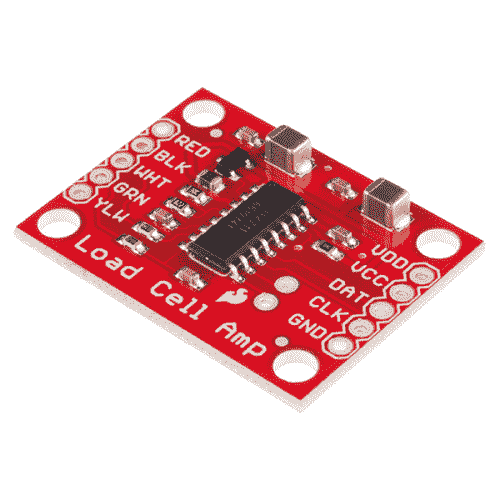](https://www.sparkfun.com/products/13879) 

将**添加到您的[购物车](https://www.sparkfun.com/cart)中！**

### [SparkFun 称重传感器放大器- HX711](https://www.sparkfun.com/products/13879)

[In stock](https://learn.sparkfun.com/static/bubbles/ "in stock") SEN-13879

SparkFun 称重传感器放大器是 HX711 IC 的小型分线板，可让您轻松读取称重传感器以进行测量

$10.9541[Favorited Favorite](# "Add to favorites") 48[Wish List](# "Add to wish list")****[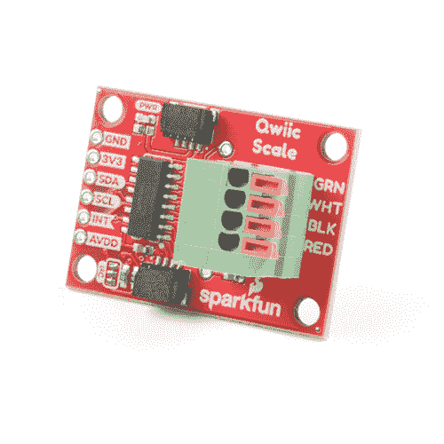](https://www.sparkfun.com/products/15242) 

将**添加到您的[购物车](https://www.sparkfun.com/cart)中！**

### [kickfunk qwiic 量表-精确 02](https://www.sparkfun.com/products/15242)

[In stock](https://learn.sparkfun.com/static/bubbles/ "in stock") SEN-15242

SparkFun Qwiic Scale - NAU7802 是 NAU7802 的一个小型分线板，可以让您轻松读取称重传感器来测量

$16.508[Favorited Favorite](# "Add to favorites") 37[Wish List](# "Add to wish list")**** ****将电阻的微小变化转化为更可测量的东西的一个好方法是使用[惠斯通电桥](http://en.wikipedia.org/wiki/Wheatstone_bridge)。惠斯通电桥由四个电阻构成，已知电压如下:

[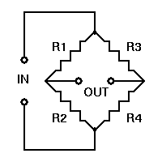](https://cdn.sparkfun.com/assets/learn_tutorials/3/8/2/wheatstone_bridge.gif)

其中 Vin 是已知的恒定电压，并测量由此产生的 Vout。如果 [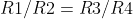](http://www.codecogs.com/eqnedit.php?latex=R1/R2&space;=&space;R3/R4) ，则 Vout 为 0，但如果其中一个电阻的值发生变化，则 Vout 将会发生变化，该变化可以测量，并由以下使用欧姆定律的公式决定:

[ - R1/(R1+R2)]\times V_{in}")](https://editor.codecogs.com/)***or***[ - R4/(R3+R4)]\times V_{in}")](https://editor.codecogs.com/)

通过用应变计取代惠斯通电桥中的一个电阻，我们可以轻松测量 Vout 的变化，并利用它来评估所施加的力。

[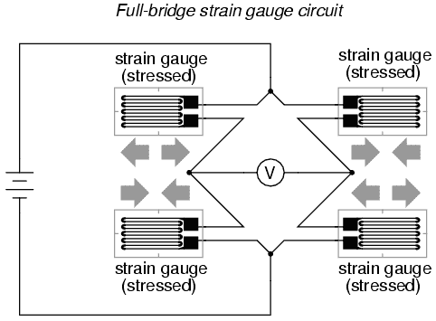](https://cdn.sparkfun.com/assets/learn_tutorials/3/8/2/00431.png)*Bar load cell wheatstone bridge example From [All About Circuits](http://www.allaboutcircuits.com/textbook/direct-current/chpt-9/strain-gauges/)*

## 组合器基础

但是，如果没有带四个应变仪的称重传感器，会发生什么情况呢？或者你想测量一些非常重的东西？您可以使用[负荷传感器组合器分线板](https://www.sparkfun.com/products/13878)组合四个单应变仪负荷传感器(有时称为[负荷传感器](https://www.sparkfun.com/products/10245))!

[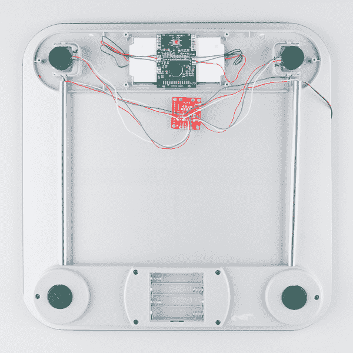](https://cdn.sparkfun.com/assets/learn_tutorials/3/8/3/HX711_and_Combinator_board_hook_up_guide-09.jpg)*Bathroom scale using the [Load Sensor Combinator](https://www.sparkfun.com/products/13281) to combine twelve wires into one wheatstone bridge*

利用相同的惠斯通电桥原理，您可以使用组合器将单个应变式称重传感器组合成惠斯通电桥配置，其中施加于所有四个单个应变式称重传感器的力相加，以提供更高的最大负载，并且比一个传感器的精度更高。组合器可以连接到同一个放大器上，以便于测量。

[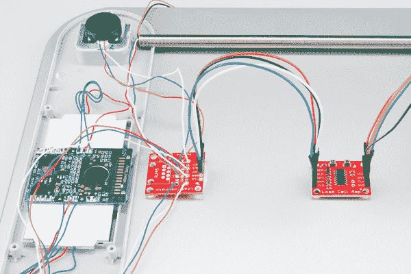](https://cdn.sparkfun.com/assets/learn_tutorials/3/8/3/HX711_and_Combinator_board_hook_up_guide-11.jpg)*Load cells connected to combinator and HX711 amplifier*

这与你在家中的秤中看到的布局是一样的。将会有四个单应变仪测压元件连接到一个[组合器](https://www.sparkfun.com/products/13281)和一个[放大器](https://www.sparkfun.com/products/13230)来给你你的重量读数。关于用组合器设置四个单应变仪的更多信息，请查看 HX711 的[组合器的硬件连接。这种设置也可以用于 NAU7802。](https://learn.sparkfun.com/tutorials/load-cell-amplifier-hx711-breakout-hookup-guide#combinator)

| [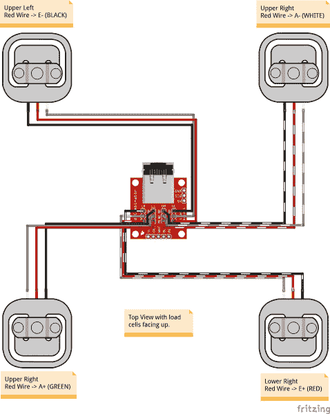](https://learn.sparkfun.com/tutorials/load-cell-amplifier-hx711-breakout-hookup-guide#combinator) |
| *[用组合器](https://learn.sparkfun.com/tutorials/load-cell-amplifier-hx711-breakout-hookup-guide#combinator)* 将四个单应变片排列成一个惠斯通电桥 |

## 资源和更进一步

有关称重传感器的更多信息，请查看以下资源:

*   数据表
    *   [50 公斤和 200 公斤，盘式/按钮式(TAS606) (JPG)](https://cdn.sparkfun.com/assets/learn_tutorials/3/8/2/Datasheet_SEN-13331_50kg_13332_200kgDisk_TAS606_.jpg)
    *   [200kg，S 型(TAS501) (PDF)](https://cdn.sparkfun.com/assets/parts/1/2/2/3/8/TAS501.pdf)
    *   [10kg，直杆(TAL220) (PDF)](https://cdn.sparkfun.com/datasheets/Sensors/ForceFlex/TAL220M4M5Update.pdf)
    *   [5kg，直杆(TAL220B) (PDF)](https://cdn.sparkfun.com/assets/e/5/f/5/6/TAL220B.pdf)
    *   [微型称重传感器-500 克，直杆(TAL221) (PDF)](https://cdn.sparkfun.com/assets/9/9/a/f/3/TAL221.pdf)
    *   [微型称重传感器-100 克，直杆(TAL221) (PDF)](https://cdn.sparkfun.com/assets/9/9/a/f/3/TAL221.pdf)

有关设置称重传感器以及如何将其集成到您的下一个项目中的更多信息，请查看我们的 HX711 连接指南:

 [### 称重传感器放大器 HX711 分线点连接指南

#### 2016 年 7 月 22 日](https://learn.sparkfun.com/tutorials/load-cell-amplifier-hx711-breakout-hookup-guide) A hookup guide for the HX711 load cell amplifier breakout board[Favorited Favorite](# "Add to favorites") 7 [### Qwiic 秤连接指南

#### 2019 年 4 月 11 日](https://learn.sparkfun.com/tutorials/qwiic-scale-hookup-guide) Create your own digital scale quickly and easily using the Qwiic Scale 4

您可能也有兴趣通过以下教程了解 OpenScale 或将称重传感器连接到云端！

 [### OpenScale 应用和连接指南](https://learn.sparkfun.com/tutorials/openscale-applications-and-hookup-guide) OpenScale allows you to have a permanent scale for industrial and biological applications. Learn how to use the OpenScale board to read and configure load cells.[Favorited Favorite](# "Add to favorites") 7 [### 物联网产业规模](https://learn.sparkfun.com/tutorials/iot-industrial-scale) What does a baby elephant weigh? How much impact force does a jump have? Answer these questions and more by building your very own IoT industrial scale using the SparkFun OpenScale.[Favorited Favorite](# "Add to favorites") 9 [### 物联网重量记录秤](https://learn.sparkfun.com/tutorials/iot-weight-logging-scale) This tutorial will show you how to make a scale that logs your weight to a custom website on the Internet. The principles can be extrapolated to any type of data.[Favorited Favorite](# "Add to favorites") 8

要获得更多灵感，请查看 SparkFun 物联网蜂巢:

*   [蜜蜂网络:增加传感器监控蜂巢健康状况](http://makezine.com/projects/bees-sensors-monitor-hive-health)

并在 GitHub 上关注 OpenScale:

*   [蜜蜂互联网 GitHub 知识库](https://github.com/sparkfun/OpenScale)

需要更多吗？查看这篇[精彩文章](http://www.phidgets.com/docs/Load_Cell_Primer)惠斯通电桥和称重传感器类型。对称重传感器的工作原理还不够了解吗？查看[这篇文章](http://www.vishaypg.com/docs/11866/vpg-01.pdf)以获得更深入的信息。****************