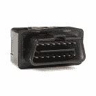
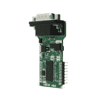
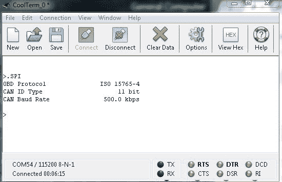

# OBD-II 入门

> 原文：<https://learn.sparkfun.com/tutorials/getting-started-with-obd-ii>

## 介绍

最终，在你进入嵌入式电子世界的旅途中，你会想要“黑”一辆车来获取数据。与许多其他集成系统一样，有一种特定的“语言”来与车辆交流。本教程将对*车载诊断(OBD)* 规范进行基本介绍，车辆和其他工业机器使用该规范与外界通信。

## 想亲身体验 OBD-II 吗？

我们掩护你！

 

将**添加到您的[购物车](https://www.sparkfun.com/cart)中！**

### [spark fun OBD-II UART](https://www.sparkfun.com/products/9555)

[In stock](https://learn.sparkfun.com/static/bubbles/ "in stock") WIG-09555

该板允许您与汽车的 OBD-II 总线接口。它提供了一个使用 ELM327 命令的串行接口…

$56.9512[Favorited Favorite](# "Add to favorites") 29[Wish List](# "Add to wish list")**** 

将**添加到您的[购物车](https://www.sparkfun.com/cart)中！**

### [OBD-II 连接器](https://www.sparkfun.com/products/9911)

[In stock](https://learn.sparkfun.com/static/bubbles/ "in stock") DEV-09911

OBD-II 提供对来自 ECU 的大量数据的访问，并在排除故障时提供有价值的信息来源

$1.603[Favorited Favorite](# "Add to favorites") 9[Wish List](# "Add to wish list")**** 

将**添加到您的[购物车](https://www.sparkfun.com/cart)中！**

### [Macchina A0 OBD-II 开发模块](https://www.sparkfun.com/products/17493)

[Out of stock](https://learn.sparkfun.com/static/bubbles/ "out of stock") DEV-17493

A0 使用 ESP32 BLE 和 WiFi 模块的功能，允许无线访问大多数现代汽车都有的 OBD-II 端口。…

$84.95[Favorited Favorite](# "Add to favorites") 12[Wish List](# "Add to wish list")**** 

将**添加到您的[购物车](https://www.sparkfun.com/cart)中！**

### [OBDII 点击](https://www.sparkfun.com/products/20207)

[Out of stock](https://learn.sparkfun.com/static/bubbles/ "out of stock") DEV-20207

OBDII 点击提供了一个独特的机会，进入汽车诊断系统。

$48.95[Favorited Favorite](# "Add to favorites") 0[Wish List](# "Add to wish list")******************Warning!** Modifying your OBD-II system to a non-certified state is considered a [**Federal Offense**](http://www.epa.gov/obd/questions.htm#9). The information provided is only intended for reading from the OBD-II spec. Hack at your own risk!

### 定义

那么到底是什么样的*OBD 规范，我们为什么要关心呢？根据 T2 环保局的网站:*

> 车载诊断或“OBD”是一种基于计算机的系统，根据 1990 年清洁空气法案修正案的要求，内置于所有 1996 年及以后的轻型车辆和卡车中。OBD 系统设计用于监控发动机的一些主要部件的性能，包括那些负责控制排放的部件。

换句话说，OBD 是发动机控制单元(ECU)的语言，它被设计用来帮助对抗排放和发动机故障。

拯救地球是伟大的(向你们这些公民科学家大声喊出来！)，但这也意味着我们可以访问汽车的其他功能，并从这些部件上收集信息。学习如何使用这些协议也意味着你可以确定仪表板上的**故障指示灯(MIL)** (也称为检查发动机灯)在告诉你发动机有问题时指的是什么。如果你或你的机械师曾经在你的车上读过**DTC(故障诊断码)**，他们正在使用 OBD-II。

不幸的是，实际的协议本身并不公开(如果他们能开源就好了！)，但我们已经尝试尽可能地收集和澄清。

### 硬件

法律要求从 1996 年或以后生产的任何车辆都要有 OBD-II 计算机系统。您可以通过**数据链路连接器(DLC)** 进入该系统。这是一个 16 针连接器，它可以告诉你你的汽车与哪种协议进行通信，这取决于其中安装了哪些针。

*Data Link Connector in a 1998 Jeep Cherokee, with the pins labeled.*

在汽车中，它将位于仪表板下，靠近驾驶座，或烟灰缸附近——从驾驶座无需使用工具即可轻松触及的地方(即，您不需要螺丝刀来取下面板)。

## 术语

在我们走得更远之前，让我们确保理解这些协议中使用的所有关键字。

### 发动机/电子控制单元(ECU)

ECU 可以指单个模块或模块的集合。这些是车辆的大脑。他们监视和控制汽车的许多功能。这些可以是制造商提供的标准配置，可重新编程，或者能够以菊花链形式实现多种功能。ECU 上的调谐功能允许用户使发动机在不同的性能水平和不同的经济水平下运行。在新车上，这些都是典型的微控制器。

一些比较常见的 ECU 类型包括:

*   **发动机控制模块(ECM)** -控制发动机的执行器，影响点火正时、空燃比和怠速等。
*   **车辆控制模块(VCM)** -控制发动机和车辆性能的另一个模块名称。
*   **变速器控制模块(TCM)** -该模块处理变速器，包括变速器油液温度、节气门位置和车轮速度等项目。
*   **动力系统控制模块(PCM)** -通常是发动机控制模块和变速器控制模块的组合。这控制着你的动力系统。
*   **电子制动控制模块(EBCM)** -控制并读取防抱死制动系统(ABS)的数据。
*   **车身控制模块(BCM)** -控制车身功能的模块，如电动车窗、电动座椅等。

### 故障诊断码(DTC)

这些代码用于描述车辆上出现问题的地方，并由 SAE 定义(您可以在此处找到完整的规格[以获取费用)。这些代码可以是通用的，也可以是车辆制造商独有的。](http://standards.sae.org/j2012_201303/)

这些代码采用以下格式:

XXXXX

*   第一个单元标识错误代码的类型:

    *   动力系统的 **P** xxxx
    *   **B** xxxx 为车身
    *   **C** xxxx 为底盘
    *   **U** xxxx 为二类网络

    *   第二位数字显示代码是否是制造商独有的:

    *   政府要求代码的 x **0** xxx

    *   制造商特定代码的 x **1** xxx

    *   第三个数字显示了故障代码所指的系统:

    *   xx **1** xx/xx **2** xx 显示空气和燃油测量值

    *   xx **3** xx 显示点火系统
    *   xx **4** xx 显示排放系统
    *   xx **5** xx 参考速度/怠速控制
    *   xx 处理计算机系统
    *   xx **7** xx/xx **8** xx 涉及变速器
    *   xx **9** xx 表示输入/输出信号和控制

    *   数字 4 和 5 显示具体的故障代码。

    *   xxx **00** 到 XXX**99**——这些都是基于第三个数字中定义的系统。

你可以在这里和这里找到一些不完整的故障诊断码列表[。](http://www.dmv.de.gov/services/Vehicle_Services/dtc_list.pdf)

### 参数识别(PID)

这些是你可以从 OBD-II 系统中获取的实际信息。PID 是您可能感兴趣的不同参数的定义。这些数字类似于故障诊断码中的第三个数字。

并非所有协议都支持所有 PID，每个制造商可能有几个唯一的自定义 PID。不幸的是，这些通常也不公开发布，所以您可能需要做大量搜索和/或逆向工程来确定每个 PID 与哪个系统相关。

有不同的模式可用，每种模式都有几个可用的 PID 选项。有关这方面的更多信息，请查看 [PID wiki 页面](https://en.wikipedia.org/wiki/OBD-II_PIDs)。

### 故障指示灯(MIL)

MIL 是仪表板上可怕小灯，表示汽车有问题。有一些变化，但它们都表明 OBD-II 协议发现了一个错误。

*["Check-Engine-Light" by IFCAR - Own work. Licensed under Public Domain via Commons](https://commons.wikimedia.org/wiki/File:Check-Engine-Light.jpg#/media/File:Check-Engine-Light.jpg)*

你可能在仪表盘上找到的另一个选项包括:

*"Motorkontrollleuchte" by Benutzer:chris828 - Own work by the original uploader. Licensed under [Public Domain via Commons](https://commons.wikimedia.org/wiki/File:Motorkontrollleuchte.svg#/media/File:Motorkontrollleuchte.svg)*

不管是哪一个，这些通常都不是很好看的光，除非你想黑客！

## OBD-II 协议

OBD-II 规范下有五种不同的通信协议。像许多事情一样，制造商往往有他们的偏好，认为他们的协议是最好的，因此有了变化。下面是对每一个的快速概述和对每一个的 DLC 上使用的引脚的描述。

### SAE J1850 脉宽调制

这个信号就是[脉宽调制](https://learn.sparkfun.com/tutorials/pulse-width-modulation)，运行速度为 41.6 kbps。该协议通常用于福特汽车。

**SAE J1850 PWM**

| 特征 | 描述 |
| 总线+ | 引脚 2 |
| 巴士- | 第 10 针 |
| 12V | 第 16 针 |
| GND | 针脚 4、5 |
| 总线状态: | 当 BUS +被拉高，BUS -被拉低时有效 |
| 最大信号电压: | 5V |
| 最小信号电压: | 0V |
| 字节数: | Twelve |
| 位时序: | “1”位- 8uS，“0”位- 16uS，帧开始- 48uS |

### VPW 汽车工程师学会 J1850

该协议是可变脉冲宽度的，运行速度为 10.4 kbps。通用汽车通常使用这个版本。

**SAE J1850 VPW**

| 特征 | 描述 |
| 总线+ | 引脚 2 |
| 12V | 第 16 针 |
| GND | 针脚 4、5 |
| 总线状态: | 总线空闲低 |
| 最大信号电压: | +7V |
| 决策信号电压: | +3.5V |
| 最小信号电压: | 0V |
| 字节数: | Twelve |
| 位时序: | “1”位高 64uS，“0”位高 128uS，帧高开始 200uS |

### ISO 9141-2

如果你有一辆克莱斯勒、欧洲或亚洲汽车，这是你的协议。它以 10.4 kbps 的速率运行，并且是异步串行通信。

**ISO 9141-2**

| 特征 | 描述 |
| k 线(双向) | 引脚 7 |
| l 线(单向，可选) | 第 15 针 |
| 12V | 第 16 针 |
| GND | 针脚 4、5 |
| 总线状态: | k 线闲置高位。驱动至低电平时，总线有效。 |
| 最大信号电压: | +12V |
| 最小信号电压: | 0V |
| 字节数: | 消息:260，数据:255 |
| 位时序: | UART: 10400bps，8 路 N-1 |

### ISO 14230 KWP2000

这是关键字 Protocol 2000，另一种异步串行通信方法，也可以高达 10.4 kbps 的速度运行。这也用于克莱斯勒、欧洲或亚洲的车辆。

**ISO 14230 KWP2000**

| 特征 | 描述 |
| k 线(双向) | 引脚 7 |
| l 线(单向，可选) | 第 15 针 |
| 12V | 第 16 针 |
| GND | 针脚 4、5 |
| 总线状态: | 拉低时有效。 |
| 最大信号电压: | +12V |
| 最小信号电压: | 0V |
| 字节数: | 数据:255 |
| 位时序: | UART: 10400bps，8 路 N-1 |

### ISO 15765 可以

从 2008 年起，在美国销售的所有车辆都必须遵守该协议。然而，如果你有一辆 2003 年或以后的欧洲车，这辆车可能有 CAN。这是一种双线通信方法，运行速度最高可达 1Mbps。

**ISO 15765 CAN**

| 特征 | 描述 |
| CAN 高电平(CAN 高电平) | 针脚 6 |
| CAN 低电平(CAN L) | 第 14 针 |
| 12V | 第 16 针 |
| GND | 针脚 4、5 |
| 总线状态: | 当 CANH 拉高时有效，CANL 拉低。信号浮动时空闲。 |
| CANH 信号电压: | +3.5V |
| CANL 信号电压: | +1.5V |
| 最大信号电压: | CANH = +4.5V，加拿大= +2.25V |
| 最小信号电压: | CANH =+2.75 伏，加拿大=+0.5 伏 |
| 字节数: | L |
| 位时序: | 250 千比特/秒或 500 千比特/秒 |

## 使用模拟器

虽然这些协议非常适合从您的车辆上收集数据，但在制作原型时，不得不坐在计算机、各种电子设备和遍布您汽车前部的电缆旁边，这可能是一种真正的痛苦。幸运的是，有许多模拟器允许 OBD-II 系统的基本原型和测试。

我们这里有一些不同的模拟器，对使用这些协议很有用。如果/当我们得到任何额外的信息时，我们将更新这一部分。

## ECUsim 2000

这个 ECU 模拟器是由 [ScanTool](https://www.scantool.net/) 的可爱的人们设计和制造的。你可以在他们的产品页面[这里](https://www.scantool.net/dev-tools/ecusim-family/ecusim-2000.html)查看所有产品信息。

要开始使用该模拟器，您必须进行以下连接:

1.  将 USB 电缆插入模拟器和计算机。安装必要的驱动程序。
2.  将 OBD-II 电缆插入模拟器。
3.  使用所提供的 12V 电源给模拟器供电。
4.  在`115200 bps, 8,N,1`打开一个[串口终端](https://learn.sparkfun.com/tutorials/terminal-basics)，连接模拟器配置的串口。
5.  将模拟器配置为您想要测试的协议。
6.  连接你的 ECU 设备(OBD-II 板，CAN-Bus 盾，Raspberry Pi 等。)

现在，您可以通过验证总线上传输的数据是您的 ECU 读取器接收的数据来利用模拟器的功能，反之亦然。

几个不同的编程选项可用于配置模拟器。查看[编程手册](https://cdn.sparkfun.com/assets/learn_tutorials/4/1/5/ecusim-programmingmanual2015.pdf)了解更多信息。我们目前拥有的版本具有与几种不同的 OBD-II 协议兼容的固件，这将根据您订购的内容而有所不同。

编程手册还包括所有可用于模拟器的命令。

例如，如果我们需要确定我们的模拟器当前设置为什么协议，我们将使用`SPI`命令。在我们的终端中，它看起来像下面这样:

*Reading ECUsim 2000 protocol settings.*

这表明模拟器当前设置为 ISO 15765-4 协议(又名 CAN)，具有 11 位 ID 类型，并以 500 kbps 的速度运行。

如果您随后需要将数据从模拟器发送到一个设备，如 [SparkFun OBD-II UART 板](https://www.sparkfun.com/products/9555)或 [CAN-Bus Shield](https://www.sparkfun.com/products/10039) 进行测试，您可以使用传输命令`SOMT <header>, <data>`。例如，如果我们想发送发动机燃油压力为 100 千帕的命令，我们将发送`SOMT`，后跟燃油压力的参数 ID (PID)，即`0A`，在这种情况下，后跟十六进制值 100 ( `64`)。

*Transmitting fuel pressure via the ECUsim 2000.*

如果我们最初让连接悬空(忘记拧紧 DB9 连接器上的锚定螺钉)以模拟连接问题，我们会在第一次发送命令时收到`CAN ERROR`消息。在这个模拟器上，这意味着模拟器和我们的 CAN 读取器之间有问题。然而，一旦我们修复了连接，模拟器就能够发送数据，并准确地告诉我们它传输了什么。相当整洁！

## 资源和更进一步

### 更进一步

现在，您已经对 OBD-II 协议以及如何使用各种可用的通信工具有了基本的了解，是时候创建自己的项目了！

如果您有任何反馈，请访问[评论](https://learn.sparkfun.com/tutorials/getting-started-with-obd-ii/discuss)或联系我们在 TechSupport@sparkfun.com[的技术支持团队](mailto:techsupport@sparkfun.com?subject=)。

### 额外资源

查看这些产品和项目，获取更多 OBD-II 灵感！

*   [OBD-II UART 板连接指南](https://learn.sparkfun.com/tutorials/obd-ii-uart-hookup-guide)
*   [CAN 总线屏蔽连接指南](https://learn.sparkfun.com/tutorials/can-bus-shield-hookup-guide)
*   [OBD-II 论坛](http://www.obdii.com/)
*   [环境保护署的 OBD 工厂](http://www.epa.gov/obd/)
*   [SAE 标准](http://standards.sae.org/j2012_201303/)
*   [国家 OBD 信息交换机构](http://obdclearinghouse.com/index.php?body=can)
*   [OBD 故障代码](http://www.obd-codes.com/trouble_codes/)
*   [解析 OBD-II 数据输出](https://theksmith.com/software/hack-vehicle-bus-cheap-easy-part-2/)
*   [免费诊断:车辆诊断套件](http://sourceforge.net/projects/freediag/)
*   [pyOBD:开源 OBD-II 诊断](http://www.obdtester.com/pyobd-download)
*   [基于 Windows 的诊断软件](http://www.ross-tech.com/vag-com/)
*   [OBD 诊断](http://pages.infinit.net/jsenk/obd.htm)********