# 地理围栏入门

> 原文：<https://learn.sparkfun.com/tutorials/getting-started-with-the-geofence>

## 介绍

**Experimental Products:** [SparkX products](https://www.sparkfun.com/sparkx) are rapidly produced to bring you the most cutting edge technology as it becomes available. These products are tested but come with no guarantees. Live technical support is not available for SparkX products.**The GeoFence App is no longer supported.** If you have a GeoFence device and would like to continue using it, you still have options! Check out the readme document in the [GeoFence GitHub Repo](https://github.com/sparkfunX/GeoFence). Otherwise, maybe read up on the capability of our [uBlox GPS boards](https://learn.sparkfun.com/tutorials/sparkfun-gps-breakout-zoe-m8q-and-sam-m8q-hookup-guide)!

地理围栏旨在让您轻松地将地理围栏功能添加到您的下一个项目中！如果你不熟悉地理围栏的概念，不要担心，让我们去谷歌上找定义:

> ...由 GPS 或 RFID 技术定义的虚拟地理边界，使软件能够在移动设备进入或离开特定区域时触发响应...

好的，基本上这是一个巨大的无形的边界，通过 GPS 技术来加强。这有什么了不起的？有些人用它们来追踪资产或管理车队。GPS 地理围栏是确保某个物品(或车辆)在正确的时间出现在正确的地点的好方法。但是地理围栏也有有趣和有创意的应用，比如米卡勒·哈特的反向地理缓存或者我们自己的罗伯特·考恩的 NCWP 拾荒者盒子。

由于地理围栏要求控制器根据位置表不断检查自己的位置，这可能会占用项目中的大量周期。为了解决这个问题，我们制作了这个专用板。

[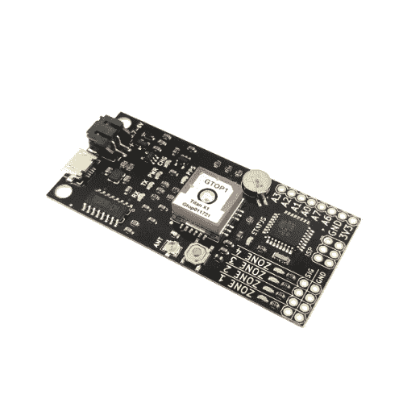](https://www.sparkfun.com/products/retired/14416) 

### [GeoFence - GPS 边界小工具](https://www.sparkfun.com/products/retired/14416)

[Retired](https://learn.sparkfun.com/static/bubbles/ "Retired") SPX-14416

地理围栏旨在让您轻松地将地理围栏功能添加到您的下一个项目中！如果你不熟悉…

**Retired**[Favorited Favorite](# "Add to favorites") 2[Wish List](# "Add to wish list")

只需使用软件定义您的地理围栏边界，当相应的边界被突破时，电路板将在四个区域状态引脚中的任何一个引脚上输出逻辑高信号！

本指南将帮助您开始使用地理围栏板和软件，以便您可以定义自己的 GPS 边界，并开始在未来的项目中使用地理围栏！

### 所需材料

要完成本教程，您需要以下物品:

*   [地理围栏- GPS 边界小工具](https://www.sparkfun.com/products/14416)
*   [USB micro-B 线缆](https://www.sparkfun.com/products/10215)
*   [锂离子电池](https://www.sparkfun.com/products/13813)
*   运行 64 位 Windows 的电脑

## 硬件概述

让我们熟悉一下地理围栏上的硬件。我们将它分为两类:连接器和 LED 指示灯。

### 连接器

[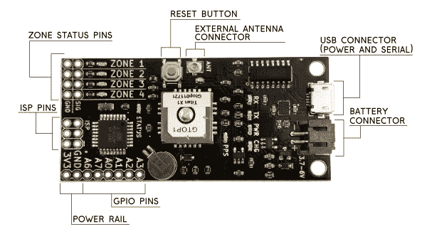](https://cdn.sparkfun.com/assets/learn_tutorials/6/9/0/geofence_hw_2.jpg)

#### 区域状态引脚

这些引脚分别对应于软件中的一个编号边界。标有 **SIG** 的一排引脚是信号引脚，旁边的一排是接地引脚。每当电路板在规定的区域之外时，该区域的引脚将保持逻辑**低**。只要电路板在规定区域的内*，该区域的引脚将保持逻辑**高**。* 

#### 复原按钮

该按钮与微控制器上的复位线相连，将重启电路板。

#### 外部天线连接器

泰坦 X1 GPS 模块有一个很好的内置天线，但如果你将这块板嵌入天线无法接收任何卫星的外壳中，你可以将一个 [3V 外部天线](https://www.sparkfun.com/products/464)连接到这个 U.FL 连接器(如果你需要，我们出售一个 [U.FL 到 SMA 电缆](https://www.sparkfun.com/products/9145))。如果有外置天线，GPS 模块将自动选择外置天线。

#### USB 连接器

Micro-B 连接器用于将分区配置加载到板上，并为连接的锂离子电池充电。由于板载 ATmega328 带有 Arduino 引导程序，您也可以使用此 USB 连接器将新固件推送到板上。加载新固件时选择 3.3V/8MHz 的 *Arduino Pro Mini* 。

#### 电池连接器

GeoFence 内置电池充电器和电压调节器，因此您可以在旅途中轻松为其供电。我们的任何一款[单节锂离子电池](https://www.sparkfun.com/categories/54)都可以工作，但我个人更喜欢 [1Ah 电池](https://www.sparkfun.com/products/13813)，因为它和主板差不多大。

#### GPIO 引脚

这些是从 ATmega328P 中取出的多余引脚，如果你编写自己的固件，可以使用这些引脚。地理围栏的生产固件使用 **A0** 引脚作为系统状态引脚，当系统具有有效锁定时，该引脚变为逻辑**高电平**。此引脚使外部系统能够知道区域状态引脚是否显示最新信息。

#### 电源轨

这里的 3V3 和 GND 连接允许电路板由外部调节的 3.3V 电源供电。因为此引脚直接连接到板上的 3.3V 供电轨，所以每当连接电池或板插入 USB 电源时，它也会提供 3.3V 电源。

### LED 指示灯

[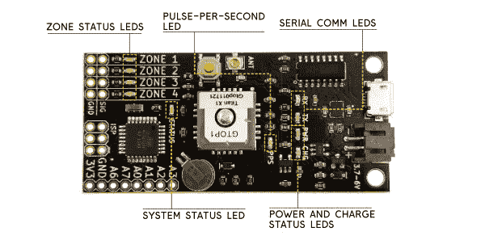](https://cdn.sparkfun.com/assets/learn_tutorials/6/9/0/geofence_leds_1.jpg)

#### 区域状态指示灯

这些 led 反映了区域状态引脚的状态。它们对于测试来说很方便，因为你一眼就能看出电路板是否在特定的区域边界。

#### 每秒脉冲数 LED

该 LED 与 Titan X1 GPS 模块的 PPS(每秒脉冲数)输出相连。每秒钟，PPS 输出会在短时间内变为逻辑**高电平**。这个定时信号是一个很好的辅助指标，可以用来判断您的 GPS 模块是否正常工作。

#### 串行通信指示灯

这些灯与大多数 Arduino 板上的灯一样。它们连接到 USB 串行桥和 ATmega328 之间的串行通信线上。它们相对于微控制器进行标记，因此当电路板接收数据时 RX 灯闪烁，当电路板发送数据时 TX 灯闪烁。

#### 电源和充电状态指示灯

只要主板通电， **PWR** LED 就会一直亮起。 *CHG* LED 表示锂离子电池的充电状态，如果连接了一个的话。如果没有连接电池，该 LED 将熄灭。如果连接了电池，只要电池在充电，LED 就会一直亮着。当电池充满时，LED 将再次熄灭，表示充电完成。

#### 系统状态指示灯

该 LED 将显示三种系统状态警报之一。如果 LED 闪烁，则电路板正在运行，但 GPS 模块正在等待锁定。如果 LED 一直亮着，则 GPS 锁定，有效数据正在进入，电路板正在检查区域。如果状态 LED 保持关闭，则没有区域被编程到板上，也不会执行区域测试。

## 软件概述

地理围栏软件是使用[电子](https://electron.atom.io/)框架构建和分发的。我们已经为 Windows 64 位系统创建了一个可执行安装程序，因此出于本指南的目的，我们假设您正在运行 Windows。在本节的最后，我将简要讨论如何让 GeoFence 在不同的环境中运行。

在进入用户界面之前，让我们下载并安装软件。首先，您需要下载可执行的安装程序:

[Download GeoFence Installer 0.1.2](https://github.com/sparkfunX/GeoFence/raw/master/Software/Bin/GeoFence%20Setup%200.1.2.exe)

当您启动安装程序时，它会询问您是否确定要安装 GeoFence。单击“是”安装软件，该软件将在完成后立即自动启动。现在，您应该会看到类似这样的内容:

[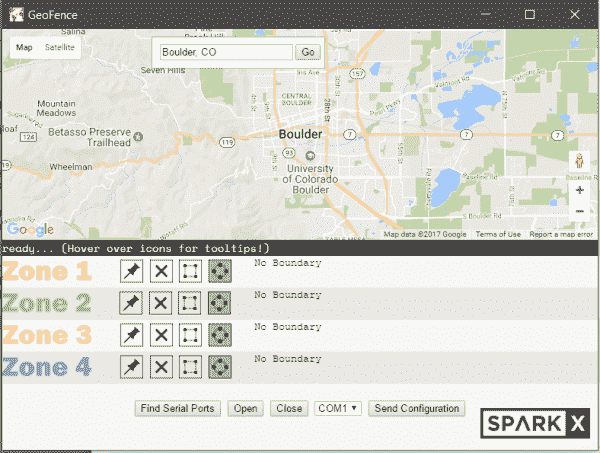](https://cdn.sparkfun.com/assets/learn_tutorials/6/9/0/Geoscrot1.PNG)

如您所见，GeoFence 利用 Google Maps API 来简化地理区域的选择。如果您看不到地图，您可能没有接入互联网。**geo fence 软件需要活跃的互联网连接**，以便从谷歌地图 API 中检索地图。默认情况下，它将从科罗拉多州的博尔德市开始，但是您可以在顶部的搜索栏中键入任何位置来到达该位置。

软件中有四个区域与板上的四个区域相对应。每个区域都有颜色编码，以便在地图上容易区分边界。在下一节中，我们将介绍如何创建区域边界并将其加载到地理围栏板上，但现在，我们只讨论用户界面:

[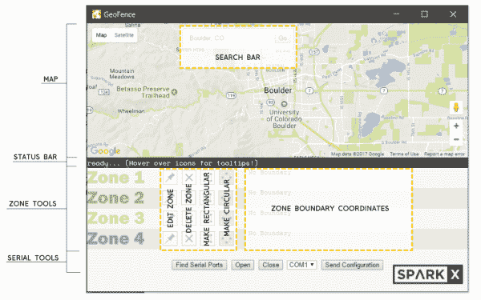](https://cdn.sparkfun.com/assets/learn_tutorials/6/9/0/geofence_soft_ui.png)

#### 地图

在地图上，您可以绘制所有的区域边界。它是由谷歌地图驱动的，所以它应该总是准确和最新的。

#### 搜索栏

如果您想要跳转到地图上的某个位置，您可以使用搜索栏到达该位置。键入邮政编码、城市名称甚至企业名称，然后按“Go”即可跳转到该位置。跳跃时不会调整地图的缩放级别，因此您可能需要放大地图才能找到目的地。

#### 状态栏

这是应用程序通知你正在发生什么的地方。

#### 区域工具

区域工具是您定义区域边界的方式。共有四个区域，每个区域有四种功能:

*   **编辑区域** -按下此按钮将相应的区域置于编辑模式。在编辑模式下，区域的边界将用可拖动锚点标记，以更改其大小和位置。单击地图将擦除当前边界，并在单击的位置放置一个新边界。
*   **删除区域** -该按钮将从地图上完全删除相应的区域。
*   **制作矩形** -该按钮将使当前区域成为矩形。
*   **循环** -该按钮将使当前区域循环。

#### 区域边界坐标

每当您在地图上创建区域边界时，该边界的坐标将显示在此处。这是将被发送到董事会的数据。

#### 系列工具

这些控件都是用来操作串口的。从这里，您可以扫描活动串行端口、打开连接、关闭连接，并将您的区域定义推送到地理围栏硬件。

### 在 Mac、Linux 等平台上运行 GeoFence。

因为 GeoFence 软件本质上像网页一样编写，并使用 Node.js 模块与计算机的串行端口进行交互，所以它完全是跨平台兼容的。为了从源代码运行 GeoFence，你只需要为 node 安装 [node.js](https://nodejs.org/en/) 、 [Electron](https://electron.atom.io/) 和 [serialport 包](https://www.npmjs.com/package/serialport)。一旦这些东西都安装好了，打开一个终端，导航到你下载了 [GeoFence 源代码](https://github.com/sparkfunX/GeoFence/tree/master/Software/Source)的文件夹，然后运行“电子”

如果您发现串行端口无法正常工作，您可能需要使用此处找到的[中的说明重新安装它，或者重建串行端口模块以使其在您的系统上正常工作。我们用于为 Windows 机器打包应用程序的实用程序也将为 Linux 和 OSX 生成包，因此，如果您有使用](http://meow.noopkat.com/using-node-serialport-in-an-electron-app/)[电子生成器](https://www.npmjs.com/package/electron-builder)的经验，并且已经在其中一种环境下成功测试了串行模块，请随时为您的平台构建一个可执行文件，并向我们发送一个 pull 请求！

## 配置区域

现在，让我们定义第一组区域，并将它们发送到我们的地理围栏硬件！首先，启动 GeoFence 应用程序，您应该会看到类似这样的内容:

让我们在 SparkFun 总部周围划分一些区域。我将在搜索栏中键入“SparkFun Electronics”，然后单击“Go”。放大一点后(使用鼠标滚轮或地图右下角的缩放控件)，你应该会看到 SparkFun 总部。

[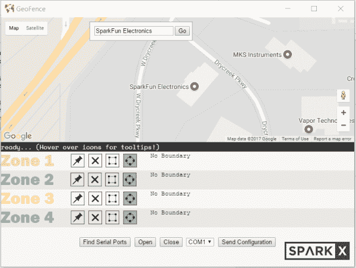](https://cdn.sparkfun.com/assets/learn_tutorials/6/9/0/Geoscrot2.PNG)

现在是时候定义 1 区了。首先，我们将通过单击区域 1 标签旁边的图钉按钮将区域置于编辑模式。您应该注意到，其他区域是灰色的，表示您正在编辑区域 1。

[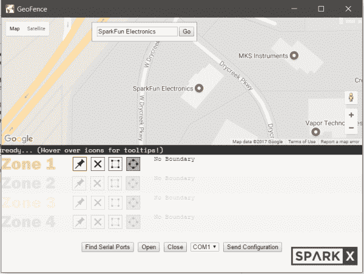](https://cdn.sparkfun.com/assets/learn_tutorials/6/9/0/Geoscrot3.PNG)

现在试着点击地图上的某个地方...你应该创建一个圆形区域！请注意，圆圈的颜色与区域标签的颜色相同，这是您区分区域的方式。接下来，试着沿着圆的外侧抓住锚点，拖动它们使圆变大或变小。如果您想要更改圆的位置，同时保持其大小，您可以通过中心锚点拖动它。如果你想删除这个圆圈并放置一个新的，只需点击地图上的任何地方，一个新的圆圈将被放置在你点击的地方。请注意，当您移动圆时，区域坐标表中的坐标会发生变化。

[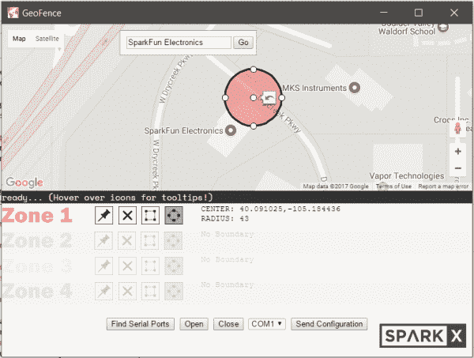](https://cdn.sparkfun.com/assets/learn_tutorials/6/9/0/Geoscrot4.PNG)

现在我们已经完成了对区域 1 的编辑，再次点按区域编辑按钮以退出编辑模式。你的 1 区圆圈上的锚将消失，其他区域将重新出现在视野中。让我们选择另一个区域，这次画一个矩形。点击区域 3 旁边的区域编辑按钮。现在，因为我们想使这个区域矩形，单击矩形按钮。现在，单击地图上的任意位置，创建一个矩形区域边界。您可以像以前编辑圆一样编辑这个矩形。如果您将矩形的一个角从前面拖到圆形边界，您会注意到区域可以重叠。因为 GeoFence 会单独检查每个区域，所以重叠和嵌套区域完全没问题！

[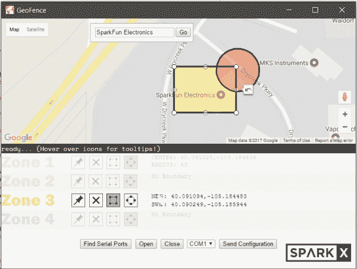](https://cdn.sparkfun.com/assets/learn_tutorials/6/9/0/Geoscrot6.PNG)

现在再次按下编辑区域按钮退出编辑模式。让我们将这些区域边界发送到公告板！使用 USB micro-B 电缆将 GeoFence 板连接到您的计算机。如果这是您第一次连接此板，您可能需要给它几秒钟来配置。现在，按“查找串行端口”按钮，用所有活动的串行端口填充下拉列表。

[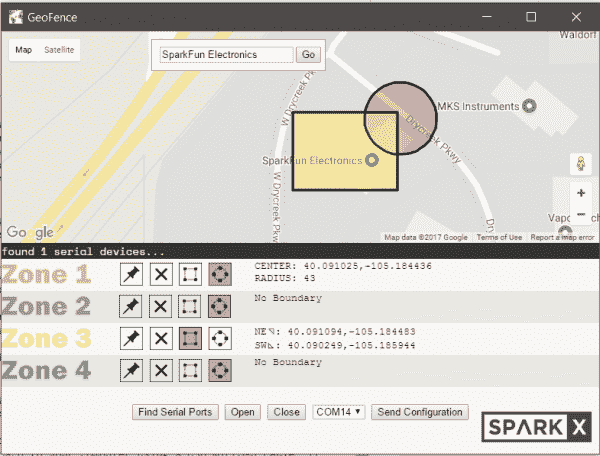](https://cdn.sparkfun.com/assets/learn_tutorials/6/9/0/Geoscrot7.PNG)

状态栏会告诉你找到了多少个串行设备。现在从下拉列表中选择您的电路板。如你所见，我的是唯一连接的设备，所以我知道它在 COM14 上。按“打开”打开串口。这将导致设备重置，因此您需要等待片刻，然后再按“发送配置”。作为预防措施，在您按下“打开”按钮后，“发送配置”按钮会被禁用几秒钟。现在，您可以按“发送配置”,如果配置成功，几秒钟后状态栏会显示“发送配置”。您可能还会注意到硬件上的区域 led 按顺序闪烁。恭喜你！你刚刚设置了地理围栏！

[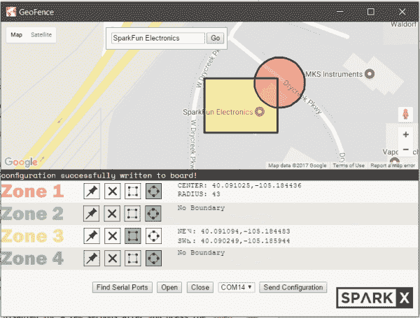](https://cdn.sparkfun.com/assets/learn_tutorials/6/9/0/Geoscrot8.PNG)

现在，在你自己的社区建立一些区域，带着你的地理围栏板去散步。连接一个锂离子电池，四处走动，寻找你的区域边界的边缘。区域精确到大约 3 米，所以如果你需要的话，它们可以非常小，并且放置得非常精确。以下是我的主板和我们刚刚创建的配置的一些照片:

[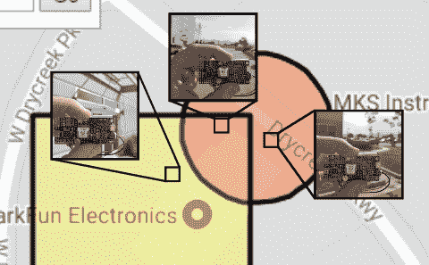](https://cdn.sparkfun.com/assets/learn_tutorials/6/9/0/geotour.png)

## 解决纷争

以下是使用地理围栏时可能会遇到的一些常见问题。

#### “我不知道我的 GeoFence 连接到哪个串行端口”

如果您的计算机上连接了许多串行设备，可能很难区分哪个是地理围栏硬件。最简单的方法就是拔掉 GeoFence，然后在 GeoFence 应用程序中点击“查找串行端口”。记下列出了哪些端口。现在连接你的硬件并再次点击“查找串行端口”。现在列表中应该有一个新端口对应于您的板。

#### “我按下了‘发送配置’,并在状态栏中得到一条错误消息，显示‘校验和失败’。再试一次..."

如果主板无法解析您从软件发送的配置，就会发生这种情况。在中止之前，板和软件将再尝试 4 次发送配置。如果五次尝试都失败，请尝试以下故障排除提示:

#### “我按了‘发送配置’，但没有任何反应”

首先，确保您已经点击了“打开”按钮，以打开到您的板的串行连接。按“关闭”,然后再次按“打开”,给电路板一点时间重置，然后再次尝试发送您的配置。如果它仍然不起作用，你可能需要重置板。关闭串行端口并按下地理围栏板上的重置按钮。现在，再次打开串行端口，给它一点时间来重置，并再次发送您的配置。它可能需要这样做几次才会起作用。成功后，状态栏会显示一条成功消息，板上的区域 led 会依次闪烁。

#### “我想在许多不同的板上放置相同的区域，我可以从 GeoFence 软件中保存区域配置吗？”

不幸的是，目前还没有任何功能允许您保存配置文件并在以后检索它。但是，如果您想要配置一堆相同的板，您可以简单地一个接一个地配置它们，方法是发送您的配置，关闭串行端口，连接下一个板，选择适当的串行端口，打开该串行端口，配置该板，然后重复该过程，直到所有板都配置完毕。

#### “我的地理围栏板似乎从来没有锁定过。状态 LED 一直闪烁，区域指示灯都不亮”

确保你的 GPS 模块有清晰的视野。GPS 在建筑物内、桥下或大型建筑物旁边工作不太好。如果您的主板在机箱内，您可能需要连接外部天线以获得良好的锁定。

## 资源和更进一步

### Moar 教程！

如果你有兴趣深入研究 GPS，请查看我们的一些 GPS 相关教程！

 [### 字母数字 GPS 挂钟](https://learn.sparkfun.com/tutorials/alphanumeric-gps-wall-clock) This is a GPS controlled clock - a clock you truly never have to set! Using GPS and some formulas, we figure out what day of the week and if we are in or out of daylight savings time.[Favorited Favorite](# "Add to favorites") 13 [### GPS 差分矢量指针](https://learn.sparkfun.com/tutorials/gps-differential-vector-pointer) Use GPS to have two objects, a base and a target, point towards one another. This can be used to aim a directional antenna (or in the case of this project, a laser) from one object to the other object at a distance that is only limited by your ability to provide the base station with the target's GPS location.[Favorited Favorite](# "Add to favorites") 10 [### 建造自主车辆:蝙蝠战车](https://learn.sparkfun.com/tutorials/building-an-autonomous-vehicle-the-batmobile) Documenting a six-month project to race autonomous Power Wheels at the SparkFun Autonomous Vehicle Competition (AVC) in 2016\.[Favorited Favorite](# "Add to favorites") 8