# LilyPad MP3 播放器入门

> 原文：<https://learn.sparkfun.com/tutorials/getting-started-with-the-lilypad-mp3-player>

## 介绍

LilyPad MP3 播放器是一个令人惊叹的小电路板，几乎包含了播放音频文件所需的一切。你只需要添加一个锂电池、扬声器和一个存有音频文件的微型 SD 卡。

[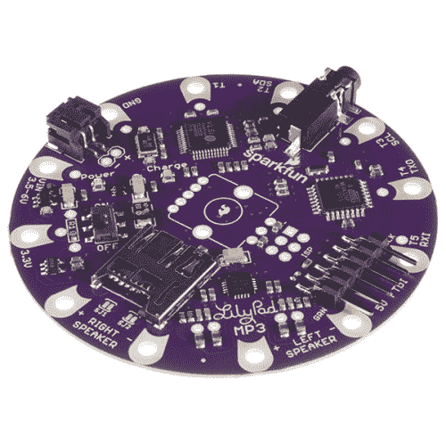](https://www.sparkfun.com/products/11013) 

将**添加到您的[购物车](https://www.sparkfun.com/cart)中！**

### [LilyPad MP3](https://www.sparkfun.com/products/11013)

[Out of stock](https://learn.sparkfun.com/static/bubbles/ "out of stock") DEV-11013

LilyPad MP3 播放器是您的一体化音频解决方案，包含兼容 Arduino 的微控制器、MP3(以及许多其他……

$56.505[Favorited Favorite](# "Add to favorites") 28[Wish List](# "Add to wish list")** **可以用 LilyPad MP3 播放器创作各种嘈杂的项目；你的想象力是唯一的极限！

[](https://cdn.sparkfun.com/assets/9/7/b/6/5/518a939dce395fce37000000.jpg)

在开始之前，您应该熟悉本教程将涉及的以下任何主题，如果您对它们还不熟悉的话。

*   [如何安装 Arduino 库](https://learn.sparkfun.com/tutorials/installing-an-arduino-library)
*   [电池技术](https://learn.sparkfun.com/tutorials/battery-technologies)
*   [用导电线缝制](https://learn.sparkfun.com/tutorials/sewing-with-conductive-thread)
*   [使用 GitHub](https://learn.sparkfun.com/tutorials/using-github)

## 了解 LilyPad MP3 播放器

[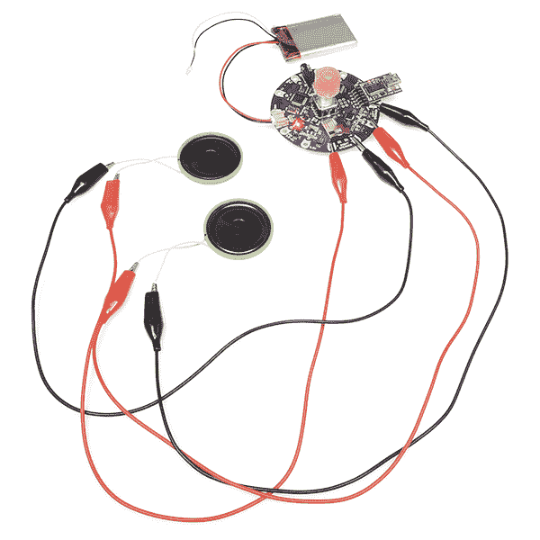](https://cdn.sparkfun.com/images/products/1/1/0/1/3/11013-01.jpg)

LilyPad MP3 播放器自带名为 [**【触发器】**](https://learn.sparkfun.com/tutorials/getting-started-with-the-lilypad-mp3-player/getting-started-with-the-default-trigger-sketch) 的预装软件，当输入引脚接地时会播放特定文件。您还可以添加一个可选的旋转编码器，并加载 [**【播放器】**](https://learn.sparkfun.com/tutorials/getting-started-with-the-lilypad-mp3-player/getting-started-with-the-player-sketch) 软件，将电路板变成一个“真正的”音频播放器，甚至[使用免费的 Arduino 编程环境编写自己的软件](https://learn.sparkfun.com/tutorials/getting-started-with-the-lilypad-mp3-player/writing-your-own-code)。

### LilyPad MP3 播放器剖析:

[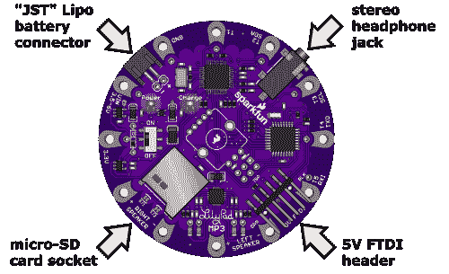](https://cdn.sparkfun.com/assets/a/d/2/5/b/51785c42ce395f7110000003.png)

让我们从连接器开始。通常情况下，您将使用单芯(3.7V) Lipo 电池为主板供电，该电池插入两针**“JST”电池连接器**。有一个**立体声耳机插孔**，如果需要，您可以使用它将电路板连接到一对耳机。连接耳机将禁用扬声器，但[如果你愿意，你可以改变这种行为。](https://learn.sparkfun.com/tutorials/getting-started-with-the-lilypad-mp3-player/hardware-details#headphonejumper)(如果您想将电路板连接到外部放大器，请参见此处的特殊说明[。](#externalamplifier))您可以将 5V FTDI 板或电缆插入 6 针 **5V FTDI 接头**，以便对连接的 Lipo 电池进行充电，并在需要时对板进行重新编程(参见[关于从 USB 为板供电的本注释](#ftdipower))。最后，还有一个 **micro-SD 卡插座**，您可以将包含您想要播放的音频文件的 micro-SD 存储卡插入其中。

[](https://cdn.sparkfun.com/assets/f/c/9/1/3/5178504fce395f1e10000000.png)

该板包含一个**电源开关**，用于打开和关闭该板。还有两个 LEDs 一个**红色电源 LED** ，当板卡通电时会亮起，一个**黄色充电 LED** 。电池充电时，充电指示灯会亮起，充满后会熄灭。(如果没有连接电池，充电指示灯亮起也是正常的。)您可以在主板打开或关闭时给电池充电，但如果主板关闭，电池充电速度会更快。

[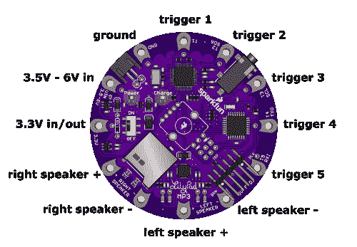](https://cdn.sparkfun.com/assets/4/b/c/b/9/517859dfce395f530e000001.png)

LilyPad MP3 播放器有**12 个“引脚”**(它们实际上是孔，但它们连接到微控制器上的引脚)，你可以用它们来连接外部世界。对于每个引脚，我们都提供了**【缝纫龙头】**(大孔，您可以将导电线绕在周围，以便在织物项目中使用)，以及标准**接头**(较小的孔，您可以焊接电线或[接头引脚](https://www.sparkfun.com/products/116)，如果您愿意)。

其中五个引脚被设置为**触发器**，您可以使用默认软件来触发特定音频文件的播放。(我们将在下一页[“使用默认触发草图”](https://learn.sparkfun.com/tutorials/getting-started-with-the-lilypad-mp3-player/getting-started-with-the-default-trigger-sketch)中了解更多信息。)通常，您会将触发器连接到开关，以激活各种音频文件的播放。许多触发器还具有替代功能，例如串行端口，您可以使用这些功能与更复杂项目中的其他设备进行通信。下表列出了替代功能。

您还将使用这些引脚连接外部**扬声器**。LilyPad MP3 播放器包括一个立体声(双声道，左声道和右声道)放大器，支持 4 到 8 欧姆之间的扬声器。每个扬声器有两个端子，分别标为“+”和“-”。通常情况下，您会将两个扬声器连接到板上，但如果您愿意，也可以只使用一个扬声器，或者串联或并联多个扬声器。除了扬声器或[传感器](https://www.sparkfun.com/search/results?term=surface+transducer&what=products)，不要将扬声器引脚连接到任何东西。

下面是引脚及其功能的表格:

| **引脚名称** | **功能** | **注释** |
| 车辆识别号码 | 原始电压输入(3.5V 至 6V) | 如果您不想连接 Lipo 电池，可以使用此引脚从外部电源为电路板供电。如果您还想为连接的 Lipo 电池充电，此输入应该在 4.5V 和 6V 之间。您可以点击了解更多关于主板供电选项的信息[。](https://learn.sparkfun.com/tutorials/getting-started-with-the-lilypad-mp3-player/hardware-details#power) |
| 3.3V | 稳压 3.3V 输入或输出 | 如果您已经有一个 3.3V 稳压电源，可以使用此引脚为电路板供电。(通过此引脚给电路板供电不会给电池充电。)如果其他地方需要，您也可以从该引脚获取 3.3V 电源。 |
| GND | 接地(0V) | 用作电源接地，也用作触发开关的返回侧(见图[此处](https://learn.sparkfun.com/tutorials/getting-started-with-the-lilypad-mp3-player/building-the-board-into-your-project))。 |
| 一种网络的名称(传输率可达 1.54mbps) | 触发器 1 | 通用 I/O 引脚(Arduino 引脚 A0)。你通常会通过一个开关连接到地面。也可以用作模拟输入。 |
| T2 | 触发器 2 / SDA | 通用 I/O 引脚(Arduino 引脚 A4)。你通常会通过一个开关连接到地面。也可以用作 I2C(“线”库)连接(包括 4.7K 上拉)中的 SDA(串行数据)，或者在上拉禁用时用作模拟输入。 |
| T3 | 触发器 3 / SCL | 通用 I/O 引脚(Arduino 引脚 A5)。你通常会通过一个开关连接到地面。也可以用作 I2C(“线”库)连接中的 SCL(串行时钟)(包括 4.7K 上拉)，或者如果上拉被禁用，则用作模拟输入[。](https://learn.sparkfun.com/tutorials/getting-started-with-the-lilypad-mp3-player/hardware-details#pullupdisable) |
| T4 | 触发器 4 / TX | 通用 I/O 引脚(Arduino 引脚 D1)。你通常会通过一个开关连接到地面。也可用作串行连接中的 TX(发射)。请勿永久拉低此引脚，否则重新编程和串行监控将被禁用。 |
| T5 | 触发器 5 /接收 | 通用 I/O 引脚(Arduino 引脚 D0)。你通常会通过一个开关连接到地面。也可以用作串行连接中的 RX(接收)。请勿永久拉低此引脚，否则重新编程和串行监控将被禁用。 |
| 右扬声器+ | 右扬声器+ | 连接到右扬声器+端子。仅连接到扬声器或其他基于线圈的传感器。不要对电源、接地或任何其他信号短路。 |
| 右扬声器- | 右扬声器- | 连接到右侧扬声器端子。仅连接到扬声器或其他基于线圈的传感器。不要对电源、接地或任何其他信号短路。 |
| 左扬声器+ | 左扬声器+ | 连接到左扬声器+端子。仅连接到扬声器或其他基于线圈的传感器。不要对电源、接地或任何其他信号短路。 |
| 左扬声器- | 左扬声器- | 连接到左侧扬声器端子。仅连接到扬声器或其他基于线圈的传感器。不要对电源、接地或任何其他信号短路。 |

您可能已经注意到电路板中间未使用的空间。如果你愿意，你可以添加一个可选的 **RGB 旋转编码器**。你不需要它来运行预装的“触发”软件，但如果你想把 LilyPad MP3 播放器变成一个真正的音频播放器，旋转编码器提供了一个简单的用户界面来切换轨道和改变音量。更多信息请参见[“玩家草图入门”](https://learn.sparkfun.com/tutorials/getting-started-with-the-lilypad-mp3-player/getting-started-with-the-player-sketch)页面。

[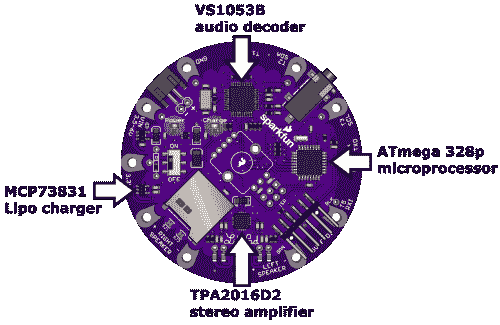](https://cdn.sparkfun.com/assets/5/1/d/b/8/5178650ece395f2d0d000000.png)

如果你对板上的硬件感兴趣，有一个 **ATmega 328p 微处理器**，运行 Arduino 软件，从 micro-SD 卡上的音频文件中提取数据，并将这些数据馈送到 **VS1053B 音频解码芯片**。VS1053B 将数字音频数据转换回模拟音频信号。音频信号被发送到耳机插孔和一个 **TPA2016D2 立体声放大器**，为扬声器增强音频信号。我们还提供了一个 **MCP73831 Lipo 电池充电器**，以便于从 FTDI 端口给电池充电。很整洁，是吧？

### 扬声器选择提示

LilyPad MP3 播放器上的 TPA2016D2 立体声放大器能够将大约一瓦特的功率驱动到每个通道中。这听起来不多，但它可以从一个大扬声器产生惊人的音量。

一般来说，大扬声器比小扬声器听起来更好，所以使用您的项目可以容纳的最大扬声器。不用担心音箱标注“20 瓦”或更高；这只是扬声器设计处理的最大功率。我们用回收的汽车和电脑扬声器，甚至是大型音箱取得了很好的效果。

如果您的项目需要小型扬声器，请记住，任何小型扬声器如果后面有封闭的空腔，声音都会好得多。你可以用项目围栏、回收食品容器等来做到这一点。发挥你的想象力！

### 一些需要了解的重要事项:

*   在插入或取出 micro-SD 卡之前，请务必关闭 LilyPad MP3 播放器。这将防止卡上的数据损坏。

*   5V FTDI 端口用于为连接的 Lipo 电池充电，并提供对电路板重新编程的方法。如果没有音频播放，它将为主板供电，但不会提供足够的电力来驱动扬声器(主板将在播放时复位)。一般来说，为 LilyPad MP3 播放器供电的最佳方式是使用 Lipo 电池。如果你想使用外部电源，请参见这里的说明，如果你*真的*想从 FTDI 电源[运行电路板，你可以黑掉它来这样做。](https://learn.sparkfun.com/tutorials/getting-started-with-the-lilypad-mp3-player/hardware-details#ftdihack)

*   要给连接的 Lipo 电池充电，将一根 [5V FTDI 基本](https://www.sparkfun.com/products/9716)或[电缆](https://www.sparkfun.com/products/9718)插入 6 针 FTDI 连接器。将 FTDI 板或电缆的方向与连接器两侧的“GRN”和“BLK”标记匹配。黄色的“充电”灯将在电池充电时亮起，充满电后熄灭。如果没有连接电池，充电灯亮起是正常的。充电速率设置为 500mA，也就是说 1000mAh 的电池大约两个小时就能充满。如果您想更改费率，请参见此处的说明。

*   LilyPad MP3 播放器的耳机插孔对于耳机来说是安全的，但不要将其连接到外部放大器，除非你使用电池为 LilyPad 供电。(小字是如果音频地对电源地短路，音频解码芯片会损坏)。

*   VS1053B 芯片可以理解各种各样的音频文件格式，但我们偶尔会遇到一种它无法回放的格式(它会悄悄地跳过它)。在这里查看它理解的格式和比特率列表[。如果你碰到一个有问题的文件，你通常可以通过使用你选择的音频软件将文件翻译成不同的格式来解决问题。](https://learn.sparkfun.com/tutorials/getting-started-with-the-lilypad-mp3-player/supported-audio-formats)

*   LilyPad MP3 播放器可清洗，但由于导电线连接可能很脆弱，我们建议尽量少清洗您的项目。请手洗，并确保在洗涤前取出 Lipo 电池和 micro-SD 卡。因为水可能会进入许多小裂缝，所以在再次通电之前，让所有东西风干几天。

好了，让我们开始播放音频吧！

## 开始使用默认的“触发器”草图

LilyPad MP3 播放器自带一个预装的 sketch (Arduino 程序称为 sketch)，名为**“Trigger”**。该草图将等待五个触发输入中的一个接地，然后从 micro-SD 卡播放相应的音频文件。你可以将 LilyPad MP3 播放器嵌入到你的项目中，并使用“软开关”来触发任何你想要的声音。最重要的是，由于这个草图预装在每个 LilyPad MP3 播放器上，你可以开箱即用，无需编程。我们开始吧！

### 所需材料

*   A [单节(3.7V)脂电池](https://www.sparkfun.com/search/results?term=polymer+lithium+ion+battery&what=products)(建议 500mAh 或以上。如果你降低充电率，你可以使用更小的，见说明[这里](https://learn.sparkfun.com/tutorials/getting-started-with-the-lilypad-mp3-player/hardware-details#chargerate)。

*   一根 [5V FTDI 分线点](https://www.sparkfun.com/products/9716)或[电缆](https://www.sparkfun.com/products/9718)(为电池充电，并在需要时对电路板重新编程)。

*   一个或两个 4 或 8 欧姆的[扬声器](https://www.sparkfun.com/search/results?term=speaker&what=products)、[表面传感器](https://www.sparkfun.com/search/results?term=surface+transducer&what=products)，或带有 1/8”立体声插孔的耳机。如果您想将 LilyPad MP3 播放器连接到放大器，请参见此[注释](#externalamplifier)。

*   [导电线和缝纫用品](https://www.sparkfun.com/search/results?term=conductive+thread&what=products)，或[连接线](https://www.sparkfun.com/search/results?term=hook-up+wire&what=products)和[焊接工具](https://www.sparkfun.com/products/11101)。(**提示:** [鳄鱼线缆](https://www.sparkfun.com/products/11037)是在投入针线之前快速测试电路和编程的绝佳方式！)

*   一张 [micro-SD 卡](https://www.sparkfun.com/products/11609)。

*   一些你想播放的音频文件。LilyPad MP3 播放器可以播放许多音频格式，你可以在这里看到整个列表[。](https://learn.sparkfun.com/tutorials/getting-started-with-the-lilypad-mp3-player/supported-audio-formats)

### 说明

1.  在 micro-SD 卡上存储多达五个音频文件。通常，这是通过将卡放入与计算机相连的读卡器中，并将音频文件复制到读卡器中来实现的。LilyPad MP3 播放器可以播放多种音频格式，包括 MP3、WAV、WMA、AAC、MID 等。

2.  重命名 micro-SD 卡上的音频文件，使每个文件名的第一个字符是数字“1”到“5”，对应于您想要播放该文件的触发器。您不需要更改文件名的任何其他内容。

3.  关闭 LilyPad MP3 播放器，将您的 micro-SD 卡插入插座。将它推入，直到发出咔嗒声；如果你松开它，它会保持不动。要移除它，请再次按下直到它发出咔嗒声，松开时它会弹出。

    [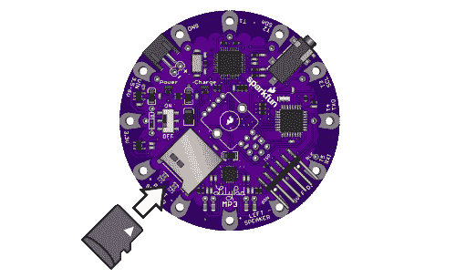](https://cdn.sparkfun.com/assets/b/a/1/c/4/517ae754ce395ffc48000001.png)
4.  将耳机连接到耳机插孔，**或**将扬声器连接到左右扬声器端子。*(注意，当任何东西插入耳机插孔时，扬声器都是禁用的。[如果需要，这种行为可以改变](https://learn.sparkfun.com/tutorials/getting-started-with-the-lilypad-mp3-player/hardware-details#headphonejumper)。*

    [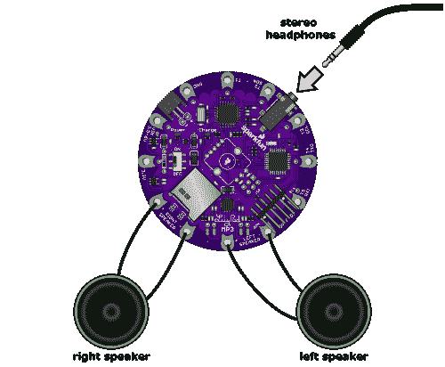](https://cdn.sparkfun.com/assets/e/6/2/3/7/517ae77fce395f0949000000.png)
5.  将一个 3.7V 单节 Lipo 电池插入 JST 连接器。请注意，FTDI USB 连接无法提供足够的电力来运行电路板，因此需要电池或其他外部电源。

    [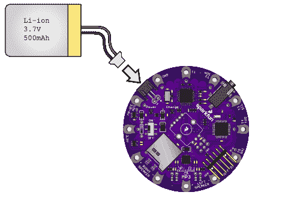](https://cdn.sparkfun.com/assets/1/a/b/4/4/517ae451ce395fbe48000000.png)
6.  将电源开关拨到开。红色 LED 应该会亮起。

7.  等待几秒钟，让软件启动。现在，暂时将接地污水抽头(标有 GND)连接到一个触发端子(标有 T1 至 T5)。与终端相关联音频文件应该通过扬声器/耳机播放。如果听不到任何声音，请参见[故障排除页面](https://learn.sparkfun.com/tutorials/getting-started-with-the-lilypad-mp3-player/troubleshooting)。

    [](https://cdn.sparkfun.com/assets/4/8/2/1/3/517ae947ce395fef48000000.png)
8.  要对电池充电或对电路板重新编程，将一个 5 伏 FTDI 电路板连接到 FTDI 接头。电池充电时，黄色 LED 会亮起，充满后会熄灭。要对电路板重新编程，请参见此处的说明[。](https://learn.sparkfun.com/tutorials/getting-started-with-the-lilypad-mp3-player/writing-your-own-code)

9.  玩得开心！

现在你知道了触发草图是如何工作的，是时候考虑你将如何使用它了。

### 技巧

触发器草图中有几个软件设置，用于控制触发器是否可以重新开始一个已经在播放的片段，将调试信息发送到串行监视器窗口等。通过使用免费的 Arduino 编程环境，您可以根据需要轻松更改这些设置，或者对草图进行任何其他更改。更多信息参见[编程页面](https://learn.sparkfun.com/tutorials/getting-started-with-the-lilypad-mp3-player/writing-your-own-code)。

## 将电路板构建到您的项目中

现在你知道它是如何工作的了，是时候考虑将这个板构建到你的梦想项目中了。LilyPad MP3 播放器同样适用于导电线或焊接线连接，因此您可以在“软”或更传统的项目中使用它。

如果这是你第一次做布料项目，看看我们的[lily pad Arduino 入门教程](https://www.sparkfun.com/tutorials/312)。它将向您概述使用 LilyPad 组件和用导电线缝纫的技巧。

### 扳机

电气上，我们将把每个触发器连接到一个瞬时开关，开关的另一端接地。因为开关是常开的，所以 trigger 引脚将与地断开，并由于板上的上拉电阻而“浮动”到“高”状态(3.3V)。

[](https://cdn.sparkfun.com/assets/3/7/0/7/c/5179c78fce395f540a000000.png)

当您激活一个开关时，触发器将连接到地，即“低”或 0V。该软件知道当一个触发器为低时，是时候播放适当的音频文件了。

注意，LilyPad MP3 播放器使用的非常低的电压**是完全安全的**。你可以触摸棋盘上的任何东西，而不用担心损坏自己或棋盘。

### 开关

如果你愿意，你当然可以使用硬件开关。如果你正在做一个织物项目，你可能想要使用一个软开关。软开关的作用就像它的硬件表亲一样，但它是由导电线或织物制成的。导电区域通常是分开的，但是当您按压/摩擦/扭转/折叠开关时，导电表面会相互接触并导电。有很多方法可以制造软交换，因为这个领域太新了，所以有很多空间可以容纳新的想法。发明一些神奇的东西！[这里有一个例子](https://www.sparkfun.com/tutorials/306)，SparkFun 工程师 Dia 制作了一个软开关，看起来像一朵花，你用手轻轻一擦就可以激活。

因为有五个触发器，所以最多可以有五个软开关。你将每个触发器运行到开关的一侧。每个软开关的另一侧将接地。你可以用一根接地线连接所有的开关。

### 扬声器

您需要运行的唯一其他线路是扬声器。请记住，这些线应该只连接到真正的扬声器或其他基于线圈的传感器；如果您需要模拟音频输出，请使用耳机插孔。由于扬声器比开关使用更多的电流，你应该使扬声器的连接比其他的更结实一点。注意不要将扬声器线短接在一起或短接到任何其他连接，并注意靠近 5V FTDI 接头的“左扬声器-”连接处的松动螺纹。

[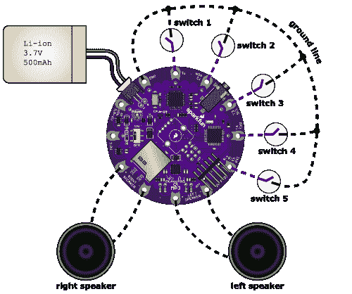](https://cdn.sparkfun.com/assets/3/e/a/5/f/5179c78fce395f110b000000.png)

### 电池

为了防止电池四处乱飞并可能损坏电线，我们建议缝制一个小口袋来贴身存放它。不要永久缝进去；您可能需要将其拆下进行清洗或更换。说到这个...

### 洗涤

LilyPad MP3 播放器可清洗，但由于导电线连接可能很脆弱，我们建议尽量少清洗您的项目。请手洗，并确保在洗涤前取出 Lipo 电池和 micro-SD 卡。因为水可能会进入许多小裂缝，所以在再次通电之前，让所有东西风干几天。

## “玩家”草图入门

“播放器”的草图*没有*预编程到 LilyPad MP3 播放器上，但是你可以使用免费的 Arduino IDE 轻松安装它。它包含在 LilyPad MP3 软件中，你可以从 [GitHub 页面](https://github.com/sparkfun/LilyPad_MP3_Player/tree/master/Arduino/LilyPad%20MP3%20Player)下载。

播放器草图将 LilyPad MP3 播放器变成了一个“真正的”音频播放器，允许您轻松地在曲目之间切换并改变音量。用户界面是一个[旋转编码器](https://www.sparkfun.com/products/10982)(一个带有内置按钮的旋钮)，可以从 SparkFun.com 单独购买，可以焊接到 LilyPad MP3 播放器板上。

*如果你计划使用播放器草图和旋转编码器，请确保在将 LilyPad MP3 播放器缝入你的项目之前，安装旋转编码器**。这是因为您需要接触电路板的背面来安装编码器。***

### 所需材料

*   [RGB 旋转编码器](https://www.sparkfun.com/products/10982)

*   [透明塑料旋钮](https://www.sparkfun.com/products/10597) *(可选)*

*   焊接工具 *( [焊接工具](https://www.sparkfun.com/products/11101)(即烙铁、焊料、安全眼镜等。))*

*   A [单节(3.7V)脂电池](https://www.sparkfun.com/search/results?term=polymer+lithium+ion+battery&what=products)(建议 500mAh 或以上。如果你降低充电率，你可以使用更小的，见说明[这里](https://learn.sparkfun.com/tutorials/getting-started-with-the-lilypad-mp3-player/hardware-details#chargerate)。

*   一根 [5V FTDI BOB](https://www.sparkfun.com/products/9716) 或[电缆](https://www.sparkfun.com/products/9718)(为电池充电并在需要时对电路板重新编程)。

*   一个或两个 4 或 8 欧姆[扬声器](https://www.sparkfun.com/search/results?term=speaker&what=products)、[表面传感器](https://www.sparkfun.com/search/results?term=surface+transducer&what=products)或带有 1/8”立体声插孔的耳机。如果您想将 LilyPad MP3 播放器连接到放大器，请参见此[注释](#externalamplifier)。

*   [导电线和缝纫用品](https://www.sparkfun.com/search/results?term=conductive+thread&what=products)，或[连接线](https://www.sparkfun.com/search/results?term=hook-up+wire&what=products)和[焊接工具](https://www.sparkfun.com/products/11101)。 *( **提示:** [鳄鱼线缆](https://www.sparkfun.com/products/11037)是在投入针线之前快速测试电路和编程的绝佳方式！)*

*   一张 [micro-SD 卡](https://www.sparkfun.com/products/11609)。

*   一些你想播放的音频文件。LilyPad MP3 播放器可以播放许多音频格式，你可以在这里看到整个列表[。](https://learn.sparkfun.com/tutorials/getting-started-with-the-lilypad-mp3-player/supported-audio-formats)

[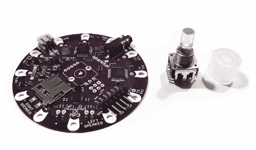](https://cdn.sparkfun.com/assets/b/a/5/2/0/5182f412ce395f7832000000.jpg)

### 说明

1.  安装旋转编码器。

    *   将旋转编码器的针脚插入 LilyPad MP3 播放器中央的孔中。请注意，它进入电路板的“顶”面(带有指示编码器位置的丝网的一面)。[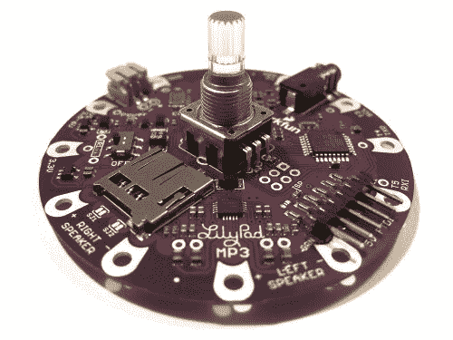](https://cdn.sparkfun.com/assets/0/6/7/c/e/5182f412ce395fe231000000.jpg)
    *   翻转电路板，将编码器的引脚焊接到电路板上。[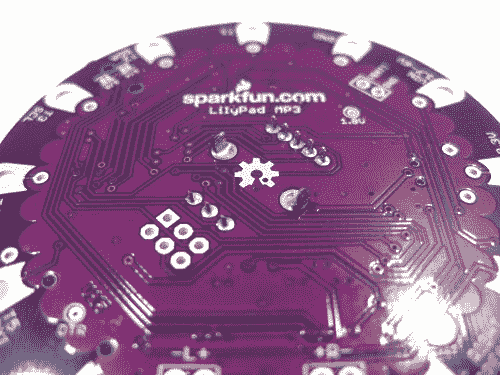](https://cdn.sparkfun.com/assets/e/c/f/6/1/5182f40dce395f6d32000001.jpg)
    *   *可选*:将旋钮放在旋转编码器轴上。就是这样！[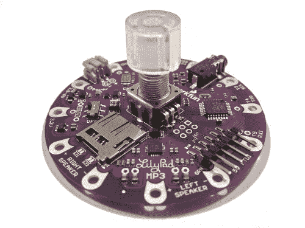](https://cdn.sparkfun.com/assets/9/1/b/a/2/5182f413ce395fd932000003.jpg)
2.  安装 Arduino 软件。

    *   如果您还没有，请从 [www.arduino.cc](www.arduino.cc) 下载并安装免费的 Arduino IDE(集成开发环境)。请按照您的计算机类型和操作系统的说明进行操作。

    *   将 FTDI 板或电缆插入计算机。驱动程序应该会自动安装。如果没有，请参阅位于 [www.arduino.cc](www.arduino.cc) 的针对您的电脑和操作系统的说明。

3.  安装 LilyPad MP3 播放器库。

    *   从 SparkFun.com 的[产品页面](https://www.sparkfun.com/products/11013)下载最新的 LilyPad MP3 播放器软件。

    *   打开归档文件，将“Arduino”文件夹的内容拖到您个人的 Arduino sketches 目录中(该目录通常称为“Arduino ”,位于您的 documents 文件夹中)。这将安装一个包含几个新库的“libraries”文件夹，以及一个包含示例代码的“LilyPad MP3 Player”文件夹。

    *   如果它正在运行，重新启动 Arduino IDE。

4.  上传“玩家”草图。

    *   将 Lipo 电池(或其他电源)连接到 LilyPad MP3 播放器。

    *   将您的 5V FTDI 板或电缆连接到 LilyPad MP3 播放器。(黄色的“充电”指示灯可能会亮起，这没关系。)

    *   打开 LilyPad MP3 播放器的电源开关。红色 LED 应该会亮起。

    *   启动 Arduino IDE，从“LilyPad MP3 播放器”文件夹中加载“播放器”草图。

    *   从 IDE 的“工具/板”菜单中，选择“Arduino Pro 或 Pro Mini (3.3V/8MHz) w/ATmega 328”

    *   从 IDE 的“工具/串行端口”菜单中，选择 FTDI 板或电缆正在使用的端口。这通常是最高的数字；你可以肯定，如果你拔掉 FTDI，号码就消失了。

    *   将“播放器”草图上传到 LilyPad MP3 播放器。如果您遇到编译问题，请仔细检查从上面的第 3 步开始是否正确安装了所需的库。

    *   一旦代码加载并运行，如果没有安装 micro-SD 卡，旋转编码器上的 RGB LED 将闪烁。这很正常。

5.  将您选择的音频文件放在微型 SD 卡上。

    *   LilyPad MP3 播放器支持多种音频类型。文件名可以是任何东西，只要它们使用标准文件扩展名(MP3、WAV、AAC、MID 等)。).

    *   对 SD 卡上音频曲目数量的唯一限制是其存储容量。

6.  关闭 LilyPad MP3 播放器，将您的 micro-SD 卡插入插座。

    *   将它推入，直到发出咔嗒声；如果你松开它，它会保持不动。要移除它，请再次按下直到它发出咔嗒声，松开时它会弹出。
7.  将耳机连接到耳机插孔，或将扬声器连接到左右扬声器端子。(请注意，当任何东西插入耳机插孔时，扬声器端子将被禁用。如果需要，可以[改变该行为](https://learn.sparkfun.com/tutorials/getting-started-with-the-lilypad-mp3-player/hardware-details#headphonejumpers)。

    *   **提示:** [鳄鱼电缆](https://www.sparkfun.com/products/11037)是在使用针线之前快速测试电路和编程的好方法！

8.  将一个 3.7V 单节 Lipo 电池插入 JST 连接器。请注意，FTDI USB 连接无法提供足够的电力来运行电路板，因此需要电池或其他外部电源。

9.  打开电源开关。红色 LED 应该亮起，几秒钟后，旋转编码器将变为红色，表明播放器处于“曲目”模式。(如果旋转编码器闪烁，则存在启动问题，参见[故障排除页面](https://learn.sparkfun.com/tutorials/getting-started-with-the-lilypad-mp3-player/troubleshooting)获取帮助。)

    [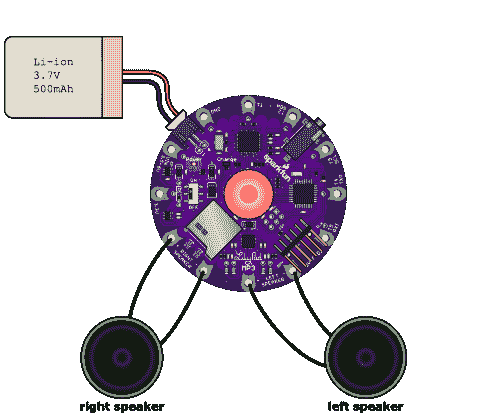](https://cdn.sparkfun.com/assets/5/a/5/b/f/51834a39ce395fe731000000.png)
10.  放音乐！方法如下:

    *   在任何时候，要开始和停止播放，**短按**旋转编码器按钮。一首曲目播放完毕后，下一首曲目将自动开始播放。

    *   要在“音轨”和“音量”模式之间切换，**按住旋转编码器按钮一秒钟**，直到颜色改变。红色=音轨模式，绿色=音量模式。

    *   在轨道模式下，您可以向前或向后旋转旋钮来改变轨道(旋钮每次“点击”一个轨道)。如果您当前正在播放，旋转旋钮将停止当前曲目，切换到下一首/上一首曲目，并开始新曲目。如果你不玩，播放器会自动记录你点击了多少次。如果您点按的曲目数量多于卡片上的曲目数量，它将循环到开头。

    *   在音量模式下，您可以向前或向后旋转旋钮来改变音量。

11.  要对电池充电或对电路板重新编程，将一个 5 伏 FTDI 电路板或电缆连接到 FTDI 接头。电池充电时，黄色 LED 会亮起，充满后会熄灭。

12.  玩得开心！

## 硬件细节和黑客技巧

### 电源选项和黑客

您可以通过多种方式为 LilyPad MP3 播放器供电:

#### 脂肪电池

最简单的选择是使用锂聚合物电池。SparkFun 有几种尺寸，这意味着不同的运行时间。

建议您使用至少 500 毫安的 Lipo 电池，以匹配内置 Lipo 充电器的默认 500 毫安速率(这也是大多数 USB 端口的最大可用电流)。SparkFun Lipo 电池的最大充电速率为 1C，这意味着充电速度不应超过一小时。500 毫安一小时给 500 毫安的电池充电，两小时给 1000 毫安的电池充电，以此类推。小于 500 毫安时的电池充电时间不到一小时，这可能导致电池过热并可能损坏。

#### 未稳压的 3.7V 至 6V 电源

如果您有外部 3.7V 至 6V 电源，您有两种选择:

如果您想使用电源为连接的 Lipo 电池充电，您可以将其连接到“VIN”sew 水龙头。请注意，要给电池充电，电压必须高于 4.5V(但仍低于 6V)。

如果你想用你的电源直接运行 LilyPad MP3 播放器(不用电池)，把它连接到 JST 电池连接器或者直接在它后面的接头上。SparkFun 带有与此连接器匹配的[尾纤](https://www.sparkfun.com/products/8670)(一种带裸线的连接器)。请注意，如果您将一个 5V 的 FTDI 连接到电路板上，当充电器试图为丢失的电池充电时，此连接器上将出现最大 4.2V 的电压。

#### 稳压 3.3V 电源

如果您有一个外部调节的 3.3V 电源，您可以通过将其连接到 3.3V sew 抽头来使用它。请注意，这不会对连接的 Lipo 电池充电。您还可以从这个 sew tap 中取出 3.3V 稳压电源，为项目中的其他项目供电。

#### 当前要求

因为放大器芯片在最大音量下可以提供相当大的功率，所以要确保您使用的任何外部电源都可以提供高达几百 mA 的电流。如果音量较低，50-100 毫安就可以了。

#### 改变收费率

如果您想使用小于 500 毫安时的电池，可以在电路板上焊接一个新的充电电阻。电源开关附近标有 R1 的白色盒子中有一个通孔。

你需要一个阻值合适的通孔电阻。要使用的公式是 R = 1000/amps。对于给定的 500mA 充电速率，提供的电阻为 1000/0.5 安培，即 2000 欧姆。对于 110 毫安时的电池，电阻应为 1000/0.4 或 9090 欧姆。(没有标准的 9090 欧姆电阻，所以使用下一个更大的标准尺寸 10k。)

在焊接新电阻之前，移除白盒中现有的表面贴装电阻。你可以用烙铁小心地加热它，当焊料变软时把它从焊盘上推下来。

#### 入侵 FTDI 电源

我们之前说过，你不能只通过 5V 的 FTDI 板或电缆为 LilyPad MP3 播放器供电。这是因为 FTDI 连接器用于给电池充电，有限的电流不足以运行包括放大器在内的整个系统(这会消耗相当多的功率)。

然而，你可以修改电路板，使其通过 FTDI 供电。请注意，如果你这样做，你将绕过充电电路，所以你将无法连接一个脂电池板。如果你更喜欢用 FTDI 而不是电池来运行开发板，以下是修改开发板的方法。

***注意:一旦进行了这种修改，请勿将 Lipo 电池连接到主板上。这种修改向电池连接器发送 5V 电压，这将对连接的电池过度充电。可能会导致损坏或火灾。***

要修改板以从 5V FTDI 接头供电，请在 VIN sew tap(您可以直接使用其后面的小接头孔)和 JST 电池连接器上的“+”接头之间焊接一根跳线。这将从 FTDI 连接器向电路板的电源输入发送 5V 电压，绕过限制电流的充电电路。一旦你这样做了，你就可以从 FTDI 连接器给电路板供电了。我们有没有提到在你做了这种修改后不要将 Lipo 电池连接到主板上？

### 焊料跳线

板上有几个焊接跳线，可以用来改变其行为。你可能不需要它们，但是如果你有野心，它们就在那里。

#### I2C 上拉(SJ1 和 SJ2)

TPA2016D2 放大器芯片有一个 I2C(“线”库)接口，可以用来改变芯片上的各种设置。该接口连接到 ATmega328，如果您想要使用外部 I2C 传感器，如加速度计、陀螺仪等，该接口也发送到触发器 2 和触发器 3。

在示例草图中，I2C 界面通常是禁用的，通常不会干扰触发器 2 或触发器 3 的使用。然而，如果您想将触发器 2 和触发器 3 与放大器芯片和 4.7K 上拉电阻完全分开，可以通过切断 SJ1 和 SJ2 来实现。

这些跳线通常是相连的(焊盘之间有一条细线)。如果您想切断放大器的 I2C 连接，请使用业余爱好刀小心地切割衬垫之间的迹线。如果您想稍后恢复连接，请使用一滴焊料重新连接两个焊盘。

#### 串行 MIDI 连接(SJ3)

SJ3(位于电路板底部)可用于将串行 RX 线(触发器 5)连接到 VS1053B 音频解码器芯片的串行 RX 引脚。这将允许您将串行 MIDI 数据直接从触发器 5 发送到音频解码器。

**请注意**在不更换跳线的情况下，您仍然可以像播放任何其他音频文件一样播放 SD 卡上的 MIDI 文件。此跳线仅在您有外部 MIDI 信号源(如您可能想要直接连接到 LilyPad MP3 播放器的键盘)时有用。

#### 耳机插孔扬声器切断(SJ4 和 SJ5)

通常，当您将耳机插入插孔时，放大器芯片和扬声器的音频信号将被插孔内置的开关中断。如果您希望音频同时进入耳机插孔和放大器，可以闭合电路板底部的焊接插孔 SJ4 和 SJ5。

### 更多标题

如果您需要比五个触发引脚更多的 I/O，并且不打算使用旋转编码器，可以利用电路板中央未使用的旋转编码器连接。下图显示了这些引脚的位置及其功能。请随意在您的项目中使用它们:

[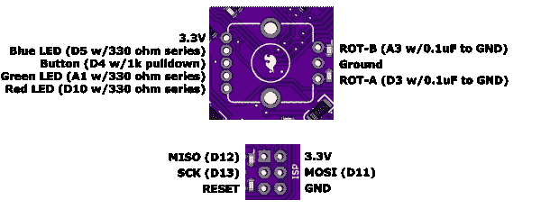](https://cdn.sparkfun.com/assets/1/6/5/b/2/519d68dfce395fbf43000000.png)

除了旋转编码器头，六针 ISP(系统内编程)连接器上还有几个额外的针。该连接器通常用于使用兼容的 ISP [编程器](https://www.sparkfun.com/products/9825)对 ATmega 微处理器进行裸机编程(如更换引导程序)。您可以出于自己的目的使用这些引脚，但**请注意**SPI 接口(MOSI、MISO 和 SCK 引脚)已经被播放软件大量用于将数据从 micro-SD 卡移动到 VS1053B 芯片。

但是并没有失去一切！如果您想将 SPI 接口用于其他目的，例如驱动可寻址 LED 灯串，只要小心谨慎就可以做到。比尔·波特的 MP3 播放器库将允许你在音频传输之间使用 SPI 引脚*，只要你动作迅速并及时释放 SPI 端口以进行下一次数据传输。(如果不这样做，VS1053B 将耗尽缓冲数据并“饿死”，导致播放出现间隙或毛刺。)参见比尔的[文档](http://www.billporter.info/2012/01/28/sparkfun-mp3-shield-arduino-library/)了解如何做这件事的说明，玩得开心点！*

## 解决纷争

如果你什么也没听到，希望下面的列表能帮助你找到问题。

### 串行调试

几乎所有问题的一个大的故障排除技巧是,“触发器”和“播放器”草图在代码中都有一个将调试输出发送到串行端口的选项。当此选项打开(“真”)时，文本消息将输出到串行端口，描述电路板在任何给定时间正在做什么，以及它发现的任何问题。在“播放器”草图中，串行调试是默认打开的。要在“触发器”草图中打开串行调试，请按照下列步骤操作:

```
* Open the "Trigger" sketch in the Arduino IDE (see the programming page for more information)
* There will be a line near the top that says "debugging = false"
* Change "false" to "true"
* Upload the modified sketch
* In the IDE, turn on the Serial Monitor window
* Set the baud rate to 9600
* The board will reset and status messages should appear in the Serial Monitor window 
```

打印到窗口的信息将使您能够清楚地看到电路板上正在发生的事情。请注意，在“触发器”草图中使用串行调试时，触发器 4 和 5 被禁用(因为这些引脚用于串行输入和输出)。

### SD 卡的问题:

*   你记得把你的微型 SD 卡插到 LilyPad MP3 播放器上了吗？(我们也这样做。)

*   如果 LilyPad MP3 播放器无法启动，它将通过旋转编码器 LED 输出闪烁代码。如果您没有安装旋转编码器，您可以暂时将一个普通的 led 插入电路板中间的五针孔中(使用两个端孔，并将较长的引线朝向 SparkFun 徽标)。一闪= SD 卡问题。眨眼次数越多= MP3 解码器问题。有关更多信息，请参见草图中的注释。

*   如果您使用默认的“触发器”草图，请确保文件名的第一个字符是“1”到“5”。

*   如果您使用的是“播放器”草图，请确保您的文件名具有以下扩展名之一:“MP3”、“WAV”、“MID”、“MP4”、“WMA”、“FLA”、“OGG”、“AAC”。请注意，VS1053 本身并不关心文件名是什么(您可以在任何文件上使用任何文件名)；草图只是检查扩展名，以避免在 SD 卡上有其他文件的情况下向芯片发送非音频数据。

*   确保您的文件支持音频格式和比特率。参见[支持的音频格式页面](https://learn.sparkfun.com/tutorials/getting-started-with-the-lilypad-mp3-player/supported-audio-formats)了解更多信息。

*   如果您的文件格式不受支持，您通常可以将该文件加载到音频编辑器程序中，并将其重新存储为受支持的文件类型。

### 触发器的问题:

*   尝试使用鳄鱼电缆或跳线手动桥接接地触发连接。这将帮助您确定问题是出在主板上还是交换机上。

*   如果在草图中打开了串行调试，触发器 4 和 5 将被禁用(这些触发器也用于 TX 和 RX 线路)。

### 扬声器的问题:

*   插上耳机，看看这样是否能听到任何声音。

*   请注意，当您插入耳机时，扬声器将被禁用。如果你愿意，你可以改变这种行为。

*   尝试使用鳄鱼线缆将 LilyPad MP3 播放器直接连接到扬声器。

*   如果您正在编写自己的代码，请确保没有使用关断信号(EN_GPIO1，位于 A2 上)禁用放大器。该信号应该为高电平，以激活放大器。

*   请注意，这个放大器芯片有一个功能，当它第一次打开时，音量会慢慢增加。

### 电源问题:

*   您是否连接了电源，电源开关是否打开？(红色电源指示灯应该亮起)。

*   如果回放开始但中途停止，请确定您使用的是充满电的电池。

*   请记住，5V FTDI 将为电路板供电，足以对其进行编程，但不足以驱动扬声器。您必须使用 Lipo 电池或其他外部电源。

*   电池充电芯片(位于 3.3V 引脚和右扬声器+引脚之间)在给电池充电时会变热，尤其是在电池没电的情况下。这很正常。电池充满后，它会冷却下来。

### 播放前暂停？

*   一位客户打电话给我们，提出了一个奇怪的问题:他们的 LilyPad MP3 播放器正在播放音频文件，但只是在长时间暂停之后。同样的文件可以在电脑上正常播放。在查看了他们的文件后，我们意识到这些文件包含了专辑封面的图片作为元数据的一部分。由于该数据位于文件的开头，VS1053 芯片必须通读(并忽略)所有图像数据，然后才能获得实际的音频数据。将音频文件加载到 Audacity 中，并在没有元数据的情况下保存它们，解决了这个问题。

### 还有问题吗？

如果您仍然无法正常工作，请联系我们的[技术支持部门](https://www.sparkfun.com/static/technical_assistance)，他们将很乐意帮助您。

## 支持的音频格式

LilyPad MP3 播放器内置的 VS1053B 音频解码芯片支持多种音频文件格式。偶尔你会碰到它不能播放的东西；在这种情况下，你可以将它加载到你选择的音频编辑软件中，然后“另存为”一种不同的格式。

下面总结了 VS1053B 支持的音频格式，以及这些格式的常见文件扩展名。请注意,“player”草图会检查每个文件，以确保它具有以下扩展名之一:MP3、WAV、// MID (MIDI)、MP4、WMA、AAC、FLA、OGG，但这只是为了避免将非音频数据从 micro-SD 卡上的其他文件发送到 VS1053B。芯片本身并不关心扩展。如果您正在使用播放器草图，您可以随时将您的音频文件重命名为上述扩展名中的任何一个。

这只是一个总结。欲了解更多详情，请参见 [VS1053B 数据表](http://www.sparkfun.com/datasheets/Components/SMD/vs1053.pdf)。

**MPEG 层 III (.MP3)**

```
language:bash
Two channels max
Sample rates: 8 through 48 kHz
Bitrates: 32 through 320 kbit/s
Variable bit rate (VBR) supported
Layer I and II also supported with additional setup, see the VS1053B datasheet for more information. 
```

**Ogg Vorbis (.OGG)**

```
language:bash
Two channels max
Window size: 64 - 4096 samples
Sample rate: 48 kHz max
Bitrate: 500 kbit/s max 
```

**AAC(。AAC .MP4 .M4A)**

```
language:bash
Two channels max
Sample rates from 8 kHz to 96 kHz (rates > 48 kHz are downsampled to 48 kHz)
Bitrates to 576 kbit/s
ATDS (streaming) format recommended 
```

WMA(。WMA)

```
language:bash
Two channels max
Sample rates from 8 kHz to 48 kHz
Bitrates from 5 kbits/s to 192 kbits/s
Variable bit rate (VBR) supported 
```

**WAV(。WAV)**

```
language:bash
Two channels max

PCM format
    8 or 16 bits, sample rates < 48 kHz

IMA_ADPCM format
    Sample rates < 48 kHz

MPEG LAYER 3 format
    Same as MP3 modes 
```

**中午(。MID)**

```
language:bash
General MIDI and SP-MIDI format 0
    Format 1 and 2 files must be converted to format 0

Maximum polyphony: 64
Actual polyphony: 19-31 notes at 3.5X clock

Two instrument banks:
    GM1 (instruments)
    GM2 (percussion) 
```

## 编写自己的代码

LilyPad MP3 播放器使用与 SparkFun 的 [MP3 播放器屏蔽](https://www.sparkfun.com/products/10628)相同的引脚排列，应该运行相同的代码，无需修改。

LilyPad MP3 播放器与 Arduino 兼容。它使用了与 SparkFun 的“Pro”和“Pro Mini”系列板卡相同的 bootloader。要从 Arduino IDE 中选择正确的主板，请转到“工具/主板”菜单，然后选择“Arduino Pro 或 Pro Mini (3.3V/8MHz) w/ATmega 328”。

我们这样做是为了支持比尔·波特优秀的 [MP3 播放器库](http://www.billporter.info/2012/01/28/sparkfun-mp3-shield-arduino-library/)，它负责播放音频文件的大部分繁重工作。如果您查看我们提供的示例代码，您会发现这个库是它的核心。

编写新代码的最佳方式是从一个现有的例子开始。例如，我们修改了股票代码，对 Pete Dokter 的“根据”进行恶作剧，我们一遍又一遍地循环播放“这是一个小世界”这首歌，同时非常缓慢地提高音量。我们已经将这段代码包含在示例目录中。

你可以从 [github 库](https://github.com/sparkfun/LilyPad_MP3_Player)下载 LilyPad MP3 播放器代码。点击该页面上的“ZIP”按钮将下载最新版本。您还可以安装一个 github 客户端，并将仓库克隆到您的本地机器上。

在档案中，你会发现[“触发器”](https://learn.sparkfun.com/tutorials/getting-started-with-the-lilypad-mp3-player/getting-started-with-the-default-trigger-sketch)和[“玩家”](https://learn.sparkfun.com/tutorials/getting-started-with-the-lilypad-mp3-player/getting-started-with-the-player-sketch)草图，以及展示电路板不同功能的示例程序，例如旋转编码器的使用。所有的代码都是完全注释的，你可以完全自由地使用和修改。

如果你想绕过 Arduino 环境，直接对 ATMega328 编程，你也可以这样做。板上有一个未安装的 6 引脚 ISP 接头。您可以使用该接头通过 Atmel ISP 编程器对电路板进行编程，如 SparkFun 的[袖珍编程器](https://www.sparkfun.com/products/9825)。

我们非常感谢比尔·波特和迈克尔·弗拉格为 [MP3 播放器库](http://www.billporter.info/2012/01/28/sparkfun-mp3-shield-arduino-library/)所做的辛勤工作。

## 资源和更进一步

至此，您应该掌握了使用 LilyPad MP3 播放器创建任何项目所需的所有知识。有许多设置可以调整，以操纵 LilyPad MP3 播放器成为适合您的完美板，并满足您的下一个音乐/噪音相关发明的要求。

如果您想进一步探索电子纺织品的世界，请查看以下教程:

*   [龙与地下城骰子战书](https://www.sparkfun.com/tutorials/333)
*   [使用 LilyPad TinyTwinkle 板](https://www.sparkfun.com/tutorials/390)

更多 MP3 相关教程，请访问以下链接:

*   [MP3 播放器保护快速入门指南](https://www.sparkfun.com/tutorials/295)
*   [电梯 TARDIS](https://www.sparkfun.com/tutorials/319)
*   [办公室门城堡门环](https://www.sparkfun.com/tutorials/328)**