# Raspberry Pi Zero Wireless 入门

> 原文：<https://learn.sparkfun.com/tutorials/getting-started-with-the-raspberry-pi-zero-wireless>

## 介绍

Raspberry Pi 是一种流行的单板计算机(SBC ),因为它是一种封装在单板中的完整计算机。许多人可能已经熟悉了 [Raspberry Pi 3](https://www.sparkfun.com/products/13825) 和它的前辈，它的外形已经变得非常容易识别。树莓派的外形甚至更小。Raspberry Pi Zero 的引入允许在更小的项目中嵌入整个计算机。本指南将涵盖 Zero 产品线的最新版本，即 [Raspberry Pi Zero - Wireless](https://www.sparkfun.com/products/14277) ，它有一个板载 WiFi 模块。虽然这些方向应该适用于大多数版本和形状的 Raspberry Pi，但它将围绕 Pi Zero W。

[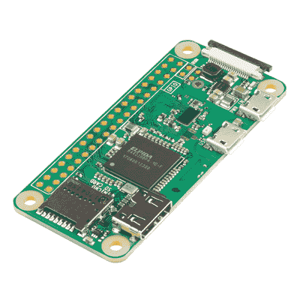](https://www.sparkfun.com/products/14277) 

### [树莓派零 W](https://www.sparkfun.com/products/14277)

[Out of stock](https://learn.sparkfun.com/static/bubbles/ "out of stock") DEV-14277

Raspberry Pi Zero W 仍然是你所知道和喜爱的 Pi，但尺寸大大缩小，只有 65 毫米长，30 毫米宽，而且…

44[Favorited Favorite](# "Add to favorites") 111[Wish List](# "Add to wish list")[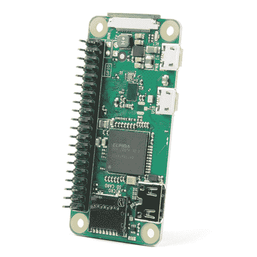](https://www.sparkfun.com/products/15470) 

### [【树莓派零 W】](https://www.sparkfun.com/products/15470)

[Out of stock](https://learn.sparkfun.com/static/bubbles/ "out of stock") DEV-15470

Raspberry Pi Zero W 仍然是你所知道和喜爱的 Pi，但尺寸大大缩小，只有 65 毫米长，30 毫米宽，n…

7[Favorited Favorite](# "Add to favorites") 48[Wish List](# "Add to wish list")

如果你正在寻找一个初学者包，这个工具包包括你开始使用你的 Pi Zero W 所需的一切。

[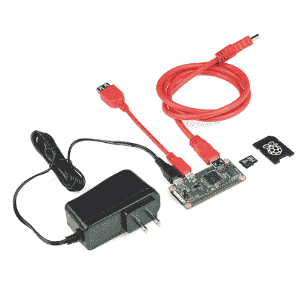](https://www.sparkfun.com/products/14298) 

### [SparkFun 树莓派零 W 基础套装](https://www.sparkfun.com/products/14298)

[Out of stock](https://learn.sparkfun.com/static/bubbles/ "out of stock") KIT-14298

Raspberry Pi Zero W 由于其独特的电源和电缆要求，设置起来可能有点棘手。这就是这个工具包的来源…

5[Favorited Favorite](# "Add to favorites") 17[Wish List](# "Add to wish list")

[https://www.youtube.com/embed/AApD2Mygkd4/?autohide=1&border=0&wmode=opaque&enablejsapi=1](https://www.youtube.com/embed/AApD2Mygkd4/?autohide=1&border=0&wmode=opaque&enablejsapi=1)

### 所需材料

要完成本教程，您需要以下物品:

*   [树莓派 Zero W 基础套装](https://www.sparkfun.com/products/14298)
*   班长
*   键盘
*   鼠标(可选，但建议使用)
*   USB 集线器(用于多个 USB 设备)

### 推荐阅读

在继续之前，您可能会对以下一些教程感兴趣:

 [### 单板计算机基准](https://learn.sparkfun.com/tutorials/single-board-computer-benchmarks) How to set up different benchmarking programs on single board computers or computing modules and run them. The results for various generations are shown on the subsequent pages.[Favorited Favorite](# "Add to favorites") 7 [### SD 卡和书写图像](https://learn.sparkfun.com/tutorials/sd-cards-and-writing-images) How to upload images to an SD card for Raspberry Pi, PCDuino, or your favorite SBC.[Favorited Favorite](# "Add to favorites") 19 [### 树莓 gPIo](https://learn.sparkfun.com/tutorials/raspberry-gpio) How to use either Python or C++ to drive the I/O lines on a Raspberry Pi.[Favorited Favorite](# "Add to favorites") 17 [### 树莓派 SPI 和 I2C 教程](https://learn.sparkfun.com/tutorials/raspberry-pi-spi-and-i2c-tutorial) Learn how to use serial I2C and SPI buses on your Raspberry Pi using the wiringPi I/O library for C/C++ and spidev/smbus for Python.[Favorited Favorite](# "Add to favorites") 24

## 想亲自体验树莓派吗？

我们掩护你！

 

### [【树莓派零 W】](https://www.sparkfun.com/products/15470)

[Out of stock](https://learn.sparkfun.com/static/bubbles/ "out of stock") DEV-15470

Raspberry Pi Zero W 仍然是你所知道和喜爱的 Pi，但尺寸大大缩小，只有 65 毫米长，30 毫米宽，n…

7[Favorited Favorite](# "Add to favorites") 48[Wish List](# "Add to wish list")[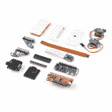](https://www.sparkfun.com/products/16327) 

将**添加到您的[购物车](https://www.sparkfun.com/cart)中！**

### [SparkFun 树莓派 Zero W 相机套装](https://www.sparkfun.com/products/16327)

[Out of stock](https://learn.sparkfun.com/static/bubbles/ "out of stock") KIT-16327

SparkFun Raspberry Pi Zero W 摄像机套件为您提供了通过 Raspberry Pi Zero W 控制的云台摄像机。

$67.951[Favorited Favorite](# "Add to favorites") 11[Wish List](# "Add to wish list")**** 

### [树莓派零 W](https://www.sparkfun.com/products/14277)

[Out of stock](https://learn.sparkfun.com/static/bubbles/ "out of stock") DEV-14277

Raspberry Pi Zero W 仍然是你所知道和喜爱的 Pi，但尺寸大大缩小，只有 65 毫米长，30 毫米宽，而且…

44[Favorited Favorite](# "Add to favorites") 111[Wish List](# "Add to wish list")[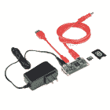](https://www.sparkfun.com/products/14298) 

### [SparkFun 树莓派零 W 基础套装](https://www.sparkfun.com/products/14298)

[Out of stock](https://learn.sparkfun.com/static/bubbles/ "out of stock") KIT-14298

Raspberry Pi Zero W 由于其独特的电源和电缆要求，设置起来可能有点棘手。这就是这个工具包的来源…

5[Favorited Favorite](# "Add to favorites") 17[Wish List](# "Add to wish list")****[See all Raspberry Pi products](https://www.sparkfun.com/categories/233)** **## 硬件概述

让我们来看看 Raspberry Pi Zero(和 Pi Zero W)和 Raspberry Pi 3 之间一些最明显的区别。

除了 W 内置了 Wifi 和 Bluethooth 之外，这两款主板的功能完全相同。开始使用 Pi Zero 板可能比使用 Pi 3 要麻烦一些，因为许多连接器需要适配器来连接标准尺寸的连接器。否则，要开始，你需要的只是一张有树莓 Pi 图像的美元卡和电源。

### 迷你 HDMI

与之前使用标准 HDMI 连接器的 Raspberry Pi 不同，Zero 使用迷你 HDMI 连接器来节省空间。要将 Zero 连接到显示器或电视，您需要一个迷你 HDMI 转 HDMI 适配器或[电缆](https://www.sparkfun.com/products/14274)。

[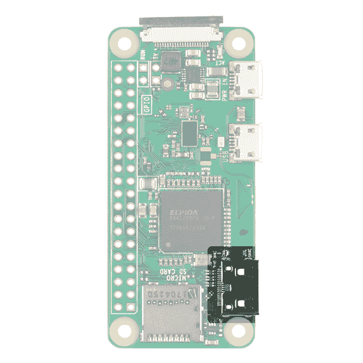](https://cdn.sparkfun.com/assets/learn_tutorials/6/7/6/miniHDMI.jpg)

### 移动 USB

Raspberry Pi 3 和其他型号传统上有 2-4 个标准尺寸的母 USB 连接器，允许各种设备连接，包括鼠标、键盘和 WiFi 软件狗。同样为了节省空间，Zero 选择了 [USB On-the-Go (OTG)](https://en.wikipedia.org/wiki/USB_On-The-Go) 连接。Pi Zero 使用与最初的 Raspberry Pi A 和 A+型号相同的 Broadcom IC。这种 IC 直接连接到 USB 端口，允许 OTG 功能，不像 Pi B、B+、2 和 3 型号使用板载 USB 集线器，允许多个 USB 连接。

要使用标准公 USB 接口连接设备，您需要一根 [USB OTG 线](https://www.sparkfun.com/products/14276)。将 microUSB 端插入 Pi Zero，并将您的 USB 设备插入标准母 USB 端。

[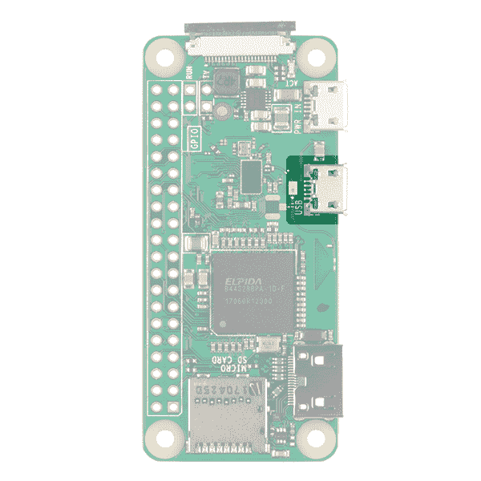](https://cdn.sparkfun.com/assets/learn_tutorials/6/7/6/usb.jpg)

要与其他标准 USB 设备配合使用，建议您使用带电源的 USB 集线器。无线键盘和鼠标组合的效果最好，因为这两种设备都有一个 USB 加密狗。

**Heads up!** You can use the USB to micro-b adapter if you need to access the USB port on the Pi Zero.

[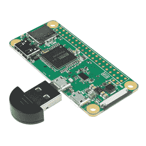](https://www.sparkfun.com/products/14567)

### 力量

与其他 pi 一样，电源是通过 microUSB 连接器提供的。提供给电源 USB 的电压应在 **5-5.25V** 的范围内。

[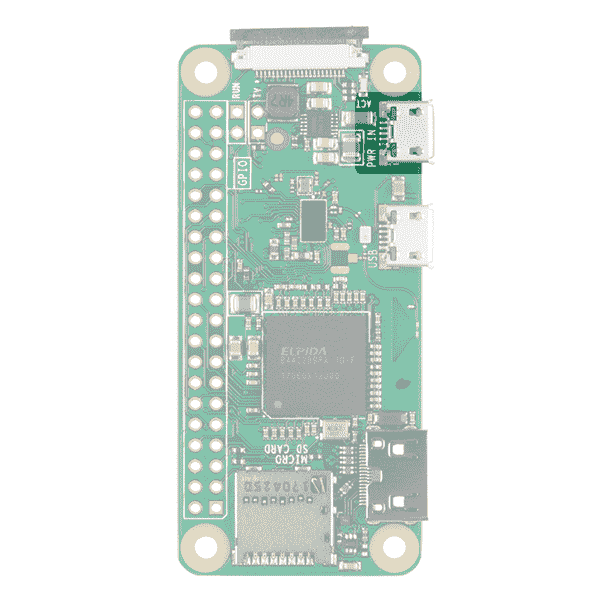](https://cdn.sparkfun.com/assets/learn_tutorials/6/7/6/power.jpg)

### microSD 卡插槽

另一个熟悉的接口是 microSD 卡插槽。在此插入包含您的 Raspberry Pi 图像文件的 microSD 卡。

[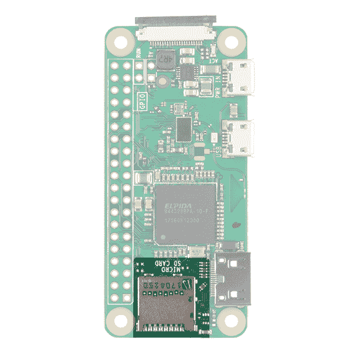](https://cdn.sparkfun.com/assets/learn_tutorials/6/7/6/uSDcard.jpg)

### WiFi 和蓝牙

与 Raspberry PI 3 一样，Zero W 提供 802.11n 无线局域网和蓝牙 4.0 连接。这释放了许多原本通过 USB 进行的连接，例如 WiFi 加密狗和 USB 键盘和鼠标(如果替换蓝牙键盘/鼠标的话)。

### 相机连接器

Raspberry Pi Zero V1.3+和所有 Zero Ws 都有一个板载摄像头连接器。这可以用来连接 [Raspberry Pi 摄像头模块](https://www.sparkfun.com/products/14028)。然而，连接器是一个 22pin 0.5mm 毫米，不同于标准的 Pi。你需要一根不同的[线](https://www.sparkfun.com/products/14272)将相机连接到 Pi Zero W

[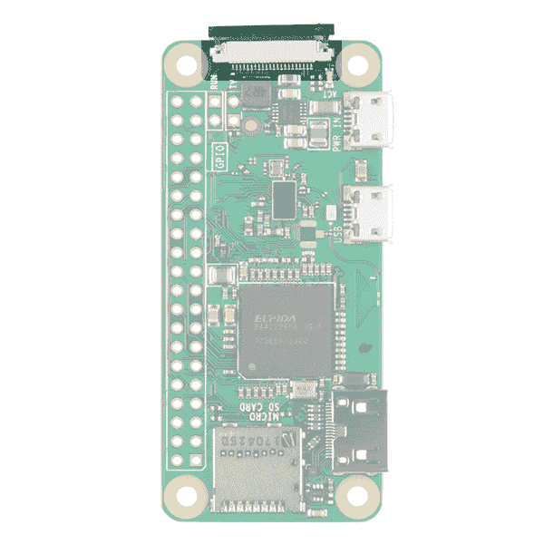](https://cdn.sparkfun.com/assets/learn_tutorials/6/7/6/camera.jpg)

### GPIO

与所有其他型号的 Raspberry Pi 一样，有过多的 GPIO 引脚，其中许多是其他功能，如 I ² C。如果您使用 GPIO 接头，您可能需要考虑将[接头](https://www.sparkfun.com/products/14275)焊接到它上面。

[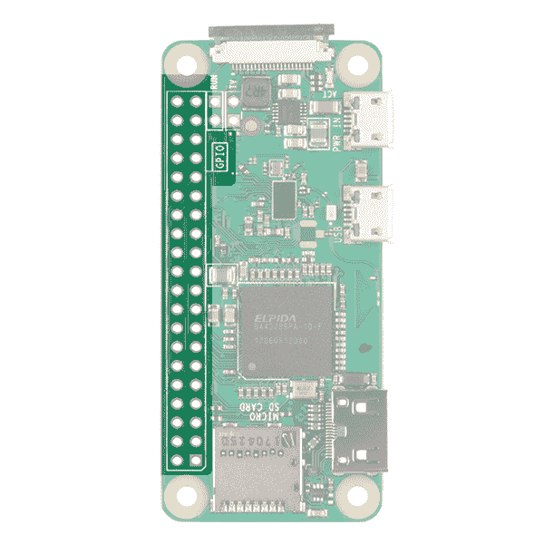](https://cdn.sparkfun.com/assets/learn_tutorials/6/7/6/gpio.jpg)

### 附加连接

最后，你可能会注意到两组标有 TV 和 Run 的通孔垫。电视垫允许您将 RCA 插孔连接到主板，而不是使用 HDMI 输出。Run 引脚连接到 chips reset 引脚，一旦电路板关闭，它将关闭或打开电路板。在这里连接一个按钮是重启主板的好方法。

[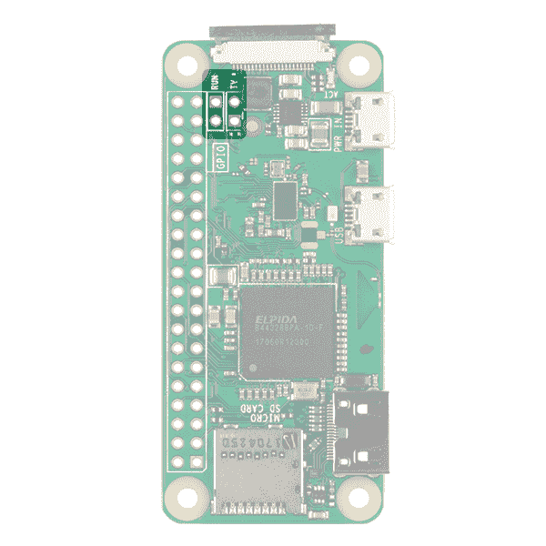](https://cdn.sparkfun.com/assets/learn_tutorials/6/7/6/tv.jpg)

* * *

有关 GPIO 接头上每个引脚和 PI Zero 上所有连接器的完整描述，请参考下面的图形数据表。

[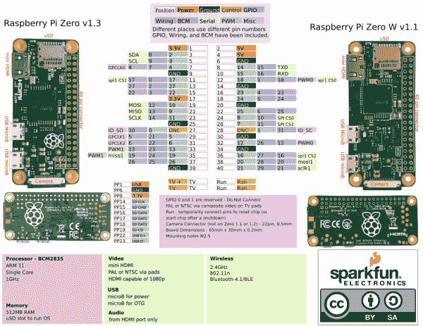](https://cdn.sparkfun.com/assets/learn_tutorials/6/7/6/PiZerov2.pdf)*Click on the image to view the PDF.*

## 硬件装配

根据您的使用情况，Pi Zero 的设置可能很简单，也可能很麻烦，因为 Zero 上的连接器较小，并且需要适配器来连接鼠标、键盘和显示器等标准设备。

### 班长

1.  要将 Pi Zero 连接到具有 HDMI 输入的显示器或电视，请将 miniHDMI 转 HDMI 电缆或适配器连接到 Pi Zero 上的 miniHDMI 连接器。将另一端连接到显示器或电视机的 HDMI 端口。

2.  通过 microUSB 连接器将 USB OTG 电缆连接到 Pi Zero。如果您有键盘/鼠标接口，请将您的加密狗连接到标准的母 USB 端口。如果您有单独的鼠标和键盘，您将需要一个 USB 集线器来将两者连接到 USB OTG 电缆。

3.  确保你的 microSD 卡上有一个有效的 Raspberry Pi 图像(稍后会详细介绍)。将 microSD 卡插入 microSd 插槽。

4.  通过 microUSB 电源输入为您的 Pi Zero 供电。

* * *

还有几个连接器需要指出，但我们不会使用。Pi Zero 在板上有一个 40 引脚 GPIO 连接器，与标准 Pi 3 的引脚排列相匹配。您可以将电线、接头或皮帽焊接到该连接器上，以接入 GPIO 引脚甚至电源。相机连接器将允许您连接 Raspberry Pi 相机，尽管值得注意的是，连接器是 22pin 0.5mm，与标准 Pi 不同，需要不同的[电缆](https://www.sparkfun.com/products/14272)将相机连接到 Pi。

## 安装操作系统

当涉及到为你的 Pi Zero W 在 SD 卡上创建图像时，有两种选择。

### 备选方案 1:noob

Raspberry Pi 基金会已经创建了 NOOBS(新的开箱即用的软件)，它易于使用并让你开始。大多数通用套件，如 [Pi3 入门套件](https://www.sparkfun.com/products/13826)将附带一张 NOOBS 美元卡。不幸的是，随着 [Pi Zero Basic Kit](https://www.sparkfun.com/products/14298) 的发布，NOOBS 的图像需要更新才能在 Pi Zero 板上工作。如果你没有一个当前的 NOOBS 映像或者只是想从头开始安装 NOOBS 很容易，你不需要任何特殊的软件来安装在卡上。只需[下载图像](https://www.raspberrypi.org/downloads/noobs/)，解压，拖放文件到你的卡上，你就可以开始了。一旦你的卡上有了 NOOBS，把它插入你的板，通电，你应该在你的屏幕上看到动作。按照提示安装 Raspbian(您可能还想为您的键盘和语言选择不同的区域)。您也可以进入 Wifi 屏幕并设置 Wifi。如果你这样做了，你会得到更多的镜像安装选项。

*You will not see most of these options unless you are connected to the internet*

### 选项 2:。img 文件

如果你想要的不是基本的 Raspbian 安装或者 NOOBS 上的其他选项，你需要在 uSD 卡上安装你自己的镜像。这个方法稍微复杂一些，因为您需要一个特殊的*。img 文件，它不仅可以把你的文件放在卡上，还可以设置像使卡可启动这样的事情。Raspberry Pi 基金会有一些像 Ubuntu、OSMC(开源媒体中心)甚至 Windows 10 IOT 核心这样的图片。谷歌搜索会发现更多，包括特定任务的专门图像。如果你以前从未用过树莓派，我们推荐 Raspian。您可以使用下面的链接下载最新版本。

[Download Latest Version of Raspbian](https://downloads.raspberrypi.org/raspbian_latest)**Heads up!** When installing Raspbian, you do not need to worry about which model Raspberry Pi you are using. However, other Raspberry Pi image files, such as OSMC or RetroPi, have images that are designed for different models, often distinguishing between the Pi 2 or 3 and older models. Because those Pis use a slightly different processor than the Zero, these images won't work. The good news is that the Zero line uses the same chip as the older Raspbery Pi A/A+/B/B+ models, so there are still a lot of images out there for it. Visit [this link](https://en.wikipedia.org/wiki/Raspberry_Pi#Specifications) for a breakdown of each Pi model.

要在你的卡上安装你自己的图像，我们推荐一个叫做 [Etcher](https://etcher.io/) 的软件。这些人已经采取了所有需要的不同步骤，并把它们都放在一个软件中来处理所有的事情。下载你的图像，然后运行程序，选择你的图像，选择你的 uSD 卡驱动器，然后点击 flash。一旦完成，取出你的卡，你就可以走了。一旦映像安装完毕，将卡插入板中并接通电源。

[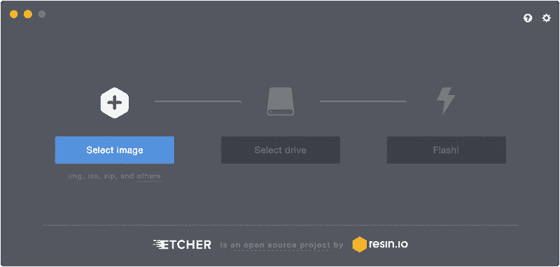](https://etcher.io/)

对于 Mac 用户来说， [ApplePi Baker 软件](https://www.tweaking4all.com/software/macosx-software/macosx-apple-pi-baker/)是上传新图像到 SD 卡的好方法。它会在启动时询问管理员密码。选择左侧平面上的 SD 卡，然后将您的图像上传到 Pi ingredients:IMG 食谱部分。单击恢复备份，等待进度条完成，您就完成了。该计划甚至弹出卡你，所以可以拉它的权利，并插入到你的 Pi。

[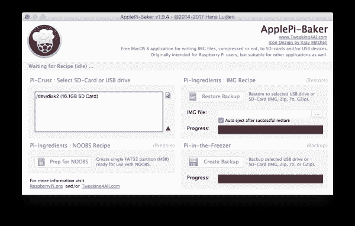](https://cdn.sparkfun.com/assets/learn_tutorials/6/7/6/applepi_baker.png)

在本教程的其余部分，我们将假设您已经通过直接安装映像或使用 Noobs 安装了 Raspbian。本教程对于大多数具有图形用户界面的基于 Linux 的系统应该也能很好地工作，但是位置可能会稍有不同

## 使用 Raspbian

现在你已经让你的板运行起来了，让我们来复习一些基础知识。

Raspbian 和大多数 Raspberry Pi 操作系统将基于 Linux。不要太害怕。不得不记住大量命令或者需要键入`:wq`来保存和退出文本编辑器的日子已经一去不复返了。Linux 现在有一个类似于 Windows 或 MacOS 的图形用户界面(GUI ),虽然你可能想学习一些基本的命令和快捷方式，但你通常可以不使用它们。

在 Raspbian 的左上角你会看到六个图标。首先是覆盆子。这基本上与 Windows 机器上的“开始菜单”相同。点击这个，你会看到一个所有已安装程序的菜单，以及关机选项。第二个图标看起来像一个地球仪，它是网络浏览器。然后是“文件管理器”、“终端”、“T0”、“Mathematica”、“T1”，最后是“T2”、“Wolfram”、“T3”。

[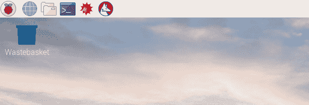](https://cdn.sparkfun.com/assets/learn_tutorials/6/7/6/2017-06-30-204910_1824x984_scrot.jpg)*Raspbian OS Desktop as of 07/2017.*

### 更改您的密码

需要记住的重要一点是，Linux 有用户名和密码。默认的 Raspian 用户 id 是“pi”，密码是“raspberry”。第二件要记住的事情是，我知道你的用户 id 和密码，很多其他不怀好意的人也知道。不要以为所有的病毒都是为全尺寸计算机编写的。Raspberry Pis 往往具有合理的处理能力，并且经常在无事可做的情况下运行。最近出现了专门编写的病毒，这些病毒使用默认用户名和密码登录 Raspberry Pis，并利用其处理能力挖掘加密货币。

所以，我们要做的第一件事是更改密码。打开终端窗口并键入

pi @ raspberrypi:~ $sudo passwd

系统将提示您输入新密码。输入你的新密码，你的个人识别码将会更加安全，不受不速之客的侵扰。

## 连接到 WiFi

接下来，让我们将 Pi Zero W 连接到互联网。如果您有一个 Pi Zero，您将需要添加一个 Wifi 加密狗到您的主板的 USB 端口(此时您可能需要一个 USB 集线器)。Pi Zero W 内置 WiFi，因此您不需要任何外部 WiFi 加密狗。

要在您的 Pi 上启用 WiFi，请查看桌面的右上角，并左键单击 WiFi 图标。您应该会看到可用网络的列表。选择您想要的一个。如果是安全网络，它会提示您输入密码。输入网络密码，然后按确定。给它几秒钟，你应该连接。一旦连接，桌面上的 WiFi 符号将改变其外观。如果你在 Noobs 里设置了 WiFi，这个信息就已经保存了。添加 WiFi 并不是绝对必要的，但如果你打算进行更新，你将需要互联网接入。

## 更新软件

我们要做的最后一件事是更新主板上的所有软件包。包不断更新，谁都不想落后。幸运的是，Linux 使用了包管理器。我们要做的就是告诉我们的包经理更新一切，然后坐以待毙。让我们回顾一下将要使用的几个命令。如果终端还没有打开，请打开它。键入以下内容。

pi @ raspberrypi:~ $sudo apt-get 更新

这将获取最新的软件包信息，并告诉软件包管理器需要更新什么。

*   `sudo`(也叫超级用户)是一个你会经常看到的命令，专门针对高安全性命令。它确保您拥有正确的权限。根据设置，它可能会也可能不会要求您输入密码。

*   `apt-get`是包管理器，`update`是我们给它的命令。

pi @ raspberrypi:~ $sudo apt-get 升级

这将下载和升级所有的软件包。请注意，升级需要一段时间。它还会提示你这是否真的是你要做的，正确答案是“Y”。

pi @ raspberrypi:~ $sudo shut down-r now

*   `shutdown`将关闭机器。`-r`告诉它关机后重启，`now`告诉它现在重启(`15`会告诉机器 15 分钟后关机)。

如果不输入 sudo 会怎样？Linux 会给你一个错误，说你没有权限做某事。一般来说，如果你看到这个错误，停下来想一想，你是否真的知道自己在做什么，并想去做。如果是这样，那么在命令前面键入 sudo，然后重试。

### 其他有用的 Linux 命令

在终端命令行中使用的其他一些有用的命令:

*   打印工作目录，如果你不确定你在哪个文件夹，这个会告诉你你在文件系统的什么位置。

*   `ls` - List，这将向你显示文件夹的内容。要显示所有文件，包括隐藏的文件，键入`ls -a`显示所有文件/文件夹。或者，输入`ls -al`会显示所有文件/文件夹以及它们的权限设置。

*   这是你改变目录的方法。`cd foldername`会将您移至该文件夹。`cd ..`会支持你上一级。`cd ~`将带您回到您的主目录。

*   `passwd` -这将允许您更改您的密码

*   这代表手动。在命令前键入 man 以获得如何使用它的摘要。

*   这将打开一个简单易用的基本文本编辑器。

此时，您应该可以像对待任何其他计算机一样与您的 Raspberry Pi 进行交互。你可以自学 Linux 的优点，学习 Python，编程 GPIO 引脚，设置 minecraft 服务器，构建网络存储系统，游戏控制台，或媒体中心，或者只是在网上冲浪。

## 资源和更进一步

### 树莓资源

*   [树莓派主页](https://www.raspberrypi.org/)
*   [树莓派图片](https://www.raspberrypi.org/downloads/)
*   [Raspberry Pi 零和零 W 图形数据表](https://cdn.sparkfun.com/assets/learn_tutorials/6/7/6/PiZero_1.pdf)
*   [Etcher](https://etcher.io/) - MacOS，Windows 和 Linux 应用程序的编写。img 文件到 SD 卡。
*   [ApplePi Baker](https://www.tweaking4all.com/software/macosx-software/macosx-apple-pi-baker/) - MacOS 应用程序编写。img 文件到 SD 卡。

想把树莓派变成一个软件狗吗？检查一下 [Pi Zero USB Stem](https://www.sparkfun.com/products/14526) :

[https://www.youtube.com/embed/V4CPzlqh3hI/?autohide=1&border=0&wmode=opaque&enablejsapi=1](https://www.youtube.com/embed/V4CPzlqh3hI/?autohide=1&border=0&wmode=opaque&enablejsapi=1)

更多树莓派的乐趣，查看这些其他伟大的 SparkFun 教程。

 [### FLIR 轻子连接指南](https://learn.sparkfun.com/tutorials/flir-lepton-hookup-guide) See the invisible world of infrared radiation using the FLIR Dev Kit and Raspberry Pi.[Favorited Favorite](# "Add to favorites") 8 [### 吠叫互动宠物监视器](https://learn.sparkfun.com/tutorials/bark-back-interactive-pet-monitor) Monitor and interact with pets through this dog bark detector project based on the Raspberry Pi 7 [### 预先组装的 40 引脚 Pi 楔形连接指南](https://learn.sparkfun.com/tutorials/preassembled-40-pin-pi-wedge-hookup-guide) Using the Preassembled Pi Wedge to prototype with the Raspberry Pi B+.[Favorited Favorite](# "Add to favorites") 7 [### PiRetrocade 装配指南](https://learn.sparkfun.com/tutorials/piretrocade-assembly-guide-) Build your very own retro gaming controller with a Raspberry Pi using the SparkFun PiRetrocade Kit 9**