# 面向青少年的 SmartLED 盾入门

> 原文：<https://learn.sparkfun.com/tutorials/getting-started-with-the-smartled-shield-for-teensy>

## 介绍

用于 Teensy 的 PixelMatix [SmartLED 保护罩可以轻松连接到 RGB LED 矩阵面板！该屏蔽可以轻松连接到驱动显示器所需的 16 个引脚，连接外部 5V 电源为显示器和 Teensy 供电，并将 Teensy 的自由信号传输到一个方便的接头。](https://www.sparkfun.com/products/15046)

[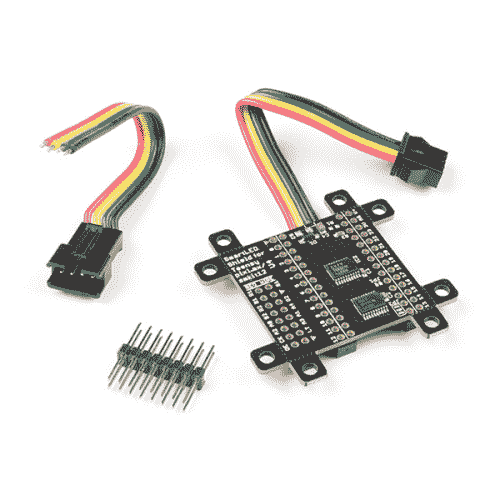](https://www.sparkfun.com/products/retired/15046) 

### [聪明盾 V4 给少年 3](https://www.sparkfun.com/products/retired/15046)

[Retired](https://learn.sparkfun.com/static/bubbles/ "Retired") DEV-15046

SmartLED Shield V4 是 SmartMatrix Shield 的下一个版本，为您的青少年和您的……

1 **Retired**[Favorited Favorite](# "Add to favorites") 3[Wish List](# "Add to wish list")**Note:** This tutorial was originally written for the SmartLED Shield V4 for Teensy 3\. If you are using a Teensy 4, we recommend using the [SmartLED Shield V5](https://www.sparkfun.com/products/17521) or an adapter. Make sure to check out the [compatibility notes](https://learn.sparkfun.com/tutorials/getting-started-with-the-smartled-shield-for-teensy#compatibility-with-teensy-4) for more information.

[Compatibility with Teensy 4](https://learn.sparkfun.com/tutorials/getting-started-with-the-smartled-shield-for-teensy#compatibility-with-teensy-4)

在本教程中，我们将探讨 SmartLED 屏蔽提供的一些使用不同 RGB LED 矩阵面板尺寸的示例。

[](https://cdn.sparkfun.com/assets/learn_tutorials/8/3/1/Different_RGB_LED_Matrix_Panel_Examples_with_the_SmartLED_Shield_for_Teensy_.gif)

### 所需材料

要跟随本教程，您将需要以下材料。你可能不需要所有的东西，这取决于你拥有什么。将它添加到您的购物车，通读指南，并根据需要调整购物车。

#### RGB LED 矩阵面板

你需要一个面板。以下内容已经过测试，可以与提供的示例一起使用。

[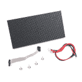](https://www.sparkfun.com/products/14718) 

将**添加到您的[购物车](https://www.sparkfun.com/cart)中！**

### [RGB LED 矩阵面板- 32x64](https://www.sparkfun.com/products/14718)

[In stock](https://learn.sparkfun.com/static/bubbles/ "in stock") COM-14718

这些 32x64 RGB LED 面板是为项目增添色彩的绝佳起点！您可以创建动画，游戏，或使用…

$53.50 $37.451[Favorited Favorite](# "Add to favorites") 15[Wish List](# "Add to wish list")****[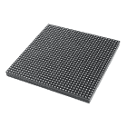](https://www.sparkfun.com/products/14646) 

将**添加到您的[购物车](https://www.sparkfun.com/cart)中！**

### [RGB LED 矩阵面板- 32x32](https://www.sparkfun.com/products/14646)

[In stock](https://learn.sparkfun.com/static/bubbles/ "in stock") COM-14646

这些 32x32 RGB LED 面板是开始为项目增添色彩的绝佳选择！您可以创建动画，游戏，或使用…

$48.50[Favorited Favorite](# "Add to favorites") 24[Wish List](# "Add to wish list")****[](https://www.sparkfun.com/products/14824) 

将**添加到您的[购物车](https://www.sparkfun.com/cart)中！**

### [RGB LED 矩阵面板- 64x64](https://www.sparkfun.com/products/14824)

[Only 7 left!](https://learn.sparkfun.com/static/bubbles/ "only 7 left!") COM-14824

这些 64x64 RGB LED 面板是为项目增添色彩的绝佳起点！您可以创建动画，游戏，或使用…

$85.95 $73.063[Favorited Favorite](# "Add to favorites") 13[Wish List](# "Add to wish list")**************Heads Up!** The comments in the example code indicate that he known working *width* are: “*32, 64, 96, 128*”. As for the *height*, the known working sizes are: *16, 32, 48, 64*. If you [dig into the library](https://github.com/pixelmatix/SmartMatrix/blob/master/src/SmartMatrix3.h#L132), the known working scan rates are:

*   1:16，32 行
*   1:8，16 行
*   1:32，64 行

For example, if you are trying to use a 32x32 panel with a 1:8 scan rate, it may not display as expected.

#### 很小的

要使用 SmartLED shield 控制面板，您需要一个 [Teensy](https://www.sparkfun.com/categories/267) 。您可以使用 Teensy 4.0，但您需要确保您使用的是合适的 SmartLED Shield 版本或适配器。

[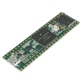](https://www.sparkfun.com/products/14057) 

### [Teensy 3.6](https://www.sparkfun.com/products/14057)

[Out of stock](https://learn.sparkfun.com/static/bubbles/ "out of stock") DEV-14057

Teensy 3.6 更大，更快，能够进行更复杂的项目，特别是其板载微型 SD 卡端口和升级…

15[Favorited Favorite](# "Add to favorites") 39[Wish List](# "Add to wish list")[](https://www.sparkfun.com/products/13736) 

### [Teensy 3.2](https://www.sparkfun.com/products/13736)

[Out of stock](https://learn.sparkfun.com/static/bubbles/ "out of stock") DEV-13736

Teensy 3.2 是一款试验板友好型开发板，在一个小小的封装中提供了大量功能。

68[Favorited Favorite](# "Add to favorites") 83[Wish List](# "Add to wish list")[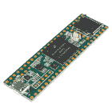](https://www.sparkfun.com/products/14055) 

### [Teensy 3.5](https://www.sparkfun.com/products/14055)

[Out of stock](https://learn.sparkfun.com/static/bubbles/ "out of stock") DEV-14055

Teensy 3.5 更大，更快，能够进行更多的项目，特别是其板载微型 SD 卡端口。

8[Favorited Favorite](# "Add to favorites") 20[Wish List](# "Add to wish list")[](https://www.sparkfun.com/products/14056) 

### [田晶晶 3.5(头球)](https://www.sparkfun.com/products/14056)

[Out of stock](https://learn.sparkfun.com/static/bubbles/ "out of stock") DEV-14056

Teensy 3.5 更大，更快，能够进行更多的项目，特别是其板载微型 SD 卡端口和预焊…

1[Favorited Favorite](# "Add to favorites") 12[Wish List](# "Add to wish list")[](https://www.sparkfun.com/products/14058) 

### [田晶晶 3.6(头球)](https://www.sparkfun.com/products/14058)

[Out of stock](https://learn.sparkfun.com/static/bubbles/ "out of stock") DEV-14058

Teensy 3.6 更大，更快，能够进行更复杂的项目，特别是其板载微型 SD 卡端口，ARM 公司…

7[Favorited Favorite](# "Add to favorites") 22[Wish List](# "Add to wish list")

#### 力量

你还需要一个 5V 的电源。5V 墙壁适配器和筒式插孔适配器是将电源连接到面板和 Teensy 的最简单方法。然而，根据你如何给面板供电，还有其他的[方法。](https://learn.sparkfun.com/tutorials/rgb-panel-hookup-guide#powering-the-panel)

[](https://www.sparkfun.com/products/15312) 

将**添加到您的[购物车](https://www.sparkfun.com/cart)中！**

### [【墙上适配器电源- 5VDC，2A(桶形插孔)](https://www.sparkfun.com/products/15312)

[In stock](https://learn.sparkfun.com/static/bubbles/ "in stock") TOL-15312

这是一个高品质的开关“壁式电源”交流到 DC 5V 2000 毫安桶形插座壁式电源，专为…

$6.502[Favorited Favorite](# "Add to favorites") 13[Wish List](# "Add to wish list")****[](https://www.sparkfun.com/products/10288) 

将**添加到您的[购物车](https://www.sparkfun.com/cart)中！**

### [DC 筒式千斤顶适配器——母](https://www.sparkfun.com/products/10288)

[In stock](https://learn.sparkfun.com/static/bubbles/ "in stock") PRT-10288

此适配器允许您将筒式插孔连接器连接到裸线。一端有螺丝端子，另一端有一个 5.5…

$3.501[Favorited Favorite](# "Add to favorites") 24[Wish List](# "Add to wish list")********[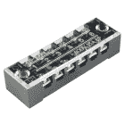](https://www.sparkfun.com/products/retired/13061) 

### [【端子排- 6 位(15A，600V)](https://www.sparkfun.com/products/retired/13061)

[Retired](https://learn.sparkfun.com/static/bubbles/ "Retired") PRT-13061

这种 6 位螺丝端子板提供了一种将电线连接到单一连接点的简单方法。这些块允许…

2 **Retired**[Favorited Favorite](# "Add to favorites") 10[Wish List](# "Add to wish list")[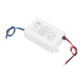](https://www.sparkfun.com/products/retired/14601) 

### [指 LED 开关电源-5v 直流，5A](https://www.sparkfun.com/products/retired/14601)

[Retired](https://learn.sparkfun.com/static/bubbles/ "Retired") TOL-14601

这是一款 40W 单输出开关电源，来自 Mean Well，专为 LED 应用而设计

**Retired**[Favorited Favorite](# "Add to favorites") 8[Wish List](# "Add to wish list")[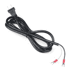](https://www.sparkfun.com/products/14603) 

将**添加到您的[购物车](https://www.sparkfun.com/cart)中！**

### [iPixel 墙壁适配电缆-双端子【NA】](https://www.sparkfun.com/products/14603)

[In stock](https://learn.sparkfun.com/static/bubbles/ "in stock") CAB-14603

iPixel 的这些墙壁适配器电缆在一端与一个标准 NA 插头和两个绝缘扁平端子连接器端接

$3.95 $2.96[Favorited Favorite](# "Add to favorites") 1[Wish List](# "Add to wish list")****[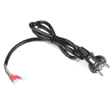](https://www.sparkfun.com/products/14093) 

将**添加到您的[购物车](https://www.sparkfun.com/cart)中！**

### [Adam Tech 墙壁适配器电缆-三端子(欧盟)](https://www.sparkfun.com/products/14093)

[In stock](https://learn.sparkfun.com/static/bubbles/ "in stock") CAB-14093

这些 Adam Tech 墙壁适配器电缆的一端是标准欧洲(CEE 7/7)插头，另一端是三根绝缘电缆

$4.95 $2.95[Favorited Favorite](# "Add to favorites") 1[Wish List](# "Add to wish list")****[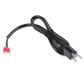](https://www.sparkfun.com/products/retired/14092) 

### [【Adam Tech 墙壁适配器电缆-三端子【NA】](https://www.sparkfun.com/products/retired/14092)

[Retired](https://learn.sparkfun.com/static/bubbles/ "Retired") CAB-14092

这些 Adam Tech 墙壁适配器电缆的一端是标准北美(NEMA 5 - 15P)插头，另一端是三个 in…

**Retired**[Favorited Favorite](# "Add to favorites") 4[Wish List](# "Add to wish list")[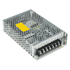](https://www.sparkfun.com/products/retired/14098) 

### [指井开关电源-5v 直流，20A](https://www.sparkfun.com/products/retired/14098)

[Retired](https://learn.sparkfun.com/static/bubbles/ "Retired") TOL-14098

这是一款来自 Mean Well 的 100W 单输出开关电源。这种电源非常可靠，能够输出很高的电压

**Retired**[Favorited Favorite](# "Add to favorites") 19[Wish List](# "Add to wish list")********[Click Here for More 5V Power Supplies!](https://www.sparkfun.com/search/results?term=5v+power)

#### 附加组件

根据您的设置和控制面板的方式，您可能需要这些附加组件。

[](https://www.sparkfun.com/products/116) 

将**添加到您的[购物车](https://www.sparkfun.com/cart)中！**

### [破开头球——直击](https://www.sparkfun.com/products/116)

[In stock](https://learn.sparkfun.com/static/bubbles/ "in stock") PRT-00116

一排标题-打破适应。40 个引脚，可切割成任何尺寸。用于定制 PCB 或通用定制接头。

$1.7520[Favorited Favorite](# "Add to favorites") 133[Wish List](# "Add to wish list")****[](https://www.sparkfun.com/products/10215) 

将**添加到您的[购物车](https://www.sparkfun.com/cart)中！**

### [USB micro-B 线- 6 脚](https://www.sparkfun.com/products/10215)

[In stock](https://learn.sparkfun.com/static/bubbles/ "in stock") CAB-10215

USB 2.0 型到微型 USB 5 针。这是一种新的、更小的 USB 设备连接器。微型 USB 连接器大约是…

$5.5014[Favorited Favorite](# "Add to favorites") 21[Wish List](# "Add to wish list")****[](https://www.sparkfun.com/products/13004) 

将**添加到您的[购物车](https://www.sparkfun.com/cart)中！**

### [microSD USB 读卡器](https://www.sparkfun.com/products/13004)

[In stock](https://learn.sparkfun.com/static/bubbles/ "in stock") COM-13004

这是一个很棒的微型 USB 读卡器。只需将您的 microSD 卡滑入 USB 连接器内部，然后将它插入 USB 连接器

$5.5011[Favorited Favorite](# "Add to favorites") 11[Wish List](# "Add to wish list")****[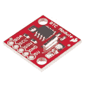](https://www.sparkfun.com/products/12708) 

将**添加到您的[购物车](https://www.sparkfun.com/cart)中！**

### [SparkFun 实时时钟模块](https://www.sparkfun.com/products/12708)

[In stock](https://learn.sparkfun.com/static/bubbles/ "in stock") BOB-12708

这是 SparkFun 实时时钟(RTC)模块，这个小突破使用 DS1307 来跟踪当前年份…

$17.5018[Favorited Favorite](# "Add to favorites") 48[Wish List](# "Add to wish list")****[](https://www.sparkfun.com/products/553) 

将**添加到您的[购物车](https://www.sparkfun.com/cart)中！**

### [挣脱男头球-直角](https://www.sparkfun.com/products/553)

[In stock](https://learn.sparkfun.com/static/bubbles/ "in stock") PRT-00553

一排直角公接头-断开以适合。40 个引脚，可切割成任何尺寸。用于定制 PCB 或一般定制…

$2.255[Favorited Favorite](# "Add to favorites") 47[Wish List](# "Add to wish list")****[](https://www.sparkfun.com/products/15051) 

将**添加到您的[购物车](https://www.sparkfun.com/cart)中！**

### [microSD 卡-16GB(10 类)](https://www.sparkfun.com/products/15051)

[22 available](https://learn.sparkfun.com/static/bubbles/ "22 available") COM-15051

这是一个 10 级 16GB microSD 存储卡，非常适合容纳单板计算机和多种…

$19.95[Favorited Favorite](# "Add to favorites") 4[Wish List](# "Add to wish list")************ ************### 工具

根据您的设置，您可能需要钳子、烙铁、焊料和[通用焊接附件](https://www.sparkfun.com/categories/49)。

[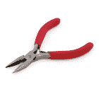](https://www.sparkfun.com/products/8793) 

将**添加到您的[购物车](https://www.sparkfun.com/cart)中！**

### [尖嘴钳](https://www.sparkfun.com/products/8793)

[In stock](https://learn.sparkfun.com/static/bubbles/ "in stock") TOL-08793

迷你钳子。这些是很棒的小钳子！任何爱好者或电气工程师的必备。对于插入设备至关重要…

$3.501[Favorited Favorite](# "Add to favorites") 22[Wish List](# "Add to wish list")****[](https://www.sparkfun.com/products/14228) 

### [威勒 WLC100 焊台](https://www.sparkfun.com/products/14228)

[Out of stock](https://learn.sparkfun.com/static/bubbles/ "out of stock") TOL-14228

Weller 的 WLC100 是一款多功能的 5 瓦至 40 瓦焊台，非常适合业余爱好者、DIY 爱好者和学生。…

2[Favorited Favorite](# "Add to favorites") 17[Wish List](# "Add to wish list")[](https://www.sparkfun.com/products/9325) 

将**添加到您的[购物车](https://www.sparkfun.com/cart)中！**

### [无铅焊料- 100 克线轴](https://www.sparkfun.com/products/9325)

[In stock](https://learn.sparkfun.com/static/bubbles/ "in stock") TOL-09325

这是带有水溶性树脂芯的无铅焊料的基本线轴。0.031 英寸规格，100 克。这是一个好主意…

$9.957[Favorited Favorite](# "Add to favorites") 33[Wish List](# "Add to wish list")****[](https://www.sparkfun.com/products/9146) 

将**添加到您的[购物车](https://www.sparkfun.com/cart)中！**

### [SparkFun 迷你螺丝刀](https://www.sparkfun.com/products/9146)

[In stock](https://learn.sparkfun.com/static/bubbles/ "in stock") TOL-09146

这只是你的基本可逆螺丝刀口袋大小！有平头和十字头可供选择。配有别针和…

$1.053[Favorited Favorite](# "Add to favorites") 11[Wish List](# "Add to wish list")****** ******### 推荐阅读

如果您不熟悉以下概念，我们建议您在继续之前查看这些教程。

[](https://learn.sparkfun.com/tutorials/how-to-power-a-project) [### 如何为项目提供动力](https://learn.sparkfun.com/tutorials/how-to-power-a-project) A tutorial to help figure out the power requirements of your project.[Favorited Favorite](# "Add to favorites") 67[](https://learn.sparkfun.com/tutorials/what-is-an-arduino) [### 什么是 Arduino？](https://learn.sparkfun.com/tutorials/what-is-an-arduino) What is this 'Arduino' thing anyway? This tutorials dives into what an Arduino is and along with Arduino projects and widgets.[Favorited Favorite](# "Add to favorites") 50[](https://learn.sparkfun.com/tutorials/rgb-panel-hookup-guide) [### RGB 面板连接指南](https://learn.sparkfun.com/tutorials/rgb-panel-hookup-guide) Make bright, colorful displays using the 32x16, 32x32, and 32x64 RGB LED matrix panels. This hookup guide shows how to hook up these panels and control them with an Arduino.[Favorited Favorite](# "Add to favorites") 11[](https://learn.sparkfun.com/tutorials/getting-started-with-the-teensy) [### 青少年入门](https://learn.sparkfun.com/tutorials/getting-started-with-the-teensy) Basic intro to the Teensy line of products, with soldering and programming suggestions.[Favorited Favorite](# "Add to favorites") 7

## 硬件概述

### 微小的足迹

SmartLED 保护罩可以轻松连接到 RGB LED 矩阵面板。与 RGB LED 矩阵面板上的 16 针接线相反，您只需将屏蔽夹在 Teensy 和 IDC 连接器之间！板的顶部是您插入带有直标题的 Teensy 的地方。屏蔽层的底部包括阴接头，以实现安全连接。

| [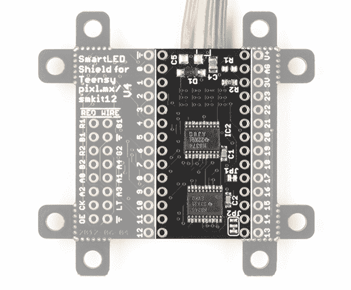](https://cdn.sparkfun.com/assets/learn_tutorials/8/3/1/15046-SmartLED_Shield-Teensy-Footprint.jpg) | [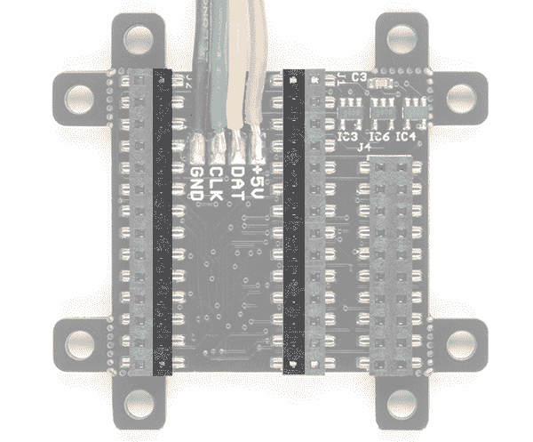](https://cdn.sparkfun.com/assets/learn_tutorials/8/3/1/15046-SmartLED_Shield_Back-Teensy-Footprint.jpg) |
| *青少年足迹(俯视图)* | *青少年足迹(仰视图)* |

与极小的尺寸相邻的是额外的引脚，这些引脚是断开的，便于制作原型或将导线直接焊接到屏蔽层上。

| [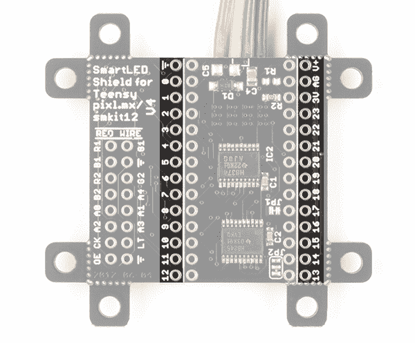](https://cdn.sparkfun.com/assets/learn_tutorials/8/3/1/15046-SmartLED_Shield-Teensy-Breakout-Pins.jpg) | [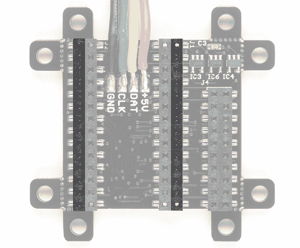](https://cdn.sparkfun.com/assets/learn_tutorials/8/3/1/15046-SmartLED_Shield_Back-Teensy-Breakout-Pins.jpg) |
| *小针脚断开(俯视图)* | *小针脚断开(仰视图)* |

有关 SmartLED 矩阵屏蔽上保留引脚的更多信息，请查看下图，了解用于驱动 RGB LED 矩阵面板和 APA102 LEDs 的引脚。

[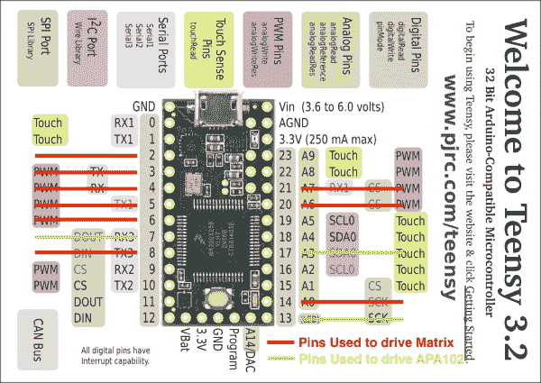](https://cdn.sparkfun.com/assets/learn_tutorials/8/3/1/SmartLedV4TeensyPinout.png)*[Image Courtesy](http://docs.pixelmatix.com/SmartMatrix/shield-v4.html#smartled-shield-v4-for-teensy-specs) of PJRC and PixelMatix***📌 Tip:** If you are prototyping with the shield, try grabbing some square header pins, jumper wires, and a breadboard to connect. Make sure that the jumper wires are **square pins** for a secure connection with the female header populated on the bottom of the SmartLED shield.

[](https://www.sparkfun.com/products/9140) 

将**添加到您的[购物车](https://www.sparkfun.com/cart)中！**

### [跳线高级 6" M/F 装 10 根](https://www.sparkfun.com/products/9140)

[In stock](https://learn.sparkfun.com/static/bubbles/ "in stock") PRT-09140

这是一个 SparkFun 独家！这些都是 155 毫米长，26 美国线规跳线终止作为男性到女性。用这些来跳离…

$4.501[Favorited Favorite](# "Add to favorites") 16[Wish List](# "Add to wish list")****[](https://www.sparkfun.com/products/8431) 

将**添加到您的[购物车](https://www.sparkfun.com/cart)中！**

### [跳线高级 6 "米/米装 10 根](https://www.sparkfun.com/products/8431)

[In stock](https://learn.sparkfun.com/static/bubbles/ "in stock") PRT-08431

这是一个 SparkFun 独家！这些是 155 毫米长、26 AWG 跳线，两端都有公接头。用这些来跳离…

$4.502[Favorited Favorite](# "Add to favorites") 11[Wish List](# "Add to wish list")****[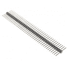](https://www.sparkfun.com/products/12693) 

将**添加到您的[购物车](https://www.sparkfun.com/cart)中！**

### [【断开接头】- 40 针公(长居中，PTH，0.1”)](https://www.sparkfun.com/products/12693)

[In stock](https://learn.sparkfun.com/static/bubbles/ "in stock") PRT-12693

这是一排 40 个分离接头，间隔 0.1 英寸，两侧有长销。此标题在以下情况下特别有用…

$1.051[Favorited Favorite](# "Add to favorites") 16[Wish List](# "Add to wish list")****[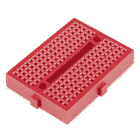](https://www.sparkfun.com/products/12044) 

将**添加到您的[购物车](https://www.sparkfun.com/cart)中！**

### [【试验板-迷你模块化(红色)](https://www.sparkfun.com/products/12044)

[In stock](https://learn.sparkfun.com/static/bubbles/ "in stock") PRT-12044

这个红色迷你试验板是你的小项目原型的好方法！有了 170 个并列点，就有足够的空间来建立…

$4.50[Favorited Favorite](# "Add to favorites") 12[Wish List](# "Add to wish list")******** ********### IDC 连接器

屏蔽断开了 RGB LED 矩阵面板的 IDC 引脚。只需将丝印与面板输入对齐，然后像背包一样叠起来。或者，您可以使用 IDC 电缆和附带的 2x8 长、居中的接头引脚。只要确保将电缆的红线与标有**红线的丝网对齐即可。**

| [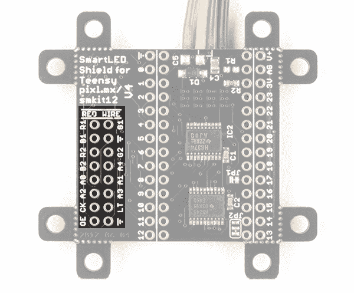](https://cdn.sparkfun.com/assets/learn_tutorials/8/3/1/15046-SmartLED_Shield-RGB_LED_Matrix_Panel_IDC.jpg) | [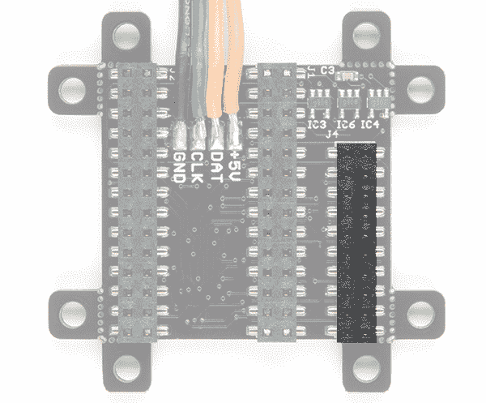](https://cdn.sparkfun.com/assets/learn_tutorials/8/3/1/15046-SmartLED_Shield-Back-RGB-LED-Matrix-Panel-IDC.jpg) |
| *IDC 连接器(俯视图)* | *IDC 连接器(仰视图)* |

### APA102 LED

屏蔽包括额外的 4 针 JST SM 连接器对，用于[连接 SmartLED 屏蔽的 APA102 LEDs 带或矩阵](http://docs.pixelmatix.com/SmartMatrix/shield-v4.html#smartled-shield-v4-for-teensy-assembly-apa102-leds)。

[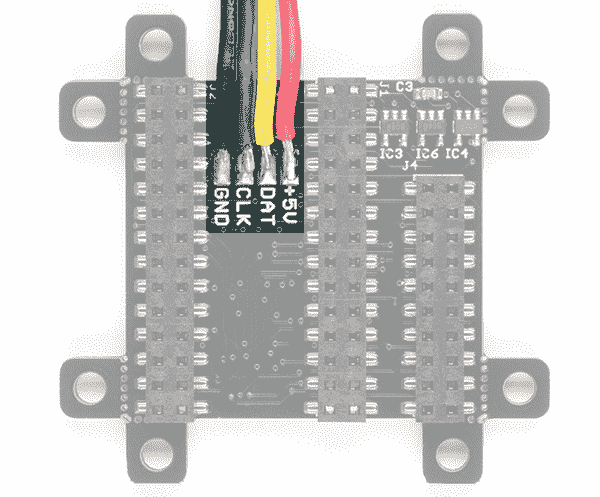](https://cdn.sparkfun.com/assets/learn_tutorials/8/3/1/15046-SmartLED_Shield-APA102-Addressable_LED-Strip.jpg)

### 可拆卸安装孔

屏蔽板的每个角上都有安装孔。使用 IDC 电缆时，它们可用于安装屏蔽层。它们被老鼠咬过，粘在木板上。每个安装孔都可以用[钳子](https://www.sparkfun.com/products/8793)拆除。下图突出显示了安装孔，沿鼠咬处有红线。

[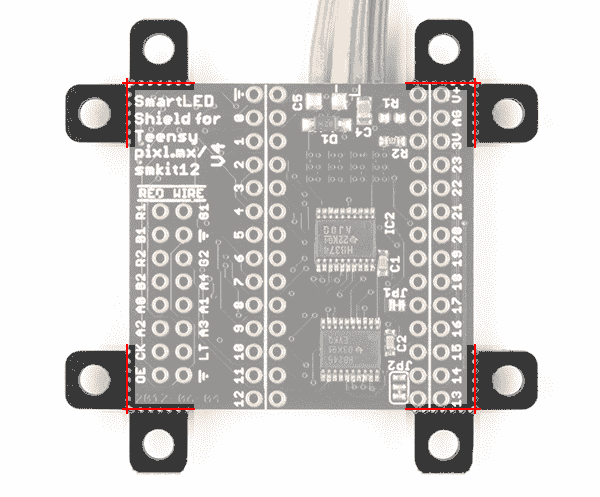](https://cdn.sparkfun.com/assets/learn_tutorials/8/3/1/15046-SmartLED_Shield-04_snappable_mounting_holes.jpg)📌 **Tip:** If you are using a Teensy 3.5/3.6 with headers populated beyond the 1x14 pins along the side of a Teensy, you will need to snap off the mounting hole below pin 13.

[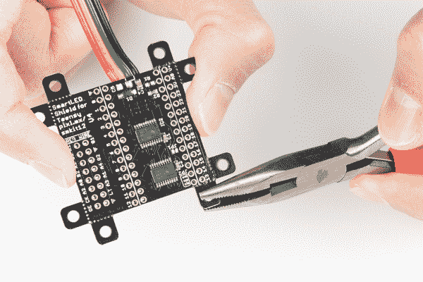](https://cdn.sparkfun.com/assets/learn_tutorials/8/3/1/15046-SmartLED_Shield-Mounting-Holes-Mousebites.jpg)

### ADDX 引脚和逻辑电平

某些面板可能需要 **5V 逻辑电平**，这对于 [Teensy 的输出引脚](https://www.pjrc.com/teensy/techspecs.html)来说可能是不够的。虽然您可以尝试将所有 16 个引脚从 Teensy 连接到 IDC 电缆，但这不是最可靠的连接。面板可能会闪烁或无法正常显示。SmartLED 屏蔽设计包括电平转换缓冲器，以安全可靠地控制 RGB LED 矩阵面板。

[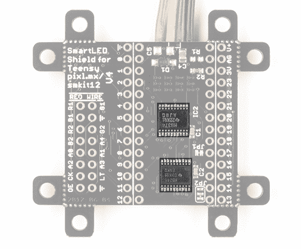](https://cdn.sparkfun.com/assets/learn_tutorials/8/3/1/15046-SmartLED_Shield-04_level_shifting_buffers.jpg)

## 与 Teensy 4 的兼容性

Teensy 4 和 Teensy 3 的引脚不同。确保您使用的是用于 Teensy 4 的 [SmartLED Shield V5 或带有 SmartLED Shield V4](https://www.sparkfun.com/products/17521) 的 [Teensy 4 适配器。](https://community.pixelmatix.com/t/teensy-4-0-released/498/32)

[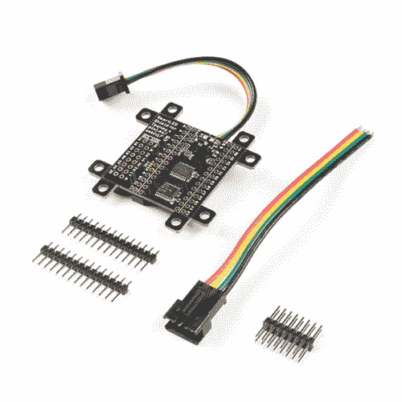](https://www.sparkfun.com/products/17521) 

将**添加到您的[购物车](https://www.sparkfun.com/cart)中！**

### [SmartLED Shield-Teensy 4](https://www.sparkfun.com/products/17521)

[30 available](https://learn.sparkfun.com/static/bubbles/ "30 available") DEV-17521

SmartLED Shield 使 Teensy 4 能够将高质量图形驱动到 HUB75 RGB LED 面板，具有 36 位颜色和 240 Hz 参考频率…

$19.952[Favorited Favorite](# "Add to favorites") 2[Wish List](# "Add to wish list")** **以下是用于 Teensy 4 的 SmartLED Shield V5 上的保留引脚。

[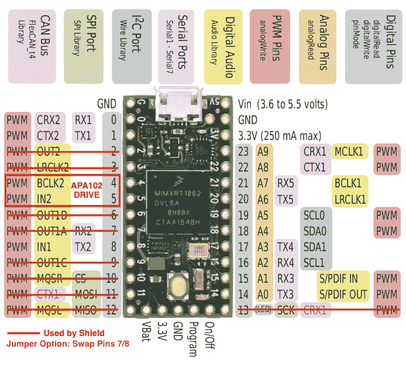](https://cdn.sparkfun.com/assets/learn_tutorials/8/3/1/SmartLedT4V5TeensyPinout.png)*[Image Courtesy](http://docs.pixelmatix.com/SmartMatrix/shield-t4.html#smartled-shield-for-teensy-4-specs) of PJRC and PixelMatix*

确保通过删除示例代码顶部附近的单行注释“`//`”来取消对以下行的注释。

```
language:c
//#include <MatrixHardware_Teensy4_ShieldV5.h> // SmartLED Shield for Teensy 4 (V5) 
```

根据您使用的硬件，您可能需要调整连接和其他代码行。

## 硬件装配

**Note:** This tutorial was originally written for the SmartLED Shield V4 for Teensy 3\. If you are using the SmartLED Shield V5 and Teensy 4, the methods to install headers and stacking the shield is the same.

如果你还没有，在连接之前，在你的 Teensy 上[焊接](https://learn.sparkfun.com/tutorials/how-to-solder-through-hole-soldering)插头。我们将在 Teensy 的每一侧使用 1x14 的插头引脚，但您也可以根据您的设置焊接额外的引脚或导线。

[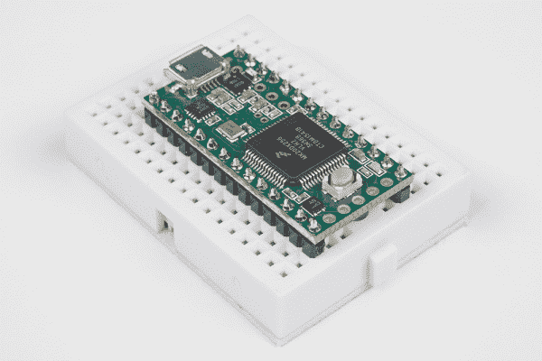](https://cdn.sparkfun.com/assets/learn_tutorials/5/5/4/Proto_Pedal_Tutorial_Images-56.jpg)

在焊接和去除 Teensy 上的焊剂后，将 Teensy 堆叠在 SmartLED 护罩上。确保 USB 连接器朝向与 4 针 JST SM 连接器相同的方向。

[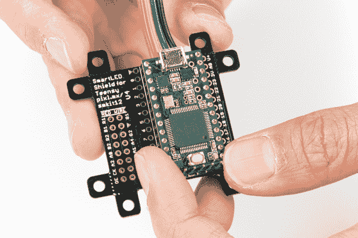](https://cdn.sparkfun.com/assets/learn_tutorials/8/3/1/Stack_Teensy_on_Smart_LED_Shield.jpg)

将 SmartLED 护罩上的 IDC 连接器分线点与 RGB LED 矩阵面板上的 IDC 连接器对齐。IDC 连接器的位置取决于配线架的制造商，但通常它位于相对于向右上方箭头的左侧。

[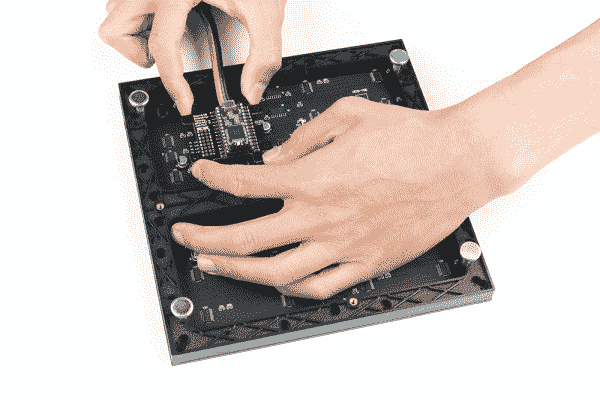](https://cdn.sparkfun.com/assets/learn_tutorials/8/3/1/Add_SmartLED_shield_on_RGB_LED_Matrix_Panel_IDC_Connector.jpg)**Tip:** If you received a shield with the 2x8 header pins installed and decide to add the shield to the RGB LED matrix panel's IDC connector as a backpack, you can remove the headers from the shield. Otherwise, you can leave the 2x8 header pins inserted and connect using the IDC cable.

[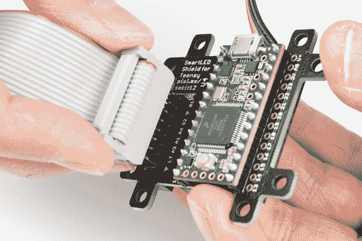](https://cdn.sparkfun.com/assets/learn_tutorials/8/3/1/Smart_LED_Shield_IDC_Cable.jpg)

连接后，RGB LED 矩阵面板的背面应类似于下图。在左边，一个 Teensy 3.2 连接到一个 64x64 的面板，面板上有 3 毫米间距的 led。在右边，Teensy 3.6 用于 32x32，间距为 6mm 的 led。

| [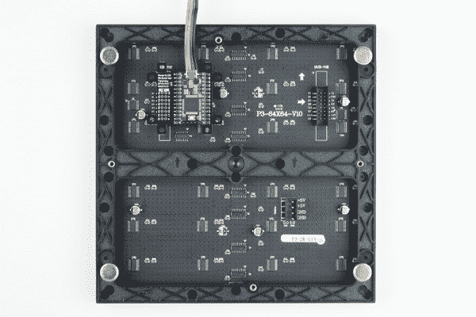](https://cdn.sparkfun.com/assets/learn_tutorials/8/3/1/Smart_LED_Shield_for_Teensy_3.2_Stacked_RGB_LED_Matrix_Panel.jpg) | [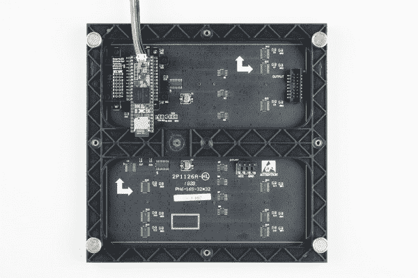](https://cdn.sparkfun.com/assets/learn_tutorials/8/3/1/Smart_LED_Shield_for_Teensy_3.6_Stacked__RGB_LED_Matrix_Panel.jpg) |

如果还没有，请将一个 [5V 电源](https://www.sparkfun.com/products/12889)连接到 RGB LED 矩阵面板的电源线上。如果您使用的电源带有筒状插孔，您可以使用[母筒状插孔适配器](https://www.sparkfun.com/products/10288)和[螺丝刀](https://www.sparkfun.com/products/9146)在铁锹和筒状插孔之间进行快速连接。

[](https://cdn.sparkfun.com/assets/d/3/1/8/7/52a9fe68757b7f74598b4567.jpg)

连接应该类似于下图。根据您的 5V 电源，您的[设置可能略有不同](https://learn.sparkfun.com/tutorials/rgb-panel-hookup-guide#powering-the-panel)。

[](https://cdn.sparkfun.com/assets/a/a/7/a/5/52a9fe67757b7f71118b4567.jpg)

然后将 RGB 矩阵面板的极化电源线滑入其相应的配套连接器。红线应连接到 **5V** 引脚，黑线连接到 **GND** 引脚。

[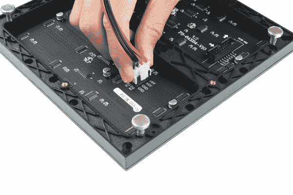](https://cdn.sparkfun.com/assets/learn_tutorials/8/3/1/Connect_Power_Cable.jpg)

在本教程中，我们将把 **5V USB 电源**直接连接到 Teensy 的 USB 连接器上。这与为 RGB LED 矩阵面板供电的电源是分开的。根据您的设置，您可以通过连接到 Teensy 的 V+和 GND 引脚或 APA102 JST SM 连接器，使用 RGB LED 矩阵面板正在使用的同一电源。只要确保电压调节在 5V。

[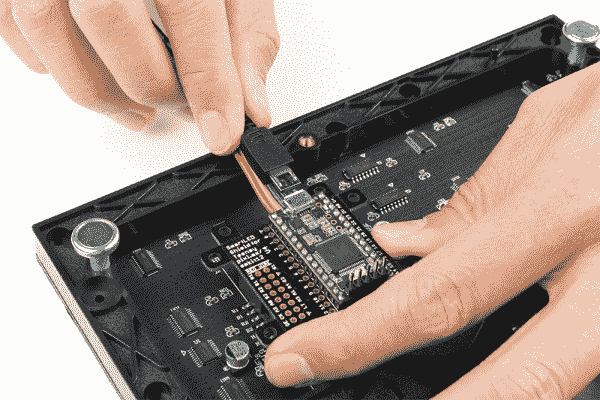](https://cdn.sparkfun.com/assets/learn_tutorials/8/3/1/Smart_LED_Shield_Teensy_USB_Cable.jpg)**Heads up!** When powering the Teensy via the micro-B connector, make sure to hold the connector against the PCB with your thumb and index finger while inserting the cable to avoid pulling the USB connector off. If you plan on moving the panel frequently, you may want to consider connecting power the Teensy from either the SmartLED shield's V+ and GND pins, or the APA102 JST SM connector.

### 替代连接

如果您在 SmartLED 库的范围内，可以选择将配线架以菊花链形式连接在一起。只需将第一个面板的输出连接到第二个面板的输入。确保通过 4 针极化连接器为每个面板供电。

[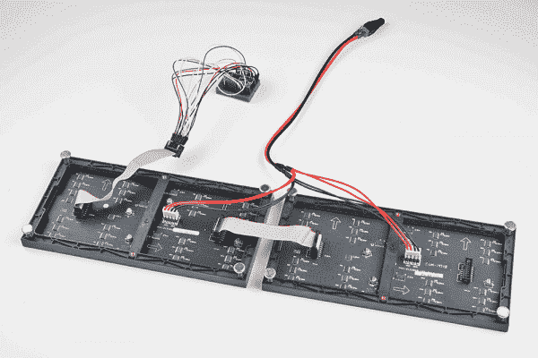](https://cdn.sparkfun.com/assets/learn_tutorials/8/3/1/Teensy_Alternative_Connection_RGB_LED_Matrix_Panel.jpg)

如前所述，您可以尝试将所有 16 个引脚从 Teensy 连接到配线架的 IDC 电缆。这不是最可靠的连接。接线错误或连接松动的可能性更高。有关尝试连接的更多信息，请查看下表。由于额外的第 5 个地址引脚，当布线到 64x64 面板时，这种连接是不可能的。

| 面板引脚标签 | 电缆连接器引脚# | 青少年 3 | 笔记 |
| R0 | one | Two | 红色数据
*(第 1-16 列)* |
| 静止状态 | Two | five | 绿色数据
*(第 1-16 列)* |
| B0 | three | six | 蓝色数据
*(第 1-16 列)* |
| GND | four | GND | 地面 |
| R1 | five | Twenty-one | 红色数据
*(第 17-32 列)* |
| G1 | six | eight | 绿色数据
*(第 17-32 列)* |
| B1 | seven | Twenty | 蓝色数据
*(第 17-32 列)* |
| GND | eight | GND | 地面 |
| A | nine | Fifteen | 多路分解输入 A0 |
| B | Ten | Twenty-two | 多路分解输入 A1 |
| C | Eleven | Twenty-three | 多路分解输入 A2 |
| D | Twelve | nine | E3 E1 的 Demux 输入*(仅 32x32 面板)* |
| CLK | Thirteen | Fourteen | LED 驱动时钟 |
| 机顶盒(Set-Top-Box) | Fourteen | 3, 8 | LED 驱动器闩锁 |
| 古英语 | Fifteen | four | LED 驱动器输出使能 |
| GND | Sixteen | GND | 地面 |

**Heads up!** When manually wiring the board to the panel, make sure that the latch pin is connected to both pins 3 and 8 on the Teensy! Doesn't the SmartLED shield sound good right about now?

[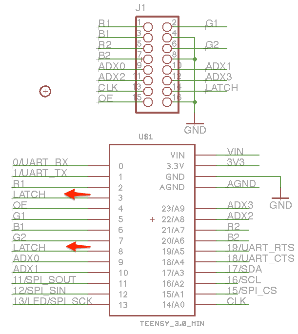](https://cdn.sparkfun.com/assets/learn_tutorials/8/3/1/PixelMatix_SmartLEDShieldTeensyManualWiring.jpg)
*Image courtesy of [PixelMatix: Manually Connecting Teensy and Panel](http://docs.pixelmatix.com/SmartMatrix/shieldref.html#smartled-shield-formerly-smartmatrix-shield-overview-technical-details-manually-connecting-teensy-and-panel)*

## 软件安装

**注意:**此示例假设您在桌面上使用的是最新版本的 Arduino IDE。如果这是你第一次使用 Arduino，请回顾我们关于[安装 Arduino IDE 的教程。](https://learn.sparkfun.com/tutorials/installing-arduino-ide)如果您之前没有安装 Arduino 库，请查看我们的[安装指南。](https://learn.sparkfun.com/tutorials/installing-an-arduino-library)

### Teensyduino 附加组件

如果你以前没有使用过 Teensy，你需要从 PJRC 下载并安装 Arduino IDE 的扩展 Teensyduino。这也将安装主板的驱动程序。在继续之前，请遵循安装附加组件的说明。

[PJRC: Teensyduino Download Page](https://www.pjrc.com/teensy/td_download.html)

### 安装库

Louis Beaudoin 编写了一个惊人的库来控制 RGB LED 矩阵面板。您可以通过 Arduino 库管理器获得这些库。搜索 **SmartMatrix** ，你应该可以安装最新版本。如果你喜欢手动下载这些库，你也可以从 [GitHub 库](https://github.com/pixelmatix/SmartMatrix)中获取它们:

[GitHub Pixelmatix - SmartMatrix (ZIP)](https://github.com/pixelmatix/SmartMatrix/archive/master.zip)**Note:** The library was named **SmartMatrix3** in the past. It is now named **SmartMatrix** as of release **4.0.3**.**Compatibility:** When trying to use other examples that were written for other platforms (such as the [Serial Paint Example](https://learn.sparkfun.com/tutorials/rgb-panel-hookup-guide#example-code) for Arduino Uno or Arduino Mega), they may not be compatible with the Teensy due to the different chipset.

#### 库概述

有关这些函数的概述，请查看 GitHub 存储库中的 *MIGRATION.md* 文件中的文档。

[GitHubPixelmatix Docs - SmartMatrix Library Overview](https://github.com/pixelmatix/SmartMatrix/blob/master/MIGRATION.md)

## 例子:功能演示！

SmartMatrix 库中有几个 SmartLED 保护罩的例子。在本教程中，我们将重点介绍其中的三个例子。

### 功能演示！

让我们从功能演示开始。安装好库后，在 Arduino IDE 中点击**文件** > **实例**>**smart matrix**>**feature demo . ino**。打开后，至少有 4 行要修改，才能使示例与您的矩阵面板一起工作:

*   取消 MatrixHardware 配置的一行注释
    *   例如，如果您使用的是 shield V4，则为“T0”；如果您使用的是 shield V5，则为“T1”
*   将`kMatrixWidth`调整到面板的宽度
*   将`kMatrixHeight`调整到面板的高度
*   根据 [MatrixCommonHub75.h 头文件](https://github.com/pixelmatix/SmartMatrix/blob/master/src/MatrixCommonHub75.h#L41)中记录的面板扫描速率调整`kPanelType`

**Heads Up!** The comments in the example code indicate that the known working *width* are: “*32, 64, 96, 128*”. As for the *height*, the known working sizes are: *16, 32, 48, 64*. If you [dig into the library](https://github.com/pixelmatix/SmartMatrix/blob/master/src/MatrixCommonHub75.h#L41), the known working scan rates are:

*   16 行 1:8 扫描
*   1:16 扫描 32 行
*   1:32 扫描 64 行

For example, if you are trying to use a 32x32 panel with a 1:8 scan rate, it may not display as expected.

* * *

### 64x64 面板，扫描速率为 1:32

让我们尝试修改示例代码，使其能够以 1:32 的扫描速率处理 64x64 的面板。需要 SmartLED 屏蔽来处理 IDC 连接器上额外的第 5 个 ADDX 引脚。

#### 所需零件

To follow this example, you would will need the following materials. You may not need everything though depending on what you have. Add it to your cart, read through the guide, and adjust the cart as necessary.******************************************