# SparkFun Blynk 板入门

> 原文：<https://learn.sparkfun.com/tutorials/getting-started-with-the-sparkfun-blynk-board>

## 介绍

[SparkFun Blynk 板–ESP8266](https://www.sparkfun.com/products/13794)是你进入应用程序控制的仙境 [Blynk](http://www.blynk.cc/) 的硬件网关。将 Blynk 板与 Blynk 应用程序(在您的 iOS 或 Android 设备上)结合起来，将允许您通过手机控制 led，在该给植物浇水时发送推文，监控当地天气状况，等等！

[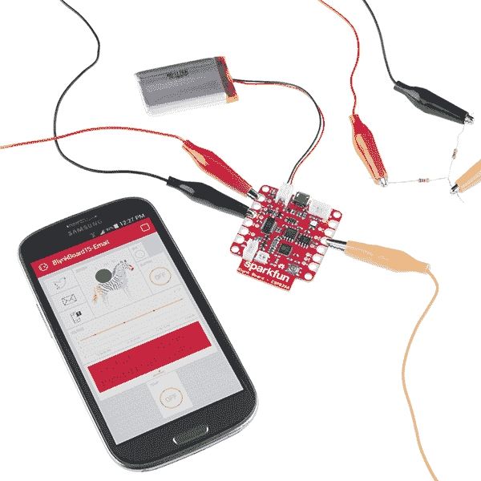](https://www.sparkfun.com/products/13794)

[https://www.youtube.com/embed/dSkWyDKjl_g/?autohide=1&border=0&wmode=opaque&enablejsapi=1](https://www.youtube.com/embed/dSkWyDKjl_g/?autohide=1&border=0&wmode=opaque&enablejsapi=1)

本教程将解释如何让你的 Blynk 板连接到本地 Wi-Fi 网络——在一个称为**供应** - *和*连接到 Blynk 应用内的**项目的过程中。一旦你完成了教程，你就已经创建了你的第一个项目:一个斑马控制的多色 led(当你看到它的时候就会明白了)。**

### 收集装备

要跟随本教程，您需要以下实物和数字商品:

**[SparkFun Blynk 板-ESP8266](https://www.sparkfun.com/products/13794)**-Blynk 板完全程序化-准备开始 Blynk。你所需要做的就是将它连接到 Wi-Fi 和你的 Blynk 账户。您可以单独获得 Blynk 板，也可以从物联网入门套件中获得。

[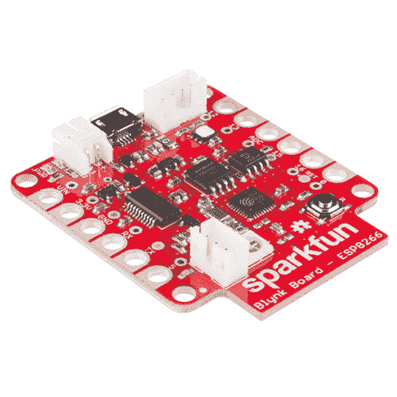](https://www.sparkfun.com/products/retired/13794) 

### [spark fun Blynk Board-ESP8266](https://www.sparkfun.com/products/retired/13794)

[Retired](https://learn.sparkfun.com/static/bubbles/ "Retired") WRL-13794

SparkFun Blynk 板是专为与 Blynk 移动应用程序中的“小部件”一起工作而设计的，用于创建您的下一个…

16 **Retired**[Favorited Favorite](# "Add to favorites") 28[Wish List](# "Add to wish list")[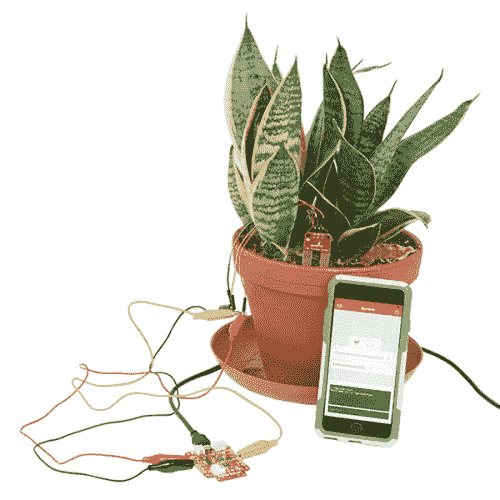](https://www.sparkfun.com/products/retired/14682) 

### [带 Blynk 板的 SparkFun 物联网入门套件](https://www.sparkfun.com/products/retired/14682)

[Retired](https://learn.sparkfun.com/static/bubbles/ "Retired") KIT-14682

带 Blynk 板的 SparkFun 物联网入门套件是了解物联网技术世界的绝佳方式，它包含…

2 **Retired**[Favorited Favorite](# "Add to favorites") 4[Wish List](# "Add to wish list")

Blynk 板还包括一张 **Blynk 订阅代码卡**，你需要用它将 Blynk 板连接到你的 Blynk 账户(并为其充电！).

**[Micro-B USB 电缆](https://www.sparkfun.com/products/10215)**-Blynk 板可以通过另一端连接到计算机、笔记本电脑或 [USB 墙壁适配器](https://www.sparkfun.com/products/11456)的 USB 电缆供电。

 

将**添加到您的[购物车](https://www.sparkfun.com/cart)中！**

### [USB micro-B 线- 6 脚](https://www.sparkfun.com/products/10215)

[In stock](https://learn.sparkfun.com/static/bubbles/ "in stock") CAB-10215

USB 2.0 型到微型 USB 5 针。这是一种新的、更小的 USB 设备连接器。微型 USB 连接器大约是…

$5.5014[Favorited Favorite](# "Add to favorites") 21[Wish List](# "Add to wish list")**** 

将**添加到您的[购物车](https://www.sparkfun.com/cart)中！**

### [【墙上适配器电源- 5VDC，2A (USB Micro-B)](https://www.sparkfun.com/products/15311)

[In stock](https://learn.sparkfun.com/static/bubbles/ "in stock") TOL-15311

这是一个高品质的开关“壁式电源”AC 到 DC 5V 2000mA USB 微型 B 壁式电源，专为 S…

$6.50[Favorited Favorite](# "Add to favorites") 2[Wish List](# "Add to wish list")**** 

将**添加到您的[购物车](https://www.sparkfun.com/cart)中！**

### [【USB Micro-B 线缆-6】](https://www.sparkfun.com/products/13244)

[In stock](https://learn.sparkfun.com/static/bubbles/ "in stock") CAB-13244

这是一根 USB 2.0 型转 Micro-B 型 5 针黑色电缆。你知道，通常配在手机上的迷你 B 连接器，可以…

$2.103[Favorited Favorite](# "Add to favorites") 7[Wish List](# "Add to wish list")****[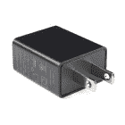](https://www.sparkfun.com/products/11456) 

将**添加到您的[购物车](https://www.sparkfun.com/cart)中！**

### [USB 壁式充电器- 5V，1A(黑色)](https://www.sparkfun.com/products/11456)

[In stock](https://learn.sparkfun.com/static/bubbles/ "in stock") TOL-11456

现在 USB 越来越多地被作为一种电源连接标准来实现，但是你并不总是在 han 上有一台计算机…

$4.502[Favorited Favorite](# "Add to favorites") 10[Wish List](# "Add to wish list")******** ********#### 用锂聚合物电池给 Blynk 板供电

Blynk 板配备了 LiPo 电池支持，实现真正的无线 Blynk。USB 端口旁边的 2 针白色 JST 连接器可与各种 SparkFun LiPo 电池配合使用。这些电池有多种容量可供选择，但我们推荐 400 毫安时、[850 毫安时](https://www.sparkfun.com/products/341)或[1000 毫安时](https://www.sparkfun.com/products/339)的电池。

仍然建议使用 USB 线——它用来给电池充电。但是一旦你发现 Blynk 项目要求你的主板不要绑在墙上或电脑上，一定要考虑给它配备电池。

Blynk 应用程序——Blynk 智能手机应用程序有两种版本: [iOS](https://itunes.apple.com/us/app/blynk-control-arduino-raspberry/id808760481?ls=1&mt=8) 和 [Android](https://play.google.com/store/apps/details?id=cc.blynk) 。在继续之前，请将该应用程序下载到您的智能设备上:

[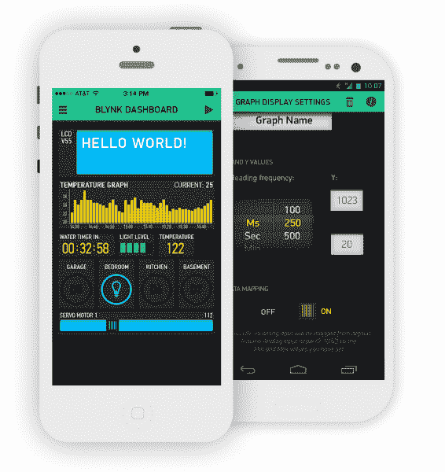](https://cdn.sparkfun.com/assets/learn_tutorials/4/8/6/Blynk-app-example.png)

Blynk 应用程序兼容运行 iOS 7.0+的 iDevices，以及运行 4.0 以上或等于 4.0 的任何版本的 Android。

**本地互联网连接的无线(Wi-Fi)网络**-Blynk 板配备了 Wi-Fi 支持，应该能够连接到大多数家庭无线网络: **2.4GHz** Wi-Fi 网络，这些网络要么是开放的(无密码)，要么受到 WPA、WPA-2 或 WEP 认证的保护。

[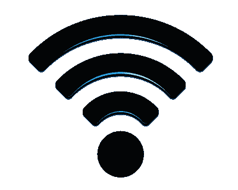](https://cdn.sparkfun.com/assets/learn_tutorials/4/8/6/Wireless-icon-1000.png)

注意，Blynk 板不能连接双频 Wi-Fi 路由器的 5GHz 频段。如果您的 Wi-Fi 路由器有两个可见选项，如`HOME-AB12-2.4`和`HOME-AB12-5`，请将 Blynk 板连接到“2.4”选项。

## 给 Blynk 板上电

一旦你从上面收集了所有的材料，是时候启动 Blynk 板了！抓住你的 **USB 线**，将一端插入电脑或 USB 墙上适配器，将另一端插入 Blynk 板。

[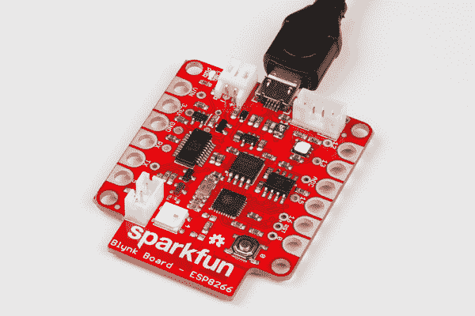](https://cdn.sparkfun.com/assets/learn_tutorials/4/8/6/power-01-pluggedin.jpg)*Blynk Board plugged in, PWR LED (in the upper-left of this image) is illuminated*

您应该立即看到小的**红色“PWR”LED**亮起，紧接着大的 RGB LED 随机闪烁。

## 识别您的 Blynk 板

虽然 Blynk 板的 RGB 闪烁起初看起来可能是随机的，但它会遵循一种重复的模式——四种颜色的独特**序列，包括红色、绿色、蓝色、紫色或黄色，中间有一个长时间的停顿。这个颜色代码将有助于识别你的董事会，以防你不是镇上唯一一个建立 Blynk 董事会的人。**

**与该颜色代码**匹配的四个字符将被添加到您的 Blynk 板名称中。例如，如果 RGB LED 闪烁蓝色、绿色、红色、绿色图案..

[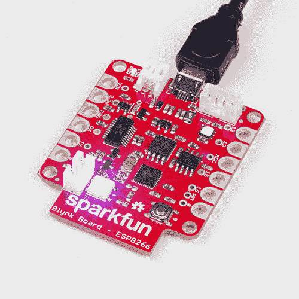](https://cdn.sparkfun.com/assets/learn_tutorials/4/8/6/identify-gif-bgrg.gif)

...Blynk 板的名称将是 **BlynkMe-BGRG** 。

下表记录了哪种颜色与哪种字符相匹配。

| 颜色 | Blynk 名称字符 |
| 红色 | 稀有 |
| 格林（姓氏）；绿色的 | G |
| 蓝色 | B |
| 紫色 | P |
| 黄色 | Y |

然而，这并不是 RGB LED 的全部功能！

## RGB 状态代码

在设置过程中，Blynk 板上的 RGB LED 将成为您了解其灵魂的窗口。电路板使用这种多色 LED 来指示各种状态模式。如果您不清楚 RGB 颜色代码的含义，请参考下表:

| RGB 颜色 | 闪烁速度 | 状态 | 笔记 |
| 紫色 | ● | 中等(2Hz) | 连接到 Blynk 板的设备 | 验证您的手机(或其他人的手机)是否连接到 Blynk 板。 |
| 蓝色 | ● | 快速(4Hz) | 连接到 Wi-Fi 网络 | 向它发送信息后，Blynk 板将尝试连接到您的 Wi-Fi 网络长达 30 秒。 |
| 布林克绿色 | ● | 慢速(1Hz) | 正在连接到 Blynk 云 | 连接到 Wi-Fi 网络后，Blynk 板将与 Blynk 服务器建立连接。 |
| 布林克绿色 | ● | 平滑淡入/淡出 | 连接到 Blynk | 成功连接 Wi-Fi 和 Blynk 后，这就是一切正常的标志！LED 将继续“呼吸”，直到你告诉它做别的事情。 |
| 黄色 | ● | 慢速(1Hz) | 重新连接到 Blynk | 连接问题应该会自行解决，但是 Blynk 板可能会在闪烁黄色时没有响应。如果它持续呈黄色超过一分钟，请尝试重新接通 Blynk 板的电源。 |
| 怀特（姓氏） | ● | 中等(2Hz) | Blynk 板等待配置 | 如果你的 Blynk 板无法连接到 Wi-Fi 或 Blynk，它将处于这种模式，等待你按下按钮。在[重新配置 Blynk 板部分](https://learn.sparkfun.com/tutorials/getting-started-with-the-sparkfun-blynk-board#reconfiguring-a-blynk-board)中有更多相关信息 |

## 布建 Blynk 板

为了将 Blynk 板连接到你的本地 Wi-Fi 网络和 Blynk 应用程序，你需要向它发送一些信息，包括你的 Wi-Fi 网络的**名称和密码**。这是一个称为供应的过程。

#### 供应？

在供应过程中，我们将使用智能手机、笔记本电脑或计算机直接(通过 Wi-Fi)连接到 Blynk 板。一旦连接，你的智能设备将发送必要的数据，并告诉 Blynk 板去连接到你的互联网连接的无线网络和 Blynk。

Blynk 板最初被配置为作为一个 **Wi-Fi 接入点**(缩写为“AP”，有点像路由器)。智能手机或支持 Wi-Fi 的电脑可以简单地连接到 Blynk 板，使用 Blynk 应用程序或浏览器，将所有必要的信息发送给它。Blynk 板收到该信息后，它会从 AP 转换到 Wi-Fi 设备，并连接到您的 Wi-Fi 网络。

### Blynk 二维码卡

Blynk 板有许多备份配置选项，但最简单的方法是通过 Blynk 应用程序。Blynk 应用的 iOS 和 Android 版本都支持 Blynk 板供应。你所需要的只是你的 Blynk 电路板上的 **Blynk 二维码卡**。

[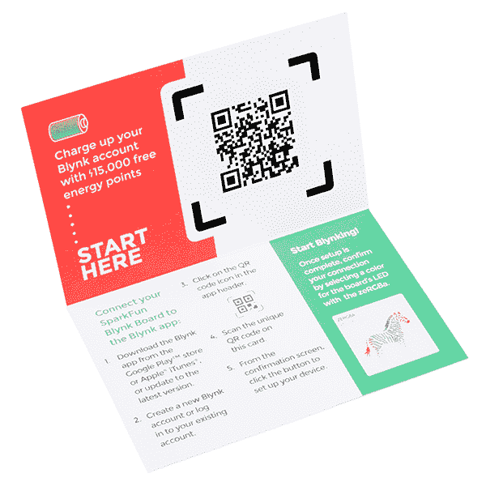](https://cdn.sparkfun.com/assets/learn_tutorials/4/8/6/13794-qrcard-02.jpg)

[https://www.youtube.com/embed/21PA6_nbS8U/?autohide=1&border=0&wmode=opaque&enablejsapi=1](https://www.youtube.com/embed/21PA6_nbS8U/?autohide=1&border=0&wmode=opaque&enablejsapi=1)

#### 不要扔掉你的 Blynk 二维码卡！

虽然你只能从 15，000 能量点中受益一次，但如果需要的话，二维码卡可以用来**重新提供**你的 Blynk 板。我们建议你暂时把它留在手上，以防万一！

### 智能手机(或平板电脑)上的配置

每个操作系统中的设置过程看起来和感觉上都有点不同。**选择**下面的一个部分，获取您的手机(或平板电脑)操作系统的路线。

[iOS 配置](#iosProvision) [安卓配置](#android-provision)

### iOS 供应

如果你还没有，从应用商店下载 [Blynk 应用。然后打开它，**创建一个账户**并登录。](https://itunes.apple.com/us/app/blynk-control-arduino-raspberry/id808760481?ls=1&mt=8)

如果你已经在手机上安装了 Blynk 应用程序，请确保将它的**更新到最新版本**！

#### 第一步:扫描 Blynk 板二维码

点击 Blynk 应用右上角的二维码图标。

[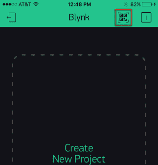](https://cdn.sparkfun.com/assets/learn_tutorials/4/8/6/ios-01-OpenQR-cropped.PNG)

然后在你的手机摄像头上扫描你的 Blynk 板卡上的二维码。Blynk 应该会弹出一个新的屏幕——恭喜你，你已经有了一些新的 Blynk 能量可以玩了！

[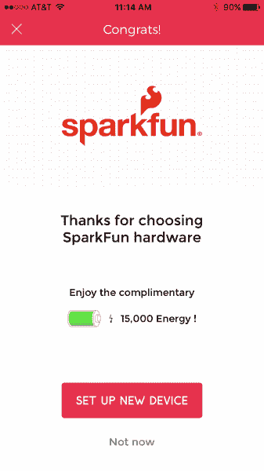](https://cdn.sparkfun.com/assets/learn_tutorials/4/8/6/ios-02-congrats.PNG)

#### 步骤 2:连接到 Blynk 板

从“恭喜你！”页面，点击**设置新设备**，通读“飞行前清单”，并且——只要你的 **Blynk 板通电**并且闪烁唯一的颜色代码——**点击继续**。

通读“连接到设备”屏幕，并点击**打开 Wi-Fi 设置**切换到您的 iDevice 的 Wi-Fi 设置。

你可能需要等待几秒钟，让你的设备扫描网络，但你最终应该会看到一个名为 **BlynkMe-CCCC** 的 Wi-Fi 网络。如果那个颜色代码与你的 Blynk 板的图案匹配，**选择那个网络**。

连接过程可能需要一分钟才能完成——不过最终，您应该会在 BlynkMe 网络旁边看到一个**复选标记。当设备连接到 Blynk 板时，Blynk 板将开始**闪烁紫色**，比以前更快。**

[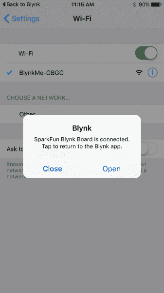](https://cdn.sparkfun.com/assets/learn_tutorials/4/8/6/ios-07-BlynkConnect.PNG)

Blynk 应用程序可能会(也可能不会)弹出一个通知，表明它已经检测到与 BlynkMe 网络的连接。如果有，**打开**。如果通知没有弹出，但是你在 BlynkMe 网络旁边有一个勾号，点击左上角的**回到 Blynk** 。

#### 步骤 3:将 Blynk 板连接到 Wi-Fi/Blynk

在下一个屏幕上，**输入您的 Wi-Fi 网络的名称和密码**。输入密码时，点击眼睛图标(眼睛图标？)如果你想/需要出示密码。

[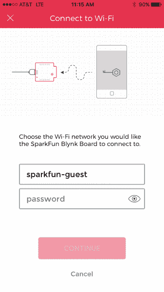](https://cdn.sparkfun.com/assets/learn_tutorials/4/8/6/ios-08-wifi-enter.PNG)

在*中准确地输入你的网络名称和密码*(两个字段都区分大小写，注意不要在末尾添加任何空格)，点击**继续**。

#### 步骤 4:监控 Blynk 板的 RGB LED

当它连接到 Wi-Fi 和 Blynk 时，Blynk 板将使用 RGB LED 让您了解它的进度。

点击“继续”后，你的 Blynk 板应该开始**闪烁蓝色**，这表明它正在尝试**连接到你的 Wi-Fi 网络**。这个过程通常需要 10 秒左右，但如果 30 秒后仍未连接，它将放弃并返回设置模式。

如果供应过程没有按计划进行-无论是无法连接到 Wi-Fi 还是 Blynk-请尝试重新接通 Blynk 板的电源(拔下并重新插入 USB 电缆)，并从头开始。

如果您仍然无法通过应用程序进行配置，您可能需要使用[替代配置流程](https://learn.sparkfun.com/tutorials/getting-started-with-the-sparkfun-blynk-board#troubleshooting)。

Blynk 板成功连接到你的 Wi-Fi 网络后，会与 **Blynk Cloud** 建立连接。在这个过程中，它会闪烁一种柔和的蓝绿色。

最后，在成功的 Blynk 云连接之后，您应该看到“完成！”页面。RGB 应该平滑地淡入淡出。如果是这样，**点击 Done** ，Blynk 将带您进入一个新的 Blynk 板项目。前往本教程的 **[做 zeRGBa 部分](https://learn.sparkfun.com/tutorials/getting-started-with-the-sparkfun-blynk-board#do-the-zergba)** 开始 Blynking！

[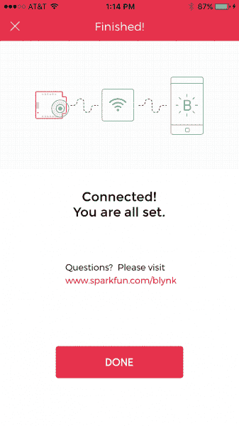](https://cdn.sparkfun.com/assets/learn_tutorials/4/8/6/ios-10-success.PNG)

如果您在配置 Blynk 板时遇到问题，请尝试再试一次。**通过拔下并插回 Blynk 板**的电源，对其进行循环供电。然后从步骤 1 开始重试。

如果你仍然运气不佳，请参考本教程的[故障排除](https://learn.sparkfun.com/tutorials/getting-started-with-the-sparkfun-blynk-board#troubleshooting)部分。

### Android 供应

如果你还没有，从 Google Play 商店下载 [Blynk 应用程序。然后打开它，**创建一个账户**并登录。](https://play.google.com/store/apps/details?id=cc.blynk)

或者，如果你已经在手机上安装了 Blynk 应用程序，请确保将它的**更新到最新版本**！

#### 第一步:扫描 Blynk 板二维码

点击 Blynk 应用右上角的二维码图标(或主屏幕上的大图标)。

[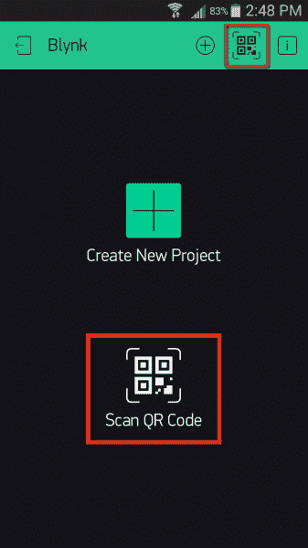](https://cdn.sparkfun.com/assets/learn_tutorials/4/8/6/android-01-qr.png)

然后扫描你手机上的 Blynk 板卡上的二维码。Blynk 应该会弹出一个新的屏幕——恭喜你，你已经有了一些新的 Blynk 能量可以玩了！

[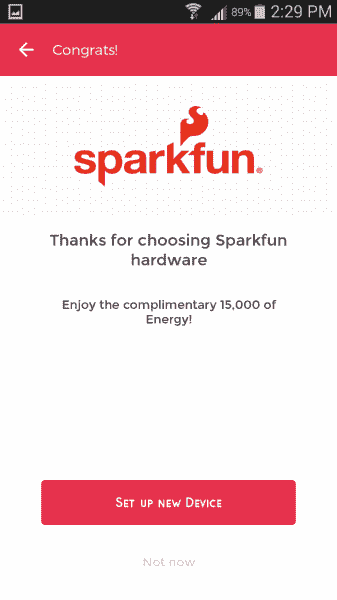](https://cdn.sparkfun.com/assets/learn_tutorials/4/8/6/android-02-welcome.png)

#### 步骤 2:连接到 Blynk 板

从“恭喜你！”页面，点击**设置新设备**，通读[飞行前清单](https://cdn.sparkfun.com/assets/learn_tutorials/4/8/6/android-03-preflight.png)，并且——只要你的 Blynk 板通电并且闪烁唯一的颜色代码——**点击继续**。

下一页是您选择 Blynk 板的地方。滚动设备列表，选择一个名为 **BlynkMe-CCCC** 的网络(可能已经选择了一个)。确保颜色代码后缀与 Blynk 板的 RGB LED 闪烁相匹配。

[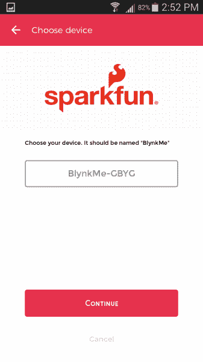](https://cdn.sparkfun.com/assets/learn_tutorials/4/8/6/android-04-chooseDevice.png)

点击**继续**。该应用程序应该尝试连接到您的 Blynk 板。几秒钟后，你应该会看到 Blynk 板的 RGB LED **闪烁紫色**——比以前更快——应用程序应该会给你一个“连接到 BlynkMe”页面。

[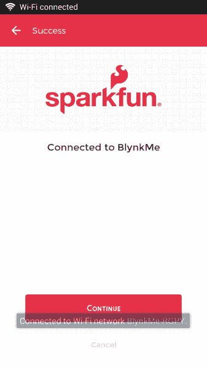](https://cdn.sparkfun.com/assets/learn_tutorials/4/8/6/android-05-connected.png)

从那里点击**继续**进行 Wi-Fi 设置。

📌**故障排除提示:**在 app 中连接板卡时，可能需要在手机的 wifi 设置中手动连接板卡。暂时跳出 Blynk 应用，找到手机的 **Wi-Fi** 设置。在安卓系统上，它应该在手机设置的 Wi-Fi 部分。

让你的手机扫描无线网络，寻找以 **BlynkMe-** 开头的内容。最后四个字符应该与你的棋盘闪烁的四色序列相匹配。将您的手机连接到“柏林克姆-CCCC”网络。成功连接后，您的 Blynk 板应该开始闪烁紫色。一旦你看到这个状态，回到 Blynk 应用程序继续。这里有一个[。pdf 文件](https://cdn.sparkfun.com/assets/learn_tutorials/4/8/6/Blynk_App_Instructions.pdf)附截图供参考。

如果您仍然无法通过应用程序进行配置，您可能需要使用[替代配置流程。](https://learn.sparkfun.com/tutorials/getting-started-with-the-sparkfun-blynk-board#troubleshooting)

#### 步骤 3:将 Blynk 板连接到 Wi-Fi/Blynk

在下一个屏幕上，从滚动条中选择您的 Wi-Fi 网络。然后输入您的网络密码。

[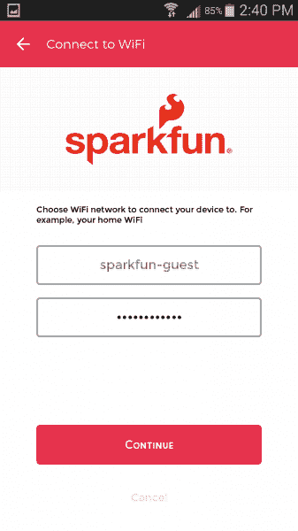](https://cdn.sparkfun.com/assets/learn_tutorials/4/8/6/android-06-wifiConfig.png)

正确输入网络和密码后(两个字段都区分大小写！注意不要在末尾添加任何空格)，**点击继续**。

#### 步骤 4:监控 Blynk 板的 RGB LED

当它连接到 Wi-Fi 和 Blynk 时，Blynk 板将使用 RGB LED 让您了解它的进度。

您的 Blynk 板将开始闪烁**蓝色**，这表示它正在尝试连接到您的 Wi-Fi 网络。这个过程通常需要 10 秒左右，如果 30 秒后仍未连接，它将放弃并返回设置模式。

如果供应过程没有按计划进行-无论是无法连接到 Wi-Fi 还是 Blynk-请尝试重新接通 Blynk 板的电源(拔下并重新插入 USB 电缆)，并从头开始。

如果您仍然无法通过应用程序进行配置，您可能需要使用[替代配置流程](https://learn.sparkfun.com/tutorials/getting-started-with-the-sparkfun-blynk-board#troubleshooting)。

Blynk 板成功连接到你的 Wi-Fi 网络后，会与 **Blynk Cloud** 建立连接。在这个过程中，它会闪烁一种柔和的蓝绿色。

在成功的 Blynk cloud 连接之后，您应该看到“完成！”页面。并且 RGB 应该平滑地淡入淡出。

[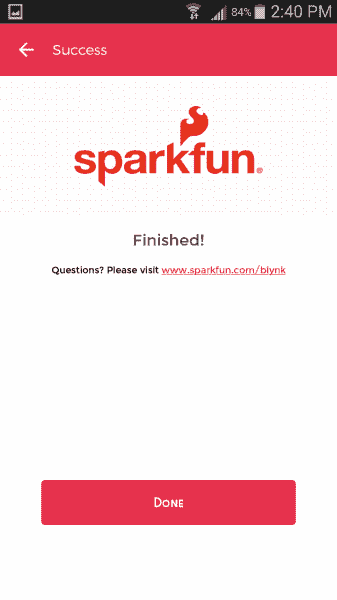](https://cdn.sparkfun.com/assets/learn_tutorials/4/8/6/android-07-finished.png)

从那里，**点击 Done** ，Blynk 将带您进入一个新的 Blynk 板项目。前往本教程的 **[做 zeRGBa 部分](https://learn.sparkfun.com/tutorials/getting-started-with-the-sparkfun-blynk-board#do-the-zergba)** 开始 Blynking！

如果您在配置 Blynk 板时遇到问题，请尝试再试一次。**通过拔下并插回 Blynk 板**的电源，对其进行循环供电。然后从步骤 1 开始重试。

如果你仍然运气不佳，请参考本教程的[故障排除](https://learn.sparkfun.com/tutorials/getting-started-with-the-sparkfun-blynk-board#troubleshooting)部分。

## 跳泽格巴舞

一旦你将 Blynk 板连接到本地 Wi-Fi 网络，并将其连接到你的 Blynk 帐户，Blynk 应用程序应该会向你呈现一个几乎空白的 Blynk 项目画布。

迎接你的应该是一只色彩缤纷的斑马 **zeRGBa** 和一个 **LCD 小工具**，上面有一个相当有用的链接。

[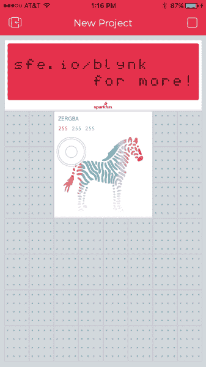](https://cdn.sparkfun.com/assets/learn_tutorials/4/8/6/zergba-01-default.PNG)

您的第一个 Blynk 项目应该已经设置好，可以与 Blynk 板通信。它也应该已经在运行，这意味着它的播放时间！戳戳 zeRGBa 来选择一种新的颜色——你应该很快在 Blynk 板上看到这种颜色的物理表现。

[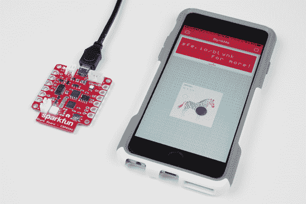](https://cdn.sparkfun.com/assets/learn_tutorials/4/8/6/zergba-01purple.jpg)

如果你的 zeRGBa 没有让 led 闪烁，首先**确保项目正在运行**。应用程序右上角的图标应该是一个方形的“**停止**按钮。如果是一个三角形的“**播放**按钮，点击它来运行项目。

**警告**:虽然表演催眠灯光秀很有诱惑力，但沿着 zeRGBa 拖动手指可能会导致 Blynk 板和 Blynk 应用程序偶尔“延迟”如果 Blynk 板更新 RGB 颜色很慢，请等待几秒钟，让它重新连接。

为了避免这种偶然的掉线，试着“戳”你选择的 zeRGBa 颜色。

**恭喜你！你正在成为一名职业篮球运动员。在这里，我们建议您访问 [Blynk Board 项目指南](https://learn.sparkfun.com/tutorials/blynk-board-project-guide)，探索内置于 Blynk Board 的十几个 Blynk 项目。**

 [### Blynk 板项目指南

#### 2016 年 3 月 25 日](https://learn.sparkfun.com/tutorials/blynk-board-project-guide) A series of Blynk projects you can set up on the Blynk Board without ever re-programming it.[Favorited Favorite](# "Add to favorites") 18

或者，您可能想要查看一些其他与 Blynk 相关的教程:

 [### Blynk Board Bridge 小部件演示](https://learn.sparkfun.com/tutorials/blynk-board-bridge-widget-demo) A Blynk project that demonstrates how to use the Bridge widget to get two (or more) Blynk Boards to communicate.[Favorited Favorite](# "Add to favorites") 2 [### Blynk 板 Arduino 开发指南](https://learn.sparkfun.com/tutorials/blynk-board-arduino-development-guide) How to get your computer set up with Arduino and the Blynk Board hardware definitions -- so you can start creating Blynk projects of your own 3

* * *

## 解决纷争

如果出于任何原因，您无法通过 Blynk 应用程序成功配置 Blynk 板，您有几个备选方案。但是首先，你需要**创建一个新的 Blynk 项目**。

### 创建 Blynk 项目

下面的每一种替代供应方法都需要预先创建一个 Blynk 项目。新的 Blynk 项目将被分配一个 **Blynk auth token** -一个 32 个字符的唯一字符串，它将 Blynk 板连接到您的 Blynk 项目。这就是我们在这个过程中所追求的。

按照以下步骤创建一个新的 Blynk 项目并获得一个新的 auth 令牌:

#### 步骤 1:创建一个 Blynk 项目

打开 Blynk 应用程序，如果还没有登录，请登录。确保您的手机已连接到互联网连接的 Wi-Fi 网络。在 Blynk 主页上，选择**新建项目**。

[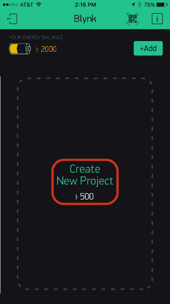](https://cdn.sparkfun.com/assets/learn_tutorials/4/8/6/createProject-01.PNG)*Create a new Blynk Project by tapping "Create New Project" on the Blynk main page.*

#### 步骤 2:配置 Blynk 项目

在下一页，选择“硬件型号”列表下的 **SparkFun Blynk Board** 。您可以给这个项目起任何您喜欢的名字——配置过程将它设置为“BlynkMe”。

[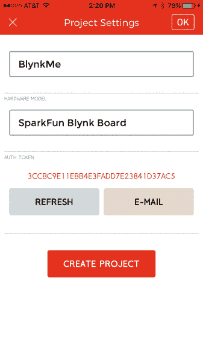](https://cdn.sparkfun.com/assets/learn_tutorials/4/8/6/createProject-02.PNG)*Configure a new project: name it, and set the board type to "SparkFun Blynk Board."*

**不要**点击创建项目！

#### 步骤 3:发送电子邮件并复制身份验证令牌

根据您选择的替代供应选项，您要么需要将 auth token 复制到您手机的剪贴板，要么放在您的电子邮件收件箱中。既然我们都在这里了，还是两个都做吧！

[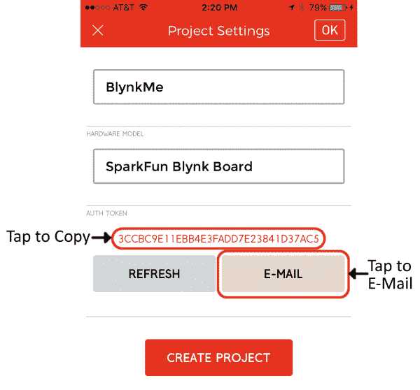](https://cdn.sparkfun.com/assets/learn_tutorials/4/8/6/createProject-03.PNG)

点击**电子邮件按钮**将认证令牌发送到您的 Blynk 连接的电子邮件帐户。然后**点击认证令牌本身**将字符串复制到你的手机剪贴板。手机应该弹出一个通知，确认令牌被复制。

#### 步骤 4:创建项目

最后，通过电子邮件发送并复制令牌，点击**创建**或**创建项目**。你应该被带到一个新的，空白的项目-完美的现在！

### 替代供应

有几个选项可供选择地配置 Blynk 板。根据我们的建议，您可以:

1.  使用笔记本电脑或支持 Wi-Fi 的电脑将 Blynk 板连接到 Wi-Fi/Blynk。
2.  通过 USB 连接到 Blynk 板的计算机上的串行终端配置 Blynk 板。
3.  创造性地使用智能手机上的复制/粘贴和应用程序切换来配置 Blynk 板。

单击下面的链接之一查看如何操作。

[Option 1: Laptop/Computer, Browser-Based Provisioning](#collapseLaptop)[Option 2: Serial Terminal Over a USB-Connected Computer/Laptop](#collapseSerial)[Option 3: Smartphone Browser-Based Provisioning](#collapsePhoneBrowser)

### 选项 1:笔记本电脑/计算机，基于浏览器的配置

如果 Blynk 应用程序没有正确配置您的 Blynk 板，而您附近有一台具有 Wi-Fi 功能的电脑，您可以使用您的电脑和智能手机来共同配置您的 Blynk 板。只需遵循以下步骤:

#### 步骤 1:从您的电子邮件收件箱中获取身份验证令牌

确保您已经按照上面的步骤进行了操作——创建了一个项目，并通过电子邮件将 auth token 发送给您自己。然后在你的电脑上打开你的电子邮件，然后**将认证令牌**复制到你的剪贴板或者一个简单的文本编辑器中。

[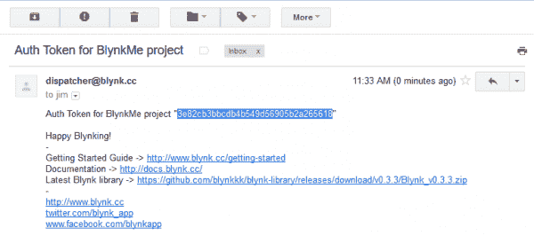](https://cdn.sparkfun.com/assets/learn_tutorials/4/8/6/ts-computer-03-emailAuth.png)

查看您的电子邮件，并复制授权令牌。

#### 第二步:将你的电脑连接到 Blynk 板的无线网络

找到您电脑的 **Wi-Fi** 设置，并让它扫描附近的 Wi-Fi 网络。您应该会看到以 **BlynkMe-** 开头的内容。最后四个字符应该与你的棋盘闪烁的四色序列相匹配。

[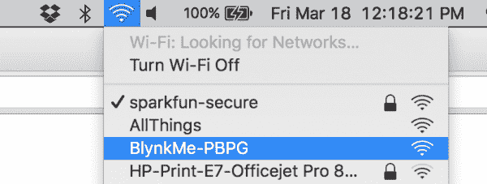](https://cdn.sparkfun.com/assets/learn_tutorials/4/8/6/ts-computer-04-connect-cropped.png)

*将您的电脑连接到 BlynkMe Wi-Fi 网络。*

选择“柏林克梅-CCCC”网络将您的电脑连接到它。成功连接后，您的 Blynk 板应该开始闪烁紫色。

#### 步骤 3:将 Web 浏览器指向 192.168.4.1

打开 Safari、Chrome、Firefox、Edge 或任何您喜欢的网络浏览器，然后导航到 [192.168.4.1](http://192.168.4.1) (该链接只能在连接到 Blynk 板的设备上使用)。

几秒钟后，Blynk 板应该提供 Blynk 板配置页面。加载页面可能需要几次尝试；如果你的浏览器显示“无法加载网页”，或者类似的意思，尝试刷新。

#### 步骤 4:发送您的 Wi-Fi 网络和 Blynk 认证令牌

配置页面将显示一个**列表，列出覆盖范围内的可见 Wi-Fi 网络**。如果你看到你的网络在那里，太好了！选择那个。如果您的网络是隐藏的，向下滚动到“[手动输入…]”，然后自己输入。

接下来**输入你的 Wi-Fi 网络的密码**。如果是开放网络(无密码)，请将该框留空。

最后，**将认证令牌**粘贴到 Blynk 认证令牌框中。这个过程因手机而异，轻敲(iOS)或长按应该会弹出粘贴选项。

[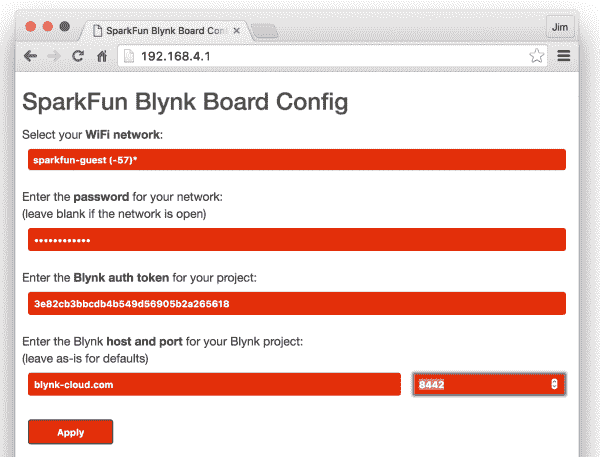](https://cdn.sparkfun.com/assets/learn_tutorials/4/8/6/ts-computer-05-browser-cropped.png)

除非您将 Blynk 板连接到自定义服务器(很可能不是)，否则保持 Blynk 主机和端口条目不变。

现在**点击应用**。

#### 步骤 5:监控 Blynk 板

点击应用后，Blynk 板应该开始**闪烁蓝色**，因为它试图连接到您的 Wi-Fi 网络。

如果成功，它将开始**闪烁 Blynk-green** ，同时与 Blynk 服务器建立连接。

一旦双方都满意，Blynk 板的 RGB LED 应该“呼吸”Blynk-green，渐隐渐出，渐隐渐出。这是一个很好的迹象！换回你的手机，打开 Blynk 应用程序，然后[我们将设置一个 zeRGBa](#manual-zergba) 。

如果这不起作用，[返回到供应选项](#alternative-provisioning)，并尝试其他方法。或者考虑联系我们的[技术支持团队](https://www.sparkfun.com/technical_assistance)。

### 选项 2:通过 USB 连接的计算机/笔记本电脑的串行终端

如果基于 Wi-Fi 的调试似乎不成功，您可以使用串行终端通过硬线提供电路板，同时获得一些调试信息。为了使用串行终端方法，您需要:

1.  通过 USB 连接到电脑或笔记本电脑的 Blynk 板
***   安装在计算机上的 FTDI 驱动程序*   串口**终端软件****

#### 步骤 1:安装 FTDI 驱动程序

Blynk 板使用一种称为“FTDI”的专用芯片将 USB 数据转换为更简单的串行接口。如果您以前从未使用过基于 FTDI 的设备，您可能需要在您的计算机上安装驱动程序。我们的[如何安装 FTDI 驱动程序教程](https://learn.sparkfun.com/tutorials/how-to-install-ftdi-drivers)应该可以帮助你安装驱动程序，不管你是在 Mac、Windows 还是 Linux 机器上。

[安装 FTDI 驱动程序](https://learn.sparkfun.com/tutorials/how-to-install-ftdi-drivers)

一旦你安装了驱动程序，你的 Blynk 板应该在你的电脑上显示为 **COM#** (如果你在 Windows 机器上)或**/dev/tty . USB serial-# # # # # # # #**(如果你在 Mac/Linux 电脑上)，其中的#是唯一的数字或字母字符。

#### 步骤 2:选择、下载、安装、运行终端软件

串行终端上有很多很多软件变体。如果你还没有，通读我们的[串行终端基础教程](https://learn.sparkfun.com/tutorials/terminal-basics)以获得一些建议。

[下载终端](https://learn.sparkfun.com/tutorials/terminal-basics)

#### 步骤 3:配置串行终端设置，打开连接

一旦你选择了终端软件——并找到了你的 Blynk 板的串行端口号——打开它并将波特率设置为 **9600** 。

[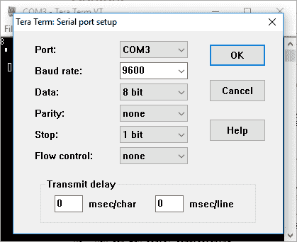](https://cdn.sparkfun.com/assets/learn_tutorials/4/8/6/terminal-01-settings.png)

使用 TeraTerm 通过 COM3 上的串行接口与 Blynk 板通信。

After opening the terminal connecting **press 'h'** to print a help menu. This will also confirm that your Blynk Board and terminal are talking to each other.

[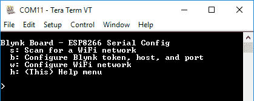](https://cdn.sparkfun.com/assets/learn_tutorials/4/8/6/ts-terminal-02-helpmenu.png)

Don't be alarmed if your Blynk Board prints messages before that help message. The board is configured to print a few handy debug messages at startup.

#### 第四步:配置无线网络

有四个**单字符命令**可用于配置 Blynk 板的 Wi-Fi 网络、密码和 Blynk 令牌。键入这些字符中的任何一个都将启动命令:

*   **h**–打印帮助菜单。
*   **s**–扫描 Wi-Fi 网络，并从可见网络列表中选择。
*   **w**–手动进入 Wi-Fi 网络。
*   **b**–启动 Blynk 令牌配置。

**在终端**中按“s”来扫描 Wi-Fi 网络并开始配置。几秒钟后，您应该会看到一个可见 Wi-Fi 网络列表。

[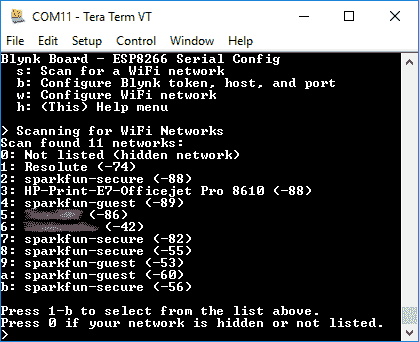](https://cdn.sparkfun.com/assets/learn_tutorials/4/8/6/ts-terminal-03-scanresult-blur.png)

如果您看到您的 Wi-Fi 网络，请键入它旁边列出的数字或字母。如果你看不到网络——或者如果它应该是隐藏的——点击`0`手动输入。

选择网络后，配置工具会立即要求您输入 **Wi-Fi 网络密码**——输入密码，然后按回车键。如果你的 Wi-Fi 网络是开放的，只需按回车键，留下密码空白。

#### 步骤 5:配置 Blynk

按照“创建 Blynk 项目”的说明进行操作后，您的收件箱中应该会有一封包含 Blynk 项目的 auth 令牌的电子邮件。加载您的电子邮件，并将 auth token 复制到您计算机的剪贴板上。

[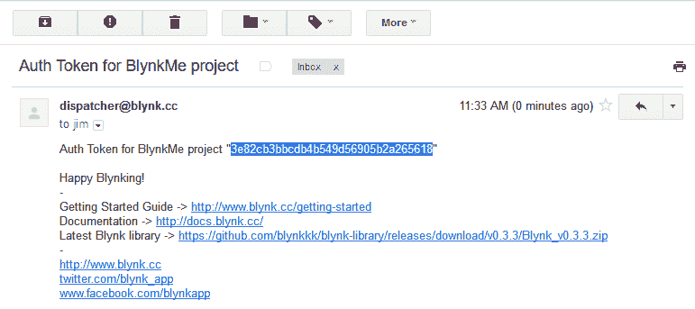](https://cdn.sparkfun.com/assets/learn_tutorials/4/8/6/ts-computer-03-emailAuth.png)

将令牌复制到剪贴板后，**键入‘b’**进入 **Blynk 认证令牌配置模式**。然后粘贴你的令牌，然后**点击回车**。终端程序处理复制/粘贴的方式都不一样，但是你用**编辑>粘贴**通常不会错。

[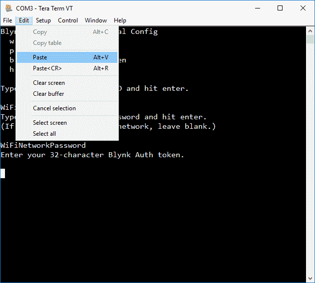](https://cdn.sparkfun.com/assets/learn_tutorials/4/8/6/terminal-02-pasting-token.png)

#### 步骤 6:监控 Blynk 板

发送完您的 Wi-Fi 和 Blynk 凭证后，Blynk 板应该开始**闪烁蓝色**，因为它试图连接到您的 Wi-Fi 网络。

如果成功，它将开始**闪烁 Blynk-green** ，同时与 Blynk 服务器建立连接。

一旦双方都满意，Blynk 板的 RGB LED 应该“呼吸”Blynk-green，渐隐渐出，渐隐渐出。这是一个很好的迹象！换回你的手机，打开 Blynk 应用程序，然后[我们将设置一个 zeRGBa](#manual-zergba) 。

如果这不起作用，[返回到供应选项](#alternative-provisioning)，并尝试其他方法。或者考虑联系我们的[技术支持团队](https://www.sparkfun.com/technical_assistance)。**  **### 选项 3:基于智能手机浏览器的配置

如果 Blynk 应用程序没有正确配置 Blynk 板，您仍然可以使用手机手动完成这个过程。按照以下步骤手动设置 Blynk 板:

根据上面的“创建 Blynk 项目”说明，您应该有一个 **32 个字符的 Blynk auth 令牌复制到您手机的剪贴板**。在继续之前，请确保您这样做了——在接下来的几个步骤中，您将被切断互联网连接。

#### 第一步:将你的手机连接到 Blynk 板的无线网络

暂时跳出 Blynk 应用，找到手机的 **Wi-Fi** 设置。在 iOS 设备上，这将是**设置应用**下的“Wi-Fi”条目。在安卓系统上，它应该在手机设置的 Wi-Fi 部分。

让你的手机扫描无线网络，寻找以 **BlynkMe-** 开头的内容。最后四个字符应该与你的棋盘闪烁的四色序列相匹配。

将您的手机连接到“柏林克姆-CCCC”网络。成功连接后，您的 Blynk 板应该开始闪烁紫色。

#### 步骤 2:将 Web 浏览器指向 192.168.4.1

打开 Safari、Chrome、Firefox、“互联网”或任何你喜欢的手机网络浏览器，并导航到 [192.168.4.1](http://192.168.4.1) (该链接只能在连接到 Blynk 板的设备上使用)。

几秒钟后，Blynk Board 应该会显示这样一个网页:

[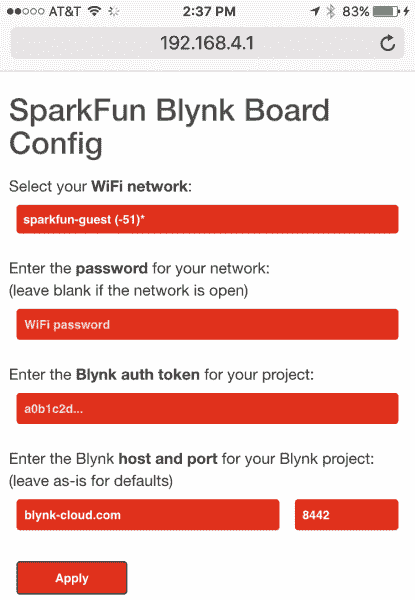](https://cdn.sparkfun.com/assets/learn_tutorials/4/8/6/phoneBrowser-02.PNG)

加载 Blynk 板配置页面可能需要刷新几次。如果你的浏览器显示“无法加载网页”，或者类似的意思，尝试刷新。

#### 步骤 3:发送您的 Wi-Fi 网络和 Blynk 认证令牌

配置页面将显示一个**列表，列出覆盖范围内的可见 Wi-Fi 网络**。如果你看到你的网络在那里，太好了！选择那个。如果您的网络是隐藏的，向下滚动到“[手动输入…]”，然后自己输入。

接下来，**输入您的 Wi-Fi 网络的密码**。如果是开放网络(无密码)，请将该框留空。

最后，**将认证令牌**粘贴到 Blynk 认证令牌框中。这个过程因手机而异，轻敲(iOS)或长按应该会弹出粘贴选项。

[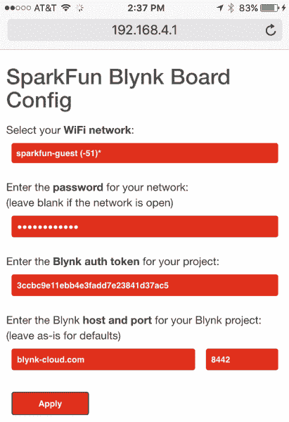](https://cdn.sparkfun.com/assets/learn_tutorials/4/8/6/phone-browser-03.PNG)

除非您将 Blynk 板连接到自定义服务器(很可能不是)，否则保持 Blynk 主机和端口条目不变(blynk-cloud.com 和 8442)。

现在**点击应用**。

#### 步骤 4:监控 Blynk 板

点击 apply 后，您应该看到一个确认页面，通知您 Blynk 板正在尝试做什么。

[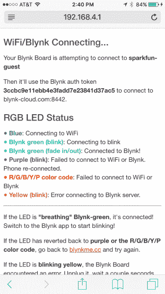](https://cdn.sparkfun.com/assets/learn_tutorials/4/8/6/phoneBrowser-04.PNG)

Blynk 板应该会立即开始**闪烁蓝色**，因为它试图连接到您的 Wi-Fi 网络。

如果成功，它将开始**闪烁 Blynk-green** ，同时与 Blynk 服务器建立连接。

一旦双方都满意，Blynk 板的 RGB LED 应该“呼吸”Blynk-green，渐隐渐隐。这是一个很好的迹象！切换回 Blynk 应用程序，我们将设置一个 zeRGBa 。

如果这不起作用，[返回到供应选项](#alternative-provisioning)，并尝试其他方法。或者考虑联系我们的[技术支持团队](https://www.sparkfun.com/technical_assistance)。**  **### 手动添加 zeRGBa 小工具

希望这三个备选供应流程中的一个对您有用。如果没有，请随时联系我们的[技术支持团队](https://www.sparkfun.com/technical_assistance)。

如果你的 Blynk 板正在呼吸 Blynk-green，**在你的手机**上打开 Blynk 应用，并选择你已经创建的裸项目。看看那块空白的画布——可以放这么多小部件！

[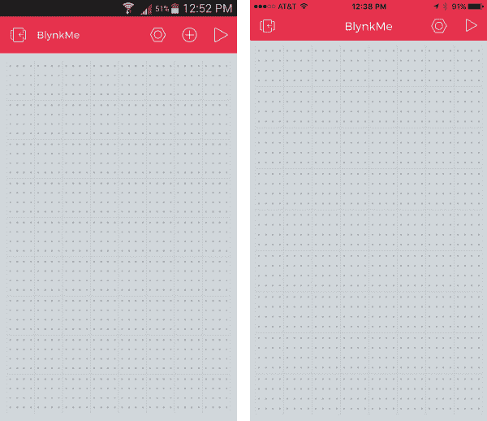](https://cdn.sparkfun.com/assets/learn_tutorials/4/8/6/manual-zergba-01-blank.png)*A new Blank Blynk project. (Android left, iOS right)*

要向 Blynk 应用程序添加一个小部件，首先要确保项目**没有运行**——你应该会在右上角看到一个三角形的“play”图标。现在**点击灰色项目空间的任何地方**来调出 Blynk 小部件框。

[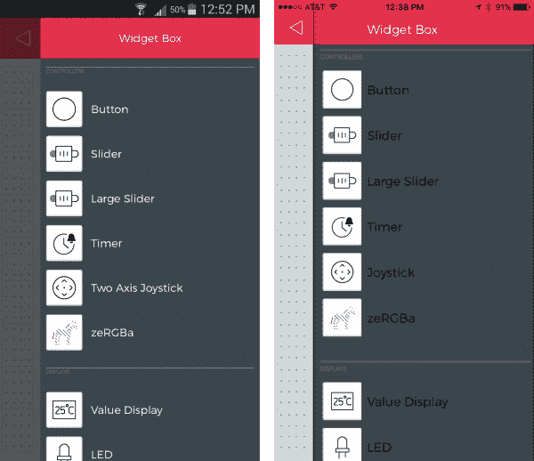](https://cdn.sparkfun.com/assets/learn_tutorials/4/8/6/manual-zergba-02-widgetbox.png)*Add a zeRGBa widget from the Blynk widget box.*

**选择 zeRGBa** 小部件，将其添加到您的项目中。你可以**点击并按住**小工具，在项目空间中拖动它。我们发现泽格巴人更喜欢成为关注的焦点。

现在**点击 zeRGBa** 进入小工具设置——你会非常习惯的。将分割/合并开关滑动到**合并**。然后**点击【引脚】**，将盒子设置为 **V0** 。小部件设置应该如下所示:

[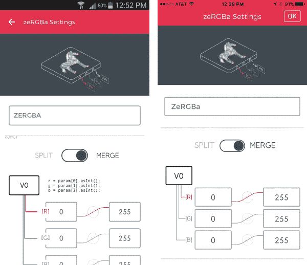](https://cdn.sparkfun.com/assets/learn_tutorials/4/8/6/manual-zergba-03-zergbasettings.png)

要退出设置选项卡，在 iOS 上点击 **OK** 或者在 Android 上点击**左上角的返回箭头**。

回到项目屏幕，**点击右上角的播放按钮**开始 Blynking！一旦你让项目运行起来，戳戳那只彩色的斑马！

* * *

**恭喜你！你正在成为一名职业篮球运动员。在这里，我们建议您访问 [Blynk Board 项目指南](https://learn.sparkfun.com/tutorials/blynk-board-project-guide)，探索内置于 Blynk Board 的十几个 Blynk 项目。**

 [### Blynk 板项目指南

#### 2016 年 3 月 25 日](https://learn.sparkfun.com/tutorials/blynk-board-project-guide) A series of Blynk projects you can set up on the Blynk Board without ever re-programming it.[Favorited Favorite](# "Add to favorites") 18

或者，您可能想要查看一些其他与 Blynk 相关的教程:

 [### Blynk Board Bridge 小部件演示](https://learn.sparkfun.com/tutorials/blynk-board-bridge-widget-demo) A Blynk project that demonstrates how to use the Bridge widget to get two (or more) Blynk Boards to communicate.[Favorited Favorite](# "Add to favorites") 2 [### Blynk 板 Arduino 开发指南](https://learn.sparkfun.com/tutorials/blynk-board-arduino-development-guide) How to get your computer set up with Arduino and the Blynk Board hardware definitions -- so you can start creating Blynk projects of your own 3

## 重新配置 Blynk 板

如果你把你的 Blynk 板带到一个新的地方，并且需要**重新配置它的 Wi-Fi** 网络——或者如果你需要更新 Blynk 认证令牌——有一个重新进入配置模式的内置方法来重置两个凭证。

当 Blynk 板试图连接到 Wi-Fi 网络或 Blynk -闪烁蓝色或绿色- **时，按住 0 按钮**。

[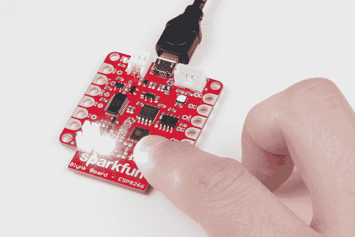](https://cdn.sparkfun.com/assets/learn_tutorials/4/8/6/reprovisioning-01-button-press.jpg)

您应该会看到 RGB LED 变成白色，亮度慢慢增加。大约一秒钟后，LED 将开始变暗。一旦你按住按钮大约 **4 秒**并且 LED 开始再次变亮，**松开按钮**。

如果复位成功，您应该看到 Blynk 板恢复到 R/G/B/Y/P 颜色组合序列。它还应该显示为一个 Wi-Fi 接入点，您可以通过 Wi-Fi 或串行终端对其进行配置。

你甚至可以重新扫描你的 Blynk Board 二维码卡。不，您不会再获得 15k 能量，但是您将能够再次逐步完成配置过程！

## 资源和更进一步

如果您的 Blynk 板已成功配置，**前往 [Blynk 板项目教程](https://learn.sparkfun.com/tutorials/blynk-board-project-guide)** 探索 Blynk 板预加载的项目。

 [### Blynk 板项目指南

#### 2016 年 3 月 25 日](https://learn.sparkfun.com/tutorials/blynk-board-project-guide) A series of Blynk projects you can set up on the Blynk Board without ever re-programming it.[Favorited Favorite](# "Add to favorites") 18

如果您需要 Blynk 板的任何技术帮助，请不要犹豫[通过电子邮件、聊天或电话联系我们的技术支持团队](https://www.sparkfun.com/technical_assistance)。

如果您需要一般的 Blynk 板或 Blynk 应用程序资源，这些资源可能会有所帮助:

*   **SparkFun Blynk 板资源**
    *   [Blynk 板 GitHub 库](https://github.com/sparkfun/Blynk_Board_ESP8266)
    *   [Blynk 板原理图](https://cdn.sparkfun.com/datasheets/IoT/SparkFun-Blynk-Board-ESP8266.pdf)
    *   [Blynk Board Eagle PCB 设计文件](https://cdn.sparkfun.com/assets/learn_tutorials/4/8/6/SparkFun-Blynk-Board-ESP8266-EAGLE.zip)
    *   [Blynk 板 Arduino 固件](https://github.com/sparkfun/Blynk_Board_ESP8266/tree/master/Firmware/BlynkBoard_Core_Firmware)
*   **链接资源**
    *   [Blynk 主页](http://www.blynk.cc/)
    *   [Blynk 入门指南](http://www.blynk.cc/getting-started/)
    *   [Blynk 文档](http://docs.blynk.cc/)
    *   [Blynk Arduino 库](https://github.com/blynkkk/blynk-library/releases/download/v0.3.3/Blynk_v0.3.3.zip)

你的下一个项目需要一些灵感吗？查看一些相关教程:

 [### LED 云-连接云](https://learn.sparkfun.com/tutorials/led-cloud-connected-cloud) Make an RGB colored cloud light! You can also control it from your phone, or hook up to the weather 31 [### Blynk Board Bridge 小部件演示](https://learn.sparkfun.com/tutorials/blynk-board-bridge-widget-demo) A Blynk project that demonstrates how to use the Bridge widget to get two (or more) Blynk Boards to communicate.[Favorited Favorite](# "Add to favorites") 2 [### Blynk 板 Arduino 开发指南](https://learn.sparkfun.com/tutorials/blynk-board-arduino-development-guide) How to get your computer set up with Arduino and the Blynk Board hardware definitions -- so you can start creating Blynk projects of your own 3 [### Blynk 板洗衣机/烘干机警报](https://learn.sparkfun.com/tutorials/blynk-board-washerdryer-alarm) How to configure the Blynk Board and app to notify you when your washer or dryer is done shaking.[Favorited Favorite](# "Add to favorites") 9

或者看看下面的一些博客帖子来寻找灵感:

 [### 设计物联网

April 13, 2016](https://www.sparkfun.com/news/2077 "April 13, 2016: A guest post from Pavel, creator of the Blynk app")[Favorited Favorite](# "Add to favorites") 0 [### 每月黑客项目:2016 年 8 月

August 24, 2016](https://www.sparkfun.com/news/2172 "August 24, 2016: An in-depth look at the winners of our IoT for Everyone contest ")[Favorited Favorite](# "Add to favorites") 1 [### 婴儿布林克监视器的事情

September 14, 2016](https://www.sparkfun.com/news/2185 "September 14, 2016: Baby sleep pattern monitor utilizing the SparkFun ESP8266 Thing, Blynk app, and SparkFun ADXL345 Library")[Favorited Favorite](# "Add to favorites") 3 [### 每月黑客项目:2016 年 9 月

September 21, 2016](https://www.sparkfun.com/news/2187 "September 21, 2016: It's time to automate my home! ")[Favorited Favorite](# "Add to favorites") 0 to WiFi access points.") [### IoTuesday:带 DIY 八木天线的 WiFi Maximizer

March 28, 2017](https://www.sparkfun.com/news/2342 "March 28, 2017: I create a Yagi antenna out of Popsicle sticks and paperclips and use it to measure connection strength (RSSI) to WiFi access points.")[Favorited Favorite](# "Add to favorites") 4 [### 硬件驼峰日:远程烟雾机恶作剧

March 29, 2017](https://www.sparkfun.com/news/2344 "March 29, 2017: Let's build a small smoke machine to harass our friends and colleagues! ")[Favorited Favorite](# "Add to favorites") 0 [### 周日:用这个奇怪的技巧最大化你的无线网络！

April 18, 2017](https://www.sparkfun.com/news/2363 "April 18, 2017: Your IT department hates this.")[Favorited Favorite](# "Add to favorites") 3 [### 今日英语:ComSphere

May 18, 2017](https://www.sparkfun.com/news/2390 "May 18, 2017: How a hamster ball and Blynk app can detect not only motion, but perhaps something paranormal?")[Favorited Favorite](# "Add to favorites") 2 [### 面向创客的三大物联网平台

June 20, 2017](https://www.sparkfun.com/news/2413 "June 20, 2017: Everyone seems to have an IoT software platform these days...here are three to try!")[Favorited Favorite](# "Add to favorites") 6 [### ESP8266 + Cayenne = <3

July 18, 2017](https://www.sparkfun.com/news/2436 "July 18, 2017: The Thing is the first non-LoRa board officially supported inside myDevices’ Cayenne IoT project builder!")[Favorited Favorite](# "Add to favorites") 1 [### 看，在上面...天花板！

August 7, 2018](https://www.sparkfun.com/news/2736 "August 7, 2018: How about some drone-style footage, indoors and without a drone? With a 3D printer and a few simple components, it might be easier than it sounds!")[Favorited Favorite](# "Add to favorites") 3**********