# 开始使用 Tessel 2

> 原文：<https://learn.sparkfun.com/tutorials/getting-started-with-the-tessel-2>

## 什么是 Tessel 2？

[Tessel 2](https://tessel.io) 是一款开源开发板。它运行 JavaScript 并支持 [npm](https://npmjs.com) ，这意味着控制它的脚本可以用 [Node.js](https://nodejs.org) 构建。这是一个实验、修补、原型制作和生产*嵌入式*硬件的平台，非常适合物联网(IoT)。

[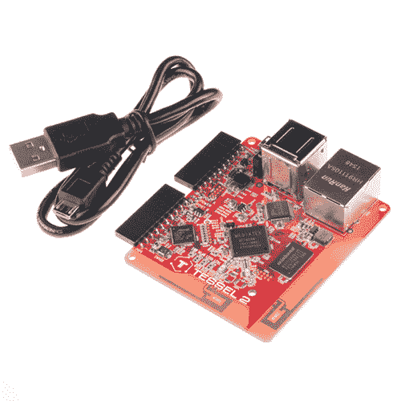](https://www.sparkfun.com/products/retired/13841) 

### [镶嵌 2](https://www.sparkfun.com/products/retired/13841)

[Retired](https://learn.sparkfun.com/static/bubbles/ "Retired") DEV-13841

Tessel 2 是一款具有板载 WiFi 功能的开发板，允许您在 Node.js 中构建脚本

4 **Retired**[Favorited Favorite](# "Add to favorites") 21[Wish List](# "Add to wish list")

### 好，那么什么是开发板？

开发板是原型开发和构建*嵌入式系统*的平台。(大多数)开发板的核心是一个*微控制器*，它将处理器和内存与 I/O 功能结合在一起。像 Tessel 2 上的微控制器提供了一组 GPIO(通用输入输出)引脚，用于连接输入和输出设备。微控制器本身——芯片——上的引脚很小，小到人的手指不容易操作(而且你需要把东西焊接到上面)。相反，开发板将这些 GPIO 引脚连接到易于插入的引脚插座。

电路板的其他常见功能起辅助作用:用于编程和与电路板通信的连接、状态灯、复位按钮和电源连接。

像 Raspberry Pi 和 Tessel 这样的功能强大的主板有时也被称为单板计算机(SBC)。

### Tessel 2 的特性

Tessel 是一个强大的小棋盘。Tessel 2 的一些好东西包括:

*   2 个 USB 端口(例如，您可以连接相机或闪存)
*   10/100 以太网端口
*   802.11 宽带/宽带/无线网络
*   580MHz 联发科片上路由器(你可以把你的 Tessel 2 变成接入点！)
*   48MHz SAMD21 协处理器(用于提高 I/O 速度)
*   64MB DDR2 内存，32MB 闪存(为你的程序和东西提供大量空间)

### 使用 Tessel 2

Tessel 有一套命令行界面(CLI)工具，用于设置和使用 Tessel 2 板。您将安装这些并对您的 Tessel 进行一次性设置*供应*。

您可以在任何文本编辑器中为 Tessel 2 编写脚本，使用 JavaScript 并根据需要包含`npm`模块。一行终端命令在 Tessel 上部署并执行您的脚本。

#### 输入和输出

Tessel 2 上有两组主要引脚:端口“A”和端口“B”。每个端口有 10 个引脚:两个用于电源(3.3V 和接地)，八个 GPIO 引脚。

[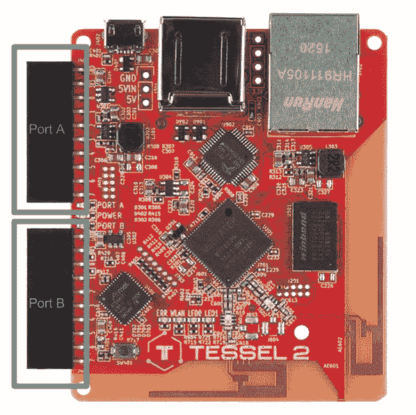](https://cdn.sparkfun.com/assets/learn_tutorials/5/2/3/T2_Ports.png)

有些引脚支持不同的功能，这将在下一节中介绍。

### 为电路板供电

有多种方式为 Tessel 2 供电。我们将从使用随附的 USB 电缆开始。

#### 通过 USB

[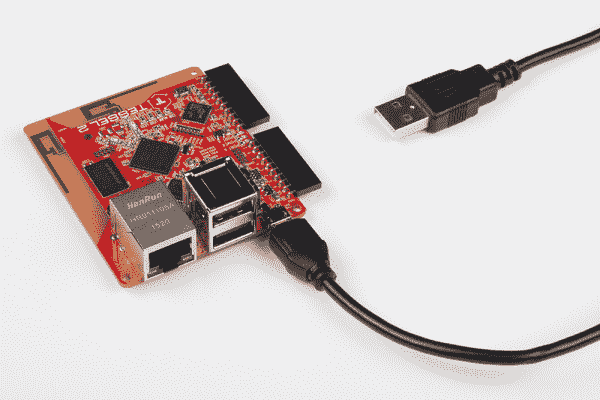](https://cdn.sparkfun.com/r/600-600/assets/learn_tutorials/5/2/3/J5_SIK_Projects-01.jpg)

通过 USB 直接连接到电路板，您可以轻松地修改任何电路，并在舒适的办公桌上重新部署代码，而无需检索您的项目。当您无法访问本地网络时，这也很方便(用于通过 WiFi 部署代码)。

#### USB 壁式充电器

[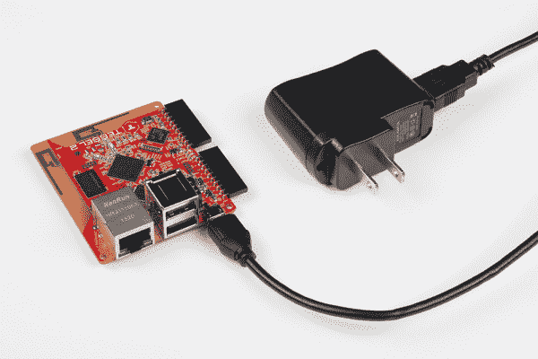](https://cdn.sparkfun.com/r/600-600/assets/learn_tutorials/5/2/3/J5_SIK_Projects-02.jpg)

一旦您完成了 Tessel 2 的设置和供应，您就可以通过本地 WiFi 网络部署代码了。在某些时候，你会渴望让你的 Tessel 摆脱电线和束缚，但它仍然需要电力。我们在 Johnny-Five Inventor's Kit (J5IK)中提供了一个 5V USB 充电器，因此您可以将您的项目放在您家或办公室周围的半远程位置，并从本地网络的任何地方部署代码。

#### USB 电池组

[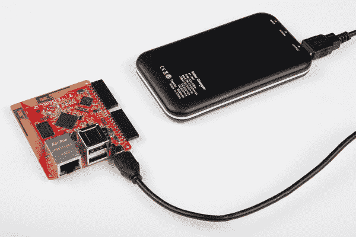](https://cdn.sparkfun.com/r/600-600/assets/learn_tutorials/5/2/3/J5_SIK_Projects-03.jpg)

USB 电池组在活动中作为赠品和赠品变得非常受欢迎。我们像收集糖果一样收集它们，因为它们允许我们在最少考虑电源管理电路的情况下为项目供电。如果你手边有一个这样的设备，只需使用附带的 USB 电缆将 Tessel 2 插入电池，就可以开始使用了！就这么简单。

## 董事会详情

Tessel 2 有两个 IO 模块，端口 A 和端口 b。每个端口有 8 个 GPIO(通用 I/O)引脚。这是它们的命名约定和它们的功能。

[](https://cdn.sparkfun.com/assets/learn_tutorials/5/2/3/T2_Ports.png)

### 引脚命名惯例

Tessel 2 上的引脚穿过两个不同的端口。代码中的命名约定将首先引用端口字母，然后引用该端口的 pin 号。端口字母不区分大小写！例如，端口 A 上的第一个引脚称为引脚`a0`或`A0`。使用此表作为引脚命名的参考。

| 港口 | 插脚数 | 约翰尼-五个名字 |
| --- | --- | --- |
| A | Zero | “a0”或“A0” |
| A | one | “a1”或“A1” |
| A | Two | “a2”或“A2” |
| A | three | “a3”或“A3” |
| A | four | “a4”或“A4” |
| A | five | “a5”或“A5” |
| A | six | “a6”或“A6” |
| A | seven | “a7”或“A7” |
| B | Zero | “b0”或“B0” |
| B | one | “b1”或“B1” |
| B | Two | “b2”或“B2” |
| B | three | “b3”或“B3” |
| B | four | “b4”或“B4” |
| B | five | “b5”或“B5” |
| B | six | “b6”或“B6” |
| B | seven | “b7”或“B7” |

### 引脚功能:每个引脚可以做什么

每个端口的引脚具有不同的可用功能。

其他需要了解的事项:

*   所有八个带编号的引脚，两个端口(总共 16 个)，都可以用作 GPIO。
*   端口 A 上的引脚`4`和`7`支持[模数](https://learn.sparkfun.com/tutorials/analog-to-digital-conversion)输入。*端口 B 上的所有*引脚都支持模拟输入。
*   两个端口上的引脚`5`和`6`支持[脉宽调制(PWM)](https://learn.sparkfun.com/tutorials/pulse-width-modulation) 。
*   两个端口上的引脚`0`和`1`可用于 [I2C 串行通信](https://learn.sparkfun.com/tutorials/i2c)。
*   串行 TX/RX ( [硬件 UART](https://learn.sparkfun.com/tutorials/serial-communication) )在两个端口、引脚`5` (TX)和`6` (RX)上都可用。
*   端口 B，引脚`7`:支持数模转换(DAC)

这两个端口本质上是重复的，但有以下例外:

*   端口 B:所有编号的引脚都可以用于模拟输入。
*   端口 B，引脚`7`:支持 DAC。

有关详细信息，请参见下面的引脚功能参考表:

| 港口 | 插脚数 | 数字输入输出 | SCL | 国家药品监督管理局 | 谢谢 | 药方(prescription 的缩写) | 模拟输入 | 模拟输出 | 中断 | 脉宽调制（pulse-width modulating 的缩写） |
| --- | --- | --- | --- | --- | --- | --- | --- | --- | --- | --- |
| A | Zero |  |  |  |  |  |  |  |  |  |
| A | one |  |  |  |  |  |  |  |  |  |
| A | Two |  |  |  |  |  |  |  |  |  |
| A | three |  |  |  |  |  |  |  |  |  |
| A | four |  |  |  |  |  |  |  |  |  |
| A | five |  |  |  |  |  |  |  |  |  |
| A | six |  |  |  |  |  |  |  |  |  |
| A | seven |  |  |  |  |  |  |  |  |  |
| B | Zero |  |  |  |  |  |  |  |  |  |
| B | one |  |  |  |  |  |  |  |  |  |
| B | Two |  |  |  |  |  |  |  |  |  |
| B | three |  |  |  |  |  |  |  |  |  |
| B | four |  |  |  |  |  |  |  |  |  |
| B | five |  |  |  |  |  |  |  |  |  |
| B | six |  |  |  |  |  |  |  |  |  |
| B | seven |  |  |  |  |  |  |  |  |  |

## 软件设置

让我们准备一下软件方面的东西，这样你就可以做好准备来做本指南中的实验了。你需要安装一些东西**，你需要**为你的 JavaScript 程序建立一个项目区**。所以，不要跳过前面！**

### 安装需要的东西

你需要:

*   文本编辑器
*   节点. js
*   终端应用程序

#### 安装文本编辑器:Atom

您将需要一个文本编辑器来编辑和保存您的 JavaScript 文件。这意味着纯文本编辑器，而不是 Word 文档。如果你已经有了一个——比如 SublimeText、Notepad++和 vim 等等。-那太棒了。如果没有，继续安装 Atom。


如果你从未使用过文本编辑器编写 JavaScript、HTML 等。，我们推荐使用 [Atom](https://atom.io) 。Atom 是一个免费的开源文本编辑器，可以在所有三大操作系统上运行。它很轻，当你感到舒适时，它是可折叠的！

前往 [Atom 网站](https://atom.io)下载 Atom。

[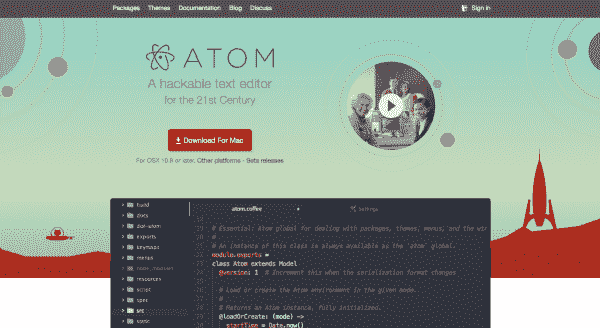](https://cdn.sparkfun.com/assets/learn_tutorials/5/2/3/sw_setup_atom_website.png)

#### 安装 Node.js


Node.js 是一个 JavaScript *运行时*——也就是说，它是可以执行你的 JavaScript 代码的软件。Node.js 有一些特殊的特性，支持 JavaScript 编程语言的一些最佳潜力，比如事件驱动、非阻塞 I/o。[`npm`](https://npmjs.com)是 Node 的*包管理器*。它是一个巨大的可重用、有用代码的封装库——称为*模块*——你可以在你的程序中使用。安装 Node.js 时会自动安装`npm`

[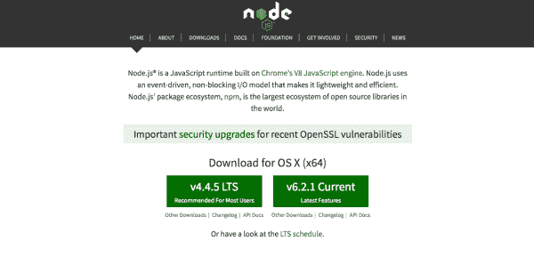](https://cdn.sparkfun.com/assets/learn_tutorials/5/2/3/sw_setup_nodejs_website.png)

安装 Node.js 是一个简单的下载-双击过程。前往 Node.js 网站。注意:你会想要选择下载**“LTS”版本**(LTS 代表长期支持)。在撰写本文时，LTS 版本是 4.4.5:

[](https://cdn.sparkfun.com/assets/learn_tutorials/5/2/3/sw_setup_lts_button.png)

#### 使用终端:命令行基础

使用 Tessel 就像进行 web 开发一样。但是如果你不熟悉 web 开发，你可能需要花一两分钟的时间来熟悉一些关键的工具:命令行，它是你执行命令的“终端”,以及文本编辑器，你可以在那里工作和保存你的程序。Tessel 的网站有很好的资源可以帮助您[开始使用终端](http://tessel.github.io/t2-start/cmd.html)。

在本教程的上下文中，应该在命令行中运行的内容如下所示:

`hello i am a command line command!`

当你进行第一个实验时，你会看到这个。但是，不要跳过前面；您将需要我们在下一步中安装的工具。

### 设置项目工作区

花点时间建立一个工作区(目录),您可以在其中放置 Johnny-Five Inventor's Kit (J5IK)的程序。您还需要用`npm`初始化新项目，并为 Johnny-Five 和 Tessel 安装所需的`npm`模块。

您可以通过在终端中键入(或复制并粘贴)以下命令来完成所有这些操作:

`mkdir j5ik;
cd j5ik;
npm init -y;
npm install johnny-five tessel-io;`

运行这些命令将在您的终端中生成一些输出。如果一切顺利，您将看到一些关于编辑`package.json`文件的输出，以及一些在`npm`安装所需模块时的附加输出。你可能还会看到一些`WARN`关于缺少`description`或`repository field`的声明。不用担心；什么都没坏。

您将看到的输出类型的示例(尽管您的输出在某些细节上会有所不同):

```
Wrote to /your/path/j5ik/package.json:
{
  "name": "j5ik",
  "version": "1.0.0",
  "description": "",
  "main": "index.js",
  "scripts": {
    "test": "echo \"Error: no test specified\" && exit 1"
  },
  "keywords": [],
  "author": "",
  "license": "ISC"
}

j5ik@1.0.0 /your/path/j5ik
├── johnny-five
└── tessel-io
npm WARN j5ik@1.0.0 No description
npm WARN j5ik@1.0.0 No repository field. 
```

## 硬件设置

是时候设置您的 Tessel 2 了。我们现在要完成的步骤包括:

1.  安装`t2-cli`软件工具
2.  用 USB 电缆连接 Tessel 2
3.  查找、重命名和提供镶嵌
4.  更新 Tessel 的固件

### 安装命令行工具

**Note to Linux users:**

*   如果您在 Linux 计算机上进行全局安装，请确保在 npm 安装命令前面添加`sudo`!
*   一些 Linux 发行版需要安装更多的库才能运行“t2-cli ”!请使用以下命令安装库: `apt-get install libusb-1.0-0-dev libudev-dev`。你可以在这里找到进一步的文档[。](http://tessel.github.io/t2-start/)

您使用名为`t2-cli`的命令行界面(CLI)工具与 Tessel 2 进行交互。这个工具可以使用`npm`(Node.js 包管理器，随 node . js 一起自动安装)来安装。

在您的终端中键入以下内容:

`npm install t2-cli -g`

命令的`-g`部分(一个标志)很重要；这将告诉`npm`在全局安装软件包*，而不仅仅是在当前的项目或目录中。*

安装需要一些时间，您会看到一堆东西滚动过来，看起来有点像这样:

[](https://cdn.sparkfun.com/assets/learn_tutorials/5/2/3/hw_setup_t2_cli.png)

#### 解决纷争

**Note:** If you see any warnings or errors when trying to install `t2-cli`, the first thing to check is your Node.js version. To do this, type the following command in your terminal:
`node --version`

你的目标是 Node.js 的 LTS(长期支持)版本，在撰写本文时是 v 4 . 4 . 5。[了解更多关于如何用`nvm`升级和管理节点版本的](https://davidwalsh.name/nvm)。

### 设置您的 Tessel！

现在，是时候让你的手脏起来，让事情开始运行了！将您的 Tessel 2 连接到您的计算机，并给它大约 30 秒的启动时间。

[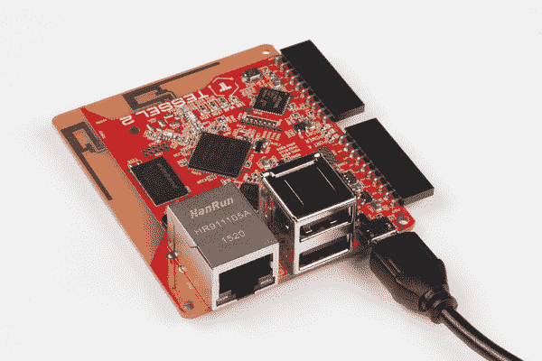](https://cdn.sparkfun.com/assets/learn_tutorials/5/2/3/J5_SIK_Projects-04.jpg)

一旦您的 Tessel 2 启动(蓝色 LED 将保持稳定而不是闪烁)，在您的终端中键入以下命令:

`t2 list`

`t2-cli`工具将寻找连接的镶嵌。Tessels 可以通过 USB 或 WiFi 连接，但现在它应该可以发现你的单个 USB 连接的 Tessel。您会看到类似这样的内容:

[](https://cdn.sparkfun.com/assets/learn_tutorials/5/2/3/j5ik_tessel_t2_list.png)

成功！你现在可以和你的 Tessel 2 沟通了！

### 命名您的 Tessel 2

给你的 Tessel 2 起一个名字并不是使用它的必要条件，但是它很有趣也很友好。要命名 Tessel 2，请使用以下命令:

`t2 rename [name]`

例如，我们通过键入以下命令将 Tessel 2 重命名为“Bishop ”:

`t2 rename bishop`

`t2-cli`工具将响应以下输出:

[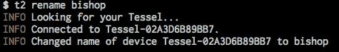](https://cdn.sparkfun.com/assets/learn_tutorials/5/2/3/hw_setup_t2_rename.png)

仔细检查一下！

`t2 list`

[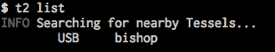](https://cdn.sparkfun.com/assets/learn_tutorials/5/2/3/hw_setup_t2_rename_list.png)

### 将您的 Tessel 2 连接到互联网

如果您曾经配置过其他嵌入式系统并将其连接到互联网上，这种简单性应该会让您咧嘴一笑。

你需要先连接到本地 WiFi 网络。要将 Tessel 连接到 WiFi 网络，请在终端中键入以下命令:

`t2 wifi -n [SSID] -p [password]`

将`[SSID]`替换为您的无线网络名称(小心，区分大小写！)和`[password]`(嗯，我打赌你能想出来！).

您将看到类似如下的一些输出:

```
INFO Looking for your Tessel...
INFO Connected to bishop.
INFO WiFi Enabled.
INFO WiFi Connected. SSID: your-network-ssid, password: your-network-password, security: psk2 
```

就是这样——简单得像馅饼！

你可以用你的 Tessel 和网络连接做很多其他的事情。Tessel 的网站上有关于 WiFi 连接选项的深入[文档。](https://tessel.io/docs/cli#usage)

#### 解决纷争

注意:像 Kindles 和一些 Androids 一样，Tessel 2s 在 5GHz WiFi 网络下表现不佳。

### 设置您的 Tessel 2

您的 Tessel 存在，有名称，并连接到您的 WiFi 网络。下一步是*提供*Tessel。这将在您的计算机和 Tessel 之间创建一个安全、可信的连接，无论它是有线连接还是无线连接(WiFi)。在将代码部署到 Tessel 之前，您需要这样做。

在终端中键入以下命令:

`t2 provision`

您会看到类似这样的内容:

```
INFO Looking for your Tessel...
INFO Connected to bishop.
INFO Creating public and private keys for Tessel authentication...
INFO SSH Keys written.
INFO Authenticating Tessel with public key...
INFO Tessel authenticated with public key. 
```

验证它是否有效:

`t2 list`

你会看到你的特塞尔两次！那是因为是通过 USB *和* WiFi 连接的。

```
INFO Searching for nearby Tessels...
USB bishop
LAN bishop 
```

太好了！我们还有最后一个设置步骤。

### 更新你的宇宙 2

Tessel 社区正在不断改进 Tessel 2 的软件和固件。很可能在你的 Tessel 2 生产到现在这段时间，固件已经更新了。要更新 Tessel，请在终端中键入以下命令:

`t2 update`

更新过程可能会持续一段时间，所以我建议在此期间休息一下或者查看一些新闻。当更新完成后，您将返回命令提示符，并且您已经准备好使用您的 Tessel 2 了！

## 用 Johnny-Five 和 JavaScript 闪烁 LED

让一个 [LED(发光二极管)](https://learn.sparkfun.com/tutorials/light-emitting-diodes-leds)闪烁是最基本的“你好，世界！”锻炼硬件，是熟悉新平台的好方法。在这个实验中，你将学习如何构建一个基本的 LED [电路](https://learn.sparkfun.com/tutorials/26)并使用 [Johnny-Five](http://johnny-five.io) 和你的 [Tessel 2](https://tessel.io/) 使 LED 闪烁和脉冲。在此过程中，您将了解数字输出和脉宽调制(PWM)。

也许你以前通过写草图(程序)控制过 led。使用 Johnny-Five + [Node.js](https://nodejs.org/) 来控制硬件有点不同，本文将说明其中的一些差异。如果你对这一切完全陌生，不要担心！你不需要任何先前的经验。

如果你有使用 Tessel 2 的经验，你就会知道它是用 JavaScript 和 Johnny-Five 框架编程的，能够控制主板上的 I/O。如果您以前从未使用 JavaScript 或 Tessel 2 编程，我们强烈建议您查看 [Johnny-Five Inventor's Kit 实验指南](#)以获得更深入的解释和探索。

下面是一个使用 Node.js 和 Johnny-Five 的 blink 脚本示例。

```
language:javascript
var Tessel = require("tessel-io");
var five = require("johnny-five");

var board = new five.Board({
  io: new Tessel()
});

board.on("ready", () => {
  var led = new five.Led("L2");
  led.blink(500);
}); 
```

为了确保在 Tessel 2 上一切正常，让我们像在软件安装部分那样创建一个项目目录，安装所需的 Node.js 模块，并将该文件添加到我们的目录中。我们可以通过控制台使用以下命令来实现这一点:

`mkdir myProject;`
`cd myProject;`
`npm init -y;`
`npm install johnny-five tessel-io;`


这些命令按顺序执行以下操作:

1.  创建一个名为`myProject`的目录(文件夹)
2.  改变目录，或移入`myProject`
3.  在`myProject`中启动一个 npm 项目，这会创建一个 package.json
4.  安装需要的库，这里是`johnny-five`和`tessel-io`，使用`npm`为我们安装；这些文件将被放在一个名为`node_modules`的目录中
5.  使用`touch`命令在`myProject`目录下创建一个名为`blink.js`的空白文件

完成后，打开您最喜欢的文本编辑器(一个选择是 [atom](https://atom.io) )并导航到您的`blink.js`文件。将上面的 blink 代码复制并粘贴到您的文件中，然后保存。

从这里，您可以通过导航到您的`myProject`目录并在您的终端提示符下键入以下命令来运行`blink.js`:

`t2 run test.js`

您的终端应该输出类似于下面的一些信息...

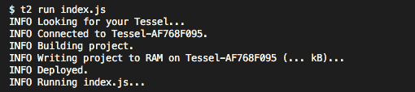

然后应该会出现 REPL 提示符...


...你的一个板载发光二极管应该在闪烁...

[https://www.youtube.com/embed/wHjAjuBseYs/?autohide=1&border=0&wmode=opaque&enablejsapi=1](https://www.youtube.com/embed/wHjAjuBseYs/?autohide=1&border=0&wmode=opaque&enablejsapi=1)

成功！您的 Tessel 2 已经启动并运行，您已经向基于 JavaScript 的机器人和物联网应用迈出了第一步。用你新发现的超能力继续前进吧。

## 进一步发展的资源

### 使用 Tessel 2 查看这些项目教程

*   [太阳升机](https://learn.sparkfun.com/tutorials/sunrise-machine-with-the-tessel-2)
*   [重组机器人](https://learn.sparkfun.com/tutorials/reconbot-with-the-tessel-2)
*   [家庭环境监控](https://learn.sparkfun.com/tutorials/environmental-monitoring-with-the-tessel-2)

[](https://learn.sparkfun.com/tutorials/reconbot-with-the-tessel-2) [### 用 Tessel 2 重组机器人](https://learn.sparkfun.com/tutorials/reconbot-with-the-tessel-2) Build a robot with the Tessel 2 that you can control from a browser on your phone or laptop.[Favorited Favorite](# "Add to favorites") 8[](https://learn.sparkfun.com/tutorials/environmental-monitoring-with-the-tessel-2) [### 使用 Tessel 2 进行环境监控](https://learn.sparkfun.com/tutorials/environmental-monitoring-with-the-tessel-2) Build an air-conditioner monitoring device to collect environment information and store it in the cloud.[Favorited Favorite](# "Add to favorites") 7[](https://learn.sparkfun.com/tutorials/logging-data-to-google-sheets-with-the-tessel-2) [### 使用 Tessel 2 将数据记录到 Google Sheets](https://learn.sparkfun.com/tutorials/logging-data-to-google-sheets-with-the-tessel-2) This project covers how to log data to Google Sheets two ways: using IFTTT with a web connection or a USB pen drive and "sneakernet" without.[Favorited Favorite](# "Add to favorites") 1[](https://learn.sparkfun.com/tutorials/thumb-joystick-hookup-guide) [### 拇指操纵杆连接指南](https://learn.sparkfun.com/tutorials/thumb-joystick-hookup-guide) Whether you're blasting aliens, driving a robot, or write your awesome classic Arcade Game for your Arduino, you'll find the analog thumb joystick a very useful addition to your projects 4

### 看看这个实验指南

*   [约翰尼-五个发明家的工具包实验指南](https://learn.sparkfun.com/tutorials/experiment-guide-for-the-johnny-five-inventors-kit)

[](https://learn.sparkfun.com/tutorials/experiment-guide-for-the-johnny-five-inventors-kit) [### Johnny-Five 发明人工具包实验指南

#### 2016 年 6 月 28 日](https://learn.sparkfun.com/tutorials/experiment-guide-for-the-johnny-five-inventors-kit) Use the Tessel 2 and the Johnny Five Inventors kit to explore the world of JavaScript enabled hardware through 14 awesome experiments 8

### 有用的链接

*   [Johnny-Five 网站](http://johnny-five.io/)
*   [Tessel 网站](https://tessel.io)
*   [Node.js 文档](https://nodejs.org)**