# TJBot 入门

> 原文：<https://learn.sparkfun.com/tutorials/getting-started-with-tjbot>

## 介绍

TJBot 是 IBM 开发的一个工具包，用来帮助人们开始使用他们的沃森人工智能服务。它配有一个你自己制作的友好的小机器人，一个树莓 Pi 3，以及让你的机器人挥手、眨眼、说话和倾听所需的所有部件。

[](https://www.sparkfun.com/products/14515) 

### [IBM TJBot，沃森创客套装](https://www.sparkfun.com/products/14515)

[Out of stock](https://learn.sparkfun.com/static/bubbles/ "out of stock") KIT-14515

用 TJBot 编写你自己的人工智能机器人有一些乐趣，TJBot 是一个自己学习、实验和探索人工智能的模板

3[Favorited Favorite](# "Add to favorites") 21[Wish List](# "Add to wish list")

### 必需的设置工具

作为台式机，这些设备是必需的:

*   USB 鼠标
*   USB 键盘
*   HDMI 监视器/电视/ [适配 VGA](https://www.sparkfun.com/products/12613)
*   [5V 电源](https://www.sparkfun.com/products/13831)

## 入门指南

在您做任何其他事情之前，我们建议您设置您的 Raspberry Pi，将其连接到互联网，并更新操作系统。我们来帮你解决这个问题。

### 设置 Pi

**Note:** With a minimum setup, you can boot the Raspberry Pi 3 by connecting the micro USB’s PWR IN port with a computer’s USB port. However, we recommend looking at getting this power supply [Wall Adapter Power Supply - 5.1V DC 2.5A (USB Micro-B)](https://www.sparkfun.com/products/13831).

像连接任何计算机一样连接显示器、键盘和鼠标。插入 TJBot 套件附带的 microSD 卡，然后插上电源。只有一个地方可以插入电源:标有“PWR IN”的 micro-B USB 连接器。同样，我们推荐我们的 [5.1V 微型 USB 电源](https://www.sparkfun.com/products/13831)为您的 TJBot 供电。

接通电源并让 Pi 启动后，您应该会在屏幕上看到类似如下的图像:

[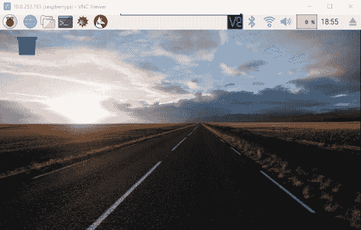](https://cdn.sparkfun.com/assets/learn_tutorials/7/0/7/startup.png)

美国用户可能希望将键盘布局从英国改为美国，因为英国布局在你意想不到的地方有一些键。为此，打开树莓菜单，选择“**首选项**，然后选择“**鼠标和键盘设置**”。

[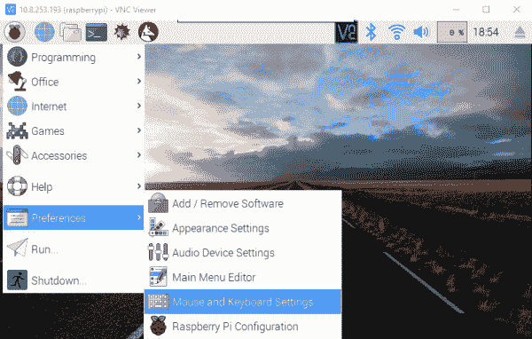](https://cdn.sparkfun.com/assets/learn_tutorials/7/0/7/mouse_kb_settings.png)

在“**键盘**标签下，你会发现一个名为“**键盘布局”的按钮...**”。在点按该按钮时弹出的窗口中找到您喜欢的键盘布局。

### 安装 TJBot

安装 TJBot 是通过一个脚本完成的，这个脚本可以通过一个命令运行。命令是:

```
curl -sL http://ibm.biz/tjbot-bootstrap | sudo sh - 
```

复制该行并粘贴到终端窗口中。通过点击下图中突出显示的屏幕顶部栏中的按钮，打开一个终端窗口。

[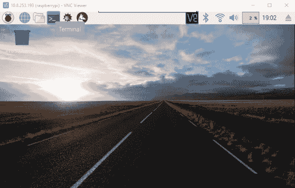](https://cdn.sparkfun.com/assets/learn_tutorials/7/0/7/cmd_prompt.png)**Note:** The keyboard shortcut to copy highlighted text is **ctrl+c**. However, this is different in terminal windows. You would need to hold **shift+ctrl+c** at the same time. So if you were to use the keyboard shortcut to paste the copied text in a terminal window, the standard **ctrl+v** will not work. You would need to press down the three keys **shift+ctrl+v** simultaneously.

将这行代码粘贴到终端窗口后，按键盘上的 **Enter** 键。这将从互联网上下载最新版本的 TJBot 引导脚本。你会看到一个类似这样的窗口:

[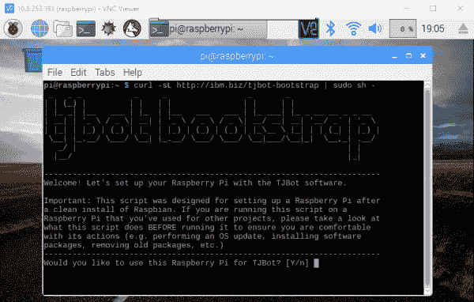](https://cdn.sparkfun.com/assets/learn_tutorials/7/0/7/tjbot_first_prompt.png)

大概，你运行的是你想安装 TJBot 的 Raspberry Pi，所以输入' **y 【T1 ')，然后点击**回车**。**

系统会提示您输入 TJBot 的名称。随意命名 TJBot，或者点击**回车**保持不变。真的没关系，我保证。

然后会询问您是否希望禁用 ipV6。再次键入' **y** '并点击**回车**。

下一个问题是是否使用谷歌的域名服务器来加速 DNS 查询。再次点击“ **y** ，然后**进入**。

然后，该脚本将询问您是否希望"**将区域设置强制为美国英语(en-US)** "你可以随意回答“是”或“否”,但如果你是美国用户，回答“是”是有意义的。

### 升级树莓 Pi 上的操作系统

您现在应该会看到如下所示的提示:

[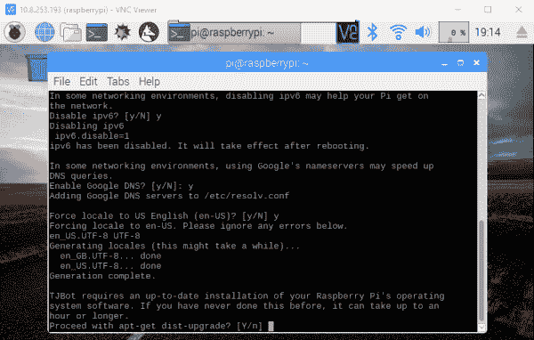](https://cdn.sparkfun.com/assets/learn_tutorials/7/0/7/dist-upgrade-prompt.png)

这个脚本问了一个听起来有点吓人的关于升级你的 Raspberry Pi 操作系统的问题。它警告说，这可能需要一个小时或更长时间(吞咽)！不要担心，根据我们的经验，根据您的互联网连接速度，大约需要 10 分钟或更短时间。在任何情况下，你都需要再次输入' **y** ，然后点击**回车**开始更新过程。升级过程运行时，请密切关注屏幕，但由于整个升级过程是自动进行的，因此您不需要密切监视屏幕。在这个过程中，一屏接一屏的文本会滚动过去，你不需要担心这些。

### 安装 Node.js

升级过程完成后，您会看到这个提示，询问您是否要安装更新版本的 *Node.js* 。

[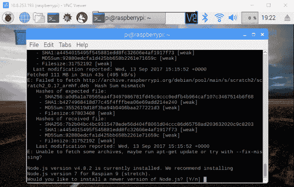](https://cdn.sparkfun.com/assets/learn_tutorials/7/0/7/node_prompt.png)

再次，这个问题回答是。回答是之后，马上会问你要安装哪个版本的*node . js*(6 或 7)。键入' **7 【T3 ' '，然后点击**回车**。当脚本下载并安装 *Node.js version 7* 到您的 Raspberry Pi 时，您会看到另外几个屏幕的文本。**

**Note:** As of 12/16/2018, version 9 of Node.js is recommended by the install package.

安装 *Node.js* 后，脚本会询问你是否安装了摄像头。如果您没有购买相机，请回答没有，因为 TJBot 套件不附带相机。

下一个问题是关于“克隆”TJBot 项目，以及应该克隆到哪里。在这种情况下，克隆实际上只意味着下载。下载的默认位置是桌面，这和其他地方一样好，也比很多地方好。所以只需点击**回车**键，将 TJBot 项目下载到桌面。

现在，您将看到如下所示的屏幕。

[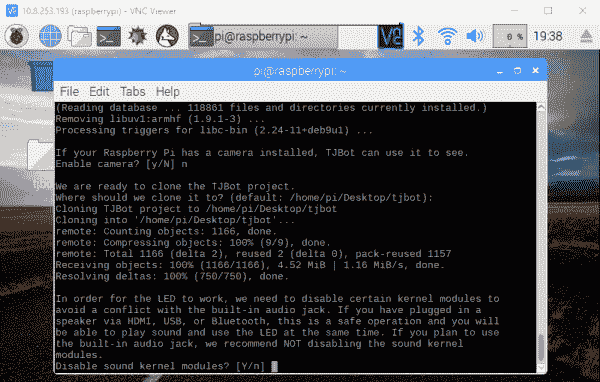](https://cdn.sparkfun.com/assets/learn_tutorials/7/0/7/sound_kernel_module.png)

脚本询问“禁用声音内核模块？”由于 SparkFun 的 TJBot 套件使用音频插孔进行声音输出，而不是 HDMI 或 USB 输出选项，因此您需要在此处点击“ **n** ”。**如果你对这个问题的回答是肯定的，音频将不会在以后的 TJBot 项目中工作，你会很难过。**

[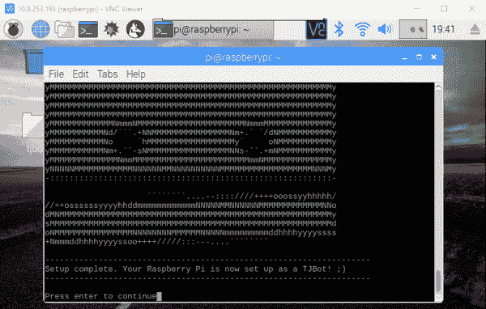](https://cdn.sparkfun.com/assets/learn_tutorials/7/0/7/tjbot_done.png)

### 结束吧。

现在你将看到 TJBot 面部的 ASCII 艺术渲染，一条消息说设置完成，并邀请你点击**回车**继续。继续并点击**进入**。

现在，您将看到一整屏关于注册免费 IBM Bluemix 帐户、如何登录、创建服务实例、获取凭证以及其他内容的文本！我们现在忽略它，因为在接下来的页面中，我们将引导您完成该窗口中的所有步骤。

最后，会询问您是否要运行硬件测试。我建议回答“否”,因为我们在安装过程中所做的一些更改可能会导致这些测试失败，即使没有任何问题。

最后一个问题是:“现在要重启吗？”您可以回答' **yes** 立即重启，或者' **no** 稍后重启。我建议直接回答“**是**”。

## IBM 云

TJBot 的神奇力量来自 IBM 的人工智能服务 Watson。为了使用 Watson，你需要创建一个免费的 IBM Cloud 帐户。

我们现在将带您注册一个 IBM Cloud 帐户。

### 注册一个 IBM 帐户

你需要去这个网站注册一个 IBM 账户。然后，您将能够使用您创建的 IBMid 登录到 IBM Cloud 网站。

[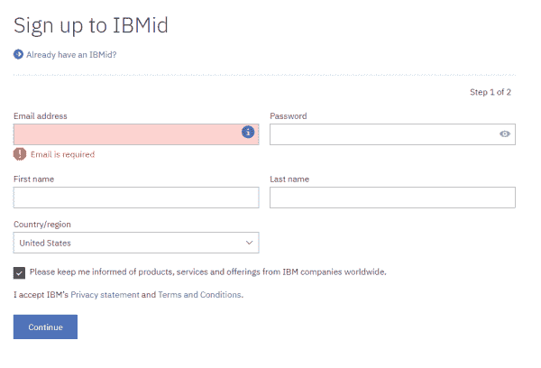](https://cdn.sparkfun.com/assets/learn_tutorials/7/0/7/new_ibm_id.png)

填写空白处创建一个帐户，然后检查您的电子邮件。您应该会收到一条来自 IBM 的带有 7 位数确认码的新消息。如下所示，在字段中输入代码。

[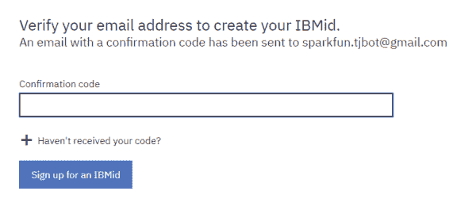](https://cdn.sparkfun.com/assets/learn_tutorials/7/0/7/confirmation_code.png)

一旦您输入了您的确认码，您将被带到您的 IBM 帐户仪表板。这里唯一要做的就是使用右上角的菜单注销，如下所示。

[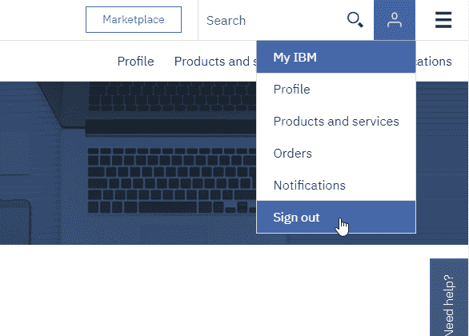](https://cdn.sparkfun.com/assets/learn_tutorials/7/0/7/logout.png)

### 登录 IBM Cloud

现在可以登录 IBM Cloud 网站了。[点击此链接](https://console.bluemix.net/registration/)进入 IBM Cloud 注册页面。

**Heads up!** For the rest of this tutorial, you may see the term "Bluemix" in some images. This is the older name for the IBM Cloud. Everything else should be the same, just mentally substitute "IBM Cloud" for "Bluemix", okay?[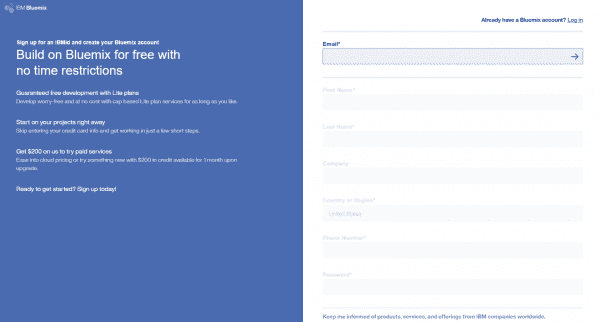](https://cdn.sparkfun.com/assets/learn_tutorials/7/0/7/bluemix_signup.png)

输入您用于 IBMid 的电子邮件地址，然后点击**进入**。你会被要求提供一个电话号码。

[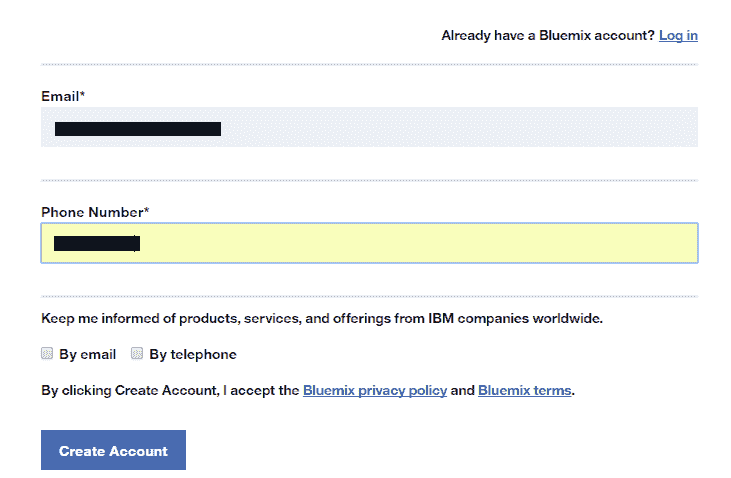](https://cdn.sparkfun.com/assets/learn_tutorials/7/0/7/signup_2.png)

点击“**创建帐户**”后，您将被要求完成反垃圾邮件验证码，然后您将被带到以下页面:

[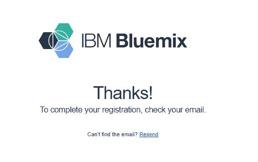](https://cdn.sparkfun.com/assets/learn_tutorials/7/0/7/bluemix_success.png)

您将很快收到一封带有帐户确认链接的电子邮件，如下图所示。

[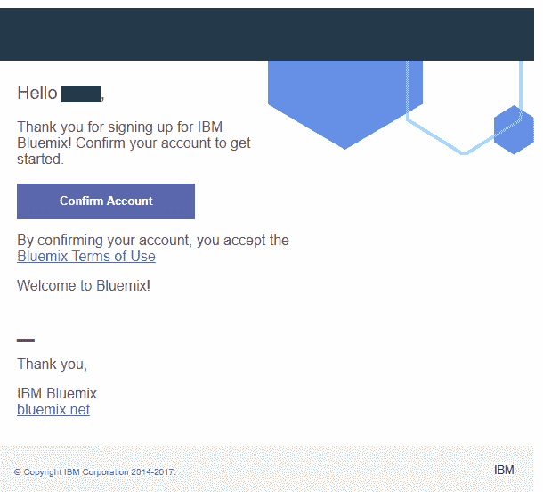](https://cdn.sparkfun.com/assets/learn_tutorials/7/0/7/conf_email.png)

点击“**确认账户**按钮，让 IBM 的云团队知道你是一个真实的人。这将打开此页面:

[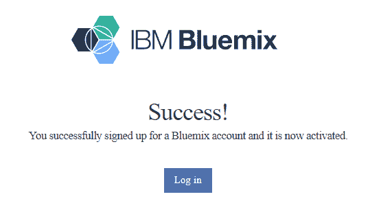](https://cdn.sparkfun.com/assets/learn_tutorials/7/0/7/bluemix_success2.png)

点击蓝色的**登录**按钮，自动登录 IBM Cloud。

### 设置 IBM Cloud

现在将要求您“说出您的组织”。这没什么大不了的，你可以随意称呼它，但是保持它的简短和易于打印是个好主意，以便以后使用。

[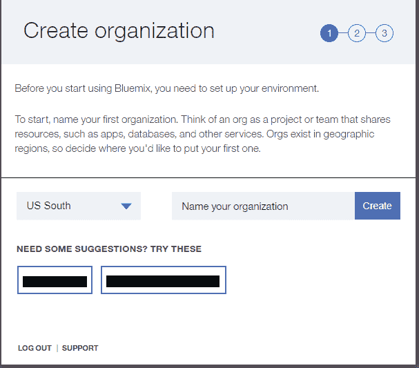](https://cdn.sparkfun.com/assets/learn_tutorials/7/0/7/create_org.png)

创建组织后，您需要创建一个空间。再说一次，名字并不重要。我选了“测试”。

[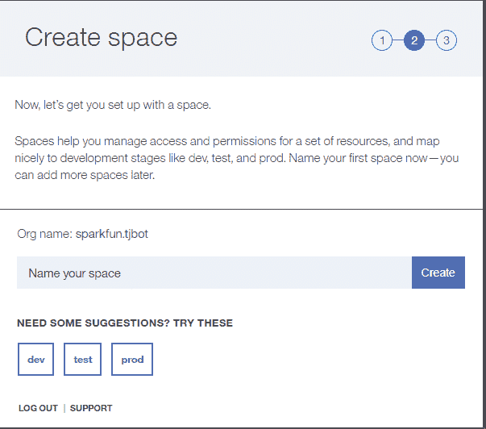](https://cdn.sparkfun.com/assets/learn_tutorials/7/0/7/name_space.png)

你现在会被通知你的帐户是“好去！”并获得您刚刚创建的组织和空间名称的摘要。

[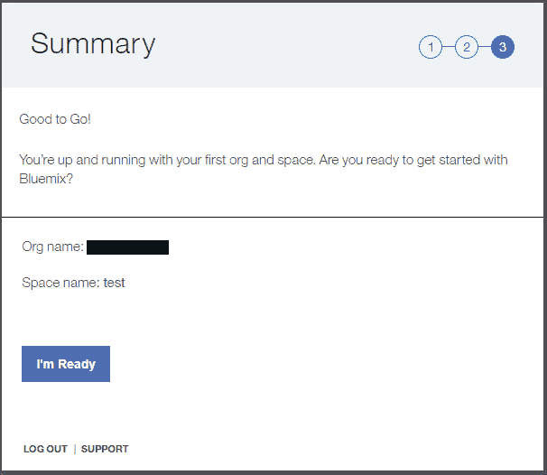](https://cdn.sparkfun.com/assets/learn_tutorials/7/0/7/summary.png)

点击“**我准备好了**按钮。

### IBM 云仪表板

一旦设置好 IBM Cloud，登录后您将看到 IBM Cloud 仪表板，如下图所示。

[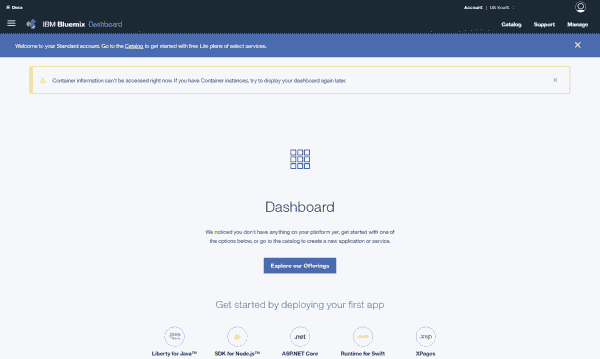](https://cdn.sparkfun.com/assets/learn_tutorials/7/0/7/dashboard.png)

从现在开始，当您登录您的 IBM Cloud 帐户时，您将从这里开始。我们需要完成的最后一步是设置支付信息，这样我们就可以访问使 TJBot 活跃起来所需的付费服务。

首先选择仪表板右上角“**管理**菜单下的“**计费**选项，如下图所示。

[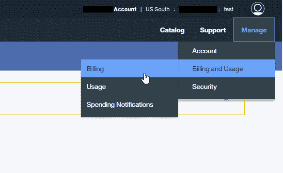](https://cdn.sparkfun.com/assets/learn_tutorials/7/0/7/bluemix_billing.png)

这将打开这一页。点击页面中间的**添加信用卡**按钮。

[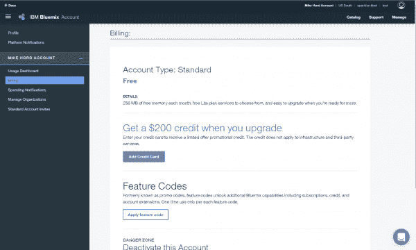](https://cdn.sparkfun.com/assets/learn_tutorials/7/0/7/upgrade_page.png)

你会看到这个相当标准的账单信息表格。填写并提交。

[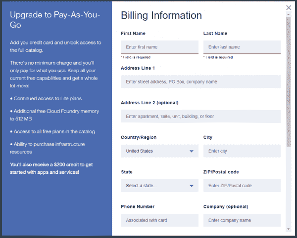](https://cdn.sparkfun.com/assets/learn_tutorials/7/0/7/payment_info.png)

现在，您应该自豪地成为升级后的 IBM Cloud 帐户的所有者。现在，您已经准备好完成本教程的后续步骤。现在，让我们和 TJBot 一起玩吧！

**Note:** The payment section has moved to **Account** > **Account Settings** instead of **Billing and Usage** > **Billing**.

However, as of 12/26/2018, you can bypass this step:

*   在你的网络浏览器上打开第二个标签，调出你想要添加的服务的“精简”版本(见下面的例子)。
*   当“创建”按钮变灰时，返回支付页面并点击“添加信用卡”。
*   无需输入任何信息，返回到“lite”服务选项卡,“Create”按钮应该是蓝色的，并且可用。

You will need to do this everytime you wish to add a service; otherwise, you can just follow the steps above. This is subject to change if IBM changes the operation of their services page.

## 语音控制和 LED

我们的第一个项目是设置 TJBot 来语音控制一个可寻址的 LED。首先，我们需要将 LED 连接到 TJBot。

### LED 连接

首先找到 TJBot 套件中的一个 led。它应该看起来像下面的图片，大小和铅笔橡皮擦差不多。

[](https://cdn.sparkfun.com/assets/learn_tutorials/7/0/7/led_diag.jpg)*Diagram courtesy Maryam @ IBM*

你现在需要连接这个 LED 到树莓派。找到套件中包含的 F/F 跳线，并按照下图连接 LED。

[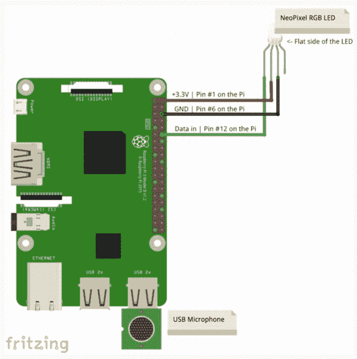](https://cdn.sparkfun.com/assets/learn_tutorials/7/0/7/fritzing_diag_one.jpg)*Diagram courtesy Maryam @ IBM*

### USB 麦克风连接

现在是时候将 USB 麦克风插入 Raspberry Pi 上的一个 USB 端口了。插哪个端口不重要，插上就行。

### 在 IBM Cloud 上设置语音转文本实例

回到 IBM Cloud 仪表盘，点击汉堡菜单(你知道这叫汉堡菜单吗？你每天都学到新东西！)在左上角。

[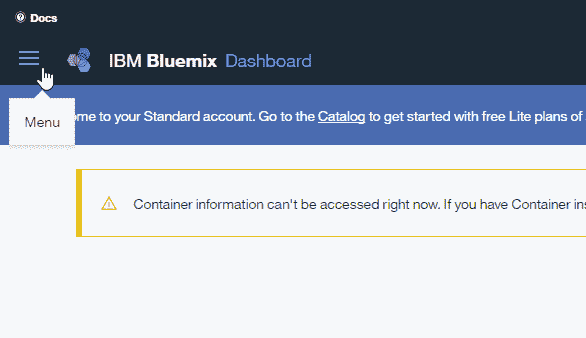](https://cdn.sparkfun.com/assets/learn_tutorials/7/0/7/hamburger_menu.png)

页面的左边会弹出一个菜单。在这个菜单中找到“ **Watson** ”的条目(它在底部附近，你可能需要滚动来找到它)并点击它。

[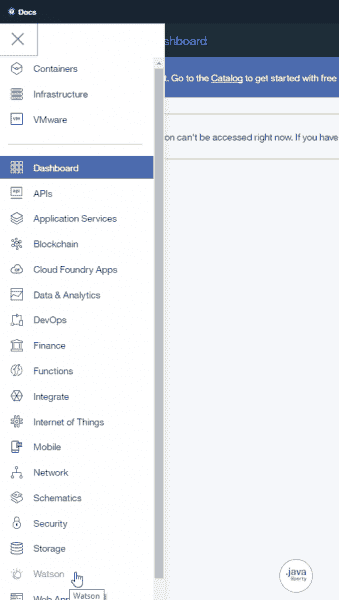](https://cdn.sparkfun.com/assets/learn_tutorials/7/0/7/watson.png)

您将被告知您还没有任何 Watson 服务实例，并被邀请创建一个。点击**创建沃森服务**按钮。

[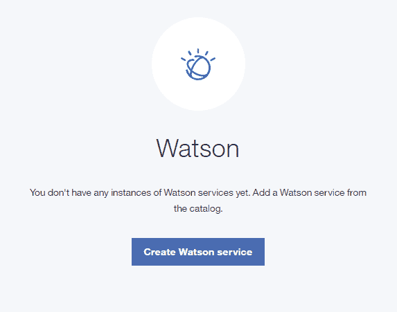](https://cdn.sparkfun.com/assets/learn_tutorials/7/0/7/create_watson_Service.png)

这将打开这个页面，列出所有可用的 Watson 服务。

[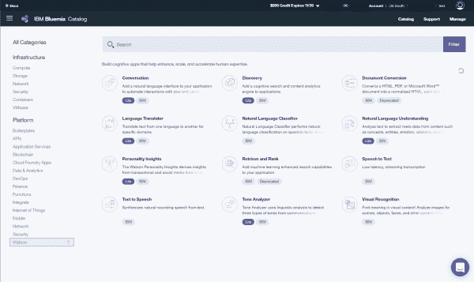](https://cdn.sparkfun.com/assets/learn_tutorials/7/0/7/services.png)

点击“**语音转文字**部分，调出设置选项页面。

[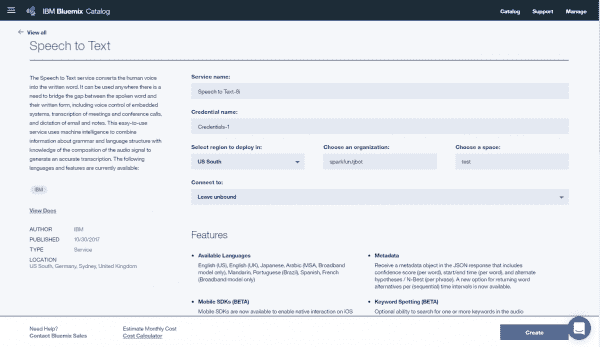](https://cdn.sparkfun.com/assets/learn_tutorials/7/0/7/speech_to_text.png)

你只需要点击“**创建**按钮，你就可以开始工作了。默认值可以保留不变。

您将被带到此页面。我们将需要为我们的"**语音到文本**"实例获取凭证，因此单击页面左边的"**服务凭证**"。

[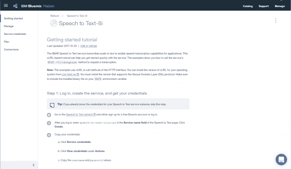](https://cdn.sparkfun.com/assets/learn_tutorials/7/0/7/stt_next_page.png)

这将打开这一页。要查看您的凭证，请点击页面中间**操作**下的“**查看凭证**”下拉菜单。

[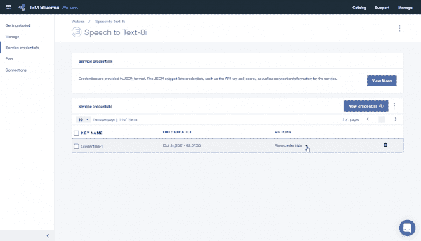](https://cdn.sparkfun.com/assets/learn_tutorials/7/0/7/stt_credentials.png)

### 将凭证复制到 Raspberry Pi 配置文件中

现在我们需要将这些凭证复制到 Raspberry Pi 上的一个文件中。如果到目前为止您还没有使用过 Raspberry Pi，那么最简单的方法可能就是登录到 Pi，然后在 Pi 的 web 浏览器上打开 IBM Cloud 网站。

您需要修改的文件位于“**Desktop/tjbot/recipes/speech _ to _ text**中，文件名为“ *config.default.js* ”。双击文件将在文本编辑器中打开它。然后，您可以复制并粘贴新信息。

[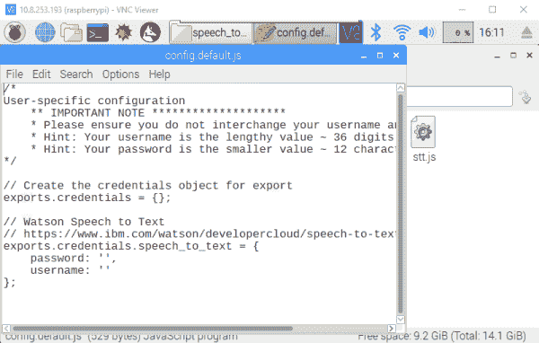](https://cdn.sparkfun.com/assets/learn_tutorials/7/0/7/config_default_js_STT.png)

将网页中的“用户名”和“密码”复制并粘贴到文本文档中。注意，两者的顺序是对调的！在网页上，用户名在密码上面，但是在文本文档中，密码在用户名上面。一旦你输入了信息，你需要"**另存为...**"文档更改名称。新名字是“ *config.js* ”。*你必须这样做，否则配方会失败。*

**Note:**
The credentials on the IBM AI/Watson Speech-to-Text Services page have been changed to an API format:

```
{
  "apikey": "**XXXXXXXXXXXXXXXXXXXXXXXXXXXXXXXXXXXXXXXXXXXX**",
  "iam_apikey_description": "Auto generated apikey during resource-key operation for Instance - crn:v1:bluemix:public:speech-to-text:XXXXXXX:XXXXXXXXXXXXblah-blah-blahXXXXXXXXXXXXXXXX",
  "iam_apikey_name": "auto-generated-apikey-**XXXXXXXX-XXXX-XXXX-XXXX-XXXXXXXXXXXX**",
  "iam_role_crn": "XXXXXXXXXXblah-blah-blahXXXXXXXXXXX",
  "iam_serviceid_crn": "XXXXXXXXXblah-blah-blahXXXXXXXXXXX",
  "url": "https://stream.watsonplatform.net/speech-to-text/api"
} 
```

**USERNAME:**
Your username is contained in the **iam_apikey_name** entry, but only the **XXXXXXXX-XXXX-XXXX-XXXX-XXXXXXXXXXXX** section. Exclude the *auto-generated-apikey-* part of that entry.

```
 "iam_apikey_name": "auto-generated-apikey-XXXXXXXX-XXXX-XXXX-XXXX-XXXXXXXXXXXX",
```

**PASSWORD:**
Your password/API key is contained in the **apikey** entry; it should be in this structure, **XXXXXXXXXXXXXXXXXXXXXXXXXXXXXXXXXXXXXXXXXXXX**. You will need to modify the input of the *config.js* file from **password** to **apikey**.

```
 "apikey": "XXXXXXXXXXXXXXXXXXXXXXXXXXXXXXXXXXXXXXXXXXXX",
```

* * *

Your **config.js** file should have the following format:

```
/*
 * User-specific configuration
 * IMPORTANT NOTES:
 *  Please ensure you do not interchange your username and password.
 *  Your username is the longer value: 36 digits, including hyphens
 *  Your password is the smaller value: 12 characters
*/

// Create the credentials object for export

exports.credentials = {};

// Watson Speech to Text
// https://www.ibm.com/watson/services/speech-to-text/
exports.credentials.speech_to_text = {
    apikey: 'XXXXXXXXXXXXXXXXXXXXXXXXXXXXXXXXXXXXXXXXXXXX',
    username: 'XXXXXXXX-XXXX-XXXX-XXXX-XXXXXXXXXXXX'
}; 
```

For further issues, check the [TJBot GitHub repository](https://github.com/ibmtjbot/tjbot/issues) for posted issues. This information is noted under [Issue #104](https://github.com/ibmtjbot/tjbot/issues/104).

#### 安装并运行语音转文本示例

现在，在 Pi 上打开一个命令行并运行以下命令:

```
cd Desktop/tjbot/recipes/speech_to_text
npm install
sudo node stt.js 
```

完成`npm install`步骤需要一些时间。一旦您发出了`node stt.js`命令，您将会看到:

[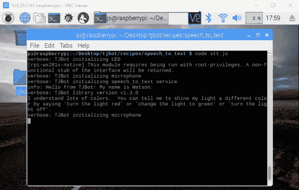](https://cdn.sparkfun.com/assets/learn_tutorials/7/0/7/stt_running.png)

您现在可以向 TJBot 发出命令来改变 LED 的颜色，例如“**将灯变成红色**”、“**将灯变成蓝色**”或“**将灯关掉**”。很漂亮，是吧？尝试语音命令来改变 LED 的颜色。

当你完成后，只需点击 **ctrl+C** 退出脚本。

## 感受推特的语气

我们的下一个项目使用沃森的语气分析器来分析最近的推文，并了解它们的整体情绪基调。

### 创建音调分析器实例

重复上一页中使用的步骤，使用“音调分析器”服务创建一个“语音转文本”实例。同样，保留默认值，并点击“ **Create** ”。

接下来，重复从 IBM Cloud 网站获取凭证的步骤，并将它们插入到 Raspberry Pi 上的文件中。这次，你会在“**桌面/tjbot/recipes/情操 _ 分析**”中找到“ *config.default.js* ”文件。但是，完成这一步后不要关闭它。

### 创建一个 Twitter 应用程序来访问最近的推文

这一步你需要一个 Twitter 账户，所以如果你还没有的话，去 [Twitter](https://twitter.com) 注册一个。

现在去 Twitter 应用网站登录。您应该会看到这样的页面:

[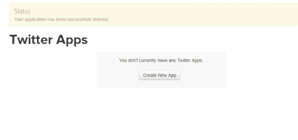](https://cdn.sparkfun.com/assets/learn_tutorials/7/0/7/twitter_apps.png)

点击“创建应用程序”按钮，进入如下页面。填写你认为合适的空格(注意应用名称必须唯一，所以不能重复使用“TJBot”)，点击复选框，然后点击“**创建你的 Twitter 应用**按钮。

[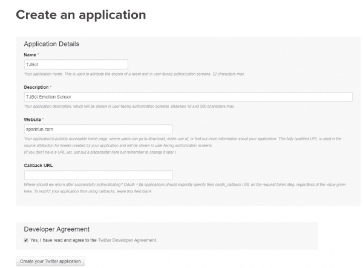](https://cdn.sparkfun.com/assets/learn_tutorials/7/0/7/create_an_app.png)

然后您将看到这个页面，详细介绍创建过程中的一些信息。

[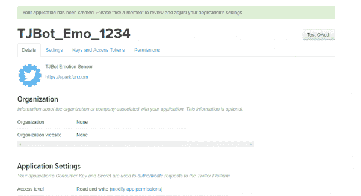](https://cdn.sparkfun.com/assets/learn_tutorials/7/0/7/app_created.png)

在你的应用程序名称的正下方(在页面顶部以粗体字显示)，你会看到一个标题为“**密钥和访问令牌**的标签。点击此处调出此页面:

[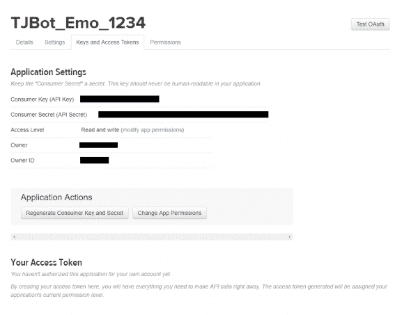](https://cdn.sparkfun.com/assets/learn_tutorials/7/0/7/keys_and_tokens.png)

现在我们需要从这个页面获取一些信息，粘贴到上面打开的配置文件中。正如您在下面看到的，我们需要收集四条与 Twitter 相关的信息。我们将从“**消费者 _ 密钥**和“**消费者 _ 秘密**”开始。这两者在网站上的名称与它们在配置文件中的名称相同；将它们从网站复制并粘贴到配置文件中。

[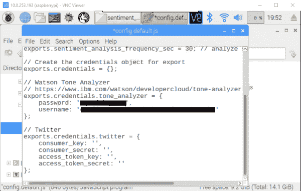](https://cdn.sparkfun.com/assets/learn_tutorials/7/0/7/twitter_info.png)

接下来，我们需要获取“**访问令牌密钥**和“**访问令牌秘密**字段。为此，向下滚动网页，直到您看到“**创建我的访问令牌**”按钮。点击它，你会得到这个屏幕:

[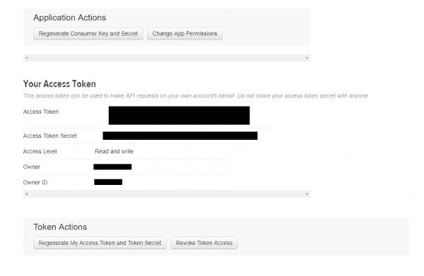](https://cdn.sparkfun.com/assets/learn_tutorials/7/0/7/access_token.png)

将“**访问令牌密钥**”和“**访问令牌秘密**”复制粘贴到配置文件中。然后“**另存为...**"文件并将其命名为" *config.js* "。你已经为下一步做好准备了！

### 启动应用程序！

是时候看看食谱了！像以前一样，在 Raspberry Pi 上打开一个终端窗口，输入以下命令:

```
cd Desktop/tjbot/recipes/sentiment_analysis
npm install
node sentiment.js 
```

请记住，`npm install`步骤需要一些时间来运行，所以请耐心等待。运行完`node sentiment.js`步骤后，您应该会看到如下所示的屏幕:

[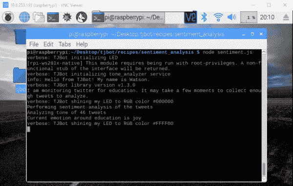](https://cdn.sparkfun.com/assets/learn_tutorials/7/0/7/sentiment_js.png)

这款应用需要一些时间来收集足够的推文(至少 100 条)来运行音调分析器，但当它运行时，它会打印出一行文字，说明围绕它正在搜索的关键词的当前情绪，并改变 LED 的颜色。

当你完成后，只需点击 **ctrl+c** 退出脚本。

## 与 TJBot 对话

我们将探索的最后一个方法使用"**对话**"服务和"**文本到语音**"服务来使 TJBot 至少能够与我们交谈。

### 扬声器连接

在这一点上，我们要将我们的迷你扬声器连接到树莓派。与电源一样，扬声器只能连接到一个地方。如果您愿意，您可以将扬声器的充电电缆连接到 Raspberry Pi 上的 USB 端口，以确保扬声器能够工作并保持充满电。

### 创建沃森服务

和上两个菜谱一样，我们需要创建一个“Conversation”和“ **Text to Speech** ”服务的实例。我们还将使用我们为第一个菜谱创建的“语音转文本”服务。我们需要为这些不同的服务获取凭证，并把它们放入 Raspberry Pi 上的一个配置文件中。这次，你会在“**桌面/tjbot/recipes/conversation** ”下找到“ *config.default.js* ”文件。在文本编辑器中打开它。

从“语音转文本”服务开始。您可以返回到您的仪表板，单击服务的名称，调出左边带有“**服务凭证**的熟悉页面，或者您可以从为第一个配方创建的配置文件中复制凭证。

现在，创建一个“ **Text to Speech** ”实例，使用与前两个菜谱中创建实例相同的方法。同样，您可以保留默认值，只需点击“**创建**”。将凭据复制到文本文档中。

最后，创建一个“会话”实例。这个稍微复杂一点。对于第一部分，它的工作方式与我们创建的其他三个服务相同，因此只需再次遵循这些步骤，并将凭证复制到文本文档中。默认设置将再次满足要求。

我们需要的最后一条重要信息是对话工作区 ID。在文本文件的顶部附近找到空白，就在 Watson“Conversation”服务的凭证区域上方。要获得这个，请访问 [IBM Watson Conversation 网站](https://watson-conversation.ng.bluemix.net/login)，并使用您在 IBM Cloud 网站上使用的 ID 登录。*确保你在私家侦探的网络浏览器上做这件事。*登录后，您会看到这个页面:

[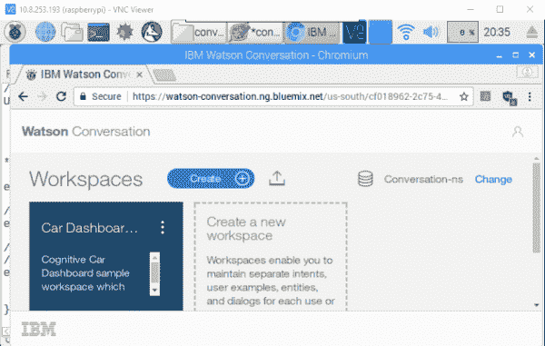](https://cdn.sparkfun.com/assets/learn_tutorials/7/0/7/conversation_workspaces.png)

我们需要上传一个文件，但是首先，我们需要创建一个新的工作空间。点击“**创建**按钮，然后给你的工作区命名(不管你怎么叫它)，再次点击“**创建**按钮。这将带你到这一页。点击页面顶部的“Watson Conversation”返回 Watson Conversation 工作区主页面。

[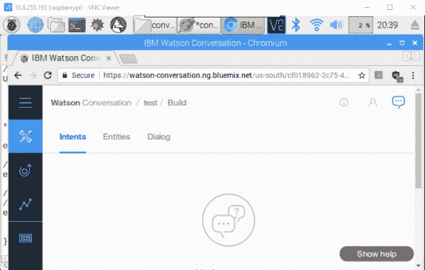](https://cdn.sparkfun.com/assets/learn_tutorials/7/0/7/workspace.png)

你会回到主页。点击“**创建**按钮旁边的小“**上传**按钮(箭头向上的半矩形)。如果将鼠标指针悬停在按钮上，将弹出一个文本框，显示“导入工作区”字样，如下所示。

[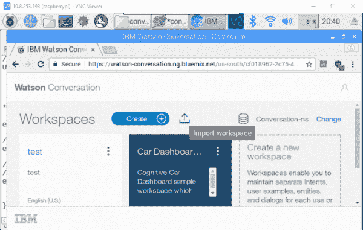](https://cdn.sparkfun.com/assets/learn_tutorials/7/0/7/upload_file.png)

点击那个按钮会打开这个窗口。点击“**选择文件**框，找到文件“**桌面/tjbot/recipes/conversation/workspace-sample . JSON**”。让“**一切**单选按钮高亮显示，然后点击“**导入**”。这将带您进入以下页面:

[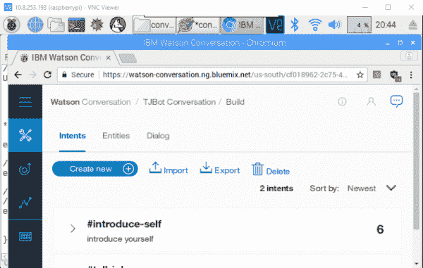](https://cdn.sparkfun.com/assets/learn_tutorials/7/0/7/imported_workspace.png)

点击页面顶部的“Watson Conversation ”,再次返回 Watson Conversation 工作区主页面。

[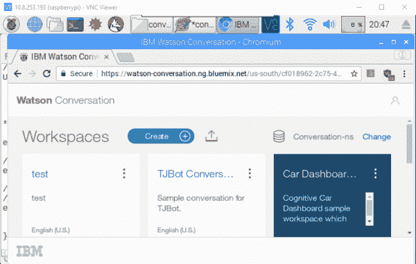](https://cdn.sparkfun.com/assets/learn_tutorials/7/0/7/workspace_find_id.png)

点击“ **TJBot 对话**”框中三个垂直排列的点，选择“**查看详情**”。框架的内容将会改变；在框架中向下滚动，找到工作区 ID，这是我们使这个配方工作所需的最后一条信息！将它从这个网页复制到文本文档中，**另存为...**"文件到文件名" *config.js* "，并关闭。

### 启动应用程序

这部分应该看起来很眼熟。在 Raspberry Pi 上打开一个终端窗口，键入以下三个命令:

```
cd Desktop/tjbot/recipes/conversation
npm install
node conversation.js 
```

再次等待`npm install`完成。输入`node conversation.js`命令后，您会看到:

[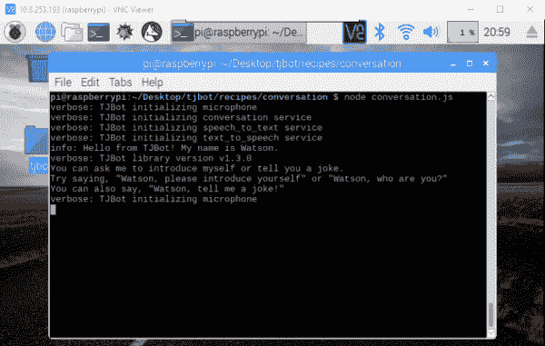](https://cdn.sparkfun.com/assets/learn_tutorials/7/0/7/conversation_result.png)

尝试使用类似“**沃森，给我讲个笑话**”或“**沃森，你是谁？**“你可以要求的事情并不多，但可以尝试不同的提问方式(例如，“**华生，让我们听个笑话**”和“**华生，给我讲个笑话**”一样管用。探索沃森的语言处理能力。

完成后，点击 **ctrl-c** 退出脚本。

## 资源和更进一步

现在您已经成功地启动并运行了 TJBot，是时候将它合并到您自己的项目中了！

有关更多信息，请查看以下资源:

*   [用 TJBot 探索 AI](https://www.research.ibm.com/tjbot/)
*   GitHub 仓库
    *   [TJBot](https://ibmtjbot.github.io/)
    *   [TJBot 食谱](https://github.com/ibmtjbot)
*   指令:TJBot 教程 -访问 TJBot 活动部分的指令！
*   [TJBot 组装](https://www.youtube.com/watch?v=bLt3Cf2Ui3o) -跟随视频组装 TJBot 的纸板结构！